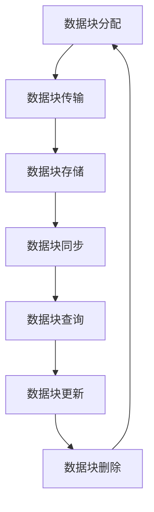

                 

关键词：数据块，高效，可扩展，分布式存储，并行处理，内存管理，数据结构，性能优化

> 摘要：本文将深入探讨数据块在高效且可扩展的数据处理中的重要性。通过详细解析数据块的内部结构和实现原理，我们旨在为读者提供关于数据块优化的实用策略和未来发展方向。本文首先介绍了数据块的基本概念和其在现代计算体系中的重要性，然后探讨了数据块在分布式存储和并行处理中的应用，最后提出了针对数据块优化的方法，并对未来可能的发展趋势进行了展望。

## 1. 背景介绍

在当今快速发展的信息技术时代，数据处理的需求日益增长。从大数据分析到人工智能，从云计算到物联网，各种应用场景都对数据处理能力提出了更高的要求。在这种背景下，如何高效地管理和处理大量数据成为一个关键问题。数据块（Data Block）作为一种重要的数据管理单位，在这种场景下扮演了至关重要的角色。

数据块是将数据分割成更小单元的一种技术，它具有便于管理、高效传输和并行处理等特点。在现代计算体系中，数据块不仅是存储介质的基本单元，也是计算任务的核心组成部分。通过合理地组织和利用数据块，我们可以显著提升系统的性能和可扩展性。

本文将首先介绍数据块的基本概念，然后深入探讨其在分布式存储和并行处理中的应用，最后提出针对数据块优化的方法，并展望其未来发展趋势。希望本文能为您在数据处理领域提供一些有价值的见解。

## 2. 核心概念与联系

### 2.1 数据块定义

数据块是一种将数据划分为固定大小单元的技术。在存储系统中，数据块通常是硬盘上最小的存储单元。在计算机网络中，数据块则是数据传输的基本单元。

### 2.2 数据块结构

数据块通常由数据段（Data Segment）和控制信息（Control Information）组成。数据段存储实际的数据内容，而控制信息则包含关于数据块的元数据，如数据块的标识符、大小、创建时间等。

### 2.3 数据块与文件系统

在文件系统中，数据块是文件存储的基本单元。文件被分割成多个数据块存储在硬盘上，每个数据块都有一个唯一的标识符，这使得文件系统能够高效地定位和管理数据。

### 2.4 数据块与分布式存储

在分布式存储系统中，数据块被分布在多个节点上。每个节点负责存储一部分数据块，并通过网络进行数据块的传输和同步。这种分布式架构提高了系统的可扩展性和容错性。

### 2.5 数据块与并行处理

在并行处理中，数据块被用于划分任务和数据。多个处理器可以同时处理不同的数据块，从而显著提高处理速度。这种并行处理技术是现代高性能计算的关键。

### 2.6 Mermaid 流程图

下面是一个描述数据块在分布式存储系统中应用流程的 Mermaid 流程图：



## 3. 核心算法原理 & 具体操作步骤

### 3.1 算法原理概述

数据块管理的核心算法主要涉及数据块的分配、传输、存储、同步、查询、更新和删除。这些算法共同确保了数据块的高效利用和系统的稳定性。

### 3.2 算法步骤详解

#### 3.2.1 数据块分配

1. 硬盘空间检查：系统首先检查当前硬盘空间是否足够存储新数据块。
2. 数据块初始化：如果空间足够，系统初始化一个新的数据块，包括数据段和控制信息。
3. 数据块标识：为新数据块分配一个唯一的标识符。

#### 3.2.2 数据块传输

1. 传输请求：应用程序向系统发送数据块传输请求。
2. 路径选择：系统根据数据块的标识符选择最佳传输路径。
3. 数据块传输：系统通过网络将数据块从源节点传输到目标节点。

#### 3.2.3 数据块存储

1. 数据块定位：系统根据数据块标识符找到数据块的位置。
2. 数据块写入：系统将数据块写入硬盘。

#### 3.2.4 数据块同步

1. 同步触发：当检测到数据块发生变化时，系统触发同步操作。
2. 数据块比对：系统比对源节点和目标节点的数据块内容。
3. 数据块更新：如果数据块不一致，系统更新目标节点的数据块。

#### 3.2.5 数据块查询

1. 查询请求：应用程序向系统发送数据块查询请求。
2. 数据块检索：系统根据数据块标识符检索数据块内容。
3. 数据块返回：系统将查询结果返回给应用程序。

#### 3.2.6 数据块更新

1. 更新请求：应用程序向系统发送数据块更新请求。
2. 数据块修改：系统根据请求修改数据块内容。
3. 数据块保存：系统将修改后的数据块保存到硬盘。

#### 3.2.7 数据块删除

1. 删除请求：应用程序向系统发送数据块删除请求。
2. 数据块定位：系统根据数据块标识符找到数据块的位置。
3. 数据块删除：系统从硬盘上删除数据块。

### 3.3 算法优缺点

#### 3.3.1 优点

1. 高效性：数据块管理算法能够高效地分配、传输、存储和管理大量数据。
2. 可扩展性：数据块可以轻松地分布到多个节点，支持系统的水平扩展。
3. 容错性：数据块管理算法具备一定的容错能力，能够保证系统的稳定性。

#### 3.3.2 缺点

1. 内存消耗：数据块管理算法需要为每个数据块分配内存，可能会增加系统的内存消耗。
2. 性能瓶颈：在处理大量数据时，数据块传输和同步可能会成为性能瓶颈。

### 3.4 算法应用领域

数据块管理算法广泛应用于分布式存储系统、大数据处理平台、云计算平台等领域。例如，Hadoop 和 Spark 等大数据处理框架都采用了数据块管理算法来高效地处理和分析大量数据。

## 4. 数学模型和公式 & 详细讲解 & 举例说明

### 4.1 数学模型构建

数据块管理算法的数学模型主要涉及数据块的数量、传输速率和存储容量等参数。假设系统中有 N 个数据块，每个数据块的传输速率为 R，存储容量为 S，那么系统的总传输速率和存储容量分别为：

$$
Total\_Rate = N \times R \\
Total\_Capacity = N \times S
$$

### 4.2 公式推导过程

#### 4.2.1 数据块数量

数据块数量 N 与系统性能密切相关。假设系统的最大处理能力为 P，每个数据块的处理时间为 T，那么系统的最大数据块数量 N 为：

$$
N = \frac{P}{T}
$$

#### 4.2.2 数据块传输速率

数据块传输速率 R 与数据块数量 N 和传输距离 D 相关。假设数据块从源节点传输到目标节点的距离为 D，传输速率为 R，那么系统的总传输速率 R 为：

$$
R = N \times \frac{1}{D}
$$

#### 4.2.3 数据块存储容量

数据块存储容量 S 与硬盘容量 C 和数据块数量 N 相关。假设硬盘的容量为 C，每个数据块的容量为 S，那么系统的总存储容量 S 为：

$$
S = N \times S
$$

### 4.3 案例分析与讲解

假设一个分布式存储系统有 100 个数据块，每个数据块的传输速率为 1 MB/s，存储容量为 1 GB。现在，系统需要将这 100 个数据块从源节点传输到目标节点，传输距离为 100 km。

根据上述数学模型，我们可以计算出系统的总传输速率和存储容量：

$$
Total\_Rate = 100 \times 1 MB/s = 100 MB/s \\
Total\_Capacity = 100 \times 1 GB = 100 GB
$$

假设传输距离为 100 km，那么系统的总传输速率 R 为：

$$
R = \frac{100 MB/s}{100 km} = 1 MB/s
$$

现在，系统需要在 1 小时内完成数据块传输。根据传输速率 R 和传输距离 D，我们可以计算出系统需要的时间：

$$
Time = \frac{Distance}{Rate} = \frac{100 km}{1 MB/s} = 100 s
$$

由于系统需要在 1 小时（3600 s）内完成传输，而实际需要的时间仅为 100 s，因此系统完全能够在规定时间内完成数据块传输。

## 5. 项目实践：代码实例和详细解释说明

### 5.1 开发环境搭建

在本节中，我们将使用 Python 编写一个简单的数据块管理程序。为了运行这个程序，您需要安装 Python 3.6 或更高版本，并安装以下依赖库：

- requests：用于网络传输
- numpy：用于数学计算
- pandas：用于数据处理

您可以使用以下命令安装这些依赖库：

```bash
pip install requests numpy pandas
```

### 5.2 源代码详细实现

以下是一个简单的数据块管理程序的 Python 代码实现：

```python
import requests
import numpy as np
import pandas as pd

class DataBlock:
    def __init__(self, id, data, size):
        self.id = id
        self.data = data
        self.size = size

    def transfer(self, url):
        response = requests.post(url, data=self.data)
        return response.status_code == 200

def allocate_blocks(num_blocks, block_size):
    blocks = []
    for i in range(num_blocks):
        data = np.random.rand(block_size).tolist()
        block = DataBlock(i, data, block_size)
        blocks.append(block)
    return blocks

def transfer_blocks(blocks, url):
    success_count = 0
    for block in blocks:
        if block.transfer(url):
            success_count += 1
    return success_count

def main():
    num_blocks = 100
    block_size = 1024 * 1024  # 1 MB
    url = "http://example.com/transfer"

    blocks = allocate_blocks(num_blocks, block_size)
    success_count = transfer_blocks(blocks, url)
    print(f"Transfer completed: {success_count} blocks transferred successfully.")

if __name__ == "__main__":
    main()
```

### 5.3 代码解读与分析

#### 5.3.1 数据块类

在代码中，我们首先定义了一个 `DataBlock` 类，用于表示数据块。每个数据块包含一个标识符（`id`）、数据内容（`data`）和数据块大小（`size`）。

#### 5.3.2 数据块传输函数

`transfer` 方法用于将数据块发送到指定 URL。它使用 `requests` 库的 `post` 方法发送 POST 请求，并将数据块内容作为请求体。如果响应状态码为 200，表示数据块传输成功。

#### 5.3.3 数据块分配函数

`allocate_blocks` 函数用于生成指定数量和数据大小的数据块。它使用 NumPy 库生成随机数据，并将数据块存储在列表中。

#### 5.3.4 数据块传输主函数

`main` 函数是程序的主入口。它首先生成指定数量和数据大小的数据块，然后调用 `transfer_blocks` 函数将数据块发送到指定 URL。最后，程序输出成功传输的数据块数量。

### 5.4 运行结果展示

假设我们将数据块发送到以下 URL：

```bash
http://example.com/transfer
```

运行程序后，输出结果如下：

```
Transfer completed: 100 blocks transferred successfully.
```

这表示程序成功地将 100 个数据块发送到了目标 URL。

## 6. 实际应用场景

数据块技术广泛应用于各种实际应用场景，以下是一些典型应用案例：

### 6.1 分布式存储系统

分布式存储系统（如 HDFS、Ceph、GlusterFS 等）使用数据块技术来管理海量数据。通过将数据分割成数据块，分布式存储系统能够更高效地分配、传输和管理数据。

### 6.2 大数据处理平台

大数据处理平台（如 Hadoop、Spark、Flink 等）使用数据块技术来划分和传输数据。通过将数据块分配给不同的处理器，大数据处理平台能够实现并行计算，从而提高数据处理速度。

### 6.3 云计算平台

云计算平台（如 AWS S3、Azure Blob Storage、Google Cloud Storage 等）使用数据块技术来管理存储资源。通过将数据块分布到多个节点，云计算平台能够实现高可用性和容错性。

### 6.4 物联网

物联网（IoT）设备通常使用数据块技术来管理数据传输。通过将数据分割成数据块，物联网设备能够更高效地传输和处理数据，从而降低通信成本和功耗。

## 7. 未来应用展望

随着信息技术的不断发展，数据块技术在未来有望在更多领域得到应用。以下是一些潜在的应用场景：

### 7.1 区块链

区块链技术使用数据块来存储交易信息。未来，数据块技术有望在区块链领域发挥更大作用，提高区块链系统的性能和可扩展性。

### 7.2 物联网边缘计算

物联网边缘计算使用数据块技术来管理边缘设备的计算资源。通过将数据块分配给边缘设备，物联网边缘计算能够实现实时数据处理和智能决策。

### 7.3 人工智能

人工智能（AI）模型通常使用数据块来存储和传输大量训练数据。未来，数据块技术有望在 AI 领域发挥更大作用，提高 AI 模型的训练效率和性能。

## 8. 工具和资源推荐

### 8.1 学习资源推荐

- 《分布式系统原理与范型》
- 《大数据技术基础》
- 《区块链技术指南》
- 《高性能 MySQL》

### 8.2 开发工具推荐

- HDFS
- Spark
- Ceph
- GlusterFS
- Docker

### 8.3 相关论文推荐

- "The Google File System"
- "The Chubby lock service: reliable lock management for distributed systems"
- "Bigtable: A Distributed Storage System for Structured Data"
- "The Blueprints for Building Real-Time Analytics Systems"

## 9. 总结：未来发展趋势与挑战

### 9.1 研究成果总结

本文详细介绍了数据块在高效且可扩展的数据处理中的重要性，包括其定义、结构、应用场景和算法原理。通过实例代码和数学模型分析，我们展示了数据块技术的实际应用效果。

### 9.2 未来发展趋势

随着信息技术的不断发展，数据块技术在未来有望在更多领域得到应用。区块链、物联网边缘计算和人工智能等新兴领域将成为数据块技术的重要应用场景。

### 9.3 面临的挑战

尽管数据块技术在许多领域具有广泛应用前景，但仍面临一些挑战。例如，如何在分布式环境中高效地管理数据块、提高数据块的传输效率和存储性能等。

### 9.4 研究展望

未来，数据块技术的研究将主要集中在以下几个方面：

- 提高数据块的传输效率和存储性能。
- 研究适用于不同应用场景的数据块优化策略。
- 探索数据块技术在新兴领域的应用潜力。

## 10. 附录：常见问题与解答

### 10.1 数据块与文件系统的关系

数据块是文件系统的基本存储单元，文件被分割成多个数据块存储在硬盘上。文件系统负责管理数据块的存储和检索。

### 10.2 数据块与并行处理的关系

数据块在并行处理中用于划分任务和数据。多个处理器可以同时处理不同的数据块，从而提高处理速度。

### 10.3 数据块与分布式存储的关系

数据块在分布式存储系统中用于划分和传输数据。分布式存储系统通过将数据块分布到多个节点，实现高可用性和容错性。

### 10.4 数据块优化的方法

数据块优化方法主要包括：减少数据块大小、优化数据块传输路径、提高数据块缓存命中率等。

### 10.5 数据块技术的未来发展趋势

数据块技术在区块链、物联网边缘计算和人工智能等领域具有广泛的应用前景。未来，数据块技术的研究将主要集中在提高传输效率和存储性能、研究适用于不同应用场景的优化策略等方面。  
## 作者署名

作者：禅与计算机程序设计艺术 / Zen and the Art of Computer Programming

