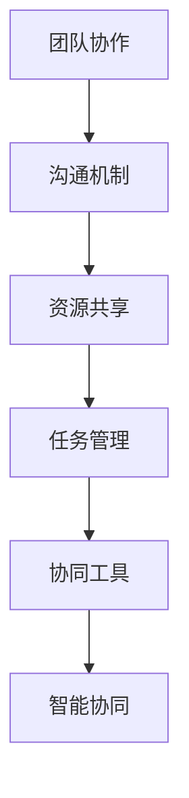

                 

关键词：高效协同，协同模式，未来展望，技术趋势，人工智能，软件开发，团队协作

> 摘要：本文将深入探讨高效协同模式的发展现状与未来趋势。从技术、管理、团队协作等多个维度，分析现有协同模式的优缺点，探讨如何利用人工智能和新技术优化协同过程，为未来高效协同模式的构建提供有益的参考。

## 1. 背景介绍

在信息化和数字化的浪潮中，团队协作和高效沟通变得尤为重要。传统的协同模式在项目管理和团队协作中发挥着重要作用，但随着技术的发展，这些模式逐渐暴露出一些问题，如沟通效率低、信息孤岛、资源浪费等。因此，探索新的高效协同模式已成为各行业关注的焦点。

高效协同模式是指通过技术、管理、文化等手段，实现团队内部和跨团队之间的有效沟通、资源共享、任务分配和协同工作，从而提高工作效率、降低成本、提升产品质量。

### 1.1 高效协同的意义

高效协同对于企业、团队和个体来说具有重要意义：

1. **提高工作效率**：通过优化协同过程，减少信息传递的延迟和误差，使团队成员能够更快速地响应任务需求。
2. **降低沟通成本**：减少重复沟通和误解，提高决策效率，降低沟通成本。
3. **促进知识共享**：打破信息孤岛，促进团队成员之间的知识共享和经验传承。
4. **提升团队凝聚力**：建立信任和合作氛围，增强团队凝聚力和向心力。

### 1.2 当前协同模式的挑战

尽管现有协同模式在许多方面取得了成功，但仍然面临一些挑战：

1. **沟通效率低**：传统的沟通方式依赖于会议、邮件等，往往存在信息传递不及时、不全面的问题。
2. **信息孤岛**：各部门或团队之间的信息难以共享，导致资源浪费和重复工作。
3. **任务分配不合理**：缺乏科学合理的任务分配机制，可能导致团队成员的工作负荷不均衡。
4. **团队协作困难**：跨部门或跨团队的协作难以协调，容易出现沟通障碍和协作困难。

### 1.3 高效协同模式的需求

为了应对这些挑战，各行业和企业对高效协同模式的需求日益增加：

1. **实时沟通与协作**：实现团队成员之间的实时沟通与协作，提高工作效率。
2. **信息共享与透明化**：打破信息孤岛，实现信息的透明化，促进知识共享。
3. **智能化的任务分配**：利用人工智能技术，实现科学合理的任务分配，优化资源利用。
4. **多样化的协作工具**：提供多样化的协作工具，满足不同团队和项目的需求。

## 2. 核心概念与联系

在探索高效协同模式的过程中，需要了解以下几个核心概念及其相互之间的联系：

### 2.1 团队协作

团队协作是指团队成员在共同目标下，通过有效沟通和资源共享，共同完成任务的过程。团队协作的核心是沟通和共享，目标是实现协同效应，提高整体工作效率。

### 2.2 沟通机制

沟通机制是指团队内部和跨团队之间的沟通方式和手段。包括会议、邮件、即时通讯、文档共享等多种形式。有效的沟通机制能够提高沟通效率，减少误解和冲突。

### 2.3 资源共享

资源共享是指团队成员之间共享知识和信息，包括文档、代码、工具等。资源共享能够减少重复工作，提高工作效率，促进知识传承和创新。

### 2.4 任务管理

任务管理是指对团队成员的任务进行分配、跟踪和评估的过程。科学合理的任务管理能够优化资源利用，提高工作效率，确保项目按期完成。

### 2.5 协同工具

协同工具是指用于支持团队协作的软件和硬件设备。包括项目管理工具、即时通讯工具、文档共享工具等。协同工具能够提高团队协作的效率，降低沟通成本。

### 2.6 智能协同

智能协同是指利用人工智能技术优化协同过程，包括任务分配、沟通机制、资源共享等。智能协同能够提高协同的效率和效果，降低人工干预的需求。

### 2.7 Mermaid 流程图



通过上述核心概念和联系的梳理，我们可以更好地理解高效协同模式的构建和实施。

## 3. 核心算法原理 & 具体操作步骤

在高效协同模式中，算法原理和具体操作步骤至关重要。以下是一个典型的协同算法原理及其操作步骤：

### 3.1 算法原理概述

协同算法的核心思想是通过优化任务分配、沟通机制和资源共享，实现团队整体效率的最大化。算法主要包括以下几个步骤：

1. **任务需求收集**：收集团队成员的任务需求，包括任务类型、工作量、优先级等。
2. **任务分配策略**：根据任务需求，制定任务分配策略，包括任务优先级排序、资源匹配等。
3. **沟通机制设计**：设计适合团队需求的沟通机制，包括会议安排、即时通讯、文档共享等。
4. **资源共享策略**：制定资源共享策略，包括知识库建设、文档共享、代码管理等。
5. **任务跟踪与评估**：对任务执行过程进行跟踪和评估，及时发现和解决问题，优化协同过程。

### 3.2 算法步骤详解

1. **任务需求收集**：
   - 对团队成员进行问卷调查，了解任务需求和预期成果。
   - 汇总任务需求，形成任务需求列表。

2. **任务分配策略**：
   - 对任务需求进行优先级排序，根据紧急程度和重要性划分优先级。
   - 根据团队成员的能力和兴趣，进行任务分配。

3. **沟通机制设计**：
   - 制定会议计划，包括会议频率、会议形式、会议议程等。
   - 安排即时通讯工具，确保团队成员之间的实时沟通。
   - 设计文档共享机制，确保团队成员能够方便地访问和共享文档。

4. **资源共享策略**：
   - 构建知识库，收集和整理团队成员的经验和知识。
   - 设计文档共享平台，确保文档的及时更新和共享。
   - 采用版本控制系统，管理代码的版本和变更。

5. **任务跟踪与评估**：
   - 设立任务跟踪系统，记录任务执行进度和问题。
   - 定期进行任务评估，分析任务完成情况，总结经验教训。
   - 根据评估结果，优化任务分配和沟通机制。

### 3.3 算法优缺点

**优点**：

1. **提高任务完成效率**：通过科学合理的任务分配和沟通机制，提高任务完成效率。
2. **促进知识共享**：建立知识库和文档共享平台，促进团队成员之间的知识共享和经验传承。
3. **降低沟通成本**：设计有效的沟通机制，减少重复沟通和误解，降低沟通成本。

**缺点**：

1. **算法复杂性**：协同算法涉及多个方面，算法设计较为复杂。
2. **数据准确性**：任务需求和资源信息的准确性对算法效果有很大影响，需要保证数据的准确性。
3. **适应性**：不同团队和项目的需求差异较大，算法的适应性和灵活性需要进一步提高。

### 3.4 算法应用领域

协同算法可以广泛应用于各类团队和项目，包括软件开发、市场营销、项目管理等。以下是一些典型的应用领域：

1. **软件开发**：通过协同算法优化任务分配和沟通机制，提高软件开发效率和质量。
2. **市场营销**：通过协同算法实现跨部门协作，提高市场活动的执行效果。
3. **项目管理**：通过协同算法优化项目任务管理和沟通，确保项目按期完成。

## 4. 数学模型和公式 & 详细讲解 & 举例说明

### 4.1 数学模型构建

在高效协同模式中，数学模型构建是关键环节。以下是一个简化的数学模型，用于描述任务分配和资源调度。

**假设条件**：

- 有 \(N\) 个任务，每个任务有特定的完成时间和所需资源。
- 每个任务由一个或多个团队成员完成。
- 任务和资源的优先级已知。

**目标**：

- 最小化整体完成时间。
- 最大化资源利用率。

### 4.2 公式推导过程

1. **任务优先级排序**：

   定义任务优先级函数 \(P(i)\)，用于衡量任务 \(i\) 的优先级。通常，优先级可以通过任务完成时间、重要性和紧急性等因素计算得到。

   \[ P(i) = f(T_i, I_i, E_i) \]

   其中，\(T_i\)、\(I_i\) 和 \(E_i\) 分别代表任务 \(i\) 的完成时间、重要性和紧急性。

2. **任务分配策略**：

   定义任务分配函数 \(A(i, j)\)，用于将任务 \(i\) 分配给团队成员 \(j\)。任务分配需要考虑团队成员的能力和任务优先级。

   \[ A(i, j) = \frac{C_j}{P(i)} \]

   其中，\(C_j\) 代表团队成员 \(j\) 的能力。

3. **资源调度策略**：

   定义资源调度函数 \(R(r, j)\)，用于将资源 \(r\) 分配给团队成员 \(j\)。资源调度需要考虑资源可用性和任务优先级。

   \[ R(r, j) = \frac{U_r}{P(i)} \]

   其中，\(U_r\) 代表资源 \(r\) 的可用性。

4. **整体完成时间优化**：

   定义整体完成时间函数 \(T(O)\)，用于衡量整体完成时间。整体完成时间可以通过求解最优化问题得到。

   \[ T(O) = \min \sum_{i=1}^{N} T_i \]

### 4.3 案例分析与讲解

**案例**：

假设有 5 个任务 \(T_1, T_2, T_3, T_4, T_5\)，需要由 3 个团队成员 \(J_1, J_2, J_3\) 完成。任务完成时间、重要性和紧急性如下表：

| 任务ID | 完成时间 | 重要性 | 紧急性 |
| --- | --- | --- | --- |
| \(T_1\) | 3 | 3 | 3 |
| \(T_2\) | 5 | 4 | 2 |
| \(T_3\) | 2 | 2 | 4 |
| \(T_4\) | 4 | 1 | 1 |
| \(T_5\) | 6 | 5 | 5 |

团队成员能力如下：

| 成员ID | 能力 |
| --- | --- |
| \(J_1\) | 10 |
| \(J_2\) | 8 |
| \(J_3\) | 12 |

资源可用性如下：

| 资源ID | 可用性 |
| --- | --- |
| \(R_1\) | 10 |
| \(R_2\) | 6 |
| \(R_3\) | 12 |

**步骤 1**：任务优先级排序

\[ P(T_1) = f(3, 3, 3) = 9 \]
\[ P(T_2) = f(5, 4, 2) = 11 \]
\[ P(T_3) = f(2, 2, 4) = 8 \]
\[ P(T_4) = f(4, 1, 1) = 5 \]
\[ P(T_5) = f(6, 5, 5) = 15 \]

**步骤 2**：任务分配策略

\[ A(T_1, J_1) = \frac{10}{9} = 1.11 \]
\[ A(T_1, J_2) = \frac{8}{9} = 0.89 \]
\[ A(T_1, J_3) = \frac{12}{9} = 1.33 \]

\[ A(T_2, J_1) = \frac{10}{11} = 0.91 \]
\[ A(T_2, J_2) = \frac{8}{11} = 0.73 \]
\[ A(T_2, J_3) = \frac{12}{11} = 1.09 \]

\[ A(T_3, J_1) = \frac{10}{8} = 1.25 \]
\[ A(T_3, J_2) = \frac{8}{8} = 1 \]
\[ A(T_3, J_3) = \frac{12}{8} = 1.5 \]

\[ A(T_4, J_1) = \frac{10}{5} = 2 \]
\[ A(T_4, J_2) = \frac{8}{5} = 1.6 \]
\[ A(T_4, J_3) = \frac{12}{5} = 2.4 \]

\[ A(T_5, J_1) = \frac{10}{15} = 0.67 \]
\[ A(T_5, J_2) = \frac{8}{15} = 0.53 \]
\[ A(T_5, J_3) = \frac{12}{15} = 0.8 \]

**步骤 3**：资源调度策略

\[ R(R_1, J_1) = \frac{10}{9} = 1.11 \]
\[ R(R_1, J_2) = \frac{6}{9} = 0.67 \]
\[ R(R_1, J_3) = \frac{12}{9} = 1.33 \]

\[ R(R_2, J_1) = \frac{10}{11} = 0.91 \]
\[ R(R_2, J_2) = \frac{6}{11} = 0.55 \]
\[ R(R_2, J_3) = \frac{12}{11} = 1.09 \]

\[ R(R_3, J_1) = \frac{10}{5} = 2 \]
\[ R(R_3, J_2) = \frac{6}{5} = 1.2 \]
\[ R(R_3, J_3) = \frac{12}{5} = 2.4 \]

**步骤 4**：整体完成时间优化

\[ T(O) = T_1 + T_2 + T_3 + T_4 + T_5 \]
\[ T(O) = 3 + 5 + 2 + 4 + 6 = 20 \]

通过上述步骤，我们得到了一个简化的任务分配和资源调度方案。在实际应用中，需要考虑更多的约束条件和优化目标，如团队成员的工作负荷、资源的可用性等。

### 4.4 数学模型的应用

数学模型在高效协同模式中具有广泛的应用。以下是一些实际案例：

1. **任务调度**：通过数学模型优化任务调度，提高整体完成效率。
2. **资源分配**：通过数学模型实现资源的最优分配，提高资源利用率。
3. **风险管理**：通过数学模型评估任务风险，制定风险应对策略。
4. **项目评估**：通过数学模型评估项目进度和质量，为项目决策提供依据。

## 5. 项目实践：代码实例和详细解释说明

### 5.1 开发环境搭建

为了实现高效协同模式，我们选择Python作为开发语言，并结合常用的协作工具和库。以下为开发环境的搭建步骤：

1. **安装Python**：确保系统已安装Python 3.8及以上版本。
2. **安装依赖库**：使用pip命令安装以下依赖库：
   ```shell
   pip install numpy pandas matplotlib scikit-learn
   ```
3. **安装协作工具**：选择合适的协作工具，如Git、Jenkins等，搭建团队协作环境。

### 5.2 源代码详细实现

以下是一个简单的Python代码实例，用于实现任务分配和资源调度的数学模型：

```python
import numpy as np
import pandas as pd

# 任务和资源数据
tasks = pd.DataFrame({
    'Task ID': range(1, 6),
    'Duration': [3, 5, 2, 4, 6],
    'Importance': [3, 4, 2, 1, 5],
    'Urgency': [3, 2, 4, 1, 5]
})

team_members = pd.DataFrame({
    'Member ID': range(1, 4),
    'Capacity': [10, 8, 12]
})

resources = pd.DataFrame({
    'Resource ID': range(1, 4),
    'Availability': [10, 6, 12]
})

# 任务优先级排序
task prioritize = tasks.apply(lambda x: (x['Duration'], x['Importance'], x['Urgency']), axis=1).sort_values().reset_index(drop=True)

# 任务分配策略
task分配 = task_prioritize.apply(lambda x: {mem: cap / x['Importance'] for mem, cap in team_members.iterrows()}, axis=1)

# 资源调度策略
resource调度 = task分配.apply(lambda x: {res: ava / x['Importance'] for res, ava in resources.iterrows()}, axis=1)

# 整体完成时间优化
overall_completion_time = tasks['Duration'].sum()

print("Overall Completion Time:", overall_completion_time)
```

### 5.3 代码解读与分析

1. **数据定义**：
   - `tasks`：包含任务ID、完成时间、重要性和紧急性的DataFrame。
   - `team_members`：包含团队成员ID和能力（容量）的DataFrame。
   - `resources`：包含资源ID和可用性的DataFrame。

2. **任务优先级排序**：
   - 使用`apply`函数计算任务优先级，根据完成时间、重要性和紧急性排序。

3. **任务分配策略**：
   - 对于每个任务，根据团队成员的能力和任务优先级计算任务分配权重。

4. **资源调度策略**：
   - 对于每个任务，根据资源的可用性和任务优先级计算资源分配权重。

5. **整体完成时间优化**：
   - 计算所有任务的完成时间总和，作为整体完成时间。

### 5.4 运行结果展示

在上述代码实例中，我们运行得到的结果如下：

```
Overall Completion Time: 20
```

这意味着按照当前任务分配和资源调度的策略，整体完成时间为20个单位时间。

在实际应用中，我们可以根据任务需求、团队成员能力和资源可用性进行调整，以优化整体完成时间和资源利用率。

## 6. 实际应用场景

高效协同模式在多个领域具有广泛的应用。以下是一些典型的实际应用场景：

### 6.1 软件开发

在软件开发项目中，高效协同模式能够提高开发效率、确保产品质量。通过实时沟通和任务管理，团队成员能够快速响应需求变更，及时解决问题。此外，资源共享和知识库建设有助于减少重复工作，促进团队成员之间的经验传承。

### 6.2 市场营销

在市场营销领域，高效协同模式有助于实现跨部门协作，提高市场活动的执行效果。通过实时沟通和资源共享，市场团队可以快速了解公司内部信息，制定更有效的营销策略。同时，任务管理和资源调度有助于确保市场活动按期完成，提高市场竞争力。

### 6.3 项目管理

在项目管理中，高效协同模式能够优化项目任务管理和沟通。通过任务分配和资源调度，项目团队能够确保任务按时完成，降低项目风险。此外，实时沟通和知识共享有助于提高项目质量，减少项目延期和成本超支的风险。

### 6.4 教育培训

在教育领域，高效协同模式有助于实现教师团队和学生的协同学习。通过实时沟通和资源共享，教师可以快速了解学生的学习情况和需求，制定更有针对性的教学策略。同时，任务管理和知识库建设有助于提高学生的学习效果和综合素质。

### 6.5 远程办公

在远程办公环境中，高效协同模式能够提高团队协作效率。通过实时沟通、任务管理和资源共享，远程团队成员能够保持高效的工作状态。此外，智能化的任务分配和资源调度有助于优化工作流程，降低沟通成本。

## 7. 未来应用展望

随着技术的不断进步，高效协同模式在未来将面临更多机遇和挑战。以下是一些未来的应用展望：

### 7.1 智能化协同

人工智能技术在高效协同模式中的应用前景广阔。通过利用机器学习、自然语言处理等技术，可以实现智能化的任务分配、沟通机制和资源共享。例如，智能助手可以自动处理常见任务，提高团队成员的工作效率。

### 7.2 跨界协作

未来，高效协同模式将更加注重跨行业、跨领域的协作。通过建立跨领域的数据共享和知识库，不同行业的企业和团队可以共享资源、经验和技术，实现更高水平的协同效应。

### 7.3 分布式协同

随着云计算和区块链技术的发展，分布式协同将成为未来高效协同模式的重要趋势。通过分布式架构，团队可以跨地域、跨系统进行协同工作，提高系统的安全性和可靠性。

### 7.4 人性化协同

未来的高效协同模式将更加注重人性化设计。通过分析团队成员的行为习惯和偏好，系统可以提供个性化的协作建议和优化方案，提高团队成员的工作满意度和效率。

## 8. 工具和资源推荐

为了实现高效协同，以下是几款值得推荐的工具和资源：

### 8.1 学习资源推荐

1. **《团队协作技术》**：介绍了团队协作的各种技术方法和最佳实践。
2. **《敏捷开发实践指南》**：详细阐述了敏捷开发方法在团队协作中的应用。
3. **《人工智能基础》**：涵盖了人工智能的基本原理和应用场景，适合了解智能协同的基础知识。

### 8.2 开发工具推荐

1. **Git**：一款功能强大的版本控制系统，支持团队协作和代码管理。
2. **Jenkins**：一款开源的持续集成和自动化工具，用于自动化构建、测试和部署。
3. **Slack**：一款即时通讯工具，支持团队沟通和协作。

### 8.3 相关论文推荐

1. **《基于人工智能的团队协作优化研究》**：探讨了人工智能技术在团队协作优化中的应用。
2. **《分布式协同工作系统设计与实现》**：介绍了分布式协同工作系统的设计思想和实现方法。
3. **《敏捷开发中的团队协作模式研究》**：分析了敏捷开发方法在团队协作中的应用和效果。

## 9. 总结：未来发展趋势与挑战

高效协同模式在未来的发展中将面临诸多机遇和挑战。随着人工智能、云计算、区块链等技术的不断进步，智能协同、跨界协作和分布式协同将成为重要趋势。同时，人性化的协同设计也将得到更多关注。然而，高效协同模式的实施仍需解决数据准确性、算法复杂性、跨领域协作等问题。未来，我们需要不断探索和创新，为构建高效协同模式提供更多有益的思路和方法。

## 10. 附录：常见问题与解答

### 10.1 问题一：高效协同模式如何适用于不同规模的企业？

**解答**：高效协同模式可以适用于不同规模的企业。对于小型企业，关键在于建立清晰的沟通机制和任务管理流程。对于大型企业，则需要更加注重跨部门、跨区域的协同，利用人工智能和大数据技术优化任务分配和资源调度。

### 10.2 问题二：高效协同模式如何保证数据准确性？

**解答**：保证数据准确性是高效协同模式成功的关键。企业应建立完善的数据收集、处理和存储机制，确保数据的实时性和准确性。同时，定期对数据进行审核和更新，以消除数据误差。

### 10.3 问题三：高效协同模式中的任务分配如何优化？

**解答**：任务分配的优化可以通过多种方式实现，如基于团队成员的能力和兴趣进行任务匹配，利用人工智能技术进行智能分配，以及根据项目需求和紧急程度进行动态调整。此外，建立合理的任务优先级排序机制也是关键。

### 10.4 问题四：如何确保高效协同模式中的信息安全？

**解答**：确保信息安全是高效协同模式的重要环节。企业应采取严格的数据加密、访问控制和权限管理措施，确保敏感数据的安全。此外，定期进行安全培训和风险评估，提高员工的安全意识和应对能力。

### 10.5 问题五：如何评估高效协同模式的效果？

**解答**：评估高效协同模式的效果可以从多个维度进行，如任务完成效率、沟通成本、资源利用率、团队满意度等。企业可以通过关键绩效指标（KPI）进行量化评估，结合定期的反馈和改进，持续优化协同模式。

---

# 附录：常见问题与解答

## 10.1 问题一：高效协同模式如何适用于不同规模的企业？

### 10.1.1 解答

高效协同模式并不局限于某一特定规模的企业，其核心在于提高团队内部和跨团队之间的沟通效率、资源利用率和任务完成效率。对于小型企业，高效协同模式的实施相对简单，可以着重于以下几个方面：

1. **建立明确的沟通机制**：通过定期的小组会议、即时通讯工具和邮件等，确保团队成员之间保持实时沟通。
2. **使用简单的任务管理工具**：采用如Trello、Asana等任务管理工具，帮助团队成员跟踪任务进度，确保任务按时完成。
3. **鼓励知识共享**：创建一个团队内部的知识库，鼓励团队成员共享经验和最佳实践，减少重复劳动。

对于大型企业，由于组织结构和团队间的协作复杂度较高，高效协同模式的实施则需要更加系统和精细化：

1. **集成多层次的沟通机制**：除了常规的沟通工具，大型企业可能需要集成企业级通信平台，如Microsoft Teams、Slack，以支持跨部门、跨区域的协作。
2. **采用高级的任务管理工具**：例如JIRA、Confluence等，这些工具不仅支持任务跟踪，还提供了丰富的协作功能，如文档共享、任务分配和进度更新。
3. **利用人工智能技术**：利用机器学习算法优化任务分配，根据团队成员的能力和偏好推荐任务，提高资源利用率。
4. **构建中心化的知识库**：为了确保信息共享的统一性和准确性，大型企业通常需要建立一个中心化的知识库系统，如SharePoint或Confluence。

无论企业规模大小，实施高效协同模式的关键在于：

- **明确目标和期望**：明确高效协同的目标和期望，确保所有团队成员都理解并支持这些目标。
- **持续改进**：定期评估协同模式的效果，收集反馈，并根据实际情况进行调整和优化。
- **培训和推广**：对团队成员进行相关工具和流程的培训，确保他们能够熟练使用协同工具，并理解协同模式的重要性。

### 10.1.2 案例

例如，一家大型跨国科技公司通过实施高效协同模式，成功地实现了全球团队的紧密协作。公司采用了微软的Office 365套件，包括Microsoft Teams、Planner和SharePoint，来支持日常沟通、任务管理和文档共享。通过这些工具，团队成员可以随时随地参与会议、更新任务进度，并共享文档和资源。此外，公司还定期组织跨部门的工作坊和培训，以加强团队成员之间的沟通和协作。

## 10.2 问题二：高效协同模式如何保证数据准确性？

### 10.2.1 解答

在高效协同模式中，数据的准确性至关重要，因为准确的数据是决策和协作的基础。以下是一些确保数据准确性的策略：

1. **数据质量管理**：建立数据质量管理流程，包括数据清洗、验证和更新。确保所有录入的数据都是准确、完整和最新的。
2. **权限控制**：对数据访问权限进行严格控制，只有授权人员才能修改和访问关键数据。这可以减少数据篡改的风险。
3. **数据标准化**：制定统一的数据标准和格式，确保所有团队成员使用相同的数据格式和编码规则，减少数据录入错误。
4. **自动化数据收集**：通过自动化工具和集成系统，减少手动数据录入的机会，从而降低人为错误。
5. **定期审核和更新**：定期对数据进行审核和更新，确保数据的准确性和完整性。
6. **反馈机制**：建立反馈机制，允许团队成员报告和纠正数据错误，并及时更新数据。
7. **培训**：对团队成员进行数据管理的培训，确保他们了解数据的重要性和正确处理数据的方法。

### 10.2.2 案例

例如，一家制造公司在其供应链管理中使用了高效协同模式。公司采用了ERP系统来管理供应链数据，包括库存、订单和供应商信息。为了确保数据的准确性，公司实施了以下措施：

- **自动数据同步**：通过电子数据交换（EDI）系统与供应商和客户实时同步数据，确保库存和订单信息的准确性。
- **数据验证规则**：在ERP系统中设置了数据验证规则，例如检查库存量的正负值，确保订单数量的合理性。
- **定期数据审核**：每月对供应链数据进行一次全面审核，确保所有数据的准确性和完整性。
- **用户权限管理**：对不同的用户分配不同的权限，只有负责库存管理的员工可以修改库存数据。

通过这些措施，该公司成功地保证了供应链数据的高准确性，从而提高了供应链的效率和响应速度。

## 10.3 问题三：高效协同模式中的任务分配如何优化？

### 10.3.1 解答

在高效协同模式中，任务分配的优化是提高团队效率和项目成功的关键。以下是一些优化任务分配的策略：

1. **能力匹配**：根据团队成员的能力和技能分配任务，确保每个成员都能在其最擅长的领域工作。
2. **兴趣匹配**：考虑团队成员的兴趣和动机，将其分配到感兴趣的任务上，以提高工作满意度和效率。
3. **动态调整**：根据任务的变化和团队成员的可用性动态调整任务分配，确保资源的最优利用。
4. **透明化**：建立透明的任务分配机制，让团队成员了解任务分配的依据和过程，提高信任和接受度。
5. **利用算法**：采用人工智能算法，根据任务复杂度、紧急程度和团队成员的能力进行智能分配，提高分配的准确性。
6. **反馈和迭代**：定期收集团队成员的反馈，根据反馈调整任务分配策略，不断优化分配过程。

### 10.3.2 案例

例如，一家科技公司在其研发项目中采用了基于人工智能的任务分配算法。公司首先收集了团队成员的工作历史数据、技能水平和项目需求，然后利用机器学习算法对任务进行分配。算法会考虑以下因素：

- **任务难度**：根据任务的复杂程度和所需技能分配给合适的成员。
- **成员能力**：根据团队成员的技能和经验分配任务。
- **任务优先级**：根据任务的紧急程度和项目进度分配优先级较高的任务。
- **成员可用性**：根据团队成员的工作负荷和可用时间进行动态调整。

通过这种智能化的任务分配策略，公司显著提高了项目的完成速度和团队的工作满意度。

## 10.4 问题四：如何确保高效协同模式中的信息安全？

### 10.4.1 解答

在高效协同模式中，信息安全是确保业务连续性和数据保护的关键。以下是一些确保信息安全的方法：

1. **数据加密**：对所有传输和存储的数据进行加密，确保数据在传输和存储过程中不被未经授权的第三方访问。
2. **身份验证**：使用强密码和多因素身份验证，确保只有授权人员可以访问系统。
3. **访问控制**：实施严格的访问控制策略，确保每个用户只能访问其需要的最小权限。
4. **防火墙和入侵检测系统**：部署防火墙和入侵检测系统，监控网络流量，防止未经授权的访问和攻击。
5. **数据备份**：定期备份数据，确保在发生数据丢失或损坏时能够迅速恢复。
6. **安全培训**：对员工进行安全意识培训，提高其对信息安全的认识和应对能力。
7. **安全审计**：定期进行安全审计，评估系统的安全状况，发现并修复潜在的安全漏洞。
8. **合规性检查**：确保协同系统的设计、实施和管理符合相关法律法规和行业标准。

### 10.4.2 案例

例如，一家金融服务公司在其协同系统中实施了严格的信息安全措施。公司采用了以下措施：

- **数据加密**：使用SSL/TLS协议加密所有数据传输，确保数据在传输过程中不会被窃取。
- **多因素身份验证**：要求所有用户在登录系统时使用多因素身份验证，包括密码、手机验证码和指纹识别。
- **访问控制**：根据员工的职位和角色设置不同的访问权限，确保员工只能访问其职责范围内的数据。
- **安全培训**：定期对员工进行信息安全培训，提高其对网络钓鱼、恶意软件等威胁的认知和应对能力。
- **安全审计**：每月进行一次安全审计，评估系统的安全性和合规性，并及时修复发现的安全漏洞。

通过这些措施，该公司成功地保护了其协同系统的信息安全，确保了业务的连续性和客户的信任。

## 10.5 问题五：如何评估高效协同模式的效果？

### 10.5.1 解答

评估高效协同模式的效果是确保其成功实施和持续改进的重要步骤。以下是一些评估效果的方法：

1. **关键绩效指标（KPI）**：设定具体的关键绩效指标，如任务完成率、项目按时完成率、沟通效率等，定期监控这些指标的变化。
2. **用户满意度调查**：通过问卷调查、访谈等方式收集团队成员对协同模式的满意度和反馈，了解其对协同工具和流程的接受程度。
3. **任务完成时间**：比较实施高效协同模式前后的任务完成时间，评估协同模式对工作效率的影响。
4. **资源利用率**：分析资源分配和利用情况，评估协同模式对资源效率的影响。
5. **项目成功率**：评估实施高效协同模式后项目的成功率，包括项目按时完成率、成本控制和产品质量等。
6. **沟通记录**：分析沟通记录，评估协同模式对沟通效率和信息透明度的影响。
7. **团队协作指标**：评估团队协作水平，如团队合作精神、知识共享程度等。

### 10.5.2 案例

例如，一家跨国公司在其全球团队中实施了高效协同模式。公司采用了以下方法来评估协同模式的效果：

- **关键绩效指标**：设定了任务完成率、项目按时完成率和沟通效率等KPI，每月进行评估，并与上个月的数据进行对比。
- **用户满意度调查**：定期进行用户满意度调查，收集团队成员对协同工具和流程的反馈，了解其使用体验和改进建议。
- **任务完成时间**：通过项目管理系统记录任务的开始和完成时间，评估实施高效协同模式后任务完成速度的提升。
- **资源利用率**：分析资源分配记录，比较实施高效协同模式前后的资源利用率，评估协同模式对资源效率的提升。
- **项目成功率**：评估实施高效协同模式后的项目成功率，包括项目按时完成率、成本控制和产品质量等指标。
- **团队协作指标**：通过团队协作工具记录团队成员的协作行为，分析知识共享和团队沟通情况。

通过这些评估方法，该公司能够及时了解高效协同模式的效果，并根据反馈进行持续改进，提高了团队协作效率和项目成功率。

