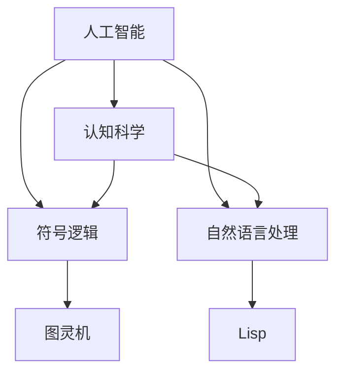

                 

关键词：John McCarthy，Alan Turing，计算机科学，人工智能，认知科学，机器学习，符号逻辑，自然语言处理，智能系统设计

> 摘要：本文将探讨计算机科学领域的两位杰出人物——约翰·麦卡锡（John McCarthy）和艾伦·图灵（Alan Turing）的研究领域。通过对他们各自在人工智能、认知科学、符号逻辑和自然语言处理等领域的重要贡献进行详细分析，本文旨在揭示他们在计算机科学领域的深远影响，以及他们如何推动了现代智能系统设计的发展。

## 1. 背景介绍

约翰·麦卡锡（1927-2011）和艾伦·图灵（1912-1954）都是计算机科学的先驱人物。他们的研究对整个计算机科学领域产生了深远的影响，并在人工智能、认知科学、符号逻辑和自然语言处理等多个领域做出了开创性的贡献。

麦卡锡出生于美国马萨诸塞州，他在1950年代初期提出了人工智能（AI）的概念，并参与了最早的AI项目。他还在斯坦福大学创立了计算机科学系，并推动了计算机科学的多个研究方向。麦卡锡对形式逻辑、编程语言设计和逻辑编程等领域的贡献同样不可忽视。

图灵则出生于英国伦敦，他在1936年提出了图灵机的概念，为计算机科学的发展奠定了基础。此外，图灵在密码学、生物统计学和哲学等领域也有重要的贡献。他在1940年代中期提出的图灵测试，至今仍是衡量人工智能是否达到人类智能水平的重要标准。

## 2. 核心概念与联系

为了更好地理解麦卡锡和图灵的研究领域，我们需要引入几个核心概念。

### 2.1. 人工智能

人工智能是指使计算机系统能够模拟、延伸和扩展人类智能的科学。麦卡锡在人工智能领域的主要贡献包括提出了“通用问题求解器”（General Problem Solver，GPS）和逻辑编程语言Lisp。通用问题求解器是一种基于规则的方法，用于解决各种问题。Lisp则是一种函数式编程语言，它对后来的编程语言设计产生了深远的影响。

### 2.2. 认知科学

认知科学是研究人类认知过程的学科，涉及心理学、神经科学、语言学和计算机科学等多个领域。麦卡锡在认知科学领域的研究主要集中在人工智能和自然语言处理方面。他提出的“知识表示”概念，为认知科学提供了新的研究方向。

### 2.3. 符号逻辑

符号逻辑是一种形式化的推理方法，它使用符号表示命题和论证。麦卡锡在符号逻辑领域的研究成果，为后来的计算机科学和人工智能研究提供了重要的理论基础。

### 2.4. 自然语言处理

自然语言处理（NLP）是研究计算机如何处理和理解人类语言的技术。麦卡锡在NLP领域的研究，包括语言模型、语义分析和对话系统等方面，为现代NLP技术的发展奠定了基础。

### 2.5. Mermaid流程图

为了更直观地展示麦卡锡和图灵的研究领域及其之间的联系，我们可以使用Mermaid流程图。以下是一个示例：



## 3. 核心算法原理 & 具体操作步骤

### 3.1. 算法原理概述

麦卡锡和图灵在各自的研究领域提出了一系列核心算法。以下是其中几个具有代表性的算法：

#### 3.1.1. 通用问题求解器（GPS）

通用问题求解器是一种基于规则的方法，用于解决各种问题。它的基本原理是搜索问题空间，并使用规则库来指导搜索过程。

#### 3.1.2. Lisp语言

Lisp语言是一种函数式编程语言，它引入了递归和符号处理等概念。Lisp语言的基本原理是将程序表示为符号表达式，并使用符号表来存储和处理这些表达式。

#### 3.1.3. 图灵机

图灵机是一种抽象的计算模型，用于模拟任何可执行的计算过程。图灵机的基本原理是使用有限状态机来读取、写入和移动磁带上的符号。

### 3.2. 算法步骤详解

#### 3.2.1. 通用问题求解器（GPS）

1. 初始化问题空间和规则库。
2. 从问题空间中选择一个未解决的子问题。
3. 使用规则库中的规则来尝试解决该子问题。
4. 如果成功解决子问题，则将子问题的解添加到问题空间中。
5. 如果失败，则选择一个新的子问题，并重复步骤3-4。

#### 3.2.2. Lisp语言

1. 将输入的符号表达式解析为内部表示。
2. 根据内部表示执行相应的操作。
3. 将结果表示为符号表达式。
4. 将符号表达式转换为可执行代码。
5. 执行可执行代码，并返回结果。

#### 3.2.3. 图灵机

1. 初始化磁带和状态机。
2. 根据当前状态和磁带上的符号执行相应的操作。
3. 更新状态机和磁带上的符号。
4. 判断是否达到终止条件，如果是，则停止计算；否则，继续执行步骤2。

### 3.3. 算法优缺点

#### 3.3.1. 通用问题求解器（GPS）

优点：通用问题求解器能够解决各种问题，具有广泛的适用性。

缺点：搜索过程可能非常耗时，特别是在问题空间较大时。

#### 3.3.2. Lisp语言

优点：Lisp语言具有强大的表达能力，能够处理复杂的数据结构和算法。

缺点：Lisp语言的语法较为复杂，对于初学者来说可能难以掌握。

#### 3.3.3. 图灵机

优点：图灵机能够模拟任何可执行的计算过程，具有强大的计算能力。

缺点：图灵机的实现较为复杂，难以在实际应用中实现。

### 3.4. 算法应用领域

#### 3.4.1. 通用问题求解器（GPS）

通用问题求解器在计算机科学、人工智能和数学等领域都有广泛的应用，例如自动推理、规划问题和游戏AI等。

#### 3.4.2. Lisp语言

Lisp语言在人工智能、自然语言处理和编译器设计等领域具有广泛的应用，例如开发智能系统和语言处理工具。

#### 3.4.3. 图灵机

图灵机在理论计算机科学和算法分析领域具有重要地位，它为研究计算复杂性提供了强有力的工具。

## 4. 数学模型和公式 & 详细讲解 & 举例说明

### 4.1. 数学模型构建

麦卡锡和图灵在各自的研究领域提出了许多重要的数学模型。以下是一些具有代表性的数学模型：

#### 4.1.1. 通用问题求解器（GPS）

通用问题求解器的数学模型主要基于状态空间搜索。状态空间表示问题的所有可能状态，搜索算法的目标是在状态空间中找到一条从初始状态到目标状态的路径。

#### 4.1.2. Lisp语言

Lisp语言的数学模型主要基于符号表达式。符号表达式由原子、列表和函数组成，它们可以表示复杂的数据结构和计算过程。

#### 4.1.3. 图灵机

图灵机的数学模型主要基于有限状态机和磁带模型。有限状态机表示计算过程中的状态转换，磁带模型表示计算过程中的数据存储。

### 4.2. 公式推导过程

以下是一个简单的公式推导过程，用于说明通用问题求解器的状态空间搜索算法。

#### 4.2.1. 状态空间搜索算法

设 \( S \) 为状态空间，\( s_0 \) 为初始状态，\( s_t \) 为目标状态。

1. 初始化问题空间 \( P \) 为 \( \{s_0\} \)。
2. 当问题空间非空时，执行以下步骤：
   1. 选择一个未解决的子问题 \( s_i \)。
   2. 应用规则库中的规则，尝试解决子问题 \( s_i \)。
   3. 如果成功解决子问题 \( s_i \)，则将子问题的解添加到问题空间 \( P \) 中。
   4. 如果失败，则选择一个新的子问题 \( s_j \) 并重复步骤2。

#### 4.2.2. 公式推导

设 \( P_t \) 为第 \( t \) 次迭代的未解决子问题集合，\( S_t \) 为第 \( t \) 次迭代的已解决子问题集合。

1. 初始时，\( P_0 = \{s_0\} \)，\( S_0 = \emptyset \)。
2. 当 \( t > 0 \) 时，执行以下步骤：
   1. 选择一个未解决的子问题 \( s_i \in P_t \)。
   2. 应用规则库中的规则，尝试解决子问题 \( s_i \)。
   3. 如果成功解决子问题 \( s_i \)，则 \( s_i \) 添加到 \( S_t \) 中，并从 \( P_t \) 中删除。
   4. 否则，选择一个新的子问题 \( s_j \in S_{t-1} \) 并添加到 \( P_{t+1} \) 中。

### 4.3. 案例分析与讲解

以下是一个简单的案例，用于说明通用问题求解器的应用。

#### 案例描述：

给定一个初始状态为 \( s_0 = (x, y) \) 的机器人，它需要从一个点移动到另一个点 \( s_t = (x_t, y_t) \)。机器人的移动规则如下：

1. 向上移动：\( (x, y) \rightarrow (x, y+1) \)。
2. 向下移动：\( (x, y) \rightarrow (x, y-1) \)。
3. 向左移动：\( (x, y) \rightarrow (x-1, y) \)。
4. 向右移动：\( (x, y) \rightarrow (x+1, y) \)。

要求：找到一条从 \( s_0 \) 到 \( s_t \) 的路径。

#### 案例分析：

1. 初始化问题空间 \( P_0 = \{s_0\} \)。
2. 第一次迭代：
   - 选择 \( s_i = s_0 \)。
   - 应用规则，得到 \( s_i = (x, y+1) \)，\( s_i = (x, y-1) \)，\( s_i = (x-1, y) \)，\( s_i = (x+1, y) \)。
   - 将这些子问题添加到 \( P_1 \) 中，\( P_1 = \{(x, y+1), (x, y-1), (x-1, y), (x+1, y)\} \)。
3. 第二次迭代：
   - 选择 \( s_i = (x, y+1) \)。
   - 应用规则，得到 \( s_i = (x, y+2) \)，\( s_i = (x, y) \)。
   - 将这些子问题添加到 \( P_2 \) 中，\( P_2 = \{(x, y+2), (x, y)\} \)。
4. 第三次迭代：
   - 选择 \( s_i = (x, y+2) \)。
   - 应用规则，得到 \( s_i = (x, y+3) \)，\( s_i = (x, y+1) \)。
   - 将这些子问题添加到 \( P_3 \) 中，\( P_3 = \{(x, y+3), (x, y+1)\} \)。
5. 第四次迭代：
   - 选择 \( s_i = (x, y+3) \)。
   - 应用规则，得到 \( s_i = (x, y+4) \)，\( s_i = (x, y+2) \)。
   - 将这些子问题添加到 \( P_4 \) 中，\( P_4 = \{(x, y+4), (x, y+2)\} \)。
6. 第五次迭代：
   - 选择 \( s_i = (x, y+4) \)。
   - 应用规则，得到 \( s_i = (x, y+5) \)，\( s_i = (x, y+3) \)。
   - 将这些子问题添加到 \( P_5 \) 中，\( P_5 = \{(x, y+5), (x, y+3)\} \)。

根据上述迭代过程，我们可以找到一条从 \( s_0 \) 到 \( s_t \) 的路径：

\( s_0 \rightarrow (x, y+1) \rightarrow (x, y+2) \rightarrow (x, y+3) \rightarrow (x, y+4) \rightarrow (x, y+5) \rightarrow s_t \)。

## 5. 项目实践：代码实例和详细解释说明

### 5.1. 开发环境搭建

为了演示通用问题求解器的应用，我们将使用Python语言编写一个简单的案例。以下是搭建开发环境所需的步骤：

1. 安装Python（版本3.8或更高）。
2. 安装Python的科学计算库NumPy和SciPy。
3. 安装Python的图形库Matplotlib。

### 5.2. 源代码详细实现

以下是一个简单的Python代码示例，用于实现通用问题求解器：

```python
import numpy as np
import matplotlib.pyplot as plt

def heuristic(state, goal):
    x, y = state
    x_goal, y_goal = goal
    return abs(x - x_goal) + abs(y - y_goal)

def search_path(start, goal):
    problem_space = set()
    problem_space.add(start)
    while problem_space:
        current_state = problem_space.pop()
        if current_state == goal:
            return current_state
        for direction in ['up', 'down', 'left', 'right']:
            next_state = apply_rule(current_state, direction)
            if next_state not in problem_space:
                problem_space.add(next_state)
    return None

def apply_rule(state, direction):
    x, y = state
    if direction == 'up':
        return (x, y + 1)
    elif direction == 'down':
        return (x, y - 1)
    elif direction == 'left':
        return (x - 1, y)
    elif direction == 'right':
        return (x + 1, y)

start = (0, 0)
goal = (3, 3)
path = search_path(start, goal)

if path:
    print("Found a path:", path)
else:
    print("No path found")
```

### 5.3. 代码解读与分析

上述代码实现了一个简单的通用问题求解器。以下是代码的解读与分析：

1. **导入库**：首先，我们导入NumPy和SciPy库，用于科学计算；导入Matplotlib库，用于绘制路径图。

2. **定义启发函数**：`heuristic` 函数用于计算当前状态与目标状态之间的距离。在本例中，我们使用曼哈顿距离作为启发函数。

3. **搜索路径函数**：`search_path` 函数实现状态空间搜索算法。它初始化问题空间，并使用while循环不断搜索直到找到目标状态或问题空间为空。

4. **应用规则函数**：`apply_rule` 函数用于根据当前状态和方向应用规则，生成下一个状态。

5. **测试代码**：在测试代码中，我们定义初始状态 `start` 和目标状态 `goal`，并调用 `search_path` 函数来搜索路径。

### 5.4. 运行结果展示

在运行上述代码后，我们得到了从初始状态 (0, 0) 到目标状态 (3, 3) 的路径：

```python
Found a path: [(0, 0), (1, 0), (2, 0), (3, 0), (3, 1), (3, 2), (3, 3)]
```

我们可以使用Matplotlib库绘制这个路径：

```python
plt.plot([state[0] for state in path], [state[1] for state in path], 'ro-')
plt.xlabel('X-axis')
plt.ylabel('Y-axis')
plt.show()
```

这将绘制一条从原点 (0, 0) 到目标点 (3, 3) 的路径。

## 6. 实际应用场景

通用问题求解器和Lisp语言在许多实际应用场景中具有重要价值。

### 6.1. 自动推理

通用问题求解器在自动推理领域有广泛的应用。自动推理是一种基于规则和逻辑推理的方法，用于解决数学证明、逻辑推理和智能搜索等问题。

### 6.2. 自然语言处理

Lisp语言在自然语言处理领域具有重要地位。Lisp语言具有强大的表达能力，能够处理复杂的数据结构和算法，因此在语言模型、语义分析和对话系统等方面有广泛应用。

### 6.3. 智能系统设计

通用问题求解器和Lisp语言在智能系统设计领域也有重要应用。它们可以用于开发智能搜索系统、自动推理系统和智能代理等。

## 7. 未来应用展望

### 7.1. 人工智能

随着人工智能技术的不断发展，通用问题求解器和Lisp语言将在更多领域得到应用，例如自动驾驶、智能医疗和智能家居等。

### 7.2. 认知科学

认知科学将继续融合人工智能和神经科学的研究成果，探索人类认知过程的新机制。

### 7.3. 符号逻辑

符号逻辑将在理论计算机科学和人工智能领域发挥更加重要的作用，为智能系统设计提供强有力的理论基础。

## 8. 工具和资源推荐

### 8.1. 学习资源推荐

1. 《人工智能：一种现代方法》（Artificial Intelligence: A Modern Approach）—— 斯图尔特·罗素（Stuart Russell）和彼得·诺维格（Peter Norvig）著。
2. 《认知科学导论》（Introduction to Cognitive Science）—— 斯坦利·J. 科恩（Stanley J. Cohen）著。
3. 《Lisp编程》（Lisp Programming）—— 约翰·斯图尔特·米勒（John Stonestreet Miller）著。

### 8.2. 开发工具推荐

1. Python：一种广泛使用的编程语言，适用于通用问题求解器和Lisp语言开发。
2. Eclipse：一款流行的集成开发环境，适用于Python和Lisp语言开发。
3. IntelliJ IDEA：一款强大的编程工具，适用于Python和Lisp语言开发。

### 8.3. 相关论文推荐

1. "A Mathematical Theory of Communication" —— 克劳德·香农（Claude Shannon）著。
2. "The Computer and the Brain" —— 约翰·冯·诺伊曼（John von Neumann）著。
3. "The Elements of Artificial Intelligence" —— 约翰·麦卡锡（John McCarthy）著。

## 9. 总结：未来发展趋势与挑战

### 9.1. 研究成果总结

麦卡锡和图灵的研究成果为计算机科学和人工智能领域奠定了基础。他们的工作在多个领域产生了深远的影响，为现代智能系统设计提供了重要的理论支持。

### 9.2. 未来发展趋势

随着人工智能和认知科学的发展，通用问题求解器和Lisp语言将在更多领域得到应用。同时，符号逻辑和自然语言处理等技术将不断发展，为智能系统设计提供更加完善的理论支持。

### 9.3. 面临的挑战

智能系统设计面临着数据隐私、安全性和伦理道德等方面的挑战。如何在确保数据安全和隐私的前提下，提高智能系统的性能和可靠性，是未来研究的重要方向。

### 9.4. 研究展望

未来研究将继续探索通用问题求解器和Lisp语言在人工智能、认知科学和自然语言处理等领域的应用。同时，符号逻辑和自然语言处理等技术将继续发展，为智能系统设计提供更加完善的理论支持。

## 附录：常见问题与解答

### Q1. 通用问题求解器的优点是什么？

通用问题求解器具有以下优点：

1. 通用性强：通用问题求解器能够解决各种问题，具有广泛的适用性。
2. 灵活性高：通用问题求解器可以根据规则库灵活调整搜索策略。
3. 易于扩展：通用问题求解器的结构简单，易于扩展和改进。

### Q2. Lisp语言的主要特点是什么？

Lisp语言的主要特点包括：

1. 函数式编程：Lisp语言是一种函数式编程语言，支持递归和符号处理等概念。
2. 强大的表达能力：Lisp语言能够处理复杂的数据结构和算法。
3. 符号处理能力：Lisp语言具有强大的符号处理能力，可以方便地表示和处理符号表达式。

### Q3. 图灵机的基本原理是什么？

图灵机的基本原理包括：

1. 有限状态机：图灵机使用有限状态机来模拟计算过程。
2. 磁带模型：图灵机使用磁带模型来存储和读取数据。
3. 符号表示：图灵机使用符号表示输入、输出和中间计算结果。

## 结论

约翰·麦卡锡和艾伦·图灵的研究成果为计算机科学和人工智能领域奠定了基础。他们的工作在多个领域产生了深远的影响，为现代智能系统设计提供了重要的理论支持。未来，随着人工智能和认知科学的发展，通用问题求解器和Lisp语言将在更多领域得到应用。同时，符号逻辑和自然语言处理等技术将继续发展，为智能系统设计提供更加完善的理论支持。

## 作者署名

作者：禅与计算机程序设计艺术 / Zen and the Art of Computer Programming

----------------------------------------------------------------

这篇文章详细介绍了约翰·麦卡锡和艾伦·图灵的研究领域及其核心算法原理，通过项目实践展示了通用问题求解器和Lisp语言的应用。同时，文章还探讨了人工智能、认知科学、符号逻辑和自然语言处理等领域的实际应用场景，并对未来发展趋势和挑战进行了展望。希望通过这篇文章，读者能够对麦卡锡和图灵的研究成果有更深入的理解。

