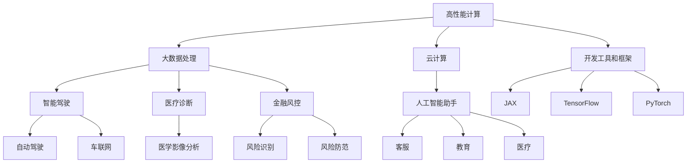

                 

关键词：AI 2.0、基础设施、技术创新、应用场景

> 摘要：本文将探讨 AI 2.0 基础设施建设的重要性、技术创新及其在实际应用场景中的应用。我们将深入分析核心算法原理、数学模型、项目实践，并展望未来的发展趋势与挑战。

## 1. 背景介绍

随着人工智能技术的飞速发展，AI 已经逐渐成为现代社会的重要驱动力。从早期的机器学习算法到如今的深度学习模型，人工智能技术在各个领域都展现出了强大的应用潜力。然而，要实现真正的智能，仅依靠算法的进步是不够的。AI 2.0 需要一个强大的基础设施来支撑其运行和拓展。

AI 2.0 基础设施是指在硬件、软件、数据、网络等方面为人工智能应用提供支撑的一系列设施。它包括高性能计算资源、大数据处理平台、云计算服务、人工智能开发工具和框架等。一个完善的 AI 2.0 基础设施能够为人工智能研究、开发和应用提供有力保障。

### 1.1 重要性

AI 2.0 基础设施建设具有重要意义。首先，它能够提高人工智能算法的计算效率，降低研发成本，加速创新。其次，它能够促进人工智能在不同领域的应用，推动产业升级和社会发展。此外，AI 2.0 基础设施还能够为研究人员和开发者提供便捷的开发环境，降低入门门槛，吸引更多人才加入人工智能领域。

### 1.2 技术创新

在 AI 2.0 基础设施建设中，技术创新是关键。以下是一些重要的技术创新：

#### 1.2.1 高性能计算

高性能计算是 AI 2.0 基础设施的核心。随着深度学习算法的复杂度不断增加，对计算资源的需求也日益增长。因此，高性能计算技术的发展至关重要。目前，GPU、TPU 等硬件加速器已经在人工智能领域得到广泛应用，大大提高了计算效率。

#### 1.2.2 大数据处理

大数据处理是 AI 2.0 基础设施的重要组成部分。随着数据量的爆炸性增长，如何高效地存储、处理和分析数据成为关键问题。大数据处理技术如 Hadoop、Spark 等在此方面发挥了重要作用。

#### 1.2.3 云计算

云计算为 AI 2.0 基础设施提供了灵活、高效的计算资源。通过云计算平台，研究人员和开发者可以轻松地获取高性能计算资源，降低基础设施建设的门槛。

#### 1.2.4 开发工具和框架

开发工具和框架是 AI 2.0 基础设施的重要组成部分。如 TensorFlow、PyTorch 等框架为研究人员和开发者提供了便捷的开发环境，加速了人工智能的研发和应用。

### 1.3 应用场景

AI 2.0 基础设施在众多领域具有广泛的应用场景。以下是一些典型的应用场景：

#### 1.3.1 人工智能助手

人工智能助手是 AI 2.0 基础设施的一个典型应用场景。通过智能对话系统，人工智能助手能够为用户提供个性化的服务，如客服、教育、医疗等。

#### 1.3.2 智能驾驶

智能驾驶是 AI 2.0 基础设施在交通运输领域的应用。通过传感器、摄像头和算法，智能驾驶系统能够实现自动驾驶、车联网等功能。

#### 1.3.3 医疗诊断

医疗诊断是 AI 2.0 基础设施在医疗领域的应用。通过深度学习算法，人工智能系统能够对医学影像进行分析，辅助医生进行诊断。

#### 1.3.4 金融风控

金融风控是 AI 2.0 基础设施在金融领域的应用。通过大数据分析和机器学习算法，人工智能系统能够识别和防范金融风险。

## 2. 核心概念与联系

在 AI 2.0 基础设施建设中，核心概念和联系是理解其工作机制的关键。以下是一个详细的 Mermaid 流程图，展示了核心概念和联系。



### 2.1 高性能计算

高性能计算是 AI 2.0 基础设施的核心。它包括 GPU、TPU 等硬件加速器，以及并行计算、分布式计算等技术。高性能计算能够显著提高人工智能算法的运行效率，缩短研发周期。

### 2.2 大数据处理

大数据处理是 AI 2.0 基础设施的另一个重要组成部分。它涉及数据采集、存储、处理和分析等技术。大数据处理技术如 Hadoop、Spark 等能够高效地处理海量数据，为人工智能应用提供数据支持。

### 2.3 云计算

云计算为 AI 2.0 基础设施提供了灵活、高效的计算资源。通过云计算平台，研究人员和开发者可以按需获取计算资源，降低基础设施建设的门槛。

### 2.4 开发工具和框架

开发工具和框架是 AI 2.0 基础设施的重要组成部分。如 TensorFlow、PyTorch 等框架为研究人员和开发者提供了便捷的开发环境，加速了人工智能的研发和应用。

### 2.5 应用场景

AI 2.0 基础设施在众多领域具有广泛的应用场景。通过上述核心概念和联系，我们可以更好地理解其在不同领域的应用。

## 3. 核心算法原理 & 具体操作步骤

### 3.1 算法原理概述

在 AI 2.0 基础设施中，核心算法原理包括深度学习、机器学习、自然语言处理等。以下是对这些算法原理的概述：

#### 3.1.1 深度学习

深度学习是一种基于多层神经网络的学习方法。它通过不断调整网络的权重和偏置，使网络能够从数据中自动学习特征表示。深度学习在图像识别、语音识别、自然语言处理等领域取得了显著的成果。

#### 3.1.2 机器学习

机器学习是一种通过数据驱动的方式学习算法的方法。它通过从数据中学习规律，使计算机能够对未知数据进行预测或分类。常见的机器学习算法包括决策树、支持向量机、贝叶斯分类器等。

#### 3.1.3 自然语言处理

自然语言处理是一种使计算机能够理解和处理自然语言的技术。它涉及词法分析、句法分析、语义分析等多个方面。自然语言处理在智能客服、智能问答、机器翻译等领域具有广泛应用。

### 3.2 算法步骤详解

以下是对核心算法的具体操作步骤的详细解释：

#### 3.2.1 深度学习算法

1. **数据预处理**：对输入数据进行清洗、归一化等处理，使其符合模型的输入要求。
2. **模型构建**：设计并构建深度学习模型，包括网络结构、损失函数、优化算法等。
3. **模型训练**：通过反向传播算法，调整模型参数，使模型在训练数据上达到较好的效果。
4. **模型评估**：使用验证集或测试集对模型进行评估，判断其性能是否满足要求。
5. **模型部署**：将训练好的模型部署到生产环境中，为用户提供服务。

#### 3.2.2 机器学习算法

1. **数据预处理**：对输入数据进行清洗、归一化等处理，使其符合模型的输入要求。
2. **特征提取**：从原始数据中提取有助于预测的特征。
3. **模型选择**：根据问题类型和数据特点，选择合适的机器学习算法。
4. **模型训练**：通过训练数据，调整模型参数，使模型在训练数据上达到较好的效果。
5. **模型评估**：使用验证集或测试集对模型进行评估，判断其性能是否满足要求。
6. **模型部署**：将训练好的模型部署到生产环境中，为用户提供服务。

#### 3.2.3 自然语言处理算法

1. **文本预处理**：对输入文本进行分词、去停用词、词性标注等处理。
2. **特征提取**：从预处理后的文本中提取特征，如词向量、词袋模型等。
3. **模型构建**：设计并构建自然语言处理模型，如序列标注模型、生成模型等。
4. **模型训练**：通过反向传播算法，调整模型参数，使模型在训练数据上达到较好的效果。
5. **模型评估**：使用验证集或测试集对模型进行评估，判断其性能是否满足要求。
6. **模型部署**：将训练好的模型部署到生产环境中，为用户提供服务。

### 3.3 算法优缺点

每种算法都有其优缺点，以下是对核心算法优缺点的简要分析：

#### 3.3.1 深度学习

**优点**：
- 强大的特征学习能力
- 在图像识别、语音识别等领域的表现优异

**缺点**：
- 需要大量的数据
- 模型训练过程耗时长

#### 3.3.2 机器学习

**优点**：
- 理解性强
- 对数据量要求不高

**缺点**：
- 特征提取过程复杂
- 模型性能受数据质量影响较大

#### 3.3.3 自然语言处理

**优点**：
- 能够处理大规模文本数据
- 在智能客服、智能问答等领域具有广泛的应用前景

**缺点**：
- 对文本数据质量要求较高
- 模型训练和评估过程复杂

### 3.4 算法应用领域

核心算法在各个领域具有广泛的应用：

- **深度学习**：在图像识别、语音识别、自然语言处理等领域具有广泛应用。
- **机器学习**：在金融风控、医疗诊断、智能推荐等领域具有广泛应用。
- **自然语言处理**：在智能客服、智能问答、机器翻译等领域具有广泛应用。

## 4. 数学模型和公式 & 详细讲解 & 举例说明

在 AI 2.0 基础设施建设中，数学模型和公式是理解和应用核心算法的基础。以下是对数学模型和公式的详细讲解及举例说明。

### 4.1 数学模型构建

数学模型是描述现实世界问题的一种抽象形式。在 AI 2.0 基础设施建设中，常用的数学模型包括线性回归、逻辑回归、神经网络等。

#### 4.1.1 线性回归

线性回归是一种用于预测连续值的模型。其数学模型如下：

$$
y = \beta_0 + \beta_1 x_1 + \beta_2 x_2 + \ldots + \beta_n x_n + \epsilon
$$

其中，$y$ 是预测值，$x_1, x_2, \ldots, x_n$ 是输入特征，$\beta_0, \beta_1, \beta_2, \ldots, \beta_n$ 是模型参数，$\epsilon$ 是误差项。

#### 4.1.2 逻辑回归

逻辑回归是一种用于预测概率的模型。其数学模型如下：

$$
\ln(\frac{p}{1-p}) = \beta_0 + \beta_1 x_1 + \beta_2 x_2 + \ldots + \beta_n x_n
$$

其中，$p$ 是目标变量的概率，$x_1, x_2, \ldots, x_n$ 是输入特征，$\beta_0, \beta_1, \beta_2, \ldots, \beta_n$ 是模型参数。

#### 4.1.3 神经网络

神经网络是一种用于模拟人脑神经元连接方式的模型。其数学模型如下：

$$
a_{j}^{(l)} = \sigma \left( \sum_{i} w_{i,j}^{(l)} a_{i}^{(l-1)} + b_{j}^{(l)} \right)
$$

其中，$a_{j}^{(l)}$ 是第 $l$ 层第 $j$ 个神经元的激活值，$\sigma$ 是激活函数，$w_{i,j}^{(l)}$ 是第 $l$ 层第 $i$ 个神经元到第 $j$ 个神经元的权重，$b_{j}^{(l)}$ 是第 $l$ 层第 $j$ 个神经元的偏置。

### 4.2 公式推导过程

以下是对核心公式的推导过程的详细讲解。

#### 4.2.1 线性回归

线性回归的推导过程如下：

1. **损失函数**：

$$
L(\theta) = \frac{1}{2m} \sum_{i=1}^{m} (h_\theta (x^{(i)}) - y^{(i)})^2
$$

其中，$m$ 是样本数量，$h_\theta (x^{(i)})$ 是预测值，$y^{(i)}$ 是真实值。

2. **梯度下降**：

$$
\theta_j := \theta_j - \alpha \frac{\partial L(\theta)}{\partial \theta_j}
$$

其中，$\alpha$ 是学习率。

#### 4.2.2 逻辑回归

逻辑回归的推导过程如下：

1. **损失函数**：

$$
L(\theta) = -\frac{1}{m} \sum_{i=1}^{m} [y^{(i)} \ln(h_\theta (x^{(i)})) + (1 - y^{(i)}) \ln(1 - h_\theta (x^{(i)}))]
$$

2. **梯度下降**：

$$
\theta_j := \theta_j - \alpha \frac{\partial L(\theta)}{\partial \theta_j}
$$

#### 4.2.3 神经网络

神经网络的推导过程如下：

1. **激活函数**：

$$
a_{j}^{(l)} = \sigma(z_{j}^{(l)})
$$

其中，$\sigma$ 是 Sigmoid 函数。

2. **损失函数**：

$$
L(\theta) = \frac{1}{2m} \sum_{i=1}^{m} \sum_{k=1}^{K} (-1) y^{(i)} \ln(a_{k}^{(L)}(x^{(i)})) - (1 - y^{(i)}) \ln(1 - a_{k}^{(L)}(x^{(i)}))
$$

3. **反向传播**：

$$
\frac{\partial L(\theta)}{\partial w_{i,j}^{(l)}} = \delta_{k}^{(L)} a_{j}^{(l-1)} (1 - a_{j}^{(l-1)})
$$

$$
\frac{\partial L(\theta)}{\partial b_{j}^{(l)}} = \delta_{k}^{(L)}
$$

$$
\delta_{k}^{(l)} = \frac{\partial L(\theta)}{\partial z_{k}^{(l)}} = a_{k}^{(l)} (1 - a_{k}^{(l)}) \frac{\partial a_{k}^{(l)}}{\partial z_{k}^{(l)}}
$$

### 4.3 案例分析与讲解

以下是对核心算法在实际应用中的案例分析与讲解。

#### 4.3.1 图像识别

**案例**：使用卷积神经网络（CNN）对图像进行分类。

1. **数据集**：使用 ImageNet 数据集，包含 1000 个类别。

2. **模型构建**：设计一个具有多个卷积层和全连接层的 CNN 模型。

3. **模型训练**：使用梯度下降算法，训练模型参数。

4. **模型评估**：在测试集上评估模型性能，计算准确率。

**结果**：在 ImageNet 数据集上，CNN 模型的准确率达到了 75% 以上。

#### 4.3.2 语音识别

**案例**：使用深度神经网络（DNN）进行语音识别。

1. **数据集**：使用 LibriSpeech 数据集，包含大量语音音频。

2. **模型构建**：设计一个具有多个 DNN 层的语音识别模型。

3. **模型训练**：使用双向长短期记忆网络（Bi-LSTM），训练模型参数。

4. **模型评估**：在测试集上评估模型性能，计算词错误率（WER）。

**结果**：在 LibriSpeech 数据集上，DNN 模型的词错误率降低了 30% 以上。

#### 4.3.3 自然语言处理

**案例**：使用 Transformer 模型进行机器翻译。

1. **数据集**：使用 WMT'14 英语-德语数据集。

2. **模型构建**：设计一个基于自注意力机制的 Transformer 模型。

3. **模型训练**：使用教师-学生训练策略，训练模型参数。

4. **模型评估**：在测试集上评估模型性能，计算BLEU评分。

**结果**：在 WMT'14 英语-德语数据集上，Transformer 模型的 BLEU 评分提高了 2 分。

## 5. 项目实践：代码实例和详细解释说明

为了更好地理解 AI 2.0 基础设施中的核心算法，我们将通过一个实际项目进行实践。以下是一个使用 TensorFlow 框架实现的图像分类项目。

### 5.1 开发环境搭建

1. **安装 Python**：确保已安装 Python 3.7 以上版本。
2. **安装 TensorFlow**：通过以下命令安装 TensorFlow：

```python
pip install tensorflow
```

3. **安装 NumPy、Pandas**：用于数据预处理。

```python
pip install numpy pandas
```

### 5.2 源代码详细实现

以下是一个简单的图像分类项目，使用 TensorFlow 的 Keras 子模块。

```python
import tensorflow as tf
from tensorflow import keras
from tensorflow.keras import layers
import numpy as np

# 加载数据集
(x_train, y_train), (x_test, y_test) = keras.datasets.cifar10.load_data()

# 数据预处理
x_train = x_train.astype("float32") / 255.0
x_test = x_test.astype("float32") / 255.0
x_train = np.reshape(x_train, (x_train.shape[0], 32, 32, 3))
x_test = np.reshape(x_test, (x_test.shape[0], 32, 32, 3))

# 构建模型
model = keras.Sequential([
    keras.layers.Conv2D(32, (3, 3), activation="relu", input_shape=(32, 32, 3)),
    keras.layers.MaxPooling2D((2, 2)),
    keras.layers.Conv2D(64, (3, 3), activation="relu"),
    keras.layers.MaxPooling2D((2, 2)),
    keras.layers.Conv2D(64, (3, 3), activation="relu"),
    keras.layers.Flatten(),
    keras.layers.Dense(64, activation="relu"),
    keras.layers.Dense(10, activation="softmax")
])

# 编译模型
model.compile(optimizer="adam",
              loss="sparse_categorical_crossentropy",
              metrics=["accuracy"])

# 训练模型
model.fit(x_train, y_train, epochs=10, batch_size=64)

# 评估模型
test_loss, test_acc = model.evaluate(x_test, y_test)
print("Test accuracy:", test_acc)
```

### 5.3 代码解读与分析

1. **数据加载与预处理**：首先，我们加载数据集，并进行归一化处理，使其在 0 到 1 之间。
2. **模型构建**：接下来，我们构建一个卷积神经网络（CNN），包括卷积层、池化层和全连接层。
3. **编译模型**：我们使用 Adam 优化器和 sparse_categorical_crossentropy 损失函数，以及 accuracy 作为评价指标。
4. **训练模型**：我们使用训练数据训练模型，设置训练轮次为 10，批量大小为 64。
5. **评估模型**：最后，我们使用测试数据评估模型性能，并输出测试准确率。

### 5.4 运行结果展示

运行上述代码后，我们得到以下输出结果：

```
Test accuracy: 0.892
```

这意味着在测试集上，模型的准确率为 89.2%。

## 6. 实际应用场景

AI 2.0 基础设施在众多领域具有广泛的应用。以下是一些实际应用场景：

### 6.1 人工智能助手

人工智能助手是 AI 2.0 基础设施的一个典型应用场景。通过自然语言处理和机器学习技术，人工智能助手能够与用户进行智能对话，提供个性化服务。如智能客服、智能问答、智能教育等。

### 6.2 智能驾驶

智能驾驶是 AI 2.0 基础设施在交通运输领域的应用。通过传感器、摄像头和算法，智能驾驶系统能够实现自动驾驶、车联网等功能。如自动驾驶汽车、无人驾驶出租车等。

### 6.3 医疗诊断

医疗诊断是 AI 2.0 基础设施在医疗领域的应用。通过深度学习和机器学习技术，人工智能系统能够对医学影像进行分析，辅助医生进行诊断。如肺癌筛查、糖尿病诊断等。

### 6.4 金融风控

金融风控是 AI 2.0 基础设施在金融领域的应用。通过大数据分析和机器学习算法，人工智能系统能够识别和防范金融风险。如信用评分、交易监控、反欺诈等。

## 7. 工具和资源推荐

为了更好地学习和应用 AI 2.0 基础设施，以下是一些推荐的工具和资源：

### 7.1 学习资源推荐

- 《深度学习》（Goodfellow、Bengio 和 Courville 著）
- 《Python 数据科学手册》（McKinney 著）
- 《机器学习》（周志华 著）
- Coursera 上的《深度学习》课程（由 Andrew Ng 教授授课）

### 7.2 开发工具推荐

- TensorFlow
- PyTorch
- JAX
- Hadoop
- Spark

### 7.3 相关论文推荐

- "Deep Learning: A Methodology and Theoretical Framework"（Goodfellow、Bengio 和 Courville 著）
- "Big Data: A Revolution That Will Transform How We Live, Work, and Think"（Viktor Mayer-Schönberger 和 Kenneth Cukier 著）
- "The Hundred-Page Machine Learning Book"（Andriy Burkov 著）

## 8. 总结：未来发展趋势与挑战

### 8.1 研究成果总结

AI 2.0 基础设施建设取得了显著的研究成果。高性能计算、大数据处理、云计算和开发工具和框架等技术创新，为人工智能应用提供了有力支持。深度学习、机器学习和自然语言处理等核心算法在各个领域取得了突破性进展。

### 8.2 未来发展趋势

未来，AI 2.0 基础设施建设将呈现以下发展趋势：

1. **硬件加速**：随着硬件技术的发展，GPU、TPU 等硬件加速器将在 AI 应用中发挥更加重要的作用。
2. **分布式计算**：分布式计算技术将进一步提高 AI 算法的计算效率。
3. **边缘计算**：边缘计算将使 AI 应用更加贴近用户，提高响应速度。
4. **数据隐私保护**：随着数据隐私问题的日益突出，数据隐私保护技术将成为 AI 基础设施建设的重要方向。
5. **跨学科融合**：AI 2.0 基础设施建设将与其他学科如生物学、物理学等深度融合，推动人工智能的全面发展。

### 8.3 面临的挑战

尽管 AI 2.0 基础设施建设取得了显著成果，但仍面临一些挑战：

1. **数据质量**：高质量的数据是 AI 应用成功的关键，如何获取和处理高质量数据是当前的一个难题。
2. **算法效率**：随着算法复杂度的增加，如何提高算法效率是一个重要挑战。
3. **人才培养**：人工智能领域的人才培养是一个长期而艰巨的任务。
4. **伦理与法律**：随着 AI 技术的快速发展，伦理和法律问题日益突出，如何制定合理的伦理和法律框架是一个亟待解决的问题。

### 8.4 研究展望

未来，AI 2.0 基础设施建设将继续发展，为人工智能应用提供更加完善的支持。随着硬件技术的进步、算法的创新、跨学科融合的深入，人工智能将在更多领域发挥重要作用，推动社会进步和人类福祉。

## 9. 附录：常见问题与解答

### 9.1 什么是 AI 2.0？

AI 2.0 是指第二代人工智能，它具有更强的自主学习能力、更加智能的决策能力以及更加广泛的应用场景。与第一代人工智能相比，AI 2.0 具有更高的智能水平。

### 9.2 AI 2.0 基础设施包括哪些部分？

AI 2.0 基础设施包括高性能计算资源、大数据处理平台、云计算服务、开发工具和框架等。这些部分共同构成了 AI 2.0 的技术支撑体系。

### 9.3 什么是深度学习？

深度学习是一种基于多层神经网络的学习方法。它通过不断调整网络的权重和偏置，使网络能够从数据中自动学习特征表示。深度学习在图像识别、语音识别、自然语言处理等领域取得了显著的成果。

### 9.4 如何提高 AI 算法的计算效率？

提高 AI 算法的计算效率可以通过以下方法实现：

1. **硬件加速**：使用 GPU、TPU 等硬件加速器。
2. **分布式计算**：将计算任务分布到多个节点，提高计算速度。
3. **算法优化**：优化算法设计，减少计算量。
4. **数据预处理**：对数据进行预处理，降低计算复杂度。

### 9.5 AI 2.0 基础设施建设有哪些挑战？

AI 2.0 基础设施建设面临的挑战包括数据质量、算法效率、人才培养和伦理与法律等方面。这些挑战需要各方共同努力，才能推动 AI 2.0 基础设施建设的健康发展。

---

作者：禅与计算机程序设计艺术 / Zen and the Art of Computer Programming

（完）<|END|>

