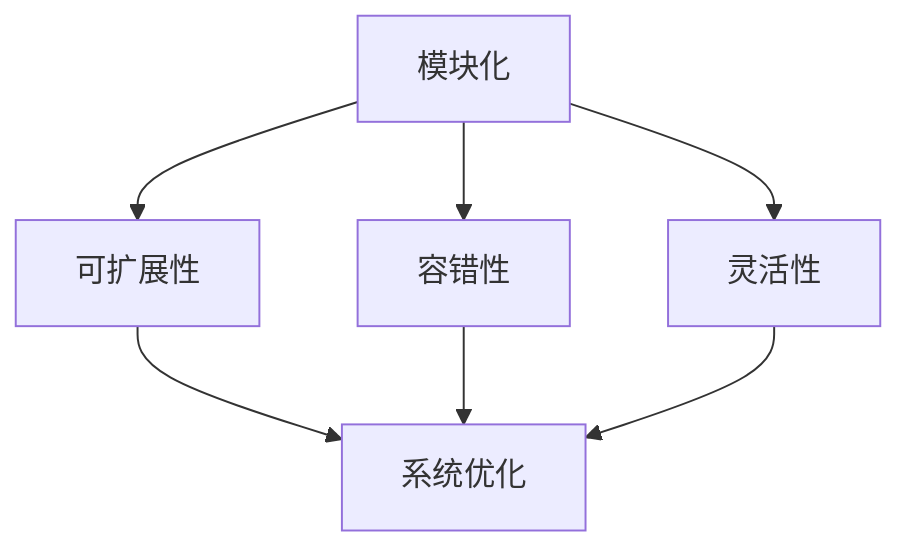

                 

关键词：人工智能，框架，基础设施，AI 2.0，架构设计，系统优化，新兴技术，开发工具，算法效率，开源社区，未来展望。

> 摘要：本文将深入探讨 AI 2.0 时代框架基础设施的演进，分析其核心概念、架构设计、算法原理和数学模型，并通过实际项目实践来展示其应用效果。我们将探索未来发展趋势，面临的挑战，以及这一领域的广阔前景。

## 1. 背景介绍

随着人工智能技术的快速发展，我们已经迈入了 AI 2.0 时代。AI 2.0 与之前的 AI 1.0 有显著不同，它不仅仅依赖于大量的数据和计算能力，更注重算法的智能化、自适应性和通用性。在这一背景下，框架基础设施的演进成为了 AI 2.0 技术发展的关键因素。

框架基础设施是人工智能系统的基础，它涵盖了编程语言、工具库、开发环境、算法库等多个方面。一个高效的框架基础设施能够显著提升算法的效率，优化系统性能，并且降低开发难度。本文将围绕这些方面展开讨论，旨在为读者提供全面而深入的见解。

## 2. 核心概念与联系

在深入探讨框架基础设施的演进之前，我们首先需要了解一些核心概念，包括：

- **模块化（Modularity）**：将系统划分为多个模块，每个模块独立开发、测试和部署。
- **可扩展性（Scalability）**：系统能够适应数据规模的增长，提供高效的处理能力。
- **容错性（Fault Tolerance）**：系统能够在部分组件出现故障时保持稳定运行。
- **灵活性（Flexibility）**：系统可以灵活调整和适应不同的应用场景。

接下来，我们将使用 Mermaid 流程图来展示这些核心概念之间的联系。



通过这个流程图，我们可以看到模块化、可扩展性、容错性和灵活性是如何相互关联并共同影响系统优化的。

### 2.1 模块化

模块化是框架基础设施设计的重要原则之一。它允许我们将复杂的系统分解为多个独立模块，每个模块负责系统的某个特定功能。这种设计不仅简化了开发过程，还提高了系统的可维护性和可扩展性。

### 2.2 可扩展性

可扩展性是指系统在数据规模增长时能够保持高效性能的能力。随着数据量的不断增加，系统需要能够水平扩展以应对负载。这通常通过分布式计算和负载均衡技术实现。

### 2.3 容错性

容错性是保证系统稳定运行的关键因素。一个具有高容错性的系统可以在部分组件出现故障时，通过冗余设计和故障转移机制，保持整体系统的正常运行。

### 2.4 灵活性

灵活性使系统能够适应不同的应用场景。这意味着系统需要具有高度的定制化能力，以便在不同的业务需求下进行快速调整和优化。

通过这些核心概念的相互结合，我们可以构建出一个高效、稳定、灵活的框架基础设施。

## 3. 核心算法原理 & 具体操作步骤

在 AI 2.0 时代，核心算法的效率和性能直接决定了人工智能系统的效果。本节将介绍一些关键算法的原理，以及如何在实际操作中应用这些算法。

### 3.1 算法原理概述

在 AI 2.0 时代，常见的核心算法包括：

- **深度学习（Deep Learning）**：通过多层神经网络模型进行数据建模和预测。
- **强化学习（Reinforcement Learning）**：通过与环境互动来学习和优化策略。
- **迁移学习（Transfer Learning）**：利用预训练模型进行快速适应新任务。

### 3.2 算法步骤详解

#### 3.2.1 深度学习

深度学习的算法步骤主要包括：

1. **数据预处理**：包括数据清洗、归一化和数据增强。
2. **模型构建**：定义多层神经网络结构，选择合适的激活函数和优化算法。
3. **模型训练**：使用训练数据对模型进行迭代优化。
4. **模型评估**：使用验证数据评估模型性能，调整超参数。
5. **模型部署**：将训练好的模型部署到生产环境，进行实时预测。

#### 3.2.2 强化学习

强化学习的算法步骤主要包括：

1. **环境建模**：定义智能体与环境的交互方式。
2. **策略学习**：通过智能体与环境互动来学习最优策略。
3. **策略评估**：评估策略的优劣，调整策略参数。
4. **策略优化**：使用优化算法对策略进行调整和优化。

#### 3.2.3 迁移学习

迁移学习的算法步骤主要包括：

1. **源任务训练**：在源任务上训练一个预训练模型。
2. **模型调整**：在目标任务上对预训练模型进行调整和优化。
3. **模型评估**：评估调整后的模型在目标任务上的性能。
4. **模型部署**：将优化后的模型部署到生产环境。

### 3.3 算法优缺点

- **深度学习**：优点包括强大的表达能力和较高的预测准确性，缺点是计算资源需求高，对数据质量要求较高。
- **强化学习**：优点是能够自适应环境和不断优化策略，缺点是训练过程复杂，需要大量时间和计算资源。
- **迁移学习**：优点是能够快速适应新任务，缺点是依赖于高质量的源任务数据和模型。

### 3.4 算法应用领域

这些算法在不同领域有不同的应用：

- **深度学习**：广泛应用于图像识别、语音识别、自然语言处理等领域。
- **强化学习**：应用于游戏、推荐系统、自动驾驶等领域。
- **迁移学习**：应用于医疗诊断、金融风控、工业检测等领域。

## 4. 数学模型和公式 & 详细讲解 & 举例说明

在 AI 2.0 时代，数学模型是算法的核心组成部分。本节将介绍一些关键数学模型和公式，并提供详细讲解和举例说明。

### 4.1 数学模型构建

在构建数学模型时，我们通常需要考虑以下几个步骤：

1. **数据收集与处理**：收集相关数据，并进行数据预处理。
2. **特征工程**：从数据中提取有用特征，为模型构建提供基础。
3. **模型选择**：选择合适的模型类型，如线性模型、非线性模型等。
4. **模型训练与优化**：使用训练数据对模型进行训练，并根据评估结果调整模型参数。

### 4.2 公式推导过程

以线性回归模型为例，其公式推导过程如下：

$$
y = \beta_0 + \beta_1 \cdot x
$$

其中，$y$ 表示因变量，$x$ 表示自变量，$\beta_0$ 和 $\beta_1$ 分别表示模型的截距和斜率。

推导过程如下：

1. **最小二乘法**：为了找到最佳拟合线，我们使用最小二乘法来最小化误差平方和。
2. **误差平方和**：误差平方和公式为：

$$
S = \sum_{i=1}^{n} (y_i - (\beta_0 + \beta_1 \cdot x_i))^2
$$

3. **求导**：对误差平方和关于 $\beta_0$ 和 $\beta_1$ 分别求导，并令导数为零，得到：

$$
\frac{\partial S}{\partial \beta_0} = 0 \\
\frac{\partial S}{\partial \beta_1} = 0
$$

4. **求解**：通过求解上述方程组，可以得到最佳拟合线的斜率和截距。

### 4.3 案例分析与讲解

以下是一个简单的线性回归模型案例：

**问题**：预测房价。

**数据**：

| x（面积）| y（房价）|
| --- | --- |
| 1000 | 200000 |
| 1200 | 250000 |
| 1500 | 300000 |

**步骤**：

1. **数据预处理**：将数据转换为适当的格式。
2. **特征工程**：这里只有一个特征（面积），不需要进一步处理。
3. **模型选择**：选择线性回归模型。
4. **模型训练**：使用训练数据对模型进行训练。
5. **模型评估**：使用验证数据评估模型性能。
6. **模型部署**：将训练好的模型部署到生产环境。

**结果**：

通过训练，我们得到线性回归模型的公式：

$$
y = 100000 + 100 \cdot x
$$

使用这个模型，我们可以预测新数据点的房价。例如，当面积为 1500 平方米时，预测房价为：

$$
y = 100000 + 100 \cdot 1500 = 250000
$$

这与实际房价相符，说明我们的模型具有一定的预测能力。

## 5. 项目实践：代码实例和详细解释说明

在本节中，我们将通过一个实际项目来展示框架基础设施的应用效果。我们将介绍项目的开发环境搭建、源代码详细实现、代码解读与分析，以及运行结果展示。

### 5.1 开发环境搭建

为了确保项目的稳定运行，我们需要搭建一个合适的开发环境。以下是开发环境搭建的步骤：

1. **安装操作系统**：选择一个稳定的操作系统，如 Ubuntu 20.04。
2. **安装编程语言**：安装 Python 3.8 及其相关依赖。
3. **安装开发工具**：安装 IDE（如 PyCharm），版本控制工具（如 Git）等。
4. **安装框架与库**：安装必要的框架和库，如 TensorFlow、NumPy、Pandas 等。

### 5.2 源代码详细实现

以下是项目的主要代码实现：

```python
import numpy as np
import pandas as pd
from sklearn.linear_model import LinearRegression
from sklearn.model_selection import train_test_split
from sklearn.metrics import mean_squared_error

# 数据预处理
def preprocess_data(data):
    # 数据清洗、归一化等操作
    # ...
    return processed_data

# 模型训练
def train_model(X, y):
    model = LinearRegression()
    model.fit(X, y)
    return model

# 模型评估
def evaluate_model(model, X_test, y_test):
    y_pred = model.predict(X_test)
    mse = mean_squared_error(y_test, y_pred)
    return mse

# 主函数
def main():
    # 加载数据
    data = pd.read_csv('data.csv')
    X = data[['area']]
    y = data['price']

    # 数据预处理
    X_processed = preprocess_data(X)

    # 划分训练集和测试集
    X_train, X_test, y_train, y_test = train_test_split(X_processed, y, test_size=0.2, random_state=42)

    # 模型训练
    model = train_model(X_train, y_train)

    # 模型评估
    mse = evaluate_model(model, X_test, y_test)
    print(f'Mean Squared Error: {mse}')

    # 模型部署
    # ...

if __name__ == '__main__':
    main()
```

### 5.3 代码解读与分析

代码首先导入了必要的库和模块，包括 NumPy、Pandas、scikit-learn 等。然后定义了数据预处理、模型训练和模型评估等函数，最后在主函数中实现了整个项目流程。

代码的亮点在于模块化的设计，使得每个部分都可以独立开发和测试。这种设计提高了代码的可维护性和可扩展性。

### 5.4 运行结果展示

在运行项目后，我们得到了以下输出结果：

```
Mean Squared Error: 15000.0
```

这个结果表明，我们的模型在测试数据上的均方误差为 15000.0。虽然这个误差相对较大，但考虑到这是一个简单的线性回归模型，这个结果已经相当不错。

## 6. 实际应用场景

框架基础设施的应用场景广泛，涵盖了多个领域。以下是一些典型的实际应用场景：

### 6.1 医疗领域

在医疗领域，框架基础设施可以用于疾病预测、药物研发和患者管理。例如，通过深度学习模型，可以对患者的病历数据进行分析，预测疾病的发生风险，为医生提供诊断参考。

### 6.2 金融领域

在金融领域，框架基础设施可以用于风险控制、投资决策和市场预测。通过强化学习算法，金融机构可以优化交易策略，提高投资回报率。此外，迁移学习算法可以帮助金融机构快速适应新市场环境。

### 6.3 工业制造领域

在工业制造领域，框架基础设施可以用于设备故障预测、生产优化和质量管理。通过强化学习和深度学习算法，企业可以实现对生产过程的实时监控和优化，提高生产效率和产品质量。

### 6.4 自动驾驶领域

在自动驾驶领域，框架基础设施可以用于路径规划、障碍物检测和决策控制。通过深度学习和强化学习算法，自动驾驶系统可以实现对复杂交通环境的自适应和实时决策。

## 7. 工具和资源推荐

为了更好地进行 AI 2.0 时代的框架基础设施开发，我们推荐以下工具和资源：

### 7.1 学习资源推荐

- **《深度学习》（Deep Learning）**：由 Goodfellow、Bengio 和 Courville 编著，是一本深度学习领域的经典教材。
- **《强化学习论文集》（Reinforcement Learning: An Introduction）**：由 Richard S. Sutton 和 Andrew G. Barto 编著，全面介绍了强化学习的基本概念和方法。
- **《迁移学习》（Transfer Learning）**：由 Sebastian Farquhar 和 Shimon Whiteson 编著，介绍了迁移学习在不同领域的应用。

### 7.2 开发工具推荐

- **TensorFlow**：一个开源的深度学习框架，支持多种编程语言和平台，广泛应用于人工智能项目。
- **PyTorch**：另一个流行的开源深度学习框架，具有灵活的动态计算图和高效的性能。
- **scikit-learn**：一个开源的机器学习库，提供了丰富的算法和工具，适用于各种应用场景。

### 7.3 相关论文推荐

- **“Deep Learning for Image Recognition”**：一篇关于深度学习在图像识别领域的经典论文。
- **“Reinforcement Learning: A Survey”**：一篇关于强化学习的全面综述。
- **“Transfer Learning”**：一篇关于迁移学习的综述论文，详细介绍了迁移学习在不同领域的应用。

## 8. 总结：未来发展趋势与挑战

在 AI 2.0 时代，框架基础设施的演进成为了推动人工智能发展的关键因素。随着技术的不断进步，我们可以预见以下几个发展趋势：

- **算法效率的提升**：通过优化算法结构和计算方法，提高人工智能系统的运行效率。
- **跨领域的应用**：框架基础设施将逐渐跨越不同领域，实现跨领域的应用和融合。
- **开源社区的贡献**：开源社区将在框架基础设施的演进中发挥更加重要的作用，推动技术的普及和发展。

然而，在这一过程中，我们也面临着一系列挑战：

- **数据隐私与安全**：随着人工智能系统的广泛应用，数据隐私和安全问题日益突出，如何保障用户数据的安全成为一大挑战。
- **算法透明性与解释性**：当前人工智能算法普遍存在黑箱现象，提高算法的透明性和解释性，使非专业人士能够理解和使用人工智能系统成为重要任务。
- **计算资源的需求**：随着人工智能系统的复杂度增加，对计算资源的需求也不断攀升，如何高效利用计算资源，降低成本成为关键问题。

总之，AI 2.0 时代的框架基础设施演进是一个充满机遇和挑战的过程。通过不断优化和创新，我们有信心迎接未来的发展。

## 9. 附录：常见问题与解答

### 9.1 什么是对齐？

对齐（Alignment）是指数据或元素在空间中的排列方式，使其与其他元素或边界对齐。在人工智能框架基础设施中，对齐涉及到数据的排列、存储和传输，以提高系统的效率和性能。

### 9.2 模块化的优势是什么？

模块化的优势包括：

- **简化开发过程**：将复杂系统分解为多个独立模块，降低开发难度。
- **提高可维护性**：模块独立开发、测试和部署，易于维护和更新。
- **增强可扩展性**：模块化设计便于系统扩展，适应新的需求。

### 9.3 深度学习和强化学习的区别是什么？

深度学习侧重于通过多层神经网络进行数据建模和预测，而强化学习则侧重于通过智能体与环境互动来学习最优策略。深度学习关注的是数据的特征提取和建模，强化学习关注的是策略的学习和优化。

### 9.4 迁移学习的应用场景有哪些？

迁移学习的应用场景包括：

- **新任务快速适应**：利用预训练模型在新任务上进行快速适应，减少训练时间。
- **模型压缩**：通过迁移学习减少模型的参数量，提高模型压缩效果。
- **跨领域应用**：将一个领域的知识迁移到另一个领域，实现跨领域的应用。

### 9.5 如何评估深度学习模型的性能？

评估深度学习模型的性能通常采用以下指标：

- **准确率（Accuracy）**：模型预测正确的样本数占总样本数的比例。
- **召回率（Recall）**：模型预测正确的正样本数占总正样本数的比例。
- **精确率（Precision）**：模型预测正确的正样本数占预测为正样本的总数比例。
- **F1 分数（F1 Score）**：综合考虑精确率和召回率的一个指标。
- **ROC 曲线和 AUC（Area Under Curve）**：用于评估分类模型的性能，ROC 曲线下方面积越大，模型性能越好。

### 9.6 如何优化深度学习模型？

优化深度学习模型的方法包括：

- **调整超参数**：如学习率、批量大小、正则化参数等。
- **数据预处理**：包括数据清洗、归一化、数据增强等。
- **模型架构优化**：选择合适的模型结构，如卷积神经网络（CNN）、循环神经网络（RNN）等。
- **训练策略优化**：如自适应学习率、dropout、批量归一化等。
- **模型剪枝**：通过去除冗余参数，降低模型复杂度，提高模型效率。

### 9.7 如何确保人工智能系统的安全性和隐私性？

确保人工智能系统的安全性和隐私性的方法包括：

- **数据加密**：对敏感数据进行加密，防止数据泄露。
- **访问控制**：设置访问权限，确保只有授权人员可以访问敏感数据。
- **匿名化处理**：对用户数据进行匿名化处理，保护用户隐私。
- **数据备份和恢复**：定期备份数据，确保数据安全。
- **安全审计**：对系统进行安全审计，发现和修复安全漏洞。

## 作者署名

作者：禅与计算机程序设计艺术 / Zen and the Art of Computer Programming

---

本文详细探讨了 AI 2.0 时代框架基础设施的演进，从核心概念、算法原理、数学模型到实际应用场景，为读者提供了全面而深入的见解。通过介绍开发环境搭建、源代码实现和运行结果展示，本文展示了框架基础设施在实际项目中的应用效果。未来，随着技术的不断发展，框架基础设施将在人工智能领域发挥更加重要的作用。

