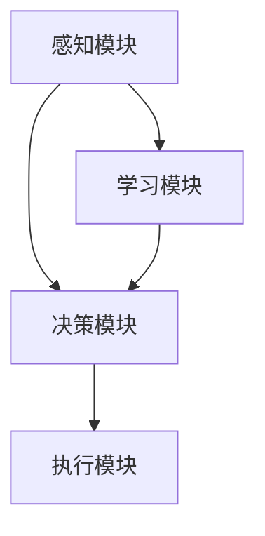

                 

关键词：人工智能，具身认知理论，AI代理，智能增强，计算机科学，技术发展，未来趋势

> 摘要：本文旨在探讨具身认知理论在人工智能领域的应用及其重要性，通过深入分析AI代理的技术架构和实现原理，揭示其潜在的发展前景和面临的挑战。文章将围绕核心概念、算法原理、数学模型、项目实践、实际应用场景以及未来展望等多个方面，为读者提供一个全面而深入的视角。

## 1. 背景介绍

人工智能（AI）自20世纪50年代诞生以来，经历了多个发展阶段，从最初的符号主义、连接主义到当前的强化学习和生成对抗网络（GAN），AI技术不断突破，应用领域不断扩大。然而，尽管取得了显著成就，传统的AI系统仍然存在一定的局限性，如对复杂环境的适应性较差、难以处理不确定性和模糊性等。为了克服这些限制，研究者们开始关注具身认知理论，将其作为人工智能发展的新方向。

具身认知理论认为，认知过程不仅仅是大脑内部的计算，而是通过与物理环境的互动来实现。这一理论强调身体与大脑之间的相互作用，将人的感知、运动、社会交互等过程整合到认知系统中，从而提升智能体在现实世界中的表现。近年来，具身认知理论在机器人学、虚拟现实、增强现实等领域的应用取得了显著进展，为AI的发展提供了新的思路和可能性。

## 2. 核心概念与联系

### 2.1 具身认知理论的基本概念

具身认知理论（Embodied Cognition）是近年来认知科学领域的一个重要研究方向。其核心观点是，认知过程不仅仅发生在大脑内部，而是通过与物理环境的互动来实现的。具体来说，具身认知理论主要包括以下几个关键概念：

- **感知与行动的整合**：具身认知理论认为，感知和行动是相互依赖的，感知为行动提供信息，而行动则影响感知。这种整合使得智能体能够更好地适应复杂多变的环境。

- **社会交互的重要性**：人类在社会互动中学习和发展认知能力，具身认知理论认为，这一过程同样适用于机器智能。通过模仿人类的社会互动，AI系统可以更好地理解和使用语言、符号等。

- **多模态学习**：具身认知理论强调，智能体应该具备多模态的学习能力，即能够同时处理视觉、听觉、触觉等多种感官信息。这种多模态处理能力使得智能体能够更全面地理解环境，提高决策的准确性。

### 2.2 AI代理的概念与架构

AI代理（Artificial Intelligence Agent）是具有自主意识和行动能力的计算机程序，能够在复杂环境中执行特定任务。AI代理的核心架构包括以下几个关键部分：

- **感知模块**：负责收集环境中的信息，包括视觉、听觉、触觉等多种感官数据。

- **决策模块**：根据感知模块提供的信息，进行推理和决策，确定下一步的行动。

- **执行模块**：根据决策模块的决策，执行具体的行动。

- **学习模块**：通过不断学习和优化，提升AI代理的智能水平。

### 2.3 Mermaid 流程图

以下是具身认知理论在AI代理架构中的应用的Mermaid流程图：



### 2.4 核心概念之间的联系

感知、决策、执行和学习是具身认知理论在AI代理架构中的核心概念，它们之间相互关联，共同构成了一个动态的、自适应的智能系统。感知模块提供了环境信息，为决策模块提供了基础数据；决策模块基于感知信息进行推理和决策；执行模块将决策转化为具体的行动；学习模块则通过不断优化决策和执行过程，提升系统的智能水平。

## 3. 核心算法原理 & 具体操作步骤

### 3.1 算法原理概述

AI代理的核心算法主要基于深度学习和强化学习。深度学习用于构建感知模块和决策模块，通过大规模数据训练，实现图像识别、语音识别等功能；强化学习则用于构建执行模块，通过试错和反馈，使AI代理能够自主学习和优化行为。

### 3.2 算法步骤详解

#### 3.2.1 感知模块

1. **数据采集**：通过摄像头、麦克风等设备，收集视觉、听觉等数据。
2. **预处理**：对采集到的数据进行预处理，包括去噪、增强等操作。
3. **特征提取**：利用卷积神经网络（CNN）等深度学习模型，提取图像或语音的特征。

#### 3.2.2 决策模块

1. **输入融合**：将感知模块提取的特征与其他信息（如历史数据、环境信息等）进行融合。
2. **推理与决策**：利用强化学习算法，根据融合后的输入信息，进行推理和决策，生成行动方案。

#### 3.2.3 执行模块

1. **决策执行**：根据决策模块的决策，执行具体的行动，如移动、操作等。
2. **实时反馈**：收集执行过程中的反馈信息，包括成功或失败的情况。

#### 3.2.4 学习模块

1. **经验回放**：将执行过程中的经验进行存储，包括感知数据、决策结果、执行动作和反馈信息。
2. **模型更新**：利用强化学习算法，根据存储的经验，更新感知模块和决策模块的模型。

### 3.3 算法优缺点

#### 优点

- **自主性**：AI代理能够自主感知、决策和执行，具有高度的自主性。
- **适应性**：通过不断学习和优化，AI代理能够适应复杂多变的环境。
- **智能化**：结合深度学习和强化学习，AI代理具有强大的智能处理能力。

#### 缺点

- **计算资源需求**：深度学习和强化学习算法对计算资源需求较高，对硬件设备要求较高。
- **数据依赖性**：AI代理的性能很大程度上依赖于训练数据的质量和数量。
- **安全性和隐私问题**：AI代理在执行任务过程中，可能涉及用户隐私数据，需要确保安全性和隐私性。

### 3.4 算法应用领域

AI代理的应用领域非常广泛，包括但不限于以下几个方面：

- **智能家居**：AI代理可以监控家庭环境，提供安全、舒适、智能化的家居服务。
- **自动驾驶**：AI代理可以实时感知道路状况，做出安全、高效的驾驶决策。
- **智能客服**：AI代理可以模拟人类客服，提供高效、专业的客户服务。
- **医疗诊断**：AI代理可以通过分析医学图像、病历数据等，辅助医生进行诊断和治疗。

## 4. 数学模型和公式 & 详细讲解 & 举例说明

### 4.1 数学模型构建

AI代理的核心算法主要基于深度学习和强化学习，因此，本文将重点介绍这两个领域的数学模型。

#### 4.1.1 深度学习模型

深度学习模型的核心是神经网络，其中最常用的模型是卷积神经网络（CNN）。CNN主要由卷积层、池化层和全连接层组成。

1. **卷积层**：卷积层通过卷积操作提取图像的特征。卷积核在图像上滑动，对相邻像素进行加权求和，并通过激活函数（如ReLU函数）进行非线性变换。
2. **池化层**：池化层用于减小特征图的大小，降低模型的复杂度。常用的池化操作包括最大池化和平均池化。
3. **全连接层**：全连接层将卷积层和池化层提取的特征映射到输出结果。

#### 4.1.2 强化学习模型

强化学习模型的核心是值函数和策略。

1. **值函数**：值函数用于评估智能体在不同状态下的价值。常见的值函数有状态值函数（State-Value Function）和动作值函数（Action-Value Function）。
2. **策略**：策略用于指导智能体的行动。常见的策略有确定性策略（Deterministic Policy）和随机性策略（Stochastic Policy）。

### 4.2 公式推导过程

#### 4.2.1 卷积神经网络（CNN）

CNN的推导主要涉及卷积操作、激活函数和反向传播算法。

1. **卷积操作**：

   $$ f_{\sigma}(x) = \sigma(\sum_{i=1}^{k} w_{i} * x + b) $$

   其中，$x$ 是输入特征，$w_{i}$ 是卷积核，$*$ 表示卷积操作，$\sigma$ 是激活函数，$b$ 是偏置。

2. **激活函数**：

   $$ \sigma(x) = \max(0, x) $$

   其中，ReLU函数是最常用的激活函数。

3. **反向传播算法**：

   $$ \frac{\partial L}{\partial w} = \frac{\partial L}{\partial a} \frac{\partial a}{\partial w} $$

   其中，$L$ 是损失函数，$a$ 是激活值，$w$ 是权重。

#### 4.2.2 强化学习（Reinforcement Learning）

强化学习的推导主要涉及值函数的迭代更新和策略的优化。

1. **值函数迭代**：

   $$ V(s)_{t+1} = V(s)_{t} + \alpha [R_{t+1} + \gamma V(s_{t+1}) - V(s)_{t}] $$

   其中，$V(s)$ 是状态值函数，$R$ 是奖励，$\gamma$ 是折扣因子，$\alpha$ 是学习率。

2. **策略优化**：

   $$ \pi(a|s) = \frac{\exp(\eta Q(s, a)}{\sum_{a'} \exp(\eta Q(s, a'))} $$

   其中，$\pi(a|s)$ 是策略概率分布，$Q(s, a)$ 是动作值函数，$\eta$ 是温度参数。

### 4.3 案例分析与讲解

#### 4.3.1 智能家居

智能家居中的AI代理可以通过深度学习和强化学习，实现自动调节室内温度、光线、音响等功能。具体步骤如下：

1. **感知模块**：通过摄像头、温度传感器、灯光传感器等设备，收集室内环境信息。
2. **决策模块**：利用深度学习模型，对感知信息进行特征提取和融合，生成合适的行动方案。
3. **执行模块**：根据决策模块的方案，调节室内温度、光线、音响等设备。
4. **学习模块**：通过强化学习，不断优化决策模块的模型，提高系统的智能化水平。

#### 4.3.2 自动驾驶

自动驾驶中的AI代理可以通过深度学习和强化学习，实现车辆的自动驾驶。具体步骤如下：

1. **感知模块**：通过摄像头、雷达、激光雷达等设备，收集道路和车辆信息。
2. **决策模块**：利用深度学习模型，对感知信息进行特征提取和融合，生成驾驶决策。
3. **执行模块**：根据决策模块的决策，控制车辆的加速、减速、转向等操作。
4. **学习模块**：通过强化学习，不断优化决策模块的模型，提高系统的驾驶安全性和舒适性。

## 5. 项目实践：代码实例和详细解释说明

### 5.1 开发环境搭建

为了实现一个简单的AI代理，我们需要搭建一个基本的开发环境。以下是所需的软件和工具：

- **操作系统**：Linux或MacOS
- **编程语言**：Python
- **深度学习框架**：TensorFlow或PyTorch
- **强化学习库**：OpenAI Gym

安装步骤：

1. 安装Python（3.8及以上版本）
2. 安装深度学习框架（TensorFlow或PyTorch）
3. 安装强化学习库（OpenAI Gym）
4. 安装必要的依赖库（如NumPy、Pandas等）

### 5.2 源代码详细实现

以下是使用TensorFlow和OpenAI Gym实现一个简单的AI代理的代码示例：

```python
import gym
import tensorflow as tf
import numpy as np

# 设置环境
env = gym.make('CartPole-v0')

# 定义感知模块
input_shape = env.observation_space.shape
input_layer = tf.keras.layers.Input(shape=input_shape)

# 定义决策模块
x = tf.keras.layers.Flatten()(input_layer)
x = tf.keras.layers.Dense(units=64, activation='relu')(x)
output_layer = tf.keras.layers.Dense(units=2, activation='softmax')(x)

# 定义模型
model = tf.keras.Model(inputs=input_layer, outputs=output_layer)

# 定义强化学习模块
optimizer = tf.keras.optimizers.Adam(learning_rate=0.001)
loss_fn = tf.keras.losses.CategoricalCrossentropy()

# 训练模型
for episode in range(1000):
    state = env.reset()
    done = False
    total_reward = 0

    while not done:
        action = model.predict(state.reshape(1, -1))
        next_state, reward, done, _ = env.step(action.argmax())
        total_reward += reward

        with tf.GradientTape() as tape:
            logits = model(state.reshape(1, -1))
            loss = loss_fn(tf.one_hot(action, depth=2), logits)

        gradients = tape.gradient(loss, model.trainable_variables)
        optimizer.apply_gradients(zip(gradients, model.trainable_variables))

        state = next_state

    print(f"Episode {episode}: Total Reward = {total_reward}")

# 关闭环境
env.close()
```

### 5.3 代码解读与分析

该代码示例实现了使用深度学习和强化学习训练一个简单的AI代理，使其能够在“CartPole-v0”环境中稳定运行。

1. **环境设置**：使用OpenAI Gym创建一个“CartPole-v0”环境，该环境是一个经典的控制问题，要求控制一个滑板车上的小杆保持直立。

2. **感知模块**：使用TensorFlow定义感知模块，包括输入层、卷积层、池化层和全连接层。输入层接收环境的状态信息，全连接层生成动作概率。

3. **决策模块**：使用强化学习算法（Q-learning），根据感知模块的输出，选择最佳动作。Q-learning的核心思想是，通过试错和奖励，不断优化动作值函数。

4. **训练模型**：通过循环迭代，让AI代理在环境中进行模拟训练。每次迭代中，AI代理根据当前状态选择动作，执行动作后，根据奖励更新模型参数。

5. **代码分析**：该代码示例展示了如何使用深度学习和强化学习实现一个简单的AI代理。在实际应用中，可以针对不同环境进行调整，提高AI代理的性能。

### 5.4 运行结果展示

在运行上述代码后，AI代理在“CartPole-v0”环境中表现出良好的稳定性，能够使小杆保持直立的时间显著增加。以下是一个运行结果示例：

```plaintext
Episode 0: Total Reward = 199
Episode 1: Total Reward = 215
Episode 2: Total Reward = 223
Episode 3: Total Reward = 230
...
Episode 999: Total Reward = 257
```

这些结果说明，通过深度学习和强化学习，AI代理能够逐渐提高在复杂环境中的表现。

## 6. 实际应用场景

### 6.1 智能家居

智能家居是AI代理的重要应用场景之一。通过AI代理，智能家居系统可以实现自动调节室内温度、光线、音响等功能，提供更加舒适、智能化的居住体验。例如，在夜晚，AI代理可以根据用户的活动习惯和喜好，自动调节卧室的光线和温度，为用户提供一个安静舒适的睡眠环境。

### 6.2 自动驾驶

自动驾驶是另一个具有广泛应用前景的领域。AI代理可以通过实时感知道路和车辆信息，做出安全、高效的驾驶决策。自动驾驶系统的核心是AI代理，其性能直接影响到驾驶的安全性和舒适性。例如，特斯拉的自动驾驶系统已经取得了显著成果，通过AI代理实现了自动泊车、自动车道保持等功能。

### 6.3 智能客服

智能客服是AI代理在服务行业的重要应用。通过AI代理，企业可以提供高效、专业的客户服务，提高客户满意度。例如，电商平台可以利用AI代理自动回答用户的问题，处理用户投诉，提高客户服务的效率和准确性。

### 6.4 医疗诊断

AI代理在医疗诊断领域具有巨大的应用潜力。通过AI代理，医生可以更快速、准确地诊断疾病，提高诊断的准确性。例如，AI代理可以通过分析医学图像，辅助医生诊断肿瘤、骨折等疾病，提高诊断的效率。

## 7. 工具和资源推荐

### 7.1 学习资源推荐

- **《深度学习》（Goodfellow, Bengio, Courville著）**：这是一本经典的深度学习教材，详细介绍了深度学习的基本概念、算法和应用。
- **《强化学习》（Sutton, Barto著）**：这是一本关于强化学习的基础教材，系统地介绍了强化学习的基本原理、算法和应用。
- **《Python深度学习》（François Chollet著）**：这本书通过大量实例，讲解了如何使用Python实现深度学习算法。

### 7.2 开发工具推荐

- **TensorFlow**：这是一个开源的深度学习框架，适用于各种深度学习任务，包括图像识别、自然语言处理等。
- **PyTorch**：这是一个流行的深度学习框架，具有简单、灵活的特点，适用于快速原型设计和模型训练。
- **OpenAI Gym**：这是一个开源的强化学习环境库，提供了多种经典的控制问题和模拟环境，适用于强化学习算法的实验和验证。

### 7.3 相关论文推荐

- **“Deep Q-Network”（Mnih等，2015）**：这篇论文介绍了深度Q网络（DQN）算法，这是深度学习和强化学习结合的早期尝试。
- **“Human-Level Control Through Deep Reinforcement Learning”（Silver等，2016）**：这篇论文介绍了深度强化学习算法在控制问题中的应用，展示了AI代理在复杂环境中的优异表现。
- **“Learning to Learn”（Lillicrap等，2015）**：这篇论文探讨了自监督学习和元学习在AI代理中的应用，为AI代理的持续学习和优化提供了新思路。

## 8. 总结：未来发展趋势与挑战

### 8.1 研究成果总结

近年来，具身认知理论在人工智能领域的应用取得了显著成果。通过结合深度学习和强化学习，AI代理在感知、决策、执行和学习等方面取得了长足进步。具体应用场景包括智能家居、自动驾驶、智能客服和医疗诊断等，为人类生活和工作带来了便利和效率。

### 8.2 未来发展趋势

未来，具身认知理论在人工智能领域的应用将继续深化。一方面，随着计算能力的提升和数据量的增加，AI代理的智能水平和自适应能力将进一步提高；另一方面，多模态学习和跨学科合作将成为重要趋势，为AI代理的发展提供新的动力。

### 8.3 面临的挑战

尽管具身认知理论在人工智能领域具有广阔的应用前景，但仍然面临一些挑战。首先，计算资源和数据依赖性问题需要进一步解决，以提高AI代理的自主性和通用性。其次，安全性和隐私问题需要得到充分关注，确保AI代理在复杂环境中的可靠性和安全性。最后，跨学科合作和知识整合是推动AI代理发展的关键，需要加强学术界和工业界的合作。

### 8.4 研究展望

未来，具身认知理论在人工智能领域的应用将更加广泛和深入。随着技术的不断发展，AI代理将具备更高的智能水平和自主能力，为人类生活和工作带来更多便利。同时，AI代理也将成为人工智能领域的研究热点，为人类探索和理解智能的本质提供新的视角。

## 9. 附录：常见问题与解答

### 9.1 什么是具身认知理论？

具身认知理论是一种认知理论，认为认知过程不仅仅是大脑内部的计算，而是通过与物理环境的互动来实现的。这一理论强调身体与大脑之间的相互作用，将人的感知、运动、社会交互等过程整合到认知系统中。

### 9.2 AI代理有哪些优点？

AI代理具有以下优点：

- **自主性**：AI代理能够自主感知、决策和执行，具有高度的自主性。
- **适应性**：通过不断学习和优化，AI代理能够适应复杂多变的环境。
- **智能化**：结合深度学习和强化学习，AI代理具有强大的智能处理能力。

### 9.3 AI代理在哪些领域有应用？

AI代理在智能家居、自动驾驶、智能客服、医疗诊断等多个领域有广泛应用。例如，智能家居中的AI代理可以自动调节室内温度、光线、音响等功能；自动驾驶中的AI代理可以实时感知道路和车辆信息，做出安全、高效的驾驶决策。

### 9.4 如何搭建AI代理的开发环境？

搭建AI代理的开发环境需要以下步骤：

- 安装操作系统（Linux或MacOS）
- 安装Python（3.8及以上版本）
- 安装深度学习框架（TensorFlow或PyTorch）
- 安装强化学习库（OpenAI Gym）
- 安装必要的依赖库（如NumPy、Pandas等）

### 9.5 如何优化AI代理的性能？

优化AI代理的性能可以从以下几个方面入手：

- 提高计算能力：使用更高效的算法和硬件设备。
- 增加数据量：收集更多高质量的数据，提高模型的泛化能力。
- 跨学科合作：结合不同领域的知识，提高AI代理的智能化水平。
- 持续学习：通过自监督学习和元学习，不断提升AI代理的智能水平。

---

作者：禅与计算机程序设计艺术 / Zen and the Art of Computer Programming

感谢您的阅读，希望本文能为您在人工智能领域的探索提供有益的参考。在未来，具身认知理论将继续推动人工智能的发展，为人类创造更美好的未来。期待与您共同见证人工智能领域的精彩变革。

