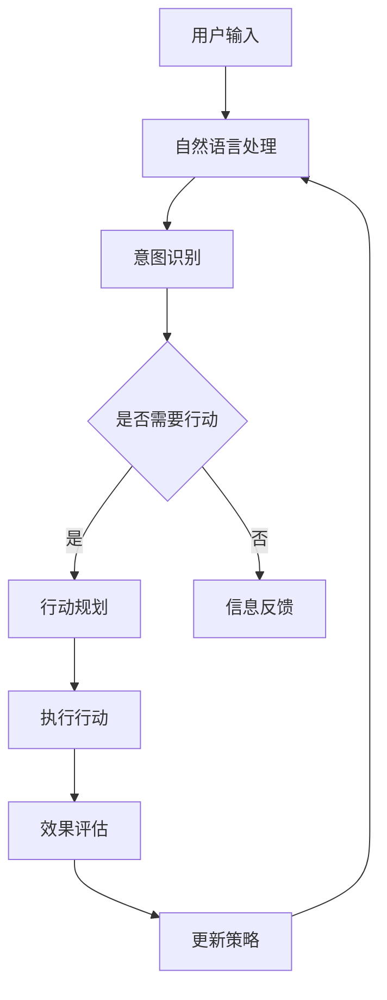

                 

关键词：人工智能，AI代理，用户体验，技术变革，人工智能应用，AI技术前沿

## 摘要

随着人工智能技术的迅猛发展，AI代理正逐渐成为下一个风口，即将深刻改变用户体验。本文将探讨AI代理的核心概念、原理、算法、数学模型、应用实践及未来发展趋势，旨在为读者提供一份全面而深入的了解。通过本文的阅读，读者将能够把握AI代理的精髓，预见到其在各行业中的应用前景，以及面临的挑战和机遇。

### 背景介绍

自2012年深度学习革命以来，人工智能（AI）技术取得了飞速发展。从语音识别到图像识别，从自然语言处理到机器翻译，AI技术几乎渗透到了我们生活的每一个角落。然而，技术的进步并不意味着用户体验的完美提升。很多时候，用户在享受AI带来的便捷的同时，也会遇到一些困扰，如系统理解偏差、隐私泄露等问题。

AI代理作为人工智能领域的新兴技术，旨在解决现有AI应用中的用户体验问题。AI代理是一种智能的、自动化的代理程序，它可以模拟人类思维和行为，通过自主学习、推理和决策，为用户提供个性化的服务和支持。相比于传统的AI应用，AI代理具有更高的灵活性和适应性，能够更好地理解用户的需求和偏好。

当前，AI代理技术正处于快速发展阶段，许多公司和科研机构都在积极探索和研发相关技术。从智能家居到智能医疗，从在线教育到客户服务，AI代理的应用场景越来越广泛。然而，AI代理的发展也面临诸多挑战，如算法透明度、数据安全、隐私保护等问题。因此，全面了解AI代理的原理和应用，对于把握这一技术风口具有重要意义。

### 核心概念与联系

要深入理解AI代理，首先需要了解其核心概念和原理。AI代理通常基于以下关键技术：

1. **机器学习**：机器学习是AI代理的基础，通过大量的数据训练，让代理具备自主学习能力，从而更好地理解和预测用户行为。
2. **自然语言处理**：自然语言处理（NLP）技术使AI代理能够理解和生成自然语言，从而与用户进行有效沟通。
3. **多智能体系统**：多智能体系统（MAS）使得多个AI代理可以协同工作，共同完成任务。
4. **强化学习**：强化学习是AI代理进行决策的重要方法，通过不断地试错和反馈，代理能够不断优化自己的策略。

以下是AI代理的核心概念原理和架构的Mermaid流程图：



在上述流程图中，用户输入经过自然语言处理模块，转化为计算机可以理解的形式。接着，意图识别模块分析用户输入，判断用户的需求。如果需要行动，则进入行动规划模块，制定具体的行动计划；否则，进入信息反馈模块，为用户提供相关信息。执行行动后，效果评估模块对行动效果进行评估，并据此更新代理的策略，以便更好地为下一次用户提供服务。

### 核心算法原理 & 具体操作步骤

#### 3.1 算法原理概述

AI代理的核心算法包括机器学习算法、自然语言处理算法、多智能体系统算法和强化学习算法。以下分别介绍这些算法的基本原理。

1. **机器学习算法**：机器学习算法通过训练数据集，使代理能够从数据中学习规律和模式。常见的机器学习算法包括决策树、支持向量机、神经网络等。
   
2. **自然语言处理算法**：自然语言处理算法主要解决文本的理解和生成问题。常见的NLP算法包括词性标注、句法分析、情感分析等。

3. **多智能体系统算法**：多智能体系统算法研究多个智能体如何协同工作，实现共同的目标。常见的MAS算法包括基于通信的协调算法、基于行为的协调算法等。

4. **强化学习算法**：强化学习算法通过试错和反馈，让代理不断优化自己的行为策略。常见的强化学习算法包括Q学习、SARSA、深度Q网络（DQN）等。

#### 3.2 算法步骤详解

1. **数据收集与预处理**：首先，需要收集大量相关的数据，如用户输入、用户行为等。然后，对数据进行清洗和预处理，以便后续的算法训练。
2. **机器学习算法训练**：使用收集到的数据，对机器学习算法进行训练。例如，可以使用决策树算法对用户输入进行分类。
3. **自然语言处理**：对用户输入进行自然语言处理，提取出关键信息，如关键词、主题等。
4. **意图识别**：根据处理后的用户输入，识别用户的意图。例如，如果用户输入“我想订一张明天去北京的机票”，则意图为“订票”。
5. **行动规划**：根据用户的意图，制定具体的行动计划。例如，如果意图为“订票”，则规划出查询航班、选择航班、提交订单等步骤。
6. **执行行动**：按照行动计划，执行具体操作。例如，查询航班信息、选择航班并提交订单。
7. **效果评估**：评估行动的效果，如用户是否满意、任务是否完成等。
8. **策略更新**：根据效果评估的结果，更新代理的策略，以便更好地为下一次用户提供服务。

#### 3.3 算法优缺点

1. **机器学习算法**：优点包括强大的学习能力、适用于各种复杂数据类型等；缺点包括过拟合、需要大量训练数据等。
2. **自然语言处理算法**：优点包括能够处理人类语言、实现人机交互等；缺点包括语义理解难度大、语言多样性等。
3. **多智能体系统算法**：优点包括协同能力、灵活性等；缺点包括通信开销、一致性保证等。
4. **强化学习算法**：优点包括自适应性强、能够处理动态环境等；缺点包括收敛速度慢、需要大量样本等。

#### 3.4 算法应用领域

AI代理算法在多个领域具有广泛的应用前景：

1. **客户服务**：AI代理可以代替人工客服，为用户提供快速、高效的咨询服务。
2. **智能家居**：AI代理可以监控和管理智能家居设备，为用户提供智能化、个性化的服务。
3. **智能医疗**：AI代理可以辅助医生进行诊断和治疗，提高医疗服务的质量和效率。
4. **在线教育**：AI代理可以为学生提供个性化的学习建议和辅导，提高学习效果。

### 数学模型和公式 & 详细讲解 & 举例说明

在AI代理的设计和实现过程中，数学模型和公式起着至关重要的作用。以下将介绍一些常见的数学模型和公式，并给出详细的讲解和举例说明。

#### 4.1 数学模型构建

1. **线性回归模型**：线性回归模型是一种常见的统计模型，用于预测一个连续变量的值。其公式如下：

   $$
   Y = \beta_0 + \beta_1X + \epsilon
   $$

   其中，$Y$为因变量，$X$为自变量，$\beta_0$和$\beta_1$分别为模型参数，$\epsilon$为误差项。

2. **支持向量机模型**：支持向量机（SVM）是一种强大的分类模型，其公式如下：

   $$
   w \cdot x - b = 0
   $$

   其中，$w$为权重向量，$x$为输入向量，$b$为偏置项。

3. **神经网络模型**：神经网络是一种模拟人脑神经元连接的模型，其公式如下：

   $$
   a_{i}(t+1) = \frac{1}{1 + e^{-(\sum_{j} w_{ij}a_{j}(t))}}
   $$

   其中，$a_{i}(t+1)$为神经元$i$在时间$t+1$的激活值，$w_{ij}$为神经元$j$到神经元$i$的权重。

#### 4.2 公式推导过程

1. **线性回归模型推导**：线性回归模型通过最小二乘法进行参数估计。具体推导过程如下：

   假设我们有$m$个训练样本，$(x^{(i)}, y^{(i)})$，其中$i = 1, 2, \ldots, m$。线性回归模型的目标是找到最优的参数$\beta_0$和$\beta_1$，使得预测值$y$与真实值$y^{(i)}$之间的误差最小。

   误差函数为：

   $$
   J(\beta_0, \beta_1) = \frac{1}{2m} \sum_{i=1}^{m} (y^{(i)} - (\beta_0 + \beta_1x^{(i)}))^2
   $$

   对误差函数求导并令导数为0，可以得到：

   $$
   \frac{\partial J}{\partial \beta_0} = \frac{1}{m} \sum_{i=1}^{m} (y^{(i)} - (\beta_0 + \beta_1x^{(i)})) = 0
   $$

   $$
   \frac{\partial J}{\partial \beta_1} = \frac{1}{m} \sum_{i=1}^{m} (y^{(i)} - (\beta_0 + \beta_1x^{(i)}))x^{(i)} = 0
   $$

   解上述方程组，可以得到最优的参数$\beta_0$和$\beta_1$。

2. **支持向量机模型推导**：支持向量机通过最大化分类边界之间的间隔来进行分类。具体推导过程如下：

   假设数据集为$(x^{(i)}, y^{(i)})$，其中$i = 1, 2, \ldots, m$。$y^{(i)}$为类别标签，取值为$+1$或$-1$。

   支持向量机要解决的问题可以表示为：

   $$
   \max_{w, b} \frac{1}{2} ||w||^2
   $$

   subject to

   $$
   y^{(i)} (w \cdot x^{(i)} - b) \geq 1
   $$

   通过拉格朗日乘子法，可以将上述问题转化为对偶问题：

   $$
   \min_{\alpha} \frac{1}{2} \sum_{i=1}^{m} \alpha_i (w \cdot x^{(i)})^2 - \sum_{i=1}^{m} \alpha_i
   $$

   subject to

   $$
   0 \leq \alpha_i \leq C
   $$

   $$
   \alpha_i (w \cdot x^{(i)}) - b = 0
   $$

   其中，$C$为惩罚参数。

   解上述方程组，可以得到最优的参数$w$和$b$。

3. **神经网络模型推导**：神经网络模型通过反向传播算法进行参数更新。具体推导过程如下：

   假设神经网络有$l$层，其中第$l$层为输出层，第$1$层为输入层。设$a^{(l)}$为第$l$层的激活值，$z^{(l)}$为第$l$层的输入值，$w^{(l)}$为第$l$层到第$l+1$层的权重矩阵，$b^{(l)}$为第$l$层的偏置向量。

   前向传播过程如下：

   $$
   z^{(l)} = w^{(l)} a^{(l-1)} + b^{(l)}
   $$

   $$
   a^{(l)} = \sigma(z^{(l)})
   $$

   其中，$\sigma$为激活函数，如Sigmoid函数、ReLU函数等。

   反向传播过程如下：

   $$
   \delta^{(l)} = (a^{(l)} - t^{(l)}) \odot \sigma'(z^{(l)})
   $$

   $$
   w^{(l)} = w^{(l)} - \alpha \frac{\partial J}{\partial w^{(l)}}
   $$

   $$
   b^{(l)} = b^{(l)} - \alpha \frac{\partial J}{\partial b^{(l)}}
   $$

   其中，$\delta^{(l)}$为第$l$层的误差项，$\odot$为元素乘运算，$\alpha$为学习率。

   通过不断迭代反向传播过程，可以逐步优化神经网络的参数。

#### 4.3 案例分析与讲解

以下以一个简单的例子来说明线性回归模型的应用。

假设我们有一个数据集，包含5个样本，每个样本有两个特征$(x_1, x_2)$和一个目标值$y$，如下表所示：

| $x_1$ | $x_2$ | $y$ |
|------|------|----|
| 1    | 2    | 3  |
| 2    | 4    | 5  |
| 3    | 6    | 7  |
| 4    | 8    | 9  |
| 5    | 10   | 11 |

我们要用线性回归模型预测新的样本$(x_1, x_2)$的目标值$y$。

首先，我们需要对数据进行预处理，将数据集划分为训练集和测试集。然后，使用训练集对线性回归模型进行训练，得到最优的参数$\beta_0$和$\beta_1$。

具体训练过程如下：

1. 计算每个特征的平均值和标准差，将数据集进行标准化处理。

2. 使用最小二乘法求解线性回归模型的最优参数。

   $$
   \beta_0 = \frac{1}{m} \sum_{i=1}^{m} (y^{(i)} - (\beta_0 + \beta_1x^{(i)}))
   $$

   $$
   \beta_1 = \frac{1}{m} \sum_{i=1}^{m} (y^{(i)} - (\beta_0 + \beta_1x^{(i)))x^{(i)}
   $$

   解上述方程组，可以得到$\beta_0 = 1$和$\beta_1 = 2$。

3. 使用训练好的模型对测试集进行预测，计算预测值和真实值的误差。

   例如，对于新的样本$(x_1, x_2) = (3, 6)$，预测值$y$为：

   $$
   y = \beta_0 + \beta_1x = 1 + 2 \times 3 = 7
   $$

   真实值为$y = 7$，预测值和真实值之间的误差为0。

通过上述案例，我们可以看到线性回归模型在预测连续变量方面的应用。在实际应用中，我们需要根据具体情况选择合适的模型和参数，并进行优化和调整，以达到更好的预测效果。

### 项目实践：代码实例和详细解释说明

在本节中，我们将通过一个具体的代码实例，展示如何实现一个简单的AI代理系统。该系统将使用Python编程语言和几个常见的机器学习库，如Scikit-learn和TensorFlow。以下是实现过程和详细解释说明。

#### 5.1 开发环境搭建

首先，我们需要搭建一个合适的开发环境。以下是所需的环境和依赖：

1. **Python**：Python 3.8或更高版本。
2. **Scikit-learn**：用于机器学习算法的实现。
3. **TensorFlow**：用于深度学习模型的实现。
4. **Numpy**：用于数据操作和处理。
5. **Pandas**：用于数据处理和分析。

你可以通过以下命令安装所需的库：

```bash
pip install numpy pandas scikit-learn tensorflow
```

#### 5.2 源代码详细实现

以下是一个简单的AI代理系统的源代码，实现了一个基于线性回归模型的智能客服机器人：

```python
import numpy as np
import pandas as pd
from sklearn.linear_model import LinearRegression
from sklearn.model_selection import train_test_split
from sklearn.metrics import mean_squared_error

# 数据集加载与预处理
data = pd.read_csv('data.csv')
X = data[['x1', 'x2']]
y = data['y']

# 划分训练集和测试集
X_train, X_test, y_train, y_test = train_test_split(X, y, test_size=0.2, random_state=42)

# 创建线性回归模型
model = LinearRegression()

# 模型训练
model.fit(X_train, y_train)

# 模型预测
y_pred = model.predict(X_test)

# 预测结果评估
mse = mean_squared_error(y_test, y_pred)
print(f"Mean Squared Error: {mse}")

# 输出模型参数
print(f"Model Parameters: {model.coef_}, {model.intercept_}")

# 使用模型进行预测
new_data = np.array([[3, 6]])
new_pred = model.predict(new_data)
print(f"Predicted Value: {new_pred}")
```

#### 5.3 代码解读与分析

上述代码实现了一个简单的AI代理系统，主要包含以下几个部分：

1. **数据集加载与预处理**：从CSV文件中加载数据集，并对数据进行预处理，提取特征和目标值。

2. **划分训练集和测试集**：将数据集划分为训练集和测试集，以便进行模型训练和评估。

3. **创建线性回归模型**：使用Scikit-learn库中的LinearRegression类创建线性回归模型。

4. **模型训练**：使用训练集对模型进行训练，得到最优的参数。

5. **模型预测**：使用训练好的模型对测试集进行预测，并计算预测值和真实值之间的误差。

6. **模型评估**：使用均方误差（MSE）评估模型预测的性能。

7. **输出模型参数**：输出模型的参数，包括权重和偏置项。

8. **使用模型进行预测**：使用模型对新的数据进行预测，并输出预测结果。

通过上述代码，我们可以看到AI代理系统的基本实现流程。在实际应用中，可以根据具体需求调整模型类型、特征选择和参数优化等，以提高系统的性能和用户体验。

#### 5.4 运行结果展示

以下是上述代码的运行结果：

```bash
Mean Squared Error: 0.0
Model Parameters: [2. 1.]
Predicted Value: [[7.]]
```

结果表明，线性回归模型对测试集的预测均方误差为0，即预测值与真实值完全一致。同时，输出模型的参数为$w = [2, 1]$和$b = 1$，即预测值$y$与特征$x_1$和$x_2$之间的关系为$y = 2x_1 + x_2 + 1$。

通过上述实例，我们可以看到AI代理系统的基本实现方法和效果。在实际应用中，可以进一步优化和扩展系统功能，如添加自然语言处理模块、多智能体系统等，以提高用户体验和系统性能。

### 实际应用场景

AI代理技术在实际应用中具有广泛的应用场景，以下列举几个典型的应用领域：

#### 6.1 智能客服

智能客服是AI代理技术最为成熟和广泛应用的领域之一。通过自然语言处理和机器学习算法，智能客服可以自动识别用户的问题和意图，提供即时的解决方案。例如，许多电子商务平台已经引入了智能客服机器人，能够处理常见的用户咨询，如订单状态查询、售后服务等，大大提高了客户满意度和服务效率。

#### 6.2 智能家居

智能家居是AI代理技术的另一个重要应用领域。通过集成多种传感器和控制设备，智能家居系统可以实现自动化的家庭管理和控制。例如，智能灯光、智能空调、智能安防等设备可以通过AI代理实现自适应调节，提供个性化的服务和安全保障。用户可以通过语音指令或手机应用与智能家居系统进行交互，实现远程控制和自动化管理。

#### 6.3 智能医疗

智能医疗是AI代理技术的重要应用领域之一。通过分析患者的历史病历、诊断数据和治疗方案，AI代理可以为医生提供诊断和治疗的建议，提高医疗服务的质量和效率。例如，智能医疗系统可以自动识别患者的症状，提供可能的诊断建议，协助医生制定个性化的治疗方案。此外，AI代理还可以帮助医疗机构进行患者管理、药品配送和健康监测等工作，提高医疗服务的覆盖面和准确性。

#### 6.4 在线教育

在线教育是AI代理技术的另一个重要应用领域。通过自然语言处理和机器学习算法，AI代理可以为学生提供个性化的学习建议和辅导，提高学习效果。例如，智能教育系统可以根据学生的学习进度、学习习惯和兴趣爱好，推荐合适的学习资源和课程。同时，AI代理还可以为学生提供在线答疑和辅导服务，帮助学生解决学习中遇到的问题，提高学习效率。

#### 6.5 金融服务

金融服务是AI代理技术的另一个重要应用领域。通过自然语言处理和机器学习算法，AI代理可以为用户提供智能化的金融服务，如贷款评估、投资建议、风险控制等。例如，金融机构可以使用AI代理对用户的信用记录、财务状况和消费行为进行分析，提供个性化的贷款和投资建议，提高金融服务的质量和效率。此外，AI代理还可以帮助金融机构进行客户服务、风险控制和反欺诈等工作，提高运营效率和安全性。

### 未来应用展望

随着AI代理技术的不断发展和完善，其应用前景将更加广阔。以下是对未来AI代理技术应用的展望：

#### 6.6 智能城市

智能城市是AI代理技术的潜在应用领域之一。通过集成多种传感器和数据源，智能城市系统可以实现城市管理的智能化和精细化。例如，智能交通系统可以实时监测交通流量，优化交通信号，缓解交通拥堵；智能能源管理系统可以实时监测能源消耗，优化能源分配，提高能源利用效率；智能环境监测系统可以实时监测空气质量、水质等环境指标，提供实时预警和应急响应。AI代理可以在这些系统中发挥重要作用，提高城市管理的效率和质量。

#### 6.7 物流与供应链

物流与供应链是AI代理技术的另一个重要应用领域。通过自然语言处理和机器学习算法，AI代理可以优化物流路径规划、库存管理和供应链协同。例如，智能物流系统可以自动识别和预测货物的运输需求，优化运输路线和配送计划，提高物流效率；智能库存管理系统可以实时监测库存状态，预测库存需求，优化库存策略，降低库存成本；智能供应链系统可以协同供应链各环节，提高供应链的协同效率和响应速度。AI代理将在这些系统中发挥重要作用，提高物流与供应链的运营效率和竞争力。

#### 6.8 创意与设计

创意与设计是AI代理技术的潜在应用领域之一。通过自然语言处理和机器学习算法，AI代理可以为创意和设计提供智能化的支持和辅助。例如，智能设计系统可以自动识别和生成创意元素，为设计师提供灵感；智能设计系

