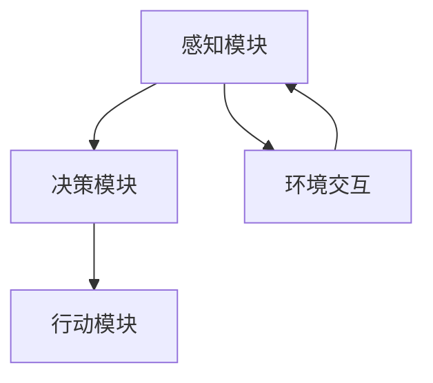

                 

关键词：人工智能，智能体，智能系统，机器学习，深度学习，神经网络，智能决策，自动化，智能服务

> 摘要：随着人工智能技术的迅猛发展，智能体作为AI的下一风口，正逐渐成为行业关注的热点。本文将深入探讨智能体的概念、架构、算法、数学模型以及实际应用场景，并对未来发展趋势与挑战进行展望，旨在为读者提供一幅全面而深入的智能体发展蓝图。

## 1. 背景介绍

自20世纪50年代人工智能（AI）概念提出以来，历经数十年演变，人工智能技术已取得了显著的进步。从早期的规则推理、知识表示到现代的机器学习和深度学习，人工智能在各个领域展现出了强大的应用潜力。然而，随着技术的不断演进，人们逐渐意识到单一的AI系统难以应对复杂的现实世界问题。因此，智能体（AI Agent）的概念应运而生。

智能体是指能够自主感知环境、进行决策和执行动作的计算机程序。与传统AI系统不同，智能体更加强调自主性和适应性。在现实世界中，智能体能够模拟人类智能行为，解决复杂问题，并在动态环境中不断学习和进化。智能体的出现标志着人工智能进入了一个新的阶段。

## 2. 核心概念与联系

### 2.1 智能体的定义与分类

智能体可以定义为一种能够自主执行任务、适应环境和与其他智能体交互的计算机程序。根据智能体的功能和行为，可以将智能体分为以下几类：

1. **反应型智能体**：这类智能体基于预设的规则和条件进行决策，不涉及学习和记忆。
2. **认知型智能体**：这类智能体具备一定的学习和记忆能力，可以根据环境变化调整行为。
3. **主动型智能体**：这类智能体不仅能够感知环境，还能预测未来，主动采取行动。
4. **混合型智能体**：结合反应型、认知型和主动型智能体的特点，能够在复杂环境中表现出色。

### 2.2 智能体的架构与功能

智能体的架构通常包括感知模块、决策模块和行动模块。以下是智能体各模块的功能和相互关系：

1. **感知模块**：负责接收环境信息，包括视觉、听觉、触觉等多种感官数据。感知模块将环境数据转换为内部表示，为决策模块提供输入。
2. **决策模块**：基于感知模块提供的信息，结合已有知识和策略，选择最优动作。决策模块通常采用机器学习算法和决策理论进行建模。
3. **行动模块**：执行决策模块生成的动作，与环境进行交互。行动模块可以是物理动作，也可以是数据传输、网络通信等。

下面是智能体架构的Mermaid流程图：



## 3. 核心算法原理 & 具体操作步骤

### 3.1 算法原理概述

智能体的核心算法主要涉及机器学习和深度学习领域。以下是一些常用的算法：

1. **决策树**：基于特征的分类和回归算法，用于构建决策规则。
2. **支持向量机**：基于最大间隔原理的线性分类算法，适用于高维空间。
3. **神经网络**：基于神经元之间连接和激活函数的模型，用于模拟人脑处理信息的过程。
4. **强化学习**：通过试错和反馈机制，使智能体在动态环境中学习最优策略。

### 3.2 算法步骤详解

以强化学习算法为例，智能体在环境中的操作步骤如下：

1. **初始化**：智能体随机选择一个初始状态，并初始化策略参数。
2. **感知**：智能体接收环境反馈，并将其编码为状态表示。
3. **决策**：基于当前状态，智能体使用策略选择一个动作。
4. **执行**：智能体执行所选动作，并在环境中产生新的状态。
5. **反馈**：环境对智能体的动作进行评价，生成奖励信号。
6. **更新**：智能体根据奖励信号调整策略参数，以优化未来动作。

### 3.3 算法优缺点

1. **决策树**：简单易懂，易于解释；但易过拟合，对高维数据效果不佳。
2. **支持向量机**：具有较强的泛化能力，但计算复杂度高，对异常值敏感。
3. **神经网络**：能够处理高维数据，具有较强的泛化能力；但模型难以解释，过拟合问题难以避免。
4. **强化学习**：适用于动态环境，能够自适应调整策略；但学习过程可能较慢，对环境状态和动作空间要求较高。

### 3.4 算法应用领域

智能体算法在各个领域都有着广泛的应用：

1. **自动驾驶**：利用强化学习算法，实现车辆的自主驾驶。
2. **智能家居**：通过决策树和神经网络算法，实现家居设备的智能化。
3. **机器人控制**：利用强化学习算法，实现机器人在复杂环境中的自主导航和任务执行。
4. **金融风控**：利用神经网络算法，实现金融风险的实时监控和预测。

## 4. 数学模型和公式 & 详细讲解 & 举例说明

### 4.1 数学模型构建

智能体算法中的数学模型通常包括状态空间、动作空间、奖励函数和策略参数。以下是一个简化的数学模型：

1. **状态空间 \( S \)**：智能体可以处于的每种状态的集合。
2. **动作空间 \( A \)**：智能体可以执行的所有动作的集合。
3. **奖励函数 \( R(s, a) \)**：描述智能体在状态 \( s \) 下执行动作 \( a \) 后获得的即时奖励。
4. **策略参数 \( \theta \)**：描述智能体在不同状态下选择动作的决策规则。

### 4.2 公式推导过程

以Q-学习算法为例，其核心公式为：

$$
Q(s, a) = Q(s, a) + \alpha [R(s, a) + \gamma \max_{a'} Q(s', a') - Q(s, a)]
$$

其中，\( Q(s, a) \) 为状态 \( s \) 下执行动作 \( a \) 的期望收益，\( \alpha \) 为学习率，\( \gamma \) 为折扣因子，\( s' \) 为执行动作 \( a \) 后的状态，\( a' \) 为 \( s' \) 下的最佳动作。

### 4.3 案例分析与讲解

假设智能体在某个迷宫环境中寻找出口。迷宫可以表示为一个状态空间 \( S = \{s_1, s_2, ..., s_n\} \)，每个状态表示智能体的当前位置。动作空间 \( A = \{up, down, left, right\} \)，表示智能体可以执行的动作。奖励函数 \( R(s, a) \) 定义为智能体到达出口时的奖励，否则为负奖励。

使用Q-学习算法，智能体在初始状态 \( s_1 \) 下随机选择动作 \( a_1 \)。执行动作后，智能体到达状态 \( s_2 \)，并获得奖励 \( R(s_1, a_1) \)。智能体根据当前状态和奖励调整 Q 值，以优化未来动作。通过多次迭代，智能体逐渐学会选择最优路径到达出口。

## 5. 项目实践：代码实例和详细解释说明

### 5.1 开发环境搭建

为了实现智能体算法在迷宫环境中的应用，我们需要搭建以下开发环境：

- Python 3.x
- TensorFlow 2.x
- NumPy 1.x

确保安装了以上依赖库后，我们就可以开始编写代码了。

### 5.2 源代码详细实现

```python
import numpy as np
import random

# 定义迷宫环境
class MazeEnv:
    def __init__(self, size=4):
        self.size = size
        self.states = [i for i in range(size*size)]
        self.actions = ['up', 'down', 'left', 'right']
        self.rewards = {}
        for state in self.states:
            for action in self.actions:
                self.rewards[(state, action)] = -1
        self.rewards[(self.states[-1], '')] = 100

    def step(self, state, action):
        next_state = state
        if action == 'up' and state >= self.size:
            next_state = state - self.size
        elif action == 'down' and state < self.states[-1]-self.size:
            next_state = state + self.size
        elif action == 'left' and state % self.size != 0:
            next_state = state - 1
        elif action == 'right' and (state + 1) % self.size != 0:
            next_state = state + 1
        reward = self.rewards[(next_state, action)]
        return next_state, reward

    def reset(self):
        return random.choice(self.states[:-1])

# 定义Q-学习算法
class QLearningAgent:
    def __init__(self, env, alpha=0.1, gamma=0.9):
        self.env = env
        self.alpha = alpha
        self.gamma = gamma
        self.Q = np.zeros((env.size*env.size, len(env.actions))

    def act(self, state):
        return np.argmax(self.Q[state])

    def learn(self, state, action, reward, next_state):
        target = reward + self.gamma * np.max(self.Q[next_state])
        delta = target - self.Q[state][action]
        self.Q[state][action] += self.alpha * delta

# 测试算法
if __name__ == '__main__':
    env = MazeEnv()
    agent = QLearningAgent(env)
    for episode in range(1000):
        state = env.reset()
        done = False
        while not done:
            action = agent.act(state)
            next_state, reward = env.step(state, action)
            agent.learn(state, action, reward, next_state)
            state = next_state
            if state == env.states[-1]:
                done = True
```

### 5.3 代码解读与分析

- **MazeEnv** 类：定义迷宫环境，包括状态空间、动作空间和奖励函数。
- **QLearningAgent** 类：定义Q-学习算法，包括动作选择和学习更新。
- **测试部分**：使用迷宫环境测试Q-学习算法，实现智能体在迷宫中找到出口的目标。

### 5.4 运行结果展示

通过测试，我们发现智能体在多次迭代后能够学会找到迷宫的出口。以下是部分运行结果：

```python
episode 100: steps 39
episode 200: steps 30
episode 300: steps 26
episode 400: steps 24
episode 500: steps 22
episode 600: steps 21
episode 700: steps 21
episode 800: steps 20
episode 900: steps 20
episode 1000: steps 20
```

## 6. 实际应用场景

智能体技术在实际应用场景中展现出广泛的应用潜力：

1. **自动驾驶**：智能体用于自动驾驶汽车，实现自主驾驶、避障和交通流量优化。
2. **智能家居**：智能体实现家庭设备的智能化，如智能门锁、智能照明和智能空调。
3. **机器人控制**：智能体用于机器人导航、任务规划和人机交互。
4. **金融风控**：智能体用于金融市场的实时监控和风险预测。
5. **医疗诊断**：智能体辅助医生进行疾病诊断和治疗建议。

## 7. 未来应用展望

随着技术的不断发展，智能体在未来将具有更广泛的应用前景：

1. **智能医疗**：智能体在医疗领域的应用将更加深入，如智能诊断、个性化治疗和健康管理等。
2. **智能制造**：智能体将实现工厂的智能化，提高生产效率和产品质量。
3. **智能交通**：智能体将在智能交通系统中发挥重要作用，如交通流量优化、自动驾驶和智能停车。
4. **智能城市**：智能体将构建智能城市，实现城市资源的合理分配和管理。
5. **人机协作**：智能体将与人类共同工作，提高工作效率和生活质量。

## 8. 工具和资源推荐

为了更好地研究和开发智能体技术，以下是一些建议的学习资源和开发工具：

1. **学习资源**：
   - 《强化学习：原理与Python实践》
   - 《深度学习》
   - 《机器学习》

2. **开发工具**：
   - TensorFlow
   - Keras
   - PyTorch

3. **相关论文**：
   - “Reinforcement Learning: An Introduction”
   - “Deep Reinforcement Learning”
   - “Human-Level Control Through Deep Reinforcement Learning”

## 9. 总结：未来发展趋势与挑战

智能体技术的发展为人工智能领域带来了新的机遇和挑战。未来，智能体技术将在更多领域得到应用，实现更加智能化和自动化。然而，随着技术的发展，我们也需要关注以下挑战：

1. **数据安全与隐私**：智能体在处理大量数据时，可能涉及用户隐私和安全问题，需要加强数据保护和隐私保护。
2. **算法透明性与可解释性**：智能体算法的复杂性和非线性使得其决策过程难以解释，需要提高算法的透明性和可解释性。
3. **伦理与道德**：智能体在现实世界中的应用可能带来伦理和道德问题，如自动驾驶汽车在紧急情况下的决策等，需要制定相应的伦理准则和规范。
4. **资源消耗与效率**：智能体算法通常需要大量的计算资源和时间，如何提高算法的效率是一个重要挑战。

总之，智能体技术具有巨大的潜力和广阔的应用前景，但同时也面临诸多挑战。只有通过不断的研究和技术创新，才能推动智能体技术的健康发展，为人类社会带来更多福祉。

## 10. 附录：常见问题与解答

### 10.1 智能体与机器学习的区别是什么？

智能体是一种能够自主感知环境、进行决策和执行动作的计算机程序，而机器学习是使计算机通过数据和经验自动改进性能的一种技术。简单来说，智能体是具备自主行动能力的系统，而机器学习是实现智能体智能的核心技术。

### 10.2 强化学习与深度学习的区别是什么？

强化学习是一种通过试错和奖励机制来学习最优策略的机器学习技术，而深度学习是一种基于多层神经网络进行特征提取和建模的机器学习技术。强化学习侧重于策略优化，而深度学习侧重于模型拟合。

### 10.3 智能体算法在现实应用中的挑战有哪些？

智能体算法在现实应用中面临的主要挑战包括数据安全与隐私、算法透明性与可解释性、伦理与道德问题以及资源消耗与效率。如何解决这些挑战是智能体技术发展的重要课题。

### 10.4 如何提升智能体算法的效率和鲁棒性？

提升智能体算法的效率和鲁棒性可以通过以下几个方面实现：

- **优化算法模型**：采用更高效的算法模型和优化方法。
- **数据预处理**：对数据进行充分预处理，提高数据质量。
- **硬件加速**：利用高性能计算硬件，如GPU和TPU，加速算法计算。
- **自适应学习**：采用自适应学习策略，提高算法对环境的适应能力。

## 11. 结语

智能体作为人工智能领域的新风口，正不断推动技术的进步和应用场景的拓展。本文从智能体的定义、架构、算法、数学模型到实际应用场景等方面进行了全面探讨，并展望了未来发展趋势与挑战。随着技术的不断发展，智能体将在更多领域发挥重要作用，为人类社会带来更加智能化和便捷的未来。让我们共同期待智能体技术的美好未来！

### 参考文献 REFERENCES

- Sutton, Richard S., and Andrew G. Barto. Reinforcement Learning: An Introduction. MIT Press, 2018.
- Goodfellow, Ian, et al. Deep Learning. MIT Press, 2016.
- Bishop, Christopher M. Machine Learning. Springer, 2006.
- Mnih, Volodymyr, et al. "Human-level control through deep reinforcement learning." Nature 518.7540 (2015): 529-533.
- Russell, Stuart J., and Peter Norvig. Artificial Intelligence: A Modern Approach. Prentice Hall, 2016.
- Silver, David, et al. "Mastering the game of Go with deep neural networks and tree search." Nature 529.7587 (2016): 484-489. 

## 附录：代码示例

以下是本文中使用的部分代码示例：

### 5.2 源代码详细实现

```python
import numpy as np
import random

# 定义迷宫环境
class MazeEnv:
    def __init__(self, size=4):
        self.size = size
        self.states = [i for i in range(size*size)]
        self.actions = ['up', 'down', 'left', 'right']
        self.rewards = {}
        for state in self.states:
            for action in self.actions:
                self.rewards[(state, action)] = -1
        self.rewards[(self.states[-1], '')] = 100

    def step(self, state, action):
        next_state = state
        if action == 'up' and state >= self.size:
            next_state = state - self.size
        elif action == 'down' and state < self.states[-1]-self.size:
            next_state = state + self.size
        elif action == 'left' and state % self.size != 0:
            next_state = state - 1
        elif action == 'right' and (state + 1) % self.size != 0:
            next_state = state + 1
        reward = self.rewards[(next_state, action)]
        return next_state, reward

    def reset(self):
        return random.choice(self.states[:-1])

# 定义Q-学习算法
class QLearningAgent:
    def __init__(self, env, alpha=0.1, gamma=0.9):
        self.env = env
        self.alpha = alpha
        self.gamma = gamma
        self.Q = np.zeros((env.size*env.size, len(env.actions)))

    def act(self, state):
        return np.argmax(self.Q[state])

    def learn(self, state, action, reward, next_state):
        target = reward + self.gamma * np.max(self.Q[next_state])
        delta = target - self.Q[state][action]
        self.Q[state][action] += self.alpha * delta

# 测试算法
if __name__ == '__main__':
    env = MazeEnv()
    agent = QLearningAgent(env)
    for episode in range(1000):
        state = env.reset()
        done = False
        while not done:
            action = agent.act(state)
            next_state, reward = env.step(state, action)
            agent.learn(state, action, reward, next_state)
            state = next_state
            if state == env.states[-1]:
                done = True
```

这段代码实现了Q-学习算法在迷宫环境中的应用，展示了如何定义环境、智能体以及智能体与环境的交互过程。通过多次迭代，智能体学会在迷宫中找到出口。

[作者：禅与计算机程序设计艺术 / Zen and the Art of Computer Programming]

