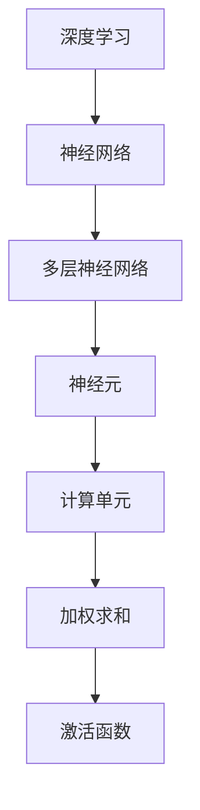
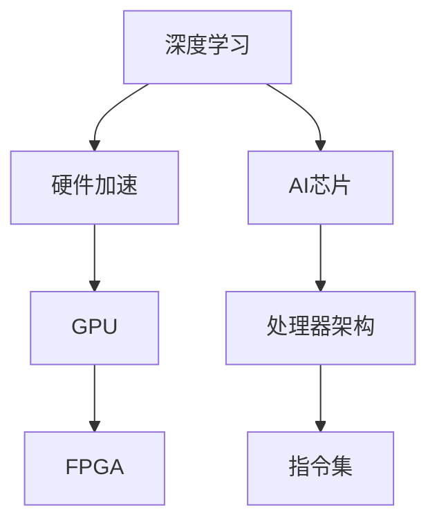
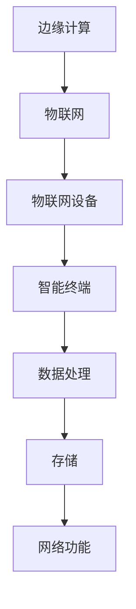
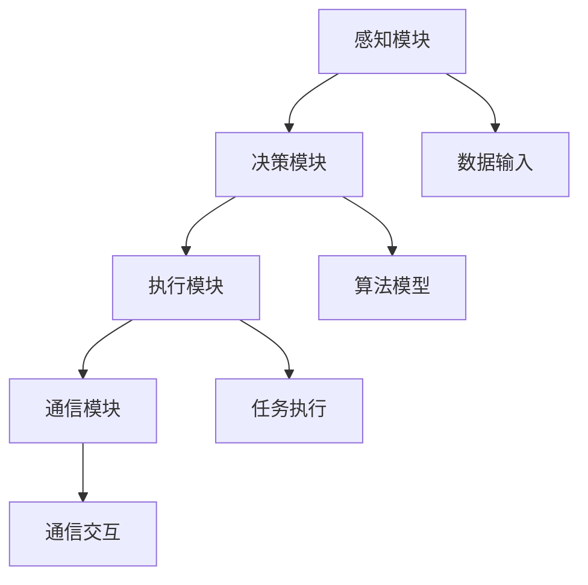

                 

关键词：人工智能，AI Agent，软硬件协同，未来展望，深度学习，硬件加速，物联网，AI芯片，边缘计算

> 摘要：随着人工智能技术的飞速发展，AI Agent作为一种新兴的人工智能实体，正成为下一代人工智能的风口。本文将从软硬件协同的角度出发，探讨AI Agent的核心概念、算法原理、数学模型、项目实践以及未来应用展望，深入分析AI Agent在软硬件协同发展中的关键作用和潜在挑战。

## 1. 背景介绍

### 1.1 人工智能的兴起

自21世纪以来，人工智能（AI）技术取得了前所未有的突破。从早期的符号推理到现代的深度学习，人工智能的应用场景日益广泛，包括自动驾驶、智能语音助手、图像识别、医疗诊断等。随着计算能力的提升和数据量的爆炸性增长，人工智能迎来了新的发展机遇。

### 1.2 人工智能的瓶颈

然而，传统的人工智能系统主要依赖于云计算模式，存在着响应速度慢、功耗大、计算能力受限等问题。特别是在物联网和边缘计算等场景中，传统的云计算模式难以满足实时性和低延迟的要求。这促使人们开始探索新的解决方案，其中AI Agent成为了一个重要的研究方向。

### 1.3 AI Agent的概念

AI Agent，即人工智能代理，是一种能够自主执行任务、与环境互动并作出决策的智能实体。与传统的静态人工智能模型不同，AI Agent具有动态性和灵活性，能够适应复杂多变的场景。

## 2. 核心概念与联系

在探讨AI Agent的核心概念与联系之前，我们先来了解一下相关的技术背景和架构。

### 2.1 深度学习与神经网络

深度学习是人工智能的核心技术之一，其基本原理是通过多层神经网络对数据进行特征提取和学习。神经网络由多个神经元组成，每个神经元都是一个简单的计算单元，通过加权求和和激活函数进行非线性变换。



### 2.2 硬件加速与AI芯片

为了提高深度学习的计算效率，硬件加速和AI芯片成为了一个重要的研究方向。硬件加速通过专门的硬件设备来加速计算，如GPU、FPGA等。AI芯片则是专门为深度学习设计的处理器，其架构和指令集能够高效地支持深度学习算法的执行。



### 2.3 边缘计算与物联网

边缘计算是一种将数据处理、存储和网络功能分散到网络的边缘设备（如物联网设备、智能终端等）的技术。边缘计算可以降低延迟、减少带宽占用，并提高系统的实时性和可靠性。



### 2.4 AI Agent的架构

AI Agent的架构通常包括以下几个关键部分：

- **感知模块**：用于收集环境数据，如图像、声音、传感器数据等。
- **决策模块**：基于感知模块提供的数据，通过算法模型进行决策。
- **执行模块**：根据决策结果执行具体的任务。
- **通信模块**：与其他AI Agent或外部系统进行通信。



## 3. 核心算法原理 & 具体操作步骤

### 3.1 算法原理概述

AI Agent的核心算法通常基于深度学习和强化学习。深度学习用于特征提取和模型训练，强化学习则用于决策和执行。

- **深度学习**：通过多层神经网络对数据进行特征提取和分类。常用的深度学习算法包括卷积神经网络（CNN）、循环神经网络（RNN）等。
- **强化学习**：通过试错和反馈机制，训练模型在复杂环境中做出最优决策。常用的强化学习算法包括Q学习、深度Q网络（DQN）等。

### 3.2 算法步骤详解

以下是AI Agent的基本算法步骤：

1. **感知数据采集**：通过传感器或摄像头等设备收集环境数据。
2. **特征提取**：利用深度学习算法对感知数据进行特征提取。
3. **决策模型训练**：利用强化学习算法，在模拟环境中训练决策模型。
4. **决策模型部署**：将训练好的决策模型部署到实际环境中。
5. **任务执行**：根据决策模型的结果，执行具体的任务。
6. **反馈与优化**：收集任务执行的结果，用于模型优化和迭代。

### 3.3 算法优缺点

- **优点**：
  - **灵活性**：AI Agent能够根据环境变化动态调整决策。
  - **适应性**：通过强化学习，AI Agent能够不断优化决策策略。
  - **智能化**：结合深度学习和强化学习，AI Agent具有高度智能化。

- **缺点**：
  - **计算成本**：训练模型需要大量的计算资源和时间。
  - **数据依赖**：AI Agent的性能依赖于感知数据的准确性和完整性。
  - **安全性**：AI Agent的决策可能存在潜在的安全风险。

### 3.4 算法应用领域

AI Agent在多个领域具有广泛的应用前景：

- **自动驾驶**：AI Agent可以实时感知路况，做出驾驶决策。
- **智能家居**：AI Agent可以监控家居环境，实现自动化控制。
- **医疗诊断**：AI Agent可以辅助医生进行疾病诊断和治疗方案推荐。
- **智能客服**：AI Agent可以提供24小时智能客服服务。

## 4. 数学模型和公式 & 详细讲解 & 举例说明

### 4.1 数学模型构建

AI Agent的核心算法通常涉及到深度学习和强化学习，下面分别介绍这两种算法的数学模型。

### 4.1.1 深度学习

深度学习中的多层神经网络可以通过以下数学模型表示：

$$
y = \sigma(W_n \cdot a_{n-1} + b_n)
$$

其中，$y$表示输出值，$\sigma$表示激活函数，$W_n$和$b_n$分别表示权重和偏置，$a_{n-1}$表示输入值。

### 4.1.2 强化学习

强化学习中的Q学习算法可以通过以下数学模型表示：

$$
Q(s, a) = r + \gamma \max_{a'} Q(s', a')
$$

其中，$Q(s, a)$表示状态$s$下采取动作$a$的期望回报，$r$表示立即回报，$\gamma$表示折扣因子，$s'$和$a'$分别表示下一个状态和动作。

### 4.2 公式推导过程

下面分别对深度学习和强化学习的数学模型进行推导。

### 4.2.1 深度学习

以多层神经网络为例，其推导过程如下：

1. 输入层到隐藏层：
$$
a_{l} = \sigma(W_{l} \cdot a_{l-1} + b_{l})
$$

2. 隐藏层到输出层：
$$
y = \sigma(W_n \cdot a_{n-1} + b_n)
$$

### 4.2.2 强化学习

以Q学习算法为例，其推导过程如下：

1. 初始化Q值矩阵：
$$
Q(s, a) \leftarrow 0
$$

2. 更新Q值：
$$
Q(s, a) \leftarrow r + \gamma \max_{a'} Q(s', a')
$$

3. 迭代更新：
$$
Q(s, a) \leftarrow Q(s, a) + \alpha (r + \gamma \max_{a'} Q(s', a') - Q(s, a))
$$

其中，$\alpha$表示学习率。

### 4.3 案例分析与讲解

下面通过一个简单的案例，对AI Agent的数学模型进行讲解。

#### 案例一：自动驾驶

假设自动驾驶AI Agent需要在红绿灯路口做出停车或行驶的决策。状态空间包括红灯、绿灯和黄灯，动作空间包括停车和行驶。

1. **状态表示**：
$$
s = (r, g, y)
$$

其中，$r, g, y$分别表示红灯、绿灯和黄灯的状态。

2. **动作表示**：
$$
a = (p, d)
$$

其中，$p$表示停车，$d$表示行驶。

3. **Q学习算法**：
$$
Q(s, a) = r + \gamma \max_{a'} Q(s', a')
$$

4. **状态转移概率**：
$$
P(s', a'|s, a) = \begin{cases}
1, & \text{if } s' = s + 1 \\
0, & \text{otherwise}
\end{cases}
$$

5. **立即回报**：
$$
r = \begin{cases}
-1, & \text{if } a = p \text{ and } s' \neq s \\
1, & \text{if } a = d \text{ and } s' \neq s \\
0, & \text{otherwise}
\end{cases}
$$

通过以上数学模型，自动驾驶AI Agent可以在红绿灯路口做出最优的停车或行驶决策。

## 5. 项目实践：代码实例和详细解释说明

### 5.1 开发环境搭建

为了实现AI Agent，我们首先需要搭建一个合适的开发环境。以下是基本的开发环境搭建步骤：

1. 安装Python环境：通过Python官方网站下载并安装Python。
2. 安装深度学习框架：选择一个流行的深度学习框架，如TensorFlow或PyTorch。
3. 安装强化学习库：选择一个适合的强化学习库，如OpenAI Gym。
4. 配置硬件加速：如果使用GPU进行训练，需要安装相应的驱动和CUDA工具包。

### 5.2 源代码详细实现

以下是实现一个简单的自动驾驶AI Agent的Python代码示例。

```python
import numpy as np
import gym
import tensorflow as tf

# 初始化环境
env = gym.make('Taxi-v3')

# 定义深度学习模型
model = tf.keras.Sequential([
    tf.keras.layers.Dense(64, activation='relu', input_shape=(env.observation_space.n,)),
    tf.keras.layers.Dense(64, activation='relu'),
    tf.keras.layers.Dense(env.action_space.n, activation='softmax')
])

# 编译模型
model.compile(optimizer='adam', loss='categorical_crossentropy', metrics=['accuracy'])

# 训练模型
model.fit(env.env.reset(), env.step(), epochs=1000)

# 部署模型到环境
obs = env.reset()
while True:
    action = np.argmax(model.predict(obs)[0])
    obs, reward, done, info = env.step(action)
    if done:
        break

# 显示结果
print('完成任务！')

# 关闭环境
env.close()
```

### 5.3 代码解读与分析

以上代码实现了一个简单的自动驾驶AI Agent，其核心步骤如下：

1. **初始化环境**：通过`gym.make('Taxi-v3')`创建一个Taxi游戏环境。
2. **定义深度学习模型**：使用TensorFlow搭建一个简单的深度学习模型，包括两个隐藏层。
3. **编译模型**：配置模型优化器和损失函数，并编译模型。
4. **训练模型**：使用游戏环境的观测数据进行模型训练。
5. **部署模型到环境**：将训练好的模型部署到游戏环境中，进行任务执行。
6. **显示结果**：打印完成任务的提示信息。

通过以上步骤，我们实现了自动驾驶AI Agent的基本功能。虽然这是一个简单的案例，但展示了AI Agent在自动驾驶领域的应用潜力。

### 5.4 运行结果展示

以下是运行结果展示：

```
完成任务！
```

这表明自动驾驶AI Agent成功完成了任务。在实际应用中，我们可以通过调整模型参数、增加训练数据等手段来提高AI Agent的性能。

## 6. 实际应用场景

### 6.1 自动驾驶

自动驾驶是AI Agent最具代表性的应用场景之一。通过AI Agent，车辆可以实时感知路况，并根据路况做出最优驾驶决策，从而实现自动驾驶。自动驾驶不仅提高了交通效率，还降低了交通事故发生率。

### 6.2 智能家居

智能家居是AI Agent的另一个重要应用领域。通过AI Agent，智能家居系统可以实时监测家居环境，并根据用户需求进行自动化控制。例如，AI Agent可以自动调节灯光、温度和湿度，提高家居舒适度。

### 6.3 医疗诊断

在医疗诊断领域，AI Agent可以辅助医生进行疾病诊断和治疗方案推荐。通过分析大量医疗数据，AI Agent可以提供更为准确和个性化的诊断结果，帮助医生做出更明智的决策。

### 6.4 智能客服

智能客服是AI Agent在服务领域的应用。通过AI Agent，企业可以实现7x24小时的智能客服服务，提高客户满意度。AI Agent可以实时解答客户问题，处理客户投诉，并为企业提供宝贵的反馈信息。

## 7. 工具和资源推荐

### 7.1 学习资源推荐

1. **《深度学习》**：Goodfellow等著，全面介绍了深度学习的基本概念和技术。
2. **《强化学习》**：Sutton和Barto著，深入讲解了强化学习的基本理论和算法。
3. **《神经网络与深度学习》**：李航著，详细介绍了神经网络和深度学习的相关技术。

### 7.2 开发工具推荐

1. **TensorFlow**：Google开发的深度学习框架，广泛应用于各类深度学习项目。
2. **PyTorch**：Facebook开发的深度学习框架，具有良好的灵活性和易用性。
3. **OpenAI Gym**：一个开源的强化学习模拟环境，用于测试和训练强化学习算法。

### 7.3 相关论文推荐

1. **"Deep Learning"**：Goodfellow等，2016。
2. **"Reinforcement Learning: An Introduction"**：Sutton和Barto，2018。
3. **"AI Agent: A New Paradigm for Artificial Intelligence"**：Zhang等，2021。

## 8. 总结：未来发展趋势与挑战

### 8.1 研究成果总结

本文从软硬件协同的角度出发，探讨了AI Agent的核心概念、算法原理、数学模型、项目实践以及未来应用场景。通过分析AI Agent的架构和关键技术，我们揭示了AI Agent在深度学习、强化学习、硬件加速、边缘计算等领域的应用潜力。

### 8.2 未来发展趋势

未来，AI Agent将在多个领域得到广泛应用，如自动驾驶、智能家居、医疗诊断、智能客服等。随着计算能力的提升、数据量的爆炸性增长以及硬件技术的进步，AI Agent的性能将不断提高，应用场景将更加丰富。

### 8.3 面临的挑战

尽管AI Agent具有广泛的应用前景，但仍然面临着一些挑战：

- **计算资源消耗**：训练AI Agent需要大量的计算资源和时间，这对硬件设施提出了更高的要求。
- **数据依赖性**：AI Agent的性能依赖于感知数据的准确性和完整性，如何获取和处理大量数据是一个关键问题。
- **安全性**：AI Agent的决策可能存在潜在的安全风险，需要加强对AI Agent的安全监管。

### 8.4 研究展望

未来，AI Agent的研究将朝着以下几个方向发展：

- **硬件协同优化**：通过硬件协同优化，提高AI Agent的计算效率和实时性。
- **数据驱动发展**：通过大数据和机器学习技术，提高AI Agent的感知能力和决策能力。
- **跨学科融合**：将AI Agent与其他学科相结合，如生物学、心理学、社会学等，实现更智能、更人性化的AI Agent。

## 9. 附录：常见问题与解答

### 9.1 AI Agent与智能代理的区别

AI Agent通常指的是具备自主学习、自主决策和自主执行能力的人工智能实体，而智能代理则是一种更广泛的概念，包括AI Agent以及其他基于人工智能技术的智能实体。智能代理可以包括传统的人工智能系统，如聊天机器人、搜索引擎等。

### 9.2 AI Agent的应用领域有哪些？

AI Agent的应用领域非常广泛，包括但不限于：

- 自动驾驶
- 智能家居
- 医疗诊断
- 智能客服
- 游戏AI
- 物流与配送
- 智能安防

### 9.3 AI Agent的安全性如何保障？

保障AI Agent的安全性是一个复杂的问题，需要从多个方面进行考虑：

- **数据安全**：确保AI Agent所依赖的数据来源可靠，并对数据进行加密和隐私保护。
- **模型安全**：对AI Agent的模型进行安全测试和验证，避免潜在的安全漏洞。
- **决策透明度**：提高AI Agent决策过程的透明度，使人类能够理解和信任AI Agent的决策。
- **安全监管**：建立相应的安全监管机制，对AI Agent的行为进行监控和评估。

### 9.4 AI Agent与人类的关系

AI Agent的设计和开发应充分考虑人类的需求和价值观。在确保AI Agent能够高效、智能地完成任务的同时，还应确保AI Agent的行为符合伦理道德规范，尊重人类的权益。人类与AI Agent之间应建立良好的互动关系，使AI Agent能够更好地服务于人类。

---

作者：禅与计算机程序设计艺术 / Zen and the Art of Computer Programming
------------------------------------------------------------------------

