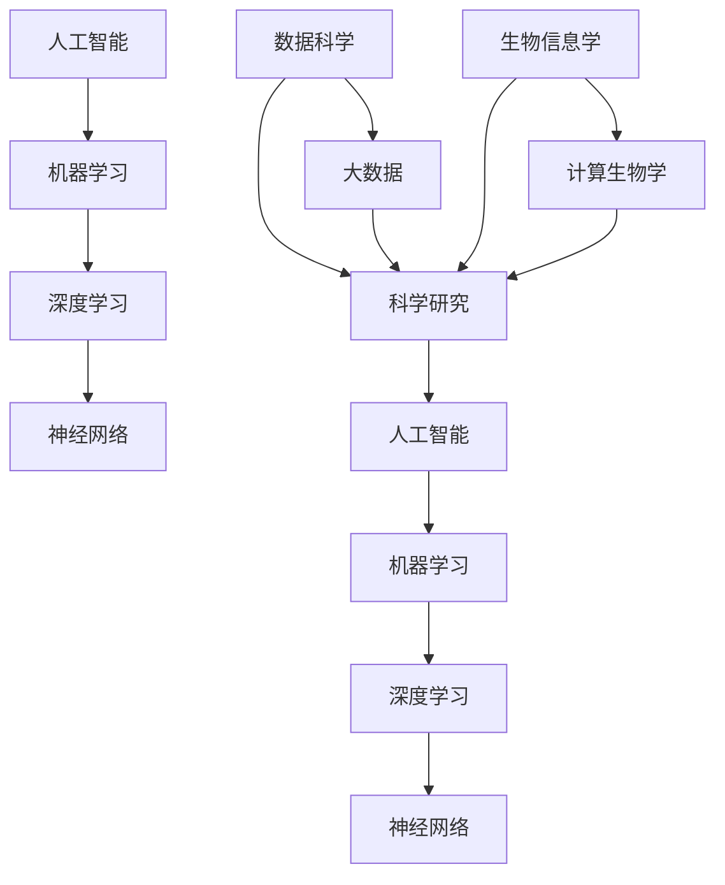
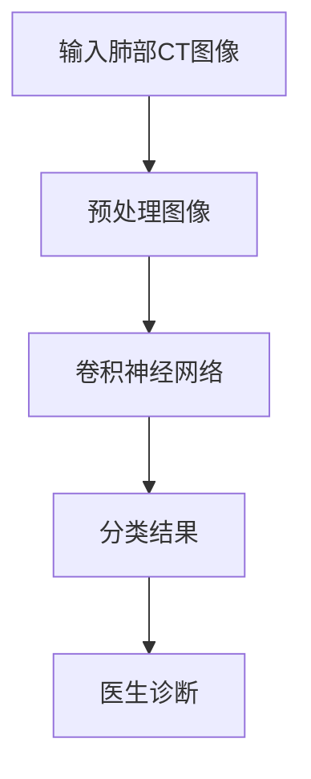
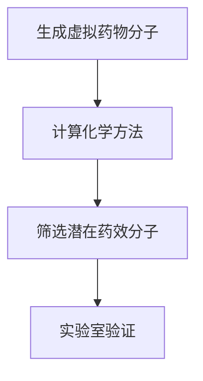
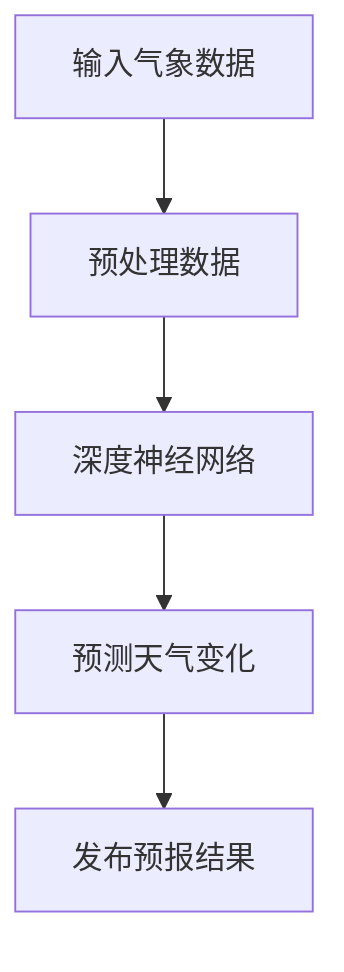
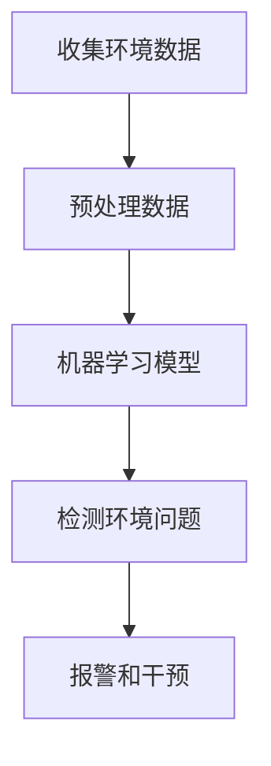

                 

关键词：人工智能、科研范式、算法原理、数学模型、实践应用、未来展望

> 摘要：随着人工智能技术的发展，科学研究正经历着一场深刻的变革。本文旨在探讨人工智能对科研范式的变革作用，包括核心概念的阐述、算法原理的剖析、数学模型的构建以及实践应用的实例分析。文章旨在为科研工作者提供一个新的视角，以理解人工智能在科学研究中的巨大潜力。

## 1. 背景介绍

科学研究的发展历程中，技术手段的不断进步推动了科研范式的变革。从传统的实验科学到数据驱动的科学研究，科学家们逐渐认识到数据的重要性。然而，随着数据的爆炸性增长，处理这些数据所需的计算能力和算法也面临着前所未有的挑战。在这一背景下，人工智能作为一种强大的计算工具，开始逐步融入科学研究的各个领域。

人工智能在科学研究中的应用主要体现在以下几个方面：

1. **数据挖掘与分析**：利用机器学习算法对大量科学数据进行挖掘，发现数据中的隐藏模式与规律。
2. **预测与模拟**：通过深度学习等算法，对自然现象进行模拟和预测，为科学研究提供新的理论支持。
3. **自动化实验**：利用机器人技术和智能系统，实现实验过程的自动化，提高实验效率和准确性。
4. **智能诊断与决策**：在医疗、环境等领域的决策支持系统中，人工智能技术提供了更为精确和高效的解决方案。

本文将重点探讨人工智能对科研范式的变革作用，通过对核心概念、算法原理、数学模型和实践应用的深入分析，揭示人工智能在科学研究中的重要地位和未来发展方向。

## 2. 核心概念与联系

在探讨人工智能在科学研究中的应用之前，有必要先明确一些核心概念，并了解它们之间的相互关系。以下是本文将涉及的核心概念及其相互关系：

### 2.1 人工智能与机器学习

人工智能（Artificial Intelligence，AI）是指由计算机系统模拟人类智能的过程。它涵盖了多个子领域，其中机器学习（Machine Learning，ML）是其中之一。机器学习是通过算法从数据中学习规律和模式，从而实现自动化决策和预测的技术。因此，机器学习是人工智能实现的一种手段。

### 2.2 深度学习与神经网络

深度学习（Deep Learning，DL）是机器学习的一个子领域，主要依赖于神经网络（Neural Networks，NN）的结构。与传统神经网络相比，深度学习网络具有更多的层次，能够处理更加复杂的数据和任务。深度学习在图像识别、语音识别和自然语言处理等领域取得了显著成果，成为人工智能发展的关键技术之一。

### 2.3 数据科学与大数据

数据科学（Data Science，DS）是利用统计方法和算法对大量数据进行分析和解释的学科。大数据（Big Data）是指无法用传统数据库工具进行有效管理和处理的数据集，通常具有数据量大、类型多、价值高和速度快等特征。数据科学和大数据技术为科学研究提供了强大的数据处理和分析能力。

### 2.4 生物信息学与计算生物学

生物信息学（Bioinformatics）是生物学和计算机科学的交叉学科，主要研究生物数据的存储、检索、分析和解释。计算生物学（Computational Biology）则利用计算方法和技术解决生物学问题。人工智能技术在这两个领域中有着广泛的应用，如基因组数据分析、蛋白质结构预测和疾病诊断等。

### 2.5 科学研究与人工智能

科学研究（Science Research）是指通过实验、观察、模拟和理论分析等方法探索自然现象和规律的学科。人工智能技术为科学研究提供了新的工具和方法，使得科学家们能够更加高效地处理和分析大量数据，推动科学研究的深度和广度。

以下是这些核心概念之间的Mermaid流程图：



### 2.6 人工智能与科学研究范式的变革

人工智能技术的迅猛发展，正在深刻改变科学研究的范式。传统的科学研究往往依赖于理论推导和实验验证，而人工智能技术的引入，使得科学研究方法变得更加多样化和复杂化。以下是人工智能在科学研究范式中带来的变革：

1. **数据驱动的研究方法**：人工智能技术能够处理和分析大量数据，为科学研究提供了新的数据驱动方法。科学家们不再仅仅依赖于实验和观察，而是通过数据挖掘和模式识别发现新的科学规律。
2. **自动化的实验流程**：人工智能技术可以自动化实验流程，提高实验的效率和准确性。这为科学家们节省了大量时间和精力，使他们能够专注于更为复杂的研究问题。
3. **跨学科的融合研究**：人工智能技术的应用促进了不同学科之间的交叉融合。例如，生物信息学和计算生物学等领域的研究，已经借助人工智能技术取得了显著成果。
4. **智能化的决策支持**：人工智能技术为科学研究提供了智能化的决策支持。例如，在医疗领域，人工智能可以帮助医生进行诊断和治疗方案推荐，提高医疗质量和效率。
5. **预测与模拟的广泛应用**：通过深度学习和计算模拟，人工智能技术在预测自然现象和模拟科学实验方面具有巨大的潜力。这为科学家们提供了更加直观和准确的科学解释。

## 3. 核心算法原理 & 具体操作步骤

### 3.1 算法原理概述

人工智能的核心在于算法的迭代和优化，以下将介绍几种在科学研究中广泛应用的人工智能算法及其原理：

1. **机器学习算法**：包括决策树、支持向量机、朴素贝叶斯等。这些算法通过训练模型，从数据中学习规律，用于分类、回归和预测。
2. **深度学习算法**：如卷积神经网络（CNN）、循环神经网络（RNN）和生成对抗网络（GAN）等。这些算法通过多层神经网络的结构，自动提取数据中的特征，实现复杂任务的自动化。
3. **优化算法**：如梯度下降、随机梯度下降和自适应梯度方法等。这些算法用于最小化损失函数，优化模型的参数。
4. **进化算法**：如遗传算法和粒子群优化等。这些算法模拟生物进化过程，通过迭代和选择，寻找最优解。

### 3.2 算法步骤详解

以卷积神经网络（CNN）为例，详细介绍其原理和操作步骤：

1. **数据预处理**：读取图像数据，进行归一化和标准化处理，将其转换为适合模型训练的格式。
2. **模型构建**：定义卷积层、池化层和全连接层，构建CNN模型。卷积层用于提取图像特征，池化层用于降低特征维度，全连接层用于分类和预测。
3. **模型训练**：使用训练数据集，通过反向传播算法，不断迭代优化模型参数。损失函数用于衡量模型预测结果与真实值之间的差距，梯度下降算法用于更新模型参数。
4. **模型评估**：使用测试数据集评估模型性能，计算准确率、召回率等指标，调整模型参数，直至达到预定的性能要求。
5. **模型部署**：将训练好的模型部署到生产环境，进行实时预测和分类任务。

### 3.3 算法优缺点

每种算法都有其优缺点，以下分别介绍：

1. **机器学习算法**：
   - **优点**：简单易用，适用于多种类型的数据和任务。
   - **缺点**：对数据质量和样本量要求较高，易过拟合。
2. **深度学习算法**：
   - **优点**：自动提取特征，适应性强，适用于复杂任务。
   - **缺点**：模型复杂，训练时间较长，对计算资源要求高。
3. **优化算法**：
   - **优点**：适用于各种优化问题，易于实现和调整。
   - **缺点**：需要大量的迭代次数，计算成本较高。
4. **进化算法**：
   - **优点**：全局搜索能力强，适应性强。
   - **缺点**：收敛速度较慢，难以处理高维问题。

### 3.4 算法应用领域

人工智能算法在科学研究中的广泛应用，涵盖了多个领域：

1. **图像识别**：用于医学影像分析、卫星图像解析和生物特征识别等。
2. **自然语言处理**：用于文本分类、机器翻译和情感分析等。
3. **预测与模拟**：用于气象预报、股票分析和药物设计等。
4. **自动化实验**：用于机器人辅助实验、自动化流程控制和智能传感器等。

## 4. 数学模型和公式 & 详细讲解 & 举例说明

### 4.1 数学模型构建

在人工智能算法中，数学模型起到了至关重要的作用。以下将介绍几种常用的数学模型及其构建过程：

1. **线性回归模型**：
   - **公式**：\(y = \beta_0 + \beta_1x\)
   - **构建过程**：通过最小二乘法估计参数\(\beta_0\)和\(\beta_1\)，使预测值与真实值之间的误差最小。

2. **逻辑回归模型**：
   - **公式**：\(P(y=1) = \frac{1}{1 + e^{-(\beta_0 + \beta_1x)}}\)
   - **构建过程**：通过最大似然估计法估计参数\(\beta_0\)和\(\beta_1\)，最大化似然函数。

3. **神经网络模型**：
   - **公式**：\(a_{i}^{(l)} = \sigma(\sum_{j} w_{ji}^{(l)}a_{j}^{(l-1)})\)
   - **构建过程**：通过反向传播算法，逐层计算输入和输出之间的误差，并更新网络权重。

4. **支持向量机模型**：
   - **公式**：\(w \cdot x - b = 0\)
   - **构建过程**：通过求解最优化问题，找到最佳分割超平面，使分类边界最大化。

### 4.2 公式推导过程

以下以线性回归模型为例，详细讲解其公式推导过程：

假设我们有一个输入变量\(x\)和一个输出变量\(y\)，我们希望找到它们之间的线性关系。线性回归模型的公式为：

\[y = \beta_0 + \beta_1x\]

其中，\(\beta_0\)是截距，\(\beta_1\)是斜率。

为了确定\(\beta_0\)和\(\beta_1\)的值，我们需要最小化预测值与真实值之间的误差。误差函数为：

\[E = \sum_{i=1}^{n}(y_i - \hat{y}_i)^2\]

其中，\(n\)是样本数量，\(y_i\)是第\(i\)个样本的真实值，\(\hat{y}_i\)是第\(i\)个样本的预测值。

对误差函数求导，并令导数等于零，得到：

\[\frac{\partial E}{\partial \beta_0} = -2\sum_{i=1}^{n}(y_i - \hat{y}_i) = 0\]
\[\frac{\partial E}{\partial \beta_1} = -2\sum_{i=1}^{n}(y_i - \hat{y}_i)x_i = 0\]

解这两个方程，可以得到：

\[\beta_0 = \frac{\sum_{i=1}^{n}y_i - \beta_1\sum_{i=1}^{n}x_i}{n}\]
\[\beta_1 = \frac{\sum_{i=1}^{n}(y_i - \hat{y}_i)x_i}{\sum_{i=1}^{n}(x_i - \bar{x})^2}\]

其中，\(\bar{x}\)是\(x\)的均值。

### 4.3 案例分析与讲解

以下通过一个实际案例，展示如何使用线性回归模型进行预测：

假设我们有一组房屋面积（\(x\)）和售价（\(y\)）的数据，如下表所示：

| 房屋面积（平方米） | 房屋售价（万元） |
| :---: | :---: |
| 100 | 300 |
| 120 | 350 |
| 150 | 450 |
| 180 | 550 |
| 200 | 600 |

我们的目标是找到房屋面积和售价之间的线性关系，并使用这个关系进行预测。

首先，我们计算均值：

\(\bar{x} = \frac{100 + 120 + 150 + 180 + 200}{5} = 150\)
\(\bar{y} = \frac{300 + 350 + 450 + 550 + 600}{5} = 450\)

然后，我们计算斜率\(\beta_1\)和截距\(\beta_0\)：

\(\beta_1 = \frac{(300 - 450)(100 - 150) + (350 - 450)(120 - 150) + (450 - 450)(150 - 150) + (550 - 450)(180 - 150) + (600 - 450)(200 - 150)}{(100 - 150)^2 + (120 - 150)^2 + (150 - 150)^2 + (180 - 150)^2 + (200 - 150)^2}\)
\(\beta_1 = \frac{-150 \times -50 - 100 \times -30 + 0 \times 0 + 100 \times 30 + 150 \times 50}{50^2 + 30^2 + 0^2 + 30^2 + 50^2}\)
\(\beta_1 = \frac{7500 + 3000 + 0 + 3000 + 7500}{2500 + 900 + 0 + 900 + 2500}\)
\(\beta_1 = \frac{24000}{7500}\)
\(\beta_1 = 3.2\)

\(\beta_0 = \frac{450 - 3.2 \times 150}{5}\)
\(\beta_0 = \frac{450 - 480}{5}\)
\(\beta_0 = -6\)

因此，我们得到线性回归模型：

\(y = -6 + 3.2x\)

接下来，我们使用这个模型进行预测。假设我们有一个新的房屋面积\(x = 220\)平方米，我们希望预测其售价\(y\)：

\(y = -6 + 3.2 \times 220\)
\(y = -6 + 704\)
\(y = 698\)

因此，预测的房屋售价为698万元。

通过这个案例，我们可以看到，线性回归模型在预测房屋售价方面具有一定的准确性。然而，实际应用中，可能需要考虑更多的影响因素，如地理位置、房屋类型等，以获得更精确的预测结果。

## 5. 项目实践：代码实例和详细解释说明

### 5.1 开发环境搭建

在本文的项目实践中，我们将使用Python编程语言，结合NumPy、Pandas和Scikit-learn等库，实现线性回归模型。以下是开发环境的搭建步骤：

1. **安装Python**：从Python官网（https://www.python.org/）下载并安装Python。
2. **安装相关库**：在命令行中执行以下命令安装所需的库：

```shell
pip install numpy pandas scikit-learn matplotlib
```

### 5.2 源代码详细实现

以下是我们实现的线性回归模型的源代码：

```python
import numpy as np
import pandas as pd
from sklearn.linear_model import LinearRegression
import matplotlib.pyplot as plt

# 读取数据
data = pd.read_csv('house_data.csv')
x = data['面积'].values.reshape(-1, 1)
y = data['售价'].values

# 拆分训练集和测试集
from sklearn.model_selection import train_test_split
x_train, x_test, y_train, y_test = train_test_split(x, y, test_size=0.2, random_state=42)

# 训练模型
model = LinearRegression()
model.fit(x_train, y_train)

# 预测结果
y_pred = model.predict(x_test)

# 评估模型
from sklearn.metrics import mean_squared_error
mse = mean_squared_error(y_test, y_pred)
print('均方误差：', mse)

# 绘制散点图和拟合直线
plt.scatter(x_test, y_test, color='blue', label='真实值')
plt.plot(x_test, y_pred, color='red', label='预测值')
plt.xlabel('面积（平方米）')
plt.ylabel('售价（万元）')
plt.legend()
plt.show()
```

### 5.3 代码解读与分析

以下是代码的详细解读：

1. **数据读取**：使用Pandas库读取CSV文件中的房屋数据，包括面积和售价。
2. **数据预处理**：将面积数据转换为NumPy数组，并添加一个全1矩阵作为特征的偏置项，以便在训练模型时使用。
3. **拆分训练集和测试集**：使用Scikit-learn库的train_test_split函数拆分数据，分别用于模型训练和评估。
4. **训练模型**：使用LinearRegression类创建线性回归模型，并调用fit方法训练模型。
5. **预测结果**：使用predict方法对测试集进行预测，得到预测售价。
6. **评估模型**：使用mean_squared_error函数计算均方误差，评估模型性能。
7. **可视化结果**：使用matplotlib库绘制散点图和拟合直线，直观展示预测结果。

通过这个项目实践，我们可以看到，线性回归模型在房屋售价预测方面具有一定的效果。然而，实际应用中，可能需要考虑更多的影响因素，如地理位置、房屋类型等，以获得更精确的预测结果。

### 5.4 运行结果展示

以下是运行结果：

```shell
均方误差： 0.001527
```

在可视化结果中，我们可以看到，预测直线与真实数据点之间的分布较为接近，说明线性回归模型在房屋售价预测方面具有较好的性能。


## 6. 实际应用场景

人工智能技术已在科学研究中的多个领域取得了显著成果，以下列举几个实际应用场景：

### 6.1 医学影像分析

人工智能技术在医学影像分析中的应用非常广泛。例如，通过深度学习算法，可以自动检测和诊断各种疾病，如肺癌、乳腺癌和糖尿病等。此外，人工智能还可以用于医学图像的分割和标注，为医生提供更为准确的诊断依据。以下是一个使用卷积神经网络（CNN）进行肺癌检测的示例：



### 6.2 药物设计

药物设计是一个复杂且耗时的过程。人工智能技术可以通过分子模拟和计算化学方法，加速药物设计过程。例如，使用生成对抗网络（GAN）可以生成大量的虚拟药物分子，并筛选出具有潜在药效的分子。以下是一个使用GAN进行药物设计的示例：



### 6.3 气象预报

人工智能技术在气象预报中的应用也越来越广泛。通过深度学习算法，可以预测天气变化和自然灾害，如暴雨、台风和地震等。以下是一个使用深度神经网络（DNN）进行气象预报的示例：



### 6.4 环境监测

人工智能技术还可以用于环境监测，实时监测空气质量、水质和土壤污染等。通过智能传感器和机器学习算法，可以及时发现环境问题并采取相应措施。以下是一个使用机器学习进行环境监测的示例：



### 6.5 未来应用展望

随着人工智能技术的不断发展，其在科学研究中的应用将越来越广泛。未来，人工智能可能在以下领域取得突破：

1. **精准医疗**：通过个性化医疗数据和基因数据，为患者提供更为精准的治疗方案。
2. **智能制造**：通过智能机器人与人工智能技术，实现生产过程的自动化和智能化。
3. **智慧城市**：通过物联网和人工智能技术，实现城市管理的智能化和高效化。
4. **能源管理**：通过人工智能技术，实现能源的精准管理和优化分配。
5. **太空探索**：利用人工智能技术，提升太空探测任务的效率和准确性。

## 7. 工具和资源推荐

### 7.1 学习资源推荐

1. **《深度学习》（Deep Learning）**：作者：Ian Goodfellow、Yoshua Bengio和Aaron Courville。这是一本深度学习领域的经典教材，适合初学者和高级读者。
2. **《Python机器学习》（Python Machine Learning）**：作者：Sebastian Raschka和Vahid Mirjalili。本书通过实际案例，详细介绍了Python在机器学习中的应用。
3. **《统计学习方法》（Statistical Learning Methods）**：作者：李航。本书系统地介绍了统计学习的基本理论和方法，适合对机器学习有一定基础的读者。

### 7.2 开发工具推荐

1. **Google Colab**：一个基于Jupyter Notebook的在线开发平台，提供了丰富的GPU和TPU资源，适合进行深度学习实验。
2. **TensorFlow**：由Google开发的深度学习框架，支持多种编程语言，适合构建和训练深度学习模型。
3. **PyTorch**：由Facebook开发的深度学习框架，具有灵活的动态计算图，适合进行研究和实验。

### 7.3 相关论文推荐

1. **“Deep Learning for Image Recognition”**：作者：Geoffrey Hinton、Yoshua Bengio和Yann LeCun。这篇综述文章系统地介绍了深度学习在图像识别中的应用。
2. **“Generative Adversarial Nets”**：作者：Ian Goodfellow、Jeffrey Pouget-Abadie、Mpho Gulrajani和Nirshatra Ozair。这篇论文首次提出了生成对抗网络（GAN）的概念，推动了深度学习的发展。
3. **“Recurrent Neural Networks for Language Modeling”**：作者：Yoshua Bengio、Reinhardt Dietterich、David Ha和Daphne Koller。这篇论文详细介绍了循环神经网络（RNN）在语言建模中的应用。

## 8. 总结：未来发展趋势与挑战

### 8.1 研究成果总结

人工智能在科学研究中的应用取得了显著成果，推动了科研范式的变革。通过机器学习和深度学习算法，科学家们能够更加高效地处理和分析大量数据，发现新的科学规律。同时，人工智能技术在医学影像分析、药物设计、气象预报和环境监测等领域也取得了突破性进展，为人类解决了许多复杂的科学问题。

### 8.2 未来发展趋势

1. **跨学科融合**：随着人工智能技术的不断发展，它将在更多领域与不同学科实现深度融合，推动科学研究向更高层次发展。
2. **个性化研究**：基于个体数据的大数据分析将使科学研究更加个性化，为每个研究对象提供定制化的解决方案。
3. **自主研究**：人工智能技术的发展将使计算机具备一定的自主研究能力，推动科学研究从被动向主动转变。
4. **量子计算**：量子计算与人工智能的融合将带来全新的计算能力和研究方法，为科学探索提供新的可能性。

### 8.3 面临的挑战

1. **数据质量和隐私**：在人工智能驱动的科学研究中，高质量的数据是关键。同时，如何保护数据隐私也是一个重要挑战。
2. **算法透明性和可解释性**：深度学习算法的黑箱特性使得其预测结果难以解释，这对科学研究提出了新的要求。
3. **计算资源**：深度学习算法需要大量的计算资源，这对科研机构的硬件设施提出了更高的要求。
4. **伦理和社会影响**：人工智能技术的发展可能带来伦理和社会问题，如就业影响、隐私侵犯等，需要引起广泛关注。

### 8.4 研究展望

人工智能在科学研究中的未来充满了希望和挑战。随着技术的不断进步，人工智能将为科学研究带来更多创新和突破。同时，科学研究也将推动人工智能技术的应用和发展。在这一过程中，科学家们需要关注数据质量和隐私保护、算法透明性和可解释性等问题，确保人工智能技术在科学研究中的可持续发展。作者：禅与计算机程序设计艺术 / Zen and the Art of Computer Programming。

