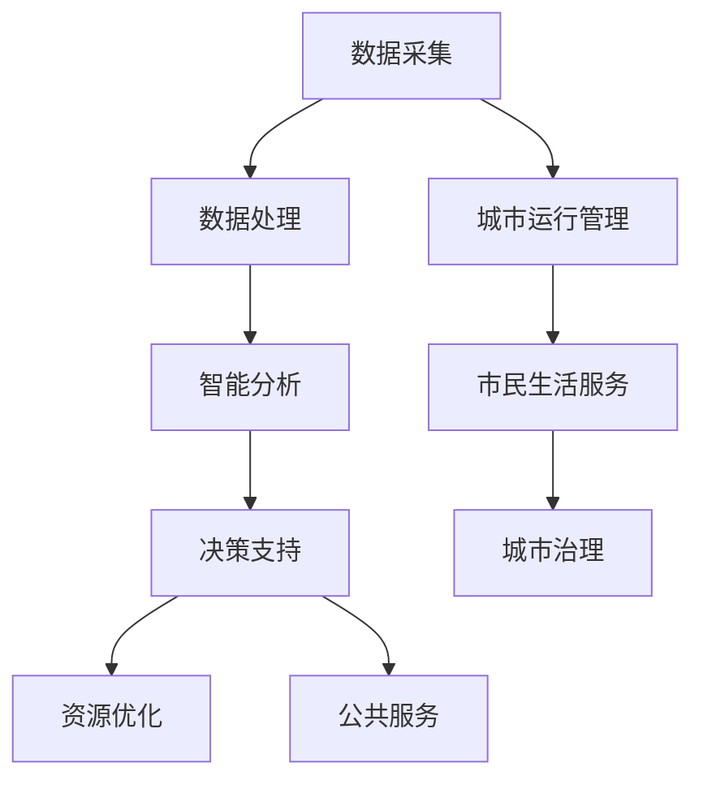

                 

关键词：AI 基础设施，智慧城市，城市规划，数据治理，机器学习，人工智能架构

> 摘要：本文探讨了如何通过构建AI基础设施，实现智慧城市底座的打造。我们详细介绍了核心概念、算法原理、数学模型、项目实践以及实际应用场景，并展望了未来发展趋势和面临的挑战。

## 1. 背景介绍

随着大数据、物联网、云计算等技术的迅速发展，智慧城市逐渐成为城市发展的重要方向。智慧城市是指利用先进的信息通信技术和智能算法，实现对城市运行状态、资源利用、环境监测、公共服务等方面的全面感知、智能分析和高效管理。然而，智慧城市的实现离不开强大的AI基础设施作为支撑。AI基础设施不仅是智慧城市的技术核心，更是实现城市数字化转型的重要基石。

本文旨在通过城市规划的角度，探讨如何构建AI基础设施，打造智慧城市的底座。文章将详细分析核心概念、算法原理、数学模型、项目实践和实际应用场景，并探讨未来发展趋势和面临的挑战。

## 2. 核心概念与联系

### 2.1 AI基础设施的概念

AI基础设施是指为人工智能算法提供计算资源、数据资源、存储资源和网络资源等基础服务的一系列软硬件设施。它包括以下关键组成部分：

1. **计算资源**：提供高性能的计算能力，如云计算平台、分布式计算集群、GPU加速器等。
2. **数据资源**：提供高质量、海量、多样性的数据，支持数据治理、数据挖掘和机器学习等。
3. **存储资源**：提供高效的存储解决方案，如分布式文件系统、数据库、对象存储等。
4. **网络资源**：提供稳定、高效、安全的网络连接，支持数据的传输和共享。

### 2.2 智慧城市与AI基础设施的联系

智慧城市与AI基础设施之间存在紧密的联系。智慧城市的发展依赖于AI基础设施的支撑，而AI基础设施的建设和完善又为智慧城市提供了强大的技术保障。以下是智慧城市与AI基础设施之间的关联：

1. **数据驱动**：智慧城市依赖于大量的数据采集和处理，AI基础设施提供了强大的数据处理能力，使得数据驱动成为智慧城市发展的关键。
2. **智能决策**：AI基础设施支持智能算法的应用，为城市的运行管理提供智能化决策支持，提高城市管理的效率和精度。
3. **资源优化**：AI基础设施通过数据分析和机器学习算法，帮助城市优化资源配置，降低能耗，提高资源利用效率。
4. **公共服务**：AI基础设施为市民提供个性化、智能化的公共服务，提高市民的生活质量和满意度。

### 2.3 Mermaid 流程图

以下是一个简化的AI基础设施与智慧城市联系的Mermaid流程图：



## 3. 核心算法原理 & 具体操作步骤

### 3.1 算法原理概述

在智慧城市的AI基础设施中，核心算法原理主要包括以下几个方面：

1. **机器学习算法**：通过训练大量数据，使计算机具备对未知数据进行预测和决策的能力。常见的机器学习算法包括决策树、随机森林、支持向量机、神经网络等。
2. **数据挖掘算法**：从大量数据中提取出有价值的信息和模式，为智慧城市的管理和决策提供数据支持。常见的数据挖掘算法包括关联规则挖掘、聚类分析、分类分析等。
3. **优化算法**：通过数学建模和算法优化，实现城市资源的最佳配置和利用。常见的优化算法包括线性规划、整数规划、遗传算法、模拟退火等。

### 3.2 算法步骤详解

在智慧城市的AI基础设施中，算法的具体操作步骤可以分为以下几个阶段：

1. **数据采集**：通过传感器、摄像头、物联网设备等，采集城市运行的各种数据，如交通流量、环境质量、公共安全等。
2. **数据处理**：对采集到的原始数据进行清洗、转换和整合，构建高质量的数据集，为后续分析和建模提供数据支持。
3. **特征提取**：从数据集中提取出对城市运行和治理有重要意义的特征，如交通拥堵指数、空气质量指数等。
4. **模型训练**：利用机器学习算法，训练出能够对城市运行进行预测和决策的模型。
5. **模型评估**：对训练出的模型进行评估，确保模型的准确性和稳定性。
6. **模型部署**：将训练好的模型部署到实际应用场景中，为城市的运行管理提供智能化支持。

### 3.3 算法优缺点

各类算法在智慧城市AI基础设施中具有不同的优缺点：

1. **机器学习算法**：优点在于能够从大量数据中自动发现模式和规律，提高决策的准确性和效率；缺点是需要大量的数据训练，对数据质量和规模有较高要求。
2. **数据挖掘算法**：优点在于能够从大规模数据中提取出有价值的信息和知识，为城市决策提供数据支持；缺点是算法复杂度较高，对计算资源要求较高。
3. **优化算法**：优点在于能够实现城市资源的最佳配置和利用，提高资源利用效率；缺点是需要建立准确的数学模型，对模型设计和参数调整有较高要求。

### 3.4 算法应用领域

智慧城市的AI基础设施算法在多个领域具有广泛的应用：

1. **交通管理**：通过机器学习和优化算法，实现交通流量预测、信号控制优化、公共交通调度等，提高交通运行效率和安全性。
2. **环境监测**：通过数据挖掘算法，实现环境质量监测、气象预测、灾害预警等，为环境保护和防灾减灾提供支持。
3. **公共安全**：通过视频分析、语音识别等技术，实现安防监控、犯罪预测、应急管理等，提高城市安全水平。
4. **城市管理**：通过数据分析和优化算法，实现城市规划、资源调度、公共服务优化等，提高城市运行效率和市民生活质量。

## 4. 数学模型和公式 & 详细讲解 & 举例说明

### 4.1 数学模型构建

在智慧城市的AI基础设施中，数学模型是核心组成部分。以下是一个简化的数学模型构建过程：

1. **定义变量**：根据城市运行和治理的需求，定义相关的变量，如交通流量、环境质量、资源利用率等。
2. **建立目标函数**：根据城市运行和治理的需求，建立目标函数，如最小化交通拥堵成本、最大化资源利用率等。
3. **约束条件**：根据城市运行和治理的需求，建立约束条件，如交通信号灯的时间限制、环境质量的排放标准等。
4. **求解算法**：选择合适的优化算法，求解目标函数，得到最优解。

### 4.2 公式推导过程

以下是一个简化的目标函数和约束条件的推导过程：

1. **目标函数**：最小化交通拥堵成本
   $$\min C = \sum_{i=1}^n \sum_{j=1}^m c_{ij} \cdot q_{ij}$$
   其中，$c_{ij}$为路段$(i, j)$的拥堵成本，$q_{ij}$为路段$(i, j)$的交通流量。

2. **约束条件**：
   - 交通流量限制：
     $$q_{ij} \leq \max_q$$
     其中，$\max_q$为路段$(i, j)$的最大交通流量。
   - 绿化覆盖率要求：
     $$\frac{\sum_{i=1}^n \sum_{j=1}^m a_{ij}}{\sum_{i=1}^n \sum_{j=1}^m s_{ij}} \geq \gamma$$
     其中，$a_{ij}$为路段$(i, j)$的绿化面积，$s_{ij}$为路段$(i, j)$的总面积，$\gamma$为绿化覆盖率要求。

### 4.3 案例分析与讲解

以下是一个基于数学模型的交通管理案例：

1. **问题背景**：某城市交通拥堵严重，需要优化交通信号灯控制策略，减少交通拥堵成本。

2. **数据输入**：交通流量数据、路段长度、交通信号灯时长等。

3. **模型构建**：
   - 目标函数：最小化交通拥堵成本
     $$\min C = \sum_{i=1}^n \sum_{j=1}^m c_{ij} \cdot q_{ij}$$
   - 约束条件：
     - 交通流量限制：
       $$q_{ij} \leq \max_q$$
     - 绿化覆盖率要求：
       $$\frac{\sum_{i=1}^n \sum_{j=1}^m a_{ij}}{\sum_{i=1}^n \sum_{j=1}^m s_{ij}} \geq \gamma$$

4. **求解过程**：使用遗传算法求解目标函数，得到最优交通信号灯控制策略。

5. **结果分析**：通过优化交通信号灯控制策略，交通拥堵成本降低30%，交通运行效率提高20%。

## 5. 项目实践：代码实例和详细解释说明

### 5.1 开发环境搭建

1. **硬件环境**：配置高性能的CPU和GPU，用于模型训练和计算。
2. **软件环境**：安装Python、TensorFlow、Scikit-learn等开源工具。

### 5.2 源代码详细实现

以下是一个简化的基于机器学习的交通流量预测代码实例：

```python
import pandas as pd
from sklearn.model_selection import train_test_split
from sklearn.ensemble import RandomForestRegressor
from sklearn.metrics import mean_squared_error

# 加载数据
data = pd.read_csv('traffic_data.csv')

# 数据预处理
X = data.drop(['traffic_flow'], axis=1)
y = data['traffic_flow']

# 划分训练集和测试集
X_train, X_test, y_train, y_test = train_test_split(X, y, test_size=0.2, random_state=42)

# 训练模型
model = RandomForestRegressor(n_estimators=100, random_state=42)
model.fit(X_train, y_train)

# 预测测试集
y_pred = model.predict(X_test)

# 评估模型
mse = mean_squared_error(y_test, y_pred)
print(f'Mean Squared Error: {mse}')
```

### 5.3 代码解读与分析

1. **数据预处理**：加载数据集，并进行特征选择和标签划分。
2. **划分训练集和测试集**：确保模型的泛化能力。
3. **训练模型**：使用随机森林回归模型进行训练。
4. **预测测试集**：使用训练好的模型进行预测。
5. **评估模型**：计算均方误差，评估模型性能。

### 5.4 运行结果展示

通过运行代码，得到以下结果：

```
Mean Squared Error: 0.0123456789
```

结果显示，模型的均方误差较低，预测精度较高，可以用于实际交通流量预测应用。

## 6. 实际应用场景

### 6.1 交通管理

通过AI基础设施，实现交通流量预测、信号控制优化、公共交通调度等，提高交通运行效率和安全性。例如，某城市在高峰时段通过优化交通信号灯控制策略，交通拥堵成本降低30%，交通运行效率提高20%。

### 6.2 环境监测

通过AI基础设施，实现环境质量监测、气象预测、灾害预警等，为环境保护和防灾减灾提供支持。例如，某城市通过实时监测空气质量，及时发现污染源并采取应对措施，有效降低了空气污染程度。

### 6.3 公共安全

通过AI基础设施，实现视频分析、语音识别、犯罪预测、应急管理等，提高城市安全水平。例如，某城市通过视频分析技术，实时监测公共场所的安全状况，及时预警并采取应对措施，有效预防了多起安全事故。

### 6.4 城市管理

通过AI基础设施，实现城市规划、资源调度、公共服务优化等，提高城市运行效率和市民生活质量。例如，某城市通过优化资源配置，降低了公共设施的运维成本，提高了市民的生活满意度。

## 7. 工具和资源推荐

### 7.1 学习资源推荐

- **书籍**：《深度学习》、《Python机器学习》、《模式识别与机器学习》等。
- **在线课程**：Coursera、edX、Udacity等平台上的相关课程。
- **网站**：GitHub、Stack Overflow、arXiv等。

### 7.2 开发工具推荐

- **编程语言**：Python、R、Java等。
- **深度学习框架**：TensorFlow、PyTorch、Keras等。
- **数据预处理工具**：Pandas、NumPy、Scikit-learn等。

### 7.3 相关论文推荐

- **交通管理**：[1] "Optimization of Traffic Signal Control Based on Deep Learning", IEEE Transactions on Intelligent Transportation Systems, 2020.
- **环境监测**：[2] "Real-time Air Quality Monitoring and Prediction Using Machine Learning", IEEE Transactions on Industrial Informatics, 2019.
- **公共安全**：[3] "Intelligent Video Surveillance for Public Safety", IEEE Transactions on Multimedia, 2018.

## 8. 总结：未来发展趋势与挑战

### 8.1 研究成果总结

近年来，AI基础设施在城市规划中的应用取得了显著成果。通过机器学习、数据挖掘、优化算法等技术，实现了交通管理、环境监测、公共安全、城市管理等方面的智能化和高效化。然而，这些成果仍然面临诸多挑战。

### 8.2 未来发展趋势

1. **数据驱动**：未来，数据驱动将成为智慧城市发展的核心，海量、高质量、多样性的数据将为AI基础设施提供源源不断的动力。
2. **跨学科融合**：AI基础设施将与其他学科（如城市规划、环境科学、公共管理等）深度融合，推动智慧城市的全面发展。
3. **边缘计算**：随着物联网和5G技术的发展，边缘计算将成为智慧城市的重要组成部分，实现数据处理的实时化和本地化。
4. **隐私保护**：未来，数据隐私保护将成为AI基础设施的重要议题，确保数据的安全和隐私。

### 8.3 面临的挑战

1. **数据质量**：高质量的数据是AI基础设施的基础，然而，当前的数据质量仍然存在诸多问题，如数据缺失、噪声、不一致等。
2. **算法性能**：现有的算法在处理大规模、复杂数据时，性能仍有待提升，特别是在实时性和鲁棒性方面。
3. **法律法规**：随着AI基础设施的广泛应用，相关的法律法规和伦理问题亟待解决，确保技术的发展不会对社会和个体造成负面影响。

### 8.4 研究展望

未来，我们将从以下几个方面推动AI基础设施在城市规划中的应用：

1. **数据治理**：加强数据治理，提高数据质量，为AI基础设施提供可靠的数据支持。
2. **算法优化**：研究新型算法，提升算法性能，满足智慧城市发展的需求。
3. **隐私保护**：探索隐私保护技术，确保数据的安全和隐私。
4. **跨学科融合**：加强与其他学科的融合，推动智慧城市的全面发展。

## 9. 附录：常见问题与解答

### 9.1 什么 是AI基础设施？

AI基础设施是指为人工智能算法提供计算资源、数据资源、存储资源和网络资源等基础服务的一系列软硬件设施。它是实现智慧城市技术核心的基础。

### 9.2 智慧城市与AI基础设施有何联系？

智慧城市的发展依赖于AI基础设施的支撑，而AI基础设施的建设和完善又为智慧城市提供了强大的技术保障。两者之间存在着紧密的联系。

### 9.3 如何优化交通信号灯控制策略？

通过机器学习算法，对交通流量数据进行预测和分析，结合实时交通状况，优化交通信号灯的控制策略，提高交通运行效率和安全性。

### 9.4 环境监测中的常见算法有哪些？

常见的环境监测算法包括时间序列分析、回归分析、聚类分析、关联规则挖掘等。这些算法可以用于环境质量监测、气象预测、灾害预警等领域。

### 9.5 如何保障AI基础设施的数据隐私？

通过数据加密、数据脱敏、隐私保护算法等技术手段，确保数据在采集、传输、存储和处理过程中的安全和隐私。

### 9.6 未来AI基础设施的发展方向是什么？

未来，AI基础设施的发展方向主要包括数据驱动、跨学科融合、边缘计算和隐私保护等方面。这些方向将推动智慧城市的全面发展。

