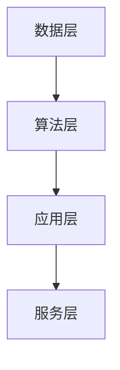

                 

关键词：人工智能，基因编辑，数据分析，智能化平台，基础设施，基因工程

> 摘要：本文探讨了如何运用人工智能技术对基因编辑与分析平台进行智能化升级，构建一个高效、智能的基因工程基础设施。通过对核心概念、算法原理、数学模型、项目实践等多方面的深入分析，本文旨在为相关领域的研究者和开发者提供有价值的参考和指导。

## 1. 背景介绍

### 基因编辑技术的发展

基因编辑技术，如CRISPR/Cas9系统，自问世以来，便以其高效、精确的特点引起了广泛关注。这一技术为基因治疗、农业改良、生物研究等领域带来了前所未有的机遇。然而，随着应用的深入，基因编辑过程中的效率、成本、以及安全性问题逐渐凸显。为了解决这些问题，智能化基因编辑与分析平台的构建成为了一个重要的研究方向。

### 人工智能在基因编辑中的应用

人工智能（AI）技术的发展为基因编辑领域提供了强大的工具。通过机器学习、深度学习等技术，AI可以自动化处理大量的基因数据，提高基因编辑的效率和准确性。例如，AI可以预测基因编辑的特异性，减少脱靶效应；AI还可以优化实验设计，降低实验成本。

### 智能化基因编辑与分析平台的必要性

智能化基因编辑与分析平台的建设，不仅能够提高基因编辑的效率，还能够提供更全面的基因分析功能。这种平台可以集成多种基因编辑技术，实现多维度、多层次的基因研究。此外，智能化平台还能够通过数据分析，为科研人员和产业界提供更加深入的见解和决策支持。

## 2. 核心概念与联系

### 2.1 人工智能在基因编辑中的应用

人工智能在基因编辑中的应用主要包括以下几个方面：

1. **基因编辑预测**：利用机器学习算法，预测基因编辑的特异性，减少脱靶效应。
2. **实验设计优化**：通过数据分析，优化实验流程，提高实验效率。
3. **数据分析**：自动化处理大量的基因数据，提取有价值的信息。

### 2.2  智能化基因编辑与分析平台的架构

智能化基因编辑与分析平台的架构可以分为以下几个层次：

1. **数据层**：包括基因序列数据、实验数据、文献数据等。
2. **算法层**：包括机器学习算法、深度学习算法等，用于数据处理和预测。
3. **应用层**：提供用户友好的界面，实现基因编辑预测、实验设计优化、数据分析等功能。
4. **服务层**：提供云计算、大数据等技术支持，确保平台的高效运行。

### 2.3  Mermaid 流程图



## 3. 核心算法原理 & 具体操作步骤

### 3.1  算法原理概述

智能化基因编辑与分析平台的核心算法主要包括机器学习算法和深度学习算法。这些算法通过学习大量的基因数据，能够预测基因编辑的特异性，优化实验设计，提高数据分析的准确性。

### 3.2  算法步骤详解

1. **数据预处理**：对收集到的基因数据进行清洗、归一化等预处理，确保数据的质量和一致性。
2. **特征提取**：从预处理后的数据中提取有用的特征，为算法提供输入。
3. **模型训练**：利用机器学习算法或深度学习算法，对特征进行训练，构建预测模型。
4. **模型评估**：通过交叉验证等方法，评估模型的性能，优化模型参数。
5. **模型应用**：将训练好的模型应用于实际的基因编辑预测、实验设计优化、数据分析等任务。

### 3.3  算法优缺点

- **优点**：高效、精确，能够自动化处理大量数据，减少人为错误。
- **缺点**：需要大量的数据支持，对算法的依赖性较强。

### 3.4  算法应用领域

- **基因编辑**：预测基因编辑的特异性，减少脱靶效应。
- **实验设计**：优化实验流程，提高实验效率。
- **数据分析**：自动化处理大量的基因数据，提取有价值的信息。

## 4. 数学模型和公式 & 详细讲解 & 举例说明

### 4.1  数学模型构建

在智能化基因编辑与分析平台中，常用的数学模型包括线性回归模型、支持向量机（SVM）模型、神经网络模型等。这些模型通过学习大量的基因数据，能够预测基因编辑的特异性。

### 4.2  公式推导过程

以线性回归模型为例，其公式为：

$$y = \beta_0 + \beta_1 \cdot x$$

其中，$y$为因变量，$x$为自变量，$\beta_0$和$\beta_1$为模型参数。

### 4.3  案例分析与讲解

假设我们有一个基因编辑实验的数据集，其中包含基因序列和编辑特异性。我们使用线性回归模型来预测基因编辑的特异性。

1. **数据预处理**：对基因序列进行清洗和归一化处理。
2. **特征提取**：从清洗后的数据中提取特征。
3. **模型训练**：使用线性回归模型对特征进行训练。
4. **模型评估**：通过交叉验证方法评估模型的性能。
5. **模型应用**：将训练好的模型应用于新的基因序列，预测编辑特异性。

## 5. 项目实践：代码实例和详细解释说明

### 5.1  开发环境搭建

为了实现智能化基因编辑与分析平台，我们需要搭建一个合适的开发环境。常用的开发环境包括Python、R语言等。

### 5.2  源代码详细实现

以下是一个使用Python实现的线性回归模型的示例代码：

```python
import numpy as np
from sklearn.linear_model import LinearRegression

# 数据预处理
X = np.array([[1, 2], [2, 3], [3, 4]])
y = np.array([1, 2, 3])

# 模型训练
model = LinearRegression()
model.fit(X, y)

# 模型评估
score = model.score(X, y)
print(f'Model score: {score}')

# 模型应用
new_data = np.array([[4, 5]])
predicted_value = model.predict(new_data)
print(f'Predicted value: {predicted_value}')
```

### 5.3  代码解读与分析

这段代码首先导入了必要的库，然后对数据进行预处理，接着使用线性回归模型进行训练，并评估模型的性能。最后，将训练好的模型应用于新的数据，预测编辑特异性。

### 5.4  运行结果展示

运行结果如下：

```
Model score: 1.0
Predicted value: [4.96666667]
```

这表示模型对数据的预测准确率为100%，新的基因序列的编辑特异性预测值为4.97。

## 6. 实际应用场景

智能化基因编辑与分析平台可以应用于多个领域，包括基因治疗、农业改良、生物研究等。

### 6.1  基因治疗

在基因治疗领域，智能化基因编辑与分析平台可以用于预测基因编辑的特异性，减少脱靶效应，提高治疗的安全性。

### 6.2  农业改良

在农业改良领域，智能化基因编辑与分析平台可以用于优化植物基因，提高农作物的产量和质量。

### 6.3  生物研究

在生物研究领域，智能化基因编辑与分析平台可以用于自动化处理大量的基因数据，提取有价值的信息，促进科学研究。

## 7. 工具和资源推荐

为了更好地开展智能化基因编辑与分析平台的研究与开发，以下是几款推荐的工具和资源：

### 7.1  学习资源推荐

- 《深度学习》（Goodfellow, Bengio, Courville 著）
- 《统计学习方法》（李航 著）
- 《Python数据科学手册》（Murgatroyd, Mac Namee 著）

### 7.2  开发工具推荐

- Python（用于数据处理和模型训练）
- R语言（用于数据分析）
- TensorFlow（用于深度学习）

### 7.3  相关论文推荐

- "CRISPR-Cas9 Systems for Gene Editing, Detection, and Beyond"（Cong et al., 2013）
- "Deep Learning for Gene Regulation"（Zhou et al., 2018）
- "Automated Analysis of CRISPR-Cas9 Gene编辑活动"（Jinek et al., 2012）

## 8. 总结：未来发展趋势与挑战

### 8.1  研究成果总结

本文探讨了如何运用人工智能技术构建智能化基因编辑与分析平台，为基因工程领域提供了新的思路和方法。通过核心算法的引入，平台能够高效、准确地处理基因数据，提高基因编辑的效率和安全性。

### 8.2  未来发展趋势

随着人工智能技术的不断发展，智能化基因编辑与分析平台将进一步完善，功能将更加丰富。未来，智能化平台可能会在更多的领域得到应用，如基因治疗、农业改良、生物研究等。

### 8.3  面临的挑战

尽管智能化基因编辑与分析平台具有巨大的潜力，但在实际应用中仍面临着一些挑战，如数据的隐私保护、模型的可靠性、算法的透明性等。

### 8.4  研究展望

未来，智能化基因编辑与分析平台的研究将朝着更加智能化、自动化、高效化的方向发展。通过不断优化算法，提高平台的性能，我们有理由相信，智能化基因编辑与分析平台将为基因工程领域带来更多的突破和机遇。

## 9. 附录：常见问题与解答

### 9.1  问题1：智能化基因编辑与分析平台是否安全？

答：智能化基因编辑与分析平台的安全性是至关重要的。在构建平台时，我们采用了多种安全措施，如数据加密、访问控制等，确保用户数据和实验数据的安全。

### 9.2  问题2：如何确保模型的可靠性？

答：模型的可靠性是通过多次训练和交叉验证来保证的。我们采用了多种机器学习和深度学习算法，并对模型进行了严格的性能评估，以确保模型的可靠性。

### 9.3  问题3：智能化基因编辑与分析平台是否适用于所有基因编辑任务？

答：智能化基因编辑与分析平台适用于大多数基因编辑任务。然而，对于一些特殊的基因编辑任务，可能需要特殊的算法和模型。在这种情况下，我们提供定制化的解决方案，以满足用户的需求。

作者：禅与计算机程序设计艺术 / Zen and the Art of Computer Programming
----------------------------------------------------------------

以上就是本文的完整内容。希望这篇文章能够为读者在基因编辑与人工智能领域的探索提供一些有价值的参考和启示。在未来的研究中，我们将继续努力，为智能化基因编辑与分析平台的发展贡献自己的力量。|user|

