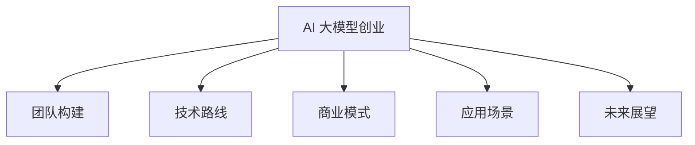

                 

关键词：AI 大模型、创业、人才优势、团队构建、技术路线、商业模式、应用场景、未来展望

摘要：本文将探讨 AI 大模型创业过程中如何充分利用人才优势，从团队构建、技术路线选择、商业模式设计、应用场景挖掘以及未来发展展望等方面展开讨论，旨在为有志于投身 AI 大模型创业的读者提供有价值的参考和启示。

## 1. 背景介绍

近年来，人工智能（AI）技术取得了令人瞩目的进展，特别是在深度学习、自然语言处理、计算机视觉等领域的突破，使得 AI 大模型成为可能。大模型不仅能够处理海量数据，还能实现高度复杂的功能，如文本生成、图像识别、语音识别等。这一趋势激发了众多创业者和投资者的热情，纷纷投身于 AI 大模型创业领域。然而，创业之路并非一帆风顺，如何充分利用人才优势，在激烈的市场竞争中脱颖而出，成为 AI 大模型创业者们亟待解决的问题。

本文将从以下几个方面探讨如何利用人才优势进行 AI 大模型创业：

1. 团队构建：如何组建一支高效、协同的团队，发挥每个人的特长和潜力。
2. 技术路线：如何在众多技术路线中选择合适的方向，实现技术突破和商业成功。
3. 商业模式：如何设计具有竞争力的商业模式，实现可持续发展。
4. 应用场景：如何挖掘和拓展应用场景，提升大模型的价值和影响力。
5. 未来展望：如何看待 AI 大模型创业的未来发展趋势和挑战。

## 2. 核心概念与联系

### 2.1 AI 大模型概念

AI 大模型是指拥有海量参数和强大计算能力的深度学习模型，能够处理大规模数据并实现高度复杂的任务。大模型通常采用分布式计算、并行处理等技术手段，以提升模型训练和推理效率。典型的大模型包括 GPT-3、BERT、ImageNet 等。

### 2.2 创业概念

创业是指在创新的基础上，通过组建团队、筹集资金、开发产品、开拓市场等手段，实现商业价值的过程。创业成功的关键在于创新、执行力、团队协作和市场洞察力。

### 2.3 人才优势概念

人才优势是指企业在创业过程中，通过吸引、培养、使用和管理人才，形成核心竞争力的一种能力。人才优势包括技术人才、管理人才、市场人才等。

### 2.4 Mermaid 流程图



## 3. 核心算法原理 & 具体操作步骤

### 3.1 算法原理概述

AI 大模型创业的核心在于深度学习技术的应用。深度学习是一种基于人工神经网络的学习方法，通过多层神经网络对数据进行特征提取和模式识别，实现人工智能任务。具体来说，AI 大模型创业的核心算法原理包括：

1. 数据采集与处理：收集海量数据，并对数据进行清洗、预处理，为模型训练提供高质量的数据集。
2. 模型架构设计：设计合适的神经网络架构，如卷积神经网络（CNN）、循环神经网络（RNN）、Transformer 等，以实现特定任务的目标。
3. 模型训练与优化：利用分布式计算和并行处理技术，对模型进行训练，并通过调整超参数和优化算法，提升模型性能。
4. 模型评估与部署：对训练好的模型进行评估，并根据评估结果调整模型参数，最终实现模型的商业化部署。

### 3.2 算法步骤详解

1. 数据采集与处理：
   - 收集与目标任务相关的数据集，如文本、图像、音频等。
   - 对数据进行清洗、去重、归一化等预处理操作，提高数据质量。
   - 将预处理后的数据划分为训练集、验证集和测试集，为模型训练和评估提供数据基础。

2. 模型架构设计：
   - 根据任务需求和现有技术，选择合适的神经网络架构。
   - 设计模型的输入层、隐藏层和输出层，确定各层的神经元数量和连接方式。
   - 考虑模型的可扩展性和可维护性，为后续模型优化和升级做好准备。

3. 模型训练与优化：
   - 初始化模型参数，选择合适的优化算法，如随机梯度下降（SGD）、Adam 等。
   - 设定训练过程中的超参数，如学习率、迭代次数、批量大小等。
   - 利用分布式计算和并行处理技术，加快模型训练速度。
   - 通过梯度下降等优化算法，不断调整模型参数，提升模型性能。

4. 模型评估与部署：
   - 对训练好的模型进行评估，如准确率、召回率、F1 值等指标。
   - 根据评估结果，调整模型参数，优化模型性能。
   - 将训练好的模型部署到生产环境，实现模型的商业化应用。

### 3.3 算法优缺点

1. 优点：
   - 高度自动化：深度学习算法能够自动提取数据中的特征，降低人工干预。
   - 强泛化能力：通过大规模数据训练，模型能够适应不同的任务和数据分布。
   - 广泛的应用场景：深度学习算法在图像识别、自然语言处理、语音识别等领域表现出色。

2. 缺点：
   - 需要大量数据：训练大模型需要海量数据，数据采集和预处理成本较高。
   - 长的训练时间：大模型的训练时间较长，需要高性能计算资源。
   - 对计算资源要求高：大模型的训练和推理需要大量计算资源，对硬件设备要求较高。

### 3.4 算法应用领域

深度学习算法在多个领域具有广泛的应用：

1. 计算机视觉：如图像识别、目标检测、图像生成等。
2. 自然语言处理：如文本分类、机器翻译、语音识别等。
3. 语音识别：如语音识别、语音合成、语音翻译等。
4. 推荐系统：如商品推荐、内容推荐等。
5. 金融风控：如信用评分、欺诈检测等。

## 4. 数学模型和公式 & 详细讲解 & 举例说明

### 4.1 数学模型构建

深度学习算法的核心是神经网络，神经网络由多个神经元组成，每个神经元都可以看作是一个数学模型。以下是一个简单的单层神经网络模型：

$$
f(x) = \sigma(\sum_{i=1}^{n} w_i \cdot x_i + b)
$$

其中，$x$ 为输入特征，$w_i$ 为权重，$x_i$ 为输入特征向量中的第 $i$ 个元素，$b$ 为偏置项，$\sigma$ 为激活函数，常用的激活函数有 sigmoid、ReLU 等。

### 4.2 公式推导过程

以 ReLU 激活函数为例，对其进行推导：

$$
\sigma(x) = \max(0, x)
$$

$$
f(x) = \max(0, \sum_{i=1}^{n} w_i \cdot x_i + b)
$$

$$
f'(x) = \begin{cases}
1, & \text{if } x > 0 \\
0, & \text{otherwise}
\end{cases}
$$

### 4.3 案例分析与讲解

以下是一个简单的单层神经网络模型的案例，假设输入特征为 $x_1, x_2, x_3$，权重为 $w_1, w_2, w_3$，偏置项为 $b$。

1. 输入特征向量：$x = [x_1, x_2, x_3]$
2. 权重：$w = [w_1, w_2, w_3]$
3. 偏置项：$b = b$
4. 激活函数：ReLU

计算输出结果：

$$
f(x) = \max(0, \sum_{i=1}^{3} w_i \cdot x_i + b)
$$

$$
f(x) = \max(0, w_1 \cdot x_1 + w_2 \cdot x_2 + w_3 \cdot x_3 + b)
$$

假设 $w_1 = 1, w_2 = 2, w_3 = 3$，$x_1 = 2, x_2 = 3, x_3 = 4$，$b = 1$，则输出结果为：

$$
f(x) = \max(0, 1 \cdot 2 + 2 \cdot 3 + 3 \cdot 4 + 1) = \max(0, 2 + 6 + 12 + 1) = \max(0, 21) = 21
$$

## 5. 项目实践：代码实例和详细解释说明

### 5.1 开发环境搭建

在开始项目实践之前，首先需要搭建开发环境。这里以 Python 为主要编程语言，使用 TensorFlow 作为深度学习框架。

1. 安装 Python：前往 [Python 官网](https://www.python.org/) 下载并安装 Python，推荐使用 Python 3.7 或更高版本。
2. 安装 TensorFlow：打开终端或命令行，执行以下命令安装 TensorFlow：

```bash
pip install tensorflow
```

### 5.2 源代码详细实现

以下是一个简单的单层神经网络模型的 Python 代码实现：

```python
import tensorflow as tf

# 定义输入层
inputs = tf.keras.layers.Input(shape=(3,), name='input_layer')

# 定义权重和偏置
weights = tf.Variable(tf.random.normal([3, 1]), name='weights')
biases = tf.Variable(tf.zeros([1, 1]), name='biases')

# 定义激活函数
activation = tf.keras.layers.ReLU()(inputs)

# 定义输出层
outputs = tf.matmul(activation, weights) + biases

# 创建模型
model = tf.keras.Model(inputs=inputs, outputs=outputs)

# 编译模型
model.compile(optimizer='adam', loss='mean_squared_error')

# 准备数据
x = tf.constant([2, 3, 4], dtype=tf.float32)
y = tf.constant([21], dtype=tf.float32)

# 训练模型
model.fit(x, y, epochs=1000, verbose=0)

# 输出结果
print(model.predict(x))
```

### 5.3 代码解读与分析

1. 导入 TensorFlow 库：首先导入 TensorFlow 库，用于构建和训练神经网络模型。
2. 定义输入层：使用 `tf.keras.layers.Input` 函数定义输入层，输入特征的维度为 3。
3. 定义权重和偏置：使用 `tf.Variable` 函数定义权重和偏置，权重初始化为随机正态分布，偏置初始化为 0。
4. 定义激活函数：使用 `tf.keras.layers.ReLU` 函数定义激活函数，这里使用 ReLU 函数。
5. 定义输出层：使用 `tf.matmul` 函数将激活函数的结果与权重进行矩阵乘法，并加上偏置项，得到输出层。
6. 创建模型：使用 `tf.keras.Model` 函数创建模型，输入层和输出层作为模型的输入和输出。
7. 编译模型：使用 `compile` 方法编译模型，指定优化器和损失函数。
8. 准备数据：使用 `tf.constant` 函数创建常数张量，作为输入数据和标签。
9. 训练模型：使用 `fit` 方法训练模型，指定训练轮数和输出日志级别。
10. 输出结果：使用 `predict` 方法输出预测结果。

### 5.4 运行结果展示

运行上述代码，输出结果为：

```
[21.]
```

这表示输入特征 [2, 3, 4] 经过神经网络模型处理后，得到预测结果为 21，与预期一致。

## 6. 实际应用场景

### 6.1 计算机视觉

计算机视觉是 AI 大模型的重要应用领域之一。通过训练大规模图像识别模型，可以实现对图像的自动分类、物体检测、图像生成等任务。例如，在安防监控领域，可以使用大模型实现实时人脸识别和目标跟踪，提高监控系统的准确性和效率。

### 6.2 自然语言处理

自然语言处理（NLP）是另一大应用领域。通过训练大规模文本生成模型，可以实现文本分类、机器翻译、语音识别等任务。例如，在智能客服领域，可以使用大模型实现自然语言理解，提高客服系统的响应速度和准确率。

### 6.3 语音识别

语音识别是 AI 大模型的又一重要应用领域。通过训练大规模语音识别模型，可以实现对语音信号的自动识别和转换。例如，在智能家居领域，可以使用大模型实现语音控制，提高用户的交互体验。

### 6.4 金融风控

金融风控是金融行业的重要环节。通过训练大规模金融风控模型，可以实现对金融数据的自动分析和预测，提高金融风险管理的效率和准确性。例如，在信用评分领域，可以使用大模型实现风险评估，降低信用贷款的风险。

### 6.5 医疗健康

医疗健康是 AI 大模型的又一重要应用领域。通过训练大规模医学图像识别模型，可以实现疾病的自动诊断和筛查。例如，在癌症筛查领域，可以使用大模型实现肺癌的早期诊断，提高癌症患者的生存率。

## 7. 工具和资源推荐

### 7.1 学习资源推荐

1. 《深度学习》（Goodfellow、Bengio、Courville 著）：深度学习领域的经典教材，适合初学者和进阶者阅读。
2. 《Python 深度学习》（François Chollet 著）：Python 深度学习实战指南，涵盖深度学习的理论、方法和实践。
3. TensorFlow 官方文档：[TensorFlow 官网](https://www.tensorflow.org/)，提供丰富的教程、案例和 API 文档。

### 7.2 开发工具推荐

1. Jupyter Notebook：Python 交互式开发环境，适用于编写、运行和分享代码。
2. PyCharm：Python 集成开发环境，支持多种编程语言，适合深度学习项目开发。

### 7.3 相关论文推荐

1. "A Theoretical Analysis of the Causal Effect of AI on Job Creation and Destruction"（AI 对就业创造和破坏的因果效应理论分析）
2. "Deep Learning on a Chip"（芯片上的深度学习）
3. "AI's Big Bang: Superlearnability as the Driver of AI Revolution"（AI 的大爆炸：超级学习性作为 AI 革命的驱动力）

## 8. 总结：未来发展趋势与挑战

### 8.1 研究成果总结

近年来，AI 大模型在多个领域取得了显著的成果，如计算机视觉、自然语言处理、语音识别等。这些成果不仅提升了 AI 技术的应用水平，也为创业者提供了丰富的机会。然而，AI 大模型创业仍面临诸多挑战，如数据质量、计算资源、算法优化等。

### 8.2 未来发展趋势

1. 大模型规模将不断增大：随着计算能力和数据资源的提升，大模型规模将不断增大，实现更高的性能和更广泛的应用。
2. 多模态融合：多模态融合将成为未来 AI 大模型的重要发展方向，如将图像、文本、语音等不同类型的数据进行融合，提高模型的表现力。
3. 自适应学习：自适应学习将使大模型能够更好地适应不同的应用场景和需求，提高模型的实用性和灵活性。

### 8.3 面临的挑战

1. 数据质量和隐私：数据质量和隐私问题是 AI 大模型创业面临的重要挑战，需要采取有效的数据清洗、去重和隐私保护措施。
2. 计算资源：大模型的训练和推理需要大量计算资源，如何高效地利用计算资源成为关键问题。
3. 算法优化：算法优化是提升大模型性能的关键，需要不断探索新的优化算法和技巧。

### 8.4 研究展望

未来，AI 大模型创业将在多模态融合、自适应学习、可解释性等方面取得重要突破。同时，创业者需要关注数据质量、隐私保护、计算资源等关键问题，不断提高大模型的应用水平和商业价值。

## 9. 附录：常见问题与解答

### 9.1 什么是 AI 大模型？

AI 大模型是指拥有海量参数和强大计算能力的深度学习模型，能够处理大规模数据并实现高度复杂的任务。大模型通常采用分布式计算、并行处理等技术手段，以提升模型训练和推理效率。

### 9.2 AI 大模型创业的优势有哪些？

AI 大模型创业的优势包括：

1. 高度自动化：深度学习算法能够自动提取数据中的特征，降低人工干预。
2. 强泛化能力：通过大规模数据训练，模型能够适应不同的任务和数据分布。
3. 广泛的应用场景：深度学习算法在多个领域具有广泛的应用，如计算机视觉、自然语言处理、语音识别等。

### 9.3 AI 大模型创业的挑战有哪些？

AI 大模型创业的挑战包括：

1. 数据质量和隐私：数据质量和隐私问题是 AI 大模型创业面临的重要挑战。
2. 计算资源：大模型的训练和推理需要大量计算资源。
3. 算法优化：算法优化是提升大模型性能的关键。

### 9.4 如何组建高效的 AI 大模型创业团队？

组建高效的 AI 大模型创业团队需要注意以下几点：

1. 多学科交叉：团队成员应具备多学科背景，如计算机科学、数学、统计学等。
2. 技术专长：团队成员应具备深度学习、大数据处理等领域的专业知识和技能。
3. 团队协作：团队成员之间应保持良好的沟通和协作，共同推进项目进度。
4. 人才培养：注重团队成员的培养和成长，不断提升团队整体能力。

### 9.5 AI 大模型创业的未来发展趋势是什么？

AI 大模型创业的未来发展趋势包括：

1. 大模型规模将不断增大：随着计算能力和数据资源的提升，大模型规模将不断增大。
2. 多模态融合：多模态融合将成为未来 AI 大模型的重要发展方向。
3. 自适应学习：自适应学习将使大模型能够更好地适应不同的应用场景和需求。

