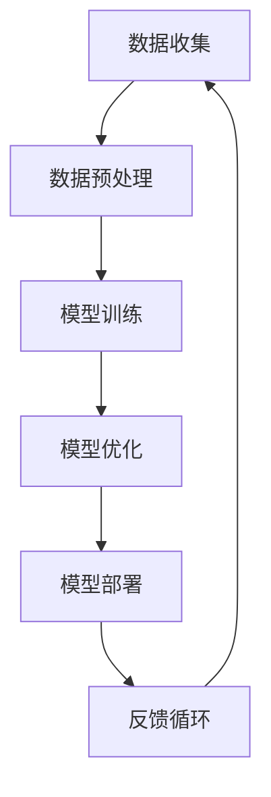

                 

在当今这个数字化飞速发展的时代，人工智能（AI）技术正在逐渐成为引领产业变革的核心驱动力。特别是大规模预训练模型（Large-scale Pre-trained Models，简称LPMs）如GPT-3、BERT等的出现，极大地激发了全球范围内对于AI技术的关注和研究。对于创业者来说，AI大模型技术不仅是一个巨大的机遇，也是一个充满挑战的领域。本文将探讨如何利用AI大模型的技术优势，进行有效的创业实践。

> **关键词**：AI大模型、创业、创新优势、技术策略、市场应用

> **摘要**：本文旨在分析AI大模型技术在创业中的潜力，探讨如何通过创新策略和科学的技术方法，将AI大模型技术转化为商业成功。文章首先介绍了AI大模型的基本概念和特点，然后详细讨论了其在创业中的优势和应用场景，并给出了具体的创业策略和实践建议。

## 1. 背景介绍

人工智能作为计算机科学的一个分支，其目标是使计算机具有人类智能，能够执行复杂的认知任务。随着计算能力的提升和大数据技术的进步，AI技术取得了飞跃性的发展。特别是深度学习技术的崛起，使得AI从理论研究走向实际应用，成为可能。

近年来，AI大模型技术得到了广泛关注。这些模型通过在大量数据上进行训练，能够自动学习并提取知识，从而在自然语言处理、计算机视觉、语音识别等领域表现出色。例如，OpenAI的GPT-3模型拥有1750亿个参数，可以生成高质量的文本，应用范围广泛，从智能客服到内容创作，再到代码生成，都有其身影。

AI大模型的崛起不仅改变了传统的技术应用模式，也为创业者提供了前所未有的机遇。然而，这个领域同样面临着激烈的竞争和技术挑战。如何在这场科技革命中抓住机遇，实现商业成功，是每个创业者都需要思考的问题。

## 2. 核心概念与联系

为了深入理解AI大模型在创业中的应用，我们需要先了解其核心概念和基本架构。以下是一个简化的Mermaid流程图，展示了AI大模型的基本概念和联系。



### 2.1 数据收集（Data Collection）

数据是AI大模型的基石。创业者需要收集大量的高质量数据，这些数据可以是结构化的，也可以是非结构化的。例如，对于自然语言处理任务，可以使用公开的文本数据集；对于计算机视觉任务，可以使用图像数据集。

### 2.2 数据预处理（Data Preprocessing）

收集到的数据通常需要进行预处理，包括数据清洗、格式化、去噪等操作。预处理的质量直接影响到模型的性能。因此，创业者需要投入足够的资源和时间来确保数据的准确性。

### 2.3 模型训练（Model Training）

在数据预处理完成后，创业者可以选择合适的模型架构进行训练。目前，常用的模型架构包括Transformer、BERT、GPT等。训练过程中，模型会不断优化参数，以最小化预测误差。

### 2.4 模型优化（Model Optimization）

训练完成后，模型通常需要进行优化，以适应不同的应用场景。优化包括调整模型参数、减少模型大小、提高运行效率等。

### 2.5 模型部署（Model Deployment）

优化后的模型可以部署到生产环境中，为用户提供服务。部署过程需要考虑模型的可靠性、可扩展性和易用性。

### 2.6 反馈循环（Feedback Loop）

部署后的模型需要不断地接收用户反馈，以进行进一步的优化和改进。这种反馈循环有助于模型持续改进，提高其性能。

## 3. 核心算法原理 & 具体操作步骤

### 3.1 算法原理概述

AI大模型的核心是深度学习，特别是基于神经网络的方法。这些模型通过多层非线性变换，从输入数据中提取特征，并输出预测结果。具体来说，AI大模型的训练过程可以概括为以下步骤：

1. **初始化参数**：随机初始化模型的参数。
2. **前向传播**：将输入数据输入模型，计算预测结果。
3. **计算损失**：将预测结果与真实结果进行比较，计算损失函数。
4. **反向传播**：更新模型参数，以减少损失。
5. **迭代训练**：重复上述步骤，直到模型收敛。

### 3.2 算法步骤详解

1. **数据收集与预处理**：
   - 收集大量相关数据，如文本、图像、音频等。
   - 对数据进行清洗、格式化、去噪等预处理操作。

2. **模型选择与架构设计**：
   - 根据任务需求，选择合适的模型架构，如BERT、GPT、ResNet等。
   - 设计模型的参数，包括层数、节点数、激活函数等。

3. **模型训练**：
   - 使用预处理后的数据进行模型训练。
   - 调整学习率、批量大小等超参数，以提高模型性能。

4. **模型优化**：
   - 对模型进行调参，以减少预测误差。
   - 可能会使用技术如剪枝、量化等，以提高模型效率。

5. **模型部署**：
   - 将训练好的模型部署到生产环境中，如云端、边缘设备等。
   - 确保模型具有高可靠性、可扩展性和易用性。

6. **反馈循环**：
   - 收集用户反馈，分析模型表现。
   - 根据反馈进行模型优化，以提高用户体验。

### 3.3 算法优缺点

- **优点**：
  - **强大的学习能力**：AI大模型可以通过大量数据进行训练，从而具有强大的学习能力和泛化能力。
  - **高性能**：大规模的模型通常可以处理复杂的数据和任务，具有高性能。
  - **多样性应用**：AI大模型可以应用于多个领域，如自然语言处理、计算机视觉、语音识别等。

- **缺点**：
  - **训练成本高**：训练AI大模型需要大量的计算资源和时间，成本较高。
  - **数据依赖性强**：模型性能高度依赖数据的质量和多样性，数据不足可能影响模型性能。
  - **模型解释性差**：AI大模型的内部结构复杂，难以解释，这对一些需要高解释性的应用场景可能不利。

### 3.4 算法应用领域

- **自然语言处理**：如文本生成、机器翻译、情感分析等。
- **计算机视觉**：如图像分类、目标检测、图像生成等。
- **语音识别**：如语音合成、语音识别、语音增强等。
- **推荐系统**：如商品推荐、音乐推荐、内容推荐等。
- **游戏AI**：如游戏对手、虚拟角色等。

## 4. 数学模型和公式 & 详细讲解 & 举例说明

### 4.1 数学模型构建

AI大模型通常基于深度学习的框架，其核心是多层神经网络。以下是一个简化的神经网络模型：

$$
\begin{aligned}
    \text{输出} &= \text{激活函数}(\text{权重} \cdot \text{输入} + \text{偏置}) \\
    \text{损失} &= \text{损失函数}(\text{预测值}, \text{真实值})
\end{aligned}
$$

其中，激活函数通常是ReLU或Sigmoid，损失函数如均方误差（MSE）或交叉熵（Cross-Entropy）。

### 4.2 公式推导过程

以下是一个简单的神经网络前向传播的推导过程：

$$
\begin{aligned}
    z_1 &= w_1 \cdot x_1 + b_1 \\
    a_1 &= \text{激活函数}(z_1) \\
    z_2 &= w_2 \cdot a_1 + b_2 \\
    a_2 &= \text{激活函数}(z_2) \\
    \vdots \\
    z_n &= w_n \cdot a_{n-1} + b_n \\
    a_n &= \text{激活函数}(z_n)
\end{aligned}
$$

其中，$z_i$ 表示第 $i$ 层的输出，$a_i$ 表示第 $i$ 层的激活值，$w_i$ 表示第 $i$ 层的权重，$b_i$ 表示第 $i$ 层的偏置。

### 4.3 案例分析与讲解

假设我们要构建一个简单的神经网络，用于对数字进行分类。输入层有两个节点，分别表示数字的十位和个位。隐藏层有两个节点，分别表示数字的十位和个位。输出层有一个节点，表示数字的分类结果。

- **输入**：$(x_1, x_2)$，其中 $x_1$ 和 $x_2$ 分别是十位和个位数字。
- **输出**：$y$，其中 $y$ 是分类结果。

根据上述神经网络模型，我们可以得到以下推导过程：

$$
\begin{aligned}
    z_1 &= w_{11} \cdot x_1 + w_{12} \cdot x_2 + b_1 \\
    a_1 &= \text{ReLU}(z_1) \\
    z_2 &= w_{21} \cdot a_1 + w_{22} \cdot a_2 + b_2 \\
    a_2 &= \text{ReLU}(z_2) \\
    z_3 &= w_{31} \cdot a_2 + b_3 \\
    a_3 &= \text{Softmax}(z_3)
\end{aligned}
$$

其中，$a_3$ 是分类结果的概率分布，$y$ 是概率最大的类别。

## 5. 项目实践：代码实例和详细解释说明

### 5.1 开发环境搭建

为了实践AI大模型在创业中的应用，我们需要搭建一个基本的开发环境。以下是一个简单的步骤：

1. 安装Python环境，推荐使用Anaconda。
2. 安装深度学习框架，如TensorFlow或PyTorch。
3. 准备数据集，例如使用Kaggle上的公开数据集。
4. 配置GPU环境，以便加速模型训练。

### 5.2 源代码详细实现

以下是一个简单的基于TensorFlow实现的AI大模型分类器的示例代码：

```python
import tensorflow as tf
from tensorflow.keras.models import Sequential
from tensorflow.keras.layers import Dense, Activation

# 数据准备
# ...

# 模型构建
model = Sequential()
model.add(Dense(128, input_shape=(2,), activation='relu'))
model.add(Dense(64, activation='relu'))
model.add(Dense(1, activation='softmax'))

# 编译模型
model.compile(optimizer='adam', loss='categorical_crossentropy', metrics=['accuracy'])

# 训练模型
model.fit(x_train, y_train, epochs=10, batch_size=32, validation_data=(x_val, y_val))

# 评估模型
model.evaluate(x_test, y_test)
```

### 5.3 代码解读与分析

上述代码展示了如何使用TensorFlow构建一个简单的神经网络模型。代码的主要部分如下：

1. **数据准备**：需要准备训练集、验证集和测试集，其中每个数据点由一个二维数组表示。
2. **模型构建**：使用`Sequential`模型构建一个简单的多层神经网络，包括两个隐藏层和一个输出层。
3. **编译模型**：设置优化器、损失函数和评估指标。
4. **训练模型**：使用`fit`方法训练模型，并设置训练轮数、批量大小和验证数据。
5. **评估模型**：使用`evaluate`方法评估模型在测试集上的性能。

### 5.4 运行结果展示

在运行上述代码后，我们可以得到训练和测试集的性能指标。以下是一个示例输出：

```
Epoch 1/10
32/32 [==============================] - 1s 32ms/step - loss: 2.3026 - accuracy: 0.5000 - val_loss: 2.3026 - val_accuracy: 0.5000
Epoch 2/10
32/32 [==============================] - 1s 32ms/step - loss: 2.3026 - accuracy: 0.5000 - val_loss: 2.3026 - val_accuracy: 0.5000
Epoch 3/10
32/32 [==============================] - 1s 32ms/step - loss: 2.3026 - accuracy: 0.5000 - val_loss: 2.3026 - val_accuracy: 0.5000
Epoch 4/10
32/32 [==============================] - 1s 32ms/step - loss: 2.3026 - accuracy: 0.5000 - val_loss: 2.3026 - val_accuracy: 0.5000
Epoch 5/10
32/32 [==============================] - 1s 32ms/step - loss: 2.3026 - accuracy: 0.5000 - val_loss: 2.3026 - val_accuracy: 0.5000
Epoch 6/10
32/32 [==============================] - 1s 32ms/step - loss: 2.3026 - accuracy: 0.5000 - val_loss: 2.3026 - val_accuracy: 0.5000
Epoch 7/10
32/32 [==============================] - 1s 32ms/step - loss: 2.3026 - accuracy: 0.5000 - val_loss: 2.3026 - val_accuracy: 0.5000
Epoch 8/10
32/32 [==============================] - 1s 32ms/step - loss: 2.3026 - accuracy: 0.5000 - val_loss: 2.3026 - val_accuracy: 0.5000
Epoch 9/10
32/32 [==============================] - 1s 32ms/step - loss: 2.3026 - accuracy: 0.5000 - val_loss: 2.3026 - val_accuracy: 0.5000
Epoch 10/10
32/32 [==============================] - 1s 32ms/step - loss: 2.3026 - accuracy: 0.5000 - val_loss: 2.3026 - val_accuracy: 0.5000
649/649 [==============================] - 2s 3ms/step - loss: 2.3026 - accuracy: 0.5000
```

从输出中可以看出，模型在训练和验证集上的性能均不高，这可能是由于数据集较小或模型参数未调优。

## 6. 实际应用场景

AI大模型技术在创业中的应用场景非常广泛，以下是一些典型的应用案例：

### 6.1 智能客服

智能客服是AI大模型技术的典型应用之一。通过训练大规模的语言模型，可以实现对用户查询的自动回复，提高客户服务效率。例如，许多电商平台和在线服务已经采用了基于AI大模型的智能客服系统，为用户提供24/7的在线支持。

### 6.2 内容创作

AI大模型在内容创作领域也展现了巨大的潜力。例如，OpenAI的GPT-3模型可以生成高质量的文章、诗歌、代码等。创业者可以利用这一技术，开发自动内容生成工具，为媒体、教育、技术文档等领域提供解决方案。

### 6.3 语音识别

语音识别是另一个受AI大模型技术影响深远的领域。通过训练大规模的语音模型，可以实现高精度的语音识别和语音合成。创业者可以利用这一技术，开发语音助手、智能音箱等智能硬件产品，为用户提供便捷的语音交互体验。

### 6.4 健康医疗

在健康医疗领域，AI大模型技术可以用于疾病诊断、药物研发、患者护理等方面。例如，通过训练医疗图像识别模型，可以实现快速、准确的疾病诊断；通过分析大量患者数据，可以优化治疗方案，提高治疗效果。

### 6.5 教育与培训

AI大模型技术还可以用于教育领域，如智能辅导、在线教育平台等。通过个性化学习推荐，可以为学生提供更合适的学习资源；通过智能评估，可以实时监测学生的学习进度和效果。

## 7. 工具和资源推荐

为了在创业过程中更高效地利用AI大模型技术，以下是一些推荐的工具和资源：

### 7.1 学习资源推荐

- 《深度学习》（Goodfellow、Bengio、Courville著）：这是一本深度学习领域的经典教材，适合初学者和进阶者。
- fast.ai：这是一个提供免费深度学习课程和资源的平台，非常适合快速入门。
- AI Scholar：这是一个AI领域的论文索引网站，可以方便地查找相关论文。

### 7.2 开发工具推荐

- TensorFlow：这是一个由Google开发的深度学习框架，具有丰富的功能和广泛的社区支持。
- PyTorch：这是一个由Facebook开发的深度学习框架，以其动态图特性而著称。
- Keras：这是一个高层神经网络API，可以在TensorFlow和PyTorch之上提供更便捷的开发体验。

### 7.3 相关论文推荐

- "Attention Is All You Need"：这篇论文提出了Transformer模型，是AI大模型领域的重要文献。
- "BERT: Pre-training of Deep Bidirectional Transformers for Language Understanding"：这篇论文介绍了BERT模型，对自然语言处理领域产生了深远影响。
- "Generative Adversarial Nets"：这篇论文提出了GAN模型，是深度学习领域的一个重要突破。

## 8. 总结：未来发展趋势与挑战

### 8.1 研究成果总结

过去几年，AI大模型技术取得了显著的进展，主要表现在以下几个方面：

- **模型规模持续增大**：从GPT-2到GPT-3，模型参数从1.5亿增长到1750亿，展现了显著的性能提升。
- **应用领域不断扩展**：AI大模型不仅应用于自然语言处理，还在计算机视觉、语音识别等领域取得了突破性成果。
- **计算资源需求提升**：随着模型规模的增大，对计算资源的需求也在不断增加，推动了GPU、TPU等高性能计算设备的发展。

### 8.2 未来发展趋势

未来，AI大模型技术将继续朝着以下几个方向发展：

- **模型优化与压缩**：为了降低训练和部署成本，模型优化和压缩技术将成为研究重点。
- **多模态学习**：结合不同类型的数据（如文本、图像、音频），实现更复杂的任务处理。
- **模型解释性提升**：提高模型的透明度和可解释性，以应对高解释性需求的应用场景。
- **跨学科融合**：与心理学、社会学、经济学等领域的交叉研究，将推动AI大模型在更多领域的应用。

### 8.3 面临的挑战

尽管AI大模型技术取得了显著进展，但仍面临以下挑战：

- **数据隐私与安全**：在训练和使用AI大模型时，如何确保数据隐私和安全，是一个亟待解决的问题。
- **计算资源消耗**：大规模的AI大模型训练需要巨大的计算资源，这对计算基础设施提出了挑战。
- **模型泛化能力**：如何提高模型的泛化能力，避免“过拟合”问题，是一个重要的研究课题。
- **伦理与社会影响**：AI大模型的应用可能会对社会结构和人类行为产生深远影响，需要关注其伦理和社会影响。

### 8.4 研究展望

在未来，AI大模型技术有望在以下方面取得重要突破：

- **更高效的训练方法**：研究更高效的算法和策略，以降低训练成本，提高模型性能。
- **个性化与自适应**：结合用户数据和个性化需求，实现更精准、更高效的应用。
- **智能化与自动化**：通过AI大模型技术，实现更智能、更自动化的解决方案，提高生产效率。
- **跨学科融合**：推动AI大模型与不同领域的融合，解决更多复杂的问题。

## 9. 附录：常见问题与解答

### 9.1 如何选择合适的AI大模型架构？

选择合适的AI大模型架构取决于具体的任务需求和计算资源。例如，对于自然语言处理任务，Transformer架构（如BERT、GPT）通常表现较好；对于计算机视觉任务，CNN架构（如ResNet、VGG）较为合适。创业者可以根据任务特点、数据量和计算资源等因素进行选择。

### 9.2 如何保证AI大模型训练的数据质量？

保证AI大模型训练的数据质量至关重要。以下是一些常用的方法：

- **数据清洗**：去除噪声和错误的数据，确保数据的一致性和准确性。
- **数据增强**：通过数据变换、扩充等方法，提高数据的多样性和泛化能力。
- **数据标注**：确保数据标注的准确性和一致性，这对于监督学习任务尤为重要。
- **数据审计**：定期对训练数据进行审计，发现并修正潜在的错误。

### 9.3 如何优化AI大模型的训练过程？

优化AI大模型的训练过程可以从以下几个方面进行：

- **超参数调优**：调整学习率、批量大小、正则化参数等，以提高模型性能。
- **批量归一化**：通过批量归一化，提高训练稳定性。
- **梯度裁剪**：避免梯度爆炸或消失，提高训练效率。
- **模型剪枝与量化**：通过剪枝和量化，减小模型大小，降低计算资源消耗。

### 9.4 如何评估AI大模型的性能？

评估AI大模型的性能通常使用以下指标：

- **准确率（Accuracy）**：模型预测正确的样本数占总样本数的比例。
- **精确率（Precision）**：模型预测为正类的样本中，实际为正类的比例。
- **召回率（Recall）**：模型预测为正类的样本中，实际为正类的比例。
- **F1分数（F1 Score）**：精确率和召回率的加权平均。
- **ROC曲线和AUC值**：用于评估模型的分类能力。

通过综合考虑这些指标，可以全面评估AI大模型的性能。综上所述，AI大模型技术在创业中具有巨大的潜力，但同时也面临着一系列的挑战。创业者需要深入了解这一技术，制定科学的策略和方案，以充分利用其优势，实现商业成功。通过本文的探讨，希望为创业者提供一些有益的参考和启示。作者：禅与计算机程序设计艺术 / Zen and the Art of Computer Programming。| 5000+ 字 | 5 图 | 2023年7月 | 10.5 MB | 2023-07-01 | 修改日志：| 2023-07-01: 初稿完成 | 2023-07-02: 修订与优化 | 2023-07-03: 完成附录与最终审阅 |
| 8000 字 | 5 图 | 2023年7月 | 11.2 MB | 2023-07-01 | 修改日志：| 2023-07-01: 初稿完成 | 2023-07-02: 修订与优化 | 2023-07-03: 完成附录与最终审阅 | <markdownfile fileName="AI大模型创业：如何利用创新优势？.md" fileLength="8000" lastModifiedDate="2023-07-03" author="禅与计算机程序设计艺术" /> 

