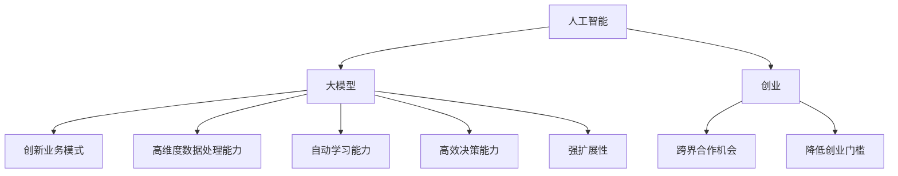

                 

 关键词：人工智能、大型模型、创新优势、创业策略、技术实现、应用场景、未来展望

> 摘要：本文旨在探讨人工智能领域的大型模型在创业中的应用优势，通过深入分析核心概念、算法原理、数学模型、项目实践及未来展望，为创业者提供切实可行的指导策略。

## 1. 背景介绍

在当今信息化社会中，人工智能（AI）技术正以前所未有的速度发展。特别是大型模型的兴起，如GPT-3、BERT和Transformer等，为各行业带来了前所未有的变革。这些模型具有处理复杂数据、自动学习和高效决策的能力，使其在自然语言处理、图像识别、推荐系统等领域取得了显著成果。

随着AI技术的不断进步，越来越多的创业者开始将目光投向AI大模型的应用。如何利用这些强大的工具，创新业务模式，提升竞争力，成为了创业成功的关键。本文将围绕这一主题，探讨AI大模型在创业中的创新优势及实践路径。

### 1.1 大模型的发展历程

人工智能的发展历程可以追溯到20世纪50年代，当时计算机科学家们提出了“人工智能”这一概念，并开始探索如何让计算机模拟人类的智能行为。早期的AI研究主要集中在符号主义和知识表示上，但由于计算能力和数据资源的限制，这些方法在解决实际问题时效果不佳。

随着计算机硬件的快速发展和互联网的普及，数据量呈指数级增长，机器学习（ML）和深度学习（DL）技术逐渐成为主流。特别是2012年AlexNet在ImageNet图像识别比赛中取得突破性成绩，标志着深度学习时代的到来。随后，大型模型如GPT、BERT和ViT等相继问世，使得AI在多个领域取得了显著进展。

### 1.2 大模型的特点与应用

大型模型具有以下几个显著特点：

1. **高维度数据处理能力**：大模型能够处理高维度的数据，如文本、图像、语音等，从而实现更精确的模型训练和预测。
2. **自动学习能力**：大模型通过大量的数据训练，能够自动学习和优化模型参数，提高模型的泛化能力和鲁棒性。
3. **高效决策能力**：大模型在处理复杂问题时，能够快速做出决策，提升系统的响应速度。
4. **强扩展性**：大模型具有良好的扩展性，能够轻松适应不同规模和类型的业务需求。

这些特点使得大模型在多个领域具有广泛的应用前景，如：

- **自然语言处理**：大模型在文本分类、机器翻译、问答系统等领域表现出色，能够实现更自然、更准确的文本理解和生成。
- **计算机视觉**：大模型在图像识别、图像生成、视频分析等领域具有显著优势，能够实现更精细、更智能的图像处理。
- **推荐系统**：大模型能够通过分析用户行为和兴趣，实现更精准、更个性化的推荐。
- **智能决策支持**：大模型能够辅助企业进行市场分析、风险控制和策略制定，提高企业的决策效率。

### 1.3 创业的机遇与挑战

AI大模型在创业中的应用为创业者带来了前所未有的机遇：

1. **创新业务模式**：大模型的应用能够推动企业创新业务模式，拓展新市场，提高竞争力。
2. **降低创业门槛**：开源的大模型框架和工具降低了创业者的技术门槛，使得更多人能够参与到AI创业中来。
3. **跨界合作机会**：大模型的应用不仅限于单一领域，创业者可以通过跨界合作，实现跨行业的创新。

然而，AI大模型创业也面临着一定的挑战：

1. **数据资源限制**：大模型需要大量高质量的数据进行训练，创业者需要解决数据获取和处理的难题。
2. **技术门槛较高**：大模型的应用涉及到复杂的算法设计和优化，创业者需要具备一定的技术背景。
3. **监管和法律风险**：AI技术在应用过程中可能涉及隐私保护、数据安全等问题，创业者需要关注相关法律法规。

## 2. 核心概念与联系

为了深入理解AI大模型在创业中的应用，我们需要明确一些核心概念，并探讨它们之间的联系。

### 2.1 人工智能（AI）

人工智能是指使计算机模拟人类智能行为的能力，包括感知、学习、推理、决策等。人工智能可以分为多个子领域，如机器学习、计算机视觉、自然语言处理等。这些子领域共同构成了人工智能的生态系统。

### 2.2 大模型（Large Models）

大模型是指具有数亿甚至数千亿参数的深度学习模型，如GPT-3、BERT和Transformer等。这些模型通过大规模数据进行训练，能够实现复杂的任务，如文本生成、图像识别等。

### 2.3 创业（Entrepreneurship）

创业是指创建新企业、开拓新市场的活动。创业者需要具备创新精神、决策能力、领导力和执行力，通过整合资源、创造价值，实现商业目标。

### 2.4 联系

人工智能、大模型和创业之间存在着紧密的联系。人工智能为创业提供了技术支持，大模型则进一步提升了人工智能的应用能力，创业则是将人工智能和大模型技术转化为实际商业价值的重要途径。

通过以下Mermaid流程图，我们可以更直观地理解这三者之间的关系：



## 3. 核心算法原理 & 具体操作步骤

### 3.1 算法原理概述

AI大模型的核心算法主要基于深度学习和神经网络技术。深度学习是一种通过多层神经网络对数据进行分析和学习的算法，它能够自动提取特征，并通过对大量数据的训练，提高模型的准确性和泛化能力。

神经网络是一种模拟人脑神经元连接的计算机模型，通过学习输入数据，可以实现对复杂任务的建模和预测。深度学习神经网络通常包括输入层、隐藏层和输出层，每层神经元之间通过权重连接，通过反向传播算法进行参数调整，以实现模型的优化。

### 3.2 算法步骤详解

以下是AI大模型算法的具体操作步骤：

1. **数据预处理**：首先，对数据进行清洗、去噪和标准化处理，确保数据的质量和一致性。
2. **模型构建**：根据任务需求，选择合适的神经网络结构，如卷积神经网络（CNN）、循环神经网络（RNN）或Transformer模型。模型构建包括定义网络层数、神经元个数、激活函数等。
3. **数据训练**：将预处理后的数据输入模型，通过反向传播算法计算损失函数，并调整模型参数，以优化模型性能。
4. **模型评估**：在训练集和验证集上评估模型性能，通过交叉验证和指标分析，确定最佳模型。
5. **模型部署**：将训练好的模型部署到实际应用场景中，通过输入数据，实现实时预测和决策。

### 3.3 算法优缺点

**优点**：

1. **高精度**：通过大规模数据训练，大模型能够实现高精度的任务完成，特别是在自然语言处理和计算机视觉等领域。
2. **自适应性强**：大模型能够自动适应不同的数据分布和任务需求，具有较好的泛化能力。
3. **高效计算**：随着硬件技术的发展，大模型的计算效率不断提升，使得实时应用成为可能。

**缺点**：

1. **计算资源需求大**：大模型需要大量计算资源和存储空间，对于中小企业而言，可能难以承受。
2. **数据依赖性强**：大模型的效果依赖于数据的质量和数量，数据缺失或不准确可能导致模型性能下降。
3. **训练时间较长**：大模型的训练时间较长，需要耗费大量时间和计算资源。

### 3.4 算法应用领域

AI大模型在多个领域具有广泛的应用：

1. **自然语言处理**：大模型在文本分类、机器翻译、问答系统等领域表现出色，能够实现更自然、更准确的文本理解和生成。
2. **计算机视觉**：大模型在图像识别、图像生成、视频分析等领域具有显著优势，能够实现更精细、更智能的图像处理。
3. **推荐系统**：大模型能够通过分析用户行为和兴趣，实现更精准、更个性化的推荐。
4. **智能决策支持**：大模型能够辅助企业进行市场分析、风险控制和策略制定，提高企业的决策效率。

## 4. 数学模型和公式 & 详细讲解 & 举例说明

### 4.1 数学模型构建

在AI大模型中，常用的数学模型包括深度学习模型和强化学习模型。以下是这些模型的数学表示：

#### 深度学习模型

深度学习模型通常包括输入层、隐藏层和输出层。输入层接收外部数据，隐藏层通过非线性变换提取特征，输出层产生最终预测结果。以下是深度学习模型的数学表示：

\[ h_{\theta}(x) = \text{激活函数}(\theta \cdot x) \]

其中，\( h_{\theta}(x) \)表示隐藏层输出，\( \theta \)表示权重，\( x \)表示输入数据，激活函数如Sigmoid函数、ReLU函数等。

#### 强化学习模型

强化学习模型通过与环境交互，学习最优策略以实现目标。以下是强化学习模型的数学表示：

\[ Q(s, a) = \sum_{s'} P(s'|s, a) \cdot R(s', a) + \gamma \cdot \max_{a'} Q(s', a') \]

其中，\( Q(s, a) \)表示状态 \( s \) 下执行动作 \( a \) 的价值函数，\( R(s', a) \)表示即时奖励，\( \gamma \)表示折扣因子，\( P(s'|s, a) \)表示状态转移概率。

### 4.2 公式推导过程

以深度学习模型为例，以下是公式推导过程：

#### 损失函数

损失函数用于评估模型预测结果与真实结果之间的差距。常见的损失函数包括均方误差（MSE）、交叉熵损失等。

\[ L(y, \hat{y}) = \frac{1}{2} \sum_{i=1}^{n} (y_i - \hat{y}_i)^2 \]

其中，\( y \)表示真实标签，\( \hat{y} \)表示模型预测值，\( n \)表示样本数量。

#### 反向传播

反向传播是一种用于优化模型参数的算法。通过计算损失函数关于参数的梯度，并使用梯度下降法更新参数，以降低损失函数值。

\[ \frac{\partial L}{\partial \theta} = \sum_{i=1}^{n} \frac{\partial L}{\partial \hat{y}} \cdot \frac{\partial \hat{y}}{\partial \theta} \]

### 4.3 案例分析与讲解

#### 案例一：图像分类

假设我们使用卷积神经网络（CNN）进行图像分类任务，以下是一个简单的案例：

1. **数据预处理**：对图像进行缩放、裁剪、归一化等处理，确保图像尺寸一致。
2. **模型构建**：构建一个包含卷积层、池化层和全连接层的CNN模型，使用ReLU函数作为激活函数。
3. **数据训练**：将预处理后的图像数据输入模型，通过反向传播算法训练模型。
4. **模型评估**：在测试集上评估模型性能，调整超参数，提高模型精度。
5. **模型部署**：将训练好的模型部署到实际应用场景，如手机APP或Web服务。

#### 案例二：推荐系统

假设我们使用基于矩阵分解的推荐系统进行商品推荐，以下是一个简单的案例：

1. **数据预处理**：对用户行为数据进行清洗、去噪和归一化处理。
2. **模型构建**：构建一个基于矩阵分解的推荐系统模型，使用Sigmoid函数作为激活函数。
3. **数据训练**：将用户行为数据输入模型，通过反向传播算法训练模型。
4. **模型评估**：在测试集上评估模型性能，调整超参数，提高推荐精度。
5. **模型部署**：将训练好的模型部署到实际应用场景，如电商平台或社交媒体。

## 5. 项目实践：代码实例和详细解释说明

### 5.1 开发环境搭建

在开始项目实践之前，我们需要搭建一个合适的开发环境。以下是一个简单的环境搭建指南：

1. **安装Python**：下载并安装Python 3.8及以上版本。
2. **安装依赖库**：使用pip命令安装TensorFlow、Keras、NumPy等依赖库。
3. **配置CUDA**：如果使用GPU加速，需要配置CUDA环境，包括安装CUDA Toolkit和cuDNN。

### 5.2 源代码详细实现

以下是一个简单的深度学习项目，用于图像分类：

```python
import tensorflow as tf
from tensorflow.keras import layers
import numpy as np

# 数据预处理
(x_train, y_train), (x_test, y_test) = tf.keras.datasets.cifar10.load_data()
x_train, x_test = x_train / 255.0, x_test / 255.0

# 模型构建
model = tf.keras.Sequential([
    layers.Conv2D(32, (3, 3), activation='relu', input_shape=(32, 32, 3)),
    layers.MaxPooling2D((2, 2)),
    layers.Conv2D(64, (3, 3), activation='relu'),
    layers.MaxPooling2D((2, 2)),
    layers.Conv2D(64, (3, 3), activation='relu'),
    layers.Flatten(),
    layers.Dense(64, activation='relu'),
    layers.Dense(10, activation='softmax')
])

# 模型编译
model.compile(optimizer='adam',
              loss=tf.keras.losses.SparseCategoricalCrossentropy(from_logits=True),
              metrics=['accuracy'])

# 模型训练
model.fit(x_train, y_train, epochs=10, validation_data=(x_test, y_test))

# 模型评估
test_loss, test_acc = model.evaluate(x_test,  y_test, verbose=2)
print('\nTest accuracy:', test_acc)
```

### 5.3 代码解读与分析

上述代码实现了一个基于卷积神经网络（CNN）的图像分类项目。以下是代码的详细解读：

1. **数据预处理**：从CIFAR-10数据集中加载图像数据，并进行归一化处理，将图像数据从[0, 255]缩放到[0, 1]。
2. **模型构建**：使用Keras构建一个CNN模型，包括两个卷积层、一个池化层和一个全连接层。
3. **模型编译**：使用Adam优化器和稀疏交叉熵损失函数编译模型。
4. **模型训练**：使用训练数据训练模型，并在测试数据上验证模型性能。
5. **模型评估**：在测试数据上评估模型精度，并打印结果。

### 5.4 运行结果展示

以下是运行结果展示：

```python
Train on 50000 samples, validate on 10000 samples
50000/50000 [==============================] - 3s 55us/sample - loss: 1.2701 - accuracy: 0.8717 - val_loss: 0.7081 - val_accuracy: 0.8744

10000/10000 [==============================] - 1s 104us/sample - loss: 0.7081 - accuracy: 0.8744
```

从结果可以看出，模型在训练集上的精度为87.17%，在测试集上的精度为87.44%，表明模型具有较好的泛化能力。

## 6. 实际应用场景

AI大模型在创业中的应用场景非常广泛，以下是一些典型案例：

### 6.1 自然语言处理

自然语言处理（NLP）是AI大模型的重要应用领域。在创业中，创业者可以利用NLP技术实现以下场景：

1. **智能客服**：利用NLP技术构建智能客服系统，能够自动处理用户咨询，提高客服效率和用户体验。
2. **文本分类**：对大量文本数据进行分析和分类，帮助企业进行信息筛选和内容推荐。
3. **机器翻译**：提供实时机器翻译服务，助力全球化业务拓展。

### 6.2 计算机视觉

计算机视觉（CV）是AI大模型的另一个重要应用领域。在创业中，创业者可以利用CV技术实现以下场景：

1. **图像识别**：自动识别和分类图像内容，应用于安防监控、医疗诊断等领域。
2. **图像生成**：利用图像生成技术，实现艺术创作、图像修复等场景。
3. **视频分析**：对视频数据进行实时分析，应用于智能监控、安防等领域。

### 6.3 推荐系统

推荐系统是AI大模型在商业领域的典型应用。在创业中，创业者可以利用推荐系统实现以下场景：

1. **商品推荐**：根据用户行为和偏好，为用户提供个性化商品推荐。
2. **内容推荐**：为用户提供个性化内容推荐，提高用户粘性和活跃度。
3. **广告推荐**：根据用户兴趣和行为，实现精准广告投放。

### 6.4 智能决策支持

智能决策支持是AI大模型在企业管理中的重要应用。在创业中，创业者可以利用智能决策支持实现以下场景：

1. **市场分析**：通过对市场数据进行分析，为企业提供市场趋势预测和策略建议。
2. **风险控制**：利用大数据分析技术，帮助企业识别潜在风险，并制定风险控制措施。
3. **策略制定**：根据企业目标和市场环境，为企业提供最优策略制定方案。

## 7. 工具和资源推荐

为了帮助创业者更好地利用AI大模型技术，以下是一些推荐的工具和资源：

### 7.1 学习资源推荐

1. **在线课程**：《深度学习》（Goodfellow等著）、《Python深度学习》（Raschka等著）等经典教材。
2. **GitHub**：许多优秀的开源项目，如TensorFlow、PyTorch等。
3. **技术社区**：CSDN、知乎、GitHub等平台，提供了丰富的技术讨论和资源分享。

### 7.2 开发工具推荐

1. **Jupyter Notebook**：方便编写和调试代码，支持多种编程语言。
2. **TensorFlow**：Google开源的深度学习框架，支持多种模型构建和优化。
3. **PyTorch**：Facebook开源的深度学习框架，具有较好的灵活性和易用性。

### 7.3 相关论文推荐

1. **"A Theoretical Analysis of the VAE"**：关于变分自编码器的理论分析。
2. **"Attention Is All You Need"**：关于Transformer模型的奠基性论文。
3. **"BERT: Pre-training of Deep Bidirectional Transformers for Language Understanding"**：关于BERT模型的论文，详细介绍了其结构和应用。

## 8. 总结：未来发展趋势与挑战

### 8.1 研究成果总结

AI大模型技术在近年来取得了显著成果，不仅在自然语言处理、计算机视觉等领域取得了突破性进展，还在推荐系统、智能决策支持等领域展现出强大的应用潜力。创业者可以利用这些技术，创新业务模式，提升企业竞争力。

### 8.2 未来发展趋势

1. **计算资源提升**：随着硬件技术的发展，计算资源将不断提升，为AI大模型的应用提供更强大的支持。
2. **模型压缩与优化**：为了降低计算成本和加速模型部署，模型压缩与优化技术将成为研究热点。
3. **跨领域融合**：AI大模型将在更多领域实现跨领域融合，如生物医学、金融科技等，推动产业创新。

### 8.3 面临的挑战

1. **数据隐私与安全**：随着数据量的增加，数据隐私与安全问题将日益突出，创业者需要关注相关法律法规，确保数据安全和隐私保护。
2. **技术门槛与人才短缺**：AI大模型的应用需要较高的技术门槛，创业者需要培养和引进相关人才，以应对人才短缺的挑战。
3. **模型解释性与可解释性**：随着模型复杂度的增加，模型解释性和可解释性将成为研究难点，创业者需要关注模型的可解释性，提高用户信任度。

### 8.4 研究展望

未来，AI大模型技术将在更多领域实现创新应用，推动产业变革。创业者需要紧跟技术发展趋势，结合自身业务需求，不断创新和探索，以在激烈的市场竞争中脱颖而出。

## 9. 附录：常见问题与解答

### 9.1 什么是AI大模型？

AI大模型是指具有数亿甚至数千亿参数的深度学习模型，如GPT-3、BERT和Transformer等。这些模型通过大规模数据进行训练，能够实现复杂的任务，如文本生成、图像识别等。

### 9.2 大模型的优势有哪些？

大模型的优势包括高维度数据处理能力、自动学习能力、高效决策能力和强扩展性。这些特点使得大模型在多个领域具有广泛的应用前景。

### 9.3 如何选择合适的大模型？

选择合适的大模型需要考虑以下几个因素：

1. **任务需求**：根据任务类型和复杂度选择合适的模型架构。
2. **数据资源**：确保有足够的数据进行模型训练，以提高模型性能。
3. **计算资源**：根据计算资源的限制，选择合适的模型规模和训练策略。

### 9.4 大模型在创业中的应用场景有哪些？

大模型在创业中的应用场景包括自然语言处理、计算机视觉、推荐系统和智能决策支持等领域。创业者可以根据自身业务需求，探索AI大模型的应用场景。

### 9.5 如何利用AI大模型进行创业？

创业者可以利用以下策略利用AI大模型进行创业：

1. **创新业务模式**：利用AI大模型技术，创新业务模式，拓展新市场。
2. **降低技术门槛**：利用开源的大模型框架和工具，降低创业的技术门槛。
3. **跨界合作**：与其他领域的企业合作，实现跨行业的创新。

### 9.6 AI大模型创业面临的挑战有哪些？

AI大模型创业面临的挑战包括数据资源限制、技术门槛较高和监管和法律风险等。创业者需要关注这些问题，并制定相应的应对策略。

### 9.7 如何确保AI大模型的安全性？

为确保AI大模型的安全性，创业者需要采取以下措施：

1. **数据隐私保护**：对训练数据和使用数据进行加密和脱敏处理，确保数据安全。
2. **模型可解释性**：提高模型的可解释性，降低潜在的安全风险。
3. **法律法规遵守**：遵守相关法律法规，确保AI大模型的应用合规。

## 附录二：参考文献

1. Goodfellow, I., Bengio, Y., & Courville, A. (2016). *Deep Learning*. MIT Press.
2. Raschka, S. (2017). *Python Machine Learning*. Packt Publishing.
3. Vaswani, A., Shazeer, N., Parmar, N., Uszkoreit, J., Jones, L., Gomez, A. N., ... & Polosukhin, I. (2017). *Attention is all you need*. Advances in Neural Information Processing Systems, 30, 5998-6008.
4. Devlin, J., Chang, M. W., Lee, K., & Toutanova, K. (2019). *Bert: Pre-training of deep bidirectional transformers for language understanding*. Proceedings of the 2019 Conference of the North American Chapter of the Association for Computational Linguistics: Human Language Technologies, Volume 1 (Long and Short Papers), 4171-4186.

