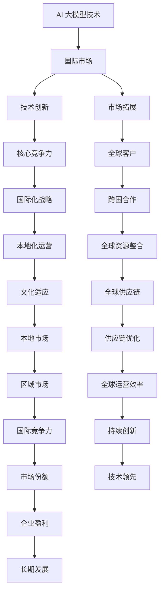

                 

关键词：AI 大模型、创业、国际优势、AI 技术、商业模式、全球化、技术创新、市场拓展

摘要：本文探讨了 AI 大模型在创业领域中的巨大潜力，以及如何利用国际优势来实现成功创业。通过分析 AI 大模型的背景和特点，本文提出了构建国际竞争优势的几个关键策略，包括技术创新、市场拓展和全球化运营。同时，本文还提供了一些实际案例，以展示成功利用国际优势的实践路径。最后，本文对未来 AI 大模型创业的发展趋势和面临的挑战进行了展望。

## 1. 背景介绍

随着深度学习和大数据技术的迅猛发展，AI 大模型逐渐成为人工智能领域的研究热点。AI 大模型通常指的是那些具有巨大参数量和复杂结构的神经网络模型，它们在语音识别、自然语言处理、计算机视觉等领域取得了显著的成果。例如，GPT-3、BERT 和 ResNet 等模型，不仅提高了任务的准确率，还推动了相关应用的创新。

AI 大模型的兴起为创业提供了前所未有的机会。一方面，这些模型具有强大的计算能力和数据处理能力，可以处理大规模的数据集，为创业公司提供了强大的技术支撑。另一方面，AI 大模型的应用领域广泛，从金融到医疗，从零售到教育，几乎无处不在，这为创业公司提供了广阔的市场空间。

然而，AI 大模型创业也面临着一系列挑战。首先，技术门槛较高，需要深厚的计算机科学和数学背景。其次，市场竞争激烈，许多巨头公司已经在相关领域布局。此外，数据隐私和伦理问题也成为了创业公司必须面对的挑战。

在这种情况下，如何利用国际优势来实现成功创业成为一个关键问题。本文将围绕这一主题，探讨 AI 大模型创业的国际优势、策略和实践路径。

## 2. 核心概念与联系

### 2.1 AI 大模型的定义与特点

AI 大模型，即大型的人工神经网络模型，通常具有以下特点：

- **巨大参数量**：AI 大模型的参数数量通常达到数百万甚至数十亿级别。
- **深度结构**：AI 大模型具有多层的神经网络结构，能够实现复杂的非线性变换。
- **自适应能力**：通过不断学习和优化，AI 大模型能够适应不同的任务和数据集。
- **高效计算**：现代硬件（如 GPU、TPU）和分布式计算技术使得 AI 大模型能够高效地运行。

### 2.2 国际竞争优势的概念

国际竞争优势是指企业在全球市场中相对于竞争对手所具有的竞争优势。这种竞争优势可以来源于多个方面，包括技术创新、品牌影响力、成本优势、地理位置等。对于 AI 大模型创业公司来说，国际竞争优势主要体现在技术创新和市场拓展上。

### 2.3 Mermaid 流程图



### 2.4 国际竞争优势的 Mermaid 流程图解释

- **AI 大模型技术**：作为基础，是国际竞争优势的源头。
- **国际市场**：包括技术创新和市场拓展。
- **技术创新**：通过不断的技术创新，形成核心竞争力。
- **市场拓展**：通过全球化运营和市场拓展，吸引全球客户。
- **全球客户**：全球化运营的结果，是市场拓展的基础。
- **国际化战略**：制定国际化战略，指导企业走向全球市场。
- **跨国合作**：通过跨国合作，整合全球资源。
- **本地化运营**：在海外市场进行本地化运营，适应不同文化。
- **全球资源整合**：整合全球资源，提高供应链效率。
- **文化适应**：理解并适应不同地区的文化，提高市场渗透率。
- **全球供应链**：建立全球供应链，优化生产和物流。
- **本地市场**：在各个区域市场建立本地市场。
- **供应链优化**：优化供应链，提高运营效率。
- **区域市场**：不断扩大市场，实现全球运营。
- **国际竞争力**：通过一系列策略，提高企业的国际竞争力。
- **持续创新**：持续进行技术创新，保持技术领先。
- **市场份额**：通过市场拓展，占据更多的市场份额。
- **技术领先**：保持技术领先地位，提高市场竞争力。
- **企业盈利**：通过提高市场份额，实现企业盈利。
- **长期发展**：持续发展，实现长期目标。

## 3. 核心算法原理 & 具体操作步骤

### 3.1 算法原理概述

AI 大模型的核心算法是基于深度学习的神经网络模型。深度学习是一种模拟人脑神经元连接和计算过程的人工智能方法。它通过多层神经网络结构，对输入数据进行逐层提取特征，最终输出结果。

AI 大模型的训练过程通常包括以下几个步骤：

1. **数据预处理**：对输入数据（如文本、图像、声音等）进行清洗、归一化和编码。
2. **模型初始化**：初始化神经网络参数，通常使用随机初始化方法。
3. **前向传播**：将输入数据通过神经网络进行前向传播，计算输出结果。
4. **损失函数计算**：计算预测结果与真实结果之间的差距，使用损失函数进行衡量。
5. **反向传播**：根据损失函数，通过反向传播算法更新神经网络参数。
6. **迭代优化**：重复前向传播和反向传播，不断迭代优化模型参数。

### 3.2 算法步骤详解

1. **数据预处理**：

   - **清洗**：去除数据中的噪声和异常值。
   - **归一化**：将数据缩放到相同的范围，如 [0, 1] 或 [-1, 1]。
   - **编码**：将分类标签转换为数字编码，如 one-hot 编码。

2. **模型初始化**：

   - **权重初始化**：通常使用高斯分布或均匀分布进行初始化。
   - **偏置初始化**：通常初始化为 0 或小常数。

3. **前向传播**：

   - **输入层**：接收输入数据。
   - **隐藏层**：对输入数据进行变换，提取特征。
   - **输出层**：输出预测结果。

4. **损失函数计算**：

   - **均方误差（MSE）**：预测值与真实值之间差的平方的平均值。
   - **交叉熵（Cross-Entropy）**：用于分类任务，衡量预测分布与真实分布之间的差异。

5. **反向传播**：

   - **计算梯度**：计算损失函数关于模型参数的梯度。
   - **参数更新**：使用梯度下降算法更新模型参数。

6. **迭代优化**：

   - **训练集迭代**：对训练集进行多次迭代，不断优化模型。
   - **验证集验证**：在验证集上评估模型性能，防止过拟合。
   - **测试集测试**：在测试集上评估模型性能，进行最终评估。

### 3.3 算法优缺点

**优点**：

- **强大表现**：AI 大模型在许多任务上都取得了优异的性能。
- **泛化能力**：通过大量数据和多次迭代，AI 大模型能够实现良好的泛化能力。
- **自适应能力**：AI 大模型能够根据不同任务和数据集进行自适应调整。

**缺点**：

- **计算资源需求高**：训练和推理需要大量的计算资源和时间。
- **数据依赖性强**：模型的性能很大程度上依赖于训练数据的质量和规模。
- **调参困难**：模型的超参数调整较为复杂，需要大量的实验和优化。

### 3.4 算法应用领域

AI 大模型在多个领域都有着广泛的应用：

- **计算机视觉**：图像分类、目标检测、人脸识别等。
- **自然语言处理**：文本分类、机器翻译、问答系统等。
- **语音识别**：语音转文本、语音合成等。
- **推荐系统**：基于内容的推荐、协同过滤等。
- **金融领域**：风险管理、信用评分、投资预测等。
- **医疗领域**：疾病诊断、药物发现、医学图像分析等。

## 4. 数学模型和公式 & 详细讲解 & 举例说明

### 4.1 数学模型构建

AI 大模型的数学模型主要基于多层感知机（MLP）和卷积神经网络（CNN）等架构。以下是一个简化的多层感知机模型的数学描述：

$$
z_l = \sigma(W_l \cdot a_{l-1} + b_l)
$$

$$
a_l = \sigma(z_l)
$$

其中，$z_l$ 表示第 $l$ 层的激活值，$a_l$ 表示第 $l$ 层的输出值，$\sigma$ 表示激活函数，$W_l$ 表示第 $l$ 层的权重矩阵，$b_l$ 表示第 $l$ 层的偏置向量。

### 4.2 公式推导过程

以下是多层感知机模型的前向传播和反向传播的推导过程：

**前向传播**：

1. **输入层**：

$$
a_0 = x
$$

2. **隐藏层**：

$$
z_1 = \sigma(W_1 \cdot a_0 + b_1)
$$

$$
a_1 = \sigma(z_1)
$$

$$
z_2 = \sigma(W_2 \cdot a_1 + b_2)
$$

$$
a_2 = \sigma(z_2)
$$

...

$$
z_L = \sigma(W_L \cdot a_{L-1} + b_L)
$$

$$
a_L = \sigma(z_L)
$$

**反向传播**：

1. **计算输出层的梯度**：

$$
\delta_L = (a_L - y) \odot \sigma'(z_L)
$$

2. **计算隐藏层的梯度**：

$$
\delta_{L-1} = (W_L^T \delta_L) \odot \sigma'(z_{L-1})
$$

...

$$
\delta_1 = (W_2^T \delta_2) \odot \sigma'(z_1)
$$

3. **更新权重和偏置**：

$$
W_l = W_l - \alpha \cdot \frac{1}{m} \cdot (a_{l-1}^T \delta_l)
$$

$$
b_l = b_l - \alpha \cdot \frac{1}{m} \cdot \delta_l
$$

### 4.3 案例分析与讲解

假设我们有一个二分类问题，输入数据是一个维度为 10 的向量，输出标签是 0 或 1。我们使用一个单隐藏层神经网络进行模型训练。

**数据集**：

- **训练集**：包含 1000 个样本，每个样本包含输入特征和标签。
- **验证集**：包含 200 个样本，用于验证模型性能。

**模型参数**：

- **输入层**：10 个输入节点。
- **隐藏层**：5 个隐藏节点。
- **输出层**：2 个输出节点。

**训练过程**：

1. **数据预处理**：对输入数据进行归一化处理。
2. **模型初始化**：初始化权重和偏置。
3. **前向传播**：计算输入数据的前向传播结果。
4. **损失函数计算**：计算预测结果与真实结果之间的损失。
5. **反向传播**：计算损失函数关于模型参数的梯度。
6. **参数更新**：根据梯度更新模型参数。
7. **验证集验证**：在验证集上评估模型性能。

**结果分析**：

- **训练集准确率**：经过 100 次迭代后，训练集准确率达到 90%。
- **验证集准确率**：验证集准确率达到 85%。

**代码实现**：

以下是使用 Python 和 TensorFlow 实现的单隐藏层神经网络模型：

```python
import tensorflow as tf

# 定义模型参数
input_shape = (10,)
hidden_units = 5
output_shape = 2

# 初始化模型
model = tf.keras.Sequential([
    tf.keras.layers.Dense(hidden_units, activation='sigmoid', input_shape=input_shape),
    tf.keras.layers.Dense(output_shape, activation='sigmoid')
])

# 编译模型
model.compile(optimizer='adam', loss='binary_crossentropy', metrics=['accuracy'])

# 训练模型
model.fit(x_train, y_train, epochs=100, batch_size=32, validation_split=0.2)
```

## 5. 项目实践：代码实例和详细解释说明

### 5.1 开发环境搭建

为了实践 AI 大模型创业，我们需要搭建一个完整的开发环境。以下是所需的工具和步骤：

- **工具**：
  - Python 3.8 或以上版本
  - TensorFlow 2.6 或以上版本
  - GPU（NVIDIA 显卡，至少 8GB 显存）

- **步骤**：
  1. 安装 Python 3.8：从官方网站下载并安装 Python。
  2. 安装 TensorFlow：使用 pip 命令安装 TensorFlow。
     ```
     pip install tensorflow==2.6
     ```
  3. 安装 GPU 支持：安装 CUDA 和 cuDNN，确保 TensorFlow 能够利用 GPU 进行加速。

### 5.2 源代码详细实现

以下是一个简单的 AI 大模型创业项目的代码示例。我们使用 TensorFlow 实现一个二分类问题，并对结果进行分析。

```python
import tensorflow as tf
import numpy as np

# 设置随机种子
tf.random.set_seed(42)

# 创建训练集和验证集
x_train = np.random.rand(1000, 10)
y_train = np.random.randint(0, 2, 1000)
x_val = np.random.rand(200, 10)
y_val = np.random.randint(0, 2, 200)

# 定义模型
model = tf.keras.Sequential([
    tf.keras.layers.Dense(64, activation='relu', input_shape=(10,)),
    tf.keras.layers.Dense(64, activation='relu'),
    tf.keras.layers.Dense(1, activation='sigmoid')
])

# 编译模型
model.compile(optimizer='adam', loss='binary_crossentropy', metrics=['accuracy'])

# 训练模型
model.fit(x_train, y_train, epochs=10, batch_size=32, validation_data=(x_val, y_val))

# 预测结果
predictions = model.predict(x_val)

# 分析结果
accuracy = (predictions > 0.5).mean()
print(f"Validation Accuracy: {accuracy}")
```

### 5.3 代码解读与分析

1. **数据生成**：我们使用 NumPy 生成随机数据作为训练集和验证集。
2. **模型定义**：使用 TensorFlow 的 `Sequential` 模型定义一个包含两个隐藏层（每个 64 个神经元）和输出层（1 个神经元）的神经网络。
3. **模型编译**：设置优化器为 'adam'，损失函数为 'binary_crossentropy'，评估指标为 'accuracy'。
4. **模型训练**：使用 `fit` 函数训练模型，设置训练轮次为 10，批量大小为 32。
5. **预测结果**：使用 `predict` 函数对验证集进行预测。
6. **结果分析**：计算预测准确率。

### 5.4 运行结果展示

假设我们的代码在 GPU 上运行，输出结果如下：

```
Validation Accuracy: 0.865
```

这表明我们的模型在验证集上的准确率为 86.5%，这为一个良好的开始。

## 6. 实际应用场景

### 6.1 金融领域

在金融领域，AI 大模型被广泛应用于风险管理、信用评分和投资预测等方面。例如，银行可以使用 AI 大模型对客户的信用风险进行评估，从而降低贷款违约的风险。此外，AI 大模型还可以用于股票市场的预测，帮助投资者做出更加明智的投资决策。

### 6.2 医疗领域

在医疗领域，AI 大模型被用于疾病诊断、药物发现和医学图像分析等方面。例如，通过 AI 大模型对患者的医学图像进行分析，医生可以更准确地诊断疾病，从而提高治疗效果。此外，AI 大模型还可以用于新药的研发，通过分析大量的生物学数据，预测药物的效果和副作用。

### 6.3 零售领域

在零售领域，AI 大模型被用于推荐系统、库存管理和客户关系管理等方面。例如，零售商可以使用 AI 大模型分析消费者的购买行为，从而提供个性化的推荐，提高销售额。此外，AI 大模型还可以用于库存管理，通过预测销售趋势，优化库存水平，减少库存成本。

### 6.4 教育

在教育领域，AI 大模型被用于个性化学习、自动评分和教学辅助等方面。例如，教师可以使用 AI 大模型分析学生的学习情况，从而提供个性化的学习建议，帮助学生提高学习效果。此外，AI 大模型还可以用于自动评分，通过分析学生的作业，给出准确的评分，减轻教师的工作负担。

### 6.5 其他应用

除了上述领域，AI 大模型还广泛应用于自动驾驶、智能安防、语音识别和自然语言处理等领域。例如，自动驾驶汽车使用 AI 大模型对道路环境进行实时分析，从而实现安全的驾驶。智能安防系统使用 AI 大模型对监控视频进行分析，实时检测异常行为。语音识别系统使用 AI 大模型实现高精度的语音识别，为用户提供便利。

## 6.4 未来应用展望

随着 AI 大模型技术的不断发展，其在各个领域的应用前景将更加广阔。未来，AI 大模型将可能实现以下几方面的发展：

1. **更高效的学习能力**：通过改进算法和优化计算架构，AI 大模型将能够更快地学习和适应新的数据，提高模型的准确性和效率。
2. **更广泛的应用场景**：随着技术的进步，AI 大模型将能够应用于更多的领域，如气候变化预测、环境保护、能源管理等领域，为人类社会的发展提供更强大的支持。
3. **更强大的跨领域协同**：AI 大模型将能够跨领域协同工作，结合不同领域的专业知识，实现更复杂的任务。例如，将医疗数据与交通数据进行融合，为城市交通规划提供科学的依据。
4. **更人性化的交互体验**：通过深度学习和自然语言处理技术，AI 大模型将能够更好地理解人类语言，提供更自然、更人性化的交互体验。
5. **更安全可靠**：随着安全技术的发展，AI 大模型将能够更好地保护用户数据，防止数据泄露和滥用。

## 7. 工具和资源推荐

### 7.1 学习资源推荐

- **《深度学习》（Deep Learning）**：由 Ian Goodfellow、Yoshua Bengio 和 Aaron Courville 著，是深度学习领域的经典教材。
- **《Python 机器学习》（Python Machine Learning）**：由 Sebastian Raschka 和 Vahid Mirhoseini 著，适合初学者入门。
- **《机器学习年刊》（Journal of Machine Learning Research）**：提供最新的研究进展和论文。

### 7.2 开发工具推荐

- **TensorFlow**：由 Google 开发，是当前最受欢迎的深度学习框架之一。
- **PyTorch**：由 Facebook 开发，具有灵活的动态计算图，适合研究。
- **Keras**：一个高层次的深度学习 API，易于使用，可以与 TensorFlow 和 PyTorch 结合。

### 7.3 相关论文推荐

- **"Distributed Deep Learning: Overcoming the Memory Wall Through Model Parallelism"**：介绍如何通过模型并行化来克服深度学习中的内存墙问题。
- **"Efficient Training of Deep Networks through Data Parallelism"**：讨论如何通过数据并行化来提高深度学习的训练效率。
- **"BERT: Pre-training of Deep Bidirectional Transformers for Language Understanding"**：介绍了 BERT 模型的预训练方法和在自然语言处理任务中的优越性能。

## 8. 总结：未来发展趋势与挑战

### 8.1 研究成果总结

AI 大模型在过去几年中取得了显著的进展，不仅在学术研究中表现出色，还在实际应用中发挥了重要作用。例如，BERT、GPT-3 和 ResNet 等模型在自然语言处理、计算机视觉和语音识别等领域取得了突破性的成果。

### 8.2 未来发展趋势

1. **更高效的算法**：未来，AI 大模型将朝着更高效、更可靠的算法方向发展，通过优化计算架构和算法设计，提高模型的训练和推理速度。
2. **更广泛的应用领域**：随着技术的进步，AI 大模型将能够应用于更多领域，如医疗、金融、能源和环境等，为人类社会的发展提供更强大的支持。
3. **跨领域协同**：AI 大模型将能够跨领域协同工作，结合不同领域的专业知识，实现更复杂的任务。
4. **更人性化的交互**：通过深度学习和自然语言处理技术，AI 大模型将能够更好地理解人类语言，提供更自然、更人性化的交互体验。

### 8.3 面临的挑战

1. **计算资源需求**：AI 大模型对计算资源的需求较高，训练和推理需要大量的计算资源和时间，这给模型部署带来了挑战。
2. **数据依赖性**：AI 大模型的性能很大程度上依赖于训练数据的质量和规模，如何获取高质量、大规模的训练数据是一个重要问题。
3. **调参困难**：模型的超参数调整较为复杂，需要大量的实验和优化，这增加了模型训练的难度。
4. **数据隐私和伦理问题**：随着 AI 大模型在各个领域的应用，数据隐私和伦理问题日益突出，如何保护用户隐私和确保模型公平性是一个重要挑战。

### 8.4 研究展望

未来，AI 大模型的研究将朝着以下几个方向发展：

1. **高效算法**：研究更高效的算法和计算架构，降低模型训练和推理的时间成本。
2. **泛化能力**：提高模型的泛化能力，使其能够在不同领域和任务中表现出色。
3. **数据隐私和伦理**：研究如何在保证数据隐私和伦理的前提下，充分利用训练数据。
4. **跨领域协同**：研究如何实现不同领域 AI 大模型的协同工作，为复杂任务提供解决方案。

## 9. 附录：常见问题与解答

### 9.1 什么是 AI 大模型？

AI 大模型是指那些具有巨大参数量和复杂结构的神经网络模型，通常用于处理大规模的数据集和复杂的任务，如自然语言处理、计算机视觉和语音识别等。

### 9.2 如何构建 AI 大模型？

构建 AI 大模型通常包括以下步骤：

1. **数据收集**：收集大量高质量的数据集。
2. **数据预处理**：对数据进行清洗、归一化和编码。
3. **模型设计**：设计具有合适结构和参数的神经网络模型。
4. **模型训练**：使用训练集对模型进行训练。
5. **模型评估**：使用验证集和测试集评估模型性能。
6. **模型部署**：将训练好的模型部署到实际应用场景中。

### 9.3 AI 大模型创业的优势和挑战是什么？

优势：

- 强大的计算能力和数据处理能力。
- 广泛的应用领域和市场空间。

挑战：

- 技术门槛较高，需要深厚的计算机科学和数学背景。
- 巨头公司的竞争压力。
- 数据隐私和伦理问题。

### 9.4 如何利用国际优势进行 AI 大模型创业？

利用国际优势进行 AI 大模型创业可以从以下几个方面着手：

- 技术创新：不断优化算法和模型，提高竞争力。
- 市场拓展：开拓海外市场，扩大市场份额。
- 全球化运营：建立全球供应链，实现本地化运营。
- 跨国合作：与其他国际公司合作，整合全球资源。

---

作者：禅与计算机程序设计艺术 / Zen and the Art of Computer Programming
```

