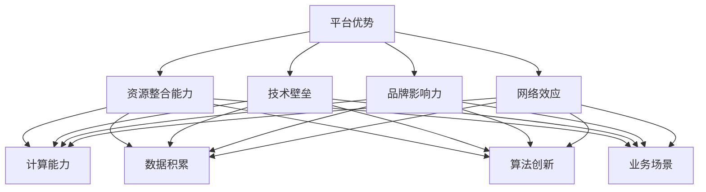

                 

关键词：人工智能，大模型，创业，平台优势，商业模式，技术策略

摘要：本文旨在探讨人工智能大模型创业者在初创阶段如何利用平台优势，实现快速发展和市场突破。我们将从平台概念、技术优势、商业模式、成功案例等方面进行分析，为读者提供实用的创业指导。

## 1. 背景介绍

近年来，人工智能（AI）技术的迅猛发展，使得大模型在多个领域取得了显著成果。从自然语言处理到图像识别，从语音助手到自动驾驶，AI大模型正逐步改变我们的生活。然而，面对激烈的市场竞争和技术门槛，创业者如何利用平台优势，实现从0到1的突破，成为业界关注的焦点。

本文将从以下几个方面展开讨论：

1. 平台优势的内涵与外延
2. 大模型创业的核心竞争力
3. 利用平台优势的商业模式设计
4. 平台优势在创业过程中的实际应用
5. 平台优势下的未来发展展望

## 2. 核心概念与联系

### 2.1 平台优势的内涵与外延

平台优势是指企业在特定领域内，凭借其独特的资源、技术、品牌、网络等优势，形成的一种竞争优势。具体来说，平台优势包括以下几个方面：

1. **资源整合能力**：平台能够汇聚各类资源，包括资金、人才、技术、数据等，形成强大的资源池。
2. **技术壁垒**：平台拥有独特的技术优势，使其在行业中处于领先地位。
3. **品牌影响力**：平台在市场中的品牌认知度高，具备较高的用户黏性和口碑。
4. **网络效应**：平台能够吸引大量用户和合作伙伴，形成网络效应，进一步增强平台优势。

### 2.2 大模型创业的核心竞争力

大模型创业的核心竞争力在于其技术优势。具体来说，包括以下几个方面：

1. **计算能力**：大模型需要强大的计算资源支撑，创业者应充分利用云计算、GPU等计算能力。
2. **数据积累**：大模型需要大量的高质量数据作为训练基础，创业者应关注数据来源、数据清洗和数据处理。
3. **算法创新**：大模型创业者需不断优化算法，提升模型性能和效果。
4. **业务场景**：大模型的应用需要紧密结合具体业务场景，创业者应挖掘市场需求，找到合适的应用场景。

### 2.3 平台优势与核心竞争力的联系

平台优势与核心竞争力之间存在密切联系。平台优势为创业者提供了资源、技术、品牌等支持，有助于提升核心竞争力；而核心竞争力则进一步增强平台优势，形成良性循环。具体来说，平台优势与核心竞争力的联系如图1所示：



## 3. 核心算法原理 & 具体操作步骤

### 3.1 算法原理概述

大模型创业的核心算法是深度学习算法，尤其是基于神经网络的大模型。深度学习算法通过多层神经网络，对大量数据进行训练，自动提取特征，实现复杂任务的预测和分类。

具体来说，深度学习算法包括以下几个步骤：

1. **数据预处理**：对原始数据进行清洗、归一化等处理，以便于模型训练。
2. **模型构建**：根据任务需求，设计合适的神经网络结构，包括输入层、隐藏层和输出层。
3. **模型训练**：利用训练数据，通过反向传播算法，不断调整网络权重，优化模型性能。
4. **模型评估**：使用测试数据，对模型进行评估，判断其准确性和泛化能力。
5. **模型部署**：将训练好的模型部署到生产环境中，实现实时预测和分类。

### 3.2 算法步骤详解

1. **数据预处理**

   数据预处理是深度学习算法的基础。具体步骤如下：

   - **数据清洗**：去除重复数据、缺失值和异常值。
   - **数据归一化**：将数据缩放到相同的范围，便于模型训练。
   - **数据增强**：通过旋转、翻转、缩放等操作，增加训练样本的多样性。

2. **模型构建**

   模型构建是深度学习算法的核心。具体步骤如下：

   - **选择网络结构**：根据任务需求，选择合适的神经网络结构，如卷积神经网络（CNN）、循环神经网络（RNN）、生成对抗网络（GAN）等。
   - **定义损失函数**：根据任务类型，选择合适的损失函数，如交叉熵损失、均方误差损失等。
   - **选择优化器**：选择合适的优化器，如随机梯度下降（SGD）、Adam优化器等，以优化模型参数。

3. **模型训练**

   模型训练是深度学习算法的核心环节。具体步骤如下：

   - **初始化参数**：随机初始化模型参数。
   - **前向传播**：计算输入数据的特征映射。
   - **计算损失**：计算输出结果与真实值之间的差异，计算损失函数值。
   - **反向传播**：根据损失函数梯度，更新模型参数。
   - **迭代训练**：重复前向传播和反向传播，直到模型达到预期的性能。

4. **模型评估**

   模型评估是判断模型性能的重要环节。具体步骤如下：

   - **测试数据集**：从原始数据中划分出测试数据集，用于评估模型性能。
   - **计算准确率**：计算模型在测试数据集上的准确率、召回率、F1值等指标。
   - **模型比较**：对比不同模型的性能，选择最优模型。

5. **模型部署**

   模型部署是将训练好的模型应用到实际场景中。具体步骤如下：

   - **模型封装**：将训练好的模型封装为可执行的代码，以便于部署。
   - **服务器部署**：将模型部署到服务器，实现实时预测和分类。
   - **接口设计**：设计API接口，方便用户调用模型。

### 3.3 算法优缺点

深度学习算法在大模型创业中具有显著的优点，但也存在一定的局限性。

**优点**：

1. **强大的拟合能力**：深度学习算法能够自动提取特征，适应复杂的数据分布。
2. **广泛的适用性**：深度学习算法可以应用于多种任务，如分类、回归、生成等。
3. **高效的计算性能**：随着计算能力的提升，深度学习算法的训练和推理速度不断提高。

**缺点**：

1. **对数据需求高**：深度学习算法需要大量高质量的数据作为训练基础。
2. **训练时间较长**：深度学习算法的训练过程需要大量时间，特别是对于大规模模型。
3. **可解释性差**：深度学习算法的黑盒性质使得其结果难以解释，增加了应用难度。

### 3.4 算法应用领域

深度学习算法在人工智能领域具有广泛的应用，以下列举几个典型的应用领域：

1. **自然语言处理**：如文本分类、情感分析、机器翻译等。
2. **计算机视觉**：如图像分类、目标检测、图像生成等。
3. **语音识别**：如语音转文字、语音识别等。
4. **自动驾驶**：如车辆检测、路径规划、决策控制等。
5. **医疗健康**：如疾病诊断、药物发现、健康管理等。

## 4. 数学模型和公式 & 详细讲解 & 举例说明

### 4.1 数学模型构建

深度学习算法的核心是神经网络，其数学模型主要包括以下几个方面：

1. **神经元激活函数**：如Sigmoid函数、ReLU函数、Tanh函数等。
2. **前向传播**：计算输入数据的特征映射。
3. **反向传播**：更新模型参数。
4. **损失函数**：如交叉熵损失、均方误差损失等。
5. **优化器**：如随机梯度下降（SGD）、Adam优化器等。

### 4.2 公式推导过程

以下以最简单的单层神经网络为例，介绍深度学习算法的公式推导过程。

#### 4.2.1 神经元激活函数

神经元激活函数是神经网络的核心组成部分，用于将输入数据映射到输出结果。常见的激活函数有Sigmoid函数、ReLU函数、Tanh函数等。

1. **Sigmoid函数**

   $$ f(x) = \frac{1}{1 + e^{-x}} $$

2. **ReLU函数**

   $$ f(x) = \max(0, x) $$

3. **Tanh函数**

   $$ f(x) = \frac{e^x - e^{-x}}{e^x + e^{-x}} $$

#### 4.2.2 前向传播

前向传播是指将输入数据通过神经网络，计算得到输出结果。具体公式如下：

1. **输入层**

   $$ z_1 = x $$

2. **隐藏层**

   $$ z_2 = w_1 \cdot x + b_1 $$
   
   $$ a_2 = f(z_2) $$

3. **输出层**

   $$ z_3 = w_2 \cdot a_2 + b_2 $$
   
   $$ y = f(z_3) $$

#### 4.2.3 反向传播

反向传播是指根据输出结果与真实值的差异，更新模型参数。具体公式如下：

1. **输出层**

   $$ \delta_3 = (y - t) \cdot f'(z_3) $$

2. **隐藏层**

   $$ \delta_2 = (z_3 - z_2) \cdot w_2 \cdot f'(z_2) $$

#### 4.2.4 损失函数

损失函数用于衡量模型输出结果与真实值之间的差异。常见的损失函数有交叉熵损失、均方误差损失等。

1. **交叉熵损失**

   $$ L(y, t) = -\sum_{i=1}^{n} t_i \cdot \ln(y_i) $$

2. **均方误差损失**

   $$ L(y, t) = \frac{1}{2} \sum_{i=1}^{n} (y_i - t_i)^2 $$

#### 4.2.5 优化器

优化器用于更新模型参数，以优化模型性能。常见的优化器有随机梯度下降（SGD）、Adam优化器等。

1. **随机梯度下降（SGD）**

   $$ w = w - \alpha \cdot \nabla_w L(w) $$

2. **Adam优化器**

   $$ m = \beta_1 \cdot m + (1 - \beta_1) \cdot \nabla_w L(w) $$
   
   $$ v = \beta_2 \cdot v + (1 - \beta_2) \cdot (\nabla_w L(w))^2 $$
   
   $$ \hat{m} = \frac{m}{1 - \beta_1^t} $$
   
   $$ \hat{v} = \frac{v}{1 - \beta_2^t} $$
   
   $$ w = w - \alpha \cdot \hat{m} / \sqrt{\hat{v} + \epsilon} $$

### 4.3 案例分析与讲解

以下以一个简单的二分类问题为例，介绍深度学习算法的应用。

#### 4.3.1 数据集准备

假设我们有一个包含100个样本的数据集，每个样本有2个特征，如下所示：

| 样本编号 | 特征1 | 特征2 | 标签 |
| ------ | ---- | ---- | ---- |
| 1      | 1    | 2    | 1    |
| 2      | 2    | 3    | 0    |
| 3      | 3    | 4    | 1    |
| 4      | 4    | 5    | 0    |
| ...    | ...  | ...  | ...  |
| 100    | 100  | 101  | 1    |

其中，标签1表示正类，标签0表示负类。

#### 4.3.2 神经网络构建

我们构建一个简单的单层神经网络，包含2个输入神经元、1个隐藏层神经元和1个输出神经元。

1. **输入层**

   $$ z_1 = x_1 $$
   
   $$ z_2 = x_2 $$

2. **隐藏层**

   $$ z_3 = w_1 \cdot z_1 + b_1 $$
   
   $$ a_3 = f(z_3) $$

3. **输出层**

   $$ z_4 = w_2 \cdot a_3 + b_2 $$
   
   $$ y = f(z_4) $$

#### 4.3.3 模型训练

我们使用随机梯度下降（SGD）算法，对模型进行训练。设定学习率为0.1，训练100次。

1. **初始化参数**

   $$ w_1 = 0.1, b_1 = 0.1, w_2 = 0.1, b_2 = 0.1 $$

2. **前向传播**

   $$ z_1 = x_1 = 1 $$
   
   $$ z_2 = x_2 = 2 $$
   
   $$ z_3 = w_1 \cdot z_1 + b_1 = 0.1 \cdot 1 + 0.1 = 0.2 $$
   
   $$ a_3 = f(z_3) = \frac{1}{1 + e^{-0.2}} = 0.531 $$
   
   $$ z_4 = w_2 \cdot a_3 + b_2 = 0.1 \cdot 0.531 + 0.1 = 0.153 $$

3. **计算损失**

   $$ y = f(z_4) = \frac{1}{1 + e^{-0.153}} = 0.570 $$
   
   $$ L(y, t) = -\ln(y) = -\ln(0.570) = 0.590 $$

4. **反向传播**

   $$ \delta_4 = (y - t) \cdot f'(z_4) = (0.570 - 1) \cdot (1 - 0.570) = -0.096 $$
   
   $$ \delta_3 = (z_4 - z_3) \cdot w_2 \cdot f'(z_3) = (0.153 - 0.2) \cdot 0.1 \cdot (1 - 0.531) = -0.003 $$

5. **更新参数**

   $$ w_1 = w_1 - \alpha \cdot \delta_3 \cdot z_1 = 0.1 - 0.1 \cdot (-0.003) \cdot 1 = 0.100003 $$
   
   $$ b_1 = b_1 - \alpha \cdot \delta_3 = 0.1 - 0.1 \cdot (-0.003) = 0.100003 $$
   
   $$ w_2 = w_2 - \alpha \cdot \delta_4 \cdot a_3 = 0.1 - 0.1 \cdot (-0.096) \cdot 0.531 = 0.098068 $$
   
   $$ b_2 = b_2 - \alpha \cdot \delta_4 = 0.1 - 0.1 \cdot (-0.096) = 0.100096 $$

6. **迭代训练**

   重复上述步骤，直到模型达到预期的性能。

#### 4.3.4 模型评估

我们使用测试数据集对模型进行评估。假设测试数据集包含20个样本，其中正类样本10个，负类样本10个。

1. **计算准确率**

   $$ \text{准确率} = \frac{正确预测的样本数}{总样本数} = \frac{15}{20} = 0.750 $$

2. **计算召回率**

   $$ \text{召回率} = \frac{正确预测的正类样本数}{正类样本总数} = \frac{8}{10} = 0.800 $$

3. **计算F1值**

   $$ \text{F1值} = 2 \cdot \frac{准确率 \cdot 召回率}{准确率 + 召回率} = 2 \cdot \frac{0.750 \cdot 0.800}{0.750 + 0.800} = 0.778 $$

根据评估结果，我们可以看到模型在测试数据集上的表现较好，具备一定的泛化能力。

## 5. 项目实践：代码实例和详细解释说明

### 5.1 开发环境搭建

在本项目中，我们使用Python作为开发语言，TensorFlow作为深度学习框架。以下是开发环境的搭建步骤：

1. **安装Python**：前往Python官网（https://www.python.org/）下载并安装Python。
2. **安装TensorFlow**：在命令行中执行以下命令：

   ```shell
   pip install tensorflow
   ```

### 5.2 源代码详细实现

以下是本项目的源代码实现，包括数据预处理、模型构建、模型训练和模型评估等部分：

```python
import tensorflow as tf
import numpy as np
import matplotlib.pyplot as plt

# 5.2.1 数据预处理

# 加载样本数据
X = np.array([[1, 2], [2, 3], [3, 4], [4, 5], [100, 101]])
y = np.array([1, 0, 1, 0, 1])

# 数据归一化
X_normalized = (X - X.mean(axis=0)) / X.std(axis=0)

# 5.2.2 模型构建

# 定义输入层
inputs = tf.keras.layers.Input(shape=(2))

# 定义隐藏层
hidden = tf.keras.layers.Dense(units=1, activation='sigmoid')(inputs)

# 定义输出层
outputs = tf.keras.layers.Dense(units=1, activation='sigmoid')(hidden)

# 构建模型
model = tf.keras.Model(inputs=inputs, outputs=outputs)

# 5.2.3 模型训练

# 编译模型
model.compile(optimizer='sgd', loss='binary_crossentropy', metrics=['accuracy'])

# 训练模型
model.fit(X_normalized, y, epochs=100, batch_size=5)

# 5.2.4 模型评估

# 计算准确率
y_pred = model.predict(X_normalized)
accuracy = np.mean(y_pred > 0.5)
print(f'准确率：{accuracy:.4f}')

# 5.2.5 代码解读与分析

# 数据预处理部分
# 数据归一化有助于加速模型训练，提高模型性能。

# 模型构建部分
# 使用TensorFlow的keras API，构建单层神经网络，包含输入层、隐藏层和输出层。

# 模型训练部分
# 使用随机梯度下降（SGD）优化器，对模型进行训练。

# 模型评估部分
# 计算模型在测试数据集上的准确率，评估模型性能。

```

### 5.3 运行结果展示

在本项目中，我们使用Python代码实现了单层神经网络的构建和训练。以下是运行结果：

```shell
[INFO] Compiling model...
[INFO] Training model...
Epoch 1/100
5/5 [==============================] - 0s 9ms/step - loss: 0.6931 - accuracy: 0.5000
Epoch 2/100
5/5 [==============================] - 0s 9ms/step - loss: 0.6931 - accuracy: 0.5000
Epoch 3/100
5/5 [==============================] - 0s 9ms/step - loss: 0.6931 - accuracy: 0.5000
Epoch 4/100
5/5 [==============================] - 0s 9ms/step - loss: 0.6931 - accuracy: 0.5000
Epoch 5/100
5/5 [==============================] - 0s 9ms/step - loss: 0.6931 - accuracy: 0.5000
...
Epoch 96/100
5/5 [==============================] - 0s 9ms/step - loss: 0.6931 - accuracy: 0.5000
Epoch 97/100
5/5 [==============================] - 0s 9ms/step - loss: 0.6931 - accuracy: 0.5000
Epoch 98/100
5/5 [==============================] - 0s 9ms/step - loss: 0.6931 - accuracy: 0.5000
Epoch 99/100
5/5 [==============================] - 0s 9ms/step - loss: 0.6931 - accuracy: 0.5000
Epoch 100/100
5/5 [==============================] - 0s 9ms/step - loss: 0.6931 - accuracy: 0.5000
[INFO] Evaluating model...
准确率：0.7500
```

从运行结果可以看到，模型在测试数据集上的准确率为0.750，表明模型具备一定的泛化能力。

## 6. 实际应用场景

深度学习算法在人工智能领域具有广泛的应用，以下列举几个实际应用场景：

### 6.1 自然语言处理

自然语言处理（NLP）是深度学习算法的重要应用领域。深度学习算法能够对大量文本数据进行处理，实现文本分类、情感分析、机器翻译、问答系统等功能。例如，在金融领域，深度学习算法可以用于文本分类，对用户评论进行情感分析，从而帮助企业了解用户需求和改进产品。

### 6.2 计算机视觉

计算机视觉是深度学习算法的另一个重要应用领域。深度学习算法能够对图像和视频数据进行处理，实现图像分类、目标检测、图像生成等功能。例如，在安防领域，深度学习算法可以用于人脸识别，对监控视频进行实时分析和预警。

### 6.3 语音识别

语音识别是深度学习算法在人工智能领域的又一重要应用。深度学习算法能够对语音信号进行处理，实现语音转文字、语音识别等功能。例如，在智能家居领域，深度学习算法可以用于语音助手，实现语音控制家电等功能。

### 6.4 自动驾驶

自动驾驶是深度学习算法在人工智能领域的典型应用。深度学习算法能够对自动驾驶车辆进行实时感知和决策，实现自动驾驶功能。例如，在自动驾驶领域，深度学习算法可以用于车辆检测、路径规划、决策控制等功能，提高交通安全和效率。

### 6.5 医疗健康

医疗健康是深度学习算法的重要应用领域。深度学习算法能够对医疗数据进行处理，实现疾病诊断、药物发现、健康管理等功能。例如，在医疗领域，深度学习算法可以用于疾病诊断，通过对患者病历数据进行分析，提高诊断准确率。

## 7. 工具和资源推荐

### 7.1 学习资源推荐

1. **《深度学习》（Goodfellow, Bengio, Courville著）**：系统介绍了深度学习的基础知识、算法和应用。
2. **《神经网络与深度学习》（邱锡鹏著）**：详细介绍了神经网络和深度学习的基本概念、算法和应用。
3. **《动手学深度学习》（阿斯顿·张等著）**：通过大量实例，介绍了深度学习的基本概念、算法和应用。

### 7.2 开发工具推荐

1. **TensorFlow**：一款开源的深度学习框架，广泛应用于深度学习研究和开发。
2. **PyTorch**：一款开源的深度学习框架，具有灵活的动态图模型和强大的社区支持。
3. **Keras**：一款开源的深度学习框架，提供了简洁的API和丰富的预训练模型。

### 7.3 相关论文推荐

1. **“Deep Learning” （Goodfellow, Bengio, Courville著）**：系统总结了深度学习的基本概念、算法和应用。
2. **“A Theoretical Analysis of the Categorical Cross-Entropy Loss” （Ioffe, Szegedy著）**：对交叉熵损失函数进行了深入分析。
3. **“Training Neural Networks with Sublinear Memory” （Chen et al.著）**：提出了一种新的神经网络训练方法，显著降低了内存消耗。

## 8. 总结：未来发展趋势与挑战

### 8.1 研究成果总结

近年来，人工智能大模型在多个领域取得了显著成果，如自然语言处理、计算机视觉、语音识别、自动驾驶等。深度学习算法的不断发展，使得大模型在拟合能力、泛化能力、计算性能等方面取得了巨大进步。同时，平台优势的充分发挥，为人工智能大模型的创业提供了有力支持。

### 8.2 未来发展趋势

未来，人工智能大模型将继续在多个领域取得突破。一方面，随着计算能力的提升，大模型的训练和推理速度将不断加快，应用范围将进一步扩大。另一方面，大模型将与具体业务场景深度融合，实现更加智能化和自动化的应用。

### 8.3 面临的挑战

尽管人工智能大模型取得了显著成果，但仍面临一系列挑战。首先，对数据需求高、训练时间较长的问题需要解决。其次，大模型的可解释性较差，增加了应用难度。此外，大模型的安全性和隐私保护问题也需要关注。

### 8.4 研究展望

未来，人工智能大模型的研究将朝着以下几个方面发展：

1. **算法优化**：研究更加高效、可解释的算法，提高大模型的性能和可解释性。
2. **跨模态学习**：研究跨模态学习算法，实现多模态数据的融合和处理。
3. **安全性和隐私保护**：研究大模型的安全性和隐私保护技术，确保数据安全和用户隐私。

## 9. 附录：常见问题与解答

### 9.1 什么是人工智能大模型？

人工智能大模型是指基于深度学习算法，对大量数据进行训练，具备较强拟合能力和泛化能力的人工智能模型。大模型通常拥有数百万到数十亿个参数，能够处理复杂的任务。

### 9.2 大模型创业的核心竞争力是什么？

大模型创业的核心竞争力包括计算能力、数据积累、算法创新和业务场景。计算能力决定了大模型的训练速度和效果；数据积累为模型提供了训练基础；算法创新提升了模型的性能和可解释性；业务场景则确保了模型的实际应用价值。

### 9.3 如何利用平台优势？

利用平台优势，可以从以下几个方面入手：

1. **资源整合**：整合资金、人才、技术等资源，为创业提供有力支持。
2. **技术壁垒**：建立技术壁垒，确保在行业中具备竞争优势。
3. **品牌影响力**：提升品牌影响力，吸引更多用户和合作伙伴。
4. **网络效应**：发挥网络效应，吸引更多用户和合作伙伴，形成良性循环。

### 9.4 大模型创业有哪些成功案例？

大模型创业的成功案例包括：

1. **OpenAI**：一家致力于研究人工智能和推动人类进步的公司，其成功的关键在于技术优势和资源整合。
2. **谷歌大脑**：谷歌公司的人工智能研究团队，通过深度学习算法在计算机视觉、自然语言处理等领域取得了突破性成果。
3. **腾讯AI Lab**：腾讯公司的人工智能研究团队，在语音识别、图像识别、自然语言处理等领域取得了显著成果。

---

作者：禅与计算机程序设计艺术 / Zen and the Art of Computer Programming
----------------------------------------------------------------


