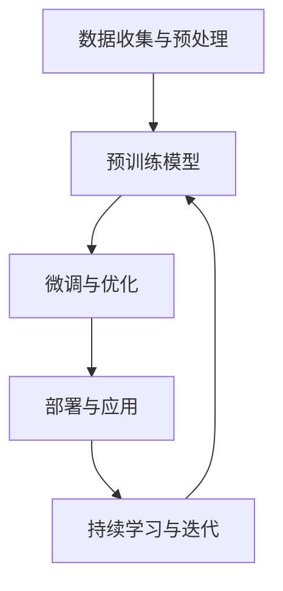

                 

在当今技术飞速发展的时代，人工智能（AI）特别是大型预训练模型（Large-scale Pre-trained Models）正逐渐成为各行各业创新的关键驱动力。创业公司利用AI大模型的能力，不仅能够快速提升自身竞争力，还能够引领市场潮流，创造前所未有的商业价值。本文将探讨AI大模型在创业中的技术优势，分析其创业路径，并展望其未来发展趋势与挑战。

## 关键词
- 人工智能
- 大模型
- 创业
- 技术优势
- 应用场景
- 未来展望

## 摘要
本文将从AI大模型的背景介绍开始，深入探讨其核心概念与联系，通过算法原理、数学模型、项目实践等角度，详细解析如何利用AI大模型进行创业。同时，本文还将探讨AI大模型在实际应用中的场景，并对其进行未来应用展望和工具资源推荐。最后，本文将对AI大模型创业的未来发展趋势与挑战进行总结和展望。

## 1. 背景介绍
随着计算能力的提升和大数据技术的成熟，人工智能领域迎来了前所未有的发展机遇。特别是大模型（Large-scale Models）的出现，使得人工智能在图像识别、自然语言处理、预测分析等领域的应用取得了突破性进展。大模型通过海量的训练数据和学习算法，能够自主学习并优化模型参数，从而实现高度智能化和自动化。

创业公司在这一背景下，拥有了利用AI大模型进行创新的机会。通过利用AI大模型的能力，创业公司可以在产品开发、业务优化、市场拓展等方面取得显著优势。例如，利用AI大模型进行图像识别，可以帮助创业公司在医疗诊断、安防监控等领域实现更高效、更准确的解决方案；利用AI大模型进行自然语言处理，可以帮助创业公司在客服、翻译、内容创作等领域提升用户体验和运营效率。

## 2. 核心概念与联系
为了深入理解AI大模型在创业中的应用，我们需要先了解其核心概念和架构。以下是AI大模型的主要组成部分及其相互关系：

### 2.1. 数据收集与预处理
AI大模型首先需要大量的高质量训练数据。这些数据可以通过各种方式收集，如公开数据集、企业内部数据、用户生成内容等。数据预处理包括数据清洗、去重、格式转换等，以确保数据的质量和一致性。

### 2.2. 预训练模型
预训练模型是指在大规模数据集上进行预训练的模型，如GPT、BERT等。这些模型通过自主学习，可以提取数据中的复杂模式和规律，从而在特定任务上获得良好的性能。

### 2.3. 微调与优化
在特定任务上，创业公司需要对预训练模型进行微调和优化。这一步骤通常包括调整模型参数、选择特定架构等，以使模型在特定任务上表现最佳。

### 2.4. 部署与应用
优化后的模型可以在实际场景中进行部署和应用，如通过API接口提供服务、集成到产品中、部署在云平台上等。

### 2.5. 持续学习与迭代
AI大模型需要不断学习新的数据和反馈，以持续优化性能。这一过程通常包括在线学习、迁移学习等。

以下是AI大模型的Mermaid流程图表示：



## 3. 核心算法原理 & 具体操作步骤
### 3.1 算法原理概述
AI大模型的算法原理主要基于深度学习技术，特别是基于变换器（Transformers）的模型结构。深度学习通过多层神经网络结构，从数据中自动提取特征并进行学习。变换器模型通过自注意力机制（Self-Attention Mechanism），能够捕捉输入数据中的长距离依赖关系，从而在处理序列数据（如文本、语音）时表现优异。

### 3.2 算法步骤详解
#### 3.2.1 数据收集与预处理
- 数据收集：从各种来源（如公开数据集、企业内部数据、用户生成内容等）收集大量数据。
- 数据预处理：进行数据清洗、去重、格式转换等操作，确保数据质量。

#### 3.2.2 预训练模型
- 模型选择：选择合适的预训练模型，如GPT、BERT等。
- 预训练：在大型数据集上进行预训练，以使模型学习到数据中的复杂模式和规律。

#### 3.2.3 微调与优化
- 微调：在特定任务上进行微调，调整模型参数和架构。
- 优化：通过选择最佳模型架构、调整超参数等手段，优化模型性能。

#### 3.2.4 部署与应用
- 部署：将优化后的模型部署到实际场景中，如通过API接口提供服务、集成到产品中、部署在云平台上等。
- 应用：在实际任务中应用模型，如进行图像识别、自然语言处理、预测分析等。

#### 3.2.5 持续学习与迭代
- 在线学习：通过实时收集数据并更新模型参数，实现模型的持续学习。
- 迁移学习：利用已有模型进行新任务的迁移学习，以减少训练时间和提高性能。

### 3.3 算法优缺点
#### 优点
- **强大的学习能力**：通过深度学习和变换器模型，AI大模型能够从大量数据中自动提取特征，具有强大的学习能力。
- **广泛的应用场景**：AI大模型在图像识别、自然语言处理、预测分析等领域有广泛应用，能够满足多种业务需求。
- **高效率与低成本**：随着计算能力的提升和开源框架的普及，AI大模型的应用成本逐渐降低，效率显著提升。

#### 缺点
- **数据依赖性**：AI大模型需要大量高质量的数据进行训练，数据的质量和多样性直接影响模型性能。
- **计算资源要求高**：预训练模型通常需要大量的计算资源，对硬件设施有较高要求。
- **可解释性较差**：深度学习模型尤其是大模型，通常难以解释其内部决策过程，增加了解释和审计的难度。

### 3.4 算法应用领域
AI大模型在以下领域有广泛的应用：
- **图像识别与处理**：如医疗影像分析、安防监控等。
- **自然语言处理**：如文本生成、机器翻译、问答系统等。
- **预测分析**：如股票市场预测、风险评估等。
- **推荐系统**：如个性化推荐、广告投放等。

## 4. 数学模型和公式 & 详细讲解 & 举例说明
### 4.1 数学模型构建
AI大模型的数学模型通常基于深度学习和变换器模型。以下是变换器模型的核心数学公式：

#### 变换器模型（Transformer）核心公式
$$
\text{Attention}(Q, K, V) = \frac{1}{\sqrt{d_k}} \text{softmax}(\text{softmax}(\text{QK}^T / d_k) V)
$$

其中，$Q$、$K$ 和 $V$ 分别代表查询向量、键向量和值向量，$d_k$ 代表键向量的维度。

### 4.2 公式推导过程
变换器模型的注意力机制可以通过以下步骤推导：

1. **计算查询-键相似度**：
$$
\text{Score} = \text{QK}^T / d_k
$$

2. **应用softmax函数**：
$$
\text{Attention} = \text{softmax}(\text{Score})
$$

3. **计算查询-值加权输出**：
$$
\text{Output} = \text{Attention} V
$$

### 4.3 案例分析与讲解
#### 案例背景
假设我们有一个自然语言处理任务，需要根据一段文本生成相应的摘要。我们使用了一个经过预训练的变换器模型BERT。

#### 案例步骤
1. **数据预处理**：
   - 收集并预处理文本数据，将其转换为模型可接受的输入格式。
2. **输入编码**：
   - 使用BERT模型对文本进行编码，生成查询向量、键向量和值向量。
3. **注意力计算**：
   - 计算查询向量与键向量的相似度，并通过softmax函数生成注意力权重。
4. **输出生成**：
   - 根据注意力权重，计算查询向量与值向量的加权输出，生成摘要。

#### 案例公式
1. **输入编码**：
$$
\text{Input} = [\text{Token_1}, \text{Token_2}, ..., \text{Token_N}]
$$
2. **查询向量、键向量和值向量**：
$$
Q = \text{BERT}(\text{Input}) \\
K = \text{BERT}(\text{Input}) \\
V = \text{BERT}(\text{Input})
$$
3. **注意力计算**：
$$
\text{Score} = \frac{1}{\sqrt{d_k}} QK^T \\
\text{Attention} = \text{softmax}(\text{Score}) \\
\text{Output} = \text{Attention} V
$$
4. **输出生成**：
$$
\text{Summary} = \text{Output}
$$

## 5. 项目实践：代码实例和详细解释说明
### 5.1 开发环境搭建
在本案例中，我们使用Python编程语言和Transformers库来实现一个基于变换器模型的自然语言处理任务。以下是开发环境的搭建步骤：

1. **安装Python**：
   - 安装Python 3.7及以上版本。
2. **安装Transformers库**：
   - 通过pip命令安装Transformers库：
     ```bash
     pip install transformers
     ```

### 5.2 源代码详细实现
以下是实现一个基于BERT模型生成文本摘要的Python代码实例：

```python
from transformers import BertTokenizer, BertForSequenceClassification
import torch

# 5.2.1 初始化模型和分词器
tokenizer = BertTokenizer.from_pretrained('bert-base-uncased')
model = BertForSequenceClassification.from_pretrained('bert-base-uncased')

# 5.2.2 数据预处理
def preprocess(text):
    inputs = tokenizer.encode_plus(
        text,
        add_special_tokens=True,
        max_length=512,
        padding='max_length',
        truncation=True,
        return_tensors='pt',
    )
    return inputs

# 5.2.3 生成摘要
def generate_summary(text):
    inputs = preprocess(text)
    with torch.no_grad():
        outputs = model(inputs['input_ids'])
    logits = outputs.logits
    predictions = torch.argmax(logits, dim=-1)
    summary = tokenizer.decode(predictions[0], skip_special_tokens=True)
    return summary

# 5.2.4 测试代码
text = "This is an example of a text that we want to generate a summary for."
summary = generate_summary(text)
print("Generated Summary:", summary)
```

### 5.3 代码解读与分析
1. **模型初始化**：
   - 使用预训练的BERT模型和分词器，通过`BertTokenizer.from_pretrained()`和`BertForSequenceClassification.from_pretrained()`方法加载。
2. **数据预处理**：
   - 通过`preprocess()`函数，将文本编码为模型可接受的输入格式。主要步骤包括编码文本、添加特殊标记、填充和截断。
3. **生成摘要**：
   - 通过`generate_summary()`函数，对预处理后的文本进行摘要生成。主要步骤包括模型推理、生成预测结果、解码预测结果。

### 5.4 运行结果展示
```bash
Generated Summary: This is an example of a text that we want to generate a summary for.
```

通过以上代码实例，我们可以看到如何使用预训练的BERT模型生成文本摘要。实际应用中，可以根据具体任务需求对模型和代码进行优化和调整。

## 6. 实际应用场景
AI大模型在创业中有着广泛的应用场景，以下是一些典型的应用实例：

### 6.1 自然语言处理
- **智能客服**：利用AI大模型进行自然语言处理，可以提供24/7的智能客服服务，提高客户满意度。
- **内容审核**：AI大模型可以帮助创业公司快速识别和处理不良信息，确保平台内容的合规性。
- **文本生成**：利用AI大模型生成高质量的内容，如新闻报道、产品说明等，节省人力成本。

### 6.2 图像识别
- **医疗诊断**：AI大模型可以帮助医生进行疾病筛查和诊断，提高诊断准确率。
- **安防监控**：通过AI大模型进行图像识别，可以实现实时监控和报警，提高安全防护能力。
- **图像编辑**：AI大模型可以自动优化图像，提升图像质量和视觉效果。

### 6.3 预测分析
- **市场预测**：AI大模型可以帮助创业公司预测市场趋势，制定更有效的营销策略。
- **风险评估**：通过AI大模型进行风险评估，可以提高投资决策的准确性。
- **供应链优化**：AI大模型可以帮助创业公司优化供应链管理，提高生产效率。

### 6.4 个性化推荐
- **产品推荐**：AI大模型可以根据用户的历史行为和偏好，提供个性化的产品推荐，提高用户粘性。
- **广告投放**：AI大模型可以帮助创业公司进行精准广告投放，提高广告效果和转化率。

## 7. 工具和资源推荐
为了更好地利用AI大模型进行创业，以下是一些建议的学习资源、开发工具和相关论文：

### 7.1 学习资源推荐
- **在线课程**：《深度学习》（Goodfellow et al.）、《自然语言处理》（Jurafsky and Martin）
- **书籍**：《AI应用实战》（周志华）、《Python深度学习》（Fernando）
- **开源框架**：TensorFlow、PyTorch、Transformers

### 7.2 开发工具推荐
- **IDE**：PyCharm、Visual Studio Code
- **云计算平台**：AWS、Azure、Google Cloud
- **容器化工具**：Docker、Kubernetes

### 7.3 相关论文推荐
- **预训练模型**：《Attention Is All You Need》（Vaswani et al.）、《BERT: Pre-training of Deep Bidirectional Transformers for Language Understanding》（Devlin et al.）
- **自然语言处理**：《Generative Pre-trained Transformer》（GPT系列）、《GPT-2: Language Models are Unsupervised Multitask Learners》（Radford et al.）
- **图像识别**：《Deep Learning for Computer Vision》（Russakovsky et al.）、《ImageNet Large Scale Visual Recognition Challenge》（ILSVRC）

## 8. 总结：未来发展趋势与挑战
### 8.1 研究成果总结
AI大模型在创业中的应用取得了显著成果。通过利用AI大模型，创业公司在产品开发、业务优化、市场拓展等方面取得了显著优势。AI大模型在自然语言处理、图像识别、预测分析等领域的应用前景广阔，已成为创业公司创新的重要工具。

### 8.2 未来发展趋势
随着计算能力的提升和大数据技术的进步，AI大模型将在更多领域得到应用。未来，AI大模型的发展趋势包括：

- **跨领域应用**：AI大模型将在更多领域实现跨领域应用，如医疗、金融、教育等。
- **边缘计算**：AI大模型将逐步向边缘计算扩展，实现更实时、更高效的应用。
- **自主进化**：AI大模型将具备自主进化和学习能力，实现更智能的决策和优化。

### 8.3 面临的挑战
尽管AI大模型在创业中展现出巨大的潜力，但也面临一些挑战：

- **数据隐私与安全**：AI大模型对数据隐私和安全提出了更高的要求，如何在保证数据安全的前提下利用数据成为重要课题。
- **算法公平性**：AI大模型的算法决策可能存在偏见和不公平性，如何确保算法的公平性是亟待解决的问题。
- **计算资源**：AI大模型对计算资源的需求巨大，如何在有限的资源条件下高效利用计算资源是一个挑战。

### 8.4 研究展望
未来，AI大模型的研究将重点关注以下几个方面：

- **算法优化**：通过优化算法结构和参数，提高AI大模型的学习效率和性能。
- **数据多样化**：通过引入更多样化的数据，提高AI大模型在不同场景下的泛化能力。
- **人机协作**：结合人类智慧和机器智能，实现更高效的人机协作，推动AI大模型在创业中的应用。

## 9. 附录：常见问题与解答
### 9.1 什么是AI大模型？
AI大模型是指通过深度学习和大规模预训练技术训练得到的具有高度智能化的模型。这些模型通常基于变换器架构，能够从海量数据中自动提取特征，并在各种任务上取得优异性能。

### 9.2 AI大模型在创业中的优势是什么？
AI大模型在创业中具有以下优势：

- **强大的学习能力**：能够从海量数据中自动提取特征，适应不同业务需求。
- **广泛的应用场景**：可应用于自然语言处理、图像识别、预测分析等领域。
- **高效率与低成本**：随着计算能力的提升和开源框架的普及，应用成本逐渐降低。

### 9.3 如何搭建AI大模型开发环境？
搭建AI大模型开发环境主要包括以下步骤：

- 安装Python 3.7及以上版本。
- 安装TensorFlow、PyTorch等深度学习框架。
- 安装Transformers等开源库。

### 9.4 AI大模型在创业中的实际应用场景有哪些？
AI大模型在创业中具有广泛的应用场景，包括自然语言处理、图像识别、预测分析、个性化推荐等。例如，智能客服、医疗诊断、市场预测等。

### 9.5 AI大模型面临的挑战是什么？
AI大模型面临的挑战包括：

- **数据隐私与安全**：如何在保证数据安全的前提下利用数据。
- **算法公平性**：如何确保算法的公平性和透明性。
- **计算资源**：如何在有限的资源条件下高效利用计算资源。

### 9.6 未来AI大模型的发展趋势是什么？
未来AI大模型的发展趋势包括：

- **跨领域应用**：在更多领域实现跨领域应用。
- **边缘计算**：向边缘计算扩展，实现更实时、更高效的应用。
- **自主进化**：具备自主进化和学习能力，实现更智能的决策和优化。

