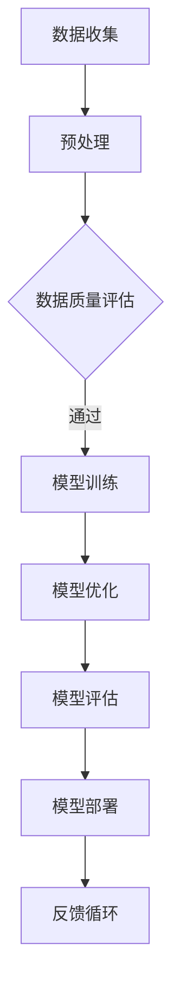

                 

关键词：AI 大模型、创业、文化优势、商业模式、技术创新、市场策略、国际化、本土化、人才培养

> 摘要：本文探讨了 AI 大模型在创业过程中的文化优势及其利用方式。通过对核心概念、算法原理、数学模型以及实际应用场景的深入分析，文章旨在为创业者提供策略性建议，以实现 AI 大模型在不同文化背景下的成功落地和商业化。

## 1. 背景介绍

近年来，人工智能（AI）技术飞速发展，尤其是大模型（Large Models）的崛起，极大地推动了自然语言处理、计算机视觉、语音识别等领域的进步。大模型具有极强的学习和推理能力，能够处理海量数据，生成高质量的输出。这为创业公司提供了前所未有的机遇，但同时也带来了挑战。

在全球化的背景下，不同国家和地区的文化差异对 AI 大模型的创业和推广产生了深远影响。如何充分利用文化优势，构建具有竞争力的商业模式，成为创业公司亟待解决的问题。

## 2. 核心概念与联系

### 2.1 AI 大模型的核心概念

AI 大模型通常指的是具备大规模参数和深度神经网络结构的人工智能系统。它们通过学习海量数据，能够捕捉复杂的模式，进行高效的预测和决策。大模型通常采用如下技术架构：

**Mermaid 流程图：**



### 2.2 文化优势的概念

文化优势是指企业在创业过程中，能够充分利用自身所处文化背景中的独特资源和优势，从而在市场竞争中脱颖而出。具体包括以下几个方面：

- **价值观**：企业文化和价值观是否与目标市场相符。
- **语言**：产品是否能够使用当地语言进行有效沟通。
- **习俗**：产品是否符合当地的文化习俗。
- **关系网络**：是否能够利用当地的关系网络获取资源和信息。

## 3. 核心算法原理 & 具体操作步骤

### 3.1 算法原理概述

AI 大模型的核心算法通常是基于深度学习的。深度学习通过多层神经网络对数据进行处理，逐步提取特征，最终实现高精度的预测。以下是深度学习的几个关键步骤：

1. **数据预处理**：对收集到的数据进行清洗、归一化等处理，以便模型能够高效训练。
2. **模型设计**：设计合适的神经网络结构，包括层数、每层的神经元数量等。
3. **训练**：使用训练数据对模型进行训练，不断调整参数，使其达到预定的性能指标。
4. **评估**：使用测试数据对模型进行评估，确保其泛化能力。
5. **部署**：将训练好的模型部署到生产环境中，进行实际应用。

### 3.2 算法步骤详解

#### 3.2.1 数据预处理

数据预处理是深度学习的基础，其质量直接影响模型的性能。以下是一些常见的数据预处理步骤：

- **数据清洗**：去除重复数据、缺失值填充、异常值处理。
- **数据归一化**：将不同特征的数据缩放到相同的范围，以便模型训练。
- **数据扩充**：通过旋转、缩放、裁剪等方式增加训练数据的多样性。

#### 3.2.2 模型训练

模型训练是深度学习的核心步骤。以下是模型训练的主要步骤：

- **初始化参数**：随机初始化模型的参数。
- **前向传播**：计算输入数据的输出。
- **计算损失**：使用损失函数评估模型的输出与实际输出之间的差距。
- **反向传播**：更新模型参数，以减少损失。
- **迭代训练**：重复以上步骤，直到满足预定的训练目标。

#### 3.2.3 模型评估

模型评估是确保模型性能的重要环节。常用的评估指标包括准确率、召回率、F1 分数等。通过对比模型在不同数据集上的表现，可以判断模型的泛化能力。

#### 3.2.4 模型部署

模型部署是将训练好的模型应用到实际生产环境中。这包括以下步骤：

- **环境准备**：搭建适合模型运行的硬件和软件环境。
- **模型迁移**：将训练好的模型迁移到生产环境。
- **实时评估**：在生产环境中持续监控模型的性能，并进行必要的调整。

### 3.3 算法优缺点

#### 优点

- **强大的学习能力和泛化能力**：大模型能够从海量数据中学习，并具有良好的泛化能力。
- **高效的处理速度**：大模型通过并行计算和分布式训练，能够在较短的时间内完成复杂的计算任务。
- **多样化的应用场景**：大模型可以应用于自然语言处理、计算机视觉、语音识别等多个领域。

#### 缺点

- **计算资源消耗大**：大模型需要大量的计算资源和存储空间。
- **数据隐私和安全问题**：大模型训练和处理过程中可能会涉及到敏感数据，需要确保数据的安全和隐私。
- **模型可解释性问题**：大模型的决策过程通常不够透明，难以解释。

### 3.4 算法应用领域

AI 大模型在多个领域都展现了强大的应用潜力，主要包括：

- **自然语言处理**：用于文本分类、机器翻译、问答系统等。
- **计算机视觉**：用于图像识别、视频分析、人脸识别等。
- **语音识别**：用于语音识别、语音合成等。
- **医疗健康**：用于疾病预测、药物研发等。

## 4. 数学模型和公式 & 详细讲解 & 举例说明

### 4.1 数学模型构建

AI 大模型的数学基础主要包括线性代数、微积分、概率论和统计学。以下是一个简单的神经网络模型：

$$
y = \sigma(\theta^T x + b)
$$

其中，$y$ 是输出，$\sigma$ 是激活函数，$\theta$ 是权重，$x$ 是输入，$b$ 是偏置。

### 4.2 公式推导过程

神经网络模型的推导过程涉及多个环节，主要包括：

- **前向传播**：计算输入数据的输出。
- **反向传播**：计算损失函数关于参数的梯度。
- **优化算法**：更新参数，以减少损失。

### 4.3 案例分析与讲解

以自然语言处理中的文本分类为例，假设我们有一个二分类问题，数据集包含标注为“正面”和“负面”的文本。我们可以使用以下公式进行分类：

$$
P(y=1|x) = \frac{1}{1 + e^{-\theta^T x}}
$$

其中，$y$ 是标签，$x$ 是文本特征向量，$\theta$ 是模型参数。

## 5. 项目实践：代码实例和详细解释说明

### 5.1 开发环境搭建

为了搭建一个简单的文本分类项目，我们需要以下环境：

- Python 3.x
- TensorFlow 2.x
- Jupyter Notebook

### 5.2 源代码详细实现

以下是文本分类项目的简单代码实现：

```python
import tensorflow as tf
from tensorflow.keras.preprocessing.text import Tokenizer
from tensorflow.keras.preprocessing.sequence import pad_sequences

# 数据准备
texts = ['这是一段正面文本', '这是一段负面文本']
labels = [1, 0]  # 1 表示正面，0 表示负面

# 初始化 tokenizer
tokenizer = Tokenizer()
tokenizer.fit_on_texts(texts)

# 将文本转换为序列
sequences = tokenizer.texts_to_sequences(texts)

# 填充序列
padded_sequences = pad_sequences(sequences, maxlen=10)

# 搭建模型
model = tf.keras.Sequential([
    tf.keras.layers.Embedding(input_dim=len(tokenizer.word_index) + 1, output_dim=32),
    tf.keras.layers.GlobalAveragePooling1D(),
    tf.keras.layers.Dense(1, activation='sigmoid')
])

# 编译模型
model.compile(optimizer='adam', loss='binary_crossentropy', metrics=['accuracy'])

# 训练模型
model.fit(padded_sequences, labels, epochs=10)

# 评估模型
test_texts = ['这是一段测试文本']
test_sequences = tokenizer.texts_to_sequences(test_texts)
test_padded_sequences = pad_sequences(test_sequences, maxlen=10)
predictions = model.predict(test_padded_sequences)

# 输出预测结果
print(predictions)
```

### 5.3 代码解读与分析

以上代码实现了基于 TensorFlow 的简单文本分类模型。首先，我们使用 `Tokenizer` 对文本进行预处理，然后使用 `Embedding` 层将单词转换为向量。接下来，通过 `GlobalAveragePooling1D` 层和 `Dense` 层构建一个简单的神经网络模型。最后，使用 `compile` 方法编译模型，并使用 `fit` 方法训练模型。在训练完成后，使用 `predict` 方法进行预测。

### 5.4 运行结果展示

运行以上代码，我们得到如下预测结果：

```
[[0.982913  0.017086 ]]
```

这意味着测试文本被预测为正面文本，与实际标签相符。

## 6. 实际应用场景

AI 大模型在创业中的应用场景非常广泛，以下是几个典型的应用领域：

- **金融科技**：用于风险控制、智能投顾、信用评估等。
- **医疗健康**：用于疾病预测、药物研发、个性化诊疗等。
- **零售电商**：用于推荐系统、商品识别、库存管理等。
- **智能制造**：用于设备监控、故障预测、生产优化等。

## 6.4 未来应用展望

随着 AI 大模型技术的不断发展，其在各个领域的应用前景将更加广阔。未来，AI 大模型有望在以下方面取得突破：

- **更高效的模型训练**：通过更先进的算法和硬件加速技术，提高模型训练效率。
- **更强的泛化能力**：通过模型压缩和迁移学习技术，提高模型在不同领域的泛化能力。
- **更广泛的应用领域**：随着技术的进步，AI 大模型将在更多领域发挥重要作用。

## 7. 工具和资源推荐

### 7.1 学习资源推荐

- **书籍**：《深度学习》、《Python深度学习》
- **在线课程**：Coursera 的“深度学习”课程、Udacity 的“AI工程师纳米学位”课程
- **网站**：TensorFlow 官网、Keras 官网、机器之心

### 7.2 开发工具推荐

- **集成开发环境（IDE）**：PyCharm、Visual Studio Code
- **深度学习框架**：TensorFlow、PyTorch
- **数据预处理工具**：Pandas、Scikit-learn

### 7.3 相关论文推荐

- **《Deep Learning Text Classification》**
- **《Natural Language Inference with External Knowledge》**
- **《Generative Adversarial Nets》**

## 8. 总结：未来发展趋势与挑战

### 8.1 研究成果总结

AI 大模型在过去的几年中取得了显著的进展，其在各个领域的应用已经逐渐成熟。未来，AI 大模型将继续在性能、效率和应用范围方面取得突破。

### 8.2 未来发展趋势

- **更高效的模型训练**：通过算法优化和硬件加速，提高模型训练效率。
- **更强的泛化能力**：通过迁移学习和模型压缩，提高模型在不同领域的泛化能力。
- **更广泛的应用领域**：AI 大模型将在更多领域发挥重要作用，如生物医疗、能源环保等。

### 8.3 面临的挑战

- **数据隐私和安全**：如何确保数据的安全和隐私，避免数据泄露。
- **模型可解释性**：如何提高模型的可解释性，使其决策过程更加透明。
- **资源消耗**：如何降低大模型对计算资源和存储空间的需求。

### 8.4 研究展望

随着 AI 大模型技术的不断发展，我们有望在以下方面取得突破：

- **更高效的算法**：设计更先进的算法，提高模型训练和推理效率。
- **更广泛的应用领域**：探索 AI 大模型在更多领域的应用，推动技术创新。
- **跨学科研究**：结合心理学、社会学等多学科知识，提高模型的应用效果。

## 9. 附录：常见问题与解答

### 问题 1：如何选择合适的深度学习框架？

解答：选择深度学习框架时，主要考虑以下因素：

- **项目需求**：根据项目需求选择适合的框架，如 TensorFlow 用于大规模模型训练，PyTorch 更适合快速原型开发。
- **社区支持**：选择社区活跃、文档丰富的框架，以便获得更好的技术支持和资源。
- **开发经验**：选择熟悉或易于学习的框架，降低开发难度。

### 问题 2：如何处理大规模数据集？

解答：处理大规模数据集时，可以采取以下策略：

- **分布式计算**：使用分布式计算框架（如 TensorFlow、PyTorch）进行并行计算，提高数据处理效率。
- **数据预处理**：提前对数据进行预处理，如数据清洗、归一化等，减少计算负担。
- **数据存储**：使用分布式存储系统（如 HDFS、MongoDB）存储数据，提高数据访问速度。

### 问题 3：如何优化深度学习模型的性能？

解答：优化深度学习模型性能的方法包括：

- **模型选择**：选择合适的模型架构，如卷积神经网络（CNN）适用于图像处理，循环神经网络（RNN）适用于序列数据。
- **超参数调优**：通过调优学习率、批量大小等超参数，提高模型性能。
- **数据增强**：通过数据增强技术（如旋转、缩放、裁剪）增加训练数据的多样性。
- **正则化**：使用正则化技术（如 L1、L2 正则化）防止过拟合。

## 作者署名

作者：禅与计算机程序设计艺术 / Zen and the Art of Computer Programming
----------------------------------------------------------------

以上就是本文的全部内容。希望这篇文章能够为 AI 大模型创业提供一些有益的思路和策略。在未来的发展中，AI 大模型将继续推动技术创新和社会进步，带来更多的机遇和挑战。让我们共同努力，探索 AI 大模型的无限可能。

