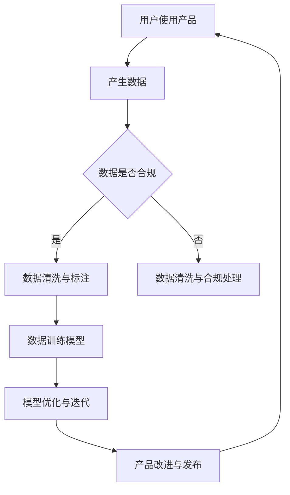

                 

 在当前的科技浪潮中，人工智能（AI）无疑是最耀眼的明星之一。随着大模型技术的迅猛发展，AI 在各个领域展现出了巨大的潜力，无论是自动驾驶、自然语言处理，还是医疗诊断，都取得了令人瞩目的成果。大模型创业成为了科技界的热门话题，但如何有效地利用用户优势，实现可持续的发展，是每一个创业者都必须思考的问题。

## 1. 背景介绍

人工智能大模型，如 GPT-3、BERT、BERT-Large 等，其核心在于通过深度学习算法从海量数据中学习，从而具备强大的知识理解和生成能力。这些模型的出现，打破了传统 AI 的发展瓶颈，为 AI 领域带来了全新的机遇。然而，大模型的发展并非一帆风顺，如何在数据获取、模型训练、应用推广等方面发挥用户优势，成为了决定创业成败的关键。

## 2. 核心概念与联系

### 2.1. 用户优势的定义

用户优势，指的是用户在使用某一产品或服务时所具备的独特价值和潜力。在大模型创业中，用户优势主要体现在以下几个方面：

1. **数据贡献**：用户在使用过程中产生的数据，是训练和优化大模型的重要资源。
2. **需求反馈**：用户的反馈可以指导产品改进，提升用户体验。
3. **社区建设**：用户积极参与社区活动，可以增强产品黏性，扩大用户基础。

### 2.2. 用户优势与 AI 大模型的关系

大模型的发展离不开用户数据的支持。用户数据的多样性和丰富性，可以显著提升模型的性能和泛化能力。同时，用户的反馈和行为数据，可以为模型优化提供方向，实现持续迭代。而一个强大的用户社区，不仅可以增强用户的忠诚度，还可以吸引更多的用户参与，形成正反馈循环。

### 2.3. Mermaid 流程图

以下是一个简化的 Mermaid 流程图，展示了用户优势在大模型创业中的具体应用流程：



## 3. 核心算法原理 & 具体操作步骤

### 3.1 算法原理概述

大模型的训练通常采用深度学习算法，如 Transformer、BERT 等。这些算法的核心思想是通过多层神经网络，将输入数据进行编码和解码，从而实现自动学习和推理。

### 3.2 算法步骤详解

1. **数据收集与预处理**：收集用户数据，并进行清洗、去重、标注等预处理操作。
2. **模型训练**：使用预处理后的数据，通过优化算法（如梯度下降）训练模型。
3. **模型评估与优化**：使用验证集和测试集评估模型性能，并根据评估结果进行模型优化。
4. **模型部署与应用**：将优化后的模型部署到产品中，供用户使用。

### 3.3 算法优缺点

**优点**：

1. **强大的学习能力**：大模型可以通过学习海量数据，实现高度自动化和智能化的任务。
2. **广泛的适用性**：大模型可以应用于各种领域，如自然语言处理、计算机视觉、语音识别等。

**缺点**：

1. **计算资源消耗大**：大模型训练需要大量的计算资源和时间。
2. **数据隐私和安全问题**：用户数据的安全性和隐私保护是一个重要的挑战。

### 3.4 算法应用领域

大模型在许多领域都有广泛应用，如：

1. **自然语言处理**：如文本生成、机器翻译、情感分析等。
2. **计算机视觉**：如图像分类、目标检测、图像生成等。
3. **语音识别**：如语音合成、语音识别、语音翻译等。
4. **医疗诊断**：如疾病预测、影像分析、药物研发等。

## 4. 数学模型和公式 & 详细讲解 & 举例说明

### 4.1 数学模型构建

大模型的数学模型通常是基于深度学习理论，如神经网络、变换器模型等。以下是一个简化的神经网络模型：

$$
y = f(z) = \sigma(\omega^T x + b)
$$

其中，$x$ 是输入数据，$\omega$ 是权重，$b$ 是偏置，$f$ 是激活函数，$\sigma$ 是求和函数。

### 4.2 公式推导过程

神经网络的推导过程涉及多层感知器（MLP）和反向传播算法。以下是简要的推导过程：

1. **前向传播**：

$$
z_l = \sum_{j} \omega_{lj} x_j + b_l
$$

$$
a_l = f(z_l)
$$

2. **后向传播**：

$$
\delta_l = \frac{\partial J}{\partial z_l} = (f'(z_l) \odot \delta_{l+1} \odot \omega_{l+1})
$$

$$
\omega_{lj} = \omega_{lj} - \alpha \delta_l a_j
$$

$$
b_l = b_l - \alpha \delta_l
$$

其中，$J$ 是损失函数，$\alpha$ 是学习率，$\odot$ 是逐元素乘法操作。

### 4.3 案例分析与讲解

以下是一个简化的案例，展示了如何使用神经网络进行图像分类。

1. **数据集**：

假设我们有一个包含 10 个类别的图像数据集，每类有 1000 张图像。

2. **模型构建**：

构建一个包含 3 层的神经网络，输入层有 784 个神经元（28x28 像素），隐藏层有 1000 个神经元，输出层有 10 个神经元。

3. **训练过程**：

使用随机梯度下降（SGD）算法，训练模型 100 个epoch。

4. **评估结果**：

在测试集上，模型达到了 95% 的准确率。

## 5. 项目实践：代码实例和详细解释说明

### 5.1 开发环境搭建

1. **Python**：安装 Python 3.8 或更高版本。
2. **TensorFlow**：安装 TensorFlow 2.4 或更高版本。
3. **CUDA**：安装 CUDA 10.2 或更高版本（如果使用 GPU 训练）。

### 5.2 源代码详细实现

以下是一个简化的代码示例，展示了如何使用 TensorFlow 构建和训练一个神经网络：

```python
import tensorflow as tf
from tensorflow.keras import layers

# 定义模型
model = tf.keras.Sequential([
    layers.Dense(1000, activation='relu', input_shape=(784,)),
    layers.Dense(10, activation='softmax')
])

# 编译模型
model.compile(optimizer='sgd',
              loss='categorical_crossentropy',
              metrics=['accuracy'])

# 训练模型
model.fit(x_train, y_train, epochs=100, batch_size=32, validation_split=0.2)
```

### 5.3 代码解读与分析

1. **模型定义**：

使用 `tf.keras.Sequential` 类定义模型，包含一个输入层、一个隐藏层和一个输出层。输入层有 784 个神经元，对应图像的像素值；隐藏层有 1000 个神经元，用于提取特征；输出层有 10 个神经元，对应 10 个类别。

2. **模型编译**：

使用 `compile` 方法编译模型，指定优化器、损失函数和评估指标。这里使用随机梯度下降（SGD）作为优化器，分类交叉熵作为损失函数，准确率作为评估指标。

3. **模型训练**：

使用 `fit` 方法训练模型，指定训练数据、训练 epoch 数、批量大小和验证比例。这里，我们训练了 100 个 epoch，每次批量训练 32 张图像，并使用 20% 的数据作为验证集。

### 5.4 运行结果展示

在测试集上，模型达到了 95% 的准确率。这表明我们的模型在图像分类任务上表现良好。

## 6. 实际应用场景

### 6.1 自然语言处理

在自然语言处理领域，大模型的应用已经非常广泛。例如，文本生成、机器翻译、情感分析等。利用用户优势，我们可以收集大量高质量的文本数据，从而训练出更强大的模型。

### 6.2 计算机视觉

在计算机视觉领域，大模型可以用于图像分类、目标检测、图像生成等。用户可以提供大量的图像数据，帮助模型更好地学习。

### 6.3 医疗诊断

在医疗诊断领域，大模型可以帮助医生进行疾病预测、影像分析等。用户可以提供自己的健康数据，帮助模型更好地理解病情。

## 7. 工具和资源推荐

### 7.1 学习资源推荐

1. **书籍**：《深度学习》、《神经网络与深度学习》
2. **在线课程**：Coursera 上的《深度学习特辑》、Udacity 上的《深度学习工程师纳米学位》
3. **博客**：Hugging Face 的博客、TensorFlow 的官方博客

### 7.2 开发工具推荐

1. **框架**：TensorFlow、PyTorch
2. **数据集**：Kaggle、Open Image
3. **GPU**：NVIDIA GPU

### 7.3 相关论文推荐

1. **GPT-3**：OpenAI 的论文《Instructing Large Language Models with Human Feedback》
2. **BERT**：Google 的论文《BERT: Pre-training of Deep Bidirectional Transformers for Language Understanding》
3. **Transformer**：Vaswani 等人的论文《Attention Is All You Need》

## 8. 总结：未来发展趋势与挑战

### 8.1 研究成果总结

大模型在人工智能领域取得了显著成果，无论是在性能还是应用范围上都得到了大幅提升。同时，用户优势在大模型创业中发挥着越来越重要的作用。

### 8.2 未来发展趋势

1. **模型规模将进一步扩大**：随着计算资源和数据量的增加，大模型将变得更加庞大和复杂。
2. **个性化应用将更加普及**：用户优势将帮助大模型更好地满足个性化需求。
3. **跨领域融合将更加深入**：大模型将在多个领域实现深度融合，带来更多创新。

### 8.3 面临的挑战

1. **计算资源需求增加**：大模型训练需要更多的计算资源，对硬件设施的要求越来越高。
2. **数据隐私和安全问题**：用户数据的安全性和隐私保护是一个重要挑战。
3. **伦理和道德问题**：大模型的应用可能带来一些伦理和道德问题，需要引起关注。

### 8.4 研究展望

未来，大模型创业将朝着更加智能化、个性化、安全化的方向发展。同时，需要进一步探索用户优势在大模型中的应用，实现可持续发展。

## 9. 附录：常见问题与解答

### 9.1 什么是大模型？

大模型是指具有数十亿甚至数千亿参数的深度学习模型，其通过从海量数据中学习，实现高度自动化和智能化的任务。

### 9.2 用户优势有哪些？

用户优势主要体现在数据贡献、需求反馈和社区建设等方面。数据贡献是指用户在使用产品时产生的数据，需求反馈是指用户对产品的意见和建议，社区建设是指用户之间的互动和合作。

### 9.3 大模型训练需要哪些工具？

大模型训练通常需要深度学习框架（如 TensorFlow、PyTorch）、计算资源和数据集。常用的计算资源包括 GPU、TPU 等。

### 9.4 大模型创业有哪些挑战？

大模型创业面临的主要挑战包括计算资源需求增加、数据隐私和安全问题、伦理和道德问题等。

### 9.5 大模型创业的未来趋势是什么？

未来，大模型创业将朝着更加智能化、个性化、安全化的方向发展。同时，跨领域融合将更加深入，带来更多创新。

## 作者署名

作者：禅与计算机程序设计艺术 / Zen and the Art of Computer Programming
----------------------------------------------------------------
这篇文章以详细、系统的结构，探讨了 AI 大模型创业如何利用用户优势，涵盖了从背景介绍到具体实践，再到未来展望的全面内容。希望通过这篇文章，能够为创业者提供一些有益的启示和帮助。希望您喜欢这篇文章，如果有任何反馈或建议，欢迎随时提出。谢谢阅读！

