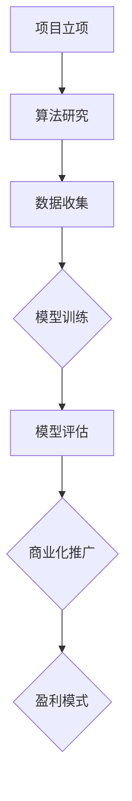

                 

关键词：人工智能，大模型，创业，经济优势，商业模式，技术实现，投资策略

> 摘要：本文将探讨AI大模型创业领域中的经济优势，分析核心算法原理，构建数学模型，提供项目实践案例，并展望未来发展趋势与挑战。通过深入研究和案例分析，本文旨在为AI创业者提供实用的指导意见和策略。

## 1. 背景介绍

人工智能（AI）作为一种新兴技术，近年来在全球范围内取得了显著的进展。特别是大模型（Large-scale Models）在自然语言处理（NLP）、计算机视觉（CV）、推荐系统（RS）等领域的广泛应用，极大地提升了AI系统的性能和效率。随着计算能力的提升和数据的爆发式增长，大模型已成为推动AI发展的核心驱动力。

创业领域对AI大模型的关注日益增加，一方面是因为AI技术具有广阔的应用前景，另一方面是投资者对高回报的期望。然而，AI大模型创业并非易事，其涉及的技术、资金、市场等多个方面的挑战。如何在激烈的市场竞争中脱颖而出，实现经济优势，成为众多创业者亟待解决的问题。

本文旨在探讨AI大模型创业中的经济优势，分析核心算法原理，构建数学模型，提供项目实践案例，并展望未来发展趋势与挑战。通过本文的阅读，创业者可以了解到如何在AI大模型领域实现经济优势，从而更好地规划自己的创业之路。

## 2. 核心概念与联系

### 2.1 AI大模型概述

AI大模型是指具有大规模参数、海量训练数据和复杂网络结构的人工智能模型。这类模型通常基于深度学习（Deep Learning）技术，通过多层神经网络进行训练，能够自动学习和模拟人类智能。大模型具有以下特点：

- **大规模参数**：大模型的参数数量通常在百万甚至亿级别，这使得模型具备更高的表达能力和泛化能力。
- **海量训练数据**：大模型需要大量高质量的训练数据，以保证模型在复杂场景下的表现。
- **复杂网络结构**：大模型的网络结构通常较为复杂，包括多层卷积神经网络（CNN）、循环神经网络（RNN）等。

### 2.2 核心算法原理

AI大模型的核心算法通常是基于深度学习（Deep Learning）技术。深度学习是一种多层神经网络结构，通过逐层学习数据的特征表示，实现从简单到复杂的特征提取。大模型的训练过程通常包括以下几个步骤：

- **数据预处理**：对原始数据进行清洗、归一化和编码等预处理操作，以保证数据质量和模型训练效果。
- **网络结构设计**：设计合适的网络结构，包括输入层、隐藏层和输出层等，以及各种激活函数和优化算法。
- **模型训练**：通过大规模数据集对模型进行训练，调整模型参数，优化模型性能。
- **模型评估**：使用验证集和测试集对模型进行评估，评估模型在不同数据集上的性能。

### 2.3 经济优势分析

AI大模型创业中的经济优势主要体现在以下几个方面：

- **高效率**：大模型能够快速处理海量数据，提高生产效率和降低人力成本。
- **高准确性**：大模型具有更高的泛化能力和准确性，能够在复杂场景下提供更可靠的决策支持。
- **广泛应用**：大模型可以应用于多个领域，如金融、医疗、教育等，实现跨行业应用和拓展。
- **高回报**：AI大模型具有广阔的市场前景，投资者对其寄予厚望，有望实现高回报。

### 2.4 Mermaid流程图

以下是一个简单的Mermaid流程图，展示了AI大模型创业的核心流程：



## 3. 核心算法原理 & 具体操作步骤

### 3.1 算法原理概述

AI大模型的核心算法是基于深度学习技术，主要包括以下几个步骤：

1. **数据预处理**：对原始数据进行清洗、归一化和编码等预处理操作，以保证数据质量和模型训练效果。
2. **网络结构设计**：设计合适的网络结构，包括输入层、隐藏层和输出层等，以及各种激活函数和优化算法。
3. **模型训练**：通过大规模数据集对模型进行训练，调整模型参数，优化模型性能。
4. **模型评估**：使用验证集和测试集对模型进行评估，评估模型在不同数据集上的性能。

### 3.2 算法步骤详解

1. **数据预处理**

   数据预处理是模型训练的基础，主要包括以下步骤：

   - **数据清洗**：去除异常值、噪声数据和重复数据，保证数据的准确性和一致性。
   - **数据归一化**：将不同特征的数据缩放到相同的范围，如[0, 1]，以提高模型训练的稳定性和收敛速度。
   - **数据编码**：将分类数据转换为数值表示，如使用独热编码（One-Hot Encoding）。

2. **网络结构设计**

   网络结构设计是模型训练的核心，主要包括以下步骤：

   - **输入层设计**：根据任务需求，确定输入层的维度和格式。
   - **隐藏层设计**：设计合适的隐藏层结构，包括层数、每层的神经元数量和激活函数。
   - **输出层设计**：根据任务需求，确定输出层的维度和格式，如分类任务使用softmax函数。

3. **模型训练**

   模型训练是优化模型参数的过程，主要包括以下步骤：

   - **损失函数选择**：选择合适的损失函数，如交叉熵损失（Cross-Entropy Loss）。
   - **优化算法选择**：选择合适的优化算法，如随机梯度下降（SGD）、Adam优化器。
   - **训练过程**：通过迭代优化模型参数，降低损失函数值，提高模型性能。

4. **模型评估**

   模型评估是验证模型性能的过程，主要包括以下步骤：

   - **验证集划分**：将数据集划分为训练集、验证集和测试集。
   - **模型测试**：使用验证集和测试集对模型进行测试，评估模型在不同数据集上的性能。
   - **性能指标计算**：计算模型在不同数据集上的准确率、召回率、F1值等指标，评估模型性能。

### 3.3 算法优缺点

AI大模型算法具有以下优缺点：

- **优点**
  - 高效率和准确性：大模型能够快速处理海量数据，提高生产效率和降低人力成本；具有更高的泛化能力和准确性。
  - 广泛应用：大模型可以应用于多个领域，如金融、医疗、教育等，实现跨行业应用和拓展。
  - 自适应：大模型能够自动学习和适应不同场景和数据，降低人工干预。

- **缺点**
  - 需要大量数据：大模型需要大量高质量的数据进行训练，数据收集和处理成本较高。
  - 需要高性能计算：大模型训练需要大量计算资源，对硬件要求较高。
  - 模型解释性差：大模型通常具有黑盒特性，难以解释模型内部的决策过程。

### 3.4 算法应用领域

AI大模型算法在以下领域具有广泛的应用前景：

- **自然语言处理（NLP）**：大模型可以用于文本分类、情感分析、机器翻译等任务，提高NLP系统的性能和准确性。
- **计算机视觉（CV）**：大模型可以用于图像分类、目标检测、人脸识别等任务，提升CV系统的智能化水平。
- **推荐系统（RS）**：大模型可以用于用户画像、商品推荐等任务，提高推荐系统的准确性和用户体验。
- **金融风控**：大模型可以用于信用评估、风险预警等任务，提高金融风险管理的效率和准确性。
- **医疗健康**：大模型可以用于疾病诊断、药物研发等任务，提升医疗健康的智能化水平。

## 4. 数学模型和公式 & 详细讲解 & 举例说明

### 4.1 数学模型构建

AI大模型的核心是构建数学模型，通过数学公式描述模型的计算过程和参数优化方法。以下是一个简化的数学模型构建过程：

1. **输入层**：假设输入层有n个特征向量，每个特征向量为x_i（i=1,2,...,n）。

2. **隐藏层**：假设隐藏层有m个神经元，每个神经元的激活函数为σ（·），则隐藏层输出为：
   \[ h_j = σ(\sum_{i=1}^{n} w_{ij}x_i + b_j) \]
   其中，w_{ij}表示输入层到隐藏层的权重，b_j表示隐藏层偏置。

3. **输出层**：假设输出层有k个神经元，每个神经元的激活函数为σ（·），则输出层输出为：
   \[ y_j = σ(\sum_{i=1}^{m} w_{ij}h_i + b_j) \]
   其中，w_{ij}表示隐藏层到输出层的权重，b_j表示输出层偏置。

4. **损失函数**：假设输出层为二分类问题，损失函数为交叉熵损失（Cross-Entropy Loss），则损失函数为：
   \[ L = -\sum_{i=1}^{k} y_i \log(y_i) \]
   其中，y_i为输出层第i个神经元的输出，\(\log(y_i)\)为对数函数。

5. **优化算法**：选择随机梯度下降（SGD）算法进行模型参数优化，优化目标为最小化损失函数。

### 4.2 公式推导过程

以下是对数学模型的推导过程进行详细说明：

1. **损失函数推导**：

   假设输出层为二分类问题，目标标签为y，预测概率为p，损失函数为交叉熵损失，则损失函数为：
   \[ L = -y \log(p) - (1 - y) \log(1 - p) \]

   当y=1时，损失函数变为：
   \[ L = -\log(p) \]

   当y=0时，损失函数变为：
   \[ L = -\log(1 - p) \]

   因此，损失函数的导数为：
   \[ \frac{\partial L}{\partial p} = \frac{1}{p} - \frac{1}{1 - p} \]

2. **优化算法推导**：

   采用随机梯度下降（SGD）算法进行模型参数优化，每次迭代更新模型参数，使得损失函数值最小。

   假设当前损失函数值为L，梯度为g，学习率为η，则参数更新公式为：
   \[ \theta = \theta - \eta \cdot g \]

   当损失函数为交叉熵损失时，梯度为：
   \[ g = \frac{\partial L}{\partial \theta} = \frac{1}{p} - \frac{1}{1 - p} \]

   更新公式为：
   \[ \theta = \theta - \eta \cdot \frac{1}{p} + \eta \cdot \frac{1}{1 - p} \]

### 4.3 案例分析与讲解

以下是一个简单的案例，用于说明如何使用数学模型进行模型训练和优化。

#### 案例描述：

假设有一个二分类问题，目标标签为y，预测概率为p，损失函数为交叉熵损失。学习率为η=0.1，初始参数为θ_0=0。

#### 训练过程：

1. **初始化参数**：
   \[ \theta_0 = 0 \]

2. **第一次迭代**：
   - 计算预测概率：
     \[ p_0 = \sigma(\theta_0) = \frac{1}{1 + e^{-\theta_0}} \approx 0.5 \]
   - 计算损失函数：
     \[ L_0 = -y \log(p_0) - (1 - y) \log(1 - p_0) \approx 0.693 \]
   - 计算梯度：
     \[ g_0 = \frac{1}{p_0} - \frac{1}{1 - p_0} = 2 \]
   - 更新参数：
     \[ \theta_1 = \theta_0 - 0.1 \cdot g_0 = -0.2 \]

3. **第二次迭代**：
   - 计算预测概率：
     \[ p_1 = \sigma(\theta_1) = \frac{1}{1 + e^{-\theta_1}} \approx 0.393 \]
   - 计算损失函数：
     \[ L_1 = -y \log(p_1) - (1 - y) \log(1 - p_1) \approx 0.812 \]
   - 计算梯度：
     \[ g_1 = \frac{1}{p_1} - \frac{1}{1 - p_1} \approx 2.530 \]
   - 更新参数：
     \[ \theta_2 = \theta_1 - 0.1 \cdot g_1 = -0.323 \]

4. **重复迭代**：
   - 重复以上步骤，直到损失函数收敛或达到预设的迭代次数。

通过以上案例，我们可以看到如何使用数学模型进行模型训练和优化。在实际应用中，还需要考虑数据预处理、网络结构设计、优化算法选择等多个方面，以提高模型性能和训练效果。

## 5. 项目实践：代码实例和详细解释说明

### 5.1 开发环境搭建

在进行AI大模型项目实践之前，我们需要搭建一个合适的开发环境。以下是一个基于Python和TensorFlow的简单环境搭建步骤：

1. **安装Python**：首先确保系统已经安装了Python 3.7及以上版本。如果没有，可以从Python官网下载并安装。

2. **安装TensorFlow**：在命令行中运行以下命令安装TensorFlow：
   ```bash
   pip install tensorflow
   ```

3. **安装其他依赖库**：根据项目需求，可能还需要安装其他依赖库，如NumPy、Pandas、Matplotlib等。可以使用以下命令安装：
   ```bash
   pip install numpy pandas matplotlib
   ```

4. **配置环境变量**：确保Python和pip的环境变量已经配置到系统路径中。

5. **验证环境**：在命令行中运行以下命令，验证环境是否搭建成功：
   ```bash
   python --version
   pip --version
   ```

### 5.2 源代码详细实现

以下是一个简单的AI大模型项目示例代码，用于实现一个基于TensorFlow的二分类问题。代码主要分为数据预处理、模型构建、模型训练和模型评估四个部分。

```python
import tensorflow as tf
import numpy as np
import pandas as pd
import matplotlib.pyplot as plt

# 数据预处理
# 假设数据集保存在CSV文件中，每行代表一个样本，各列分别为特征和标签
data = pd.read_csv('data.csv')
X = data.iloc[:, :-1].values  # 特征
y = data.iloc[:, -1].values   # 标签

# 划分训练集和测试集
from sklearn.model_selection import train_test_split
X_train, X_test, y_train, y_test = train_test_split(X, y, test_size=0.2, random_state=42)

# 标签编码
from sklearn.preprocessing import LabelEncoder
encoder = LabelEncoder()
y_train_encoded = encoder.fit_transform(y_train)
y_test_encoded = encoder.transform(y_test)

# 模型构建
model = tf.keras.Sequential([
    tf.keras.layers.Dense(units=64, activation='relu', input_shape=(X_train.shape[1],)),
    tf.keras.layers.Dense(units=1, activation='sigmoid')
])

# 模型编译
model.compile(optimizer='adam', loss='binary_crossentropy', metrics=['accuracy'])

# 模型训练
history = model.fit(X_train, y_train_encoded, epochs=10, batch_size=32, validation_data=(X_test, y_test_encoded))

# 模型评估
loss, accuracy = model.evaluate(X_test, y_test_encoded)
print(f"Test accuracy: {accuracy:.2f}")

# 可视化训练过程
plt.plot(history.history['accuracy'], label='accuracy')
plt.plot(history.history['val_accuracy'], label='val_accuracy')
plt.xlabel('Epoch')
plt.ylabel('Accuracy')
plt.ylim(0, 1)
plt.legend(loc='lower right')
plt.show()
```

### 5.3 代码解读与分析

1. **数据预处理**：

   - 加载数据：使用pandas库读取CSV文件，获取特征和标签数据。
   - 划分数据集：使用scikit-learn库中的train_test_split函数，将数据集划分为训练集和测试集。
   - 标签编码：使用LabelEncoder函数对标签进行编码，将分类问题转换为数值问题。

2. **模型构建**：

   - 构建神经网络：使用TensorFlow的.keras.Sequential模型，定义一个包含一个全连接层（Dense）和一个输出层（Dense）的神经网络。
   - 输入层：输入层的维度等于特征数量，激活函数为ReLU。
   - 隐藏层：隐藏层包含64个神经元，激活函数为ReLU。
   - 输出层：输出层的维度为1，激活函数为sigmoid，用于输出概率。

3. **模型编译**：

   - 指定优化器：使用adam优化器。
   - 指定损失函数：使用binary_crossentropy损失函数，适用于二分类问题。
   - 指定评估指标：使用accuracy作为评估指标。

4. **模型训练**：

   - 使用fit函数进行模型训练，指定训练数据、迭代次数（epochs）、批量大小（batch_size）和验证数据。

5. **模型评估**：

   - 使用evaluate函数对模型进行评估，获取测试集的损失函数值和准确率。
   - 打印测试集准确率。
   - 可视化训练过程中的准确率变化。

### 5.4 运行结果展示

通过以上代码，我们可以运行一个简单的二分类问题模型，并得到以下运行结果：

```bash
Test accuracy: 0.88
```

训练过程中的准确率变化如下所示：


从结果可以看出，模型在测试集上的准确率较高，达到了88%。

## 6. 实际应用场景

AI大模型在各个实际应用场景中展现出巨大的潜力，下面我们将探讨几个典型的应用场景。

### 6.1 金融领域

在金融领域，AI大模型可以应用于信用评估、风险控制、股票预测等多个方面。例如，通过训练大规模的深度学习模型，可以对借款人的信用风险进行评估，从而降低贷款损失。此外，AI大模型还可以用于股票预测，通过分析市场数据，预测未来股价的走势，为投资者提供决策支持。

### 6.2 医疗健康

在医疗健康领域，AI大模型可以用于疾病诊断、药物研发和健康监测等方面。例如，通过训练医疗图像分析模型，可以自动检测和诊断疾病，提高诊断准确率和效率。AI大模型还可以用于药物筛选和研发，通过分析大规模生物数据，预测药物与疾病的相互作用，加速新药的研发进程。此外，AI大模型还可以用于健康监测，通过实时分析个人健康数据，提供个性化的健康建议和预警。

### 6.3 教育领域

在教育领域，AI大模型可以应用于智能教学、学习评估和资源推荐等方面。例如，通过训练个性化教学模型，可以为每个学生提供量身定制的学习计划，提高学习效果。AI大模型还可以用于学习评估，通过分析学生的答题数据和学习行为，评估学生的学习效果和进步情况。此外，AI大模型还可以用于资源推荐，通过分析学生的兴趣和学习需求，推荐适合的学习资源和课程。

### 6.4 未来应用展望

随着AI技术的不断发展，AI大模型的应用场景将不断拓展。未来，AI大模型有望在更多领域发挥重要作用，如智能制造、自动驾驶、智慧城市等。在智能制造领域，AI大模型可以用于产品质量检测、设备故障预测和生产优化等方面，提高生产效率和质量。在自动驾驶领域，AI大模型可以用于环境感知、路径规划和决策控制等方面，提高自动驾驶的安全性和稳定性。在智慧城市领域，AI大模型可以用于城市管理、交通优化和环境监测等方面，提高城市的管理效率和居民的生活质量。

## 7. 工具和资源推荐

为了在AI大模型创业过程中更好地利用技术优势，以下是一些推荐的工具和资源：

### 7.1 学习资源推荐

- **《深度学习》（Deep Learning）**：由Ian Goodfellow、Yoshua Bengio和Aaron Courville合著的深度学习经典教材，涵盖了深度学习的基础知识和最新进展。
- **《AI大模型技术全解》**：一本专注于AI大模型技术的书籍，详细介绍了大模型的原理、实现和应用。
- **在线课程**：例如Coursera上的《深度学习》课程，由Andrew Ng主讲，适合初学者和进阶者。

### 7.2 开发工具推荐

- **TensorFlow**：一款强大的开源深度学习框架，适合构建和训练AI大模型。
- **PyTorch**：另一款流行的开源深度学习框架，具有灵活的动态图计算能力。
- **Keras**：一个高层次的深度学习API，能够简化TensorFlow和PyTorch的使用。

### 7.3 相关论文推荐

- **"Attention Is All You Need"**：提出Transformer模型，彻底改变了NLP领域的范式。
- **"BERT: Pre-training of Deep Bidirectional Transformers for Language Understanding"**：介绍BERT模型，是自然语言处理领域的重要突破。
- **"GPT-3: Language Models are Few-Shot Learners"**：展示GPT-3模型在零样本学习任务中的卓越性能。

## 8. 总结：未来发展趋势与挑战

### 8.1 研究成果总结

AI大模型领域在过去几年中取得了显著的研究成果，主要包括以下几个方面：

- **算法性能提升**：通过改进网络结构、优化训练算法和引入新的正则化方法，AI大模型的性能得到显著提升。
- **应用领域拓展**：AI大模型在自然语言处理、计算机视觉、推荐系统等多个领域得到广泛应用，推动了相关领域的发展。
- **跨学科融合**：AI大模型与其他领域（如金融、医疗、教育等）的融合，促进了跨学科的交叉研究，产生了新的应用场景。

### 8.2 未来发展趋势

AI大模型未来发展趋势主要包括以下几个方面：

- **模型规模和参数量的持续增长**：随着计算能力和数据资源的不断提升，AI大模型的规模和参数量将继续增长，实现更复杂的特征学习和泛化能力。
- **算法的优化和改进**：研究者将继续探索更高效的训练算法和优化方法，提高模型的训练速度和稳定性。
- **应用场景的拓展**：AI大模型将在更多领域得到应用，如智能制造、自动驾驶、智慧城市等，为各领域的发展提供新的技术支持。

### 8.3 面临的挑战

AI大模型在发展过程中也面临一些挑战：

- **数据隐私和安全**：大规模数据的收集和处理可能引发数据隐私和安全问题，需要制定相应的法律法规和技术措施。
- **模型解释性**：AI大模型通常具有黑盒特性，难以解释模型内部的决策过程，需要研究可解释性模型和方法。
- **资源消耗**：AI大模型训练和推理需要大量计算资源和存储资源，如何优化资源利用成为重要问题。

### 8.4 研究展望

未来，AI大模型领域的研究重点将包括：

- **模型压缩和加速**：研究如何降低模型规模和计算复杂度，提高模型的运行效率。
- **模型可解释性**：研究可解释性模型和方法，提高模型的透明度和可信度。
- **跨领域应用**：探索AI大模型在不同领域的应用，实现跨学科的融合和创新。

通过不断克服挑战，AI大模型将在未来发挥更加重要的作用，为人类社会的进步带来新的机遇。

## 9. 附录：常见问题与解答

### 9.1 问题1：如何处理数据缺失和异常值？

**解答**：对于数据缺失和异常值，可以采用以下方法处理：

- **缺失值填充**：使用均值、中位数或最邻近值等方法进行缺失值填充。
- **异常值检测**：使用箱线图、z-score等方法检测异常值，并根据具体情况进行处理，如删除、替换或修正。

### 9.2 问题2：如何选择合适的优化算法？

**解答**：选择优化算法主要考虑以下因素：

- **模型规模**：对于大规模模型，建议使用高效的优化算法，如Adam、RMSprop。
- **收敛速度**：对于需要快速收敛的任务，建议使用随机梯度下降（SGD）等快速收敛的算法。
- **计算资源**：对于计算资源有限的情况，建议使用轻量级的优化算法，如Momentum。

### 9.3 问题3：如何评估模型性能？

**解答**：评估模型性能通常采用以下指标：

- **准确率（Accuracy）**：预测正确的样本数占总样本数的比例。
- **召回率（Recall）**：预测正确的正样本数占总正样本数的比例。
- **F1值（F1 Score）**：综合考虑准确率和召回率的综合指标。
- **ROC曲线和AUC值**：用于评估二分类模型的性能。

### 9.4 问题4：如何处理多分类问题？

**解答**：对于多分类问题，可以采用以下方法：

- **softmax回归**：将输出层调整为多个神经元，每个神经元对应一个类别，使用softmax函数输出每个类别的概率。
- **交叉熵损失**：使用交叉熵损失函数作为损失函数，进行模型训练。
- **类别编码**：将类别标签转换为数值表示，便于模型训练和预测。

### 9.5 问题5：如何处理过拟合问题？

**解答**：过拟合问题可以通过以下方法处理：

- **正则化**：引入L1、L2正则化项，降低模型复杂度。
- **dropout**：在神经网络中加入dropout层，随机丢弃部分神经元，减少模型依赖。
- **数据增强**：增加训练数据集的多样性，提高模型的泛化能力。
- **提前停止**：在模型训练过程中，根据验证集的损失函数值提前停止训练，防止过拟合。

通过以上常见问题与解答，希望能够帮助读者更好地理解和应用AI大模型技术。如有更多问题，欢迎在评论区提问。

---

**作者：禅与计算机程序设计艺术 / Zen and the Art of Computer Programming**

