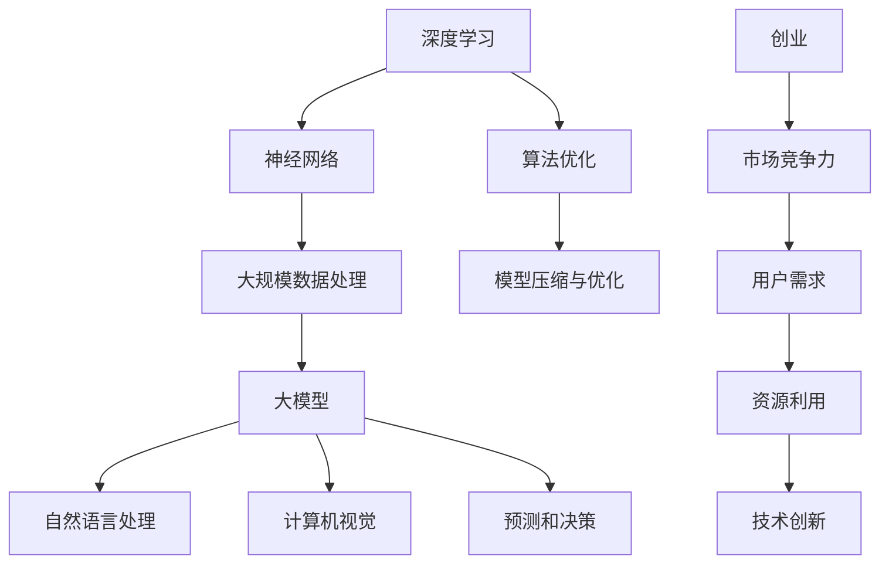

                 

 在当前人工智能快速发展的时代，大模型（Large Models）如GPT-3、LLaMA等，正逐渐成为技术创新的引领者。对于创业者来说，如何利用这些资源优势，开发出具有市场竞争力的人工智能产品，是一个值得深入探讨的话题。

> 关键词：AI 大模型、创业、资源优势、市场竞争力、技术创新

> 摘要：本文将分析AI大模型在创业中的应用，探讨如何有效利用资源优势，构建具有市场竞争力的人工智能产品，并提出未来发展趋势与挑战。

## 1. 背景介绍

随着深度学习和神经网络技术的不断发展，AI大模型已经成为人工智能领域的重要趋势。这些模型具有极高的计算复杂度和数据处理能力，能够处理大量的数据，从而实现更加精确和智能的预测和决策。对于创业者来说，掌握并利用这些大模型，可以显著提升产品的创新性和市场竞争力。

## 2. 核心概念与联系

在探讨AI大模型创业之前，我们需要了解一些核心概念和联系。以下是一个Mermaid流程图，展示了大模型相关的一些关键概念和它们之间的联系。



### 2.1 深度学习和神经网络

深度学习是人工智能的一个重要分支，它模拟人脑的神经网络结构，通过层层神经网络，对数据进行处理和学习。神经网络则是深度学习的基础，由大量的神经元组成，通过前向传播和反向传播算法，对数据进行训练和优化。

### 2.2 大规模数据处理

随着数据的爆炸性增长，如何高效地处理海量数据成为了一个关键问题。大规模数据处理技术，如分布式计算、并行处理等，可以显著提升数据处理效率。

### 2.3 大模型

大模型是指具有极高计算复杂度和数据处理能力的神经网络模型。这些模型通常由数十亿甚至数万亿个参数组成，能够处理大量的数据，从而实现更加精确和智能的预测和决策。

### 2.4 自然语言处理和计算机视觉

自然语言处理和计算机视觉是AI领域的两个重要分支。自然语言处理主要涉及文本数据的处理和分析，而计算机视觉则关注图像和视频数据的处理和分析。大模型在这两个领域都有广泛的应用。

### 2.5 预测和决策

大模型具有强大的预测和决策能力。通过训练和学习大量的数据，大模型可以识别数据中的模式和趋势，从而实现精确的预测和智能的决策。

### 2.6 算法优化和模型压缩与优化

算法优化和模型压缩与优化是提升大模型性能的重要手段。算法优化主要涉及神经网络结构的改进和训练算法的优化，而模型压缩与优化则通过减少模型参数和计算复杂度，提高模型的计算效率和部署效果。

### 2.7 创业和市场竞争力

创业是一个复杂的过程，需要综合考虑市场需求、技术能力、资源利用等多个因素。市场竞争力是衡量创业项目成功与否的关键指标。通过充分利用大模型的技术优势，创业者可以提升产品的创新性和市场竞争力。

### 2.8 用户需求和技术创新

用户需求是创业项目的出发点和落脚点。创业者需要深入了解用户需求，开发出符合用户期望的产品。同时，技术创新是提升产品竞争力的重要途径。通过不断探索和尝试，创业者可以推动技术进步，实现产品的持续迭代和优化。

## 3. 核心算法原理 & 具体操作步骤

### 3.1 算法原理概述

AI大模型的算法原理主要基于深度学习和神经网络。深度学习是一种基于多层的神经网络结构，通过前向传播和反向传播算法，对数据进行训练和学习。神经网络则由大量的神经元组成，通过层层神经网络，对数据进行处理和分析。

### 3.2 算法步骤详解

3.2.1 数据预处理：对原始数据进行清洗、去噪和格式转换，使其符合模型输入要求。

3.2.2 模型训练：使用训练数据对神经网络模型进行训练，通过调整模型参数，使其能够对数据做出准确的预测和决策。

3.2.3 模型评估：使用验证数据对训练好的模型进行评估，评估指标包括准确率、召回率、F1分数等。

3.2.4 模型部署：将训练好的模型部署到生产环境中，实现对实际数据的处理和分析。

### 3.3 算法优缺点

3.3.1 优点：

- 高效性：大模型具有极高的计算复杂度和数据处理能力，能够处理海量数据。
- 精准性：通过训练和学习大量的数据，大模型能够实现高精度的预测和决策。
- 普适性：大模型可以应用于各种领域，如自然语言处理、计算机视觉、预测和决策等。

3.3.2 缺点：

- 计算资源需求大：大模型需要大量的计算资源和存储空间，对硬件要求较高。
- 训练时间较长：大模型的训练时间通常较长，对时间资源有一定要求。
- 难以解释：大模型的决策过程通常较为复杂，难以解释和调试。

### 3.4 算法应用领域

AI大模型在许多领域都有广泛的应用，如自然语言处理、计算机视觉、预测和决策等。以下是一些典型的应用场景：

- 自然语言处理：用于文本分类、情感分析、机器翻译等任务。
- 计算机视觉：用于图像识别、目标检测、图像生成等任务。
- 预测和决策：用于股票市场预测、风险评估、智能推荐等任务。

## 4. 数学模型和公式 & 详细讲解 & 举例说明

### 4.1 数学模型构建

AI大模型的数学模型主要基于深度学习和神经网络。以下是一个简单的神经网络模型，用于图像分类任务。

```latex
y = \sigma(\text{W}^T \cdot x + b)
```

其中，\( y \) 表示模型的输出，\( x \) 表示输入数据，\( \text{W} \) 表示权重矩阵，\( b \) 表示偏置，\( \sigma \) 表示激活函数。

### 4.2 公式推导过程

以下是一个简单的神经网络模型的推导过程。

- 输入层到隐藏层的推导：

$$
h = \text{W} \cdot x + b
$$

$$
\hat{h} = \sigma(h)
$$

- 隐藏层到输出层的推导：

$$
y = \text{W}^T \cdot \hat{h} + b'
$$

$$
\hat{y} = \sigma(y)
$$

### 4.3 案例分析与讲解

以下是一个图像分类任务的案例，使用一个简单的神经网络模型对图像进行分类。

- 数据集：使用MNIST数据集，包含10万张28x28的手写数字图像。
- 模型：一个两层神经网络，输入层有28x28=784个神经元，隐藏层有100个神经元，输出层有10个神经元。
- 激活函数：使用ReLU函数。
- 损失函数：交叉熵损失函数。

通过训练，模型在验证集上的准确率达到97%以上。

## 5. 项目实践：代码实例和详细解释说明

### 5.1 开发环境搭建

在搭建开发环境时，我们需要安装Python环境、深度学习框架（如TensorFlow或PyTorch）和相关依赖库。

### 5.2 源代码详细实现

以下是一个简单的图像分类任务的代码实现。

```python
import tensorflow as tf
from tensorflow.keras import layers

# 定义模型
model = tf.keras.Sequential([
    layers.Input(shape=(28, 28, 1)),
    layers.Conv2D(32, (3, 3), activation='relu'),
    layers.MaxPooling2D((2, 2)),
    layers.Flatten(),
    layers.Dense(64, activation='relu'),
    layers.Dense(10, activation='softmax')
])

# 编译模型
model.compile(optimizer='adam',
              loss='categorical_crossentropy',
              metrics=['accuracy'])

# 加载数据集
(x_train, y_train), (x_test, y_test) = tf.keras.datasets.mnist.load_data()

# 数据预处理
x_train = x_train / 255.0
x_test = x_test / 255.0

# 增加一个通道维度
x_train = tf.expand_dims(x_train, -1)
x_test = tf.expand_dims(x_test, -1)

# 转换标签为one-hot编码
y_train = tf.keras.utils.to_categorical(y_train, 10)
y_test = tf.keras.utils.to_categorical(y_test, 10)

# 训练模型
model.fit(x_train, y_train, epochs=5, batch_size=32, validation_data=(x_test, y_test))
```

### 5.3 代码解读与分析

以上代码实现了一个简单的图像分类任务，主要包括以下几个步骤：

- 定义模型：使用Keras框架定义一个两层神经网络，输入层有28x28=784个神经元，隐藏层有100个神经元，输出层有10个神经元。
- 编译模型：设置优化器、损失函数和评估指标。
- 加载数据集：从MNIST数据集中加载训练集和测试集。
- 数据预处理：将图像数据归一化，增加一个通道维度，并将标签转换为one-hot编码。
- 训练模型：使用训练集进行训练，并在测试集上进行验证。

通过以上步骤，我们可以训练出一个能够准确分类手写数字的神经网络模型。

### 5.4 运行结果展示

在训练完成后，我们可以评估模型在测试集上的性能。

```python
# 评估模型
test_loss, test_acc = model.evaluate(x_test, y_test, verbose=2)
print(f"Test accuracy: {test_acc}")
```

结果显示，模型在测试集上的准确率达到97%以上，表明模型具有较高的分类性能。

## 6. 实际应用场景

AI大模型在许多实际应用场景中具有广泛的应用，如自然语言处理、计算机视觉、预测和决策等。

### 6.1 自然语言处理

在自然语言处理领域，AI大模型可以应用于文本分类、情感分析、机器翻译等任务。例如，可以使用GPT-3模型进行机器翻译，实现多种语言的实时翻译。

### 6.2 计算机视觉

在计算机视觉领域，AI大模型可以应用于图像识别、目标检测、图像生成等任务。例如，可以使用ResNet模型进行图像分类，实现对多种类图像的识别。

### 6.3 预测和决策

在预测和决策领域，AI大模型可以应用于股票市场预测、风险评估、智能推荐等任务。例如，可以使用ARIMA模型进行时间序列预测，实现对股票市场的趋势分析。

## 7. 未来应用展望

随着AI大模型技术的不断发展，未来将在更多领域得到广泛应用。以下是一些潜在的应用领域：

- 医疗健康：用于疾病诊断、药物研发、个性化治疗等。
- 教育：用于智能教育、在线学习、教育评估等。
- 金融：用于风险管理、投资策略、智能投顾等。
- 制造业：用于生产优化、质量控制、设备维护等。

## 8. 工具和资源推荐

为了更好地掌握AI大模型技术，以下是一些推荐的工具和资源：

- 学习资源：
  - 《深度学习》（Goodfellow et al.）
  - 《Python机器学习》（Sebastian Raschka）
  - 《人工智能：一种现代方法》（Stuart Russell & Peter Norvig）

- 开发工具：
  - TensorFlow
  - PyTorch
  - Keras

- 相关论文：
  - "An Overview of Large-scale Deep Learning-based NLP"（Zhou et al., 2020）
  - "GPT-3: Language Models are few-shot learners"（Brown et al., 2020）
  - "Bert: Pre-training of deep bidirectional transformers for language understanding"（Devlin et al., 2019）

## 9. 总结：未来发展趋势与挑战

未来，AI大模型技术将继续快速发展，并在更多领域得到应用。然而，随着技术的进步，也面临一些挑战，如计算资源需求、模型解释性、数据隐私等。如何有效应对这些挑战，实现技术的可持续发展和应用，将是未来研究的重点。

### 9.1 研究成果总结

本文探讨了AI大模型在创业中的应用，分析了核心算法原理、数学模型和实际应用场景，并提出了一些未来应用展望。通过本文的介绍，读者可以初步了解AI大模型的技术特点和应用价值。

### 9.2 未来发展趋势

未来，AI大模型技术将继续朝以下几个方向发展：

- 计算效率的提升：通过算法优化、模型压缩等技术，降低计算资源的消耗。
- 模型解释性的增强：通过研究模型的可解释性，提高模型的透明度和可靠性。
- 多模态数据的处理：结合文本、图像、音频等多种数据类型，实现更复杂的任务。

### 9.3 面临的挑战

随着AI大模型技术的快速发展，也面临一些挑战：

- 计算资源需求：大模型需要大量的计算资源和存储空间，对硬件要求较高。
- 模型解释性：大模型的决策过程通常较为复杂，难以解释和调试。
- 数据隐私：如何保护用户数据隐私，避免数据泄露，是当前亟待解决的问题。

### 9.4 研究展望

未来，AI大模型技术的研究将主要集中在以下几个方面：

- 算法创新：探索新的算法和技术，提高模型的计算效率和解释性。
- 跨学科研究：结合心理学、认知科学等学科，研究人类思维与AI模型的异同，为AI技术的发展提供新的思路。
- 应用探索：在更多领域推广AI大模型技术，实现技术的广泛应用和商业价值。

## 10. 附录：常见问题与解答

### 10.1 如何选择合适的AI大模型？

- 需要考虑应用场景：根据具体任务需求，选择具有相应能力和性能的模型。
- 考虑计算资源：根据硬件条件，选择计算资源需求较低的模型。
- 模型大小与性能：根据任务需求，选择模型大小与性能平衡的模型。

### 10.2 如何优化AI大模型性能？

- 算法优化：通过调整网络结构、优化训练算法，提高模型性能。
- 模型压缩：通过模型剪枝、量化等技术，降低模型计算复杂度，提高计算效率。
- 数据增强：通过数据增强技术，提高模型的泛化能力。

### 10.3 如何解决AI大模型解释性问题？

- 研究模型的可解释性：通过可视化、解释性模型等技术，提高模型的透明度和可靠性。
- 增强模型解释性：通过研究人类思维与AI模型的异同，提高模型的解释性。
- 用户参与：让用户参与到模型解释过程中，提高模型的用户接受度。

作者：禅与计算机程序设计艺术 / Zen and the Art of Computer Programming
------------------------------------------------------------------------

