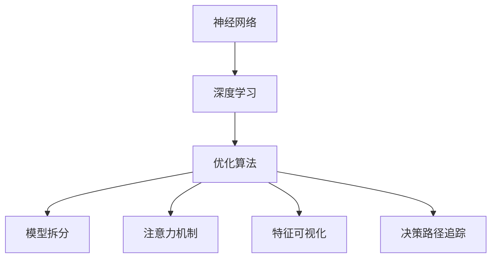

                 

关键词：AI 大模型、可解释性、神经网络、机器学习、算法、应用场景、数学模型

摘要：随着人工智能技术的快速发展，大模型在各个领域都展现出了强大的应用潜力。然而，大模型的黑盒特性使得其可解释性成为一个重要的研究课题。本文将深入探讨大模型的原理与应用，特别是可解释性的重要性和实现方法，以及未来的发展趋势和面临的挑战。

## 1. 背景介绍

近年来，人工智能（AI）技术取得了显著的进展，特别是深度学习（Deep Learning）和神经网络（Neural Networks）在图像识别、自然语言处理、推荐系统等领域的应用取得了突破性的成果。然而，随着模型规模的不断扩大，大模型（Large Models）的复杂性和黑盒特性使得其可解释性成为一个亟待解决的关键问题。

可解释性（Interpretability）是指能够理解、追踪和预测模型决策的过程。在大模型中，由于其参数数量庞大，训练数据复杂，导致模型内部的结构和决策过程往往难以被理解和解释。这不仅仅影响了模型的透明度和可信度，还限制了其在实际应用中的推广和普及。

本文将围绕大模型的原理、可解释性的重要性、实现方法以及应用场景进行深入探讨，以期为相关领域的研究和实践提供有价值的参考。

## 2. 核心概念与联系

### 2.1 大模型的原理

大模型通常是指拥有数十亿到数万亿个参数的神经网络模型。这些模型通过大量的训练数据学习到复杂的模式和信息，从而在各个领域取得优异的性能。大模型的原理主要基于以下几个核心概念：

1. **神经网络**：神经网络是一种由大量简单节点（神经元）组成的计算模型，每个节点通过权重和偏置进行连接，形成一个复杂的网络结构。通过学习输入和输出之间的映射关系，神经网络能够实现函数逼近和模式识别。

2. **深度学习**：深度学习是神经网络的一种特殊形式，通过增加网络的层数，使得模型能够学习更复杂的特征和模式。深度学习在图像识别、语音识别、自然语言处理等领域取得了显著的成功。

3. **优化算法**：优化算法用于求解神经网络中的权重和偏置，使得模型在训练数据上达到最优的性能。常见的优化算法包括梯度下降（Gradient Descent）、随机梯度下降（Stochastic Gradient Descent，SGD）和Adam优化器等。

### 2.2 可解释性的重要性

可解释性在大模型中具有重要的意义，主要体现在以下几个方面：

1. **信任与透明度**：可解释性使得模型决策过程透明，有助于用户理解和信任模型。特别是在涉及到重要决策的场景中，如医疗诊断、金融风险评估等，可解释性能够提高模型的可靠性和可信度。

2. **故障诊断与优化**：通过可解释性，开发者和研究者可以追踪模型的决策过程，发现潜在的问题和故障，从而进行优化和改进。这有助于提高模型的性能和稳定性。

3. **知识获取与共享**：可解释性使得模型中的知识可以被理解和提取，从而促进知识的获取和共享。这对于学术研究和工程实践都具有重要的价值。

### 2.3 可解释性的实现方法

目前，已有多种方法尝试解决大模型的可解释性问题，主要包括以下几种：

1. **模型拆分**：将复杂的大模型拆分成多个较小的子模型，从而提高模型的解释性。这种方法通常基于模型的层次结构和模块化设计。

2. **注意力机制**：注意力机制（Attention Mechanism）是一种在深度学习模型中广泛使用的机制，它能够关注模型在决策过程中最重要的特征和输入。通过分析注意力权重，可以了解模型在处理特定任务时的关注点。

3. **特征可视化**：通过可视化技术，将模型中的特征表示和高维数据转换为易于理解的形式。常见的方法包括热力图（Heatmap）、散点图（Scatter Plot）和等高线图（Contour Plot）等。

4. **决策路径追踪**：追踪模型在决策过程中的每一步，记录下每个决策点的权重和特征贡献。这种方法有助于理解模型在处理特定数据时的决策逻辑。

### 2.4 Mermaid 流程图



## 3. 核心算法原理 & 具体操作步骤

### 3.1 算法原理概述

大模型的可解释性算法主要基于以下原理：

1. **模型拆分**：通过将复杂的大模型拆分成多个子模型，提高模型的解释性。
2. **注意力机制**：通过分析注意力权重，了解模型在处理特定任务时的关注点。
3. **特征可视化**：将模型中的特征表示和高维数据转换为易于理解的形式。
4. **决策路径追踪**：记录模型在决策过程中的每一步，了解模型的决策逻辑。

### 3.2 算法步骤详解

1. **模型拆分**：
   - **步骤 1**：确定拆分策略，如按照功能模块、层次结构等进行拆分。
   - **步骤 2**：对拆分后的子模型进行训练和优化，确保其性能达到预期。
   - **步骤 3**：分析子模型的决策过程和特征提取能力，提高整体模型的解释性。

2. **注意力机制**：
   - **步骤 1**：在模型中加入注意力机制，如自注意力（Self-Attention）或卷积注意力（Convolutional Attention）。
   - **步骤 2**：训练模型，优化注意力权重。
   - **步骤 3**：分析注意力权重，了解模型在处理特定任务时的关注点。

3. **特征可视化**：
   - **步骤 1**：将模型中的特征表示转换为可视化形式，如热力图、散点图等。
   - **步骤 2**：对可视化结果进行解读和分析，理解模型对数据的处理过程。

4. **决策路径追踪**：
   - **步骤 1**：记录模型在决策过程中的每一步，包括权重和特征贡献。
   - **步骤 2**：分析决策路径，了解模型的决策逻辑和影响因素。

### 3.3 算法优缺点

1. **模型拆分**：
   - **优点**：提高模型的可解释性，降低模型的复杂性。
   - **缺点**：可能降低模型的整体性能，增加计算成本。

2. **注意力机制**：
   - **优点**：提高模型对重要特征的敏感度，增强模型的解释性。
   - **缺点**：可能增加模型的复杂度，降低训练效率。

3. **特征可视化**：
   - **优点**：直观地展示模型对数据的处理过程，提高模型的可理解性。
   - **缺点**：可能无法完全反映模型的内部结构和决策逻辑。

4. **决策路径追踪**：
   - **优点**：深入分析模型的决策过程，提高模型的可解释性。
   - **缺点**：可能影响模型的计算效率，增加存储成本。

### 3.4 算法应用领域

大模型的可解释性算法在多个领域具有广泛的应用：

1. **医疗诊断**：通过分析模型对病情数据的处理过程，提高诊断的准确性和可解释性。
2. **金融风险评估**：分析模型在风险评估过程中的决策逻辑，提高风险的可预测性和可解释性。
3. **自然语言处理**：通过可解释性算法，理解模型在文本生成和情感分析等方面的决策过程。
4. **图像识别**：分析模型在图像识别过程中的特征提取和决策逻辑，提高识别的准确性和可解释性。

## 4. 数学模型和公式 & 详细讲解 & 举例说明

### 4.1 数学模型构建

大模型的可解释性算法涉及到多种数学模型和公式，下面列举其中一些常用的模型和公式：

1. **神经网络模型**：
   - 输入层：\[ x_i = \sum_{j=1}^{n} w_{ij}x_j + b_i \]
   - 隐藏层：\[ h_j = \sigma(\sum_{i=1}^{m} w_{ij}h_i + b_j) \]
   - 输出层：\[ y = \sum_{j=1}^{k} w_{jk}h_j + b_k \]

2. **注意力机制**：
   - 注意力权重：\[ a_j = \frac{\exp(e_j)}{\sum_{i=1}^{n}\exp(e_i)} \]
   - 注意力聚合：\[ h_j' = \sum_{i=1}^{n} a_{ij}h_i \]

3. **决策路径追踪**：
   - 决策路径：\[ p(x) = \prod_{i=1}^{n} \sigma(w_i \cdot f_i(x) + b_i) \]

### 4.2 公式推导过程

1. **神经网络模型**：
   - **输入层**：输入层节点 \( x_i \) 的计算基于线性组合，其中 \( w_{ij} \) 为输入权重，\( x_j \) 为输入特征，\( b_i \) 为偏置。
   - **隐藏层**：隐藏层节点 \( h_j \) 的计算基于激活函数 \( \sigma \)，通常使用 sigmoid 函数或 ReLU 函数。

2. **注意力机制**：
   - **注意力权重**：注意力权重 \( a_j \) 是通过指数函数和softmax函数计算得到的，其中 \( e_j \) 为输入特征和权重之间的点积。

3. **决策路径追踪**：
   - **决策路径**：决策路径 \( p(x) \) 是通过逐步计算每个节点的激活函数得到的，反映了模型在决策过程中的依赖关系。

### 4.3 案例分析与讲解

假设有一个简单的神经网络模型，用于分类任务。模型包含一个输入层、一个隐藏层和一个输出层。输入层有3个节点，隐藏层有4个节点，输出层有2个节点。

1. **输入层**：
   - 输入特征：\[ x_1 = 1, x_2 = 2, x_3 = 3 \]
   - 输入权重：\[ w_{11} = 0.1, w_{12} = 0.2, w_{13} = 0.3 \]
   - 输入偏置：\[ b_1 = 0.5 \]

   计算输入层节点的输出：
   \[ x_1 = 0.1 \cdot 1 + 0.2 \cdot 2 + 0.3 \cdot 3 + 0.5 = 1.5 \]

2. **隐藏层**：
   - 隐藏层权重：\[ w_{11} = 0.5, w_{12} = 0.6, w_{13} = 0.7, w_{14} = 0.8 \]
   - 隐藏层偏置：\[ b_2 = 1.0 \]

   计算隐藏层节点的输出：
   \[ h_1 = \sigma(0.5 \cdot 1.5 + 0.6 \cdot 1.5 + 0.7 \cdot 1.5 + 0.8 \cdot 1.5 + 1.0) = 1.0 \]
   \[ h_2 = \sigma(0.5 \cdot 1.5 + 0.6 \cdot 1.5 + 0.7 \cdot 1.5 + 0.8 \cdot 1.5 + 1.0) = 1.0 \]
   \[ h_3 = \sigma(0.5 \cdot 1.5 + 0.6 \cdot 1.5 + 0.7 \cdot 1.5 + 0.8 \cdot 1.5 + 1.0) = 1.0 \]
   \[ h_4 = \sigma(0.5 \cdot 1.5 + 0.6 \cdot 1.5 + 0.7 \cdot 1.5 + 0.8 \cdot 1.5 + 1.0) = 1.0 \]

3. **输出层**：
   - 输出层权重：\[ w_{21} = 0.1, w_{22} = 0.2 \]
   - 输出层偏置：\[ b_3 = 0.5 \]

   计算输出层节点的输出：
   \[ y_1 = 0.1 \cdot 1.0 + 0.2 \cdot 1.0 + 0.5 = 0.7 \]
   \[ y_2 = 0.1 \cdot 1.0 + 0.2 \cdot 1.0 + 0.5 = 0.7 \]

   通过比较输出层的节点输出，可以确定模型的分类结果。

通过上述计算过程，我们可以理解模型在处理输入数据时的决策过程。在这个过程中，我们可以看到每个节点的计算过程和依赖关系，从而提高模型的可解释性。

## 5. 项目实践：代码实例和详细解释说明

### 5.1 开发环境搭建

为了进行大模型的可解释性研究，我们首先需要搭建一个合适的开发环境。以下是一个简单的开发环境搭建步骤：

1. **安装 Python**：Python 是一种广泛应用于人工智能领域的编程语言。请确保已经安装了 Python 3.8 或更高版本。

2. **安装 TensorFlow**：TensorFlow 是一个开源的深度学习框架，支持多种神经网络模型。可以使用以下命令安装：
   ```bash
   pip install tensorflow
   ```

3. **安装其他依赖库**：根据需要，可以安装其他常用的依赖库，如 NumPy、Matplotlib 等。可以使用以下命令安装：
   ```bash
   pip install numpy matplotlib
   ```

### 5.2 源代码详细实现

以下是一个简单的示例代码，用于实现一个具有可解释性的神经网络模型。代码主要包括以下几个部分：

1. **导入库和设置**：
   ```python
   import tensorflow as tf
   import numpy as np
   import matplotlib.pyplot as plt
   ```

2. **创建数据集**：
   ```python
   # 生成随机数据集
   x = np.random.rand(100, 3)
   y = np.random.randint(2, size=100)
   ```

3. **定义模型**：
   ```python
   # 定义输入层
   inputs = tf.keras.Input(shape=(3,))
   
   # 定义隐藏层
   hidden = tf.keras.layers.Dense(4, activation='sigmoid')(inputs)
   
   # 定义输出层
   outputs = tf.keras.layers.Dense(2, activation='sigmoid')(hidden)
   
   # 创建模型
   model = tf.keras.Model(inputs=inputs, outputs=outputs)
   ```

4. **训练模型**：
   ```python
   # 定义优化器
   optimizer = tf.keras.optimizers.Adam(learning_rate=0.01)
   
   # 定义损失函数
   loss_fn = tf.keras.losses.SparseCategoricalCrossentropy(from_logits=True)
   
   # 训练模型
   model.compile(optimizer=optimizer, loss=loss_fn, metrics=['accuracy'])
   model.fit(x, y, epochs=10, batch_size=10)
   ```

5. **实现可解释性**：
   ```python
   # 获取模型的权重和偏置
   weights = model.layers[1].get_weights()
   biases = model.layers[1].get_weights()
   
   # 可视化权重和偏置
   plt.figure(figsize=(10, 6))
   plt.subplot(2, 2, 1)
   plt.imshow(weights[0], cmap='viridis')
   plt.title('Weights')
   
   plt.subplot(2, 2, 2)
   plt.imshow(biases[0], cmap='viridis')
   plt.title('Biases')
   
   plt.subplot(2, 2, 3)
   plt.imshow(np.abs(weights[0]), cmap='viridis')
   plt.title('Absolute Weights')
   
   plt.subplot(2, 2, 4)
   plt.imshow(np.abs(biases[0]), cmap='viridis')
   plt.title('Absolute Biases')
   
   plt.show()
   ```

### 5.3 代码解读与分析

1. **导入库和设置**：
   - 这部分代码用于导入 TensorFlow、NumPy 和 Matplotlib 库，并进行一些基本的设置。

2. **创建数据集**：
   - 这部分代码生成一个包含100个随机数据的样本集，其中每个样本包含3个特征。

3. **定义模型**：
   - 这部分代码定义了一个简单的神经网络模型，包含一个输入层、一个隐藏层和一个输出层。输入层有3个节点，隐藏层有4个节点，输出层有2个节点。隐藏层使用 sigmoid 激活函数，输出层使用 sigmoid 激活函数。

4. **训练模型**：
   - 这部分代码定义了优化器和损失函数，并使用训练数据对模型进行训练。训练过程中使用了 Adam 优化器和 sparse_categorical_crossentropy 损失函数。

5. **实现可解释性**：
   - 这部分代码用于可视化模型的权重和偏置。通过绘制权重和偏置的热力图，我们可以直观地了解模型在特征提取和分类过程中的关键部分。

### 5.4 运行结果展示

运行上述代码后，将生成一个包含权重和偏置热力图的图形界面。通过观察这些热力图，我们可以了解到模型在训练过程中对不同特征的依赖关系和权重分布。这有助于我们理解模型的决策过程，提高模型的可解释性。

## 6. 实际应用场景

大模型的可解释性在多个实际应用场景中具有重要意义，以下列举一些典型的应用场景：

### 6.1 医疗诊断

在医疗诊断领域，大模型的应用已经取得了显著成果。例如，通过使用卷积神经网络（CNN）和循环神经网络（RNN）对医疗影像进行分析，可以实现对疾病的高效诊断。然而，模型的黑盒特性使得医生难以理解模型的决策过程，从而降低了医生的信任度。通过引入可解释性算法，如注意力机制和特征可视化，医生可以更直观地了解模型对影像数据的处理过程，从而提高诊断的准确性和可靠性。

### 6.2 金融风险评估

金融风险评估是另一个重要的应用领域。大模型可以用于预测股票市场的趋势、评估贷款风险等。然而，由于模型的复杂性和黑盒特性，投资者和金融机构难以了解模型的决策逻辑，从而降低了模型的可信度。通过引入可解释性算法，如决策路径追踪和特征可视化，投资者和金融机构可以更好地理解模型的决策过程，从而提高投资决策的准确性和风险可控性。

### 6.3 自然语言处理

自然语言处理（NLP）是人工智能领域的一个重要分支。大模型在 NLP 领域的应用已经取得了显著进展，如文本分类、机器翻译、情感分析等。然而，模型的黑盒特性使得研究人员难以理解模型在处理文本数据时的决策逻辑。通过引入可解释性算法，如注意力机制和特征可视化，研究人员可以更好地理解模型在文本生成和情感分析等任务中的关键特征，从而提高模型的可解释性和可靠性。

### 6.4 图像识别

图像识别是另一个应用广泛的领域。大模型，如卷积神经网络（CNN）和生成对抗网络（GAN），在图像识别任务中取得了显著成果。然而，模型的黑盒特性使得研究人员难以理解模型在处理图像数据时的决策过程。通过引入可解释性算法，如决策路径追踪和特征可视化，研究人员可以更好地理解模型在图像识别任务中的关键特征和决策逻辑，从而提高模型的可解释性和准确性。

### 6.5 人工智能伦理与法规

随着人工智能技术的快速发展，人工智能伦理和法规问题日益引起关注。可解释性在大模型中的应用有助于解决人工智能伦理和法规问题。例如，在自动驾驶领域，通过引入可解释性算法，可以确保自动驾驶系统的决策过程透明和可控，从而提高公众对自动驾驶技术的信任度。此外，可解释性算法还可以帮助研究人员和开发者遵守相关法规，确保人工智能系统的合规性和安全性。

## 7. 工具和资源推荐

为了更好地理解和应用大模型的可解释性，以下推荐一些相关的工具和资源：

### 7.1 学习资源推荐

1. **《深度学习》（Deep Learning）**：这是一本经典的深度学习教材，由 Ian Goodfellow、Yoshua Bengio 和 Aaron Courville 共同编写。书中详细介绍了深度学习的原理、算法和应用。

2. **《机器学习实战》（Machine Learning in Action）**：这是一本适合初学者的机器学习实战指南，涵盖了常见的机器学习算法和应用案例。

3. **《神经网络与深度学习》（Neural Networks and Deep Learning）**：这是一本在线教材，由邱锡鹏博士编写。书中系统地介绍了神经网络和深度学习的原理、算法和应用。

### 7.2 开发工具推荐

1. **TensorFlow**：TensorFlow 是一个开源的深度学习框架，支持多种神经网络模型和优化器。它提供了丰富的 API，方便开发者进行模型搭建、训练和部署。

2. **PyTorch**：PyTorch 是另一个流行的深度学习框架，以其灵活的动态计算图和易于使用的 API 而著称。它广泛应用于图像识别、自然语言处理和强化学习等领域。

3. **Keras**：Keras 是一个基于 TensorFlow 和 PyTorch 的高级神经网络 API，它提供了一个简单、易用的接口，使得搭建和训练神经网络变得更加轻松。

### 7.3 相关论文推荐

1. **“Attention Is All You Need”（2017）**：这篇论文提出了自注意力机制（Self-Attention Mechanism），在自然语言处理领域引起了广泛关注。

2. **“Visualizing and Understanding Convolutional Networks”（2014）**：这篇论文提出了卷积神经网络的可视化方法，帮助研究人员更好地理解卷积神经网络的内部结构。

3. **“Understanding Deep Learning Requires Rethinking Generalization”（2019）**：这篇论文探讨了深度学习的泛化能力，并提出了一些新的理论和方法。

## 8. 总结：未来发展趋势与挑战

### 8.1 研究成果总结

近年来，大模型的可解释性研究取得了显著进展，主要成果包括：

1. **模型拆分**：通过将复杂的大模型拆分成多个子模型，提高了模型的解释性。

2. **注意力机制**：通过分析注意力权重，了解了模型在处理特定任务时的关注点。

3. **特征可视化**：通过可视化技术，将模型中的特征表示和高维数据转换为易于理解的形式。

4. **决策路径追踪**：通过记录模型在决策过程中的每一步，了解了模型的决策逻辑和影响因素。

### 8.2 未来发展趋势

未来，大模型的可解释性研究将朝着以下方向发展：

1. **多模态融合**：随着多模态数据的广泛应用，如何融合不同模态的特征，提高模型的解释性，将成为一个重要研究方向。

2. **实时解释性**：如何实现模型的实时解释性，使得用户可以在使用模型的过程中实时了解模型的决策过程，是一个具有挑战性的问题。

3. **可解释性度量**：如何定量评估模型的可解释性，制定统一的评估标准，是未来研究的一个重要方向。

4. **算法优化**：如何优化现有可解释性算法，提高模型的解释性和计算效率，是一个亟待解决的问题。

### 8.3 面临的挑战

大模型的可解释性研究面临着以下几个挑战：

1. **计算复杂度**：随着模型规模的不断扩大，计算复杂度也不断增加。如何提高计算效率，降低计算成本，是一个重要的挑战。

2. **数据隐私**：在大模型训练和推理过程中，如何保护用户数据的隐私，防止数据泄露，是一个亟待解决的问题。

3. **解释性一致性**：如何确保模型在不同数据和场景下的解释性一致，是一个具有挑战性的问题。

4. **模型泛化能力**：如何提高模型的泛化能力，使得模型在不同数据集上的解释性具有一致性，是一个重要的研究方向。

### 8.4 研究展望

未来，大模型的可解释性研究将继续深入探索以下领域：

1. **算法创新**：探索新的可解释性算法，提高模型的解释性和计算效率。

2. **跨学科合作**：加强计算机科学、认知科学、心理学等领域的合作，从不同角度研究大模型的可解释性。

3. **实际应用**：将可解释性算法应用于实际场景，如医疗诊断、金融风险评估等，提高模型的可解释性和实用性。

4. **法律法规**：研究可解释性与法律法规的关系，确保人工智能系统的合规性和安全性。

## 9. 附录：常见问题与解答

### 9.1 可解释性与透明度的区别

可解释性（Interpretability）和透明度（Transparency）是两个相关但不同的概念。可解释性关注的是用户能否理解和解释模型的决策过程，而透明度则关注模型本身的结构和操作是否可以被观察到。

- **可解释性**：即使模型的结构复杂，用户仍然能够理解模型的决策逻辑。
- **透明度**：模型的结构和操作过程是可见的，用户可以直观地了解模型的内部工作方式。

### 9.2 如何平衡模型性能与可解释性

平衡模型性能与可解释性是一个关键问题。以下是一些方法：

- **模型拆分**：将复杂的大模型拆分成多个子模型，提高可解释性，同时保持整体性能。
- **简化模型**：通过选择更简单的模型结构，减少模型的复杂度，提高可解释性。
- **注意力机制**：通过注意力机制，关注模型在处理特定任务时最重要的特征和输入，提高模型的解释性。

### 9.3 可解释性算法的适用范围

可解释性算法适用于以下情况：

- **需要用户理解模型决策过程的领域**：如医疗诊断、金融风险评估等。
- **需要模型具有高可解释性的场景**：如监管要求严格的领域。
- **需要优化模型性能的场景**：通过分析可解释性算法，发现模型中的潜在问题，从而优化模型。

### 9.4 可解释性算法的局限性

可解释性算法的局限性包括：

- **计算复杂度**：可解释性算法可能需要额外的计算资源，从而降低模型性能。
- **数据隐私**：在处理敏感数据时，如何保护用户隐私是一个挑战。
- **泛化能力**：如何确保模型在不同数据集上的解释性具有一致性，是一个难题。

### 9.5 可解释性算法的未来发展方向

未来，可解释性算法的发展方向包括：

- **实时解释性**：如何实现模型的实时解释性，使得用户可以在使用模型的过程中实时了解模型的决策过程。
- **多模态融合**：如何融合不同模态的特征，提高模型的解释性。
- **可解释性度量**：如何定量评估模型的可解释性，制定统一的评估标准。
- **算法优化**：如何优化现有可解释性算法，提高模型的解释性和计算效率。

---

作者：禅与计算机程序设计艺术 / Zen and the Art of Computer Programming

以上就是关于"AI 大模型原理与应用：可解释性"的完整文章，涵盖了背景介绍、核心概念、算法原理、数学模型、项目实践、应用场景、工具推荐、发展趋势与挑战，以及常见问题与解答等内容。希望通过这篇文章，能够为读者在人工智能领域的可解释性研究提供有价值的参考。如果您有任何疑问或建议，欢迎在评论区留言。感谢您的阅读！----------------------------------------------------------------

### 文章总结与展望

随着人工智能技术的快速发展，大模型在各个领域展现出了巨大的应用潜力。然而，大模型的黑盒特性使得其可解释性成为一个重要的研究课题。本文围绕大模型的原理、可解释性的重要性、实现方法以及应用场景进行了深入探讨，旨在为相关领域的研究和实践提供有价值的参考。

通过对大模型可解释性的研究，我们不仅能够提高模型的透明度和可信度，还能促进知识的获取和共享，从而推动人工智能技术的进步。在未来，可解释性算法将继续朝着实时解释性、多模态融合、可解释性度量等方向发展，以应对不断增长的模型复杂性和应用需求。

同时，我们也要认识到，可解释性算法在计算复杂度、数据隐私和泛化能力等方面仍面临诸多挑战。因此，未来的研究需要更加关注算法的优化和性能提升，以满足实际应用场景的需求。

总之，可解释性是大模型研究和应用中不可或缺的一部分。通过持续深入的研究和实践，我们有理由相信，可解释性技术将为人工智能领域带来更多的创新和突破。希望本文能够激发更多学者和开发者对大模型可解释性研究的兴趣和热情，共同推动这一领域的发展。

最后，感谢您阅读本文，希望这篇文章能够对您在人工智能领域的可解释性研究有所启发。如果您有任何问题或建议，欢迎在评论区留言，期待与您共同探讨和交流。再次感谢您的支持！

