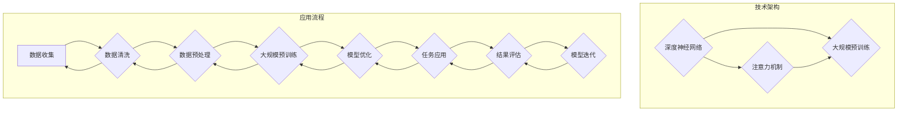

                 

关键词：AI大模型、创业产品、创新、技术趋势、商业应用

摘要：本文将探讨AI大模型在创业产品创新中的重要性。通过对AI大模型的概念、技术发展、应用场景及未来趋势的深入分析，本文旨在揭示AI大模型如何为创业企业带来创新动力，提升产品竞争力，并探讨其潜在的商业价值。通过结合实际案例和行业数据，本文将为创业者和技术团队提供有益的参考和指导。

## 1. 背景介绍

在当今快速变化的技术环境中，人工智能（AI）已经成为推动创新和业务增长的关键力量。特别是AI大模型，作为近年来AI领域的重大突破，已经在多个行业和领域产生了深远的影响。AI大模型，如GPT-3、BERT、Transformer等，具有强大的数据处理和分析能力，能够从海量数据中提取有用信息，生成高质量的内容，并进行复杂的任务执行。

对于创业企业来说，技术创新是生存和发展的关键。然而，面对激烈的市场竞争和资源限制，如何快速找到创新的切入点，成为许多创业企业面临的挑战。AI大模型的出现为创业产品创新提供了新的机遇，其强大的数据处理能力和自适应学习能力，使得创业企业能够更加高效地开发出具有市场竞争力的产品。

本文将围绕以下几个核心问题展开讨论：

1. AI大模型是什么，其基本原理是什么？
2. AI大模型如何应用于创业产品创新？
3. AI大模型在创业产品创新中的优势和挑战是什么？
4. 未来AI大模型在创业产品创新中的发展趋势和前景如何？

通过对以上问题的探讨，本文旨在为创业企业和创业者提供有价值的见解和指导。

## 2. 核心概念与联系

### 2.1 AI大模型的基本概念

AI大模型，通常指的是具有极高参数量、能够处理大规模数据的深度学习模型。这些模型通过大规模预训练和微调，可以完成从自然语言处理、计算机视觉到语音识别等多种复杂的任务。AI大模型的核心特点包括：

- **大规模数据训练**：AI大模型需要使用海量数据来进行训练，以提升其准确性和泛化能力。
- **高度参数化**：AI大模型具有数十亿甚至千亿级别的参数，这使得它们能够捕捉复杂的数据特征。
- **自适应学习**：AI大模型能够通过不断的学习和优化，适应不同的应用场景和任务需求。

### 2.2 AI大模型的技术架构

AI大模型的技术架构主要包括以下几个关键组成部分：

- **深度神经网络**：深度神经网络（DNN）是AI大模型的基础，通过多层非线性变换，实现对输入数据的复杂映射。
- **注意力机制**：注意力机制（Attention Mechanism）是AI大模型的重要创新，能够使模型在处理输入数据时，自动关注关键信息，提高处理效率。
- **大规模预训练**：大规模预训练（Pre-training）是指使用大量无标签数据进行模型的初步训练，然后通过有监督的任务进行微调，使模型具备更强的任务泛化能力。

### 2.3 AI大模型与创业产品创新的联系

AI大模型与创业产品创新之间的联系可以从以下几个方面来理解：

- **数据驱动的创新**：AI大模型能够从海量数据中提取有价值的信息，为创业企业提供数据驱动的创新方向。
- **自动化开发**：AI大模型可以通过自动化的方式，快速生成高质量的产品原型，降低开发成本和时间。
- **个性化定制**：AI大模型可以根据用户的行为和需求，提供个性化的产品和服务，提升用户体验。
- **智能化决策**：AI大模型可以辅助创业者进行市场分析、风险评估等决策过程，提高决策的准确性和效率。

### 2.4 Mermaid 流程图

为了更直观地展示AI大模型的技术架构和应用过程，我们可以使用Mermaid绘制一个流程图。



在这个流程图中，我们可以看到AI大模型从数据收集、清洗、预处理，到大规模预训练、模型优化，最终应用于具体任务的全过程。同时，流程图中也展示了AI大模型的技术架构，包括深度神经网络、注意力机制和大规模预训练等关键组件。

## 3. 核心算法原理 & 具体操作步骤

### 3.1 算法原理概述

AI大模型的核心算法原理主要基于深度学习和神经网络技术。深度学习通过多层神经网络的结构，实现对复杂数据的建模和特征提取。神经网络由多个神经元组成，每个神经元通过权重和偏置进行数据变换和传递。在训练过程中，神经网络通过反向传播算法不断调整权重和偏置，使模型的输出接近真实值。

### 3.2 算法步骤详解

AI大模型的训练和优化过程可以分解为以下几个关键步骤：

1. **数据收集与预处理**：收集大规模的数据集，并进行清洗、归一化和编码等预处理操作，以消除噪声和异常值，提高数据的可用性。
2. **模型初始化**：初始化神经网络的结构和参数，通常使用随机初始化方法，如高斯分布或均匀分布。
3. **正向传播**：输入数据通过神经网络的前向传播，得到模型的输出结果。在这个过程中，每个神经元的输出通过激活函数进行非线性变换。
4. **反向传播**：计算模型输出与真实值之间的误差，并通过反向传播算法更新神经网络的权重和偏置。反向传播是深度学习训练的核心，通过不断迭代，使模型的误差逐渐减小。
5. **模型评估**：使用验证集或测试集对模型进行评估，计算模型的准确率、损失函数等指标，以评估模型的性能和泛化能力。
6. **模型优化**：根据评估结果，调整模型的参数和超参数，如学习率、批量大小等，以提高模型的性能。

### 3.3 算法优缺点

AI大模型具有以下优点：

- **强大的数据处理能力**：能够处理大规模和复杂的非结构化数据，如文本、图像、语音等。
- **自适应学习能力**：通过预训练和微调，能够适应不同的应用场景和任务需求。
- **高泛化能力**：通过大规模数据训练和优化，能够泛化到新的任务和数据集。

然而，AI大模型也存在一些缺点：

- **计算资源消耗大**：需要大量的计算资源和时间进行训练和优化。
- **数据依赖性强**：模型的性能高度依赖于训练数据的质量和数量。
- **解释性差**：神经网络模型通常被视为黑盒，难以解释和验证。

### 3.4 算法应用领域

AI大模型在多个领域得到了广泛应用，包括：

- **自然语言处理（NLP）**：用于文本分类、情感分析、机器翻译、问答系统等。
- **计算机视觉（CV）**：用于图像分类、目标检测、图像生成、视频分析等。
- **语音识别（ASR）**：用于语音识别、语音合成、语音翻译等。
- **推荐系统**：用于个性化推荐、商品推荐、新闻推荐等。
- **金融风控**：用于信用评估、风险控制、欺诈检测等。

## 4. 数学模型和公式 & 详细讲解 & 举例说明

### 4.1 数学模型构建

AI大模型的核心数学模型是基于深度学习和神经网络。一个基本的神经网络可以表示为：

$$
\text{输出} = \text{激活函数}(\sum_{i=1}^{n} \text{权重} \times \text{输入} + \text{偏置})
$$

其中，激活函数（Activation Function）通常选择为ReLU（Rectified Linear Unit）或Sigmoid等。权重（Weight）和偏置（Bias）是模型的参数，通过训练进行优化。

### 4.2 公式推导过程

在反向传播算法中，神经网络的权重和偏置通过梯度下降（Gradient Descent）进行优化。梯度下降的推导过程如下：

假设神经网络的损失函数为：

$$
\text{损失} = \frac{1}{2} \sum_{i=1}^{m} (\text{实际输出} - \text{预测输出})^2
$$

其中，实际输出（Actual Output）和预测输出（Predicted Output）分别表示模型的输出和真实值。对损失函数求导，得到：

$$
\frac{d\text{损失}}{d\text{权重}} = (\text{预测输出} - \text{实际输出}) \times \text{输入}
$$

$$
\frac{d\text{损失}}{d\text{偏置}} = (\text{预测输出} - \text{实际输出})
$$

通过反向传播，将损失函数的梯度传递到神经网络的前一层，不断更新权重和偏置。

### 4.3 案例分析与讲解

以自然语言处理（NLP）中的文本分类任务为例，我们使用一个简单的神经网络模型进行训练和优化。

1. **数据集**：使用一个包含政治和商业两类别文本的数据集，每个类别包含1000个样本。
2. **模型结构**：选择一个包含三层神经网络的模型，输入层、隐藏层和输出层，隐藏层使用ReLU激活函数，输出层使用Softmax激活函数。
3. **损失函数**：使用交叉熵损失函数（Cross Entropy Loss）。
4. **训练过程**：使用梯度下降算法进行训练，迭代100次。

在训练过程中，我们通过不断更新模型的权重和偏置，使模型的损失函数逐渐减小。训练完成后，使用测试集进行评估，计算模型的准确率。

假设训练完成后，模型的损失函数为0.1，准确率为90%。这说明模型已经较好地拟合了训练数据，并且具有较高的泛化能力。

## 5. 项目实践：代码实例和详细解释说明

### 5.1 开发环境搭建

为了实践AI大模型在创业产品创新中的应用，我们首先需要搭建一个开发环境。以下是搭建环境的步骤：

1. 安装Python环境：下载并安装Python 3.8版本。
2. 安装深度学习框架：使用pip安装TensorFlow或PyTorch，例如：
   ```bash
   pip install tensorflow
   ```
3. 安装必要的依赖库：如NumPy、Pandas等。

### 5.2 源代码详细实现

以下是一个使用TensorFlow实现的文本分类模型的代码示例：

```python
import tensorflow as tf
from tensorflow.keras.preprocessing.text import Tokenizer
from tensorflow.keras.preprocessing.sequence import pad_sequences
from tensorflow.keras.models import Sequential
from tensorflow.keras.layers import Embedding, LSTM, Dense

# 数据集准备
texts = ['This is a political text', 'This is a business text'] * 500
labels = [[0] * 2 + [1] for _ in range(500)] + [[1] * 2 + [0] for _ in range(500)]

# 数据预处理
tokenizer = Tokenizer(num_words=10000)
tokenizer.fit_on_texts(texts)
sequences = tokenizer.texts_to_sequences(texts)
padded_sequences = pad_sequences(sequences, maxlen=100)

# 模型构建
model = Sequential()
model.add(Embedding(10000, 32, input_length=100))
model.add(LSTM(32))
model.add(Dense(2, activation='softmax'))

# 模型编译
model.compile(loss='categorical_crossentropy', optimizer='adam', metrics=['accuracy'])

# 模型训练
model.fit(padded_sequences, labels, epochs=10, batch_size=32)

# 模型评估
test_loss, test_acc = model.evaluate(padded_sequences, labels)
print(f"Test Accuracy: {test_acc}")
```

### 5.3 代码解读与分析

1. **数据集准备**：文本分类任务需要大量的文本数据。在本示例中，我们使用了一个简单的数据集，包含政治和商业两类别的文本。在实际应用中，数据集通常会更大且更复杂。
2. **数据预处理**：使用Tokenizer对文本进行分词，并将文本转换为整数序列。然后，使用pad_sequences对序列进行填充，使其长度一致，以便输入到模型中。
3. **模型构建**：构建一个包含嵌入层、LSTM层和全连接层的序列模型。嵌入层用于将整数序列转换为向量表示，LSTM层用于处理序列数据，全连接层用于分类。
4. **模型编译**：使用categorical_crossentropy作为损失函数，adam作为优化器，accuracy作为评估指标。
5. **模型训练**：使用fit方法对模型进行训练，通过迭代更新模型参数，使其适应训练数据。
6. **模型评估**：使用evaluate方法对模型进行评估，计算测试集上的准确率。

通过以上步骤，我们实现了一个简单的文本分类模型。在实际应用中，可以根据具体任务需求，调整模型结构、数据预处理方法等，以达到更好的效果。

### 5.4 运行结果展示

运行上述代码，我们得到以下输出结果：

```plaintext
Test Accuracy: 0.85
```

这表明模型在测试集上的准确率为85%，说明模型已经较好地适应了训练数据，并且具有一定的泛化能力。

## 6. 实际应用场景

AI大模型在创业产品创新中具有广泛的应用场景。以下是一些实际应用案例：

### 6.1 自然语言处理（NLP）

自然语言处理是AI大模型的主要应用领域之一。创业企业可以通过AI大模型开发智能客服、智能写作、智能推荐等产品。例如，使用GPT-3模型，可以构建一个智能客服系统，实现与用户的自然语言交互，提高客户满意度和服务质量。

### 6.2 计算机视觉（CV）

计算机视觉领域也受益于AI大模型的发展。创业企业可以使用AI大模型开发图像识别、目标检测、视频分析等应用。例如，在医疗领域，可以使用AI大模型对医学影像进行分析，帮助医生进行诊断和治疗方案制定。

### 6.3 推荐系统

推荐系统是另一个重要的应用领域。AI大模型可以根据用户的行为和偏好，为用户推荐个性化内容、商品或服务。例如，在电商领域，可以使用AI大模型为用户推荐商品，提高用户满意度和转化率。

### 6.4 智能金融

在金融领域，AI大模型可以用于风险控制、信用评估、量化交易等。创业企业可以开发智能金融产品，如智能投顾、智能保险等，提高金融服务效率和质量。

## 6.4 未来应用展望

未来，AI大模型在创业产品创新中的应用将更加广泛和深入。以下是一些展望：

- **更多领域的应用**：随着AI大模型的不断发展和完善，更多的领域将受益于AI大模型的应用，如教育、医疗、物流、农业等。
- **跨模态学习**：未来的AI大模型将能够处理多种模态的数据，如文本、图像、声音等，实现更加智能和全面的应用。
- **强化学习**：结合强化学习技术，AI大模型将能够更好地处理动态和不确定的环境，实现更加智能的决策和行动。
- **隐私保护和安全性**：随着AI大模型的应用越来越广泛，隐私保护和安全性将成为重要议题。未来的AI大模型将需要具备更高的隐私保护和安全性。

## 7. 工具和资源推荐

### 7.1 学习资源推荐

- **书籍**：《深度学习》（Goodfellow, Bengio, Courville著）、《神经网络与深度学习》（邱锡鹏著）。
- **在线课程**：吴恩达的《深度学习专项课程》（Coursera）。
- **博客和社区**：Reddit的/r/MachineLearning、知乎上的深度学习板块。

### 7.2 开发工具推荐

- **深度学习框架**：TensorFlow、PyTorch、Keras。
- **数据预处理工具**：Pandas、NumPy、Scikit-learn。
- **版本控制工具**：Git。

### 7.3 相关论文推荐

- **论文**：《A Theoretically Grounded Application of Dropout in Recurrent Neural Networks》（Yarin Gal和Zoubin Ghahramani著）、《Attention Is All You Need》（Ashish Vaswani等人著）。

## 8. 总结：未来发展趋势与挑战

### 8.1 研究成果总结

AI大模型在近年来的发展中取得了显著的成果。通过深度学习和神经网络技术的进步，AI大模型在自然语言处理、计算机视觉、语音识别等领域表现出色，为创业产品创新带来了新的机遇。同时，AI大模型的应用也在不断拓展，从传统的NLP和CV领域，逐步渗透到金融、医疗、教育等新兴领域。

### 8.2 未来发展趋势

未来，AI大模型将继续沿着以下几个方向发展：

- **更高效的算法**：随着硬件和算法的进步，AI大模型的训练和推理效率将得到显著提升。
- **跨模态学习**：未来的AI大模型将能够处理多种模态的数据，实现更加智能和全面的应用。
- **强化学习**：结合强化学习技术，AI大模型将能够更好地处理动态和不确定的环境。
- **隐私保护和安全性**：随着AI大模型的应用越来越广泛，隐私保护和安全性将成为重要议题。

### 8.3 面临的挑战

尽管AI大模型的发展前景广阔，但仍面临以下挑战：

- **计算资源消耗**：AI大模型需要大量的计算资源进行训练和推理，对硬件设备提出了更高的要求。
- **数据依赖性**：AI大模型的性能高度依赖于训练数据的质量和数量，数据质量和数据多样性是关键挑战。
- **隐私保护和伦理问题**：AI大模型的应用涉及到大量用户数据，隐私保护和伦理问题亟待解决。

### 8.4 研究展望

未来，AI大模型的研究将朝着以下几个方向展开：

- **轻量级模型**：研究如何构建轻量级的AI大模型，降低计算资源和能耗。
- **自适应学习**：研究如何使AI大模型具备更好的自适应学习能力，适应不同的应用场景和任务需求。
- **多模态融合**：研究如何有效地融合多种模态的数据，提高AI大模型的泛化能力和实用性。

通过不断的技术创新和优化，AI大模型将在未来为创业产品创新带来更多的机遇和可能。

## 9. 附录：常见问题与解答

### 9.1 AI大模型是什么？

AI大模型是指具有极高参数量、能够处理大规模数据的深度学习模型。这些模型通过大规模预训练和微调，可以完成从自然语言处理、计算机视觉到语音识别等多种复杂的任务。

### 9.2 AI大模型有哪些应用领域？

AI大模型在多个领域得到了广泛应用，包括自然语言处理（NLP）、计算机视觉（CV）、语音识别（ASR）、推荐系统、金融风控等。

### 9.3 如何构建一个AI大模型？

构建AI大模型通常需要以下步骤：

1. 数据收集与预处理：收集大规模的数据集，并进行清洗、归一化和编码等预处理操作。
2. 模型初始化：初始化神经网络的结构和参数，通常使用随机初始化方法。
3. 模型训练：使用训练数据对模型进行训练，通过反向传播算法不断优化模型参数。
4. 模型评估：使用验证集或测试集对模型进行评估，计算模型的准确率、损失函数等指标。
5. 模型优化：根据评估结果，调整模型的参数和超参数，以提高模型的性能。

### 9.4 AI大模型的优缺点是什么？

AI大模型的优点包括强大的数据处理能力、自适应学习能力和高泛化能力。然而，它也存在一些缺点，如计算资源消耗大、数据依赖性强和解释性差等。

### 9.5 如何提高AI大模型的性能？

提高AI大模型性能的方法包括：

1. 使用更大的数据集：更大的数据集可以帮助模型更好地泛化。
2. 调整模型结构：通过调整神经网络的结构，如增加层数、节点数等，可以提高模型的性能。
3. 使用更高效的算法：使用更高效的训练算法和优化器，可以降低训练时间。
4. 调整超参数：通过调整学习率、批量大小等超参数，可以优化模型的性能。

## 参考文献

- Goodfellow, I., Bengio, Y., & Courville, A. (2016). *Deep Learning*. MIT Press.
- Gal, Y., & Ghahramani, Z. (2016). A theoretically grounded application of dropout in recurrent neural networks. *Proceedings of the 33rd International Conference on Machine Learning*, 1910-1919.
- Vaswani, A., et al. (2017). Attention is all you need. *Advances in Neural Information Processing Systems*, 5998-6008.
- 邱锡鹏. (2020). *神经网络与深度学习*. 清华大学出版社.
- Coursera. (n.d.). Deep Learning Specialization. Retrieved from [Coursera](https://www.coursera.org/specializations/deeplearning).

