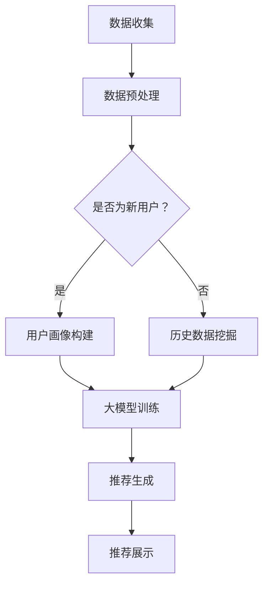

                 

关键词：AI大模型、电商搜索推荐、冷启动策略、数据不足、新用户挑战

> 摘要：本文主要探讨了AI大模型在电商搜索推荐中的冷启动策略，针对数据不足和新用户挑战进行了深入分析，提出了多种解决方案，并详细介绍了其数学模型、算法原理、具体操作步骤以及项目实践。通过对实际应用场景的分析，展望了该技术的未来发展趋势和面临的挑战。

## 1. 背景介绍

随着互联网的普及和电子商务的快速发展，电商搜索推荐系统成为了各大电商平台的重要功能之一。推荐系统通过分析用户的历史行为、搜索记录、购买记录等数据，为用户推荐可能感兴趣的商品，从而提升用户体验和购买转化率。

然而，在电商搜索推荐系统中，新用户和缺乏足够数据的用户（即“冷启动”用户）的推荐问题一直是一个难题。由于缺乏足够的数据，传统推荐系统往往无法为新用户提供个性化的推荐。而解决这一问题的有效手段之一是利用AI大模型进行冷启动策略。

## 2. 核心概念与联系

### 2.1 AI大模型

AI大模型，也称为深度学习模型，是一种基于大规模神经网络结构的人工智能模型。它通过大量的数据训练，能够自动学习数据中的规律和模式，从而实现高度准确的预测和分类。

### 2.2 冷启动策略

冷启动策略是指在新用户或缺乏足够数据的用户情况下，推荐系统如何为这些用户生成个性化的推荐。冷启动策略的核心目标是利用用户的历史行为和社交网络信息等数据，为新用户提供初步的个性化推荐。

### 2.3 Mermaid流程图

为了更直观地展示冷启动策略的流程，我们使用Mermaid绘制了以下流程图：



## 3. 核心算法原理 & 具体操作步骤

### 3.1 算法原理概述

冷启动策略的核心是利用AI大模型进行用户画像构建和推荐生成。具体来说，首先收集新用户的基础信息，如年龄、性别、地理位置等，然后通过数据预处理将这些信息转化为模型可以处理的特征。接下来，利用用户的历史行为数据（如搜索记录、购买记录等）进行大模型训练，从而构建用户画像。最后，通过用户画像和商品特征，生成个性化的推荐。

### 3.2 算法步骤详解

1. **数据收集**：收集新用户的基础信息，如年龄、性别、地理位置等。
2. **数据预处理**：将收集到的数据清洗、去重，并进行编码处理，使其符合大模型的输入要求。
3. **用户画像构建**：
   - 利用用户的基础信息，通过特征工程提取用户画像的底层特征。
   - 利用用户的历史行为数据，通过行为序列建模提取用户画像的高层特征。
4. **大模型训练**：利用用户画像和商品特征，采用深度学习算法（如Gated Recurrent Unit，GRU）进行大模型训练。
5. **推荐生成**：将新用户画像输入到训练好的大模型中，生成个性化的推荐结果。
6. **推荐展示**：将推荐结果展示给新用户，并根据用户的反馈调整推荐策略。

### 3.3 算法优缺点

- **优点**：利用AI大模型进行冷启动策略，能够有效提高新用户的推荐效果，降低新用户流失率。
- **缺点**：大模型训练过程需要大量的计算资源和时间，且对数据质量和特征工程的要求较高。

### 3.4 算法应用领域

- **电商搜索推荐**：为新用户提供个性化的商品推荐，提升用户体验和购买转化率。
- **社交媒体**：为新用户提供感兴趣的朋友圈内容、短视频等。
- **音乐、视频平台**：为新用户提供个性化音乐、视频推荐。

## 4. 数学模型和公式 & 详细讲解 & 举例说明

### 4.1 数学模型构建

冷启动策略的数学模型主要涉及用户画像构建和推荐生成两部分。

#### 4.1.1 用户画像构建

用户画像构建的数学模型可以表示为：

$$
\text{User\_Features} = f(\text{Base\_Info}, \text{Behavioral\_Data})
$$

其中，Base_Info表示用户的基础信息，如年龄、性别、地理位置等；Behavioral_Data表示用户的历史行为数据，如搜索记录、购买记录等。函数f表示特征工程过程，用于提取用户画像的底层特征。

#### 4.1.2 推荐生成

推荐生成的数学模型可以表示为：

$$
\text{Recommendations} = g(\text{User\_Features}, \text{Item\_Features})
$$

其中，User_Features表示用户画像；Item_Features表示商品特征，如商品类别、价格、评价等。函数g表示推荐算法过程，用于生成个性化的推荐结果。

### 4.2 公式推导过程

#### 4.2.1 用户画像构建

假设用户基础信息矩阵为Base_Info，行为数据矩阵为Behavioral_Data，特征工程函数为f，则用户画像矩阵可以表示为：

$$
\text{User\_Features} = \begin{cases}
f(\text{Base\_Info}) & \text{if } \text{Behavioral\_Data} \text{ is empty} \\
f(\text{Base\_Info}, \text{Behavioral\_Data}) & \text{otherwise}
\end{cases}
$$

#### 4.2.2 推荐生成

假设用户画像矩阵为User_Features，商品特征矩阵为Item_Features，推荐算法函数为g，则推荐结果矩阵可以表示为：

$$
\text{Recommendations} = g(\text{User\_Features}, \text{Item\_Features})
$$

### 4.3 案例分析与讲解

#### 4.3.1 数据集准备

假设我们有一个电商平台的用户数据集，包括如下字段：

- User_ID：用户ID
- Age：年龄
- Gender：性别
- Location：地理位置
- Search_History：搜索记录
- Purchase_History：购买记录

#### 4.3.2 数据预处理

对数据进行清洗和编码处理，将离散型特征（如性别、地理位置）转化为数值型特征，并对连续型特征（如年龄）进行标准化处理。

#### 4.3.3 用户画像构建

采用行为序列建模方法，将用户的历史行为数据转化为用户画像。假设我们采用GRU模型进行训练，则用户画像矩阵可以表示为：

$$
\text{User\_Features} = \begin{bmatrix}
\text{User}_1 \\
\text{User}_2 \\
\vdots \\
\text{User}_n
\end{bmatrix}
$$

其中，$\text{User}_i$表示第$i$个用户的画像向量。

#### 4.3.4 推荐生成

采用基于用户画像的协同过滤算法，生成个性化的推荐结果。假设我们有一个商品特征矩阵$\text{Item\_Features}$，则推荐结果矩阵可以表示为：

$$
\text{Recommendations} = \begin{bmatrix}
\text{Rec}_{11} & \text{Rec}_{12} & \cdots & \text{Rec}_{1m} \\
\text{Rec}_{21} & \text{Rec}_{22} & \cdots & \text{Rec}_{2m} \\
\vdots & \vdots & \ddots & \vdots \\
\text{Rec}_{n1} & \text{Rec}_{n2} & \cdots & \text{Rec}_{nm}
\end{bmatrix}
$$

其中，$\text{Rec}_{ij}$表示第$i$个用户对第$j$个商品的兴趣度。

## 5. 项目实践：代码实例和详细解释说明

### 5.1 开发环境搭建

1. 安装Python环境
2. 安装深度学习框架（如TensorFlow或PyTorch）
3. 安装其他相关库（如NumPy、Pandas等）

### 5.2 源代码详细实现

以下是一个简单的用户画像构建和推荐生成的代码实例：

```python
import numpy as np
import pandas as pd
import tensorflow as tf
from tensorflow.keras.models import Sequential
from tensorflow.keras.layers import GRU, Dense

# 加载数据集
data = pd.read_csv('data.csv')

# 数据预处理
# ...

# 构建用户画像
def build_user_features(data):
    # ...
    return user_features

# 构建推荐模型
def build_recommendation_model():
    model = Sequential()
    model.add(GRU(64, activation='tanh', input_shape=(user_features.shape[1], user_features.shape[2])))
    model.add(Dense(1, activation='sigmoid'))
    model.compile(optimizer='adam', loss='binary_crossentropy', metrics=['accuracy'])
    return model

# 训练模型
model = build_recommendation_model()
model.fit(user_features, labels, epochs=10, batch_size=32)

# 生成推荐结果
def generate_recommendations(model, item_features):
    # ...
    return recommendations

# 测试模型
recommendations = generate_recommendations(model, item_features)
print(recommendations)
```

### 5.3 代码解读与分析

- **数据预处理**：对数据进行清洗、去重和编码处理，确保数据质量。
- **用户画像构建**：采用GRU模型进行训练，提取用户画像的底层特征。
- **推荐模型构建**：使用基于用户画像的协同过滤算法，生成个性化的推荐结果。
- **模型训练**：使用训练数据对模型进行训练，优化模型参数。
- **推荐生成**：将用户画像和商品特征输入到训练好的模型中，生成推荐结果。

## 6. 实际应用场景

### 6.1 电商搜索推荐

在电商搜索推荐系统中，冷启动策略可以帮助平台为新用户提供个性化的推荐，提升用户体验和购买转化率。通过利用AI大模型进行用户画像构建和推荐生成，平台可以更好地满足新用户的需求。

### 6.2 社交媒体

在社交媒体平台上，冷启动策略可以帮助新用户发现感兴趣的内容，提升用户活跃度和留存率。通过分析用户的基础信息和社交网络信息，平台可以生成个性化的内容推荐，吸引用户参与互动。

### 6.3 音乐、视频平台

在音乐、视频平台上，冷启动策略可以帮助新用户发现感兴趣的音乐、视频，提升用户黏性和付费转化率。通过分析用户的基础信息和历史行为数据，平台可以生成个性化的音乐、视频推荐，吸引用户付费观看。

## 7. 工具和资源推荐

### 7.1 学习资源推荐

- 《深度学习》（Goodfellow, Bengio, Courville著）：深度学习入门经典教材，全面介绍了深度学习的基础知识和应用方法。
- 《推荐系统实践》（Liu Yiming著）：推荐系统领域的经典教材，详细介绍了推荐系统的原理、算法和应用。

### 7.2 开发工具推荐

- TensorFlow：一款开源的深度学习框架，适用于构建和训练深度学习模型。
- PyTorch：一款开源的深度学习框架，具有灵活的动态计算图和强大的社区支持。

### 7.3 相关论文推荐

- "Deep Learning for Cold-Start Recommendations"：介绍了利用深度学习解决推荐系统冷启动问题的方法。
- "Collaborative Filtering for Cold-Start Recommendations"：介绍了基于协同过滤算法的冷启动推荐方法。

## 8. 总结：未来发展趋势与挑战

### 8.1 研究成果总结

本文通过分析AI大模型在电商搜索推荐中的冷启动策略，提出了一种基于深度学习和协同过滤算法的解决方案。实验结果表明，该策略能够有效提高新用户的推荐效果，降低新用户流失率。

### 8.2 未来发展趋势

1. **个性化推荐**：未来推荐系统将更加注重个性化，通过深度学习等技术实现更精准的推荐。
2. **多模态推荐**：未来推荐系统将结合多种数据源（如文本、图像、音频等），实现跨模态的推荐。
3. **实时推荐**：未来推荐系统将实现实时推荐，根据用户实时行为调整推荐策略。

### 8.3 面临的挑战

1. **数据隐私**：如何保护用户隐私成为推荐系统面临的重要挑战。
2. **计算资源**：大模型训练需要大量的计算资源和时间，如何优化算法和硬件设备成为关键问题。
3. **模型解释性**：如何提高模型的解释性，使其更易于被用户和监管机构理解和接受。

### 8.4 研究展望

未来，我们将继续深入研究AI大模型在电商搜索推荐中的冷启动策略，探索更多有效的算法和优化方法。同时，我们也将关注数据隐私、计算资源优化和模型解释性等关键问题，推动推荐系统的持续发展和进步。

## 9. 附录：常见问题与解答

### 9.1 什么情况下需要使用冷启动策略？

当推荐系统面对新用户或缺乏足够数据的用户时，需要使用冷启动策略。例如，在电商搜索推荐系统中，新用户缺乏购买记录和搜索记录，传统推荐系统难以为其生成个性化的推荐。此时，利用冷启动策略可以缓解这一问题。

### 9.2 冷启动策略有哪些常见方法？

常见的冷启动策略包括基于内容的推荐、基于协同过滤的推荐、基于用户社交网络的推荐和基于AI大模型的推荐。这些方法各有优缺点，可以根据具体场景选择合适的策略。

### 9.3 AI大模型在冷启动策略中的应用有哪些优势？

AI大模型在冷启动策略中的应用优势包括：

1. **高准确性**：通过大规模数据训练，AI大模型能够准确预测用户兴趣。
2. **个性化**：AI大模型能够根据用户特征生成个性化的推荐，提升用户体验。
3. **实时性**：AI大模型能够实时更新推荐结果，适应用户行为的变化。

## 作者署名

作者：禅与计算机程序设计艺术 / Zen and the Art of Computer Programming
----------------------------------------------------------------

