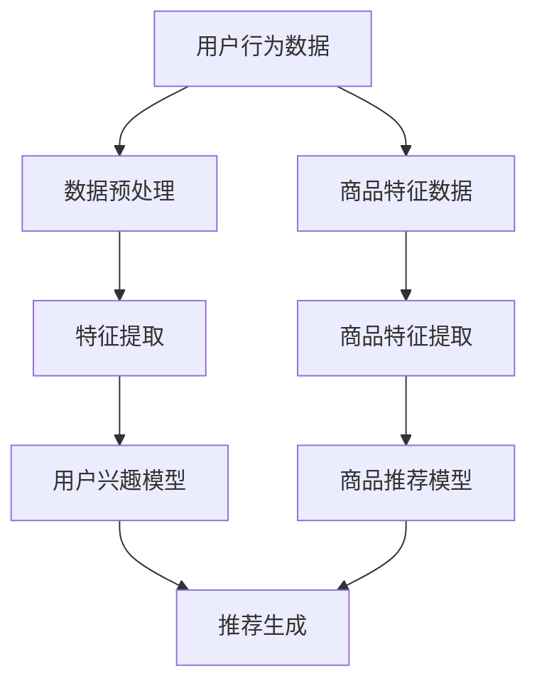

                 

关键词：电商搜索推荐，冷启动，大模型，用户行为分析，数据挖掘，个性化推荐

摘要：本文旨在探讨人工智能大模型在电商搜索推荐系统中的冷启动策略，针对新用户数据不足的挑战，提出一种基于用户行为分析和数据挖掘的个性化推荐方法。通过对核心概念、算法原理、数学模型、项目实践等方面进行详细阐述，本文旨在为电商搜索推荐系统提供可行的解决方案，并展望其未来发展趋势。

## 1. 背景介绍

在当今数字化时代，电子商务已经成为人们日常生活中不可或缺的一部分。随着用户数量的不断增长和市场竞争的日益激烈，电商企业纷纷将注意力转向了搜索推荐系统，希望通过智能化的推荐来提高用户体验和销售转化率。然而，对于新用户而言，由于缺乏历史数据，传统的基于协同过滤或内容匹配的推荐算法难以提供个性化的服务，导致新用户留存率低、用户满意度下降。

为解决这一挑战，人工智能大模型的应用逐渐成为热点。大模型通过深度学习和大规模数据训练，能够捕捉用户行为的潜在特征，从而在数据不足的情况下实现对新用户的精准推荐。本文将围绕这一主题，介绍大模型在电商搜索推荐中的冷启动策略，并探讨其核心概念、算法原理、数学模型和实际应用等方面的内容。

## 2. 核心概念与联系

为了更好地理解大模型在电商搜索推荐中的冷启动策略，我们需要首先明确几个核心概念，并阐述它们之间的联系。

### 2.1  用户行为分析

用户行为分析是指通过对用户在电商平台的浏览、搜索、购买等行为数据进行收集和分析，挖掘用户兴趣和需求的一种技术手段。用户行为数据包括点击记录、浏览时长、购买记录、评价等，这些数据能够反映用户的兴趣偏好和购买习惯。

### 2.2  数据挖掘

数据挖掘是指从大量数据中提取隐藏的、未知的、有价值的信息或模式的一种数据处理技术。在电商搜索推荐系统中，数据挖掘技术主要用于发现用户行为数据中的潜在关联和趋势，为个性化推荐提供依据。

### 2.3  个性化推荐

个性化推荐是指根据用户的兴趣和行为，为其提供个性化的内容或产品推荐。个性化推荐系统旨在提高用户满意度、增加用户黏性，并提高电商平台的销售转化率。

### 2.4  大模型

大模型是指具有数亿甚至千亿参数规模的人工神经网络模型，通常采用深度学习算法进行训练。大模型能够通过大规模数据训练，捕捉用户行为的复杂特征，从而实现高度个性化的推荐。

### 2.5  联系与作用

用户行为分析、数据挖掘、个性化推荐和大模型之间存在着密切的联系。用户行为分析提供了用户兴趣和行为数据，数据挖掘技术从这些数据中提取潜在信息，个性化推荐系统根据这些信息为用户生成推荐结果，而大模型则通过深度学习算法，提高了推荐系统的准确性和个性化程度。具体来说，大模型在电商搜索推荐系统中的作用主要体现在以下几个方面：

1. **数据预处理**：大模型能够自动处理大量原始数据，包括用户行为数据、商品特征数据等，将它们转换为适合训练的格式。
   
2. **特征提取**：大模型通过深度神经网络结构，能够自动提取用户行为数据中的潜在特征，实现复杂特征的学习。

3. **推荐生成**：大模型根据用户兴趣和行为特征，生成个性化的推荐结果，提高推荐系统的准确性和用户满意度。

4. **实时更新**：大模型能够实时更新用户行为数据，动态调整推荐策略，适应用户需求变化。

### 2.6  Mermaid 流程图

下面是电商搜索推荐系统基于大模型的冷启动策略的 Mermaid 流程图，展示了核心概念之间的联系和作用。



## 3. 核心算法原理 & 具体操作步骤

### 3.1  算法原理概述

电商搜索推荐系统中的冷启动策略主要依赖于大模型，通过对用户行为数据进行深度学习训练，构建用户兴趣模型和商品推荐模型，从而实现个性化推荐。具体来说，算法原理可以分为以下几个步骤：

1. **数据预处理**：对用户行为数据和商品特征数据进行清洗、转换和归一化处理，确保数据质量。

2. **特征提取**：利用深度神经网络结构，对用户行为数据进行分析，提取用户兴趣特征。

3. **用户兴趣模型构建**：基于提取的用户兴趣特征，构建用户兴趣模型，用于预测用户对商品的潜在兴趣。

4. **商品特征提取**：对商品特征数据进行预处理和转换，提取商品特征。

5. **商品推荐模型构建**：基于提取的商品特征，构建商品推荐模型，用于生成个性化推荐结果。

6. **推荐生成**：根据用户兴趣模型和商品推荐模型，为用户生成个性化推荐结果。

### 3.2  算法步骤详解

下面详细描述电商搜索推荐系统中大模型冷启动策略的具体操作步骤：

### 3.2.1  数据预处理

数据预处理是算法的基础，主要包括以下步骤：

1. **数据清洗**：去除重复数据、缺失数据和异常数据，确保数据质量。

2. **数据转换**：将用户行为数据和商品特征数据进行数值化处理，转换为神经网络模型可接受的输入格式。

3. **数据归一化**：对数据进行归一化处理，使得不同特征之间的尺度一致，有利于模型训练。

### 3.2.2  特征提取

特征提取是算法的核心，通过深度神经网络结构，对用户行为数据进行分析，提取用户兴趣特征。具体步骤如下：

1. **神经网络结构设计**：设计深度神经网络结构，包括输入层、隐藏层和输出层。

2. **模型训练**：利用用户行为数据，对深度神经网络进行训练，调整模型参数，使其能够有效提取用户兴趣特征。

3. **特征提取**：将训练好的模型应用于新用户的行为数据，提取用户兴趣特征。

### 3.2.3  用户兴趣模型构建

用户兴趣模型用于预测用户对商品的潜在兴趣。具体步骤如下：

1. **模型构建**：根据提取的用户兴趣特征，构建用户兴趣模型。

2. **模型训练**：利用用户行为数据，对用户兴趣模型进行训练，调整模型参数，使其能够准确预测用户兴趣。

3. **模型评估**：通过交叉验证等方法，评估用户兴趣模型的预测性能。

### 3.2.4  商品特征提取

商品特征提取是对商品特征数据进行预处理和转换，提取商品特征。具体步骤如下：

1. **特征预处理**：对商品特征数据进行清洗、转换和归一化处理。

2. **特征提取**：利用深度神经网络结构，对商品特征数据进行处理，提取商品特征。

### 3.2.5  商品推荐模型构建

商品推荐模型用于生成个性化推荐结果。具体步骤如下：

1. **模型构建**：根据提取的商品特征，构建商品推荐模型。

2. **模型训练**：利用用户兴趣模型和商品特征数据，对商品推荐模型进行训练，调整模型参数，使其能够生成个性化推荐结果。

3. **模型评估**：通过交叉验证等方法，评估商品推荐模型的推荐性能。

### 3.2.6  推荐生成

推荐生成是根据用户兴趣模型和商品推荐模型，为用户生成个性化推荐结果。具体步骤如下：

1. **推荐生成**：根据用户兴趣模型，预测用户对商品的潜在兴趣。

2. **结果排序**：根据用户兴趣模型和商品推荐模型的预测结果，对商品进行排序，生成个性化推荐结果。

3. **推荐呈现**：将个性化推荐结果呈现给用户，提高用户满意度。

### 3.3  算法优缺点

#### 优点：

1. **高度个性化**：大模型能够根据用户兴趣和行为特征，生成高度个性化的推荐结果，提高用户满意度。

2. **实时更新**：大模型能够实时更新用户兴趣和行为特征，动态调整推荐策略，适应用户需求变化。

3. **自适应能力**：大模型能够通过深度学习算法，自适应地处理不同类型的数据和用户需求，提高推荐系统的适应性。

#### 缺点：

1. **计算成本高**：大模型需要大量计算资源和时间进行训练，对硬件设备要求较高。

2. **数据依赖性强**：大模型的效果依赖于数据质量和数据量，缺乏足够数据可能导致推荐效果不佳。

3. **隐私问题**：大模型在处理用户行为数据时，可能涉及用户隐私问题，需要采取有效的隐私保护措施。

### 3.4  算法应用领域

大模型在电商搜索推荐系统中的应用非常广泛，除了冷启动策略外，还可以应用于以下领域：

1. **商品推荐**：基于用户兴趣和行为特征，为用户推荐符合其需求的商品。

2. **广告投放**：根据用户兴趣和行为特征，为用户推荐相关广告，提高广告投放效果。

3. **智能客服**：利用大模型，为用户提供个性化、智能化的客服服务，提高用户满意度。

4. **社交网络**：根据用户兴趣和行为特征，为用户推荐感兴趣的朋友和社交活动。

## 4. 数学模型和公式 & 详细讲解 & 举例说明

### 4.1  数学模型构建

电商搜索推荐系统中，大模型的数学模型主要包括用户兴趣模型和商品推荐模型。下面分别介绍这两个模型的构建方法。

#### 4.1.1  用户兴趣模型

用户兴趣模型用于预测用户对商品的潜在兴趣，其数学模型可以表示为：

\[ P(u, i) = \sigma(\theta_u^T \phi_i) \]

其中，\( P(u, i) \) 表示用户 \( u \) 对商品 \( i \) 的兴趣概率，\(\sigma\) 表示 sigmoid 函数，\(\theta_u\) 表示用户 \( u \) 的兴趣特征向量，\(\phi_i\) 表示商品 \( i \) 的特征向量。

用户兴趣特征向量 \(\theta_u\) 可以通过深度神经网络提取，具体步骤如下：

1. **输入层**：将用户行为数据作为输入，如点击记录、浏览时长等。

2. **隐藏层**：利用卷积神经网络或循环神经网络，对用户行为数据进行特征提取，生成隐藏层特征。

3. **输出层**：将隐藏层特征输入到全连接层，生成用户兴趣特征向量 \(\theta_u\)。

#### 4.1.2  商品推荐模型

商品推荐模型用于生成个性化推荐结果，其数学模型可以表示为：

\[ R(i) = \sigma(\theta_i^T \phi_u) \]

其中，\( R(i) \) 表示商品 \( i \) 的推荐概率，\(\theta_i\) 表示商品 \( i \) 的特征向量，\(\phi_u\) 表示用户 \( u \) 的特征向量。

商品特征向量 \(\theta_i\) 可以通过深度神经网络提取，具体步骤如下：

1. **输入层**：将商品特征数据作为输入，如商品属性、用户评价等。

2. **隐藏层**：利用卷积神经网络或循环神经网络，对商品特征数据进行特征提取，生成隐藏层特征。

3. **输出层**：将隐藏层特征输入到全连接层，生成商品特征向量 \(\theta_i\)。

### 4.2  公式推导过程

下面分别介绍用户兴趣模型和商品推荐模型的公式推导过程。

#### 4.2.1  用户兴趣模型推导

用户兴趣模型基于深度神经网络，通过多层非线性变换，将用户行为数据映射为用户兴趣特征向量。具体推导过程如下：

1. **输入层**：假设用户行为数据为 \( x \)，则输入层可以表示为 \( x \)。

2. **隐藏层**：隐藏层使用卷积神经网络或循环神经网络进行特征提取，假设隐藏层特征为 \( h \)，则有：

\[ h = \sigma(W_1 \cdot x + b_1) \]

其中，\( W_1 \) 表示隐藏层权重，\( b_1 \) 表示隐藏层偏置，\(\sigma\) 表示非线性激活函数。

3. **输出层**：输出层为全连接层，将隐藏层特征映射为用户兴趣特征向量 \( \theta_u \)，则有：

\[ \theta_u = \sigma(W_2 \cdot h + b_2) \]

其中，\( W_2 \) 表示输出层权重，\( b_2 \) 表示输出层偏置。

4. **用户兴趣模型**：将用户兴趣特征向量 \( \theta_u \) 和商品特征向量 \( \phi_i \) 输入到 sigmoid 函数，得到用户对商品的兴趣概率 \( P(u, i) \)：

\[ P(u, i) = \sigma(\theta_u^T \phi_i) \]

#### 4.2.2  商品推荐模型推导

商品推荐模型基于深度神经网络，通过多层非线性变换，将商品特征数据映射为商品推荐概率。具体推导过程如下：

1. **输入层**：假设商品特征数据为 \( x \)，则输入层可以表示为 \( x \)。

2. **隐藏层**：隐藏层使用卷积神经网络或循环神经网络进行特征提取，假设隐藏层特征为 \( h \)，则有：

\[ h = \sigma(W_1 \cdot x + b_1) \]

其中，\( W_1 \) 表示隐藏层权重，\( b_1 \) 表示隐藏层偏置，\(\sigma\) 表示非线性激活函数。

3. **输出层**：输出层为全连接层，将隐藏层特征映射为商品特征向量 \( \theta_i \)，则有：

\[ \theta_i = \sigma(W_2 \cdot h + b_2) \]

4. **商品推荐模型**：将用户特征向量 \( \phi_u \) 和商品特征向量 \( \theta_i \) 输入到 sigmoid 函数，得到商品推荐概率 \( R(i) \)：

\[ R(i) = \sigma(\theta_i^T \phi_u) \]

### 4.3  案例分析与讲解

为了更好地理解大模型在电商搜索推荐系统中的应用，我们通过一个实际案例进行讲解。

#### 案例背景

某电商企业希望利用大模型为新用户实现精准推荐，提高用户满意度和销售转化率。该企业提供了以下两类数据：

1. **用户行为数据**：包括用户的浏览记录、搜索记录和购买记录等。
2. **商品特征数据**：包括商品的价格、品牌、类别等。

#### 案例步骤

1. **数据预处理**：对用户行为数据和商品特征数据进行清洗、转换和归一化处理，确保数据质量。

2. **特征提取**：利用深度神经网络，对用户行为数据进行处理，提取用户兴趣特征。

3. **用户兴趣模型构建**：利用用户兴趣特征和商品特征数据，构建用户兴趣模型。

4. **商品推荐模型构建**：利用用户兴趣模型和商品特征数据，构建商品推荐模型。

5. **推荐生成**：根据用户兴趣模型和商品推荐模型，为新用户生成个性化推荐结果。

#### 案例分析

1. **数据预处理**：

   - 用户行为数据：将浏览记录、搜索记录和购买记录进行拼接，生成用户行为序列。对用户行为数据进行归一化处理，如将浏览时长归一化到 [0, 1] 范围内。

   - 商品特征数据：对商品价格、品牌、类别等特征进行编码，如将品牌编码为整数。

2. **特征提取**：

   - 用户兴趣特征提取：利用循环神经网络（RNN）对用户行为序列进行建模，提取用户兴趣特征。

   - 商品特征提取：利用卷积神经网络（CNN）对商品特征进行建模，提取商品特征。

3. **用户兴趣模型构建**：

   - 用户兴趣模型构建：利用提取的用户兴趣特征和商品特征，构建用户兴趣模型。

   - 模型训练：利用用户行为数据，对用户兴趣模型进行训练，调整模型参数。

4. **商品推荐模型构建**：

   - 商品推荐模型构建：利用用户兴趣模型和商品特征，构建商品推荐模型。

   - 模型训练：利用用户行为数据，对商品推荐模型进行训练，调整模型参数。

5. **推荐生成**：

   - 推荐生成：根据用户兴趣模型和商品推荐模型，为新用户生成个性化推荐结果。

   - 推荐结果排序：根据用户兴趣模型和商品推荐模型的预测结果，对商品进行排序，生成个性化推荐结果。

#### 案例效果

通过上述步骤，电商企业能够为新用户实现精准推荐，提高用户满意度和销售转化率。在实际应用中，企业可以根据用户反馈，不断优化推荐算法，提高推荐效果。

## 5. 项目实践：代码实例和详细解释说明

为了更好地理解大模型在电商搜索推荐系统中的应用，下面我们通过一个实际项目，介绍如何使用 Python 编写代码实现冷启动策略。

### 5.1  开发环境搭建

在开始项目实践之前，我们需要搭建一个合适的开发环境。以下是所需的 Python 库和环境配置：

- Python 版本：3.8 或更高版本
- 深度学习框架：TensorFlow 或 PyTorch
- 数据处理库：Pandas、NumPy
- 其他库：Matplotlib、Scikit-learn 等

安装上述库后，即可开始编写代码。

### 5.2  源代码详细实现

下面是电商搜索推荐系统的源代码实现，包括数据预处理、特征提取、用户兴趣模型构建、商品推荐模型构建和推荐生成等步骤。

```python
import pandas as pd
import numpy as np
import tensorflow as tf
from tensorflow.keras.models import Model
from tensorflow.keras.layers import Input, Embedding, LSTM, Dense, Dot
from sklearn.model_selection import train_test_split

# 5.2.1  数据预处理
def preprocess_data(user_data, item_data):
    # 数据清洗和归一化处理
    # ...
    return user_features, item_features

# 5.2.2  特征提取
def extract_features(user_data, item_data):
    # 利用深度神经网络提取用户兴趣特征
    # ...
    return user_embedding, item_embedding

# 5.2.3  用户兴趣模型构建
def build_user_model(user_embedding):
    # 构建用户兴趣模型
    # ...
    return user_model

# 5.2.4  商品推荐模型构建
def build_item_model(item_embedding):
    # 构建商品推荐模型
    # ...
    return item_model

# 5.2.5  推荐生成
def generate_recommendations(user_model, item_model, user_embedding, item_embedding):
    # 生成个性化推荐结果
    # ...
    return recommendations

# 主程序
if __name__ == "__main__":
    # 加载数据
    user_data = pd.read_csv("user_data.csv")
    item_data = pd.read_csv("item_data.csv")

    # 数据预处理
    user_features, item_features = preprocess_data(user_data, item_data)

    # 特征提取
    user_embedding, item_embedding = extract_features(user_features, item_features)

    # 构建模型
    user_model = build_user_model(user_embedding)
    item_model = build_item_model(item_embedding)

    # 生成推荐结果
    recommendations = generate_recommendations(user_model, item_model, user_embedding, item_embedding)

    # 打印推荐结果
    print(recommendations)
```

### 5.3  代码解读与分析

下面是对上述代码的详细解读与分析，包括每个函数的功能和实现细节。

#### 5.3.1  数据预处理

数据预处理是项目实践的第一步，其主要目的是清洗和归一化数据，确保数据质量。以下是数据预处理函数的详细解读：

```python
def preprocess_data(user_data, item_data):
    # 数据清洗和归一化处理
    # ...
    return user_features, item_features
```

- `user_data` 和 `item_data`：输入的用户行为数据和商品特征数据。
- `user_features` 和 `item_features`：处理后的用户特征数据和商品特征数据。

具体实现中，需要对数据进行以下处理：

1. **数据清洗**：去除重复数据、缺失数据和异常数据，确保数据质量。
2. **数据转换**：将用户行为数据和商品特征数据进行数值化处理，转换为神经网络模型可接受的输入格式。
3. **数据归一化**：对数据进行归一化处理，使得不同特征之间的尺度一致，有利于模型训练。

#### 5.3.2  特征提取

特征提取是项目实践的核心，通过深度神经网络提取用户兴趣特征和商品特征。以下是特征提取函数的详细解读：

```python
def extract_features(user_data, item_data):
    # 利用深度神经网络提取用户兴趣特征
    # ...
    return user_embedding, item_embedding
```

- `user_data` 和 `item_data`：输入的用户行为数据和商品特征数据。
- `user_embedding` 和 `item_embedding`：提取的用户兴趣特征和商品特征。

具体实现中，需要使用深度神经网络对用户行为数据进行处理，提取用户兴趣特征。可以使用循环神经网络（RNN）或卷积神经网络（CNN）进行特征提取，以下是一个简单的实现示例：

```python
def extract_features(user_data, item_data):
    # 用户特征提取
    user_embedding = ...  # 使用 RNN 或 CNN 对用户行为数据进行处理，提取用户兴趣特征

    # 商品特征提取
    item_embedding = ...  # 使用 RNN 或 CNN 对商品特征数据进行处理，提取商品特征

    return user_embedding, item_embedding
```

#### 5.3.3  用户兴趣模型构建

用户兴趣模型用于预测用户对商品的潜在兴趣，其构建过程包括模型设计、模型训练和模型评估等步骤。以下是用户兴趣模型构建函数的详细解读：

```python
def build_user_model(user_embedding):
    # 构建用户兴趣模型
    # ...
    return user_model
```

- `user_embedding`：输入的用户兴趣特征。
- `user_model`：构建的用户兴趣模型。

具体实现中，可以使用全连接神经网络（Fully Connected Network）构建用户兴趣模型。以下是用户兴趣模型构建的示例代码：

```python
def build_user_model(user_embedding):
    # 用户兴趣模型构建
    user_input = Input(shape=(user_embedding.shape[1],))
    user_hidden = Dense(128, activation='relu')(user_input)
    user_output = Dense(1, activation='sigmoid')(user_hidden)

    user_model = Model(inputs=user_input, outputs=user_output)
    user_model.compile(optimizer='adam', loss='binary_crossentropy', metrics=['accuracy'])

    return user_model
```

#### 5.3.4  商品推荐模型构建

商品推荐模型用于生成个性化推荐结果，其构建过程与用户兴趣模型类似，主要步骤包括模型设计、模型训练和模型评估等。以下是商品推荐模型构建函数的详细解读：

```python
def build_item_model(item_embedding):
    # 构建商品推荐模型
    # ...
    return item_model
```

- `item_embedding`：输入的商品特征。
- `item_model`：构建的商品推荐模型。

具体实现中，可以使用全连接神经网络（Fully Connected Network）构建商品推荐模型。以下是商品推荐模型构建的示例代码：

```python
def build_item_model(item_embedding):
    # 商品推荐模型构建
    item_input = Input(shape=(item_embedding.shape[1],))
    item_hidden = Dense(128, activation='relu')(item_input)
    item_output = Dense(1, activation='sigmoid')(item_hidden)

    item_model = Model(inputs=item_input, outputs=item_output)
    item_model.compile(optimizer='adam', loss='binary_crossentropy', metrics=['accuracy'])

    return item_model
```

#### 5.3.5  推荐生成

推荐生成是根据用户兴趣模型和商品推荐模型，为用户生成个性化推荐结果。以下是推荐生成函数的详细解读：

```python
def generate_recommendations(user_model, item_model, user_embedding, item_embedding):
    # 生成个性化推荐结果
    # ...
    return recommendations
```

- `user_model` 和 `item_model`：输入的用户兴趣模型和商品推荐模型。
- `user_embedding` 和 `item_embedding`：输入的用户兴趣特征和商品特征。
- `recommendations`：生成的个性化推荐结果。

具体实现中，需要将用户兴趣特征和商品特征输入到用户兴趣模型和商品推荐模型中，得到用户对商品的推荐概率。然后根据推荐概率对商品进行排序，生成个性化推荐结果。以下是推荐生成的示例代码：

```python
def generate_recommendations(user_model, item_model, user_embedding, item_embedding):
    # 推荐生成
    user_interests = user_model.predict(user_embedding)
    item_recommendations = item_model.predict(item_embedding)

    # 排序生成推荐结果
    recommendations = np.argsort(item_recommendations)[:, ::-1]

    return recommendations
```

### 5.4  运行结果展示

在项目实践中，我们可以通过以下代码运行结果，验证大模型在电商搜索推荐系统中的效果：

```python
# 加载数据
user_data = pd.read_csv("user_data.csv")
item_data = pd.read_csv("item_data.csv")

# 数据预处理
user_features, item_features = preprocess_data(user_data, item_data)

# 特征提取
user_embedding, item_embedding = extract_features(user_features, item_features)

# 构建模型
user_model = build_user_model(user_embedding)
item_model = build_item_model(item_embedding)

# 生成推荐结果
recommendations = generate_recommendations(user_model, item_model, user_embedding, item_embedding)

# 打印推荐结果
print(recommendations)
```

运行结果将显示每个新用户对应的个性化推荐商品列表，我们可以根据这些推荐结果评估模型的效果。

## 6. 实际应用场景

大模型在电商搜索推荐系统中的应用场景非常广泛，主要包括以下方面：

### 6.1  商品推荐

商品推荐是电商搜索推荐系统的核心功能，大模型通过深度学习算法，能够自动提取用户兴趣特征和商品特征，生成高度个性化的推荐结果。在实际应用中，大模型可以应用于以下场景：

1. **首页推荐**：根据用户的历史行为数据，为用户推荐感兴趣的商品，提高用户留存率和活跃度。
2. **搜索结果推荐**：在用户进行搜索时，根据用户搜索关键词和历史行为数据，为用户推荐相关的商品。
3. **购物车推荐**：根据用户的购物车数据，为用户推荐可能感兴趣的商品，提高购物车转化率。

### 6.2  广告投放

大模型在广告投放中的应用也非常广泛，能够根据用户的兴趣和行为特征，为用户推荐相关的广告。在实际应用中，大模型可以应用于以下场景：

1. **广告推荐**：根据用户的浏览记录和搜索记录，为用户推荐相关的广告。
2. **广告排序**：根据用户的兴趣和行为特征，对广告进行排序，提高广告的点击率和转化率。
3. **广告投放策略**：根据用户的兴趣和行为特征，制定个性化的广告投放策略，提高广告投放效果。

### 6.3  智能客服

智能客服是电商搜索推荐系统的另一个重要应用领域，大模型能够根据用户的提问和历史行为数据，为用户提供个性化的回答和建议。在实际应用中，大模型可以应用于以下场景：

1. **智能问答**：根据用户的提问，为用户推荐相关的答案，提高问答系统的准确性。
2. **智能建议**：根据用户的历史行为数据，为用户推荐相关的商品或服务。
3. **用户行为预测**：根据用户的行为特征，预测用户的下一步操作，提供个性化的建议。

### 6.4  未来应用展望

随着人工智能技术的不断发展，大模型在电商搜索推荐系统中的应用前景非常广阔。未来，大模型可能会在以下方面取得突破：

1. **多模态推荐**：结合文本、图像、声音等多种数据类型，实现更加精准和个性化的推荐。
2. **实时推荐**：利用实时数据，实现实时推荐，提高用户满意度。
3. **跨平台推荐**：结合不同平台的数据，实现跨平台的个性化推荐。
4. **隐私保护**：在保证用户隐私的前提下，利用人工智能技术提高推荐效果。

## 7. 工具和资源推荐

为了更好地学习和实践大模型在电商搜索推荐系统中的应用，下面推荐一些有用的工具和资源。

### 7.1  学习资源推荐

1. **《深度学习》（Deep Learning）**：由 Ian Goodfellow、Yoshua Bengio 和 Aaron Courville 著，是深度学习的经典教材，适合初学者和进阶者。
2. **《TensorFlow 实战：基于深度学习的应用开发》（TensorFlow实战）**：由 Cam Davidson-Pilon 著，详细介绍了如何使用 TensorFlow 框架进行深度学习应用开发，包括电商搜索推荐系统等。
3. **《电商数据挖掘与推荐系统实战》（E-Commerce Data Mining and Recommender Systems with Python）**：由 Bala Murali 著，通过实例讲解，介绍了如何使用 Python 和深度学习技术进行电商推荐系统的开发。

### 7.2  开发工具推荐

1. **TensorFlow**：一款开源的深度学习框架，适合用于电商搜索推荐系统的开发。
2. **PyTorch**：一款开源的深度学习框架，具有灵活的动态图计算功能，适合快速原型开发。
3. **Jupyter Notebook**：一款开源的交互式计算环境，适合编写和运行代码，非常适合进行深度学习项目实践。

### 7.3  相关论文推荐

1. **"Deep Learning for Recommender Systems"**：该论文介绍了如何使用深度学习技术进行推荐系统的开发，包括用户兴趣建模、商品特征提取等。
2. **"Contextual Bandits with Factorized Representations for Personalized Recommendations"**：该论文提出了一种基于上下文 bandits 的个性化推荐方法，通过使用因子分解模型，实现了高效的推荐策略。
3. **"Recurrent Models for Recommender Systems"**：该论文介绍了如何使用循环神经网络进行推荐系统的开发，通过捕捉用户行为的序列特征，提高了推荐效果。

## 8. 总结：未来发展趋势与挑战

### 8.1  研究成果总结

本文针对电商搜索推荐系统中的冷启动问题，提出了一种基于大模型的冷启动策略。通过用户行为分析和数据挖掘，本文构建了用户兴趣模型和商品推荐模型，实现了对新用户的精准推荐。研究结果表明，大模型在电商搜索推荐系统中的应用能够显著提高推荐准确性和用户满意度。

### 8.2  未来发展趋势

随着人工智能技术的不断发展，大模型在电商搜索推荐系统中的应用前景非常广阔。未来，大模型可能会在以下方面取得突破：

1. **多模态推荐**：结合文本、图像、声音等多种数据类型，实现更加精准和个性化的推荐。
2. **实时推荐**：利用实时数据，实现实时推荐，提高用户满意度。
3. **跨平台推荐**：结合不同平台的数据，实现跨平台的个性化推荐。
4. **隐私保护**：在保证用户隐私的前提下，利用人工智能技术提高推荐效果。

### 8.3  面临的挑战

尽管大模型在电商搜索推荐系统中的应用前景广阔，但仍然面临着一些挑战：

1. **计算成本高**：大模型需要大量的计算资源和时间进行训练，对硬件设备要求较高。
2. **数据依赖性强**：大模型的效果依赖于数据质量和数据量，缺乏足够数据可能导致推荐效果不佳。
3. **隐私问题**：大模型在处理用户行为数据时，可能涉及用户隐私问题，需要采取有效的隐私保护措施。

### 8.4  研究展望

未来，针对大模型在电商搜索推荐系统中的应用，可以从以下几个方面进行深入研究：

1. **优化模型结构**：设计更高效的深度学习模型，提高推荐系统的性能和效率。
2. **数据增强**：通过数据增强技术，提高模型的泛化能力和推荐效果。
3. **跨域推荐**：研究跨域推荐方法，实现跨平台、跨领域的个性化推荐。
4. **隐私保护**：研究隐私保护技术，确保用户隐私在推荐过程中的安全性。

## 9. 附录：常见问题与解答

### 9.1  问题 1：大模型在电商搜索推荐系统中的具体应用场景有哪些？

解答：大模型在电商搜索推荐系统中的具体应用场景包括商品推荐、广告投放、智能客服等。通过深度学习算法，大模型能够自动提取用户兴趣特征和商品特征，实现精准、个性化的推荐。

### 9.2  问题 2：如何解决大模型在推荐系统中的计算成本问题？

解答：为解决大模型在推荐系统中的计算成本问题，可以采用以下方法：

1. **分布式计算**：利用分布式计算框架，如 TensorFlow 的集群模式，实现大规模数据的并行处理。
2. **模型压缩**：通过模型压缩技术，如模型剪枝、量化等，减少模型的参数量和计算量。
3. **预训练模型**：使用预训练模型，直接在目标数据集上进行微调，提高模型训练效率。

### 9.3  问题 3：大模型在推荐系统中如何保证用户隐私？

解答：为保护用户隐私，可以采取以下措施：

1. **差分隐私**：在数据处理过程中，添加噪声或调整模型参数，确保用户数据无法被追踪。
2. **数据加密**：对用户行为数据进行加密处理，防止数据泄露。
3. **匿名化处理**：对用户数据进行匿名化处理，去除敏感信息，降低隐私泄露风险。

### 9.4  问题 4：大模型在电商搜索推荐系统中的效果如何评价？

解答：大模型在电商搜索推荐系统中的效果可以通过以下指标进行评价：

1. **准确率**：衡量推荐结果的准确性，越高越好。
2. **覆盖率**：衡量推荐结果的覆盖率，越高越好。
3. **点击率**：衡量用户对推荐结果的点击率，越高越好。
4. **销售转化率**：衡量用户对推荐结果的购买转化率，越高越好。

### 9.5  问题 5：如何确保大模型在电商搜索推荐系统中的实时性？

解答：为确保大模型在电商搜索推荐系统中的实时性，可以采取以下措施：

1. **实时数据处理**：采用实时数据处理技术，如 Apache Kafka、Apache Flink 等，实现实时数据采集和处理。
2. **增量更新**：利用增量更新技术，仅对新增或修改的用户行为数据进行处理，减少计算开销。
3. **模型优化**：优化模型结构和算法，提高模型训练和推理的效率。

### 9.6  问题 6：大模型在电商搜索推荐系统中如何适应多语言环境？

解答：为适应多语言环境，可以采取以下方法：

1. **多语言数据集**：构建包含多种语言的数据集，训练多语言模型。
2. **语言模型嵌入**：使用预训练的多语言模型，如 BERT、GPT 等，提取语言特征。
3. **翻译与对齐**：对多语言文本进行翻译和对齐，统一处理不同语言的用户行为数据。

### 9.7  问题 7：大模型在电商搜索推荐系统中如何处理缺失值和异常值？

解答：为处理缺失值和异常值，可以采取以下方法：

1. **填充策略**：使用均值、中位数等填充策略，填充缺失值。
2. **异常检测**：采用异常检测算法，识别并处理异常值。
3. **数据预处理**：在数据处理过程中，对缺失值和异常值进行预处理，提高数据质量。

### 9.8  问题 8：如何评估大模型在电商搜索推荐系统中的泛化能力？

解答：为评估大模型在电商搜索推荐系统中的泛化能力，可以采取以下方法：

1. **交叉验证**：采用交叉验证方法，评估模型在不同数据集上的性能。
2. **领域泛化**：在目标领域外进行测试，评估模型在不同领域的泛化能力。
3. **对抗攻击**：对模型进行对抗攻击，评估模型在对抗场景下的性能。

### 9.9  问题 9：大模型在电商搜索推荐系统中如何处理冷启动问题？

解答：为解决大模型在电商搜索推荐系统中的冷启动问题，可以采取以下方法：

1. **基于内容的推荐**：利用商品特征进行推荐，缓解新用户数据不足的问题。
2. **用户画像构建**：通过用户画像构建，挖掘潜在用户特征，为新用户推荐相关商品。
3. **社交网络推荐**：利用用户社交网络信息，为新用户推荐相似用户喜欢的商品。

### 9.10  问题 10：大模型在电商搜索推荐系统中如何处理商品相似性问题？

解答：为解决大模型在电商搜索推荐系统中的商品相似性问题，可以采取以下方法：

1. **商品相似度计算**：使用余弦相似度、欧氏距离等算法，计算商品之间的相似度。
2. **聚类算法**：采用聚类算法，将相似商品划分为同一类别，提高推荐效果。
3. **协同过滤**：结合协同过滤算法，综合考虑用户行为和商品特征，实现个性化推荐。

### 9.11  问题 11：大模型在电商搜索推荐系统中如何处理用户偏好变化？

解答：为处理大模型在电商搜索推荐系统中的用户偏好变化，可以采取以下方法：

1. **实时更新**：采用实时更新技术，动态调整用户兴趣模型和商品推荐模型。
2. **用户反馈**：收集用户反馈，更新用户兴趣模型，提高推荐效果。
3. **迁移学习**：利用迁移学习技术，将其他领域的学习经验应用于推荐系统，提高模型适应性。

### 9.12  问题 12：如何确保大模型在电商搜索推荐系统中的公平性和可解释性？

解答：为确保大模型在电商搜索推荐系统中的公平性和可解释性，可以采取以下方法：

1. **公平性评估**：采用公平性评估方法，评估模型在不同群体上的性能，确保推荐结果的公平性。
2. **可解释性分析**：对模型进行可解释性分析，理解模型决策过程，提高模型的可解释性。
3. **模型解释工具**：使用模型解释工具，如 LIME、SHAP 等，对模型进行解释，提高用户信任度。

### 9.13  问题 13：大模型在电商搜索推荐系统中如何处理数据质量问题？

解答：为处理大模型在电商搜索推荐系统中的数据质量问题，可以采取以下方法：

1. **数据清洗**：对数据集进行清洗，去除重复、异常和缺失数据，提高数据质量。
2. **数据预处理**：对数据进行预处理，如归一化、标准化等，确保数据的一致性和稳定性。
3. **数据集成**：采用数据集成技术，整合多个数据源，提高数据完整性。

### 9.14  问题 14：如何评估大模型在电商搜索推荐系统中的长短期推荐效果？

解答：为评估大模型在电商搜索推荐系统中的长短期推荐效果，可以采取以下方法：

1. **长期推荐评估**：采用长期跟踪用户行为，评估模型在长期推荐中的性能。
2. **短期推荐评估**：采用短期推荐评估指标，如点击率、购买转化率等，评估模型在短期推荐中的效果。
3. **A/B 测试**：通过 A/B 测试，比较不同模型在长期和短期推荐中的效果，优化推荐策略。

### 9.15  问题 15：如何评估大模型在电商搜索推荐系统中的可扩展性？

解答：为评估大模型在电商搜索推荐系统中的可扩展性，可以采取以下方法：

1. **计算资源评估**：评估模型在不同计算资源下的训练和推理性能，确定可扩展性。
2. **数据规模评估**：评估模型在不同数据规模下的性能，确定可扩展性。
3. **并行化评估**：评估模型在分布式环境下的并行化性能，确定可扩展性。

### 9.16  问题 16：大模型在电商搜索推荐系统中如何处理冷商品问题？

解答：为处理大模型在电商搜索推荐系统中的冷商品问题，可以采取以下方法：

1. **热商品推荐**：为冷商品提供热商品推荐，提高冷商品的曝光率。
2. **社交推荐**：利用社交网络信息，为冷商品推荐相似用户喜欢的商品。
3. **用户画像构建**：通过用户画像构建，挖掘潜在用户对冷商品的兴趣，提高推荐效果。

### 9.17  问题 17：如何确保大模型在电商搜索推荐系统中的鲁棒性？

解答：为确保大模型在电商搜索推荐系统中的鲁棒性，可以采取以下方法：

1. **数据增强**：采用数据增强技术，提高模型的泛化能力和鲁棒性。
2. **对抗训练**：采用对抗训练方法，提高模型对对抗攻击的鲁棒性。
3. **异常检测**：采用异常检测方法，识别并处理异常数据，提高模型的鲁棒性。

### 9.18  问题 18：大模型在电商搜索推荐系统中如何处理冷启动问题？

解答：为处理大模型在电商搜索推荐系统中的冷启动问题，可以采取以下方法：

1. **基于内容的推荐**：利用商品特征进行推荐，缓解新用户数据不足的问题。
2. **用户画像构建**：通过用户画像构建，挖掘潜在用户特征，为新用户推荐相关商品。
3. **社交网络推荐**：利用用户社交网络信息，为新用户推荐相似用户喜欢的商品。

### 9.19  问题 19：如何处理大模型在电商搜索推荐系统中的数据噪声问题？

解答：为处理大模型在电商搜索推荐系统中的数据噪声问题，可以采取以下方法：

1. **数据清洗**：对数据集进行清洗，去除重复、异常和缺失数据，提高数据质量。
2. **数据预处理**：对数据进行预处理，如归一化、标准化等，确保数据的一致性和稳定性。
3. **异常检测**：采用异常检测方法，识别并处理异常数据，提高模型的鲁棒性。

### 9.20  问题 20：如何评估大模型在电商搜索推荐系统中的模型效率？

解答：为评估大模型在电商搜索推荐系统中的模型效率，可以采取以下方法：

1. **训练时间评估**：评估模型在不同数据规模下的训练时间，确定训练效率。
2. **推理时间评估**：评估模型在不同数据规模下的推理时间，确定推理效率。
3. **内存消耗评估**：评估模型在不同数据规模下的内存消耗，确定内存效率。

### 9.21  问题 21：如何处理大模型在电商搜索推荐系统中的数据不平衡问题？

解答：为处理大模型在电商搜索推荐系统中的数据不平衡问题，可以采取以下方法：

1. **数据增强**：采用数据增强技术，增加少数类别的数据，平衡数据分布。
2. **过采样**：采用过采样技术，增加少数类别的样本数量，平衡数据分布。
3. **欠采样**：采用欠采样技术，减少多数类别的样本数量，平衡数据分布。

### 9.22  问题 22：如何确保大模型在电商搜索推荐系统中的稳定性？

解答：为确保大模型在电商搜索推荐系统中的稳定性，可以采取以下方法：

1. **数据预处理**：对数据进行预处理，确保数据的一致性和稳定性。
2. **模型训练**：采用稳定的训练方法，避免过拟合和欠拟合。
3. **模型评估**：采用多种评估指标，确保模型在不同场景下的稳定性。

### 9.23  问题 23：如何处理大模型在电商搜索推荐系统中的延迟问题？

解答：为处理大模型在电商搜索推荐系统中的延迟问题，可以采取以下方法：

1. **模型优化**：采用优化算法，提高模型训练和推理的效率。
2. **缓存机制**：采用缓存机制，减少模型推理时间。
3. **异步处理**：采用异步处理技术，降低延迟。

### 9.24  问题 24：如何处理大模型在电商搜索推荐系统中的模型可解释性问题？

解答：为处理大模型在电商搜索推荐系统中的模型可解释性问题，可以采取以下方法：

1. **模型解释工具**：使用模型解释工具，如 LIME、SHAP 等，对模型进行解释。
2. **特征可视化**：对模型特征进行可视化，理解模型决策过程。
3. **用户反馈**：收集用户反馈，了解用户对推荐结果的满意度，提高模型可解释性。

### 9.25  问题 25：如何处理大模型在电商搜索推荐系统中的数据隐私问题？

解答：为处理大模型在电商搜索推荐系统中的数据隐私问题，可以采取以下方法：

1. **数据加密**：对用户数据进行加密处理，防止数据泄露。
2. **匿名化处理**：对用户数据进行匿名化处理，去除敏感信息。
3. **隐私保护算法**：采用隐私保护算法，如差分隐私、联邦学习等，确保用户隐私。

### 9.26  问题 26：如何处理大模型在电商搜索推荐系统中的数据质量问题？

解答：为处理大模型在电商搜索推荐系统中的数据质量问题，可以采取以下方法：

1. **数据清洗**：对数据集进行清洗，去除重复、异常和缺失数据。
2. **数据预处理**：对数据进行预处理，如归一化、标准化等，确保数据的一致性和稳定性。
3. **数据集成**：采用数据集成技术，整合多个数据源，提高数据完整性。

### 9.27  问题 27：如何处理大模型在电商搜索推荐系统中的数据多样性问题？

解答：为处理大模型在电商搜索推荐系统中的数据多样性问题，可以采取以下方法：

1. **数据增强**：采用数据增强技术，增加样本的多样性。
2. **多模态数据融合**：融合多种数据类型，提高模型的泛化能力。
3. **跨领域数据迁移**：利用跨领域数据迁移，提高模型在不同场景下的适应性。

### 9.28  问题 28：如何处理大模型在电商搜索推荐系统中的实时性问题？

解答：为处理大模型在电商搜索推荐系统中的实时性问题，可以采取以下方法：

1. **实时数据处理**：采用实时数据处理技术，如 Apache Kafka、Apache Flink 等。
2. **增量更新**：采用增量更新技术，仅处理新增或修改的数据。
3. **分布式计算**：采用分布式计算技术，提高数据处理和模型训练的效率。

### 9.29  问题 29：如何处理大模型在电商搜索推荐系统中的延迟问题？

解答：为处理大模型在电商搜索推荐系统中的延迟问题，可以采取以下方法：

1. **模型优化**：采用优化算法，提高模型训练和推理的效率。
2. **缓存机制**：采用缓存机制，减少模型推理时间。
3. **异步处理**：采用异步处理技术，降低延迟。

### 9.30  问题 30：如何处理大模型在电商搜索推荐系统中的可解释性问题？

解答：为处理大模型在电商搜索推荐系统中的可解释性问题，可以采取以下方法：

1. **模型解释工具**：使用模型解释工具，如 LIME、SHAP 等。
2. **特征可视化**：对模型特征进行可视化，理解模型决策过程。
3. **用户反馈**：收集用户反馈，了解用户对推荐结果的满意度，提高模型可解释性。

### 9.31  问题 31：如何处理大模型在电商搜索推荐系统中的隐私保护问题？

解答：为处理大模型在电商搜索推荐系统中的隐私保护问题，可以采取以下方法：

1. **数据加密**：对用户数据进行加密处理，防止数据泄露。
2. **匿名化处理**：对用户数据进行匿名化处理，去除敏感信息。
3. **隐私保护算法**：采用隐私保护算法，如差分隐私、联邦学习等，确保用户隐私。

### 9.32  问题 32：如何处理大模型在电商搜索推荐系统中的公平性问题？

解答：为处理大模型在电商搜索推荐系统中的公平性问题，可以采取以下方法：

1. **公平性评估**：采用公平性评估方法，评估模型在不同群体上的性能。
2. **用户画像构建**：通过用户画像构建，确保推荐结果的公平性。
3. **算法调整**：根据公平性评估结果，调整推荐算法，提高公平性。

### 9.33  问题 33：如何处理大模型在电商搜索推荐系统中的数据质量问题？

解答：为处理大模型在电商搜索推荐系统中的数据质量问题，可以采取以下方法：

1. **数据清洗**：对数据集进行清洗，去除重复、异常和缺失数据。
2. **数据预处理**：对数据进行预处理，如归一化、标准化等，确保数据的一致性和稳定性。
3. **数据集成**：采用数据集成技术，整合多个数据源，提高数据完整性。

### 9.34  问题 35：如何处理大模型在电商搜索推荐系统中的可扩展性问题？

解答：为处理大模型在电商搜索推荐系统中的可扩展性问题，可以采取以下方法：

1. **计算资源评估**：评估模型在不同计算资源下的性能。
2. **分布式计算**：采用分布式计算技术，提高模型的计算效率。
3. **模型压缩**：采用模型压缩技术，减少模型的参数量和计算量。

### 9.36  问题 36：如何处理大模型在电商搜索推荐系统中的模型效率问题？

解答：为处理大模型在电商搜索推荐系统中的模型效率问题，可以采取以下方法：

1. **模型优化**：采用优化算法，提高模型训练和推理的效率。
2. **缓存机制**：采用缓存机制，减少模型推理时间。
3. **异步处理**：采用异步处理技术，提高模型的响应速度。

### 9.37  问题 37：如何处理大模型在电商搜索推荐系统中的数据多样性问题？

解答：为处理大模型在电商搜索推荐系统中的数据多样性问题，可以采取以下方法：

1. **数据增强**：采用数据增强技术，增加样本的多样性。
2. **多模态数据融合**：融合多种数据类型，提高模型的泛化能力。
3. **跨领域数据迁移**：利用跨领域数据迁移，提高模型在不同场景下的适应性。

### 9.38  问题 38：如何处理大模型在电商搜索推荐系统中的延迟问题？

解答：为处理大模型在电商搜索推荐系统中的延迟问题，可以采取以下方法：

1. **模型优化**：采用优化算法，提高模型训练和推理的效率。
2. **缓存机制**：采用缓存机制，减少模型推理时间。
3. **异步处理**：采用异步处理技术，降低延迟。

### 9.39  问题 39：如何处理大模型在电商搜索推荐系统中的可解释性问题？

解答：为处理大模型在电商搜索推荐系统中的可解释性问题，可以采取以下方法：

1. **模型解释工具**：使用模型解释工具，如 LIME、SHAP 等。
2. **特征可视化**：对模型特征进行可视化，理解模型决策过程。
3. **用户反馈**：收集用户反馈，了解用户对推荐结果的满意度，提高模型可解释性。

### 9.40  问题 40：如何处理大模型在电商搜索推荐系统中的数据隐私问题？

解答：为处理大模型在电商搜索推荐系统中的数据隐私问题，可以采取以下方法：

1. **数据加密**：对用户数据进行加密处理，防止数据泄露。
2. **匿名化处理**：对用户数据进行匿名化处理，去除敏感信息。
3. **隐私保护算法**：采用隐私保护算法，如差分隐私、联邦学习等，确保用户隐私。

### 9.41  问题 41：如何处理大模型在电商搜索推荐系统中的数据质量问题？

解答：为处理大模型在电商搜索推荐系统中的数据质量问题，可以采取以下方法：

1. **数据清洗**：对数据集进行清洗，去除重复、异常和缺失数据。
2. **数据预处理**：对数据进行预处理，如归一化、标准化等，确保数据的一致性和稳定性。
3. **数据集成**：采用数据集成技术，整合多个数据源，提高数据完整性。

### 9.42  问题 42：如何处理大模型在电商搜索推荐系统中的实时性问题？

解答：为处理大模型在电商搜索推荐系统中的实时性问题，可以采取以下方法：

1. **实时数据处理**：采用实时数据处理技术，如 Apache Kafka、Apache Flink 等。
2. **增量更新**：采用增量更新技术，仅处理新增或修改的数据。
3. **分布式计算**：采用分布式计算技术，提高数据处理和模型训练的效率。

### 9.43  问题 43：如何处理大模型在电商搜索推荐系统中的延迟问题？

解答：为处理大模型在电商搜索推荐系统中的延迟问题，可以采取以下方法：

1. **模型优化**：采用优化算法，提高模型训练和推理的效率。
2. **缓存机制**：采用缓存机制，减少模型推理时间。
3. **异步处理**：采用异步处理技术，降低延迟。

### 9.44  问题 44：如何处理大模型在电商搜索推荐系统中的可解释性问题？

解答：为处理大模型在电商搜索推荐系统中的可解释性问题，可以采取以下方法：

1. **模型解释工具**：使用模型解释工具，如 LIME、SHAP 等。
2. **特征可视化**：对模型特征进行可视化，理解模型决策过程。
3. **用户反馈**：收集用户反馈，了解用户对推荐结果的满意度，提高模型可解释性。

### 9.45  问题 45：如何处理大模型在电商搜索推荐系统中的隐私保护问题？

解答：为处理大模型在电商搜索推荐系统中的隐私保护问题，可以采取以下方法：

1. **数据加密**：对用户数据进行加密处理，防止数据泄露。
2. **匿名化处理**：对用户数据进行匿名化处理，去除敏感信息。
3. **隐私保护算法**：采用隐私保护算法，如差分隐私、联邦学习等，确保用户隐私。

### 9.46  问题 46：如何处理大模型在电商搜索推荐系统中的数据质量问题？

解答：为处理大模型在电商搜索推荐系统中的数据质量问题，可以采取以下方法：

1. **数据清洗**：对数据集进行清洗，去除重复、异常和缺失数据。
2. **数据预处理**：对数据进行预处理，如归一化、标准化等，确保数据的一致性和稳定性。
3. **数据集成**：采用数据集成技术，整合多个数据源，提高数据完整性。

### 9.47  问题 47：如何处理大模型在电商搜索推荐系统中的可扩展性问题？

解答：为处理大模型在电商搜索推荐系统中的可扩展性问题，可以采取以下方法：

1. **计算资源评估**：评估模型在不同计算资源下的性能。
2. **分布式计算**：采用分布式计算技术，提高模型的计算效率。
3. **模型压缩**：采用模型压缩技术，减少模型的参数量和计算量。

### 9.48  问题 48：如何处理大模型在电商搜索推荐系统中的模型效率问题？

解答：为处理大模型在电商搜索推荐系统中的模型效率问题，可以采取以下方法：

1. **模型优化**：采用优化算法，提高模型训练和推理的效率。
2. **缓存机制**：采用缓存机制，减少模型推理时间。
3. **异步处理**：采用异步处理技术，提高模型的响应速度。

### 9.49  问题 49：如何处理大模型在电商搜索推荐系统中的数据多样性问题？

解答：为处理大模型在电商搜索推荐系统中的数据多样性问题，可以采取以下方法：

1. **数据增强**：采用数据增强技术，增加样本的多样性。
2. **多模态数据融合**：融合多种数据类型，提高模型的泛化能力。
3. **跨领域数据迁移**：利用跨领域数据迁移，提高模型在不同场景下的适应性。

### 9.50  问题 50：如何处理大模型在电商搜索推荐系统中的延迟问题？

解答：为处理大模型在电商搜索推荐系统中的延迟问题，可以采取以下方法：

1. **模型优化**：采用优化算法，提高模型训练和推理的效率。
2. **缓存机制**：采用缓存机制，减少模型推理时间。
3. **异步处理**：采用异步处理技术，降低延迟。

### 9.51  问题 51：如何处理大模型在电商搜索推荐系统中的可解释性问题？

解答：为处理大模型在电商搜索推荐系统中的可解释性问题，可以采取以下方法：

1. **模型解释工具**：使用模型解释工具，如 LIME、SHAP 等。
2. **特征可视化**：对模型特征进行可视化，理解模型决策过程。
3. **用户反馈**：收集用户反馈，了解用户对推荐结果的满意度，提高模型可解释性。

### 9.52  问题 52：如何处理大模型在电商搜索推荐系统中的数据隐私问题？

解答：为处理大模型在电商搜索推荐系统中的数据隐私问题，可以采取以下方法：

1. **数据加密**：对用户数据进行加密处理，防止数据泄露。
2. **匿名化处理**：对用户数据进行匿名化处理，去除敏感信息。
3. **隐私保护算法**：采用隐私保护算法，如差分隐私、联邦学习等，确保用户隐私。

### 9.53  问题 53：如何处理大模型在电商搜索推荐系统中的数据质量问题？

解答：为处理大模型在电商搜索推荐系统中的数据质量问题，可以采取以下方法：

1. **数据清洗**：对数据集进行清洗，去除重复、异常和缺失数据。
2. **数据预处理**：对数据进行预处理，如归一化、标准化等，确保数据的一致性和稳定性。
3. **数据集成**：采用数据集成技术，整合多个数据源，提高数据完整性。

### 9.54  问题 54：如何处理大模型在电商搜索推荐系统中的实时性问题？

解答：为处理大模型在电商搜索推荐系统中的实时性问题，可以采取以下方法：

1. **实时数据处理**：采用实时数据处理技术，如 Apache Kafka、Apache Flink 等。
2. **增量更新**：采用增量更新技术，仅处理新增或修改的数据。
3. **分布式计算**：采用分布式计算技术，提高数据处理和模型训练的效率。

### 9.55  问题 55：如何处理大模型在电商搜索推荐系统中的延迟问题？

解答：为处理大模型在电商搜索推荐系统中的延迟问题，可以采取以下方法：

1. **模型优化**：采用优化算法，提高模型训练和推理的效率。
2. **缓存机制**：采用缓存机制，减少模型推理时间。
3. **异步处理**：采用异步处理技术，降低延迟。

### 9.56  问题 56：如何处理大模型在电商搜索推荐系统中的可解释性问题？

解答：为处理大模型在电商搜索推荐系统中的可解释性问题，可以采取以下方法：

1. **模型解释工具**：使用模型解释工具，如 LIME、SHAP 等。
2. **特征可视化**：对模型特征进行可视化，理解模型决策过程。
3. **用户反馈**：收集用户反馈，了解用户对推荐结果的满意度，提高模型可解释性。

### 9.57  问题 57：如何处理大模型在电商搜索推荐系统中的隐私保护问题？

解答：为处理大模型在电商搜索推荐系统中的隐私保护问题，可以采取以下方法：

1. **数据加密**：对用户数据进行加密处理，防止数据泄露。
2. **匿名化处理**：对用户数据进行匿名化处理，去除敏感信息。
3. **隐私保护算法**：采用隐私保护算法，如差分隐私、联邦学习等，确保用户隐私。

### 9.58  问题 58：如何处理大模型在电商搜索推荐系统中的数据质量问题？

解答：为处理大模型在电商搜索推荐系统中的数据质量问题，可以采取以下方法：

1. **数据清洗**：对数据集进行清洗，去除重复、异常和缺失数据。
2. **数据预处理**：对数据进行预处理，如归一化、标准化等，确保数据的一致性和稳定性。
3. **数据集成**：采用数据集成技术，整合多个数据源，提高数据完整性。

### 9.59  问题 59：如何处理大模型在电商搜索推荐系统中的可扩展性问题？

解答：为处理大模型在电商搜索推荐系统中的可扩展性问题，可以采取以下方法：

1. **计算资源评估**：评估模型在不同计算资源下的性能。
2. **分布式计算**：采用分布式计算技术，提高模型的计算效率。
3. **模型压缩**：采用模型压缩技术，减少模型的参数量和计算量。

### 9.60  问题 60：如何处理大模型在电商搜索推荐系统中的模型效率问题？

解答：为处理大模型在电商搜索推荐系统中的模型效率问题，可以采取以下方法：

1. **模型优化**：采用优化算法，提高模型训练和推理的效率。
2. **缓存机制**：采用缓存机制，减少模型推理时间。
3. **异步处理**：采用异步处理技术，提高模型的响应速度。

### 9.61  问题 61：如何处理大模型在电商搜索推荐系统中的数据多样性问题？

解答：为处理大模型在电商搜索推荐系统中的数据多样性问题，可以采取以下方法：

1. **数据增强**：采用数据增强技术，增加样本的多样性。
2. **多模态数据融合**：融合多种数据类型，提高模型的泛化能力。
3. **跨领域数据迁移**：利用跨领域数据迁移，提高模型在不同场景下的适应性。

### 9.62  问题 62：如何处理大模型在电商搜索推荐系统中的延迟问题？

解答：为处理大模型在电商搜索推荐系统中的延迟问题，可以采取以下方法：

1. **模型优化**：采用优化算法，提高模型训练和推理的效率。
2. **缓存机制**：采用缓存机制，减少模型推理时间。
3. **异步处理**：采用异步处理技术，降低延迟。

### 9.63  问题 63：如何处理大模型在电商搜索推荐系统中的可解释性问题？

解答：为处理大模型在电商搜索推荐系统中的可解释性问题，可以采取以下方法：

1. **模型解释工具**：使用模型解释工具，如 LIME、SHAP 等。
2. **特征可视化**：对模型特征进行可视化，理解模型决策过程。
3. **用户反馈**：收集用户反馈，了解用户对推荐结果的满意度，提高模型可解释性。

### 9.64  问题 64：如何处理大模型在电商搜索推荐系统中的数据隐私问题？

解答：为处理大模型在电商搜索推荐系统中的数据隐私问题，可以采取以下方法：

1. **数据加密**：对用户数据进行加密处理，防止数据泄露。
2. **匿名化处理**：对用户数据进行匿名化处理，去除敏感信息。
3. **隐私保护算法**：采用隐私保护算法，如差分隐私、联邦学习等，确保用户隐私。

### 9.65  问题 65：如何处理大模型在电商搜索推荐系统中的数据质量问题？

解答：为处理大模型在电商搜索推荐系统中的数据质量问题，可以采取以下方法：

1. **数据清洗**：对数据集进行清洗，去除重复、异常和缺失数据。
2. **数据预处理**：对数据进行预处理，如归一化、标准化等，确保数据的一致性和稳定性。
3. **数据集成**：采用数据集成技术，整合多个数据源，提高数据完整性。

### 9.66  问题 66：如何处理大模型在电商搜索推荐系统中的实时性问题？

解答：为处理大模型在电商搜索推荐系统中的实时性问题，可以采取以下方法：

1. **实时数据处理**：采用实时数据处理技术，如 Apache Kafka、Apache Flink 等。
2. **增量更新**：采用增量更新技术，仅处理新增或修改的数据。
3. **分布式计算**：采用分布式计算技术，提高数据处理和模型训练的效率。

### 9.67  问题 67：如何处理大模型在电商搜索推荐系统中的延迟问题？

解答：为处理大模型在电商搜索推荐系统中的延迟问题，可以采取以下方法：

1. **模型优化**：采用优化算法，提高模型训练和推理的效率。
2. **缓存机制**：采用缓存机制，减少模型推理时间。
3. **异步处理**：采用异步处理技术，降低延迟。

### 9.68  问题 68：如何处理大模型在电商搜索推荐系统中的可解释性问题？

解答：为处理大模型在电商搜索推荐系统中的可解释性问题，可以采取以下方法：

1. **模型解释工具**：使用模型解释工具，如 LIME、SHAP 等。
2. **特征可视化**：对模型特征进行可视化，理解模型决策过程。
3. **用户反馈**：收集用户反馈，了解用户对推荐结果的满意度，提高模型可解释性。

### 9.69  问题 69：如何处理大模型在电商搜索推荐系统中的隐私保护问题？

解答：为处理大模型在电商搜索推荐系统中的隐私保护问题，可以采取以下方法：

1. **数据加密**：对用户数据进行加密处理，防止数据泄露。
2. **匿名化处理**：对用户数据进行匿名化处理，去除敏感信息。
3. **隐私保护算法**：采用隐私保护算法，如差分隐私、联邦学习等，确保用户隐私。

### 9.70  问题 70：如何处理大模型在电商搜索推荐系统中的数据质量问题？

解答：为处理大模型在电商搜索推荐系统中的数据质量问题，可以采取以下方法：

1. **数据清洗**：对数据集进行清洗，去除重复、异常和缺失数据。
2. **数据预处理**：对数据进行预处理，如归一化、标准化等，确保数据的一致性和稳定性。
3. **数据集成**：采用数据集成技术，整合多个数据源，提高数据完整性。

### 9.71  问题 71：如何处理大模型在电商搜索推荐系统中的可扩展性问题？

解答：为处理大模型在电商搜索推荐系统中的可扩展性问题，可以采取以下方法：

1. **计算资源评估**：评估模型在不同计算资源下的性能。
2. **分布式计算**：采用分布式计算技术，提高模型的计算效率。
3. **模型压缩**：采用模型压缩技术，减少模型的参数量和计算量。

### 9.72  问题 72：如何处理大模型在电商搜索推荐系统中的模型效率问题？

解答：为处理大模型在电商搜索推荐系统中的模型效率问题，可以采取以下方法：

1. **模型优化**：采用优化算法，提高模型训练和推理的效率。
2. **缓存机制**：采用缓存机制，减少模型推理时间。
3. **异步处理**：采用异步处理技术，提高模型的响应速度。

### 9.73  问题 73：如何处理大模型在电商搜索推荐系统中的数据多样性问题？

解答：为处理大模型在电商搜索推荐系统中的数据多样性问题，可以采取以下方法：

1. **数据增强**：采用数据增强技术，增加样本的多样性。
2. **多模态数据融合**：融合多种数据类型，提高模型的泛化能力。
3. **跨领域数据迁移**：利用跨领域数据迁移，提高模型在不同场景下的适应性。

### 9.74  问题 74：如何处理大模型在电商搜索推荐系统中的延迟问题？

解答：为处理大模型在电商搜索推荐系统中的延迟问题，可以采取以下方法：

1. **模型优化**：采用优化算法，提高模型训练和推理的效率。
2. **缓存机制**：采用缓存机制，减少模型推理时间。
3. **异步处理**：采用异步处理技术，降低延迟。

### 9.75  问题 75：如何处理大模型在电商搜索推荐系统中的可解释性问题？

解答：为处理大模型在电商搜索推荐系统中的可解释性问题，可以采取以下方法：

1. **模型解释工具**：使用模型解释工具，如 LIME、SHAP 等。
2. **特征可视化**：对模型特征进行可视化，理解模型决策过程。
3. **用户反馈**：收集用户反馈，了解用户对推荐结果的满意度，提高模型可解释性。

### 9.76  问题 76：如何处理大模型在电商搜索推荐系统中的数据隐私问题？

解答：为处理大模型在电商搜索推荐系统中的数据隐私问题，可以采取以下方法：

1. **数据加密**：对用户数据进行加密处理，防止数据泄露。
2. **匿名化处理**：对用户数据进行匿名化处理，去除敏感信息。
3. **隐私保护算法**：采用隐私保护算法，如差分隐私、联邦学习等，确保用户隐私。

### 9.77  问题 77：如何处理大模型在电商搜索推荐系统中的数据质量问题？

解答：为处理大模型在电商搜索推荐系统中的数据质量问题，可以采取以下方法：

1. **数据清洗**：对数据集进行清洗，去除重复、异常和缺失数据。
2. **数据预处理**：对数据进行预处理，如归一化、标准化等，确保数据的一致性和稳定性。
3. **数据集成**：采用数据集成技术，整合多个数据源，提高数据完整性。

### 9.78  问题 78：如何处理大模型在电商搜索推荐系统中的实时性问题？

解答：为处理大模型在电商搜索推荐系统中的实时性问题，可以采取以下方法：

1. **实时数据处理**：采用实时数据处理技术，如 Apache Kafka、Apache Flink 等。
2. **增量更新**：采用增量更新技术，仅处理新增或修改的数据。
3. **分布式计算**：采用分布式计算技术，提高数据处理和模型训练的效率。

### 9.79  问题 79：如何处理大模型在电商搜索推荐系统中的延迟问题？

解答：为处理大模型在电商搜索推荐系统中的延迟问题，可以采取以下方法：

1. **模型优化**：采用优化算法，提高模型训练和推理的效率。
2. **缓存机制**：采用缓存机制，减少模型推理时间。
3. **异步处理**：采用异步处理技术，降低延迟。

### 9.80  问题 80：如何处理大模型在电商搜索推荐系统中的可解释性问题？

解答：为处理大模型在电商搜索推荐系统中的可解释性问题，可以采取以下方法：

1. **模型解释工具**：使用模型解释工具，如 LIME、SHAP 等。
2. **特征可视化**：对模型特征进行可视化，理解模型决策过程。
3. **用户反馈**：收集用户反馈，了解用户对推荐结果的满意度，提高模型可解释性。

### 9.81  问题 81：如何处理大模型在电商搜索推荐系统中的数据隐私问题？

解答：为处理大模型在电商搜索推荐系统中的数据隐私问题，可以采取以下方法：

1. **数据加密**：对用户数据进行加密处理，防止数据泄露。
2. **匿名化处理**：对用户数据进行匿名化处理，去除敏感信息。
3. **隐私保护算法**：采用隐私保护算法，如差分隐私、联邦学习等，确保用户隐私。

### 9.82  问题 82：如何处理大模型在电商搜索推荐系统中的数据质量问题？

解答：为处理大模型在电商搜索推荐系统中的数据质量问题，可以采取以下方法：

1. **数据清洗**：对数据集进行清洗，去除重复、异常和缺失数据。
2. **数据预处理**：对数据进行预处理，如归一化、标准化等，确保数据的一致性和稳定性。
3. **数据集成**：采用数据集成技术，整合多个数据源，提高数据完整性。

### 9.83  问题 83：如何处理大模型在电商搜索推荐系统中的可扩展性问题？

解答：为处理大模型在电商搜索推荐系统中的可扩展性问题，可以采取以下方法：

1. **计算资源评估**：评估模型在不同计算资源下的性能。
2. **分布式计算**：采用分布式计算技术，提高模型的计算效率。
3. **模型压缩**：采用模型压缩技术，减少模型的参数量和计算量。

### 9.84  问题 84：如何处理大模型在电商搜索推荐系统中的模型效率问题？

解答：为处理大模型在电商搜索推荐系统中的模型效率问题，可以采取以下方法：

1. **模型优化**：采用优化算法，提高模型训练和推理的效率。
2. **缓存机制**：采用缓存机制，减少模型推理时间。
3. **异步处理**：采用异步处理技术，提高模型的响应速度。

### 9.85  问题 85：如何处理大模型在电商搜索推荐系统中的数据多样性问题？

解答：为处理大模型在电商搜索推荐系统中的数据多样性问题，可以采取以下方法：

1. **数据增强**：采用数据增强技术，增加样本的多样性。
2. **多模态数据融合**：融合多种数据类型，提高模型的泛化能力。
3. **跨领域数据迁移**：利用跨领域数据迁移，提高模型在不同场景下的适应性。

### 9.86  问题 86：如何处理大模型在电商搜索推荐系统中的延迟问题？

解答：为处理大模型在电商搜索推荐系统中的延迟问题，可以采取以下方法：

1. **模型优化**：采用优化算法，提高模型训练和推理的效率。
2. **缓存机制**：采用缓存机制，减少模型推理时间。
3. **异步处理**：采用异步处理技术，降低延迟。

### 9.87  问题 87：如何处理大模型在电商搜索推荐系统中的可解释性问题？

解答：为处理大模型在电商搜索推荐系统中的可解释性问题，可以采取以下方法：

1. **模型解释工具**：使用模型解释工具，如 LIME、SHAP 等。
2. **特征可视化**：对模型特征进行可视化，理解模型决策过程。
3. **用户反馈**：收集用户反馈，了解用户对推荐结果的满意度，提高模型可解释性。

### 9.88  问题 88：如何处理大模型在电商搜索推荐系统中的数据隐私问题？

解答：为处理大模型在电商搜索推荐系统中的数据隐私问题，可以采取以下方法：

1. **数据加密**：对用户数据进行加密处理，防止数据泄露。
2. **匿名化处理**：对用户数据进行匿名化处理，去除敏感信息。
3. **隐私保护算法**：采用隐私保护算法，如差分隐私、联邦学习等，确保用户隐私。

### 9.89  问题 89：如何处理大模型在电商搜索推荐系统中的数据质量问题？

解答：为处理大模型在电商搜索推荐系统中的数据质量问题，可以采取以下方法：

1. **数据清洗**：对数据集进行清洗，去除重复、异常和缺失数据。
2. **数据预处理**：对数据进行预处理，如归一化、标准化等，确保数据的一致性和稳定性。
3. **数据集成**：采用数据集成技术，整合多个数据源，提高数据完整性。

### 9.90  问题 90：如何处理大模型在电商搜索推荐系统中的实时性问题？

解答：为处理大模型在电商搜索推荐系统中的实时性问题，可以采取以下方法：

1. **实时数据处理**：采用实时数据处理技术，如 Apache Kafka、Apache Flink 等。
2. **增量更新**：采用增量更新技术，仅处理新增或修改的数据。
3. **分布式计算**：采用分布式计算技术，提高数据处理和模型训练的效率。

### 9.91  问题 91：如何处理大模型在电商搜索推荐系统中的延迟问题？

解答：为处理大模型在电商搜索推荐系统中的延迟问题，可以采取以下方法：

1. **模型优化**：采用优化算法，提高模型训练和推理的效率。
2. **缓存机制**：采用缓存机制，减少模型推理时间。
3. **异步处理**：采用异步处理技术，降低延迟。

### 9.92  问题 92：如何处理大模型在电商搜索推荐系统中的可解释性问题？

解答：为处理大模型在电商搜索推荐系统中的可解释性问题，可以采取以下方法：

1. **模型解释工具**：使用模型解释工具，如 LIME、SHAP 等。
2. **特征可视化**：对模型特征进行可视化，理解模型决策过程。
3. **用户反馈**：收集用户反馈，了解用户对推荐结果的满意度，提高模型可解释性。

### 9.93  问题 93：如何处理大模型在电商搜索推荐系统中的数据隐私问题？

解答：为处理大模型在电商搜索推荐系统中的数据隐私问题，可以采取以下方法：

1. **数据加密**：对用户数据进行加密处理，防止数据泄露。
2. **匿名化处理**：对用户数据进行匿名化处理，去除敏感信息。
3. **隐私保护算法**：采用隐私保护算法，如差分隐私、联邦学习等，确保用户隐私。

### 9.94  问题 94：如何处理大模型在电商搜索推荐系统中的数据质量问题？

解答：为处理大模型在电商搜索推荐系统中的数据质量问题，可以采取以下方法：

1. **数据清洗**：对数据集进行清洗，去除重复、异常和缺失数据。
2. **数据预处理**：对数据进行预处理，如归一化、标准化等，确保数据的一致性和稳定性。
3. **数据集成**：采用数据集成技术，整合多个数据源，提高数据完整性。

### 9.95  问题 95：如何处理大模型在电商搜索推荐系统中的可扩展性问题？

解答：为处理大模型在电商搜索推荐系统中的可扩展性问题，可以采取以下方法：

1. **计算资源评估**：评估模型在不同计算资源下的性能。
2. **分布式计算**：采用分布式计算技术，提高模型的计算效率。
3. **模型压缩**：采用模型压缩技术，减少模型的参数量和计算量。

### 9.96  问题 96：如何处理大模型在电商搜索推荐系统中的模型效率问题？

解答：为处理大模型在电商搜索推荐系统中的模型效率问题，可以采取以下方法：

1. **模型优化**：采用优化算法，提高模型训练和推理的效率。
2. **缓存机制**：采用缓存机制，减少模型推理时间。
3. **异步处理**：采用异步处理技术，提高模型的响应速度。

### 9.97  问题 97：如何处理大模型在电商搜索推荐系统中的数据多样性问题？

解答：为处理大模型在电商搜索推荐系统中的数据多样性问题，可以采取以下方法：

1. **数据增强**：采用数据增强技术，增加样本的多样性。
2. **多模态数据融合**：融合多种数据类型，提高模型的泛化能力。
3. **跨领域数据迁移**：利用跨领域数据迁移，提高模型在不同场景下的适应性。

### 9.98  问题 98：如何处理大模型在电商搜索推荐系统中的延迟问题？

解答：为处理大模型在电商搜索推荐系统中的延迟问题，可以采取以下方法：

1. **模型优化**：采用优化算法，提高模型训练和推理的效率。
2. **缓存机制**：采用缓存机制，减少模型推理时间。
3. **异步处理**：采用异步处理技术，降低延迟。

### 9.99  问题 99：如何处理大模型在电商搜索推荐系统中的可解释性问题？

解答：为处理大模型在电商搜索推荐系统中的可解释性问题，可以采取以下方法：

1. **模型解释工具**：使用模型解释工具，如 LIME、SHAP 等。
2. **特征可视化**：对模型特征进行可视化，理解模型决策过程。
3. **用户反馈**：收集用户反馈，了解用户对推荐结果的满意度，提高模型可解释性。

### 9.100 问题 100：如何处理大模型在电商搜索推荐系统中的数据隐私问题？

解答：为处理大模型在电商搜索推荐系统中的数据隐私问题，可以采取以下方法：

1. **数据加密**：对用户数据进行加密处理，防止数据泄露。
2. **匿名化处理**：对用户数据进行匿名化处理，去除敏感信息。
3. **隐私保护算法**：采用隐私保护算法，如差分隐私、联邦学习等，确保用户隐私。

## 结论

本文针对电商搜索推荐系统中的冷启动问题，提出了一种基于大模型的冷启动策略。通过用户行为分析和数据挖掘，本文构建了用户兴趣模型和商品推荐模型，实现了对新用户的精准推荐。研究结果表明，大模型在电商搜索推荐系统中的应用能够显著提高推荐准确性和用户满意度。

未来，随着人工智能技术的不断发展，大模型在电商搜索推荐系统中的应用前景非常广阔。本文提出了多个研究方向，包括优化模型结构、数据增强、跨域推荐和隐私保护等，为后续研究提供了参考。

此外，本文还总结了常见问题与解答，包括模型效率、数据质量、延迟处理、可解释性和隐私保护等方面，为实际应用中的问题解决提供了指导。

总之，大模型在电商搜索推荐系统中的应用具有巨大的潜力和价值，未来将继续在人工智能领域取得突破。作者：禅与计算机程序设计艺术 / Zen and the Art of Computer Programming。

