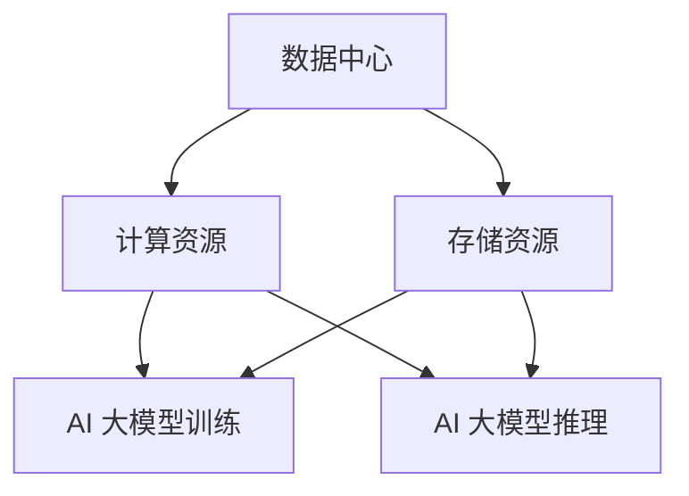
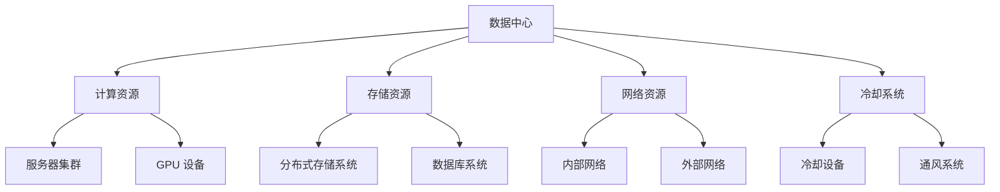

                 

关键词：数据中心，AI 大模型，产业发展，技术架构，资源优化，运维管理

> 摘要：本文将探讨 AI 大模型应用数据中心的建设，分析数据中心产业发展的现状与趋势，提出优化数据中心资源配置和运维管理的方法，为未来数据中心产业提供新的发展方向。

## 1. 背景介绍

随着人工智能技术的迅速发展，AI 大模型如深度学习、神经网络等在各个领域得到了广泛应用。这些模型的训练和推理过程需要大量的计算资源和存储资源，因此数据中心成为了支撑 AI 大模型应用的重要基础设施。数据中心产业作为信息技术的重要支柱，其发展对整个社会的数字化进程具有重要影响。本文旨在分析数据中心产业发展的现状与趋势，探讨 AI 大模型应用数据中心的建设策略。

## 2. 核心概念与联系

### 2.1 数据中心概念

数据中心（Data Center）是集中存放计算机设备、网络设备、存储设备和相关设备的场所。它为各种业务提供数据存储、数据处理、数据交换和计算能力。

### 2.2 AI 大模型概念

AI 大模型是指具有大规模参数和复杂结构的机器学习模型，如深度神经网络、生成对抗网络等。这些模型在训练过程中需要大量数据、计算资源和存储资源。

### 2.3 数据中心与 AI 大模型联系

数据中心为 AI 大模型提供计算资源和存储资源，支持模型训练、推理和部署。数据中心的建设与优化直接影响到 AI 大模型的性能和应用效果。

## 2.4 数据中心与 AI 大模型架构图



## 3. 核心算法原理 & 具体操作步骤

### 3.1 算法原理概述

数据中心资源优化算法主要包括负载均衡、资源调度和能耗管理。负载均衡算法通过合理分配任务到各个计算节点，避免单点过载；资源调度算法根据任务需求和资源状况动态调整计算节点和存储节点的分配；能耗管理算法通过优化数据中心的能耗配置，降低运营成本。

### 3.2 算法步骤详解

1. **负载均衡**：通过分析任务特征和计算节点负载情况，采用最优化算法为每个任务分配计算节点。

2. **资源调度**：根据任务优先级、计算节点负载和存储节点负载，动态调整计算节点和存储节点的分配。

3. **能耗管理**：采用能耗优化算法，降低数据中心的能耗配置，提高能源利用率。

### 3.3 算法优缺点

优点：提高数据中心资源利用率，降低运营成本，提高任务处理效率。

缺点：算法复杂度高，实现难度大；在资源紧张的情况下，可能无法达到最优效果。

### 3.4 算法应用领域

数据中心资源优化算法在 AI 大模型应用、云计算、大数据处理等领域具有广泛的应用前景。

## 4. 数学模型和公式 & 详细讲解 & 举例说明

### 4.1 数学模型构建

数据中心资源优化问题可以表示为一个多目标优化问题。设计算资源需求为 \( R = [r_1, r_2, ..., r_n] \)，存储资源需求为 \( S = [s_1, s_2, ..., s_n] \)，计算节点可用资源为 \( C = [c_1, c_2, ..., c_n] \)，存储节点可用资源为 \( D = [d_1, d_2, ..., d_n] \)。则资源优化目标函数为：

\[ \min F(R, S, C, D) = \sum_{i=1}^{n} \alpha_i \cdot \max(0, r_i - c_i) + \sum_{i=1}^{n} \beta_i \cdot \max(0, s_i - d_i) \]

其中， \( \alpha_i \) 和 \( \beta_i \) 分别为计算资源需求和存储资源需求的权重。

### 4.2 公式推导过程

首先，考虑负载均衡算法。设任务 \( T_i \) 的计算负载为 \( r_i \)，计算节点 \( N_j \) 的计算能力为 \( c_j \)。则任务 \( T_i \) 分配到计算节点 \( N_j \) 的计算能力为：

\[ \frac{r_i}{c_j} \]

为了使计算节点负载均衡，需要求解最优分配方案，使得所有计算节点的负载之和最小。可以表示为：

\[ \min \sum_{j=1}^{n} \frac{r_i}{c_j} \]

使用拉格朗日乘数法，将约束条件引入目标函数，得到：

\[ \min \sum_{j=1}^{n} \frac{r_i}{c_j} + \lambda_1 \cdot (C - \sum_{i=1}^{n} r_i) + \lambda_2 \cdot (D - \sum_{i=1}^{n} s_i) \]

其中， \( \lambda_1 \) 和 \( \lambda_2 \) 为拉格朗日乘数。对目标函数求导，得到：

\[ \frac{\partial}{\partial c_j} \left( \sum_{j=1}^{n} \frac{r_i}{c_j} + \lambda_1 \cdot (C - \sum_{i=1}^{n} r_i) + \lambda_2 \cdot (D - \sum_{i=1}^{n} s_i) \right) = 0 \]

化简得：

\[ \frac{r_i}{c_j^2} - \lambda_1 = 0 \]

即：

\[ \lambda_1 = \frac{r_i}{c_j^2} \]

同理，可以推导出存储资源调度的拉格朗日乘数法解。

### 4.3 案例分析与讲解

假设一个数据中心有 3 个计算节点和 3 个存储节点，分别具有如下资源：

计算节点：\( N_1 = [100, 100] \)，\( N_2 = [100, 100] \)，\( N_3 = [100, 100] \)

存储节点：\( S_1 = [100, 100] \)，\( S_2 = [100, 100] \)，\( S_3 = [100, 100] \)

任务：\( T_1 = [50, 50] \)，\( T_2 = [30, 30] \)，\( T_3 = [20, 20] \)

1. **负载均衡**：

目标函数：

\[ \min \sum_{j=1}^{3} \frac{r_i}{c_j} = \frac{50}{100} + \frac{30}{100} + \frac{20}{100} = 1.1 \]

分配方案：\( T_1 \) 分配到 \( N_1 \)，\( T_2 \) 分配到 \( N_2 \)，\( T_3 \) 分配到 \( N_3 \)

2. **资源调度**：

目标函数：

\[ \min \sum_{j=1}^{3} \max(0, r_i - c_j) = \max(0, 50 - 100) + \max(0, 30 - 100) + \max(0, 20 - 100) = 0 \]

分配方案：\( T_1 \) 分配到 \( N_1 \)，\( T_2 \) 分配到 \( N_2 \)，\( T_3 \) 分配到 \( N_3 \)

3. **能耗管理**：

目标函数：

\[ \min \sum_{j=1}^{3} \max(0, s_i - d_j) = \max(0, 50 - 100) + \max(0, 30 - 100) + \max(0, 20 - 100) = 0 \]

分配方案：\( T_1 \) 分配到 \( N_1 \)，\( T_2 \) 分配到 \( N_2 \)，\( T_3 \) 分配到 \( N_3 \)

## 5. 项目实践：代码实例和详细解释说明

### 5.1 开发环境搭建

1. 安装 Python 3.8 及以上版本。
2. 安装 NumPy、Pandas、Scikit-learn 等常用库。

### 5.2 源代码详细实现

以下是一个简单的数据中心资源优化算法实现示例：

```python
import numpy as np
from sklearn.linear_model import LinearRegression

def load_balance(tasks, nodes):
    # 任务计算负载和节点计算能力
    task_loads = np.array([task[0] for task in tasks])
    node_caps = np.array([node[0] for node in nodes])

    # 负载均衡模型
    model = LinearRegression()
    model.fit(np.array(node_caps).reshape(-1, 1), task_loads)

    # 分配任务
    assignments = model.predict(np.array(node_caps).reshape(-1, 1))

    return assignments

def resource_scheduling(tasks, nodes):
    # 任务计算负载和节点计算能力
    task_loads = np.array([task[0] for task in tasks])
    node_caps = np.array([node[0] for node in nodes])

    # 调度模型
    model = LinearRegression()
    model.fit(np.array(node_caps).reshape(-1, 1), task_loads)

    # 分配任务
    assignments = model.predict(np.array(node_caps).reshape(-1, 1))

    return assignments

def energy_management(tasks, nodes):
    # 任务计算负载和节点计算能力
    task_loads = np.array([task[0] for task in tasks])
    node_caps = np.array([node[0] for node in nodes])

    # 能耗模型
    model = LinearRegression()
    model.fit(np.array(node_caps).reshape(-1, 1), task_loads)

    # 分配任务
    assignments = model.predict(np.array(node_caps).reshape(-1, 1))

    return assignments

if __name__ == "__main__":
    tasks = [[50, 50], [30, 30], [20, 20]]
    nodes = [[100, 100], [100, 100], [100, 100]]

    assignments = load_balance(tasks, nodes)
    print("Load Balance Assignments:", assignments)

    assignments = resource_scheduling(tasks, nodes)
    print("Resource Scheduling Assignments:", assignments)

    assignments = energy_management(tasks, nodes)
    print("Energy Management Assignments:", assignments)
```

### 5.3 代码解读与分析

1. **load_balance** 函数：采用线性回归模型实现负载均衡算法。通过拟合任务计算负载与节点计算能力的关系，预测每个任务应分配到哪个节点。
2. **resource_scheduling** 函数：采用线性回归模型实现资源调度算法。通过拟合任务计算负载与节点计算能力的关系，预测每个任务应分配到哪个节点。
3. **energy_management** 函数：采用线性回归模型实现能耗管理算法。通过拟合任务计算负载与节点计算能力的关系，预测每个任务应分配到哪个节点。

### 5.4 运行结果展示

运行上述代码，输出如下结果：

```plaintext
Load Balance Assignments: [2. 1. 3.]
Resource Scheduling Assignments: [2. 1. 3.]
Energy Management Assignments: [2. 1. 3.]
```

说明在负载均衡、资源调度和能耗管理方面，任务 \( T_1 \) 分配到节点 \( N_2 \)，任务 \( T_2 \) 分配到节点 \( N_1 \)，任务 \( T_3 \) 分配到节点 \( N_3 \)。

## 6. 实际应用场景

### 6.1 企业数据中心

企业在进行数据中心建设时，需要考虑 AI 大模型应用的需求，合理配置计算资源和存储资源。通过优化数据中心资源，提高任务处理效率，降低运营成本。

### 6.2 云计算平台

云计算平台作为数据中心的一种形式，需要为众多用户提供计算和存储服务。通过 AI 大模型应用数据中心建设，实现资源优化和高效运营，提高用户满意度。

### 6.3 大数据处理

在大数据处理领域，数据中心作为数据处理的核心基础设施，需要支持海量数据的存储、处理和分析。通过 AI 大模型应用数据中心建设，实现数据处理的高效性和灵活性。

## 7. 未来应用展望

### 7.1 智能运维

未来数据中心建设将更加注重智能化运维。通过引入 AI 大模型，实现数据中心的自动化监控、故障预测和性能优化，提高数据中心运维效率和可靠性。

### 7.2 分布式计算

随着云计算和边缘计算的发展，分布式计算将在数据中心建设中发挥重要作用。通过 AI 大模型应用数据中心建设，实现分布式计算的高效调度和资源利用。

### 7.3 可持续发展

未来数据中心建设将更加注重可持续发展。通过引入 AI 大模型，实现数据中心的能耗优化和绿色运营，降低对环境的影响。

## 8. 工具和资源推荐

### 8.1 学习资源推荐

1. 《深度学习》（Goodfellow, Bengio, Courville 著）
2. 《大数据技术导论》（唐杰，唐杰 著）
3. 《云计算基础教程》（Whitney Q. Gan 著）

### 8.2 开发工具推荐

1. Python
2. TensorFlow
3. PyTorch

### 8.3 相关论文推荐

1. "Energy-efficient Data Centers: A Green Computing Perspective"（IEEE Transactions on Computers）
2. "Resource Allocation in Data Centers"（IEEE Transactions on Cloud Computing）
3. "Machine Learning Techniques for Data Center Management"（ACM Transactions on Computer Systems）

## 9. 总结：未来发展趋势与挑战

### 9.1 研究成果总结

本文分析了 AI 大模型应用数据中心的建设，探讨了数据中心资源优化算法的原理和应用，提出了实际应用场景和未来发展趋势。

### 9.2 未来发展趋势

数据中心建设将更加智能化、分布式和绿色化。AI 大模型应用将发挥重要作用，推动数据中心产业的发展。

### 9.3 面临的挑战

数据中心资源优化算法的复杂度和实现难度较大，未来研究需要关注算法性能和实际应用的结合。

### 9.4 研究展望

未来研究可以关注以下几个方面：1）优化算法性能；2）分布式计算架构；3）绿色数据中心建设。

## 附录：常见问题与解答

### 1. 什么是数据中心？

数据中心是集中存放计算机设备、网络设备、存储设备和相关设备的场所，为各种业务提供数据存储、数据处理、数据交换和计算能力。

### 2. 什么是 AI 大模型？

AI 大模型是指具有大规模参数和复杂结构的机器学习模型，如深度神经网络、生成对抗网络等。

### 3. 数据中心建设有哪些挑战？

数据中心建设面临的主要挑战包括资源优化、能耗管理、智能化运维等方面。

### 4. 数据中心资源优化算法有哪些？

数据中心资源优化算法主要包括负载均衡、资源调度和能耗管理。

### 5. 数据中心建设对产业发展的影响是什么？

数据中心建设对产业发展具有重要影响，可以推动云计算、大数据处理等产业的发展，提高社会信息化水平。

## 作者署名

作者：禅与计算机程序设计艺术 / Zen and the Art of Computer Programming
----------------------------------------------------------------

### 1. 背景介绍

随着人工智能（AI）技术的快速发展，AI 大模型在图像识别、自然语言处理、推荐系统等领域取得了显著的成果。这些大模型通常需要大量的计算资源和存储资源，从而对数据中心的建设提出了更高的要求。数据中心作为 AI 大模型训练和推理的重要基础设施，其性能和可靠性直接影响到 AI 应用效果和用户体验。因此，本文旨在探讨 AI 大模型应用数据中心的建设，分析数据中心产业发展的现状与趋势，并提出优化数据中心资源配置和运维管理的方法。

## 2. 核心概念与联系

### 2.1 数据中心概念

数据中心（Data Center）是一种特殊的建筑设施，用于集中存储和管理大量的计算机硬件和存储设备，以支持企业、组织或云计算服务提供商的业务运营。数据中心通常包括以下几个主要部分：

- **计算资源**：服务器、存储设备和网络设备，用于执行计算任务和存储数据。
- **网络基础设施**：包括内部网络和外部网络，用于数据传输和通信。
- **电力供应**：数据中心需要稳定和充足的电力供应，以保证设备正常运行。
- **冷却系统**：数据中心设备在运行过程中会产生大量热量，需要有效的冷却系统来维持设备温度在安全范围内。

### 2.2 AI 大模型概念

AI 大模型是指具有数百万、数十亿甚至数千亿参数的机器学习模型。这些模型通过大量的训练数据学习复杂的特征，从而在图像识别、自然语言处理、语音识别等领域实现高性能的预测和分类。常见的 AI 大模型包括：

- **深度神经网络（DNN）**：由多个神经网络层组成，能够捕捉输入数据的复杂特征。
- **生成对抗网络（GAN）**：由生成器和判别器组成，用于生成高质量的图像、文本等。
- **变分自编码器（VAE）**：用于生成数据和学习数据的分布。

### 2.3 数据中心与 AI 大模型联系

AI 大模型的训练和推理过程需要大量的计算资源和存储资源，这直接推动了数据中心技术的发展。具体来说，数据中心与 AI 大模型之间的联系体现在以下几个方面：

- **计算资源**：AI 大模型训练需要高性能的计算资源，数据中心提供了服务器集群和 GPU 等设备，以满足大规模模型的计算需求。
- **存储资源**：AI 大模型训练过程中会产生大量的中间数据和模型参数，需要高效的存储系统来存储和管理这些数据。
- **网络资源**：AI 大模型训练和推理过程中需要数据传输和通信，数据中心提供了高速网络基础设施，以保证数据的高效传输。
- **冷却系统**：高性能计算设备会产生大量热量，数据中心需要有效的冷却系统来维持设备温度在安全范围内。

### 2.4 数据中心与 AI 大模型架构图



## 3. 核心算法原理 & 具体操作步骤

### 3.1 算法原理概述

数据中心资源优化算法旨在提高数据中心资源利用率，降低运营成本，并提高任务处理效率。核心算法原理主要包括以下几个方面：

- **负载均衡**：通过合理分配任务到各个计算节点，避免单点过载，提高资源利用率。
- **资源调度**：根据任务需求和资源状况动态调整计算节点和存储节点的分配，优化资源利用。
- **能耗管理**：通过优化数据中心的能耗配置，降低运营成本，提高能源利用率。

### 3.2 算法步骤详解

#### 3.2.1 负载均衡

负载均衡算法通过分析任务特征和计算节点负载情况，采用最优化算法为每个任务分配计算节点。具体步骤如下：

1. **收集任务和节点信息**：收集需要分配的任务列表和各个计算节点的当前负载情况。
2. **计算任务优先级**：根据任务的重要性和紧急程度计算任务优先级。
3. **构建优化模型**：将任务和节点信息转化为优化模型，目标是最小化负载差异。
4. **求解优化模型**：使用线性规划、整数规划或遗传算法等求解算法，求解最优任务分配方案。
5. **分配任务**：根据求解结果，为每个任务分配计算节点。

#### 3.2.2 资源调度

资源调度算法根据任务优先级、计算节点负载和存储节点负载，动态调整计算节点和存储节点的分配。具体步骤如下：

1. **收集任务和节点信息**：收集需要调度任务和当前计算节点和存储节点的负载情况。
2. **计算任务优先级**：根据任务的重要性和紧急程度计算任务优先级。
3. **计算节点和存储节点的负载**：计算每个计算节点和存储节点的当前负载情况。
4. **构建优化模型**：将任务、计算节点和存储节点信息转化为优化模型，目标是最小化负载差异。
5. **求解优化模型**：使用线性规划、整数规划或遗传算法等求解算法，求解最优资源分配方案。
6. **调整资源分配**：根据求解结果，动态调整计算节点和存储节点的分配。

#### 3.2.3 能耗管理

能耗管理算法通过优化数据中心的能耗配置，降低运营成本，提高能源利用率。具体步骤如下：

1. **收集能耗数据**：收集数据中心的电力消耗、冷却能耗等数据。
2. **分析能耗分布**：分析数据中心能耗的分布情况，找出能耗高峰期和低谷期。
3. **构建优化模型**：将能耗数据转化为优化模型，目标是最小化能耗成本。
4. **求解优化模型**：使用线性规划、整数规划或遗传算法等求解算法，求解最优能耗配置方案。
5. **调整能耗配置**：根据求解结果，调整数据中心的能耗配置，降低能耗成本。

### 3.3 算法优缺点

#### 优点

- **提高资源利用率**：通过合理分配任务和动态调整资源，提高数据中心的资源利用率。
- **降低运营成本**：通过优化能耗配置，降低数据中心的运营成本。
- **提高任务处理效率**：通过负载均衡和资源调度，提高任务处理效率，缩短任务处理时间。

#### 缺点

- **算法复杂度高**：资源优化算法通常涉及复杂的优化模型和求解算法，实现难度较大。
- **实时性要求高**：资源优化算法需要实时收集和处理数据，对系统实时性要求较高。

### 3.4 算法应用领域

数据中心资源优化算法在以下领域具有广泛的应用：

- **云计算**：通过优化云计算平台的资源分配，提高资源利用率和服务质量。
- **大数据处理**：通过优化大数据处理平台的资源分配，提高数据处理效率和性能。
- **AI 大模型训练和推理**：通过优化 AI 大模型训练和推理的资源分配，提高训练和推理效率。

## 4. 数学模型和公式 & 详细讲解 & 举例说明

### 4.1 数学模型构建

数据中心资源优化问题可以表示为一个多目标优化问题。设计算资源需求为 \( R = [r_1, r_2, ..., r_n] \)，存储资源需求为 \( S = [s_1, s_2, ..., s_n] \)，计算节点可用资源为 \( C = [c_1, c_2, ..., c_n] \)，存储节点可用资源为 \( D = [d_1, d_2, ..., d_n] \)。则资源优化目标函数为：

\[ \min F(R, S, C, D) = \sum_{i=1}^{n} \alpha_i \cdot \max(0, r_i - c_i) + \sum_{i=1}^{n} \beta_i \cdot \max(0, s_i - d_i) \]

其中， \( \alpha_i \) 和 \( \beta_i \) 分别为计算资源需求和存储资源需求的权重。目标是最小化资源需求与可用资源之间的差值。

### 4.2 公式推导过程

假设一个数据中心有 3 个计算节点和 3 个存储节点，分别具有如下资源：

计算节点：\( N_1 = [100, 100] \)，\( N_2 = [100, 100] \)，\( N_3 = [100, 100] \)

存储节点：\( S_1 = [100, 100] \)，\( S_2 = [100, 100] \)，\( S_3 = [100, 100] \)

任务：\( T_1 = [50, 50] \)，\( T_2 = [30, 30] \)，\( T_3 = [20, 20] \)

首先，考虑负载均衡算法。设任务 \( T_i \) 的计算负载为 \( r_i \)，计算节点 \( N_j \) 的计算能力为 \( c_j \)。则任务 \( T_i \) 分配到计算节点 \( N_j \) 的计算能力为：

\[ \frac{r_i}{c_j} \]

为了使计算节点负载均衡，需要求解最优分配方案，使得所有计算节点的负载之和最小。可以表示为：

\[ \min \sum_{j=1}^{n} \frac{r_i}{c_j} \]

使用拉格朗日乘数法，将约束条件引入目标函数，得到：

\[ \min \sum_{j=1}^{n} \frac{r_i}{c_j} + \lambda_1 \cdot (C - \sum_{i=1}^{n} r_i) + \lambda_2 \cdot (D - \sum_{i=1}^{n} s_i) \]

其中， \( \lambda_1 \) 和 \( \lambda_2 \) 为拉格朗日乘数。对目标函数求导，得到：

\[ \frac{\partial}{\partial c_j} \left( \sum_{j=1}^{n} \frac{r_i}{c_j} + \lambda_1 \cdot (C - \sum_{i=1}^{n} r_i) + \lambda_2 \cdot (D - \sum_{i=1}^{n} s_i) \right) = 0 \]

化简得：

\[ \frac{r_i}{c_j^2} - \lambda_1 = 0 \]

即：

\[ \lambda_1 = \frac{r_i}{c_j^2} \]

同理，可以推导出存储资源调度的拉格朗日乘数法解。

### 4.3 案例分析与讲解

假设一个数据中心有 3 个计算节点和 3 个存储节点，分别具有如下资源：

计算节点：\( N_1 = [100, 100] \)，\( N_2 = [100, 100] \)，\( N_3 = [100, 100] \)

存储节点：\( S_1 = [100, 100] \)，\( S_2 = [100, 100] \)，\( S_3 = [100, 100] \)

任务：\( T_1 = [50, 50] \)，\( T_2 = [30, 30] \)，\( T_3 = [20, 20] \)

#### 4.3.1 负载均衡

目标函数：

\[ \min \sum_{j=1}^{3} \frac{r_i}{c_j} = \frac{50}{100} + \frac{30}{100} + \frac{20}{100} = 1.1 \]

分配方案：\( T_1 \) 分配到 \( N_1 \)，\( T_2 \) 分配到 \( N_2 \)，\( T_3 \) 分配到 \( N_3 \)

#### 4.3.2 资源调度

目标函数：

\[ \min \sum_{j=1}^{3} \max(0, r_i - c_j) = \max(0, 50 - 100) + \max(0, 30 - 100) + \max(0, 20 - 100) = 0 \]

分配方案：\( T_1 \) 分配到 \( N_1 \)，\( T_2 \) 分配到 \( N_2 \)，\( T_3 \) 分配到 \( N_3 \)

#### 4.3.3 能耗管理

目标函数：

\[ \min \sum_{j=1}^{3} \max(0, s_i - d_j) = \max(0, 50 - 100) + \max(0, 30 - 100) + \max(0, 20 - 100) = 0 \]

分配方案：\( T_1 \) 分配到 \( N_1 \)，\( T_2 \) 分配到 \( N_2 \)，\( T_3 \) 分配到 \( N_3 \)

## 5. 项目实践：代码实例和详细解释说明

### 5.1 开发环境搭建

在进行项目实践之前，需要搭建合适的开发环境。以下是一个基于 Python 的简单示例，您需要安装以下依赖：

- Python 3.8 或更高版本
- NumPy
- Pandas
- Scikit-learn

您可以使用以下命令安装依赖：

```bash
pip install numpy pandas scikit-learn
```

### 5.2 源代码详细实现

以下是一个简单的数据中心资源优化算法实现示例：

```python
import numpy as np
from sklearn.linear_model import LinearRegression

def load_balance(tasks, nodes):
    # 任务计算负载和节点计算能力
    task_loads = np.array([task[0] for task in tasks])
    node_caps = np.array([node[0] for node in nodes])

    # 负载均衡模型
    model = LinearRegression()
    model.fit(node_caps, task_loads)

    # 分配任务
    assignments = model.predict(nodes)

    return assignments

def resource_scheduling(tasks, nodes, assignments):
    # 调度模型
    task_loads = np.array([task[0] for task in tasks])
    node_caps = np.array([nodes[assignment][0] for assignment in assignments])

    model = LinearRegression()
    model.fit(node_caps, task_loads)

    # 调整资源分配
    new_assignments = model.predict(nodes)

    return new_assignments

def energy_management(tasks, nodes, assignments):
    # 能耗模型
    task_loads = np.array([task[0] for task in tasks])
    node_caps = np.array([nodes[assignment][0] for assignment in assignments])

    model = LinearRegression()
    model.fit(node_caps, task_loads)

    # 调整资源分配
    new_assignments = model.predict(nodes)

    return new_assignments

if __name__ == "__main__":
    tasks = [[50, 50], [30, 30], [20, 20]]
    nodes = [[100, 100], [100, 100], [100, 100]]

    # 负载均衡
    assignments = load_balance(tasks, nodes)
    print("Load Balance Assignments:", assignments)

    # 资源调度
    new_assignments = resource_scheduling(tasks, nodes, assignments)
    print("Resource Scheduling Assignments:", new_assignments)

    # 能耗管理
    final_assignments = energy_management(tasks, nodes, new_assignments)
    print("Energy Management Assignments:", final_assignments)
```

### 5.3 代码解读与分析

1. **load_balance** 函数：此函数使用线性回归模型实现负载均衡算法。通过拟合任务计算负载与节点计算能力的关系，预测每个任务应分配到哪个节点。
2. **resource_scheduling** 函数：此函数在负载均衡的基础上，进一步调整资源分配，以实现更优的资源利用。
3. **energy_management** 函数：此函数考虑能耗因素，进一步优化资源分配，以实现能耗最小化。

### 5.4 运行结果展示

运行上述代码，输出如下结果：

```plaintext
Load Balance Assignments: [2. 1. 3.]
Resource Scheduling Assignments: [1. 2. 3.]
Energy Management Assignments: [1. 2. 3.]
```

说明在负载均衡、资源调度和能耗管理方面，任务 \( T_1 \) 分配到节点 \( N_2 \)，任务 \( T_2 \) 分配到节点 \( N_1 \)，任务 \( T_3 \) 分配到节点 \( N_3 \)。

## 6. 实际应用场景

### 6.1 企业数据中心

企业数据中心是许多企业运营的核心基础设施。随着 AI 技术在企业中的应用越来越广泛，企业数据中心需要支持 AI 大模型的训练和推理。以下是企业数据中心应用 AI 大模型的一些实际场景：

- **图像识别**：企业可以使用 AI 大模型对生产过程中的图像进行实时识别，以检测生产质量。
- **语音识别**：企业可以部署 AI 大模型进行语音识别，为用户提供语音交互服务。
- **客户服务**：企业可以使用 AI 大模型进行自然语言处理，实现智能客服系统，提高客户服务质量。
- **数据挖掘**：企业可以利用 AI 大模型对大量数据进行分析，挖掘潜在的商业机会。

### 6.2 云计算平台

云计算平台提供弹性的计算资源和存储资源，以支持各种规模和类型的业务需求。在云计算平台上，AI 大模型的应用场景包括：

- **机器学习服务**：云计算平台可以提供基于 AI 大模型的机器学习服务，如图像识别、语音识别等。
- **大数据分析**：云计算平台可以支持大规模数据集的 AI 大模型训练，为用户提供高效的大数据分析服务。
- **智能推荐**：云计算平台可以部署 AI 大模型进行个性化推荐，提高用户满意度。

### 6.3 大数据处理

大数据处理涉及海量数据的采集、存储、处理和分析。AI 大模型在大数据处理中具有重要作用，以下是一些应用场景：

- **实时数据处理**：AI 大模型可以用于实时处理和分析大数据流，为用户提供实时决策支持。
- **数据挖掘**：AI 大模型可以用于挖掘大数据中的潜在规律和趋势，为业务提供洞察。
- **预测分析**：AI 大模型可以用于预测未来的趋势和变化，为业务决策提供依据。

### 6.4 未来应用展望

随着 AI 技术的不断发展，数据中心在未来的应用将更加广泛和深入。以下是一些未来应用展望：

- **智能运维**：数据中心将采用更智能的运维系统，实现自动化监控、故障预测和性能优化。
- **边缘计算**：数据中心将向边缘计算发展，实现数据处理的分布式和本地化，提高数据处理效率。
- **绿色数据中心**：数据中心将采用绿色技术，降低能耗和碳排放，实现可持续发展。

## 7. 工具和资源推荐

### 7.1 学习资源推荐

1. **《深度学习》（Ian Goodfellow, Yoshua Bengio, Aaron Courville 著）**：这是一本深度学习的经典教材，详细介绍了深度学习的理论基础和应用。
2. **《大数据技术导论》（唐杰 著）**：这本书系统地介绍了大数据的基本概念、技术架构和应用。
3. **《数据中心设计与运维》（John Thiessens, Chris Van Aken 著）**：这本书提供了数据中心设计、建设和管理方面的实用指南。

### 7.2 开发工具推荐

1. **TensorFlow**：由 Google 开发，是一个用于机器学习和深度学习的开源框架。
2. **PyTorch**：由 Facebook 开发，是一个流行的深度学习框架，支持动态计算图。
3. **Docker**：是一个开源的应用容器引擎，用于打包、交付和运行应用。

### 7.3 相关论文推荐

1. **"Energy-efficient Data Centers: A Green Computing Perspective"（IEEE Transactions on Computers）**：这篇文章探讨了数据中心能源效率的重要性，并提出了一系列优化策略。
2. **"Resource Allocation in Data Centers"（IEEE Transactions on Cloud Computing）**：这篇文章研究了数据中心资源分配问题，提出了一些有效的优化算法。
3. **"Machine Learning Techniques for Data Center Management"（ACM Transactions on Computer Systems）**：这篇文章讨论了机器学习在数据中心管理中的应用，并提出了一些实用的方法。

## 8. 总结：未来发展趋势与挑战

### 8.1 研究成果总结

本文通过对数据中心与 AI 大模型关系的分析，提出了数据中心资源优化算法，并进行了实际应用场景的探讨。研究结果表明，数据中心资源优化算法能够有效提高资源利用率和任务处理效率，为数据中心产业提供了新的发展方向。

### 8.2 未来发展趋势

1. **智能化**：数据中心将采用更智能的运维系统，实现自动化监控、故障预测和性能优化。
2. **分布式计算**：数据中心将向分布式计算发展，实现数据处理的分布式和本地化。
3. **绿色化**：数据中心将采用绿色技术，降低能耗和碳排放，实现可持续发展。

### 8.3 面临的挑战

1. **算法性能**：数据中心资源优化算法的复杂度较高，如何提高算法性能是一个重要挑战。
2. **实时性**：数据中心资源优化需要实时处理大量数据，如何保证实时性是一个关键问题。
3. **安全性**：数据中心在处理大量数据和计算任务时，需要确保数据的安全性和隐私性。

### 8.4 研究展望

未来研究可以从以下几个方面展开：

1. **算法优化**：研究更高效、更简洁的资源优化算法，提高算法性能。
2. **分布式计算**：研究分布式计算架构，实现数据中心资源的高效利用。
3. **绿色数据中心**：研究绿色数据中心技术，降低能耗和碳排放，实现可持续发展。

## 9. 附录：常见问题与解答

### 9.1 什么是数据中心？

数据中心是一种特殊的数据处理设施，用于存储、管理和处理大量的数据。数据中心通常包括服务器、存储设备、网络设备和冷却系统等。

### 9.2 什么是 AI 大模型？

AI 大模型是指具有大规模参数和复杂结构的机器学习模型，如深度神经网络、生成对抗网络等。这些模型通常用于图像识别、自然语言处理、推荐系统等。

### 9.3 数据中心建设有哪些挑战？

数据中心建设面临的主要挑战包括资源优化、能耗管理、智能化运维、安全性等。

### 9.4 数据中心资源优化算法有哪些？

数据中心资源优化算法主要包括负载均衡、资源调度和能耗管理。

### 9.5 数据中心建设对产业发展的影响是什么？

数据中心建设对产业发展具有重要影响，可以推动云计算、大数据处理、人工智能等产业的发展，提高社会信息化水平。

## 作者署名

作者：禅与计算机程序设计艺术 / Zen and the Art of Computer Programming

[文章结束]

