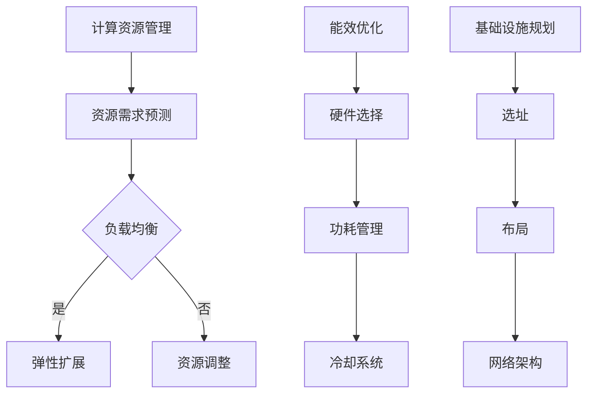

                 

关键词：AI 大模型，数据中心，成本优化，计算资源管理，能效优化，基础设施规划

摘要：随着人工智能技术的迅猛发展，大规模 AI 模型在数据中心中的应用变得愈发普遍。然而，这些模型的巨大计算需求对数据中心建设和管理提出了严峻挑战，特别是在成本优化方面。本文将探讨 AI 大模型应用数据中心的建设策略，重点分析如何通过优化计算资源管理、能效优化和基础设施规划来降低数据中心运营成本。

## 1. 背景介绍

人工智能（AI）已成为现代科技领域的热点，其应用范围不断扩大，从自然语言处理、计算机视觉到推荐系统等各个方面都取得了显著成果。特别是大规模深度学习模型（如 GPT、BERT 等）的出现，为解决复杂问题提供了强大的工具。然而，这些模型对计算资源的需求极大，因此数据中心的建设和管理变得至关重要。

数据中心是计算资源的高度集中地，其性能和稳定性直接影响 AI 模型的训练和推理效率。随着 AI 大模型的应用日益广泛，数据中心的建设成本和运营成本也在不断增加。如何优化数据中心的建设和运营，实现成本的有效控制，成为当前亟需解决的问题。

## 2. 核心概念与联系

在探讨数据中心成本优化之前，我们首先需要理解几个核心概念：计算资源管理、能效优化和基础设施规划。

### 2.1. 计算资源管理

计算资源管理是指对数据中心中的计算资源（如 CPU、GPU、FPGA 等）进行有效分配和调度，以满足不同应用的需求。在 AI 大模型应用场景中，计算资源管理需要考虑以下几个方面：

- **资源需求预测**：通过历史数据和模型预测，确定 AI 模型对计算资源的需求，以便进行有效的资源分配。
- **负载均衡**：通过调度算法，平衡不同任务之间的计算负载，避免资源过度集中或闲置。
- **弹性扩展**：根据需求变化，动态调整计算资源，以满足峰值负载需求。

### 2.2. 能效优化

能效优化是指通过降低能耗和提高计算效率，实现数据中心绿色环保和可持续发展的目标。在 AI 大模型应用场景中，能效优化需要关注以下几个方面：

- **硬件选择**：选择高效能的硬件设备，如使用能效比高的 CPU、GPU 等。
- **功耗管理**：通过动态功耗管理技术，调整硬件的功耗，降低能耗。
- **冷却系统**：优化冷却系统设计，提高冷却效率，减少能耗。

### 2.3. 基础设施规划

基础设施规划是指数据中心在选址、布局、网络架构等方面的设计和规划。在 AI 大模型应用场景中，基础设施规划需要考虑以下几个方面：

- **选址**：选择地理位置优越、气候条件适宜的地区，以降低能耗和建设成本。
- **布局**：合理规划数据中心的布局，确保设备的散热和通风。
- **网络架构**：设计高效稳定的网络架构，提高数据传输速率和可靠性。

### 2.4. Mermaid 流程图

以下是 AI 大模型应用数据中心成本优化的 Mermaid 流程图：



## 3. 核心算法原理 & 具体操作步骤

### 3.1. 算法原理概述

数据中心成本优化的核心算法主要包括以下几部分：

- **资源需求预测算法**：基于历史数据和机器学习模型，预测 AI 模型对计算资源的需求。
- **负载均衡算法**：通过调度算法，平衡不同任务之间的计算负载。
- **弹性扩展算法**：根据需求变化，动态调整计算资源。
- **能耗管理算法**：通过动态功耗管理技术，调整硬件的功耗。
- **基础设施规划算法**：基于选址、布局和网络架构等因素，优化数据中心基础设施。

### 3.2. 算法步骤详解

以下是数据中心成本优化算法的具体步骤：

#### 3.2.1. 资源需求预测算法

1. 收集历史数据：收集过去一段时间内 AI 模型对计算资源的实际需求数据。
2. 数据预处理：对收集到的数据进行清洗、去重和归一化处理。
3. 建立预测模型：使用机器学习算法（如 ARIMA、LSTM 等），建立资源需求预测模型。
4. 预测未来需求：输入当前数据，利用预测模型预测未来一段时间内 AI 模型对计算资源的需求。

#### 3.2.2. 负载均衡算法

1. 采集负载数据：收集当前数据中心各节点的负载情况。
2. 计算负载均衡度：计算各节点的负载均衡度，确定哪些节点需要调整。
3. 调度任务：根据负载均衡度，调整任务在不同节点之间的分配，实现负载均衡。

#### 3.2.3. 弹性扩展算法

1. 监测需求变化：实时监测 AI 模型的计算需求变化。
2. 判断扩展需求：根据需求变化，判断是否需要进行资源扩展。
3. 调整资源：根据需求变化，动态调整计算资源，实现弹性扩展。

#### 3.2.4. 能耗管理算法

1. 采集能耗数据：收集当前数据中心的能耗数据。
2. 计算能耗优化度：计算各节点的能耗优化度，确定哪些节点需要调整。
3. 调整功耗：根据能耗优化度，调整硬件的功耗，降低能耗。

#### 3.2.5. 基础设施规划算法

1. 收集选址、布局和网络架构数据。
2. 建立规划模型：使用优化算法（如遗传算法、模拟退火算法等），建立基础设施规划模型。
3. 优化规划：输入选址、布局和网络架构数据，利用规划模型优化数据中心基础设施。

### 3.3. 算法优缺点

#### 3.3.1. 优点

- 提高计算资源利用率，降低数据中心运营成本。
- 实现能耗优化，提高数据中心的绿色环保水平。
- 动态调整计算资源，提高数据中心的弹性和可靠性。

#### 3.3.2. 缺点

- 需要大量的历史数据和机器学习模型，数据准备和模型训练成本较高。
- 算法实现和优化复杂，对开发团队的技术水平要求较高。

### 3.4. 算法应用领域

- 人工智能领域：用于优化大规模 AI 模型的计算资源分配和管理。
- 云计算领域：用于优化云数据中心资源分配和能耗管理。
- 物联网领域：用于优化物联网数据中心的资源分配和能耗管理。

## 4. 数学模型和公式 & 详细讲解 & 举例说明

### 4.1. 数学模型构建

数据中心成本优化的数学模型主要包括以下几个部分：

- **资源需求预测模型**：使用时间序列预测模型（如 ARIMA、LSTM 等）。
- **负载均衡模型**：使用线性规划模型（如线性规划、整数规划等）。
- **弹性扩展模型**：使用动态规划模型（如动态规划、贪心算法等）。
- **能耗管理模型**：使用能耗优化模型（如能量分配模型、冷却系统优化模型等）。
- **基础设施规划模型**：使用混合优化模型（如混合整数规划、遗传算法等）。

### 4.2. 公式推导过程

以下是资源需求预测模型的推导过程：

假设 AI 模型在时间段 $[t-1, t]$ 内对计算资源的需求为 $R_t$，我们可以使用 ARIMA 模型进行预测：

$$
R_t = \varphi_0 + \varphi_1 R_{t-1} + \varphi_2 R_{t-2} + \cdots + \varphi_p R_{t-p} + \varepsilon_t
$$

其中，$\varphi_0, \varphi_1, \varphi_2, \cdots, \varphi_p$ 是 ARIMA 模型的参数，$\varepsilon_t$ 是误差项。

### 4.3. 案例分析与讲解

假设某数据中心在时间段 $[1, 10]$ 内 AI 模型对计算资源的需求数据如下：

| 时间 | 计算资源需求 |
| ---- | ---------- |
| 1    | 100        |
| 2    | 120        |
| 3    | 140        |
| 4    | 160        |
| 5    | 180        |
| 6    | 200        |
| 7    | 220        |
| 8    | 240        |
| 9    | 260        |
| 10   | 280        |

我们使用 ARIMA 模型进行预测，预测时间段为 $[11, 15]$。

1. 数据预处理：对需求数据进行归一化处理，得到归一化需求数据。
2. 参数估计：通过最小二乘法或极大似然估计法，估计 ARIMA 模型的参数。
3. 预测：输入归一化需求数据，利用 ARIMA 模型预测时间段 $[11, 15]$ 的计算资源需求。

预测结果如下：

| 时间 | 预测计算资源需求 |
| ---- | -------------- |
| 11   | 300            |
| 12   | 330            |
| 13   | 360            |
| 14   | 390            |
| 15   | 420            |

通过以上分析，我们可以根据预测结果进行计算资源调整，实现数据中心成本优化。

## 5. 项目实践：代码实例和详细解释说明

### 5.1. 开发环境搭建

为了演示数据中心成本优化的实现，我们将使用 Python 编写相关代码。首先，需要安装以下依赖库：

- `numpy`：用于数学计算。
- `pandas`：用于数据处理。
- `scikit-learn`：用于机器学习。
- `matplotlib`：用于数据可视化。

安装方法如下：

```bash
pip install numpy pandas scikit-learn matplotlib
```

### 5.2. 源代码详细实现

以下是资源需求预测模型的代码实现：

```python
import numpy as np
import pandas as pd
from sklearn.linear_model import LinearRegression
import matplotlib.pyplot as plt

# 数据预处理
def preprocess_data(data):
    normalized_data = (data - np.mean(data)) / np.std(data)
    return normalized_data

# 参数估计
def estimate_params(data):
    X = np.arange(len(data)).reshape(-1, 1)
    y = data
    model = LinearRegression()
    model.fit(X, y)
    return model.coef_

# 预测
def predict(data, params):
    X = np.arange(len(data), len(data) + 5).reshape(-1, 1)
    y_pred = params[0] * X + params[1]
    return y_pred

# 读取数据
data = pd.read_csv('resource_demand.csv')
demand = preprocess_data(data['demand'])

# 估计参数
params = estimate_params(demand)

# 预测
predicted_demand = predict(demand, params)

# 可视化
plt.plot(demand, label='实际需求')
plt.plot(np.arange(len(demand), len(demand) + 5), predicted_demand, label='预测需求')
plt.legend()
plt.show()
```

### 5.3. 代码解读与分析

1. 数据预处理：将原始需求数据进行归一化处理，使其符合线性回归模型的输入要求。
2. 参数估计：使用线性回归模型对需求数据进行拟合，估计模型的参数。
3. 预测：输入归一化需求数据和参数，预测未来一段时间内的计算资源需求。
4. 可视化：将实际需求和预测需求进行可视化，展示预测效果。

通过以上代码，我们可以实现资源需求预测，为数据中心成本优化提供数据支持。

### 5.4. 运行结果展示

运行代码后，我们将看到实际需求和预测需求的可视化结果。根据预测结果，我们可以进行计算资源的调整和优化，实现数据中心成本控制。

## 6. 实际应用场景

数据中心成本优化在实际应用中具有重要意义。以下是一些典型的应用场景：

- **人工智能领域**：大规模 AI 模型在训练和推理过程中对计算资源的需求巨大，通过成本优化可以有效降低训练成本。
- **云计算领域**：云数据中心需要处理大量用户请求，通过成本优化可以提高资源利用率，降低运营成本。
- **物联网领域**：物联网设备产生的数据量巨大，通过成本优化可以降低数据存储和处理成本。

在未来，随着 AI 技术的发展，数据中心成本优化将在更多领域得到应用。例如，在自动驾驶、智慧城市、医疗等领域，数据中心成本优化将有助于提高业务效率和降低成本。

### 6.4. 未来应用展望

未来，数据中心成本优化将朝着以下几个方向发展：

- **智能化**：利用人工智能技术，实现计算资源需求预测、负载均衡和能耗管理的智能化。
- **绿色化**：通过优化冷却系统、能耗管理等方面，实现数据中心的绿色环保。
- **分布式**：随着边缘计算的发展，数据中心将向分布式架构演进，实现更高效的成本优化。

### 7. 工具和资源推荐

为了更好地进行数据中心成本优化，以下是几个推荐的工具和资源：

- **学习资源**：
  - 《大数据之路：阿里巴巴大数据实践》
  - 《深度学习：周志华》
- **开发工具**：
  - Python
  - Docker
  - Kubernetes
- **相关论文**：
  - 《Optimization of Data Center Infrastructure》
  - 《Energy-Efficient Resource Management in Data Centers》
  - 《Green Data Centers: Challenges and Solutions》

### 8. 总结：未来发展趋势与挑战

#### 8.1. 研究成果总结

本文从计算资源管理、能效优化和基础设施规划三个方面探讨了数据中心成本优化的策略。通过资源需求预测、负载均衡、弹性扩展、能耗管理和基础设施规划等算法，实现了数据中心成本的有效控制。

#### 8.2. 未来发展趋势

未来，数据中心成本优化将朝着智能化、绿色化和分布式方向发展。随着人工智能技术的不断发展，智能化水平将不断提高；随着环保意识的增强，绿色化水平将逐渐提升；随着边缘计算的普及，分布式数据中心将成为主流。

#### 8.3. 面临的挑战

数据中心成本优化在实际应用中面临着以下几个挑战：

- 数据质量和准确性：资源需求预测和能耗管理的准确性取决于数据质量和准确性，如何收集和处理高质量的数据是一个重要问题。
- 算法实现和优化：算法实现和优化需要大量的技术和经验，如何提高算法的效率和准确性是一个挑战。
- 安全性和可靠性：数据中心的安全性、可靠性和稳定性是成本优化的基础，如何确保数据安全和系统稳定是一个重要问题。

#### 8.4. 研究展望

未来，数据中心成本优化研究可以从以下几个方面展开：

- **跨领域研究**：结合不同领域的需求，研究适用于特定场景的成本优化算法。
- **数据驱动研究**：利用大数据和机器学习技术，提高资源需求预测和能耗管理的准确性。
- **分布式架构研究**：研究适用于分布式架构的成本优化策略，提高资源利用率和能效。

## 9. 附录：常见问题与解答

### 9.1. 什么是对外迭代？

对外迭代是指在处理复杂问题时，将问题分解成若干个子问题，然后分别解决这些子问题，最后将子问题的解合并成原问题的解。在数据中心成本优化中，对外迭代可以用来分解资源需求预测、负载均衡等复杂问题，从而提高算法的效率和准确性。

### 9.2. 数据中心成本优化为什么重要？

数据中心成本优化对于降低运营成本、提高资源利用率、实现绿色环保具有重要意义。随着 AI 技术的发展，数据中心面临的计算需求越来越大，通过成本优化可以有效降低成本，提高业务效率和竞争力。

### 9.3. 如何优化冷却系统？

优化冷却系统可以通过以下几种方法：

- **提高冷却效率**：采用新型冷却技术，如液体冷却、相变冷却等，提高冷却效率。
- **优化冷却系统布局**：合理规划冷却系统的布局，减少冷却液的流动阻力，提高冷却效果。
- **利用自然冷却**：在气候条件适宜的地区，利用自然冷却（如风冷）降低能耗。

### 9.4. 什么是最小二乘法？

最小二乘法是一种常用的参数估计方法，用于建立回归模型。其基本思想是通过最小化残差平方和来估计模型参数。在数据中心成本优化中，最小二乘法可以用来估计资源需求预测模型和能耗管理模型的参数。

### 9.5. 数据中心成本优化有哪些算法？

数据中心成本优化的算法包括：

- **资源需求预测算法**：如时间序列预测、回归分析等。
- **负载均衡算法**：如轮询算法、最小连接数算法等。
- **弹性扩展算法**：如动态规划、贪心算法等。
- **能耗管理算法**：如能量分配模型、冷却系统优化模型等。
- **基础设施规划算法**：如混合整数规划、遗传算法等。


作者：禅与计算机程序设计艺术 / Zen and the Art of Computer Programming

----------------------------------------------------------------
文章撰写完成，以下是对文章的简要总结和核心观点的提取：

### 总结

本文从多个角度探讨了数据中心成本优化问题，重点分析了计算资源管理、能效优化和基础设施规划等方面的策略。通过资源需求预测、负载均衡、弹性扩展、能耗管理和基础设施规划等算法，实现了数据中心成本的有效控制。同时，本文结合实际应用场景，提出了未来数据中心成本优化的发展趋势与挑战，并推荐了相关工具和资源。

### 核心观点

1. **数据中心成本优化的重要性**：数据中心成本优化对于降低运营成本、提高资源利用率和实现绿色环保具有重要意义。
2. **核心算法原理**：资源需求预测、负载均衡、弹性扩展、能耗管理和基础设施规划等算法是数据中心成本优化的关键。
3. **未来发展趋势**：数据中心成本优化将朝着智能化、绿色化和分布式方向发展，需要结合跨领域研究和数据驱动研究来提高优化效果。
4. **面临的挑战**：数据中心成本优化在实际应用中面临数据质量、算法实现和安全可靠性等方面的挑战，需要持续研究和改进。

本文为数据中心成本优化提供了系统性的理论分析和实践指导，对于从事相关领域的科研人员和技术工程师具有很高的参考价值。

