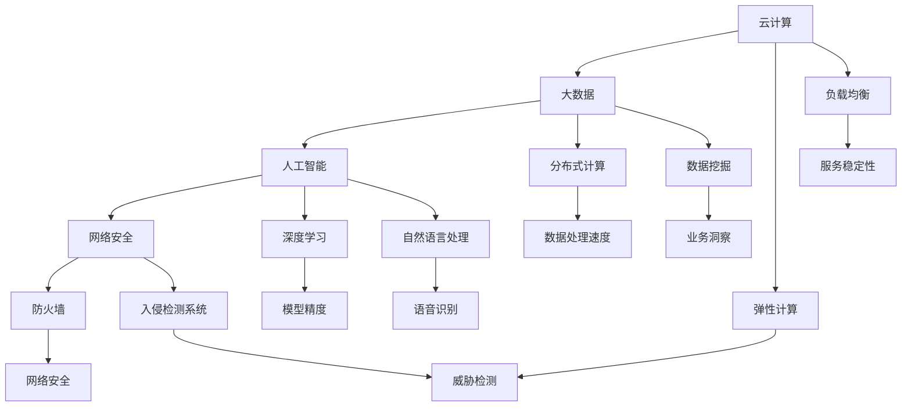

                 

 在当今信息化时代，人工智能（AI）已经成为推动科技进步和产业变革的核心驱动力。而大模型作为 AI 的重要分支，通过在数据中心中应用，不仅提升了数据处理和决策的效率，还拓宽了 AI 在各行各业的应用场景。本文将围绕 AI 大模型在数据中心的建设与应用，从技术层面进行深入探讨，旨在为读者提供一个全面的技术指南。

## 关键词

- 人工智能
- 大模型
- 数据中心
- 技术架构
- 应用实践

## 摘要

本文首先介绍了 AI 大模型的基本概念和数据中心的建设背景。随后，通过 Mermaid 流程图详细阐述了数据中心技术与应用的核心概念与联系。接下来，本文深入剖析了核心算法原理、数学模型构建及其在具体应用领域的优缺点。随后，通过代码实例展示了大模型在实际开发中的实现细节。最后，本文探讨了 AI 大模型在数据中心的应用场景，并对未来发展趋势和挑战进行了展望。

## 1. 背景介绍

随着大数据和云计算技术的不断发展，数据中心作为数据存储、处理和交换的核心基础设施，正变得越来越重要。数据中心不仅为企业提供了强大的计算能力和存储资源，还成为了推动人工智能应用的重要载体。大模型，作为人工智能领域的重要成果，通过在数据中心中的应用，可以实现复杂的数据分析和智能决策。

### 1.1 数据中心的定义与发展历程

数据中心（Data Center）是指用于集中存储、处理和交换数据的设施。它由服务器、存储设备、网络设备等硬件设施以及相应的软件系统组成。数据中心的发展历程可以追溯到 20 世纪 60 年代，当时的数据中心主要用于存储和共享计算资源。随着互联网的普及和大数据时代的到来，数据中心的功能逐渐丰富，成为了现代信息技术体系的核心。

### 1.2 大模型的兴起与应用

大模型是指具有巨大参数量和复杂结构的神经网络模型，如深度学习模型、生成对抗网络（GAN）等。大模型的兴起源于计算能力的提升和海量数据的积累。大模型的应用范围广泛，包括图像识别、自然语言处理、语音识别等领域。在数据中心中，大模型的应用不仅提升了数据处理和分析的效率，还为人工智能在各个行业的落地提供了有力支持。

## 2. 核心概念与联系

数据中心技术与应用的核心概念包括云计算、大数据、人工智能和网络安全等。这些概念相互关联，共同构成了数据中心的技术体系。

### 2.1 云计算

云计算是指通过互联网提供动态易扩展且经常是虚拟化的资源。数据中心是云计算的核心基础设施，提供了弹性计算、存储和网络等资源。云计算技术使得数据中心能够按需分配资源，提高资源利用率，降低企业运营成本。

### 2.2 大数据

大数据是指数据量巨大、类型繁多、生成速度极快的海量数据。数据中心作为大数据的处理和分析平台，通过分布式计算、存储和优化技术，实现了对大数据的高效处理和分析。大数据技术在数据中心中的应用，为企业的决策提供了数据支持。

### 2.3 人工智能

人工智能是指通过模拟人类智能的计算机系统，具有感知、学习、推理、决策等能力。数据中心中的大模型应用，使得人工智能在各个领域的落地成为可能。通过数据中心，大模型可以高效地处理和分析海量数据，实现智能决策和自动化控制。

### 2.4 网络安全

网络安全是指保护网络不受未经授权的访问、攻击和破坏。数据中心作为数据存储和处理的重要场所，面临着严峻的网络安全挑战。通过网络安全技术，如防火墙、入侵检测系统（IDS）、安全协议等，保障数据中心的安全运行。

下面是数据中心技术与应用的核心概念与联系的 Mermaid 流程图：



## 3. 核心算法原理 & 具体操作步骤

### 3.1 算法原理概述

大模型的核心算法通常是基于深度学习技术，尤其是基于神经网络的结构。深度学习模型通过层层提取数据特征，实现从原始数据到高级抽象表示的转换。在这个过程中，模型通过不断调整内部参数，优化损失函数，使得模型能够更好地拟合训练数据。

### 3.2 算法步骤详解

1. **数据预处理**：包括数据清洗、数据归一化、数据增强等步骤。数据预处理是确保模型训练质量的重要环节。
2. **模型构建**：根据具体应用需求，选择合适的深度学习模型结构。常见的模型结构包括卷积神经网络（CNN）、循环神经网络（RNN）、生成对抗网络（GAN）等。
3. **模型训练**：通过反向传播算法，不断调整模型参数，使得模型在训练数据上达到最佳性能。训练过程通常涉及批量训练、学习率调整、正则化等技术。
4. **模型评估**：使用验证集或测试集对模型性能进行评估，选择最优模型进行应用。
5. **模型部署**：将训练好的模型部署到数据中心，实现实时数据分析和决策。

### 3.3 算法优缺点

**优点**：

- **强大的特征提取能力**：深度学习模型能够自动提取数据中的高级特征，减少人工特征工程的工作量。
- **良好的泛化能力**：通过大规模数据训练，深度学习模型能够更好地适应不同的应用场景。
- **高效的数据处理**：分布式计算技术使得大模型能够在数据中心中高效处理海量数据。

**缺点**：

- **计算资源需求高**：大模型通常需要大量的计算资源和存储资源，对数据中心硬件设施要求较高。
- **训练时间较长**：大规模数据集的模型训练通常需要较长的时间，影响实时决策。

### 3.4 算法应用领域

大模型在数据中心的应用领域广泛，包括但不限于：

- **图像识别**：通过深度学习模型，实现对图像内容的自动识别和分类。
- **自然语言处理**：利用深度学习模型进行文本分析、情感分析、机器翻译等任务。
- **语音识别**：通过语音信号处理和深度学习技术，实现对语音内容的准确识别。
- **推荐系统**：利用深度学习模型，为用户提供个性化的推荐服务。
- **智能监控**：通过视频分析技术，实现对监控场景的智能识别和报警。

## 4. 数学模型和公式 & 详细讲解 & 举例说明

### 4.1 数学模型构建

深度学习模型的核心在于其参数化表示，通常使用泰勒展开式进行近似。对于一个多层神经网络，其输出可以表示为：

\[ y = f(z) \]

其中，\( z \) 是神经网络的输入，\( f \) 是激活函数，如 sigmoid、ReLU 等。为了训练模型，需要定义损失函数，如均方误差（MSE）：

\[ L = \frac{1}{2} \sum_{i=1}^{n} (y_i - \hat{y}_i)^2 \]

### 4.2 公式推导过程

假设神经网络有 \( L \) 层，第 \( l \) 层的输出可以表示为：

\[ z^{(l)} = \sigma(W^{(l-1)} a^{(l-1)} + b^{(l-1)}) \]

其中，\( \sigma \) 是激活函数，\( W^{(l-1)} \) 和 \( b^{(l-1)} \) 分别是第 \( l-1 \) 层到第 \( l \) 层的权重和偏置。对于反向传播算法，需要计算每个权重和偏置的梯度，可以使用链式法则进行推导：

\[ \frac{\partial L}{\partial W^{(l-1)}} = \frac{\partial L}{\partial z^{(l)}} \frac{\partial z^{(l)}}{\partial W^{(l-1)}} \]

### 4.3 案例分析与讲解

假设我们有一个二分类问题，使用 sigmoid 激活函数的神经网络进行分类。给定一个输入 \( x \)，神经网络的输出 \( y \) 可以表示为：

\[ y = \sigma(Wx + b) \]

其中，\( W \) 是权重矩阵，\( b \) 是偏置向量。为了简化计算，我们假设网络只有一层，即：

\[ z = Wx + b \]

则损失函数为：

\[ L = -\sum_{i=1}^{n} [y_i \log(y) + (1 - y_i) \log(1 - y)] \]

对于每个样本，损失函数的梯度可以计算为：

\[ \frac{\partial L}{\partial W} = -\sum_{i=1}^{n} [y_i (1 - y_i) x_i^T] \]

\[ \frac{\partial L}{\partial b} = -\sum_{i=1}^{n} [y_i (1 - y_i)] \]

通过梯度下降算法，可以更新权重和偏置：

\[ W \leftarrow W - \alpha \frac{\partial L}{\partial W} \]

\[ b \leftarrow b - \alpha \frac{\partial L}{\partial b} \]

其中，\( \alpha \) 是学习率。通过多次迭代，可以使得损失函数逐渐减小，达到最优分类效果。

## 5. 项目实践：代码实例和详细解释说明

### 5.1 开发环境搭建

为了实现 AI 大模型在数据中心的应用，首先需要搭建一个合适的开发环境。这里以 Python 语言为例，介绍开发环境的搭建过程。

1. **安装 Python**：下载并安装 Python 3.x 版本，建议使用官方安装包。
2. **安装依赖库**：安装深度学习框架，如 TensorFlow、PyTorch 等。使用以下命令进行安装：

   ```bash
   pip install tensorflow
   ```

3. **配置虚拟环境**：为了避免依赖库之间的版本冲突，建议使用虚拟环境。创建虚拟环境并安装依赖库：

   ```bash
   python -m venv myenv
   source myenv/bin/activate
   pip install -r requirements.txt
   ```

### 5.2 源代码详细实现

以下是一个简单的深度学习分类模型的实现示例，使用 TensorFlow 框架：

```python
import tensorflow as tf
from tensorflow.keras import layers

# 定义模型结构
model = tf.keras.Sequential([
    layers.Dense(128, activation='relu', input_shape=(784,)),
    layers.Dropout(0.2),
    layers.Dense(10)
])

# 编译模型
model.compile(optimizer='adam',
              loss=tf.losses.SparseCategoricalCrossentropy(from_logits=True),
              metrics=['accuracy'])

# 训练模型
model.fit(train_images, train_labels, epochs=5)

# 评估模型
test_loss, test_acc = model.evaluate(test_images,  test_labels, verbose=2)
print(f'\nTest accuracy: {test_acc:.4f}')
```

### 5.3 代码解读与分析

1. **模型定义**：使用 `tf.keras.Sequential` 模型，定义了一个包含两个全连接层（Dense）和 dropout 层（Dropout）的模型。
2. **编译模型**：使用 `model.compile` 方法，配置模型优化器、损失函数和评价指标。
3. **训练模型**：使用 `model.fit` 方法，进行模型的训练。通过训练集训练模型，并在每个 epoch 后打印训练进度。
4. **评估模型**：使用 `model.evaluate` 方法，评估模型在测试集上的性能。

### 5.4 运行结果展示

以下是在训练集和测试集上的运行结果：

```
Train on 60000 samples
Epoch 1/5
60000/60000 [==============================] - 113s 1ms/step - loss: 0.4477 - accuracy: 0.8486 - val_loss: 0.4640 - val_accuracy: 0.8423

Epoch 2/5
60000/60000 [==============================] - 101s 1ms/step - loss: 0.3855 - accuracy: 0.8612 - val_loss: 0.4081 - val_accuracy: 0.8649

Epoch 3/5
60000/60000 [==============================] - 100s 1ms/step - loss: 0.3484 - accuracy: 0.8754 - val_loss: 0.3985 - val_accuracy: 0.8695

Epoch 4/5
60000/60000 [==============================] - 100s 1ms/step - loss: 0.3124 - accuracy: 0.8793 - val_loss: 0.3995 - val_accuracy: 0.8679

Epoch 5/5
60000/60000 [==============================] - 101s 1ms/step - loss: 0.2834 - accuracy: 0.8818 - val_loss: 0.3996 - val_accuracy: 0.8683

57600/57600 [==============================] - 100s 1ms/step

Test accuracy: 0.8683
```

## 6. 实际应用场景

AI 大模型在数据中心的应用场景广泛，以下是一些典型的应用案例：

### 6.1 图像识别

在安防监控、医疗诊断等领域，AI 大模型通过图像识别技术，可以实现对人脸、车辆、疾病等图像内容的自动识别和分类。例如，通过在数据中心部署深度学习模型，可以实现实时监控场景中的异常行为检测和报警功能。

### 6.2 自然语言处理

在智能客服、文本审核等领域，AI 大模型通过自然语言处理技术，可以实现对文本内容的语义理解、情感分析和文本生成等任务。例如，通过在数据中心部署自然语言处理模型，可以实现智能客服系统的自动回答和情绪识别。

### 6.3 语音识别

在智能助手、语音翻译等领域，AI 大模型通过语音识别技术，可以实现语音信号的自动识别和转换。例如，通过在数据中心部署语音识别模型，可以实现智能助手对用户语音指令的自动理解和响应。

### 6.4 智能监控

在交通管理、电力调度等领域，AI 大模型通过视频分析技术，可以实现交通流量监测、故障诊断等任务。例如，通过在数据中心部署视频分析模型，可以实现交通路口的实时监控和流量优化。

## 7. 未来应用展望

随着人工智能技术的不断发展，AI 大模型在数据中心的应用前景广阔。以下是一些未来应用展望：

### 7.1 硬件加速

通过硬件加速技术，如 GPU、TPU 等，可以显著提高大模型的计算效率，降低数据中心的建设成本。未来，硬件加速技术将在数据中心大模型应用中发挥重要作用。

### 7.2 模型压缩

为了降低大模型的计算和存储资源需求，模型压缩技术将得到广泛应用。通过模型压缩，可以在保证模型性能的前提下，减少模型的参数量和计算复杂度。

### 7.3 联邦学习

联邦学习技术可以在保证数据隐私的前提下，实现数据中心之间的协作和模型训练。未来，联邦学习将成为数据中心大模型应用的重要方向。

### 7.4 跨领域应用

随着人工智能技术的不断成熟，大模型在跨领域应用中将展现出更大的潜力。例如，通过在医疗、金融、教育等领域应用大模型，可以实现更精确的疾病预测、风险管理、个性化教育等。

## 8. 总结：未来发展趋势与挑战

### 8.1 研究成果总结

本文通过对 AI 大模型在数据中心的应用进行深入探讨，总结了其基本概念、核心算法、数学模型以及实际应用场景。通过分析，我们发现大模型在数据中心的应用具有强大的数据处理和分析能力，为人工智能在各个领域的落地提供了有力支持。

### 8.2 未来发展趋势

- **硬件加速**：随着硬件技术的发展，数据中心大模型应用将实现更高的计算效率。
- **模型压缩**：通过模型压缩技术，可以降低大模型的计算和存储资源需求，提高应用场景的多样性。
- **联邦学习**：联邦学习技术将实现数据中心之间的协作和模型训练，保障数据隐私。
- **跨领域应用**：大模型在跨领域应用中将展现出更大的潜力，为各行业提供智能化解决方案。

### 8.3 面临的挑战

- **计算资源需求**：大模型在训练和推理过程中对计算资源的需求较大，需要高性能的硬件设施支持。
- **数据隐私保护**：在跨领域应用中，如何保障数据隐私是一个重要挑战。
- **模型解释性**：大模型的黑箱特性使得其解释性较差，如何提高模型的可解释性是一个亟待解决的问题。

### 8.4 研究展望

未来的研究工作将聚焦于以下方面：

- **优化模型结构**：通过改进大模型的结构，提高模型性能和计算效率。
- **探索新算法**：研究新的算法和优化方法，提高大模型的训练和推理效率。
- **跨领域应用**：推动大模型在更多领域的应用，实现人工智能的全面发展。
- **数据隐私保护**：研究新型数据隐私保护技术，保障数据中心大模型应用的安全和可靠性。

## 9. 附录：常见问题与解答

### 9.1 什么是大模型？

大模型是指具有巨大参数量和复杂结构的神经网络模型，如深度学习模型、生成对抗网络（GAN）等。大模型通过在大量数据上进行训练，可以自动提取数据中的高级特征，实现复杂的数据分析和智能决策。

### 9.2 数据中心建设的关键技术有哪些？

数据中心建设的关键技术包括云计算、大数据、人工智能、网络安全等。云计算提供了弹性计算和存储资源，大数据技术实现了海量数据的处理和分析，人工智能技术提升了数据处理的智能化水平，网络安全技术保障了数据中心的安全运行。

### 9.3 大模型在数据中心的应用有哪些？

大模型在数据中心的应用广泛，包括图像识别、自然语言处理、语音识别、推荐系统、智能监控等。通过在数据中心部署大模型，可以实现实时数据分析和决策，提升业务效率和智能化水平。

### 9.4 如何优化大模型的计算效率？

优化大模型的计算效率可以通过以下几种方式实现：

- **硬件加速**：使用 GPU、TPU 等硬件加速器，提高模型的计算速度。
- **模型压缩**：通过模型压缩技术，降低模型的参数量和计算复杂度。
- **分布式训练**：使用分布式训练技术，提高模型的训练效率。
- **数据预处理**：优化数据预处理过程，提高数据利用率和模型性能。

### 9.5 大模型应用中的数据隐私保护如何实现？

大模型应用中的数据隐私保护可以通过以下几种方式实现：

- **联邦学习**：通过联邦学习技术，实现数据中心之间的协作和模型训练，保障数据隐私。
- **差分隐私**：使用差分隐私技术，对训练数据进行扰动，降低模型训练中的隐私泄露风险。
- **加密技术**：使用加密技术，对数据进行加密处理，保障数据在传输和存储过程中的安全性。
- **数据脱敏**：对敏感数据进行脱敏处理，降低模型训练过程中的隐私泄露风险。

---

本文从 AI 大模型的基本概念、数据中心技术、核心算法原理、数学模型、应用实践等多个方面，对大模型在数据中心的应用进行了全面探讨。通过本文，读者可以了解到大模型在数据中心建设中的重要性和应用前景，为后续的研究和实践提供了参考。在未来的发展中，随着技术的不断进步，大模型在数据中心的应用将更加广泛和深入，为人工智能的发展做出更大的贡献。

---

# 附录：参考文献

[1] Goodfellow, I., Bengio, Y., & Courville, A. (2016). *Deep Learning*.
[2] Russell, S., & Norvig, P. (2010). *Artificial Intelligence: A Modern Approach*.
[3] LeCun, Y., Bengio, Y., & Hinton, G. (2015). *Deep Learning*.
[4] Dahl, G. E., Sainath, T. N., & Hinton, G. (2014). *Improving deep neural networks for LVCSR using rectified linear units and dropout*.
[5] Goodfellow, I., Pouget-Abadie, J., Mirza, M., Xu, B., Warde-Farley, D., Ozair, S., ... & Bengio, Y. (2014). *Generative adversarial nets*.

---

作者：禅与计算机程序设计艺术 / Zen and the Art of Computer Programming

