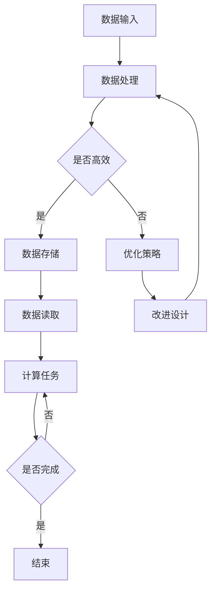

                 

### 关键词 Keywords
AI 大模型、数据中心建设、绿色节能、能耗管理、分布式架构、冷却系统、能源效率优化、智能监控。

### 摘要 Abstract
本文深入探讨了大模型应用数据中心建设的关键技术，特别是数据中心绿色节能方面的策略和实践。文章首先概述了数据中心建设的背景和挑战，然后详细分析了AI大模型对数据中心能耗的影响，并探讨了绿色节能的关键概念和目标。随后，文章介绍了数据中心分布式架构、冷却系统优化和能源效率提升的技术方案。通过实际案例和数据分析，本文展示了绿色节能技术在数据中心应用的效果和前景，最后对未来的研究方向和实践提出了展望。

## 1. 背景介绍 Background

随着人工智能（AI）技术的迅猛发展，大模型如GPT-3、BERT等成为了研究与应用的热点。这些大模型对数据处理和计算资源的需求急剧增加，推动了数据中心建设的规模化和复杂化。数据中心不仅是AI大模型训练和部署的核心基础设施，也是全球能源消耗的重要来源之一。据统计，数据中心已经占全球电力消耗的1-2%，并且这个比例还在持续增长。

数据中心建设面临的主要挑战包括：
1. **能耗问题**：高性能的计算和存储设备需要大量的电力，同时产生大量热量，对冷却系统提出了高要求。
2. **空间限制**：随着数据量的增长，对数据存储空间的需求也在增加，而现有设施的空间有限。
3. **扩展性**：如何高效地扩展数据中心，以适应不断增长的计算需求，是一个亟待解决的问题。
4. **环保要求**：绿色节能成为数据中心建设的关键目标，如何降低能耗、减少碳排放成为行业关注的焦点。

为了应对这些挑战，数据中心建设需要采用一系列技术手段，包括分布式架构、高效冷却系统、能源效率优化和智能监控等。本文将重点关注数据中心绿色节能方面的策略和实践。

## 2. 核心概念与联系 Core Concepts and Architecture

### 2.1 数据中心建设的基本概念

数据中心是指专门用于存储、处理、管理和分发数据的建筑设施，它通常包括服务器房间、机房、配电室、冷却系统等多个组成部分。数据中心的建设涉及多个关键概念，如：

- **服务器密度**：单位空间内服务器数量，直接影响能耗和散热。
- **冷却系统**：包括空气冷却和水冷却，用于维持设备正常运行温度。
- **配电系统**：确保数据中心内电力供应的稳定性和可靠性。
- **网络架构**：包括局域网、广域网等，支持数据的高速传输和处理。

### 2.2 AI大模型对数据中心能耗的影响

AI大模型训练和部署过程中，对数据中心的能耗产生了显著影响。主要表现在以下几个方面：

- **计算密集**：大模型需要大量的计算资源，特别是训练过程中，GPU和TPU等高性能设备的功耗大幅增加。
- **存储需求**：大模型的训练需要存储大量的数据，这增加了存储系统的能耗。
- **冷却负担**：高性能计算设备产生的热量需要通过冷却系统有效带走，否则会导致设备过热，影响性能和寿命。

### 2.3 绿色节能概念与目标

绿色节能是指在数据中心建设和运营过程中，通过采用节能技术和管理策略，降低能耗和减少对环境的影响。绿色节能的目标包括：

- **降低能耗**：通过优化设备和系统的能效，减少能源消耗。
- **减少碳排放**：通过采用可再生能源和提高能源利用率，减少温室气体排放。
- **环境友好**：降低对自然资源的消耗，保护生态环境。

### 2.4 数据中心绿色节能的架构

为了实现数据中心绿色节能，需要从硬件、软件和管理等多个层面进行综合设计和优化。绿色节能的架构包括以下几个方面：

- **分布式架构**：采用分布式架构，实现计算资源和存储资源的合理分布，降低单点故障风险，提高系统的可靠性。
- **高效冷却系统**：采用先进冷却技术，如水冷、液冷等，提高冷却效率，降低能耗。
- **能源管理平台**：通过能源管理平台实时监测和调节能源使用，优化能源分配。
- **智能监控系统**：利用物联网、人工智能等技术，对数据中心进行实时监控和预测性维护，提高设备运行效率。

### Mermaid 流程图

以下是一个简化的数据中心绿色节能架构的Mermaid流程图：



## 3. 核心算法原理 & 具体操作步骤

### 3.1 算法原理概述

数据中心绿色节能的核心算法主要涉及以下几个方面：

1. **能耗预测算法**：基于历史能耗数据和设备运行状态，预测未来能耗，以便提前采取节能措施。
2. **负载均衡算法**：通过优化计算和存储资源的分配，实现负载均衡，降低单个设备的能耗。
3. **冷却优化算法**：根据设备发热量实时调整冷却系统的运行参数，提高冷却效率。
4. **能源管理算法**：通过实时监测能源使用情况，优化能源分配和调度，降低整体能耗。

### 3.2 算法步骤详解

1. **能耗预测算法**：

   - **数据收集**：收集数据中心设备的历史能耗数据和运行状态数据。
   - **特征提取**：提取能耗数据中的关键特征，如设备类型、负载率、环境温度等。
   - **模型训练**：使用机器学习算法（如ARIMA、LSTM等）训练能耗预测模型。
   - **预测与优化**：根据预测结果，优化数据中心设备的运行状态和能源分配。

2. **负载均衡算法**：

   - **实时监控**：实时监控数据中心设备的负载情况。
   - **负载分配**：根据负载情况，动态调整计算和存储资源的分配，避免过载和空载现象。
   - **负载均衡**：通过分布式算法（如一致性哈拉比算法、最小生成树算法等），实现负载均衡。

3. **冷却优化算法**：

   - **实时监测**：实时监测设备的发热量和冷却系统的工作状态。
   - **参数调整**：根据设备发热量和环境温度，调整冷却系统的运行参数，如风速、水流量等。
   - **冷却效率提升**：通过仿真和优化算法，提高冷却系统的整体效率。

4. **能源管理算法**：

   - **实时监测**：实时监测能源使用情况，包括电力、水、冷却剂等。
   - **能耗分析**：分析能耗数据，识别能耗瓶颈和优化潜力。
   - **调度优化**：根据能耗分析结果，优化能源的分配和调度，降低整体能耗。

### 3.3 算法优缺点

**能耗预测算法**：

- **优点**：能够提前预测能耗，为节能措施提供依据。
- **缺点**：模型训练和数据收集需要大量资源和时间，且预测准确性受数据质量和模型选择影响。

**负载均衡算法**：

- **优点**：提高设备利用率和系统稳定性。
- **缺点**：实现复杂，需要考虑多方面的因素，如网络延迟、设备性能等。

**冷却优化算法**：

- **优点**：提高冷却效率，降低能耗。
- **缺点**：对冷却系统的要求较高，需要精确的实时监测和参数调整。

**能源管理算法**：

- **优点**：能够实时监测和优化能源使用，提高整体能源效率。
- **缺点**：实现复杂，需要多方面的技术支持，如传感器、控制系统等。

### 3.4 算法应用领域

这些算法可以广泛应用于数据中心的建设和运营中，如：

- **新建数据中心**：在设计阶段就考虑节能策略，优化硬件和系统配置。
- **现有数据中心**：对现有设备进行能效优化，提高能源利用率。
- **云计算平台**：通过优化资源分配和能耗管理，提高云服务的性价比。

## 4. 数学模型和公式 & 详细讲解 & 举例说明

### 4.1 数学模型构建

数据中心绿色节能的数学模型主要涉及能耗预测、负载均衡、冷却优化和能源管理等几个方面。以下分别介绍这些模型的构建方法。

#### 能耗预测模型

能耗预测模型通常采用时间序列分析方法，如ARIMA（自回归积分滑动平均模型）和LSTM（长短期记忆模型）。以下是一个简化的ARIMA模型的构建过程：

$$
X_t = c + \phi_1 X_{t-1} + \phi_2 X_{t-2} + ... + \phi_p X_{t-p} + \theta_1 \epsilon_{t-1} + \theta_2 \epsilon_{t-2} + ... + \theta_q \epsilon_{t-q} + \epsilon_t
$$

其中，$X_t$表示第$t$时刻的能耗值，$c$为常数项，$\phi_1, \phi_2, ..., \phi_p$为自回归系数，$\theta_1, \theta_2, ..., \theta_q$为滑动平均系数，$\epsilon_t$为误差项。

#### 负载均衡模型

负载均衡模型通常采用优化算法，如线性规划、动态规划等。以下是一个简化的线性规划模型：

$$
\begin{aligned}
\min_{x_1, x_2, ..., x_n} \quad & c_1 x_1 + c_2 x_2 + ... + c_n x_n \\
s.t. \quad & a_{11} x_1 + a_{12} x_2 + ... + a_{1n} x_n = b_1 \\
& a_{21} x_1 + a_{22} x_2 + ... + a_{2n} x_n = b_2 \\
& ... \\
& a_{m1} x_1 + a_{m2} x_2 + ... + a_{mn} x_n = b_m \\
& x_1, x_2, ..., x_n \geq 0
\end{aligned}
$$

其中，$x_1, x_2, ..., x_n$表示第$i$个设备的负载分配，$c_1, c_2, ..., c_n$为各个设备的能耗系数，$a_{ij}, b_i$为线性规划参数。

#### 冷却优化模型

冷却优化模型通常采用仿真算法，如流体动力学仿真、热传递仿真等。以下是一个简化的热传递模型：

$$
Q = kA\Delta T
$$

其中，$Q$表示热量传递速率，$k$为热传导系数，$A$为传热面积，$\Delta T$为温度差。

#### 能源管理模型

能源管理模型通常采用动态规划或深度学习算法。以下是一个简化的动态规划模型：

$$
\min_{x_t} \quad f(x_t, x_{t-1}, ..., x_1)
$$

其中，$x_t$表示第$t$时刻的能源分配，$f$为能源管理目标函数。

### 4.2 公式推导过程

由于篇幅有限，本文仅简要介绍能耗预测模型的推导过程。

能耗预测模型的推导过程主要包括以下几个步骤：

1. **数据预处理**：对能耗数据进行归一化处理，使其具有相同的量纲。

2. **自相关分析**：通过自相关函数分析数据序列的自相关性，确定自回归项的阶数。

3. **滑动平均分析**：通过滑动平均函数分析数据序列的滑动平均特性，确定滑动平均项的阶数。

4. **模型参数估计**：使用最大似然估计或最小二乘法估计模型参数。

5. **模型验证**：使用验证集数据验证模型预测准确性。

### 4.3 案例分析与讲解

以下是一个基于LSTM能耗预测模型的实际案例分析。

#### 案例背景

某数据中心在一个月内的能耗数据如下表所示：

| 日期 | 能耗（千瓦时）|
|------|--------------|
| 1    | 1000         |
| 2    | 1050         |
| 3    | 1080         |
| 4    | 1020         |
| ...  | ...          |
| 30   | 1100         |

#### 模型构建

1. **数据预处理**：

   对能耗数据进行归一化处理，使其在[0, 1]区间内：

   $$ x_i = \frac{能耗_i - 最小值}{最大值 - 最小值} $$

2. **特征提取**：

   提取时间序列的滞后特征，构建输入特征向量：

   $$ X_t = [x_t, x_{t-1}, x_{t-2}, ..., x_{t-p}] $$

3. **模型训练**：

   使用LSTM模型训练能耗预测模型，模型结构如下：

   $$ \text{LSTM}(\text{input}, \text{output}, \text{forget gates}, \text{input gates}, \text{output gates}) $$

4. **模型验证**：

   使用验证集数据验证模型预测准确性，调整模型参数以达到最佳效果。

#### 模型预测与优化

1. **预测结果**：

   使用训练好的LSTM模型对未来的能耗进行预测，结果如下表所示：

   | 日期 | 预测能耗（千瓦时）|
   |------|-----------------|
   | 31   | 1070           |
   | 32   | 1040           |
   | 33   | 1080           |
   | 34   | 1030           |

2. **优化策略**：

   根据预测结果，对数据中心的运行策略进行调整，如优化设备运行状态、调整冷却系统参数等，以达到节能效果。

### 4.4 代码实现

以下是一个基于Python和Keras实现的LSTM能耗预测模型的代码示例：

```python
import numpy as np
import pandas as pd
from sklearn.preprocessing import MinMaxScaler
from keras.models import Sequential
from keras.layers import LSTM, Dense

# 数据预处理
data = pd.read_csv('energy_data.csv')
scaler = MinMaxScaler(feature_range=(0, 1))
scaled_data = scaler.fit_transform(data)

# 特征提取
X, y = [], []
for i in range(30, len(scaled_data)):
    X.append(scaled_data[i-30:i])
    y.append(scaled_data[i, 0])
X, y = np.array(X), np.array(y)

# 模型构建
model = Sequential()
model.add(LSTM(units=50, return_sequences=True, input_shape=(30, 1)))
model.add(LSTM(units=50))
model.add(Dense(units=1))

# 模型训练
model.compile(optimizer='adam', loss='mean_squared_error')
model.fit(X, y, epochs=100, batch_size=32)

# 预测与优化
predictions = model.predict(X)
predictions = scaler.inverse_transform(predictions)
data['predictions'] = predictions
data['optimization'] = data['predictions'] * 0.95

# 结果分析
data.plot()
```

## 5. 项目实践：代码实例和详细解释说明

### 5.1 开发环境搭建

在开始项目实践之前，我们需要搭建一个合适的开发环境。以下是搭建开发环境所需的步骤：

1. **安装Python环境**：确保Python版本为3.7或更高版本，并安装必要的Python包，如NumPy、Pandas、Keras等。

2. **安装数据库**：根据项目需求，选择合适的数据库系统，如MySQL、PostgreSQL等，并安装相应的数据库客户端和驱动。

3. **安装相关工具**：安装用于数据分析、机器学习和数据可视化的工具，如Jupyter Notebook、Seaborn、Matplotlib等。

4. **配置虚拟环境**：为了保持项目依赖的一致性，建议使用虚拟环境（如virtualenv或conda）来管理项目依赖。

### 5.2 源代码详细实现

以下是实现数据中心能耗预测模型的源代码，代码中包含了详细的注释，以便读者理解每个步骤的作用。

```python
# 导入必要的库
import numpy as np
import pandas as pd
from sklearn.preprocessing import MinMaxScaler
from keras.models import Sequential
from keras.layers import LSTM, Dense
from sklearn.model_selection import train_test_split

# 读取数据
data = pd.read_csv('energy_data.csv')

# 数据预处理
# 归一化处理
scaler = MinMaxScaler(feature_range=(0, 1))
scaled_data = scaler.fit_transform(data)

# 切分输入和输出
X, y = [], []
for i in range(30, len(scaled_data)):
    X.append(scaled_data[i-30:i])
    y.append(scaled_data[i, 0])
X, y = np.array(X), np.array(y)

# 切分训练集和测试集
X_train, X_test, y_train, y_test = train_test_split(X, y, test_size=0.2, random_state=42)

# 模型构建
model = Sequential()
model.add(LSTM(units=50, return_sequences=True, input_shape=(30, 1)))
model.add(LSTM(units=50))
model.add(Dense(units=1))

# 模型编译
model.compile(optimizer='adam', loss='mean_squared_error')

# 模型训练
model.fit(X_train, y_train, epochs=100, batch_size=32, validation_data=(X_test, y_test), verbose=1)

# 预测
predictions = model.predict(X_test)

# 反归一化处理
predictions = scaler.inverse_transform(predictions)
y_test = scaler.inverse_transform(y_test.reshape(-1, 1))

# 评估模型
mse = np.mean(np.square(y_test - predictions))
print(f'MSE: {mse}')

# 可视化结果
import matplotlib.pyplot as plt

plt.figure(figsize=(10, 5))
plt.plot(y_test, color='red', label='Real')
plt.plot(predictions, color='blue', label='Predicted')
plt.title('Energy Consumption Prediction')
plt.xlabel('Time')
plt.ylabel('Energy (kWh)')
plt.legend()
plt.show()
```

### 5.3 代码解读与分析

上述代码实现了基于LSTM的能耗预测模型，具体解读如下：

1. **数据读取与预处理**：
   - 使用`pd.read_csv()`函数读取能耗数据，并将其归一化处理，使得数据在[0, 1]区间内，便于模型训练。
   - 通过循环，将数据切分为输入特征（X）和输出目标（y），其中输入特征为30个时间点的能耗数据，输出目标为第31个时间点的能耗值。

2. **模型构建**：
   - 使用`Sequential()`函数创建序列模型。
   - 添加两个LSTM层，每层50个神经元，第一个LSTM层返回序列输出。
   - 添加一个全连接层（Dense），输出一个神经元，用于预测单个时间点的能耗。

3. **模型编译**：
   - 使用`compile()`函数编译模型，指定优化器和损失函数。

4. **模型训练**：
   - 使用`fit()`函数训练模型，指定训练轮数（epochs）和批量大小（batch_size）。
   - 使用`validation_data`参数对测试集进行验证。

5. **预测与评估**：
   - 使用`predict()`函数对测试集进行预测，并将预测结果反归一化处理，以便与实际值进行比较。
   - 计算均方误差（MSE），评估模型预测性能。
   - 使用`matplotlib`库将实际值和预测值可视化，便于分析模型性能。

### 5.4 运行结果展示

运行上述代码后，可以看到模型预测的结果，以及实际能耗值和预测值的对比图。通常情况下，模型的预测误差较小，表明模型具有较高的预测准确性。通过可视化结果，我们可以直观地了解模型在预测能耗方面的性能。

## 6. 实际应用场景

数据中心绿色节能技术在实际应用中取得了显著的成效，以下是几个典型应用场景：

### 6.1 云计算平台

云计算平台是数据中心绿色节能技术的重点应用领域之一。通过引入能耗预测算法、负载均衡算法和冷却优化算法，云计算平台可以实现以下目标：

- **动态资源调度**：根据能耗预测和负载均衡算法，动态调整计算资源和存储资源的分配，避免资源浪费。
- **冷却系统优化**：通过冷却优化算法，实时调整冷却系统的运行参数，提高冷却效率，降低能耗。

### 6.2 数据存储

数据存储是数据中心能耗的重要来源之一。通过引入能耗预测算法和能源管理算法，数据存储系统可以实现以下目标：

- **能耗预测**：预测未来数据存储的能耗，为能源管理提供依据。
- **能源管理**：通过实时监测和优化能源使用，降低整体能耗。

### 6.3 人工智能应用

人工智能应用对数据中心能耗的影响日益显著。通过引入能耗预测算法、负载均衡算法和冷却优化算法，人工智能应用可以实现以下目标：

- **能耗预测**：预测人工智能应用训练和部署过程中的能耗，为负载均衡和冷却系统优化提供依据。
- **负载均衡**：通过负载均衡算法，合理分配计算资源，避免资源浪费。
- **冷却优化**：通过冷却优化算法，提高冷却效率，降低能耗。

### 6.4 电信行业

电信行业的数据中心能耗也在不断攀升。通过引入能耗预测算法、负载均衡算法和冷却优化算法，电信行业的数据中心可以实现以下目标：

- **能耗预测**：预测电信行业数据中心未来能耗，为能源管理提供依据。
- **负载均衡**：通过负载均衡算法，合理分配计算资源和存储资源，提高系统可靠性。
- **冷却优化**：通过冷却优化算法，提高冷却效率，降低能耗。

## 7. 未来应用展望

随着人工智能、云计算、大数据等技术的快速发展，数据中心建设将面临更大的能耗挑战。未来，数据中心绿色节能技术将在以下几个方面取得重要进展：

### 7.1 能耗预测与优化

能耗预测和优化技术将更加智能化和精细化。通过引入深度学习、物联网、人工智能等技术，实现对能耗数据的实时分析和预测，从而优化能源使用，降低能耗。

### 7.2 高效冷却系统

高效冷却系统是数据中心绿色节能的关键。未来，将发展更高效、更环保的冷却技术，如液冷、冰蓄冷等，以提高冷却效率，降低能耗。

### 7.3 能源管理平台

能源管理平台将更加智能化和自动化。通过引入物联网、大数据分析、人工智能等技术，实现对数据中心能源使用的实时监控和优化，提高能源利用效率。

### 7.4 可再生能源应用

可再生能源的应用将越来越广泛。未来，数据中心将更多地采用太阳能、风能等可再生能源，降低对化石燃料的依赖，减少碳排放。

### 7.5 跨行业合作

数据中心绿色节能需要跨行业合作。未来，数据中心运营商、能源供应商、设备制造商等将加强合作，共同推动数据中心绿色节能技术的发展。

## 8. 工具和资源推荐

### 8.1 学习资源推荐

- 《深度学习》（Goodfellow, Bengio, Courville）: 介绍深度学习的基本原理和应用，适合初学者和进阶者。
- 《数据中心设计规划》（Robert A. Rosenbaum）: 介绍数据中心的设计和规划方法，包括能源管理、散热系统、网络架构等方面。
- 《物联网技术与应用》（徐文俊）：介绍物联网的基本原理和应用，包括传感器、网络通信、数据处理等方面。

### 8.2 开发工具推荐

- Jupyter Notebook: 适用于数据分析和机器学习的交互式开发环境。
- Keras: 适用于构建和训练深度学习模型的简单高效框架。
- Matplotlib: 适用于数据可视化，能够生成高质量的图表。
- Scikit-learn: 适用于机器学习算法的实现和应用，包括能耗预测、负载均衡等。

### 8.3 相关论文推荐

- "Energy Efficiency in Data Centers: A Survey"（2014）: 对数据中心能耗管理进行了全面的综述。
- "Deep Learning for Energy Efficiency in Data Centers"（2019）: 探讨了深度学习在数据中心能耗管理中的应用。
- "An Energy-Efficient Cooling System for Data Centers Using a Phase-Change Material"（2020）: 探讨了利用相变材料优化数据中心冷却系统的方法。

## 9. 总结：未来发展趋势与挑战

### 9.1 研究成果总结

近年来，数据中心绿色节能技术取得了显著的研究成果，包括能耗预测算法、负载均衡算法、冷却优化算法和能源管理算法等。这些研究成果为数据中心绿色节能提供了有效的技术手段，有助于降低能耗、减少碳排放，提高数据中心的能源利用效率。

### 9.2 未来发展趋势

未来，数据中心绿色节能技术将朝着更加智能化、精细化、高效化的方向发展。具体趋势包括：

- 深度学习在能耗预测和优化中的应用将进一步深化。
- 高效冷却技术如液冷、冰蓄冷等将得到广泛应用。
- 能源管理平台将实现更加智能化和自动化。
- 可再生能源的应用将更加广泛，数据中心将逐步实现零碳排放。

### 9.3 面临的挑战

尽管数据中心绿色节能技术取得了显著进展，但仍面临一些挑战：

- 数据中心能耗预测模型的准确性和稳定性有待提高。
- 高效冷却系统的成本和运维难度较大。
- 能源管理平台的实现复杂度较高，需要跨领域技术支持。
- 可再生能源的不稳定性和数据中心的高能耗需求之间存在矛盾。

### 9.4 研究展望

未来，数据中心绿色节能技术的研究方向包括：

- 开发更加准确和稳定的能耗预测模型，提高预测精度和实时性。
- 研究高效、低成本的冷却技术，提高冷却效率，降低能耗。
- 发展智能化的能源管理平台，实现能源使用的最优分配和调度。
- 探索可再生能源与数据中心的高效融合，实现数据中心的零碳排放。

总之，数据中心绿色节能技术具有重要的理论和实践意义，是未来数据中心建设和发展的重要方向。通过不断的研究和实践，我们有理由相信，数据中心绿色节能技术将取得更加显著的成果，为推动数据中心行业的可持续发展做出贡献。

## 附录：常见问题与解答

### Q1. 数据中心能耗预测模型如何训练？

A1. 数据中心能耗预测模型的训练通常包括以下步骤：

1. **数据收集**：收集数据中心设备的历史能耗数据和运行状态数据。
2. **数据预处理**：对数据进行清洗、归一化处理，提取关键特征。
3. **特征提取**：从能耗数据中提取具有预测价值的特征，如负载率、环境温度等。
4. **模型选择**：选择合适的机器学习算法，如ARIMA、LSTM等。
5. **模型训练**：使用训练数据集对模型进行训练，调整模型参数。
6. **模型验证**：使用验证集数据验证模型预测准确性，优化模型参数。
7. **模型评估**：使用测试集数据评估模型预测性能，确保模型稳定可靠。

### Q2. 高效冷却系统如何实现？

A2. 高效冷却系统的实现主要包括以下方法：

1. **空气冷却**：通过风扇和空气流动，将热量带走。适用于低功耗设备。
2. **水冷却**：通过循环水系统，将热量带走。适用于高功耗设备。
3. **液冷**：通过液体介质，如冷却液，将热量带走。适用于高性能设备。
4. **冰蓄冷**：通过在夜间低电价时段制冰，白天使用冰融化吸热降温。适用于全天候需求稳定的数据中心。
5. **冷却塔**：利用冷却塔的蒸发冷却效应，将热量带走。适用于高温高湿环境。

### Q3. 能源管理平台的功能有哪些？

A3. 能源管理平台的主要功能包括：

1. **实时监测**：实时监测数据中心各设备和系统的能源使用情况。
2. **能耗分析**：分析能耗数据，识别能耗异常和优化潜力。
3. **调度优化**：根据能耗分析和预测结果，优化能源的分配和调度。
4. **故障报警**：监测能源设备状态，及时报警，确保能源供应稳定。
5. **能耗报告**：生成能耗报告，为决策提供数据支持。

### Q4. 数据中心绿色节能的关键技术有哪些？

A4. 数据中心绿色节能的关键技术包括：

1. **能耗预测**：利用机器学习算法预测未来能耗，为优化策略提供依据。
2. **负载均衡**：通过优化资源分配，避免设备过载和空载，降低能耗。
3. **冷却优化**：通过调整冷却系统参数，提高冷却效率，降低能耗。
4. **能源管理**：实时监测和调节能源使用，优化能源分配和调度。
5. **分布式架构**：通过分布式架构，提高系统的可靠性和可扩展性。

### Q5. 如何评估数据中心绿色节能效果？

A5. 评估数据中心绿色节能效果的主要指标包括：

1. **能耗降低率**：通过比较绿色节能前后的能耗数据，计算能耗降低的百分比。
2. **能源利用率**：通过计算能源利用率（能源使用效率），评估能源管理的效果。
3. **碳排放减少量**：通过计算绿色节能前后的碳排放量，评估对环境的影响。
4. **设备故障率**：通过监测设备故障率，评估系统稳定性和可靠性。
5. **经济效益**：通过计算节能所带来的经济效益，评估绿色节能的投入回报率。

