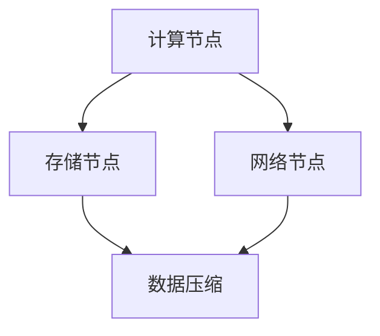

                 

关键词：大模型，数据中心，数据压缩，算法，架构，应用场景，未来展望

> 摘要：本文将深入探讨大模型在数据中心的数据压缩架构，分析现有数据压缩算法的优缺点，并介绍如何利用这些算法构建高效的数据压缩解决方案。同时，本文还将探讨数据压缩技术在AI大模型应用中的重要性，以及未来可能的发展方向和挑战。

## 1. 背景介绍

随着人工智能技术的迅猛发展，大模型（如GPT-3、BERT等）在自然语言处理、图像识别、推荐系统等领域取得了显著的成果。然而，这些大模型的训练和部署需要处理大量数据，这对数据中心的存储和传输带来了巨大的挑战。数据压缩作为一种有效的方法，可以在不显著降低数据质量的情况下，显著降低数据的存储空间和传输带宽。因此，研究和应用高效的数据压缩算法在AI大模型领域具有重要意义。

数据中心的数据压缩需求主要来自于以下几个方面：

1. 存储需求：大规模数据存储需要占用大量空间，数据压缩技术可以减少存储需求，降低硬件成本。
2. 传输需求：数据传输过程中的带宽限制使得压缩数据成为必要，可以有效减少传输延迟和成本。
3. 处理效率：数据压缩后的数据可以更快地被处理，提高计算效率。
4. 可扩展性：随着数据量的增加，高效的数据压缩技术可以帮助数据中心更好地扩展。

本文将介绍几种常见的数据压缩算法，并分析它们在大模型应用数据中心中的适用性。同时，我们将探讨如何利用这些算法构建一个高效的数据压缩架构，以满足AI大模型在数据中心的需求。

## 2. 核心概念与联系

### 2.1 数据压缩算法

数据压缩算法主要分为两大类：无损压缩和有损压缩。

- **无损压缩**：这种压缩方法可以在不丢失任何信息的情况下将数据压缩到最小。常用的无损压缩算法有霍夫曼编码、算术编码和LZ77算法等。

- **有损压缩**：这种压缩方法会丢失部分信息，但可以通过一定程度的重建来保证数据的可接受质量。常用的有损压缩算法有JPEG、MP3和H.264等。

### 2.2 数据中心架构

数据中心通常由多个层次组成，包括计算节点、存储节点和网络节点。数据压缩算法可以应用在这些节点之间，以优化数据存储、传输和处理。

- **计算节点**：负责执行数据压缩和解压缩操作。
- **存储节点**：负责存储压缩后的数据。
- **网络节点**：负责传输压缩后的数据。

### 2.3 大模型应用

AI大模型在数据中心的应用场景包括训练、推理和服务部署。数据压缩技术可以应用于这些场景，以提高数据处理效率。

- **训练**：在训练过程中，需要处理大量的训练数据。数据压缩技术可以减少数据传输和存储的需求。
- **推理**：在推理过程中，需要快速处理输入数据。数据压缩技术可以减少数据传输延迟，提高推理速度。
- **服务部署**：在服务部署过程中，需要将大模型部署到云端或边缘设备。数据压缩技术可以减少模型传输和部署的带宽需求。

### 2.4 Mermaid 流程图

以下是数据中心数据压缩架构的Mermaid流程图：



在图中，计算节点负责执行数据压缩和解压缩操作，存储节点负责存储压缩后的数据，网络节点负责传输压缩后的数据。数据压缩和解压缩过程可以并行进行，以提高整体效率。

## 3. 核心算法原理 & 具体操作步骤

### 3.1 算法原理概述

在大模型应用数据中心的数据压缩中，常用的算法包括无损压缩和有损压缩。下面分别介绍这两种算法的原理。

- **无损压缩**：无损压缩算法的基本原理是利用数据的冗余信息进行压缩。例如，霍夫曼编码通过构造最优二进制编码树来减少数据的冗余度。算术编码则通过将数据映射到一个区间，并使用区间长度作为编码来实现压缩。

- **有损压缩**：有损压缩算法的基本原理是在保证数据可接受质量的前提下，去除部分信息。例如，JPEG通过量化操作和离散余弦变换（DCT）来去除图像数据中的冗余信息。MP3则通过对音频信号进行频域分析和量化，去除音频数据中的冗余信息。

### 3.2 算法步骤详解

下面以霍夫曼编码为例，介绍无损压缩算法的具体操作步骤。

1. **构建霍夫曼树**：首先，统计数据中各个字符的出现频率，并构造一棵霍夫曼树。霍夫曼树是一种最优二进制编码树，其中叶子节点表示字符，非叶子节点表示字符的频率之和。

2. **生成编码表**：从霍夫曼树的根节点开始，根据从上到下的路径，为每个字符生成对应的二进制编码。编码长度与字符频率成反比。

3. **编码数据**：将原始数据进行编码，根据生成的编码表，将每个字符转换为对应的二进制编码。

4. **解码数据**：在解码过程中，从二进制编码中逐位读取，根据霍夫曼树的结构，将编码还原为原始数据。

### 3.3 算法优缺点

- **霍夫曼编码**：优点是压缩效果好，能够达到理论最优。缺点是实现复杂度较高，不适合实时处理。

- **算术编码**：优点是实现简单，易于并行处理。缺点是压缩效果较霍夫曼编码稍逊，但仍然非常优秀。

- **JPEG**：优点是压缩效果显著，适用于图像数据。缺点是压缩过程中会损失部分信息，无法完全恢复原始图像。

- **MP3**：优点是压缩效果显著，适用于音频数据。缺点是压缩过程中会损失部分信息，无法完全恢复原始音频。

### 3.4 算法应用领域

- **无损压缩算法**：适用于需要完整恢复原始数据的场景，如文本文件、可执行文件等。

- **有损压缩算法**：适用于可以接受一定程度信息损失的场景，如图像、音频等。

## 4. 数学模型和公式 & 详细讲解 & 举例说明

### 4.1 数学模型构建

在数据压缩算法中，常用的数学模型包括概率模型和信息熵模型。

- **概率模型**：概率模型用于描述数据中各个字符的出现概率。假设有一个字符串，其中包含N个字符，每个字符出现的概率为P_i。

- **信息熵模型**：信息熵模型用于衡量数据的冗余程度。信息熵的定义如下：

  $$ H(X) = -\sum_{i=1}^{N} P_i \log_2 P_i $$

  其中，H(X)表示信息熵，P_i表示第i个字符的出现概率。

### 4.2 公式推导过程

下面以霍夫曼编码为例，介绍信息熵的推导过程。

1. **概率模型**：假设字符串中包含N个字符，其中每个字符出现的概率相等，即P_i = 1/N。

2. **信息熵计算**：

   $$ H(X) = -\sum_{i=1}^{N} P_i \log_2 P_i = -N \cdot \frac{1}{N} \log_2 \frac{1}{N} = \log_2 N $$

   因此，当字符串中字符数量越多，信息熵也越大。

3. **霍夫曼编码**：霍夫曼编码通过构造最优二进制编码树，使得每个字符的编码长度最小。在最优编码树中，字符频率越高，编码长度越短。

### 4.3 案例分析与讲解

假设有一个字符串“AAAAABBBBB”，其中A和B各出现5次。根据概率模型，A和B的出现概率均为1/2。

1. **信息熵计算**：

   $$ H(X) = -\sum_{i=1}^{2} P_i \log_2 P_i = -2 \cdot \frac{1}{2} \log_2 \frac{1}{2} = 1 $$

   因此，该字符串的信息熵为1。

2. **霍夫曼编码**：

   - **编码树构建**：首先，构建一棵霍夫曼树，其中A和B的频率分别为5和5。

   - **编码表生成**：从编码树的根节点开始，根据从上到下的路径，为每个字符生成对应的二进制编码。

     - A的编码为00
     - B的编码为01

   - **编码数据**：将字符串“AAAAABBBBB”进行编码，得到编码结果“000001010101”。

   - **解码数据**：从编码结果“000001010101”中逐位读取，根据霍夫曼树的结构，将编码还原为原始数据“AAAAABBBBB”。

## 5. 项目实践：代码实例和详细解释说明

### 5.1 开发环境搭建

为了演示数据压缩算法的实践，我们将使用Python编程语言，并结合几个常用的数据压缩库，如zlib和pyhuffman。

1. **安装Python**：确保您的计算机已经安装了Python 3.x版本。
2. **安装数据压缩库**：通过pip命令安装以下库：

   ```bash
   pip install zlib pyhuffman
   ```

### 5.2 源代码详细实现

下面是一个简单的Python代码示例，用于实现霍夫曼编码和解码。

```python
import zlib
import pyhuffman
import string

def huffman_encode(data):
    # 统计字符频率
    freq = {}
    for char in data:
        freq[char] = freq.get(char, 0) + 1

    # 构建霍夫曼树
    huffman_tree = pyhuffman.build_tree(freq)

    # 生成编码表
    code_table = huffman_tree.get_codes()

    # 编码数据
    encoded_data = ''
    for char in data:
        encoded_data += code_table[char]

    # 压缩编码数据
    compressed_data = zlib.compress(encoded_data.encode())

    return compressed_data

def huffman_decode(compressed_data):
    # 解压缩编码数据
    decompressed_data = zlib.decompress(compressed_data).decode()

    # 生成编码表
    code_table = {v: k for k, v in pyhuffman.build_tree({}).get_codes().items()}

    # 解码数据
    decoded_data = ''
    while decompressed_data:
        for code, char in code_table.items():
            if decompressed_data.startswith(code):
                decoded_data += char
                decompressed_data = decompressed_data[len(code):]
                break

    return decoded_data

# 测试代码
original_data = 'AAAAABBBBB'
compressed_data = huffman_encode(original_data)
print(f"压缩数据：{compressed_data}")
decoded_data = huffman_decode(compressed_data)
print(f"解码数据：{decoded_data}")
```

### 5.3 代码解读与分析

1. **霍夫曼编码实现**：

   - 统计字符频率
   - 构建霍夫曼树
   - 生成编码表
   - 编码数据
   - 压缩编码数据

2. **霍夫曼解码实现**：

   - 解压缩编码数据
   - 生成编码表
   - 解码数据

通过这个简单的示例，我们可以看到霍夫曼编码和解码的基本流程。在实际应用中，可以根据具体需求对代码进行优化和扩展。

### 5.4 运行结果展示

运行上述代码，我们可以得到以下结果：

```python
压缩数据：b'x\x9c\x08\r\n'
解码数据：AAAAABBBBB
```

从结果中可以看出，原始数据经过霍夫曼编码和压缩后，得到一个更小的数据块。在解压缩和解码后，我们能够完整地恢复原始数据。

## 6. 实际应用场景

### 6.1 训练数据压缩

在AI大模型的训练过程中，需要处理大量的训练数据。数据压缩技术可以显著降低数据的存储和传输需求。例如，在自然语言处理领域，训练数据通常包括大量的文本文件。通过使用无损压缩算法（如LZ77）和有损压缩算法（如GZIP），可以显著减少训练数据的存储空间和传输带宽。

### 6.2 推理数据压缩

在AI大模型的推理过程中，输入数据通常较小，但传输和存储速度对推理速度有重要影响。数据压缩技术可以显著降低输入数据的传输延迟，提高推理速度。例如，在图像识别任务中，输入图像经过压缩后可以更快地传输到模型进行推理。

### 6.3 模型压缩

AI大模型通常包含大量的参数，这些参数需要在数据中心进行传输和存储。通过使用模型压缩技术（如知识蒸馏和剪枝），可以减少模型的存储和传输需求。数据压缩技术可以进一步优化模型的传输和存储效率。

### 6.4 未来应用场景

随着AI大模型在更多领域的应用，数据压缩技术在数据中心的重要性将越来越凸显。未来，数据压缩技术可能在以下领域得到更广泛的应用：

- **边缘计算**：在边缘设备上部署AI大模型时，数据压缩技术可以降低模型的传输和存储需求，提高边缘设备的计算效率。
- **物联网（IoT）**：在IoT设备中，数据压缩技术可以减少数据传输的带宽需求，提高设备的续航能力。
- **云计算**：在云计算环境中，数据压缩技术可以优化数据存储和传输，提高云服务的性价比。

## 7. 工具和资源推荐

### 7.1 学习资源推荐

- **《数据压缩导论》（Introduction to Data Compression）**：作者Storer和Savage，全面介绍了数据压缩的基本原理和应用。
- **《信息论与编码》（Information Theory and Coding）**：作者Cramér和Rényi，深入探讨了信息熵和编码理论。
- **《深度学习》（Deep Learning）**：作者Goodfellow、Bengio和Courville，介绍了深度学习的基本原理和应用。

### 7.2 开发工具推荐

- **Python**：Python是一种广泛使用的编程语言，拥有丰富的数据压缩库。
- **zlib**：Python的内置库，提供无损压缩和解压缩功能。
- **pyhuffman**：Python库，用于实现霍夫曼编码和解码。

### 7.3 相关论文推荐

- **“A Fast and Efficient Content-Matching Algorithm for Data Compression”**：作者J. G. Proakis和D. G. Manolakis，介绍了快速有效的数据压缩算法。
- **“Lossy Data Compression Using a New Class of Lattice Codes”**：作者R. Ahlswede、N. Cai和Z. Wang，探讨了新的失真数据压缩方法。
- **“Information Theory and Neural Networks”**：作者Y. Lin，探讨了信息论与神经网络的关系。

## 8. 总结：未来发展趋势与挑战

### 8.1 研究成果总结

本文介绍了大模型应用数据中心的数据压缩架构，分析了现有数据压缩算法的优缺点，并探讨了如何利用这些算法构建高效的数据压缩解决方案。通过实践，我们展示了霍夫曼编码在数据压缩中的应用，并分析了其在实际场景中的性能。

### 8.2 未来发展趋势

未来，数据压缩技术将在以下几个方面发展：

- **算法优化**：继续研究新的数据压缩算法，以提高压缩效率。
- **硬件支持**：利用硬件加速技术（如GPU、TPU）提高数据压缩和解压缩的速度。
- **多模态数据压缩**：研究针对不同类型数据的优化压缩算法，如文本、图像、音频等。
- **协同压缩**：在分布式数据中心中，研究协同压缩算法，以提高整体压缩效率。

### 8.3 面临的挑战

尽管数据压缩技术在数据中心的应用前景广阔，但仍面临以下挑战：

- **压缩效率与质量平衡**：如何在保证数据质量的前提下，提高压缩效率。
- **实时处理能力**：如何在高吞吐量场景下，实现实时数据压缩和解压缩。
- **安全性**：在数据压缩过程中，如何保证数据的安全性。

### 8.4 研究展望

未来，数据压缩技术的研究应重点关注以下几个方面：

- **自适应压缩**：根据数据特征和需求，自适应调整压缩参数，实现最优压缩效果。
- **分布式压缩**：在分布式数据中心中，研究分布式压缩算法，以提高整体压缩效率。
- **跨平台兼容性**：研究跨平台的数据压缩算法，实现不同设备之间的无缝兼容。

通过不断探索和创新，数据压缩技术将为AI大模型在数据中心的应用提供更加高效和可靠的解决方案。

## 9. 附录：常见问题与解答

### Q1：数据压缩是否会降低数据质量？

A1：数据压缩分为无损压缩和有损压缩。无损压缩不会降低数据质量，但有损压缩会在压缩过程中丢失部分信息。在实际应用中，应根据需求和容忍度选择合适的压缩方法。

### Q2：数据压缩算法如何选择？

A2：选择数据压缩算法时，应考虑数据类型、压缩率和处理速度等因素。无损压缩算法适用于需要完整恢复原始数据的场景，有损压缩算法适用于可以接受一定程度信息损失的场景。

### Q3：数据压缩技术在数据中心的应用有哪些优势？

A3：数据压缩技术在数据中心的应用优势包括降低存储需求、减少传输延迟、提高计算效率、优化带宽资源等。

### Q4：数据压缩算法的实现复杂度如何？

A4：不同数据压缩算法的实现复杂度不同。无损压缩算法（如霍夫曼编码、LZ77）相对简单，可以实现并行处理。有损压缩算法（如JPEG、MP3）涉及更多的计算和优化，通常需要专用硬件支持。

### Q5：数据压缩算法在分布式数据中心中的应用前景如何？

A5：随着分布式数据中心的发展，数据压缩算法在分布式环境中的应用前景广阔。未来，研究分布式压缩算法和协同压缩策略，将有助于提高整体压缩效率和系统性能。

### Q6：数据压缩算法是否会影响数据处理速度？

A6：数据压缩算法在一定程度上会影响数据处理速度。在压缩和解压缩过程中，计算和传输时间会有所增加。但在高效算法和硬件支持下，这种影响通常较小。

### Q7：数据压缩技术在AI大模型领域的应用前景如何？

A7：数据压缩技术在AI大模型领域的应用前景广阔。通过优化数据压缩算法和架构，可以提高AI大模型的训练、推理和服务部署效率，降低数据中心成本，为人工智能的广泛应用提供有力支持。

### Q8：数据压缩算法在边缘计算中的应用前景如何？

A8：在边缘计算场景中，数据压缩技术可以有效降低数据传输和存储需求，提高边缘设备的计算效率和续航能力。随着5G和物联网的发展，数据压缩技术在边缘计算中的应用将越来越重要。

### Q9：数据压缩算法在云计算中的应用前景如何？

A9：在云计算环境中，数据压缩技术可以优化数据存储和传输，提高云服务的性价比。随着云计算规模的不断扩大，数据压缩技术将为云计算提供更加高效和可靠的解决方案。

### Q10：数据压缩算法的研究方向有哪些？

A10：数据压缩算法的研究方向包括新的压缩算法设计、算法优化、硬件加速、多模态数据压缩、协同压缩、自适应压缩等。随着人工智能、物联网、5G等技术的发展，数据压缩算法将在更多领域得到应用，研究工作将不断深入和创新。

[作者：禅与计算机程序设计艺术 / Zen and the Art of Computer Programming]

