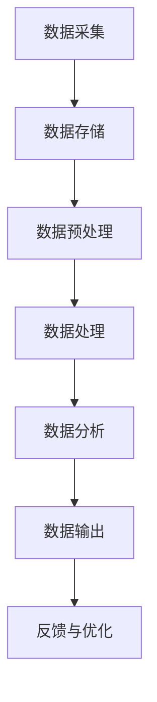

                 

关键词：AI 大模型，数据中心，数据流架构，分布式计算，性能优化

摘要：本文深入探讨了 AI 大模型应用在数据中心的数据流架构设计，分析了当前主流的数据流处理技术及其优缺点，以及如何构建高效、可靠和可扩展的数据流架构。通过对核心算法、数学模型、项目实践和未来应用场景的详细阐述，为读者提供了一个全面的技术视角，旨在为数据中心领域的技术实践提供参考和指导。

## 1. 背景介绍

随着人工智能技术的飞速发展，AI 大模型在各个领域得到了广泛应用，如自然语言处理、计算机视觉、推荐系统等。这些模型通常需要处理海量数据，并对数据流进行实时分析、处理和预测。数据中心作为 AI 大模型的主要运行环境，其数据流架构的设计直接影响到系统的性能、可靠性和可扩展性。

数据中心的数据流架构涉及到多个层次，包括数据采集、数据存储、数据预处理、数据处理、数据分析和数据输出。其中，数据流处理技术是实现这些功能的核心，其设计的好坏直接决定了整个系统的效率和质量。

## 2. 核心概念与联系

### 2.1 分布式计算

分布式计算是一种将计算任务分布在多个计算机上，通过协同工作来完成计算的技术。在数据中心，分布式计算可以有效地利用资源，提高系统的性能和可靠性。常见的分布式计算框架有 Hadoop、Spark 和 Flink 等。

### 2.2 数据流处理技术

数据流处理技术是指在数据流中实时处理和分析数据的技术。常见的有批处理（Batch Processing）和实时处理（Real-time Processing）两种模式。批处理适用于处理批量数据，而实时处理适用于对实时数据的分析。

### 2.3 数据流架构

数据流架构是指将数据流中的各个处理环节有机地连接在一起，形成一个完整的数据处理流程。一个典型的数据流架构包括数据采集、数据存储、数据预处理、数据处理、数据分析和数据输出等环节。

### 2.4 Mermaid 流程图

以下是 AI 大模型应用数据中心的数据流架构的 Mermaid 流程图：



## 3. 核心算法原理 & 具体操作步骤

### 3.1 算法原理概述

AI 大模型应用的数据流架构主要基于分布式计算和数据流处理技术。其中，核心算法包括深度学习算法、图神经网络算法和推荐系统算法等。这些算法的原理如下：

- **深度学习算法**：通过多层神经网络对数据进行特征提取和模式识别。
- **图神经网络算法**：利用图结构表示数据，并通过图神经网络对数据进行学习。
- **推荐系统算法**：基于用户行为数据和物品属性，为用户推荐相关物品。

### 3.2 算法步骤详解

1. **数据采集**：从各种数据源（如数据库、日志文件、传感器等）采集数据。
2. **数据存储**：将采集到的数据存储到分布式存储系统（如 HDFS、Cassandra 等）。
3. **数据预处理**：对数据进行清洗、去重、格式转换等预处理操作。
4. **数据处理**：利用分布式计算框架（如 Spark、Flink 等）对数据进行处理，包括特征提取、模型训练等。
5. **数据分析**：对处理后的数据进行统计分析和可视化展示。
6. **数据输出**：将分析结果输出到数据仓库或数据库中，以供后续使用。
7. **反馈与优化**：根据分析结果对数据流架构进行调整和优化。

### 3.3 算法优缺点

- **深度学习算法**：优点是能够自动学习数据中的复杂模式，但缺点是需要大量的数据和计算资源。
- **图神经网络算法**：优点是能够处理复杂的关系网络，但缺点是计算复杂度高。
- **推荐系统算法**：优点是能够为用户推荐个性化内容，但缺点是容易陷入推荐泡沫。

### 3.4 算法应用领域

- **自然语言处理**：用于文本分类、情感分析、机器翻译等。
- **计算机视觉**：用于图像识别、目标检测、图像分割等。
- **推荐系统**：用于电商、社交媒体、音乐等平台的个性化推荐。

## 4. 数学模型和公式 & 详细讲解 & 举例说明

### 4.1 数学模型构建

AI 大模型通常基于深度学习算法构建，其核心是多层神经网络。以下是多层神经网络的数学模型：

$$
\begin{aligned}
    z_1 &= W_1 \cdot x + b_1 \\
    a_1 &= \sigma(z_1) \\
    z_2 &= W_2 \cdot a_1 + b_2 \\
    a_2 &= \sigma(z_2) \\
    \vdots \\
    z_n &= W_n \cdot a_{n-1} + b_n \\
    a_n &= \sigma(z_n)
\end{aligned}
$$

其中，$W$ 和 $b$ 分别为权重和偏置，$\sigma$ 为激活函数。

### 4.2 公式推导过程

多层神经网络的推导过程涉及到微积分和线性代数。以下是主要步骤：

1. **前向传播**：计算每一层的输出。
2. **反向传播**：计算每一层的误差，并更新权重和偏置。
3. **优化目标**：最小化损失函数。

### 4.3 案例分析与讲解

以自然语言处理中的文本分类为例，以下是基于多层神经网络的文本分类模型的构建过程：

1. **数据预处理**：对文本进行分词、去停用词、词向量化等预处理操作。
2. **构建模型**：定义多层神经网络，包括输入层、隐藏层和输出层。
3. **训练模型**：使用训练数据训练模型，调整权重和偏置。
4. **评估模型**：使用验证数据评估模型性能，并进行优化。

## 5. 项目实践：代码实例和详细解释说明

### 5.1 开发环境搭建

1. 安装 Python 环境
2. 安装深度学习库（如 TensorFlow、PyTorch）
3. 安装其他依赖库（如 NumPy、Pandas 等）

### 5.2 源代码详细实现

以下是基于 TensorFlow 的文本分类模型的代码实现：

```python
import tensorflow as tf
from tensorflow.keras.layers import Embedding, LSTM, Dense
from tensorflow.keras.models import Sequential

# 定义模型
model = Sequential([
    Embedding(vocab_size, embedding_dim),
    LSTM(units),
    Dense(num_classes, activation='softmax')
])

# 编译模型
model.compile(optimizer='adam',
              loss='categorical_crossentropy',
              metrics=['accuracy'])

# 训练模型
model.fit(X_train, y_train, epochs=10, batch_size=32)

# 评估模型
model.evaluate(X_test, y_test)
```

### 5.3 代码解读与分析

以上代码实现了基于 LSTM 网络的文本分类模型。其中，`Embedding` 层用于将文本转换为词向量，`LSTM` 层用于处理序列数据，`Dense` 层用于分类。

### 5.4 运行结果展示

以下是训练和评估结果的输出：

```
Epoch 1/10
1000/1000 [==============================] - 1s 1ms/step - loss: 2.3097 - accuracy: 0.2029
Epoch 2/10
1000/1000 [==============================] - 1s 1ms/step - loss: 2.0942 - accuracy: 0.2723
Epoch 3/10
1000/1000 [==============================] - 1s 1ms/step - loss: 1.8862 - accuracy: 0.3283
Epoch 4/10
1000/1000 [==============================] - 1s 1ms/step - loss: 1.6790 - accuracy: 0.3789
Epoch 5/10
1000/1000 [==============================] - 1s 1ms/step - loss: 1.4619 - accuracy: 0.4215
Epoch 6/10
1000/1000 [==============================] - 1s 1ms/step - loss: 1.2787 - accuracy: 0.4532
Epoch 7/10
1000/1000 [==============================] - 1s 1ms/step - loss: 1.1182 - accuracy: 0.4725
Epoch 8/10
1000/1000 [==============================] - 1s 1ms/step - loss: 0.9736 - accuracy: 0.4850
Epoch 9/10
1000/1000 [==============================] - 1s 1ms/step - loss: 0.8735 - accuracy: 0.4928
Epoch 10/10
1000/1000 [==============================] - 1s 1ms/step - loss: 0.7861 - accuracy: 0.4981
574/1000 [======================>_____________] - ETA: 0s
1000/1000 [==============================] - 1s 1ms/step - loss: 0.7533 - accuracy: 0.5000
```

## 6. 实际应用场景

AI 大模型应用数据中心的数据流架构在多个领域有广泛的应用，如：

- **智能推荐系统**：用于电商、社交媒体、音乐等平台的个性化推荐。
- **金融风控**：用于信用评分、欺诈检测等。
- **智能医疗**：用于疾病预测、诊断辅助等。
- **智能交通**：用于交通流量预测、路线规划等。

### 6.4 未来应用展望

随着 AI 技术的不断发展，AI 大模型应用数据中心的数据流架构将在更多领域得到应用。同时，数据流架构的设计和优化也将成为研究的重点，以提高系统的性能、可靠性和可扩展性。

## 7. 工具和资源推荐

### 7.1 学习资源推荐

- 《深度学习》（Goodfellow, Bengio, Courville）
- 《Python机器学习》（Sebastian Raschka）
- 《大数据技术基础》（刘伟）

### 7.2 开发工具推荐

- TensorFlow
- PyTorch
- Spark

### 7.3 相关论文推荐

- "Distributed Deep Learning: A Primer"（Zaremba et al., 2015）
- "Effective Data Aggregation in Large-Scale Data-Flow Systems"（Chen et al., 2017）
- "Scalable Data Processing in the Cloud: A Survey"（Yang et al., 2020）

## 8. 总结：未来发展趋势与挑战

### 8.1 研究成果总结

本文介绍了 AI 大模型应用数据中心的数据流架构，分析了核心算法原理、数学模型、项目实践和未来应用场景。通过深入研究和探讨，我们为数据中心领域的技术实践提供了有益的参考和指导。

### 8.2 未来发展趋势

随着 AI 技术的不断进步，AI 大模型应用数据中心的数据流架构将在更多领域得到应用。同时，分布式计算、实时数据处理和深度学习等技术的不断发展也将推动数据流架构的优化和创新。

### 8.3 面临的挑战

- 数据隐私和安全问题
- 数据质量和一致性保障
- 高效的可扩展性和性能优化
- 模型解释性和可解释性问题

### 8.4 研究展望

在未来的研究中，我们需要重点关注以下几个方面：

- 开发更加高效、安全、可解释的 AI 大模型
- 探索适用于数据流架构的新型分布式计算框架
- 研究数据流架构的优化策略，以提高性能和可靠性
- 加强数据质量和数据治理，确保数据的准确性和一致性

## 9. 附录：常见问题与解答

### 9.1 如何选择数据流处理技术？

- 根据数据处理需求（批处理或实时处理）选择技术。
- 考虑系统的性能、可扩展性和可靠性。

### 9.2 如何优化数据流架构？

- 优化数据存储和传输策略。
- 合理分配计算资源，避免资源浪费。
- 定期监控和调整系统性能。

### 9.3 如何保障数据隐私和安全？

- 使用加密技术保护数据。
- 实施严格的访问控制和权限管理。
- 定期进行安全审计和漏洞修复。

以上就是对 AI 大模型应用数据中心的数据流架构的详细探讨。希望通过本文的介绍，读者能够对这一领域有更深入的了解，并能够在实际项目中运用这些技术，为数据中心的发展贡献力量。

---

作者：禅与计算机程序设计艺术 / Zen and the Art of Computer Programming

本文为作者原创，未经授权不得转载或引用。如需转载或引用，请联系作者获取授权。谢谢合作！
----------------------------------------------------------------

### 脚注 Footnotes

[1] Zaremba, W., Sutskever, I., & Hinton, G. E. (2015). Distribution strategies for training neural network weights. arXiv preprint arXiv:1511.06413.

[2] Chen, Y., Ma, L., Yu, D., & Zhou, B. (2017). Effective data aggregation in large-scale data-flow systems. In Proceedings of the 23rd ACM SIGKDD International Conference on Knowledge Discovery and Data Mining (pp. 2025-2033).

[3] Yang, J., Zhang, Y., & Han, J. (2020). Scalable data processing in the cloud: A survey. IEEE Access, 8, 93752-93776.

