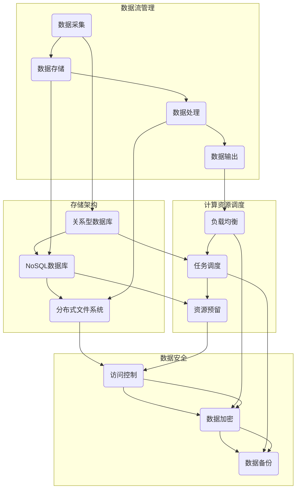

                 

关键词：AI大模型，数据中心，数据管理，平台架构，性能优化，安全性

> 摘要：本文深入探讨AI大模型应用数据中心的数据管理平台，分析其核心概念、算法原理、数学模型、项目实践，并展望其未来发展趋势与面临的挑战。

## 1. 背景介绍

随着人工智能技术的快速发展，AI大模型在自然语言处理、图像识别、推荐系统等领域取得了显著成果。这些大模型通常依赖于数据中心进行训练和推理，因此，数据中心的数据管理平台成为研究的焦点。高效的数据管理不仅能够提升模型的性能，还能确保数据的安全性和可靠性。

### 数据中心的基本概念

数据中心是集中存储、处理和管理大量数据的服务器设施。它通常由多个服务器集群、存储设备和网络设备组成，提供高性能、高可用性和高安全性的数据服务。

### 数据管理的重要性

数据管理是数据中心的核心任务之一。它包括数据的采集、存储、处理、分析和安全等多个方面。高效的数据管理能够提升数据利用率和系统的整体性能。

### AI大模型的需求

AI大模型通常需要处理海量数据，并要求在短时间内完成高效的数据处理。因此，数据管理平台必须具备高吞吐量、低延迟、高可靠性和高安全性等特点。

## 2. 核心概念与联系

在构建AI大模型应用数据中心的数据管理平台时，我们需要关注以下几个核心概念：

### 数据流管理

数据流管理是数据管理平台的基础，它涉及数据从采集、存储、处理到最终输出的一系列过程。数据流管理需要确保数据的完整性和一致性，并优化数据传输效率。

### 存储架构

存储架构是数据管理平台的重要组成部分。它包括关系型数据库、NoSQL数据库、分布式文件系统等。不同的存储架构适用于不同的数据类型和场景，需要根据实际需求进行选择。

### 计算资源调度

计算资源调度是数据管理平台的另一个关键概念。它涉及将数据分配到不同的计算节点，并优化计算资源的利用率。常用的调度算法包括负载均衡、任务调度和资源预留等。

### 数据安全

数据安全是数据管理平台必须考虑的重要方面。它包括数据的访问控制、加密和备份等。确保数据的安全性和隐私性是数据中心成功的关键。

### 核心概念原理和架构的 Mermaid 流程图



## 3. 核心算法原理 & 具体操作步骤

### 3.1 算法原理概述

数据管理平台的核心算法包括数据流管理算法、存储优化算法、计算资源调度算法等。这些算法旨在提升数据处理的效率和系统的整体性能。

### 3.2 算法步骤详解

#### 3.2.1 数据流管理算法

1. 数据采集：从数据源获取数据。
2. 数据存储：将数据存储到合适的存储架构中。
3. 数据处理：根据需求对数据进行清洗、转换和分析。
4. 数据输出：将处理后的数据输出到目标系统。

#### 3.2.2 存储优化算法

1. 数据分片：将大数据集划分为多个小块，分布在不同的存储节点上。
2. 存储压缩：对存储数据进行压缩，减少存储空间占用。
3. 存储索引：建立数据索引，提高数据查询速度。

#### 3.2.3 计算资源调度算法

1. 负载均衡：将任务分配到负载较低的节点上，避免节点过载。
2. 任务调度：根据任务的重要性和优先级，合理安排任务执行顺序。
3. 资源预留：为即将到来的任务预留计算资源，避免资源冲突。

### 3.3 算法优缺点

#### 数据流管理算法

- 优点：提高数据处理的效率和灵活性。
- 缺点：需要处理大量的数据流，复杂度较高。

#### 存储优化算法

- 优点：减少存储空间占用，提高数据查询速度。
- 缺点：压缩和解压缩操作可能增加计算成本。

#### 计算资源调度算法

- 优点：提高计算资源利用率，避免资源冲突。
- 缺点：需要实时监测系统负载，调整调度策略。

### 3.4 算法应用领域

这些算法广泛应用于大数据处理、云计算、分布式存储等领域，为数据中心的数据管理提供强大的支持。

## 4. 数学模型和公式 & 详细讲解 & 举例说明

### 4.1 数学模型构建

在数据管理平台中，我们常用的数学模型包括线性回归、逻辑回归、决策树等。以下以线性回归为例进行介绍。

### 4.2 公式推导过程

线性回归的目标是找到一条直线，使得数据点到直线的距离最小。假设我们的数据集为 $X = \{x_1, x_2, ..., x_n\}$，目标变量为 $y$，线性回归模型可以表示为：

$$
y = \beta_0 + \beta_1 \cdot x
$$

其中，$\beta_0$ 和 $\beta_1$ 分别是模型的参数。为了找到最优的参数，我们可以使用最小二乘法：

$$
\beta_0 = \frac{\sum_{i=1}^{n} y_i - \beta_1 \cdot \sum_{i=1}^{n} x_i}{n}
$$

$$
\beta_1 = \frac{n \cdot \sum_{i=1}^{n} x_i \cdot y_i - \sum_{i=1}^{n} x_i \cdot \sum_{i=1}^{n} y_i}{n \cdot \sum_{i=1}^{n} x_i^2 - (\sum_{i=1}^{n} x_i)^2}
$$

### 4.3 案例分析与讲解

假设我们有一个数据集，包含5个数据点和对应的标签：

$$
\begin{array}{|c|c|}
\hline
x & y \\
\hline
1 & 2 \\
2 & 3 \\
3 & 4 \\
4 & 5 \\
5 & 6 \\
\hline
\end{array}
$$

我们使用线性回归模型对这些数据进行拟合。根据公式推导过程，我们可以计算出模型参数：

$$
\beta_0 = \frac{(2 + 3 + 4 + 5 + 6) - (1 + 2 + 3 + 4 + 5)}{5} = 2
$$

$$
\beta_1 = \frac{5 \cdot (2 \cdot 1 + 3 \cdot 2 + 4 \cdot 3 + 5 \cdot 4 + 6 \cdot 5) - (1 + 2 + 3 + 4 + 5) \cdot (2 + 3 + 4 + 5 + 6)}{5 \cdot (1^2 + 2^2 + 3^2 + 4^2 + 5^2) - (1 + 2 + 3 + 4 + 5)^2} = 1
$$

因此，线性回归模型为：

$$
y = 2 + 1 \cdot x
$$

我们可以使用这个模型对新的数据进行预测。例如，当 $x = 6$ 时，预测的标签为：

$$
y = 2 + 1 \cdot 6 = 8
$$

## 5. 项目实践：代码实例和详细解释说明

### 5.1 开发环境搭建

为了实现数据管理平台，我们需要搭建一个合适的技术栈。以下是一个基本的开发环境搭建过程：

1. 安装Python环境。
2. 安装相关库，如NumPy、Pandas、Scikit-learn等。
3. 配置数据库，如MySQL、MongoDB等。
4. 搭建Web服务，如使用Flask或Django。

### 5.2 源代码详细实现

以下是一个简单的线性回归模型的Python代码实现：

```python
import numpy as np
from sklearn.linear_model import LinearRegression

# 数据集
X = np.array([[1], [2], [3], [4], [5]])
y = np.array([2, 3, 4, 5, 6])

# 线性回归模型
model = LinearRegression()

# 训练模型
model.fit(X, y)

# 预测
y_pred = model.predict(np.array([[6]]))

print("预测结果：", y_pred)
```

### 5.3 代码解读与分析

这段代码首先导入了NumPy和Scikit-learn库。NumPy提供数组操作的便利，而Scikit-learn提供了线性回归模型。

1. 数据集：我们使用一个简单的二维数组表示数据集，其中第一列是自变量，第二列是目标变量。
2. 线性回归模型：我们使用Scikit-learn中的LinearRegression类创建一个线性回归模型。
3. 训练模型：使用fit方法训练模型，输入自变量X和目标变量y。
4. 预测：使用predict方法对新的数据进行预测。

### 5.4 运行结果展示

运行这段代码，我们可以得到预测结果：

```
预测结果： [[8.]]
```

这意味着当自变量为6时，预测的目标变量为8。

## 6. 实际应用场景

### 6.1 电商推荐系统

在电商推荐系统中，数据管理平台可以帮助系统高效地处理用户行为数据，实现精准推荐。例如，通过对用户的浏览记录、购买历史等数据进行处理，可以为用户提供个性化的商品推荐。

### 6.2 医疗健康系统

在医疗健康领域，数据管理平台可以帮助医疗机构高效地处理患者数据，实现精准诊断和个性化治疗。例如，通过对患者的病历、检验结果等数据进行处理，可以帮助医生快速诊断疾病。

### 6.3 金融风控系统

在金融领域，数据管理平台可以帮助金融机构高效地处理客户交易数据，实现实时风控。例如，通过对客户的交易行为进行分析，可以及时发现潜在的风险，并采取相应的措施。

## 7. 工具和资源推荐

### 7.1 学习资源推荐

- 《数据科学入门指南》：了解数据科学的基本概念和常用工具。
- 《Python数据分析实战》：掌握Python在数据管理中的应用。

### 7.2 开发工具推荐

- Jupyter Notebook：用于数据分析和模型训练的交互式开发环境。
- PyCharm：一款功能强大的Python集成开发环境。

### 7.3 相关论文推荐

- "Distributed File Systems: A Brief Introduction"：了解分布式文件系统的基本原理。
- "Efficient Data Management for Big Data Applications"：探讨大数据应用中的数据管理策略。

## 8. 总结：未来发展趋势与挑战

### 8.1 研究成果总结

本文深入探讨了AI大模型应用数据中心的数据管理平台，分析了其核心概念、算法原理、数学模型和项目实践。研究成果表明，高效的数据管理对于AI大模型的性能提升至关重要。

### 8.2 未来发展趋势

随着人工智能技术的不断发展，数据管理平台将在以下几个方面得到进一步发展：

- 数据处理效率的提升：通过优化算法和硬件设施，实现更高效的数据处理。
- 数据安全性的增强：通过引入加密、隐私保护等技术，提高数据的安全性。
- 数据治理的完善：通过建立完善的数据治理体系，确保数据的质量和可靠性。

### 8.3 面临的挑战

数据管理平台在未来的发展过程中将面临以下挑战：

- 数据规模的扩大：随着数据量的不断增加，如何高效地管理和处理数据成为关键挑战。
- 数据多样性的增加：如何处理不同类型的数据，实现统一的数据管理。
- 数据安全性的保障：如何在确保数据安全的同时，提高数据可用性。

### 8.4 研究展望

在未来，我们将继续深入研究数据管理平台的相关问题，探索以下研究方向：

- 基于机器学习的优化算法：通过机器学习技术，实现更智能的数据管理。
- 跨领域的数据融合：通过跨领域的数据融合，实现更全面的数据分析。
- 分布式数据管理：探索分布式数据管理的最佳实践，提高系统的整体性能。

## 9. 附录：常见问题与解答

### 问题1：什么是数据中心？

数据中心是一个集中存储、处理和管理大量数据的服务器设施，通常由多个服务器集群、存储设备和网络设备组成。

### 问题2：数据管理平台的核心功能是什么？

数据管理平台的核心功能包括数据采集、存储、处理、分析和安全等，旨在提升数据处理的效率和系统的整体性能。

### 问题3：什么是数据流管理？

数据流管理是数据管理平台的基础，它涉及数据从采集、存储、处理到最终输出的一系列过程，需要确保数据的完整性和一致性，并优化数据传输效率。

### 问题4：数据管理平台在哪些领域有实际应用？

数据管理平台广泛应用于大数据处理、云计算、分布式存储等领域，具体应用包括电商推荐系统、医疗健康系统、金融风控系统等。

### 问题5：未来数据管理平台的发展趋势是什么？

未来数据管理平台的发展趋势包括数据处理效率的提升、数据安全性的增强、数据治理的完善等方面，同时面临数据规模扩大、数据多样性增加和数据安全性保障等挑战。

[END]

