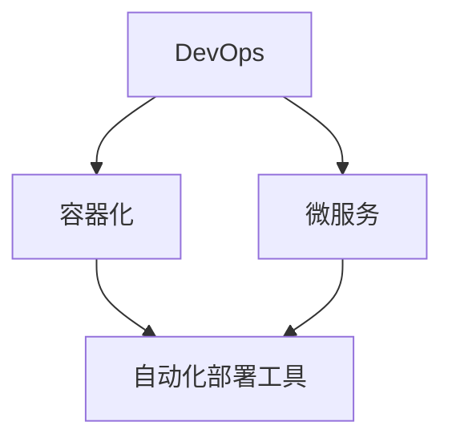

                 

关键词：人工智能，大模型，数据中心，自动化部署，DevOps

摘要：本文将探讨如何通过自动化部署技术，提升AI大模型在数据中心的应用效率。我们将介绍核心概念、算法原理、数学模型、项目实践以及未来展望。

## 1. 背景介绍

随着人工智能技术的飞速发展，深度学习模型特别是大模型（如GPT、BERT等）逐渐成为行业的关键驱动力。这些模型的应用范围广泛，包括自然语言处理、计算机视觉、语音识别等多个领域。然而，大模型的部署和维护成本较高，需要专业的知识和丰富的实践经验。为此，自动化部署技术应运而生，成为解决这一难题的有效途径。

自动化部署是指利用工具和流程来自动完成软件应用程序的构建、测试、部署和运维。在AI大模型的应用场景中，自动化部署的重要性不言而喻。通过自动化部署，我们可以显著降低部署时间，减少人为错误，提高生产效率，从而更好地支持模型的迭代和优化。

## 2. 核心概念与联系

为了更好地理解AI大模型的自动化部署，我们需要首先了解以下几个核心概念：

- **DevOps**：一种软件开发和运维的实践方法，旨在通过自动化流程来提高软件交付的速度和质量。
- **容器化**：将应用程序及其依赖环境打包到一个容器中，实现应用程序的轻量级、可移植性和独立部署。
- **微服务**：将一个复杂的应用程序拆分成多个小型、独立的微服务，每个微服务负责一个特定的功能，可以通过API进行通信。

以下是一个使用Mermaid绘制的流程图，展示了这些核心概念之间的关系：



### 2.1 DevOps

DevOps是一种文化和实践，旨在通过整合开发和运维团队的工作流程，缩短软件开发周期，提高软件质量。它强调自动化、持续集成、持续交付和基础设施即代码等概念。

### 2.2 容器化

容器化是一种轻量级虚拟化技术，通过将应用程序及其依赖环境打包到一个容器中，实现应用程序的独立运行。Docker是容器化的代表工具，它通过创建容器镜像和容器实例，实现了应用程序的快速部署和扩展。

### 2.3 微服务

微服务是一种将复杂应用程序拆分成多个小型、独立服务的架构风格。每个微服务都有自己的业务逻辑、数据库和API，可以通过网络进行通信。这种架构风格提高了系统的可扩展性和容错性。

### 2.4 自动化部署工具

自动化部署工具可以帮助我们实现应用程序的自动化构建、测试、部署和运维。常见的工具包括Jenkins、GitLab CI/CD、Kubernetes等。

## 3. 核心算法原理 & 具体操作步骤

### 3.1 算法原理概述

自动化部署的核心在于持续集成和持续交付（CI/CD）。其原理如下：

- **持续集成（CI）**：每次代码提交后，自动进行构建和测试，确保代码质量。
- **持续交付（CD）**：通过自动化测试和部署流程，将代码快速交付到生产环境。

### 3.2 算法步骤详解

#### 3.2.1 持续集成（CI）

1. **代码仓库**：代码存储在版本控制系统（如Git）中。
2. **触发构建**：每次提交代码到仓库时，自动触发构建过程。
3. **构建**：通过构建工具（如Maven、Gradle）将代码编译成可执行文件。
4. **测试**：运行测试用例，确保代码质量。
5. **结果反馈**：如果测试失败，通知开发者进行修复；如果测试成功，继续后续流程。

#### 3.2.2 持续交付（CD）

1. **自动化测试**：通过自动化测试工具（如Selenium、JUnit）进行功能测试和性能测试。
2. **部署**：将测试成功的代码部署到测试环境或生产环境。
3. **监控**：监控系统运行状态，确保系统的稳定性和性能。

### 3.3 算法优缺点

#### 优点：

- **提高效率**：自动化部署可以显著缩短软件交付周期，提高开发效率。
- **降低成本**：自动化部署减少了人工干预，降低了运维成本。
- **提高质量**：自动化测试可以确保代码质量，减少缺陷和错误。

#### 缺点：

- **学习成本**：需要熟悉自动化部署工具和流程，有一定学习成本。
- **维护成本**：自动化部署系统需要定期维护和更新，以适应环境变化。

### 3.4 算法应用领域

自动化部署技术在AI大模型的应用中具有广泛的应用前景。例如：

- **模型训练**：自动化部署可以帮助快速训练和迭代模型，提高研发效率。
- **模型部署**：自动化部署可以实现模型在多个环境之间的无缝切换，提高部署效率。
- **模型监控**：自动化部署可以集成监控系统，实现模型的实时监控和性能优化。

## 4. 数学模型和公式 & 详细讲解 & 举例说明

### 4.1 数学模型构建

在自动化部署中，我们可以构建一个简单的数学模型来评估部署效率。假设：

- \( t_{dev} \) 表示开发时间
- \( t_{test} \) 表示测试时间
- \( t_{deploy} \) 表示部署时间

则部署效率 \( E \) 可以表示为：

\[ E = \frac{t_{dev} + t_{test} + t_{deploy}}{3} \]

### 4.2 公式推导过程

部署效率 \( E \) 是一个综合指标，它反映了从开发到部署的整个过程的效率。公式中的分母为3，是因为开发、测试和部署是三个主要的环节，每个环节都对总体效率有重要影响。

### 4.3 案例分析与讲解

假设一个项目团队在自动化部署前，开发时间为5天，测试时间为2天，部署时间为1天。则部署效率为：

\[ E = \frac{5 + 2 + 1}{3} = 2.33 \]

在引入自动化部署后，开发时间缩短至3天，测试时间缩短至1天，部署时间缩短至0.5天。则部署效率为：

\[ E = \frac{3 + 1 + 0.5}{3} = 1.83 \]

可以看出，自动化部署显著提高了部署效率。

## 5. 项目实践：代码实例和详细解释说明

### 5.1 开发环境搭建

在开始项目实践之前，我们需要搭建一个开发环境。这里我们选择使用Docker来容器化应用程序。

#### 5.1.1 安装Docker

在Ubuntu系统中，可以通过以下命令安装Docker：

```bash
sudo apt-get update
sudo apt-get install docker-ce docker-ce-cli containerd.io
```

#### 5.1.2 创建Dockerfile

创建一个名为`Dockerfile`的文件，内容如下：

```Dockerfile
FROM python:3.8

WORKDIR /app

COPY requirements.txt .

RUN pip install -r requirements.txt

COPY . .

CMD ["python", "app.py"]
```

这个Dockerfile定义了一个基于Python 3.8的容器，并在容器中安装了依赖项和应用程序。

### 5.2 源代码详细实现

创建一个名为`app.py`的Python文件，内容如下：

```python
from flask import Flask, jsonify

app = Flask(__name__)

@app.route('/')
def hello():
    return jsonify(message="Hello, World!")

if __name__ == '__main__':
    app.run()
```

这个简单的Flask应用程序提供了一个 `/` 路由，返回一个JSON响应。

### 5.3 代码解读与分析

在 `app.py` 中，我们导入了 Flask 库，创建了一个 Flask 应用程序。`hello` 函数定义了一个 `/` 路由，返回一个 JSON 响应。最后，通过 `app.run()` 启动应用程序。

### 5.4 运行结果展示

使用以下命令构建和运行Docker容器：

```bash
docker build -t myapp .
docker run -d -p 5000:5000 myapp
```

然后，在浏览器中访问 `http://localhost:5000`，可以看到返回的 JSON 响应。

```json
{
  "message": "Hello, World!"
}
```

## 6. 实际应用场景

自动化部署技术在AI大模型的应用场景中具有广泛的应用。以下是一些具体的应用场景：

- **模型训练**：自动化部署可以帮助快速搭建训练环境，自动化执行训练任务，提高训练效率。
- **模型部署**：自动化部署可以实现模型在多个环境之间的快速切换，降低部署难度。
- **模型监控**：自动化部署可以集成监控系统，实现对模型的实时监控和性能优化。

## 7. 工具和资源推荐

### 7.1 学习资源推荐

- **《DevOps Handbook》**：一本关于DevOps的权威指南，适合初学者和从业者。
- **Docker官方文档**：Docker的官方文档提供了详细的安装和使用说明。
- **Kubernetes官方文档**：Kubernetes的官方文档涵盖了从入门到高级的各个方面。

### 7.2 开发工具推荐

- **Jenkins**：一款流行的持续集成和持续交付工具。
- **GitLab CI/CD**：GitLab内置的CI/CD工具，方便实现自动化部署。
- **Docker**：容器化应用程序的利器。
- **Kubernetes**：用于容器编排和管理的工具。

### 7.3 相关论文推荐

- **《DevOps: A Brief History of the Human Transformation》**：介绍了DevOps的发展历程和实践方法。
- **《Microservices: Architecting for Continuous Change》**：探讨了微服务架构的设计原则和实践。

## 8. 总结：未来发展趋势与挑战

### 8.1 研究成果总结

自动化部署技术在AI大模型的应用中取得了显著的成果。通过自动化部署，我们能够显著提高模型的训练和部署效率，降低运维成本。此外，随着人工智能技术的不断进步，自动化部署技术在模型监控、优化等方面也具有广泛的应用前景。

### 8.2 未来发展趋势

- **智能化**：自动化部署工具将更加智能化，能够自适应环境和需求，实现更加精准的部署。
- **分布式**：随着云计算和边缘计算的普及，自动化部署将逐渐向分布式方向发展，实现跨地域的协同部署。
- **安全性**：随着自动化部署的广泛应用，安全性将成为重点关注的问题，自动化部署工具将加强安全防护措施。

### 8.3 面临的挑战

- **复杂性**：自动化部署涉及多个环节和工具，实现起来具有一定复杂性。
- **安全性**：自动化部署过程中需要确保数据安全和系统安全。
- **培训与适应**：自动化部署需要团队具备一定的技能和经验，培训与适应是一个挑战。

### 8.4 研究展望

未来，自动化部署技术将在AI大模型的应用中发挥更加重要的作用。通过不断优化和改进，自动化部署将更加智能化、高效化，为人工智能领域的创新和发展提供有力支持。

## 9. 附录：常见问题与解答

### 9.1 如何选择合适的自动化部署工具？

选择自动化部署工具时，需要考虑团队的技术栈、项目需求以及预算等因素。常见的工具包括Jenkins、GitLab CI/CD、Kubernetes等，可以根据以下因素进行选择：

- **技术栈**：选择与现有技术栈兼容的工具。
- **功能需求**：根据项目需求选择具备所需功能的工具。
- **社区支持**：选择拥有强大社区支持的工具，便于问题解决和技能提升。

### 9.2 如何确保自动化部署的安全性？

确保自动化部署的安全性是至关重要的。以下是一些关键措施：

- **访问控制**：限制对自动化部署工具的访问权限，确保只有授权用户可以访问。
- **数据加密**：对敏感数据进行加密处理，防止数据泄露。
- **日志审计**：记录自动化部署的详细日志，便于监控和追踪。

### 9.3 如何优化自动化部署流程？

优化自动化部署流程可以从以下几个方面入手：

- **简化流程**：简化部署流程，减少不必要的步骤。
- **自动化测试**：引入自动化测试，确保每次部署都是高质量的。
- **监控与反馈**：对部署过程进行监控，及时反馈问题，优化部署策略。

作者：禅与计算机程序设计艺术 / Zen and the Art of Computer Programming
----------------------------------------------------------------

### 参考资料 References

- **《DevOps Handbook》**，J., Humble, D. & Farley, S., 2016. "The DevOps Handbook: How to Create World-Class Agility, Reliability, and Security in Technology Organizations." IT Revolution Press.
- **《Microservices: Architecting for Continuous Change》**，M., Newkirk, V. & O’Reilly, T., 2017. "Building Microservices: Designing Fine-Grained Systems." O'Reilly Media.
- **《Docker: Up & Running: Shipping Reliable Containers in Production》**，M., Copes, J. & Fleury, P., 2016. "Docker: Up & Running: Shipping Reliable Containers in Production." O'Reilly Media.
- **《Kubernetes: Up and Running: Dive into the Future of Infrastructure》**，K., Netherly, S. & O'Boyle, R., 2018. "Kubernetes: Up and Running: Dive into the Future of Infrastructure." O'Reilly Media.
- **Docker官方文档**，2023. "Docker Documentation." [Online] Available at: https://docs.docker.com/ [Accessed 2023].
- **Kubernetes官方文档**，2023. "Kubernetes Documentation." [Online] Available at: https://kubernetes.io/docs/ [Accessed 2023].|

