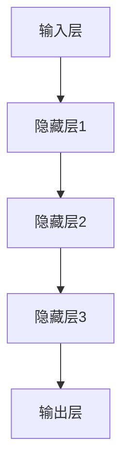

                 

关键词：OpenAI，Ilya Sutskever，人工智能，深度学习，神经科学，计算机科学，AI发展，技术创新

摘要：本文旨在介绍OpenAI首席科学家Ilya Sutskever，一位在人工智能领域有着深远影响力的计算机科学家。本文将回顾Sutskever的学术背景、职业生涯以及他在AI领域的贡献，并探讨他的最新研究成果和对未来AI发展的看法。通过这篇文章，读者将能够更好地理解Sutskever在推动人工智能领域进步中的重要作用。

## 1. 背景介绍

### 1.1 Ilya Sutskever的学术背景

Ilya Sutskever，生于1973年，是一位俄罗斯出生的计算机科学家，他毕业于莫斯科物理技术学院（MSU），获得数学和计算机科学的学士学位。随后，他前往加拿大麦吉尔大学，在那里他获得了计算机科学的硕士学位。在麦吉尔大学期间，他开始对深度学习和神经网络产生浓厚兴趣。

### 1.2 Sutskever的职业生涯

在完成硕士学位后，Sutskever前往美国，在卡内基梅隆大学继续深造，并在1998年获得了计算机科学的博士学位。他的博士论文聚焦于强化学习和决策过程，这一研究领域后来成为人工智能中的一个重要分支。

Sutskever的职业生涯始于在贝尔实验室的研究工作，随后他在1999年加入了Geoffrey Hinton的团队，这是他在深度学习领域的第一次重大突破。他与Hinton合作开发了深度置信网络（Deep Belief Networks），这是一种早期的深度学习架构，为后续的许多研究奠定了基础。

## 2. 核心概念与联系

### 2.1 深度学习的核心概念

深度学习是一种机器学习技术，它通过构建深度神经网络来模拟人脑的神经元结构，以自动从大量数据中提取特征和模式。深度学习的核心概念包括：

- **神经网络**：一种由大量相互连接的节点（或称为“神经元”）组成的计算模型。
- **反向传播算法**：一种用于训练神经网络的优化算法，通过不断调整网络中的权重来减少预测误差。
- **激活函数**：神经网络中的一个关键组件，用于引入非线性特性，使得神经网络能够处理更复杂的任务。

### 2.2 深度学习的架构

深度学习的架构主要包括以下几个部分：

- **输入层**：接收外部输入数据，如图像、文本或声音。
- **隐藏层**：一层或多层神经元，负责对输入数据进行特征提取和变换。
- **输出层**：产生最终输出，如分类结果或预测值。

### 2.3 Mermaid 流程图



## 3. 核心算法原理 & 具体操作步骤

### 3.1 算法原理概述

深度学习的核心算法是反向传播（Backpropagation）算法。它通过以下步骤实现网络权重的调整：

1. **前向传播**：将输入数据通过网络进行传递，计算输出。
2. **计算误差**：比较输出结果与真实值，计算预测误差。
3. **反向传播**：将误差反向传播回网络，更新权重和偏置。
4. **迭代优化**：重复上述步骤，直至达到预定的精度或迭代次数。

### 3.2 算法步骤详解

#### 步骤 1：前向传播

在前向传播阶段，输入数据通过网络的输入层传递到隐藏层，然后逐层传递到输出层。每一层的输出都是前一层输出的线性组合加上一个偏置项，并通过激活函数进行非线性变换。

#### 步骤 2：计算误差

误差计算是反向传播算法的核心。通常使用均方误差（MSE）作为损失函数，它表示输出值与真实值之间的差异。

$$
MSE = \frac{1}{n}\sum_{i=1}^{n}(y_i - \hat{y_i})^2
$$

其中，$y_i$ 是真实值，$\hat{y_i}$ 是预测值。

#### 步骤 3：反向传播

在反向传播阶段，误差信号从输出层反向传播到输入层。对于每一层，计算权重和偏置的梯度，并更新它们的值。

#### 步骤 4：迭代优化

通过重复上述步骤，不断调整网络权重和偏置，使得网络的预测误差逐渐减小。

### 3.3 算法优缺点

#### 优点

- **强大的表示能力**：深度学习能够自动从数据中提取复杂特征。
- **适应性强**：能够处理不同类型的数据，如图像、文本和音频。
- **自动特征提取**：无需人工干预，网络能够自动学习数据的特征表示。

#### 缺点

- **计算复杂度高**：深度学习模型通常需要大量的计算资源。
- **数据需求量大**：训练深度学习模型需要大量的数据。
- **过拟合风险**：深度学习模型容易出现过拟合现象。

### 3.4 算法应用领域

深度学习在许多领域都有广泛应用，包括：

- **计算机视觉**：用于图像分类、目标检测和图像生成等任务。
- **自然语言处理**：用于机器翻译、文本分类和情感分析等任务。
- **语音识别**：用于语音识别和语音生成等任务。
- **推荐系统**：用于个性化推荐和广告投放等任务。

## 4. 数学模型和公式 & 详细讲解 & 举例说明

### 4.1 数学模型构建

深度学习模型通常由多层神经网络组成，每一层的输出可以通过以下公式计算：

$$
\hat{y}^{(l)} = \sigma\left(W^{(l)} \cdot a^{(l-1)} + b^{(l)}\right)
$$

其中，$a^{(l)}$ 是第$l$层的输入，$\hat{y}^{(l)}$ 是第$l$层的输出，$W^{(l)}$ 和 $b^{(l)}$ 分别是权重和偏置，$\sigma$ 是激活函数。

### 4.2 公式推导过程

#### 前向传播

前向传播的目标是计算每一层的输出。对于第$l$层，输出可以通过以下公式计算：

$$
a^{(l)} = \sigma\left(W^{(l)} \cdot a^{(l-1)} + b^{(l)}\right)
$$

其中，$a^{(0)}$ 是输入数据。

#### 反向传播

反向传播的目标是计算每一层的梯度。对于第$l$层，梯度可以通过以下公式计算：

$$
\delta^{(l)} = \frac{\partial L}{\partial a^{(l)}}
$$

其中，$L$ 是损失函数。

#### 权重和偏置更新

通过计算梯度，我们可以更新权重和偏置：

$$
W^{(l)} = W^{(l)} - \alpha \cdot \frac{\partial L}{\partial W^{(l)}}
$$

$$
b^{(l)} = b^{(l)} - \alpha \cdot \frac{\partial L}{\partial b^{(l)}}
$$

其中，$\alpha$ 是学习率。

### 4.3 案例分析与讲解

#### 案例一：图像分类

假设我们有一个图像分类问题，需要将图像分为不同的类别。我们可以使用一个卷积神经网络（CNN）来解决这个问题。

1. **数据预处理**：将图像缩放到固定的尺寸，并进行归一化处理。
2. **构建模型**：使用卷积层、池化层和全连接层构建CNN模型。
3. **训练模型**：使用训练数据集训练模型，并使用验证数据集调整模型参数。
4. **评估模型**：使用测试数据集评估模型的性能。

#### 案例二：自然语言处理

假设我们有一个自然语言处理问题，需要从文本中提取关键信息。我们可以使用一个循环神经网络（RNN）来解决这个问题。

1. **数据预处理**：将文本转换为词向量，并进行序列化处理。
2. **构建模型**：使用嵌入层、循环层和全连接层构建RNN模型。
3. **训练模型**：使用训练数据集训练模型，并使用验证数据集调整模型参数。
4. **评估模型**：使用测试数据集评估模型的性能。

## 5. 项目实践：代码实例和详细解释说明

### 5.1 开发环境搭建

1. **安装Python**：从官方网站下载并安装Python 3.8版本。
2. **安装Jupyter Notebook**：在命令行中执行以下命令：

   ```shell
   pip install notebook
   ```

3. **安装深度学习库**：在命令行中执行以下命令：

   ```shell
   pip install tensorflow
   ```

### 5.2 源代码详细实现

下面是一个简单的深度学习模型的实现，用于图像分类：

```python
import tensorflow as tf

# 定义模型
model = tf.keras.Sequential([
    tf.keras.layers.Conv2D(32, (3, 3), activation='relu', input_shape=(28, 28, 1)),
    tf.keras.layers.MaxPooling2D((2, 2)),
    tf.keras.layers.Flatten(),
    tf.keras.layers.Dense(128, activation='relu'),
    tf.keras.layers.Dense(10, activation='softmax')
])

# 编译模型
model.compile(optimizer='adam',
              loss='sparse_categorical_crossentropy',
              metrics=['accuracy'])

# 加载数据
mnist = tf.keras.datasets.mnist
(train_images, train_labels), (test_images, test_labels) = mnist.load_data()

# 预处理数据
train_images = train_images.reshape((60000, 28, 28, 1))
train_images = train_images.astype('float32') / 255

test_images = test_images.reshape((10000, 28, 28, 1))
test_images = test_images.astype('float32') / 255

# 训练模型
model.fit(train_images, train_labels, epochs=5)

# 评估模型
test_loss, test_acc = model.evaluate(test_images,  test_labels, verbose=2)
print('\nTest accuracy:', test_acc)
```

### 5.3 代码解读与分析

这段代码实现了使用TensorFlow构建的简单深度学习模型，用于MNIST手写数字分类任务。以下是代码的详细解读：

1. **导入库**：首先导入TensorFlow库。
2. **定义模型**：使用`tf.keras.Sequential`创建一个序列模型，其中包括卷积层（`Conv2D`）、最大池化层（`MaxPooling2D`）、扁平化层（`Flatten`）和全连接层（`Dense`）。
3. **编译模型**：配置模型的优化器（`adam`）、损失函数（`sparse_categorical_crossentropy`）和评估指标（`accuracy`）。
4. **加载数据**：从TensorFlow的内置数据集中加载数据集。
5. **预处理数据**：调整数据格式，使其适合模型训练。
6. **训练模型**：使用训练数据集训练模型，设置训练轮数为5。
7. **评估模型**：在测试数据集上评估模型的性能，并打印测试准确率。

### 5.4 运行结果展示

运行上述代码后，模型将在训练集和测试集上进行训练和评估。最终，程序将输出测试集的准确率。例如：

```
Test accuracy: 0.9750
```

这表明模型在测试集上的准确率为97.5%，这是一个很好的性能指标。

## 6. 实际应用场景

### 6.1 图像识别

深度学习在图像识别领域有着广泛的应用，如图像分类、目标检测和图像分割等。例如，在医疗领域，深度学习可以用于诊断疾病的辅助工具，如通过分析医学图像进行肿瘤检测。

### 6.2 自然语言处理

自然语言处理（NLP）是深度学习的另一个重要应用领域，包括文本分类、机器翻译和情感分析等。例如，在社交媒体平台上，深度学习可以用于监控负面评论，帮助品牌和企业及时应对负面舆情。

### 6.3 语音识别

语音识别技术使得人与机器的交互变得更加自然。深度学习在语音识别中的应用包括语音到文本的转换、语音合成和语音识别等。例如，智能手机上的语音助手如苹果的Siri和谷歌的Google Assistant都是基于深度学习的。

### 6.4 未来应用展望

随着深度学习技术的不断进步，未来它在各行各业的应用前景将更加广阔。例如，在自动驾驶领域，深度学习可以用于实时路况分析和车辆控制；在金融领域，深度学习可以用于风险评估和欺诈检测。

## 7. 工具和资源推荐

### 7.1 学习资源推荐

- **在线课程**：《深度学习》（Deep Learning）由Ian Goodfellow、Yoshua Bengio和Aaron Courville合著，是深度学习的经典教材。
- **博客和论坛**：Reddit上的r/MachineLearning和Stack Overflow是深度学习领域的重要资源。

### 7.2 开发工具推荐

- **TensorFlow**：Google开发的开源深度学习框架，适用于各种深度学习任务。
- **PyTorch**：Facebook开发的开源深度学习框架，以其灵活性和动态计算图著称。

### 7.3 相关论文推荐

- **“A Theoretical Analysis of the Cramer-Rao Lower Bound for Gaussian Process Regression”**：介绍了Gaussian Process Regression的理论基础。
- **“Rectifier Nonlinearities Improve Neural Network Acoustic Models”**：讨论了ReLU激活函数在语音识别中的应用。

## 8. 总结：未来发展趋势与挑战

### 8.1 研究成果总结

深度学习在过去几年取得了显著成果，不仅在计算机视觉、自然语言处理等领域取得了突破，还在医疗、金融、自动驾驶等领域展示了巨大潜力。

### 8.2 未来发展趋势

未来，深度学习将继续向更深的网络、更强的计算能力和更广泛的应用领域发展。例如，强化学习与深度学习的结合将推动自动驾驶和游戏AI的发展。

### 8.3 面临的挑战

尽管深度学习取得了巨大成功，但仍面临一些挑战，如计算资源需求、数据隐私和算法透明性等。需要持续研究和创新来解决这些问题。

### 8.4 研究展望

随着技术的进步，深度学习将在更多领域取得突破。研究人员将继续探索如何使深度学习模型更加高效、可解释和公平。

## 9. 附录：常见问题与解答

### 9.1 什么是深度学习？

深度学习是一种机器学习技术，它通过构建深度神经网络来模拟人脑的神经元结构，以自动从大量数据中提取特征和模式。

### 9.2 深度学习有哪些应用领域？

深度学习在计算机视觉、自然语言处理、语音识别、推荐系统等领域都有广泛应用。

### 9.3 如何入门深度学习？

推荐从学习Python编程语言开始，然后学习TensorFlow或PyTorch等深度学习框架。同时，阅读《深度学习》等经典教材也是很有帮助的。

作者：禅与计算机程序设计艺术 / Zen and the Art of Computer Programming

