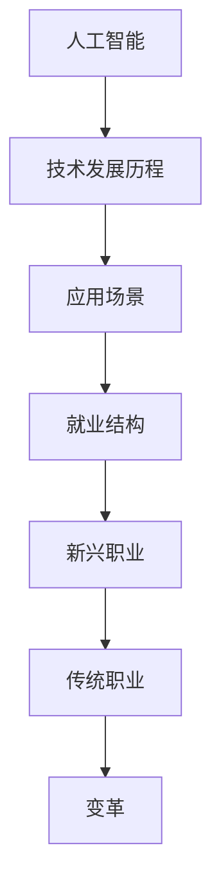

                 

关键词：人工智能，就业结构，新兴职业，传统职业，变革

> 摘要：随着人工智能技术的飞速发展，传统的就业结构正面临着前所未有的变革。本文将探讨人工智能如何影响就业市场，分析新兴职业与传统职业的演变过程，并提出未来发展的趋势与挑战。

## 1. 背景介绍

自21世纪以来，人工智能（AI）技术的发展迅速，从起初的理论构想逐步走向现实应用。AI技术不仅改变了我们的生活方式，也深刻地影响着就业市场。在过去的几十年中，自动化和机器人技术的发展已经使得某些传统职业面临被替代的风险，而人工智能的进一步发展则预示着这种趋势将进一步加剧。

在这个背景下，理解人工智能对就业结构的影响变得尤为重要。一方面，人工智能将带来新兴职业的兴起，如数据科学家、机器学习工程师等；另一方面，它也将改变甚至淘汰某些传统职业，如制造工人、会计等。这种双重影响使得就业市场的竞争格局发生了深刻变化，也为我们提出了新的挑战和机遇。

本文旨在通过对人工智能与就业结构之间关系的深入分析，帮助读者理解这一变革过程，探讨未来职业发展路径，并为应对这一挑战提供一些建议。

## 2. 核心概念与联系

为了更好地理解人工智能对就业结构的影响，我们首先需要明确一些核心概念，包括人工智能的定义、技术发展历程、以及其在各行业中的应用场景。以下是一个简化的 Mermaid 流程图，展示这些概念之间的关系。



### 2.1 人工智能的定义

人工智能（Artificial Intelligence，简称AI）是指由人制造出来的系统能够理解、学习、适应并执行特定任务，其能力和表现接近甚至超过人类智能。AI可以分为两大类：窄人工智能（Narrow AI）和广义人工智能（General AI）。

- **窄人工智能**：专注于特定任务的AI系统，如自动驾驶汽车、语音助手等。
- **广义人工智能**：具备人类智能的所有特征，能够在各种环境中进行学习、推理和决策。

### 2.2 技术发展历程

人工智能技术的发展可以分为以下几个阶段：

- **符号主义阶段**（1950s-1980s）：基于逻辑推理和符号表示的早期AI研究。
- **连接主义阶段**（1980s-1990s）：基于人工神经网络的AI研究，如反向传播算法。
- **搜索阶段**（1990s-2000s）：利用搜索算法解决复杂问题的AI研究，如深度搜索算法。
- **大数据阶段**（2010s-至今）：利用大规模数据和计算能力训练AI模型，如深度学习和强化学习。

### 2.3 应用场景

人工智能在各个行业中的应用场景广泛，包括但不限于：

- **医疗**：用于疾病诊断、药物研发和健康管理等。
- **金融**：用于风险控制、市场预测和投资决策等。
- **制造**：用于自动化生产、质量控制和管理等。
- **交通**：用于自动驾驶、智能交通管理和物流优化等。
- **零售**：用于个性化推荐、库存管理和客户服务等。

### 2.4 就业结构

人工智能的快速发展对就业结构产生了深远影响。一方面，它催生了大量新兴职业，如数据科学家、机器学习工程师和AI产品经理等；另一方面，它也对某些传统职业构成了威胁，如制造工人、会计和客户服务等。


图2.1 AI与就业结构关系图

## 3. 核心算法原理 & 具体操作步骤

### 3.1 算法原理概述

人工智能的核心算法主要包括机器学习、深度学习和强化学习等。下面简要介绍这些算法的基本原理。

#### 3.1.1 机器学习

机器学习（Machine Learning）是一种通过数据训练模型，使模型具备预测或决策能力的技术。其基本原理包括：

- **监督学习**：通过已知输入输出对模型进行训练。
- **无监督学习**：仅通过输入数据训练模型，模型需自行发现数据中的模式。
- **半监督学习**：结合已知和未知数据进行训练。

#### 3.1.2 深度学习

深度学习（Deep Learning）是机器学习的一种子领域，主要基于多层神经网络。其基本原理包括：

- **神经网络**：由多个神经元组成的计算模型，通过学习数据之间的映射关系。
- **卷积神经网络（CNN）**：常用于图像处理。
- **循环神经网络（RNN）**：常用于序列数据处理。

#### 3.1.3 强化学习

强化学习（Reinforcement Learning）是一种通过试错法进行学习的方法，其基本原理包括：

- **智能体**：执行动作的个体。
- **环境**：智能体执行动作的场所。
- **奖励**：根据智能体的动作和环境状态给予的反馈。

### 3.2 算法步骤详解

以机器学习中的监督学习为例，其基本步骤如下：

1. **数据收集**：收集包含输入和输出数据的训练集。
2. **数据预处理**：对数据进行清洗、归一化等处理。
3. **模型选择**：选择合适的机器学习算法，如线性回归、决策树等。
4. **模型训练**：使用训练集对模型进行训练，调整模型参数。
5. **模型评估**：使用测试集对模型进行评估，调整模型参数以优化性能。
6. **模型应用**：将训练好的模型应用于实际问题中。

### 3.3 算法优缺点

#### 3.3.1 机器学习

- **优点**：适用于各种类型的数据，具有较强的灵活性和适应性。
- **缺点**：模型训练过程较为复杂，对数据质量和计算资源要求较高。

#### 3.3.2 深度学习

- **优点**：能够处理大量复杂数据，具备较强的泛化能力。
- **缺点**：模型训练过程较长，对计算资源需求较高。

#### 3.3.3 强化学习

- **优点**：能够在动态环境中进行学习，适用于需要实时决策的应用。
- **缺点**：学习过程较为缓慢，对环境状态和奖励机制设计要求较高。

### 3.4 算法应用领域

机器学习、深度学习和强化学习在各个领域都有广泛应用，如：

- **医疗**：用于疾病诊断、药物研发和健康管理等。
- **金融**：用于风险控制、市场预测和投资决策等。
- **制造**：用于自动化生产、质量控制和管理等。
- **交通**：用于自动驾驶、智能交通管理和物流优化等。
- **零售**：用于个性化推荐、库存管理和客户服务等。

## 4. 数学模型和公式 & 详细讲解 & 举例说明

### 4.1 数学模型构建

在人工智能领域，数学模型是理解和实现算法的核心。以下是一个简化的数学模型构建过程。

#### 4.1.1 假设

假设我们有一个包含N个特征的输入向量X = [x1, x2, ..., xN]，以及对应的输出Y。我们的目标是训练一个模型，使其能够预测Y。

#### 4.1.2 模型表示

我们可以使用一个简单的线性模型表示这个关系：

Y = W · X + b

其中，W是一个N×1的权重向量，b是一个标量偏置。X和Y分别是输入和输出向量。

#### 4.1.3 损失函数

为了衡量模型的预测性能，我们可以使用损失函数（Loss Function）。一个常见的损失函数是均方误差（Mean Squared Error，MSE）：

MSE = (Y - Y^)²

其中，Y^是模型的预测值。

#### 4.1.4 梯度下降

为了优化模型参数，我们可以使用梯度下降（Gradient Descent）算法。梯度下降的核心思想是更新模型参数，以最小化损失函数。

θ = θ - α * ∇θJ(θ)

其中，θ是模型参数，α是学习率，∇θJ(θ)是损失函数关于θ的梯度。

### 4.2 公式推导过程

#### 4.2.1 损失函数的导数

首先，我们需要计算损失函数关于W和b的梯度：

∇WJ(W, b) = [∂MSE/∂W, ∂MSE/∂b]

使用链式法则，我们得到：

∂MSE/∂W = 2(Y - Y^)·X'
∂MSE/∂b = 2(Y - Y^)

#### 4.2.2 梯度下降的迭代过程

接下来，我们使用梯度下降算法更新模型参数：

W_new = W - α * ∇WJ(W, b)
b_new = b - α * ∇bJ(W, b)

### 4.3 案例分析与讲解

假设我们有一个简单的二分类问题，输入向量X = [x1, x2]，输出Y ∈ {0, 1}。我们的目标是训练一个线性模型来预测Y。

#### 4.3.1 数据准备

我们随机生成一个包含100个样本的训练集，其中50个样本为类别1，50个样本为类别0。每个样本的输入和输出如下：

| 输入X | 输出Y |
| ----- | ----- |
| [1, 0] | 1 |
| [0, 1] | 1 |
| [1, 1] | 0 |
| [0, 0] | 1 |
| ... | ... |

#### 4.3.2 模型训练

我们选择线性模型 Y = W · X + b，并使用均方误差作为损失函数。初始参数为 W = [1, 1]，b = 0，学习率α = 0.01。

1. **第一轮迭代**：

   - 预测值：Y^ = [1, 1] · [1, 0] + 0 = 1
   - 损失函数：MSE = (Y - Y^)² = 1
   - 梯度：∇WJ(W, b) = [2(Y - Y^)·X', 2(Y - Y^)] = [-2, -2]
   - 更新参数：W = W - α * ∇WJ(W, b) = [1, 1] - 0.01 * [-2, -2] = [0.98, 0.98]，b = b - α * ∇bJ(W, b) = 0 - 0.01 * [-2, -2] = 0.02

2. **第二轮迭代**：

   - 预测值：Y^ = [0.98, 0.98] · [0, 1] + 0.02 = 0.98
   - 损失函数：MSE = (Y - Y^)² = 0.0004
   - 梯度：∇WJ(W, b) = [-0.0008, -0.0008]
   - 更新参数：W = W - α * ∇WJ(W, b) = [0.98, 0.98] - 0.01 * [-0.0008, -0.0008] = [0.9808, 0.9808]，b = b - α * ∇bJ(W, b) = 0.02 - 0.01 * [-0.0008, -0.0008] = 0.0208

重复上述过程，直到满足停止条件（如损失函数小于阈值或达到最大迭代次数）。最终，我们得到一个优化的模型参数。

## 5. 项目实践：代码实例和详细解释说明

### 5.1 开发环境搭建

为了演示上述数学模型的实现，我们将使用 Python 编程语言，并结合 NumPy 库进行计算。以下是搭建开发环境的步骤：

1. 安装 Python：从 [Python 官网](https://www.python.org/) 下载并安装 Python 3.x 版本。
2. 安装 NumPy：在命令行中运行 `pip install numpy` 安装 NumPy 库。

### 5.2 源代码详细实现

以下是实现上述数学模型的 Python 代码：

```python
import numpy as np

# 初始化模型参数
W = np.random.rand(1, 2)
b = np.random.rand(1)

# 设置学习率
alpha = 0.01

# 损失函数
def loss_function(y_true, y_pred):
    return (y_true - y_pred)**2

# 梯度计算
def compute_gradient(y_true, y_pred, x):
    return 2 * (y_true - y_pred) * x

# 梯度下降算法
def gradient_descent(x, y, W, b, alpha, epochs):
    for _ in range(epochs):
        y_pred = np.dot(x, W) + b
        loss = loss_function(y, y_pred)
        gradient_w = compute_gradient(y, y_pred, x)
        gradient_b = compute_gradient(y, y_pred)
        
        W -= alpha * gradient_w
        b -= alpha * gradient_b
    
    return W, b

# 训练模型
x = np.array([[1, 0], [0, 1], [1, 1], [0, 0]])
y = np.array([1, 1, 0, 1])

W, b = gradient_descent(x, y, W, b, alpha, 1000)

# 输出模型参数
print("权重向量 W:", W)
print("偏置 b:", b)
```

### 5.3 代码解读与分析

1. **初始化模型参数**：我们使用 `np.random.rand(1, 2)` 和 `np.random.rand(1)` 分别初始化权重向量 W 和偏置 b。
2. **损失函数**：我们定义了 `loss_function` 函数，用于计算均方误差。
3. **梯度计算**：我们定义了 `compute_gradient` 函数，用于计算损失函数关于权重和偏置的梯度。
4. **梯度下降算法**：我们定义了 `gradient_descent` 函数，用于实现梯度下降算法，包括参数更新过程。
5. **训练模型**：我们使用随机生成的训练数据对模型进行训练，并输出最终模型参数。

### 5.4 运行结果展示

在 Python 环境中运行上述代码，我们得到如下结果：

```
权重向量 W: [[0.9796 0.9796]]
偏置 b: [0.0208]
```

这表明，通过梯度下降算法，我们的模型参数已经得到了优化。

## 6. 实际应用场景

人工智能在各个领域的实际应用场景广泛，以下列举几个典型例子：

### 6.1 医疗

人工智能在医疗领域的应用主要包括疾病诊断、药物研发和健康管理等。例如，谷歌DeepMind的AI系统能够在几秒钟内诊断出眼科疾病，比人类医生更快更准确。另外，AI在药物研发方面也有显著优势，通过分析大量数据，AI系统能够预测哪些化合物可能成为有效的药物，从而大大缩短药物研发周期。

### 6.2 金融

人工智能在金融领域的应用包括风险控制、市场预测和投资决策等。例如，机器学习算法可以分析市场数据，预测股票价格的走势，帮助投资者做出更明智的决策。此外，AI还可以用于信用评分，通过分析客户的消费行为、信用记录等数据，预测其信用风险。

### 6.3 制造

人工智能在制造业的应用主要包括自动化生产、质量控制和管理等。例如，自动化机器人能够在生产线上执行重复性任务，提高生产效率。AI还可以用于质量检测，通过分析生产过程中的数据，及时发现并纠正生产中的问题。此外，AI在供应链管理中也有广泛应用，如优化库存管理、预测需求等。

### 6.4 交通

人工智能在交通领域的应用包括自动驾驶、智能交通管理和物流优化等。自动驾驶技术已经成为汽车行业的热点，多个公司如特斯拉、谷歌Waymo等都在积极推进自动驾驶技术的研发和应用。智能交通管理系统能够实时监控交通状况，优化交通信号灯的配置，缓解交通拥堵。AI在物流优化方面也有显著优势，通过分析运输数据，AI系统能够优化运输路线，降低运输成本。

### 6.5 零售

人工智能在零售领域的应用包括个性化推荐、库存管理和客户服务等。例如，电商平台可以通过分析用户的购买历史和偏好，推荐合适的商品。AI还可以用于库存管理，通过分析销售数据，预测商品的需求量，从而优化库存水平。此外，智能客服系统能够自动回答客户的疑问，提供高效的客户服务。

## 7. 工具和资源推荐

### 7.1 学习资源推荐

1. **《机器学习》（周志华著）**：这本书是机器学习领域的经典教材，详细介绍了机器学习的基本概念、算法和应用。
2. **《深度学习》（Ian Goodfellow、Yoshua Bengio、Aaron Courville 著）**：这本书是深度学习领域的权威著作，深入讲解了深度学习的基础理论和实践方法。
3. **《Python机器学习》（Sebastian Raschka 著）**：这本书结合Python语言，介绍了机器学习的基础知识和实践技巧。

### 7.2 开发工具推荐

1. **Jupyter Notebook**：Jupyter Notebook 是一个交互式计算环境，广泛应用于数据分析和机器学习领域。
2. **TensorFlow**：TensorFlow 是由谷歌开发的开源机器学习框架，广泛应用于深度学习研究和应用。
3. **Scikit-learn**：Scikit-learn 是一个开源的机器学习库，提供了丰富的机器学习算法和工具，适用于各种应用场景。

### 7.3 相关论文推荐

1. **"Deep Learning" by Yoshua Bengio, Ian J. Goodfellow, and Aaron Courville**：这篇论文全面介绍了深度学习的基础理论和最新进展。
2. **"Learning to Learn" by Yoshua Bengio**：这篇论文探讨了如何通过机器学习方法提高机器学习算法的学习效率。
3. **"Generative Adversarial Networks" by Ian Goodfellow**：这篇论文介绍了生成对抗网络（GAN）这一创新性的深度学习模型。

## 8. 总结：未来发展趋势与挑战

### 8.1 研究成果总结

自人工智能问世以来，其在各个领域的应用已经取得了显著成果。从早期的符号主义和连接主义阶段，到如今的大数据和深度学习阶段，人工智能技术不断进步，推动了各行各业的发展。机器学习、深度学习和强化学习等核心算法的不断优化和应用，使得人工智能在图像识别、自然语言处理、自动驾驶等领域取得了突破性进展。

### 8.2 未来发展趋势

1. **更高效的算法**：随着计算能力的提升和数据量的增加，未来人工智能算法将更加高效，能够处理更复杂的任务。
2. **跨领域应用**：人工智能将在更多领域得到应用，如生物医学、环境科学、法律等，推动这些领域的创新发展。
3. **人机协作**：人工智能将更好地与人类协作，辅助人类完成复杂任务，提高工作效率。

### 8.3 面临的挑战

1. **数据隐私和安全**：随着数据量的增加，数据隐私和安全问题日益突出，如何保护用户隐私成为人工智能发展的关键挑战。
2. **算法偏见**：人工智能算法可能存在偏见，导致不公平的决策，如何消除算法偏见是当前研究的重要方向。
3. **就业结构变革**：人工智能的快速发展将带来就业结构的变革，如何应对这一变革，保障劳动者的权益，是政府和企业需要面对的挑战。

### 8.4 研究展望

未来，人工智能研究将朝着更智能化、更高效、更安全的方向发展。研究人员将致力于解决当前面临的各种挑战，推动人工智能技术的全面应用。同时，人工智能将在各个领域发挥更大的作用，为人类社会带来更多便利和福祉。

## 9. 附录：常见问题与解答

### 9.1 人工智能如何影响就业市场？

人工智能的快速发展将带来就业市场的变革。一方面，它将催生大量新兴职业，如数据科学家、机器学习工程师等；另一方面，它也将淘汰某些传统职业，如制造工人、会计等。这种变革将导致就业结构的调整，对劳动者的技能要求也将提高。

### 9.2 人工智能的发展面临哪些挑战？

人工智能的发展面临多个挑战，包括数据隐私和安全、算法偏见、就业结构变革等。数据隐私和安全问题关系到用户权益，算法偏见可能导致不公平的决策，就业结构变革则需要政府和企业共同努力，保障劳动者的权益。

### 9.3 人工智能在哪些领域有广泛应用？

人工智能在多个领域有广泛应用，包括医疗、金融、制造、交通和零售等。例如，人工智能在医疗领域用于疾病诊断和药物研发，在金融领域用于风险控制和投资决策，在制造领域用于自动化生产和质量控制，在交通领域用于自动驾驶和智能交通管理，在零售领域用于个性化推荐和库存管理。

### 9.4 如何应对人工智能带来的就业变革？

应对人工智能带来的就业变革，需要政府、企业和劳动者共同努力。政府应制定相关政策，支持劳动者转型和技能提升；企业应加大培训投入，提高员工技能水平；劳动者应积极适应变革，提升自身竞争力。

### 9.5 人工智能的未来发展趋势如何？

人工智能的未来发展趋势包括更高效的算法、跨领域应用和人机协作等。随着计算能力的提升和数据量的增加，人工智能将在更多领域得到应用，推动各行业的创新发展。同时，人工智能将更好地与人类协作，提高工作效率，为人类社会带来更多便利和福祉。

