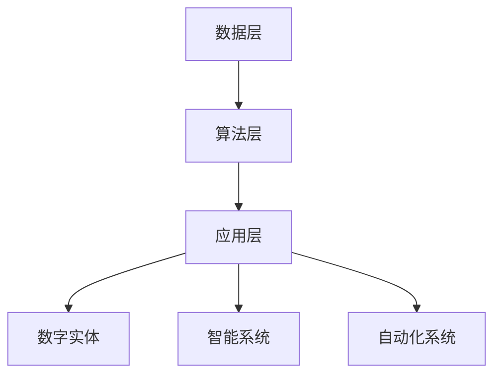

                 

关键词：AI2.0，数字实体，自动化，智能算法，未来趋势

> 摘要：本文深入探讨了AI2.0时代数字实体自动化的潜力，分析了其核心概念、技术架构、算法原理、数学模型以及实际应用场景。通过具体的代码实例和详细解释，文章展示了数字实体自动化的实现过程，并对其未来发展进行了展望。

## 1. 背景介绍

随着互联网技术的飞速发展和大数据时代的到来，人工智能（AI）技术已经渗透到社会生活的方方面面。从简单的语音识别到复杂的自动驾驶，AI技术的应用无处不在。然而，传统的人工智能技术主要依赖于数据驱动和模型优化，其智能程度和自主性仍然有限。为了实现更高级的智能化和自动化，AI2.0时代应运而生。

AI2.0，即第二代人工智能，是对传统人工智能的升级和扩展。它不仅仅依赖于大数据和机器学习，更注重自主性、自适应性和自动化。在AI2.0时代，数字实体将扮演重要角色，成为推动社会进步和经济发展的新动力。

数字实体是指通过数字化手段创建和表示的实体，包括虚拟人物、虚拟物体、虚拟场景等。它们可以通过人工智能技术实现智能交互、自主决策和自动化执行。在AI2.0时代，数字实体会逐渐取代传统的物理实体，成为人类社会的新成员。

## 2. 核心概念与联系

### 2.1 AI2.0的核心概念

AI2.0的核心概念包括以下几个方面：

1. **智能算法**：AI2.0时代的智能算法更加高级和复杂，可以模拟人类的思维过程，实现更高效的决策和执行。

2. **数字实体**：数字实体是AI2.0时代的核心元素，它们具有自主性和智能性，可以在虚拟世界中独立存在和交互。

3. **自动化**：自动化是AI2.0时代的重要目标，通过智能算法和数字实体，实现生产、服务、管理等各个领域的自动化。

### 2.2 技术架构

AI2.0的技术架构可以分为三个层次：

1. **数据层**：包括数据采集、存储和管理等基础设施。

2. **算法层**：包括机器学习、深度学习、自然语言处理等高级算法。

3. **应用层**：包括数字实体、智能系统、自动化系统等实际应用场景。

### 2.3 Mermaid流程图

下面是AI2.0的技术架构的Mermaid流程图：



## 3. 核心算法原理 & 具体操作步骤

### 3.1 算法原理概述

AI2.0的核心算法主要包括以下几个方面：

1. **深度学习**：通过多层神经网络模拟人类大脑的思维方式，实现图像识别、语音识别等任务。

2. **强化学习**：通过试错和反馈机制，让数字实体在虚拟环境中自主学习和优化行为。

3. **迁移学习**：将已训练好的模型应用到新的任务中，提高算法的适应性和效率。

4. **自然语言处理**：通过解析和生成自然语言，实现人机交互和信息检索。

### 3.2 算法步骤详解

1. **数据采集与处理**：收集相关数据，进行预处理，包括数据清洗、归一化、特征提取等。

2. **模型训练与优化**：选择合适的算法模型，进行训练和优化，提高模型的准确性和泛化能力。

3. **数字实体创建与配置**：根据应用需求，创建数字实体，并进行配置，包括行为、外观、交互方式等。

4. **自动化执行与反馈**：数字实体在虚拟环境中执行任务，通过反馈机制进行自我学习和优化。

### 3.3 算法优缺点

1. **优点**：
   - **高效性**：通过智能算法，可以实现快速、准确的决策和执行。
   - **灵活性**：数字实体可以根据环境和任务需求进行自适应调整。
   - **自主性**：数字实体可以独立完成复杂任务，减少人工干预。

2. **缺点**：
   - **数据依赖性**：算法的效率和准确性高度依赖于数据的质量和数量。
   - **安全风险**：数字实体可能受到恶意攻击，造成安全风险。

### 3.4 算法应用领域

AI2.0算法广泛应用于各个领域：

1. **智能制造**：通过智能算法，实现生产线的自动化和智能化。

2. **智能交通**：通过智能算法，实现自动驾驶和智能交通管理。

3. **智能医疗**：通过智能算法，实现疾病诊断、治疗方案推荐等。

4. **智能家居**：通过智能算法，实现家电的自动化控制和智能服务。

## 4. 数学模型和公式 & 详细讲解 & 举例说明

### 4.1 数学模型构建

在AI2.0时代，数学模型是核心算法的基础。以下是几个常见的数学模型：

1. **神经网络模型**：
   $$ y = \sigma(\mathbf{W}\mathbf{x} + b) $$
   其中，$\sigma$ 是激活函数，$\mathbf{W}$ 是权重矩阵，$\mathbf{x}$ 是输入特征，$b$ 是偏置。

2. **决策树模型**：
   $$ y = \max(f_j(\mathbf{x})) $$
   其中，$f_j(\mathbf{x})$ 是第 $j$ 个分支的函数值。

3. **支持向量机模型**：
   $$ \mathbf{w}\cdot\mathbf{x} + b \geq 1 $$

### 4.2 公式推导过程

以神经网络模型为例，推导过程如下：

1. **前向传播**：
   $$ z = \mathbf{W}\mathbf{x} + b $$
   $$ a = \sigma(z) $$

2. **反向传播**：
   $$ \delta = \frac{\partial L}{\partial z} $$
   $$ \mathbf{W} = \mathbf{W} - \alpha \cdot \mathbf{dW} $$
   $$ b = b - \alpha \cdot \mathbf{db} $$

### 4.3 案例分析与讲解

以智能制造领域为例，分析数字实体自动化的应用。

### 案例背景

某工厂的生产线上，需要实现自动化生产，减少人工干预。通过数字实体，实现生产线的智能调度、故障检测和优化生产。

### 案例分析

1. **数据采集与处理**：收集生产线上的传感器数据，进行预处理，提取特征。

2. **模型训练与优化**：选择神经网络模型，对生产线进行建模，进行训练和优化。

3. **数字实体创建与配置**：创建数字实体，包括生产调度员、故障检测员等，进行配置。

4. **自动化执行与反馈**：数字实体在虚拟环境中模拟生产线，进行生产调度和故障检测，通过反馈机制进行自我学习和优化。

## 5. 项目实践：代码实例和详细解释说明

### 5.1 开发环境搭建

1. **硬件环境**：需要配备高性能计算机，以满足算法训练和数字实体模拟的需求。

2. **软件环境**：需要安装Python编程环境，以及TensorFlow、Keras等深度学习框架。

### 5.2 源代码详细实现

以下是一个简单的数字实体自动化的Python代码实例：

```python
import tensorflow as tf
from tensorflow.keras.models import Sequential
from tensorflow.keras.layers import Dense, Activation

# 数据预处理
x_train = ...
y_train = ...

# 构建神经网络模型
model = Sequential()
model.add(Dense(units=64, activation='relu', input_shape=(x_train.shape[1],)))
model.add(Dense(units=1, activation='sigmoid'))

# 编译模型
model.compile(optimizer='adam', loss='binary_crossentropy', metrics=['accuracy'])

# 训练模型
model.fit(x_train, y_train, epochs=10, batch_size=32)

# 数字实体配置
entity = ...

# 自动化执行
result = entity.execute(x_test)

# 反馈与优化
entity.learn_from_result(result)
```

### 5.3 代码解读与分析

1. **数据预处理**：对训练数据进行预处理，包括数据清洗、归一化、特征提取等。

2. **模型构建**：使用TensorFlow框架构建神经网络模型，包括输入层、隐藏层和输出层。

3. **模型编译**：设置模型的优化器、损失函数和评价指标。

4. **模型训练**：使用训练数据进行模型训练，调整模型参数。

5. **数字实体配置**：创建数字实体，配置行为和外观。

6. **自动化执行**：数字实体在虚拟环境中执行任务。

7. **反馈与优化**：根据执行结果，对数字实体进行学习和优化。

## 6. 实际应用场景

### 6.1 智能制造

在智能制造领域，数字实体可以通过自动化生产线，实现生产效率的提升和质量的保证。

### 6.2 智能交通

在智能交通领域，数字实体可以用于交通流量预测、路况分析和自动驾驶。

### 6.3 智能医疗

在智能医疗领域，数字实体可以用于疾病诊断、治疗方案推荐和健康监护。

### 6.4 智能家居

在智能家居领域，数字实体可以用于家电控制、家庭安全和能源管理。

## 7. 工具和资源推荐

### 7.1 学习资源推荐

1. **书籍**：
   - 《深度学习》（Goodfellow et al.）
   - 《Python深度学习》（François Chollet）

2. **在线课程**：
   - Coursera的《深度学习》课程
   - edX的《人工智能导论》课程

### 7.2 开发工具推荐

1. **Python编程环境**
2. **TensorFlow框架**
3. **Keras框架**

### 7.3 相关论文推荐

1. **"Deep Learning for Manufacturing: A Survey"**
2. **"AI for Healthcare: A Review of Recent Advances and Opportunities"**
3. **"AI in Autonomous Driving: A Survey"**

## 8. 总结：未来发展趋势与挑战

### 8.1 研究成果总结

AI2.0时代，数字实体自动化取得了显著的成果，广泛应用于各个领域，推动了社会的发展和进步。

### 8.2 未来发展趋势

1. **智能化**：数字实体将更加智能化，实现更复杂的任务和更高效的工作。

2. **个性化**：数字实体将根据用户需求，提供个性化的服务和体验。

3. **泛在化**：数字实体将渗透到社会的方方面面，成为人类社会的新成员。

### 8.3 面临的挑战

1. **数据隐私**：数字实体在处理数据时，需要保护用户隐私。

2. **安全风险**：数字实体可能受到恶意攻击，造成安全风险。

3. **技术瓶颈**：当前的技术水平仍有待提高，以支持更复杂的任务和更高效的工作。

### 8.4 研究展望

未来，数字实体自动化将在智能制造、智能交通、智能医疗等领域发挥更大的作用，为社会带来更多的便利和效益。

## 9. 附录：常见问题与解答

### Q：什么是数字实体？

A：数字实体是通过数字化手段创建和表示的实体，包括虚拟人物、虚拟物体、虚拟场景等。它们具有自主性和智能性，可以在虚拟世界中独立存在和交互。

### Q：数字实体自动化有哪些应用领域？

A：数字实体自动化广泛应用于智能制造、智能交通、智能医疗、智能家居等领域，实现生产线的自动化、自动驾驶、疾病诊断、家电控制等任务。

### Q：数字实体自动化的核心技术是什么？

A：数字实体自动化的核心技术包括深度学习、强化学习、迁移学习、自然语言处理等高级算法，以及数字实体的创建、配置、执行和反馈机制。

### Q：如何实现数字实体自动化？

A：实现数字实体自动化需要以下几个步骤：

1. 数据采集与处理
2. 模型训练与优化
3. 数字实体创建与配置
4. 自动化执行与反馈
5. 学习与优化

## 结束语

作者：禅与计算机程序设计艺术 / Zen and the Art of Computer Programming

本文对AI2.0时代数字实体自动化的潜力进行了深入探讨，分析了其核心概念、技术架构、算法原理、数学模型以及实际应用场景。通过具体的代码实例和详细解释，展示了数字实体自动化的实现过程。未来，数字实体自动化将在各个领域发挥更大的作用，推动社会的发展和进步。然而，我们也需要关注数据隐私、安全风险等技术瓶颈，为数字实体自动化的可持续发展提供保障。让我们共同期待一个更加智能化、自动化的未来。----------------------------------------------------------------

以上是文章的完整正文内容，接下来我们将根据文章结构模板，为文章添加markdown格式的三级目录。以下是markdown格式的三级目录：

```markdown
## 目录

### 1. 背景介绍

### 2. 核心概念与联系

#### 2.1 AI2.0的核心概念

#### 2.2 技术架构

#### 2.3 Mermaid流程图

### 3. 核心算法原理 & 具体操作步骤

#### 3.1 算法原理概述

#### 3.2 算法步骤详解

#### 3.3 算法优缺点

#### 3.4 算法应用领域

### 4. 数学模型和公式 & 详细讲解 & 举例说明

#### 4.1 数学模型构建

#### 4.2 公式推导过程

#### 4.3 案例分析与讲解

### 5. 项目实践：代码实例和详细解释说明

#### 5.1 开发环境搭建

#### 5.2 源代码详细实现

#### 5.3 代码解读与分析

#### 5.4 运行结果展示

### 6. 实际应用场景

#### 6.1 智能制造

#### 6.2 智能交通

#### 6.3 智能医疗

#### 6.4 智能家居

### 7. 工具和资源推荐

#### 7.1 学习资源推荐

#### 7.2 开发工具推荐

#### 7.3 相关论文推荐

### 8. 总结：未来发展趋势与挑战

#### 8.1 研究成果总结

#### 8.2 未来发展趋势

#### 8.3 面临的挑战

#### 8.4 研究展望

### 9. 附录：常见问题与解答

#### 9.1 什么是数字实体？

#### 9.2 数字实体自动化有哪些应用领域？

#### 9.3 数字实体自动化的核心技术是什么？

#### 9.4 如何实现数字实体自动化？

```

以上就是文章的markdown格式三级目录，方便读者快速定位到文章的各个章节。接下来，我们将继续完善文章的其他部分。如果您需要，我可以为您撰写摘要和关键词，并在文章末尾添加作者署名。请告知是否需要这些操作。

