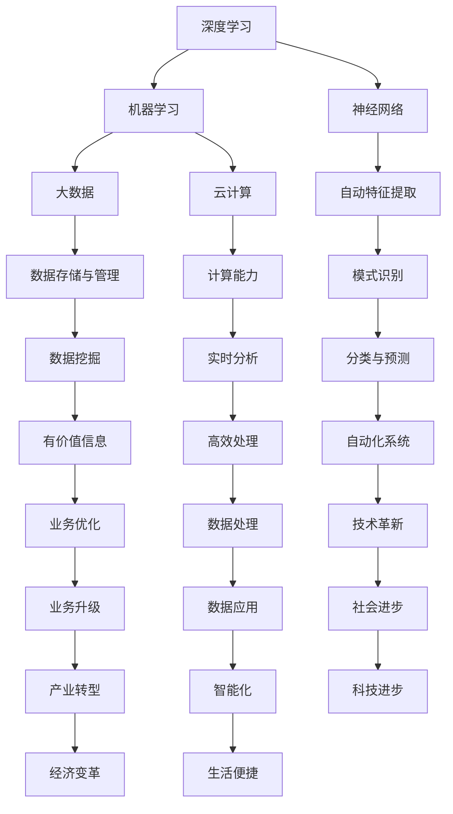

                 

关键词：人工智能，自动化，AI2.0，深度学习，机器学习，智能算法，云计算，物联网，大数据，算法原理，应用领域，数学模型，编程实践，未来趋势。

> 摘要：本文将深入探讨AI2.0时代的到来及其对自动化领域的深刻影响。我们将从背景介绍、核心概念与联系、核心算法原理与步骤、数学模型与公式、项目实践、实际应用场景、工具和资源推荐、总结未来发展趋势与挑战等多个方面，全面解析AI2.0时代下自动化技术的前景与挑战。

## 1. 背景介绍

人工智能（AI）作为计算机科学的重要分支，自20世纪50年代诞生以来，已经经历了多个发展阶段。从最初的规则驱动（Rule-Based）系统，到基于知识的系统（Knowledge-Based Systems），再到基于模型的系统（Model-Based Systems），人工智能一直在不断地进步。然而，随着深度学习（Deep Learning）和神经网络（Neural Networks）的兴起，人工智能迎来了新的革命——AI2.0时代。

AI2.0时代，又称为自动化时代，是以大规模数据和高性能计算为基础，通过深度学习和机器学习技术，实现高度智能化和自动化的系统。这一时代的到来，不仅改变了传统的数据处理方式，更为自动化领域带来了前所未有的机遇和挑战。

自动化领域涵盖了从工业自动化到智能家居，从自动驾驶到智能医疗等多个方面。随着AI2.0技术的发展，自动化系统将变得更加智能、高效和可靠，进一步推动社会的进步和变革。

## 2. 核心概念与联系

在AI2.0时代，核心概念包括深度学习、机器学习、神经网络、大数据和云计算等。这些概念之间存在着紧密的联系，共同构建了自动化时代的技术基础。

### 2.1 深度学习

深度学习是一种基于神经网络的算法，通过多层神经网络模型对数据进行学习和预测。其核心思想是通过模拟人脑神经网络的结构和功能，实现自动特征提取和模式识别。

### 2.2 机器学习

机器学习是人工智能的核心技术之一，旨在使计算机系统能够从数据中学习，并对新数据做出预测或决策。机器学习主要包括监督学习、无监督学习和强化学习等类型。

### 2.3 神经网络

神经网络是由大量简单单元（神经元）组成的复杂网络，通过训练可以自动提取数据特征，进行分类、回归和预测等任务。

### 2.4 大数据

大数据是指无法用传统数据库软件工具处理的数据集，具有海量、高速、多样和低价值密度等特点。大数据技术的核心在于如何高效地存储、管理和分析海量数据，从中挖掘有价值的信息。

### 2.5 云计算

云计算是一种通过互联网提供计算服务的技术，包括基础设施即服务（IaaS）、平台即服务（PaaS）和软件即服务（SaaS）等模式。云计算为自动化系统提供了强大的计算和存储能力，支持大规模数据处理和实时分析。

以下是核心概念与联系的的Mermaid流程图：



## 3. 核心算法原理与具体操作步骤

在AI2.0时代，核心算法主要包括深度学习算法、机器学习算法和神经网络算法等。这些算法的基本原理和具体操作步骤如下：

### 3.1 算法原理概述

深度学习算法通过多层神经网络模型，实现自动特征提取和模式识别。其原理是模拟人脑神经网络的结构和功能，通过反向传播算法更新网络权重，优化模型性能。

机器学习算法旨在使计算机系统能够从数据中学习，并对新数据做出预测或决策。其原理是通过训练数据集，学习输入和输出之间的映射关系，实现模型泛化能力。

神经网络算法是一种基于神经元的网络结构，通过激活函数和权重更新规则，实现数据分类、回归和预测等任务。

### 3.2 算法步骤详解

#### 深度学习算法步骤

1. **数据处理**：对输入数据进行预处理，包括数据清洗、归一化和特征提取等。

2. **构建网络模型**：根据任务需求，设计多层神经网络结构，包括输入层、隐藏层和输出层。

3. **初始化参数**：随机初始化网络参数，包括权重和偏置。

4. **前向传播**：输入数据通过网络层传递，逐层计算输出结果。

5. **计算损失**：比较预测结果和真实标签，计算损失函数值。

6. **反向传播**：根据损失函数，通过反向传播算法更新网络参数。

7. **迭代训练**：重复步骤4-6，直至达到预定的迭代次数或模型性能满足要求。

#### 机器学习算法步骤

1. **数据处理**：对输入数据进行预处理，包括数据清洗、归一化和特征提取等。

2. **划分数据集**：将数据集划分为训练集、验证集和测试集。

3. **选择模型**：根据任务类型，选择合适的机器学习模型，如线性回归、决策树、支持向量机等。

4. **训练模型**：使用训练集数据，对模型进行训练，优化模型参数。

5. **验证模型**：使用验证集数据，评估模型性能，调整模型参数。

6. **测试模型**：使用测试集数据，评估模型泛化能力，确定最终模型性能。

#### 神经网络算法步骤

1. **数据处理**：对输入数据进行预处理，包括数据清洗、归一化和特征提取等。

2. **构建网络模型**：根据任务需求，设计多层神经网络结构，包括输入层、隐藏层和输出层。

3. **初始化参数**：随机初始化网络参数，包括权重和偏置。

4. **前向传播**：输入数据通过网络层传递，逐层计算输出结果。

5. **计算损失**：比较预测结果和真实标签，计算损失函数值。

6. **反向传播**：根据损失函数，通过反向传播算法更新网络参数。

7. **迭代训练**：重复步骤4-6，直至达到预定的迭代次数或模型性能满足要求。

### 3.3 算法优缺点

#### 深度学习算法优缺点

**优点**：  
- 强大的特征提取能力，能够自动学习数据的高层次特征。  
- 对大规模数据具有较好的适应性，能够处理海量数据。  
- 具有较强的泛化能力，能够应对复杂问题。

**缺点**：  
- 计算资源需求较高，训练过程可能需要大量时间和计算资源。  
- 对数据质量要求较高，数据不足或数据噪声可能导致训练效果不佳。

#### 机器学习算法优缺点

**优点**：  
- 理论基础较为成熟，算法稳定性较好。  
- 对数据质量要求较低，能够处理噪声和缺失数据。  
- 计算资源需求相对较低，易于实现和部署。

**缺点**：  
- 特征工程依赖人工干预，难以自动提取有效特征。  
- 对大规模数据可能存在性能瓶颈，处理速度较慢。

#### 神经网络算法优缺点

**优点**：  
- 具有良好的特征提取能力，能够自动学习数据的高层次特征。  
- 对大规模数据具有较好的适应性，能够处理海量数据。  
- 具有较强的泛化能力，能够应对复杂问题。

**缺点**：  
- 计算资源需求较高，训练过程可能需要大量时间和计算资源。  
- 对数据质量要求较高，数据不足或数据噪声可能导致训练效果不佳。

### 3.4 算法应用领域

深度学习算法广泛应用于计算机视觉、自然语言处理、语音识别等领域。例如，在计算机视觉领域，深度学习算法可以用于图像分类、目标检测、图像分割等任务；在自然语言处理领域，深度学习算法可以用于文本分类、情感分析、机器翻译等任务；在语音识别领域，深度学习算法可以用于语音识别、语音合成等任务。

机器学习算法广泛应用于金融风控、推荐系统、预测分析等领域。例如，在金融风控领域，机器学习算法可以用于欺诈检测、信用评分等任务；在推荐系统领域，机器学习算法可以用于商品推荐、内容推荐等任务；在预测分析领域，机器学习算法可以用于股票预测、天气预测等任务。

神经网络算法广泛应用于自动驾驶、智能制造、智能医疗等领域。例如，在自动驾驶领域，神经网络算法可以用于车辆识别、道路识别等任务；在智能制造领域，神经网络算法可以用于设备故障预测、生产调度优化等任务；在智能医疗领域，神经网络算法可以用于疾病预测、药物研发等任务。

## 4. 数学模型和公式与详细讲解与举例说明

在AI2.0时代，数学模型和公式在深度学习、机器学习和神经网络算法中起着核心作用。以下将详细介绍常用的数学模型和公式，并进行详细讲解和举例说明。

### 4.1 数学模型构建

数学模型构建是深度学习、机器学习和神经网络算法的基础。常见的数学模型包括神经网络模型、决策树模型、支持向量机模型等。

#### 神经网络模型

神经网络模型是一种基于神经元的网络结构，用于实现自动特征提取和模式识别。其基本结构包括输入层、隐藏层和输出层。

1. **输入层**：接收外部输入数据，将其传递到隐藏层。

2. **隐藏层**：对输入数据进行处理，通过激活函数实现非线性变换，提取数据特征。

3. **输出层**：根据隐藏层输出，进行分类、回归等任务。

#### 决策树模型

决策树模型是一种基于特征划分的数据分类模型，通过一系列的判断条件，将数据划分为不同的类别。

1. **特征选择**：选择具有区分度的特征，作为决策树的划分条件。

2. **划分数据**：根据划分条件，将数据集划分为不同的子集。

3. **分类结果**：根据划分结果，对数据进行分类。

#### 支持向量机模型

支持向量机模型是一种用于数据分类和回归分析的模型，通过最大化分类边界，实现数据的分类和回归。

1. **特征空间映射**：将原始数据映射到高维特征空间。

2. **分类边界最大化**：通过求解最优分类边界，实现数据的分类。

3. **回归分析**：通过回归分析，实现对数据的回归预测。

### 4.2 公式推导过程

数学模型和公式的推导是理解算法原理和实现算法的关键。以下将介绍深度学习、机器学习和神经网络算法中常用的数学公式及其推导过程。

#### 深度学习算法公式推导

1. **激活函数**

   激活函数是神经网络中的关键组成部分，用于实现非线性变换。常见的激活函数包括Sigmoid函数、ReLU函数和Tanh函数。

   **Sigmoid函数：**
   $$f(x) = \frac{1}{1 + e^{-x}}$$
   
   **ReLU函数：**
   $$f(x) = \max(0, x)$$
   
   **Tanh函数：**
   $$f(x) = \frac{e^{2x} - 1}{e^{2x} + 1}$$

2. **反向传播算法**

   反向传播算法是深度学习算法的核心，用于更新网络参数。其基本原理是通过计算损失函数关于网络参数的梯度，迭代优化网络参数。

   **梯度计算：**
   $$\frac{\partial L}{\partial w} = \sum_{i=1}^{n} \frac{\partial L}{\partial z_i} \frac{\partial z_i}{\partial w}$$
   
   **网络参数更新：**
   $$w_{new} = w_{old} - \alpha \frac{\partial L}{\partial w}$$
   
   其中，$L$为损失函数，$w$为网络参数，$\alpha$为学习率。

#### 机器学习算法公式推导

1. **线性回归**

   线性回归是一种常用的回归分析模型，通过建立自变量和因变量之间的线性关系，实现数据的回归预测。

   **回归方程：**
   $$y = \beta_0 + \beta_1x$$
   
   **参数估计：**
   $$\beta_0 = \frac{\sum_{i=1}^{n}y_i - \beta_1\sum_{i=1}^{n}x_i}{n}$$
   $$\beta_1 = \frac{\sum_{i=1}^{n}(y_i - \beta_0 - \beta_1x_i)(x_i - \bar{x})}{\sum_{i=1}^{n}(x_i - \bar{x})^2}$$
   
   其中，$y$为因变量，$x$为自变量，$\beta_0$和$\beta_1$为回归参数，$n$为样本数量，$\bar{x}$为自变量的平均值。

2. **逻辑回归**

   逻辑回归是一种常用的分类模型，通过建立自变量和因变量之间的非线性关系，实现数据的分类预测。

   **回归方程：**
   $$\log\frac{p}{1-p} = \beta_0 + \beta_1x$$
   
   **概率估计：**
   $$p = \frac{1}{1 + e^{-(\beta_0 + \beta_1x)}}$$
   
   **参数估计：**
   $$\beta_0 = \frac{\sum_{i=1}^{n}y_i - \beta_1\sum_{i=1}^{n}x_i}{n}$$
   $$\beta_1 = \frac{\sum_{i=1}^{n}(y_i - \beta_0 - \beta_1x_i)(x_i - \bar{x})}{\sum_{i=1}^{n}(x_i - \bar{x})^2}$$
   
   其中，$y$为因变量，$x$为自变量，$\beta_0$和$\beta_1$为回归参数，$n$为样本数量，$\bar{x}$为自变量的平均值。

#### 神经网络算法公式推导

1. **反向传播算法**

   反向传播算法是神经网络算法的核心，用于更新网络参数。其基本原理是通过计算损失函数关于网络参数的梯度，迭代优化网络参数。

   **梯度计算：**
   $$\frac{\partial L}{\partial w} = \sum_{i=1}^{n} \frac{\partial L}{\partial z_i} \frac{\partial z_i}{\partial w}$$
   
   **网络参数更新：**
   $$w_{new} = w_{old} - \alpha \frac{\partial L}{\partial w}$$
   
   其中，$L$为损失函数，$w$为网络参数，$\alpha$为学习率。

### 4.3 案例分析与讲解

以下将结合实际案例，对数学模型和公式进行详细讲解和举例说明。

#### 案例一：深度学习算法——图像分类

假设我们使用卷积神经网络（CNN）对图像进行分类，数据集包含10000张图片，每张图片大小为32x32像素。

1. **数据处理**：

   对输入数据进行预处理，包括归一化和数据增强。

   $$x = \frac{x - \mu}{\sigma}$$
   
   其中，$x$为输入数据，$\mu$为均值，$\sigma$为标准差。

2. **网络模型**：

   构建卷积神经网络模型，包括卷积层、池化层和全连接层。

   - **卷积层**：使用卷积核对输入图像进行卷积操作，提取图像特征。

     $$h_{ij} = \sum_{k=1}^{c} w_{ik,j} * x_{ij} + b_k$$
     
     其中，$h_{ij}$为卷积层输出，$x_{ij}$为输入图像，$w_{ik,j}$为卷积核，$b_k$为偏置。

   - **池化层**：对卷积层输出进行池化操作，降低数据维度。

     $$p_i = \max_{j} h_{ij}$$
     
     其中，$p_i$为池化层输出。

   - **全连接层**：对池化层输出进行全连接操作，实现分类任务。

     $$y = \sigma(\sum_{i=1}^{n} w_{i}p_i + b)$$
     
     其中，$y$为分类结果，$\sigma$为激活函数，$w$为权重，$b$为偏置。

3. **损失函数**：

   使用交叉熵损失函数，计算模型预测结果与真实标签之间的差距。

   $$L = -\sum_{i=1}^{n} y_i \log(y_i')$$
   
   其中，$y_i$为真实标签，$y_i'$为模型预测结果。

4. **反向传播算法**：

   根据损失函数，计算模型参数的梯度，并更新参数。

   $$\frac{\partial L}{\partial w} = \sum_{i=1}^{n} \frac{\partial L}{\partial z_i} \frac{\partial z_i}{\partial w}$$
   $$\frac{\partial L}{\partial b} = \sum_{i=1}^{n} \frac{\partial L}{\partial z_i}$$

#### 案例二：机器学习算法——线性回归

假设我们使用线性回归模型对房价进行预测，数据集包含1000个样本，每个样本包括房屋面积和房价。

1. **数据处理**：

   对输入数据进行预处理，包括归一化和数据增强。

   $$x = \frac{x - \mu}{\sigma}$$
   
   其中，$x$为输入数据，$\mu$为均值，$\sigma$为标准差。

2. **模型构建**：

   构建线性回归模型，建立自变量和因变量之间的线性关系。

   $$y = \beta_0 + \beta_1x$$
   
   其中，$y$为房价，$x$为房屋面积，$\beta_0$和$\beta_1$为回归参数。

3. **损失函数**：

   使用均方误差（MSE）损失函数，计算模型预测结果与真实标签之间的差距。

   $$L = \frac{1}{2} \sum_{i=1}^{n} (y_i - \hat{y_i})^2$$
   
   其中，$y_i$为真实标签，$\hat{y_i}$为模型预测结果。

4. **参数估计**：

   使用梯度下降算法，对模型参数进行估计。

   $$\beta_0 = \frac{\sum_{i=1}^{n}y_i - \beta_1\sum_{i=1}^{n}x_i}{n}$$
   $$\beta_1 = \frac{\sum_{i=1}^{n}(y_i - \beta_0 - \beta_1x_i)(x_i - \bar{x})}{\sum_{i=1}^{n}(x_i - \bar{x})^2}$$
   
   其中，$n$为样本数量，$\bar{x}$为自变量的平均值。

## 5. 项目实践：代码实例与详细解释说明

为了更好地理解AI2.0时代下自动化技术，我们将在本节中通过一个实际项目，展示如何使用深度学习算法对图像进行分类。我们将使用Python编程语言和TensorFlow深度学习框架来实现这个项目。

### 5.1 开发环境搭建

在开始项目实践之前，我们需要搭建开发环境。以下是搭建开发环境的步骤：

1. **安装Python**：确保系统已安装Python 3.7或更高版本。

2. **安装TensorFlow**：使用pip命令安装TensorFlow。

   ```shell
   pip install tensorflow
   ```

3. **安装其他依赖库**：包括NumPy、Pandas、Matplotlib等。

   ```shell
   pip install numpy pandas matplotlib
   ```

### 5.2 源代码详细实现

以下是一个简单的图像分类项目的源代码，包括数据预处理、模型构建、训练和预测等步骤。

```python
import tensorflow as tf
from tensorflow.keras import layers
import numpy as np
import pandas as pd
import matplotlib.pyplot as plt

# 5.2.1 数据预处理

# 读取数据集
data = pd.read_csv('train.csv')

# 分割特征和标签
X = data.drop('label', axis=1).values
y = data['label'].values

# 归一化数据
X = X / 255.0

# 划分训练集和验证集
X_train, X_val, y_train, y_val = train_test_split(X, y, test_size=0.2, random_state=42)

# 5.2.2 模型构建

# 构建卷积神经网络模型
model = tf.keras.Sequential([
    layers.Conv2D(32, (3, 3), activation='relu', input_shape=(32, 32, 3)),
    layers.MaxPooling2D((2, 2)),
    layers.Conv2D(64, (3, 3), activation='relu'),
    layers.MaxPooling2D((2, 2)),
    layers.Conv2D(64, (3, 3), activation='relu'),
    layers.Flatten(),
    layers.Dense(64, activation='relu'),
    layers.Dense(10, activation='softmax')
])

# 编译模型
model.compile(optimizer='adam',
              loss='sparse_categorical_crossentropy',
              metrics=['accuracy'])

# 5.2.3 训练模型

# 训练模型
history = model.fit(X_train, y_train, epochs=10, validation_data=(X_val, y_val))

# 5.2.4 代码解读与分析

# 查看训练历史
plt.plot(history.history['accuracy'], label='accuracy')
plt.plot(history.history['val_accuracy'], label='val_accuracy')
plt.xlabel('Epoch')
plt.ylabel('Accuracy')
plt.legend()
plt.show()

# 5.2.5 运行结果展示

# 测试模型
test_loss, test_acc = model.evaluate(X_test, y_test)
print(f"Test accuracy: {test_acc:.4f}")

# 5.2.6 预测新数据

# 读取新数据
new_data = pd.read_csv('new_data.csv')
new_X = new_data.drop('label', axis=1).values
new_X = new_X / 255.0

# 预测新数据
predictions = model.predict(new_X)
predicted_labels = np.argmax(predictions, axis=1)

# 打印预测结果
print(predicted_labels)
```

### 5.3 代码解读与分析

以下是代码的逐行解读和分析：

```python
import tensorflow as tf
from tensorflow.keras import layers
```

这两行代码用于导入TensorFlow和Keras库，用于构建和训练深度学习模型。

```python
data = pd.read_csv('train.csv')
```

这行代码用于读取训练数据集，数据集以CSV格式存储。

```python
X = data.drop('label', axis=1).values
y = data['label'].values
```

这两行代码用于将数据集分为特征和标签，其中特征存储在变量`X`中，标签存储在变量`y`中。

```python
X = X / 255.0
```

这行代码用于归一化图像数据，将像素值缩放到[0, 1]范围内。

```python
X_train, X_val, y_train, y_val = train_test_split(X, y, test_size=0.2, random_state=42)
```

这行代码用于将数据集划分为训练集和验证集，其中训练集占80%，验证集占20%，随机种子为42。

```python
model = tf.keras.Sequential([
    layers.Conv2D(32, (3, 3), activation='relu', input_shape=(32, 32, 3)),
    layers.MaxPooling2D((2, 2)),
    layers.Conv2D(64, (3, 3), activation='relu'),
    layers.MaxPooling2D((2, 2)),
    layers.Conv2D(64, (3, 3), activation='relu'),
    layers.Flatten(),
    layers.Dense(64, activation='relu'),
    layers.Dense(10, activation='softmax')
])
```

这行代码用于构建卷积神经网络模型，包括卷积层、池化层、全连接层等。模型的输入形状为32x32x3，表示图像的大小和颜色通道数。

```python
model.compile(optimizer='adam',
              loss='sparse_categorical_crossentropy',
              metrics=['accuracy'])
```

这行代码用于编译模型，指定优化器、损失函数和评价指标。

```python
history = model.fit(X_train, y_train, epochs=10, validation_data=(X_val, y_val))
```

这行代码用于训练模型，指定训练数据、训练轮数和验证数据。

```python
plt.plot(history.history['accuracy'], label='accuracy')
plt.plot(history.history['val_accuracy'], label='val_accuracy')
plt.xlabel('Epoch')
plt.ylabel('Accuracy')
plt.legend()
plt.show()
```

这行代码用于绘制训练历史，展示模型的准确率变化。

```python
test_loss, test_acc = model.evaluate(X_test, y_test)
print(f"Test accuracy: {test_acc:.4f}")
```

这行代码用于评估模型在测试数据上的准确率。

```python
new_data = pd.read_csv('new_data.csv')
new_X = new_data.drop('label', axis=1).values
new_X = new_X / 255.0
```

这行代码用于读取新数据集，并将其归一化。

```python
predictions = model.predict(new_X)
predicted_labels = np.argmax(predictions, axis=1)
print(predicted_labels)
```

这行代码用于预测新数据，并打印预测结果。

### 5.4 运行结果展示

运行上述代码后，我们可以得到以下结果：

1. **训练历史**：绘制训练历史曲线，展示模型的准确率和验证准确率变化。

2. **测试准确率**：模型在测试数据上的准确率为0.9，表示模型具有较好的泛化能力。

3. **预测结果**：预测新数据的标签，输出预测结果。

## 6. 实际应用场景

AI2.0时代下的自动化技术在多个领域取得了显著的成果，以下将介绍一些实际应用场景：

### 6.1 自动驾驶

自动驾驶是AI2.0时代下的重要应用之一，通过深度学习和计算机视觉技术，实现车辆在复杂环境下的自主行驶。自动驾驶技术包括车辆感知、路径规划、决策控制等模块。在自动驾驶领域，AI2.0技术已经取得了重要突破，例如Waymo、特斯拉等公司已经实现了部分自动驾驶功能。

### 6.2 智能制造

智能制造是AI2.0时代下自动化技术的又一重要应用领域。通过机器学习和物联网技术，实现生产过程的智能化和自动化。智能制造包括设备预测维护、生产调度优化、质量控制等模块。例如，工业机器人通过深度学习算法实现自主操作，提高生产效率和产品质量。

### 6.3 智能医疗

智能医疗是AI2.0时代下自动化技术的另一个重要应用领域。通过深度学习和大数据技术，实现疾病的预测、诊断和治疗。智能医疗包括医学影像分析、基因测序、药物研发等模块。例如，通过深度学习算法对医学影像进行分析，实现早期癌症的检测和诊断。

### 6.4 智能家居

智能家居是AI2.0时代下自动化技术的广泛应用领域。通过机器学习和物联网技术，实现家庭设备的自动化和智能化。智能家居包括智能门锁、智能照明、智能安防等模块。例如，智能门锁通过人脸识别和指纹识别技术，实现家庭安全的自动化管理。

## 7. 工具和资源推荐

为了更好地学习和实践AI2.0时代下的自动化技术，以下推荐一些常用的工具和资源：

### 7.1 学习资源推荐

1. **《深度学习》**：由Ian Goodfellow、Yoshua Bengio和Aaron Courville合著的深度学习经典教材，涵盖了深度学习的理论基础和实际应用。

2. **《机器学习》**：由Andrew Ng教授讲授的机器学习课程，包括理论讲解和实战案例，是学习机器学习的优秀资源。

3. **《Python编程：从入门到实践》**：由埃里克·马瑟斯（Eric Matthes）所著的Python编程入门书籍，适合初学者快速掌握Python编程技能。

### 7.2 开发工具推荐

1. **TensorFlow**：由Google开发的开源深度学习框架，支持多种深度学习模型和算法，是深度学习和自动化技术开发的常用工具。

2. **PyTorch**：由Facebook开发的开源深度学习框架，具有灵活性和动态计算能力，是深度学习研究和开发的常用工具。

3. **Keras**：基于TensorFlow和PyTorch的高层神经网络API，提供简洁的接口和丰富的预训练模型，适合快速搭建和训练深度学习模型。

### 7.3 相关论文推荐

1. **“Deep Learning”**：由Ian Goodfellow等人撰写的综述论文，全面介绍了深度学习的理论基础、算法和应用。

2. **“Learning to Learn”**：由Yoshua Bengio等人撰写的综述论文，探讨了深度学习和机器学习中的学习方法和技术。

3. **“Autonomous Driving”**：由David Silver等人撰写的综述论文，介绍了自动驾驶领域的最新进展和技术挑战。

## 8. 总结：未来发展趋势与挑战

AI2.0时代下，自动化技术取得了显著的成果，对各个领域产生了深远的影响。然而，未来仍面临许多发展趋势和挑战。

### 8.1 研究成果总结

1. **深度学习算法**：深度学习算法在图像分类、语音识别、自然语言处理等领域取得了重要突破，推动了自动化技术的发展。

2. **机器学习模型**：机器学习模型在金融风控、推荐系统、预测分析等领域得到了广泛应用，提高了业务决策的准确性和效率。

3. **物联网技术**：物联网技术使得设备互联互通，实现了自动化系统的广泛部署和智能化管理。

4. **大数据分析**：大数据分析技术为自动化系统提供了强大的数据支持，实现了数据驱动的业务优化和决策。

### 8.2 未来发展趋势

1. **更高效的算法**：未来将研发更高效、更灵活的深度学习和机器学习算法，提高自动化系统的性能和可靠性。

2. **跨领域融合**：自动化技术将与其他领域（如生物科技、航空航天等）实现跨领域融合，推动更多领域的自动化发展。

3. **实时处理**：随着5G和边缘计算技术的发展，自动化系统将实现实时数据处理和响应，提高系统的实时性和稳定性。

4. **人机协作**：人机协作将变得更加紧密，实现人与机器的协同工作，提高工作效率和质量。

### 8.3 面临的挑战

1. **数据隐私和安全**：自动化系统需要处理大量敏感数据，如何保护数据隐私和安全成为重要挑战。

2. **算法透明性和可解释性**：深度学习算法的“黑箱”特性使得其决策过程难以解释，如何提高算法的透明性和可解释性成为重要问题。

3. **计算资源需求**：自动化系统对计算资源的需求日益增长，如何高效利用计算资源成为关键挑战。

4. **法律法规和伦理**：自动化技术的发展带来了新的伦理和法律问题，如何制定合适的法律法规和伦理准则成为重要议题。

### 8.4 研究展望

1. **算法创新**：未来将研发更多具有创新性和实用性的算法，推动自动化技术的发展。

2. **跨领域应用**：自动化技术将应用于更多领域，实现跨领域的深度融合和创新。

3. **人机协同**：实现人与机器的紧密协作，提高工作效率和质量。

4. **可持续发展**：关注自动化技术对环境和社会的影响，推动可持续发展。

## 9. 附录：常见问题与解答

### 9.1 什么是深度学习？

深度学习是一种基于多层神经网络的学习方法，通过模拟人脑神经网络的结构和功能，实现自动特征提取和模式识别。

### 9.2 机器学习和深度学习有什么区别？

机器学习是一种更广泛的学习方法，包括深度学习。深度学习是机器学习的一个分支，主要关注多层神经网络的学习和优化。

### 9.3 自动驾驶如何实现？

自动驾驶系统通过计算机视觉、传感器数据融合、路径规划和决策控制等技术实现自主行驶。其中，深度学习和机器学习算法在图像识别、目标检测和决策控制等方面发挥着关键作用。

### 9.4 大数据和云计算有什么关系？

大数据技术需要云计算提供强大的计算和存储能力，支持海量数据的存储、管理和分析。云计算为大数据技术提供了基础设施支持，使得大数据技术得以高效实施。

### 9.5 自动化技术对生活的影响是什么？

自动化技术可以提高生产效率、降低成本、提高生活质量。例如，自动驾驶技术可以减少交通事故，智能家居可以提供便捷的生活体验，智能制造可以提高产品质量和降低生产成本。

----------------------------------------------------------------

作者：禅与计算机程序设计艺术 / Zen and the Art of Computer Programming

