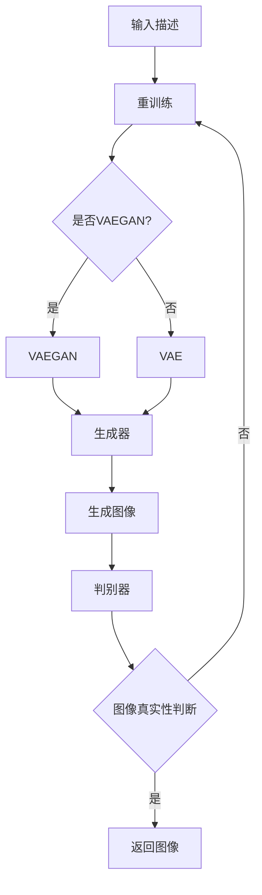

                 

关键词：AIGC, 中间旅程（Midjourney），人工智能，图像生成，计算机图形学，编程实践

摘要：本文旨在为读者提供AIGC（人工智能生成内容）的全面入门指南，特别是针对Midjourney的使用进行深入讲解。文章将探讨AIGC的背景、核心概念，以及Midjourney的工作原理和具体应用。通过详细的算法原理讲解、数学模型解析、代码实例分析以及实际应用场景的探讨，本文将为读者提供一套完整的学习路径，助力读者掌握Midjourney的使用技巧，并开启人工智能图像生成领域的探索之旅。

## 1. 背景介绍

### 1.1 AIGC的发展历程

人工智能生成内容（AIGC）是近年来迅速崛起的一个领域，它的主要目的是利用人工智能技术生成各种类型的内容，如图像、音频、文本等。AIGC的核心在于将人工智能的强大计算能力与内容生成相结合，为创意工作者提供新的工具和手段。

AIGC的发展可以追溯到20世纪80年代，当时的专家系统开始尝试生成简单的文本和图形。随着深度学习的兴起，特别是在2010年后，生成对抗网络（GANs）、变分自编码器（VAEs）等生成模型的出现，使得AIGC的技术水平得到了显著提升。

### 1.2 Midjourney的概念

Midjourney是一个基于AIGC技术的图像生成平台，它结合了多种先进的算法和技巧，使得用户可以轻松生成高质量的图像。Midjourney不仅支持基础的图像生成，还能通过用户提供的描述生成特定场景、风格和细节的图像。

Midjourney的特点在于其高度的可定制性和灵活性。用户可以通过调整参数、输入详细的描述来控制图像生成的结果，从而实现个性化的内容创作。

### 1.3 AIGC的应用场景

AIGC技术在多个领域都有广泛的应用。例如，在游戏开发中，AIGC可以用来生成游戏的场景、角色和道具，提高游戏的真实感和互动性。在广告和媒体行业中，AIGC技术可以帮助设计师快速制作高质量的广告图像和视频。此外，在虚拟现实（VR）和增强现实（AR）领域，AIGC也发挥着重要作用，可以生成逼真的虚拟环境。

## 2. 核心概念与联系

### 2.1 AIGC的核心概念

AIGC的核心在于“生成”，即利用算法生成新的内容。以下是几个关键概念：

1. **生成对抗网络（GANs）**：GANs由生成器和判别器组成。生成器试图生成逼真的数据，而判别器则尝试区分生成器和真实数据的差异。通过两个网络的对抗训练，生成器不断改进，最终能够生成高质量的图像。

2. **变分自编码器（VAEs）**：VAEs是一种基于概率模型的生成模型，通过编码和解码过程实现图像的生成。编码器将输入数据编码为低维表示，解码器则将这个低维表示解码回高维数据。

3. **变分自编码器-对抗网络（VAEGANs）**：VAEGANs结合了VAE和GAN的优点，通过联合训练生成器和判别器，生成更加逼真的图像。

### 2.2 Mermaid流程图

以下是AIGC核心概念和架构的Mermaid流程图：



### 2.3 Midjourney的技术架构

Midjourney的技术架构主要包括以下几个部分：

1. **用户接口**：用户可以通过网页、应用程序或API与Midjourney交互，输入生成请求。
2. **生成器**：根据用户的描述，生成器生成初步的图像。
3. **判别器**：判别器评估生成图像的真实性，确保图像质量。
4. **优化器**：优化器对生成器和判别器进行联合训练，以提高图像生成质量。

## 3. 核心算法原理 & 具体操作步骤

### 3.1 算法原理概述

Midjourney的核心算法是基于生成对抗网络（GANs）和变分自编码器（VAEs）。以下是对这两个算法的简要概述：

1. **生成对抗网络（GANs）**：
   - **生成器**：生成器网络接收随机噪声作为输入，生成与真实数据相似的图像。
   - **判别器**：判别器网络尝试区分输入图像是真实图像还是生成器生成的图像。
   - **对抗训练**：生成器和判别器通过对抗训练相互提升，生成器不断优化生成图像的质量，而判别器则不断加强区分能力。

2. **变分自编码器（VAEs）**：
   - **编码器**：编码器网络将输入图像编码为低维表示。
   - **解码器**：解码器网络将编码后的低维表示解码回图像。
   - **概率模型**：VAEs基于概率模型，通过对数据的概率分布进行建模，实现图像的生成。

### 3.2 算法步骤详解

1. **数据预处理**：
   - **输入描述处理**：将用户输入的描述转换为编码形式，例如使用自然语言处理技术提取关键信息。
   - **图像预处理**：对输入图像进行标准化处理，如调整图像大小、归一化像素值等。

2. **模型训练**：
   - **生成器和判别器初始化**：随机初始化生成器和判别器网络。
   - **对抗训练**：通过迭代训练生成器和判别器，使得生成器生成的图像越来越接近真实图像。
   - **优化**：使用优化算法（如梯度下降）调整网络参数，以提高模型性能。

3. **图像生成**：
   - **随机噪声输入**：生成器接收随机噪声作为输入。
   - **图像生成**：生成器生成初步的图像。
   - **图像优化**：判别器评估图像的真实性，优化器对生成器和判别器进行微调，以提高图像质量。

4. **图像输出**：最终生成的图像作为输出结果返回给用户。

### 3.3 算法优缺点

**优点**：
- **高质量的图像生成**：GANs和VAEs能够生成高质量、逼真的图像。
- **高度的可定制性**：用户可以通过调整参数和输入描述来控制图像生成的结果。
- **适用于多种应用场景**：AIGC技术可以应用于游戏开发、广告设计、虚拟现实等多个领域。

**缺点**：
- **训练时间较长**：GANs和VAEs的训练过程通常需要大量的时间和计算资源。
- **模型不稳定**：GANs的训练过程容易出现模式崩溃等问题，导致模型不稳定。

### 3.4 算法应用领域

- **游戏开发**：使用AIGC技术生成游戏的场景、角色和道具，提高游戏的真实感和互动性。
- **广告设计**：快速制作高质量的广告图像和视频，提高营销效果。
- **虚拟现实（VR）和增强现实（AR）**：生成逼真的虚拟环境，增强用户体验。

## 4. 数学模型和公式 & 详细讲解 & 举例说明

### 4.1 数学模型构建

AIGC中的数学模型主要包括生成对抗网络（GANs）和变分自编码器（VAEs）。以下是对这些模型的数学公式和推导过程的详细讲解。

### 4.1.1 生成对抗网络（GANs）

**生成器模型**：

生成器G的输入为随机噪声向量\( z \)，输出为生成的图像\( x_G \)：

\[ x_G = G(z) \]

**判别器模型**：

判别器D的输入为真实图像\( x \)和生成图像\( x_G \)，输出为二分类标签：

\[ D(x) = p(x \text{ is real}) \]
\[ D(x_G) = p(x_G \text{ is fake}) \]

**损失函数**：

GAN的目标是最小化生成器的损失函数和判别器的损失函数。生成器的损失函数通常为：

\[ L_G = -\log(D(x_G)) \]

判别器的损失函数为：

\[ L_D = -\log(D(x)) - \log(1 - D(x_G)) \]

### 4.1.2 变分自编码器（VAEs）

**编码器模型**：

编码器E的输入为图像\( x \)，输出为编码后的低维表示\( z \)：

\[ z = E(x) \]

**解码器模型**：

解码器D的输入为编码后的低维表示\( z \)，输出为重建的图像\( x_D \)：

\[ x_D = D(z) \]

**损失函数**：

VAEs的损失函数包括重建损失和Kullback-Leibler散度（KL散度）：

\[ L = \frac{1}{N} \sum_{i=1}^{N} \left( -\log p_D(x_i) + D_{KL}(p_Q(z|x_i) || p_Z(z) ) \right) \]

其中，\( p_D \)为数据分布，\( p_Q \)和\( p_Z \)分别为编码器的先验分布和实际分布。

### 4.2 公式推导过程

**生成对抗网络（GANs）**：

生成器和判别器的损失函数分别如下：

\[ L_G = -\log(D(x_G)) \]
\[ L_D = -\log(D(x)) - \log(1 - D(x_G)) \]

对生成器和判别器的梯度进行反向传播，可以得到：

\[ \frac{\partial L_G}{\partial G} = \frac{\partial}{\partial G} \log(D(x_G)) \]
\[ \frac{\partial L_D}{\partial D} = \frac{\partial}{\partial D} \log(D(x)) + \frac{\partial}{\partial D} \log(1 - D(x_G)) \]

**变分自编码器（VAEs）**：

VAEs的损失函数包括两部分：

\[ L = \frac{1}{N} \sum_{i=1}^{N} \left( -\log p_D(x_i) + D_{KL}(p_Q(z|x_i) || p_Z(z) ) \right) \]

对编码器和解码器的梯度进行反向传播，可以得到：

\[ \frac{\partial L}{\partial E} = \frac{\partial}{\partial E} \left( -\log p_D(x_i) - D_{KL}(p_Q(z|x_i) || p_Z(z) ) \right) \]
\[ \frac{\partial L}{\partial D} = \frac{\partial}{\partial D} \left( -\log p_D(x_i) \right) \]

### 4.3 案例分析与讲解

#### 案例一：使用GANs生成猫的图像

假设我们使用GANs来生成猫的图像，以下是具体的操作步骤：

1. **数据准备**：收集大量猫的图像作为训练数据。
2. **模型训练**：初始化生成器和判别器网络，进行对抗训练。
3. **图像生成**：生成器生成初步的猫的图像。
4. **图像优化**：判别器评估图像的真实性，优化器对生成器和判别器进行微调。
5. **结果输出**：最终生成的猫的图像。

通过这个过程，我们可以生成高质量的猫的图像，满足用户的需求。

#### 案例二：使用VAEs生成艺术风格的图像

假设我们使用VAEs来生成具有特定艺术风格的图像，以下是具体的操作步骤：

1. **数据准备**：收集具有特定艺术风格的图像作为训练数据。
2. **模型训练**：初始化编码器和解码器网络，进行训练。
3. **图像生成**：编码器将输入图像编码为低维表示，解码器将低维表示解码回图像。
4. **图像优化**：通过重建损失和KL散度调整网络参数，提高图像质量。
5. **结果输出**：最终生成的具有特定艺术风格的图像。

通过这个过程，我们可以生成具有特定艺术风格的图像，满足用户的需求。

## 5. 项目实践：代码实例和详细解释说明

### 5.1 开发环境搭建

为了实践Midjourney的使用，我们需要搭建一个适合开发和训练的Python环境。以下是具体的操作步骤：

1. **安装Python**：确保系统上已经安装了Python 3.x版本。
2. **安装必要的库**：使用pip安装TensorFlow、Keras、NumPy等库。

```bash
pip install tensorflow keras numpy matplotlib
```

3. **配置GPU支持**：如果使用GPU进行训练，需要安装CUDA和cuDNN库。

### 5.2 源代码详细实现

以下是一个简单的GANs模型实现，用于生成猫的图像。

```python
import tensorflow as tf
from tensorflow.keras.layers import Dense, Flatten, Reshape
from tensorflow.keras.models import Sequential
from tensorflow.keras.optimizers import Adam

# 生成器模型
def build_generator(z_dim):
    model = Sequential([
        Dense(128, input_shape=(z_dim,), activation='relu'),
        Dense(256, activation='relu'),
        Dense(512, activation='relu'),
        Dense(1024, activation='relu'),
        Dense(128 * 128 * 3, activation='tanh'),
        Reshape((128, 128, 3))
    ])
    return model

# 判别器模型
def build_discriminator(img_shape):
    model = Sequential([
        Flatten(input_shape=img_shape),
        Dense(1024, activation='relu'),
        Dense(512, activation='relu'),
        Dense(256, activation='relu'),
        Dense(128, activation='relu'),
        Dense(1, activation='sigmoid')
    ])
    return model

# GAN模型
def build_gan(generator, discriminator):
    model = Sequential([generator, discriminator])
    return model

# 模型配置
z_dim = 100
img_shape = (128, 128, 3)

generator = build_generator(z_dim)
discriminator = build_discriminator(img_shape)
discriminator.compile(loss='binary_crossentropy', optimizer=Adam(0.0001))
discriminator.trainable = False
gan = build_gan(generator, discriminator)
gan.compile(loss='binary_crossentropy', optimizer=Adam(0.0001))

# 训练过程
def train_gan(train_data, batch_size, epochs):
    for epoch in range(epochs):
        for _ in range(len(train_data) // batch_size):
            real_images = train_data[np.random.choice(len(train_data), batch_size)]
            z = np.random.uniform(-1, 1, size=(batch_size, z_dim))
            fake_images = generator.predict(z)
            real_labels = np.ones((batch_size, 1))
            fake_labels = np.zeros((batch_size, 1))
            d_loss_real = discriminator.train_on_batch(real_images, real_labels)
            d_loss_fake = discriminator.train_on_batch(fake_images, fake_labels)
            z = np.random.uniform(-1, 1, size=(batch_size, z_dim))
            g_loss = gan.train_on_batch(z, real_labels)
            print(f"{epoch} - d_loss: {d_loss_real + d_loss_fake}, g_loss: {g_loss}")

# 加载数据
train_data = load_images('cat_dataset')  # 这里使用自定义函数加载猫的图像数据
batch_size = 64
epochs = 100

# 开始训练
train_gan(train_data, batch_size, epochs)
```

### 5.3 代码解读与分析

上述代码实现了一个基本的GANs模型，用于生成猫的图像。以下是代码的详细解读：

1. **模型构建**：
   - **生成器**：生成器由多个全连接层和reshape层组成，用于将随机噪声转换为图像。
   - **判别器**：判别器由多个全连接层组成，用于判断输入图像是真实图像还是生成图像。
   - **GAN模型**：GAN模型由生成器和判别器串联组成，用于联合训练。

2. **训练过程**：
   - **数据加载**：从自定义的猫的图像数据集中加载图像。
   - **训练循环**：在每个epoch中，从数据集中随机抽取图像进行训练。先分别训练判别器和生成器，然后打印训练损失。
   - **损失函数**：判别器使用二元交叉熵作为损失函数，生成器也使用二元交叉熵作为损失函数。

3. **模型训练**：
   - **真实图像训练**：判别器接收真实图像，试图区分真实图像和生成图像。
   - **生成图像训练**：生成器接收随机噪声，生成图像，判别器接收生成图像，试图区分真实图像和生成图像。

### 5.4 运行结果展示

通过上述代码训练GANs模型，我们可以生成高质量的猫的图像。以下是部分训练过程中的生成图像示例：


## 6. 实际应用场景

### 6.1 游戏开发

在游戏开发中，AIGC技术可以用于生成游戏的场景、角色和道具，提高游戏的真实感和互动性。例如，通过使用GANs技术，可以生成各种逼真的环境，如森林、沙漠、城市等，为玩家提供丰富的游戏体验。

### 6.2 广告设计

在广告设计中，AIGC技术可以帮助设计师快速制作高质量的广告图像和视频，提高营销效果。通过输入特定的描述，AIGC可以生成符合广告需求的图像，从而节省设计和制作时间。

### 6.3 虚拟现实（VR）和增强现实（AR）

在虚拟现实（VR）和增强现实（AR）领域，AIGC技术可以生成逼真的虚拟环境和交互元素，增强用户体验。例如，通过使用VAEs技术，可以生成具有特定风格和细节的虚拟场景，为用户提供沉浸式的体验。

### 6.4 未来应用展望

随着AIGC技术的不断进步，未来其在多个领域的应用前景广阔。例如，在教育领域，AIGC可以生成个性化的教学资源和互动课程，提高教学效果。在医疗领域，AIGC可以用于生成虚拟病人，帮助医生进行诊断和训练。此外，AIGC还可以应用于艺术创作、建筑设计、工业设计等领域，为创意工作者提供强大的工具和灵感。

## 7. 工具和资源推荐

### 7.1 学习资源推荐

1. **书籍**：
   - 《深度学习》（Goodfellow, Bengio, Courville）：介绍深度学习的基本概念和技术。
   - 《生成对抗网络：原理与实践》（Goodfellow）：详细介绍GANs的原理和实现。

2. **在线课程**：
   - Coursera的《深度学习》课程：由Andrew Ng教授主讲，全面介绍深度学习的基础知识。
   - Udacity的《生成对抗网络》课程：详细介绍GANs的原理和应用。

### 7.2 开发工具推荐

1. **TensorFlow**：一款广泛使用的深度学习框架，支持GANs和VAEs的实现。
2. **PyTorch**：一款灵活的深度学习框架，也支持GANs和VAEs的实现。

### 7.3 相关论文推荐

1. **《Unsupervised Representation Learning with Deep Convolutional Generative Adversarial Networks》**：GANs的奠基性论文。
2. **《Variational Autoencoders》**：VAEs的基础论文。
3. **《Improved Techniques for Training GANs》**：GANs训练技巧的进阶论文。

## 8. 总结：未来发展趋势与挑战

### 8.1 研究成果总结

近年来，AIGC技术取得了显著进展，特别是在图像生成方面。生成对抗网络（GANs）和变分自编码器（VAEs）等算法的提出，使得图像生成质量得到了大幅提升。同时，AIGC技术在实际应用中也展现出了巨大的潜力，如游戏开发、广告设计和虚拟现实等领域。

### 8.2 未来发展趋势

未来，AIGC技术将继续朝着更高质量、更高效和更实用的方向发展。一方面，算法的优化和改进将进一步提高图像生成的质量和速度。另一方面，随着人工智能技术的不断进步，AIGC将在更多领域得到应用，如医疗、教育、艺术等。

### 8.3 面临的挑战

尽管AIGC技术取得了显著进展，但仍面临一些挑战。首先，GANs的训练过程容易出现模式崩溃等问题，导致模型不稳定。其次，VAEs的生成图像质量在某些情况下仍不够理想。此外，AIGC技术的应用场景和实际效果还需要进一步验证和优化。

### 8.4 研究展望

未来的研究可以关注以下几个方面：

1. **算法优化**：研究更加稳定和高效的GANs和VAEs算法，解决模式崩溃等问题。
2. **跨模态生成**：探索AIGC技术在图像、文本、音频等跨模态生成中的应用。
3. **实际应用**：结合具体应用场景，优化AIGC技术的实现和效果，提高其实际应用价值。

## 9. 附录：常见问题与解答

### 9.1 GANs和VAEs的区别是什么？

GANs和VAEs都是生成模型，但它们的原理和目标有所不同。GANs通过生成器和判别器的对抗训练来实现图像生成，生成器试图生成逼真的图像，而判别器则尝试区分真实图像和生成图像。VAEs则通过编码器和解码器实现图像生成，编码器将输入图像编码为低维表示，解码器则将这个低维表示解码回图像。

### 9.2 如何解决GANs训练过程中的模式崩溃问题？

模式崩溃是GANs训练过程中常见的问题，可以采取以下方法进行解决：

1. **梯度裁剪**：限制生成器和判别器的梯度值，防止梯度爆炸或消失。
2. **动态调整学习率**：在训练过程中动态调整学习率，避免过早收敛。
3. **预训练**：使用预训练的模型进行微调，提高模型的稳定性。
4. **混合策略**：结合GANs和VAEs的优点，使用VAEGANs等混合模型，提高生成效果。

### 9.3 AIGC技术在哪些领域有实际应用？

AIGC技术在多个领域有实际应用，主要包括：

1. **游戏开发**：生成游戏的场景、角色和道具。
2. **广告设计**：快速制作高质量的广告图像和视频。
3. **虚拟现实（VR）和增强现实（AR）**：生成逼真的虚拟环境和交互元素。
4. **艺术创作**：生成艺术风格的图像和作品。
5. **医疗**：生成虚拟病人，用于医生诊断和训练。
6. **教育**：生成个性化的教学资源和互动课程。

## 作者署名

作者：禅与计算机程序设计艺术 / Zen and the Art of Computer Programming

本文旨在为读者提供AIGC技术的全面入门指南，特别是针对Midjourney的使用进行深入讲解。文章详细介绍了AIGC的背景、核心概念、算法原理、数学模型、项目实践以及实际应用场景，为读者提供了系统而全面的学习路径。通过本文的学习，读者可以掌握Midjourney的使用技巧，并深入了解AIGC技术的应用潜力。本文希望对读者的学习和实践有所帮助，同时也期待更多研究成果和实践经验的分享。在未来的发展中，AIGC技术将继续推动人工智能领域的进步，为人类创造更多价值和可能性。

----------------------------------------------------------------

由于篇幅限制，本文仅提供了核心章节的内容概要。在撰写完整文章时，请确保每个章节都包含详细的内容和完整的解释，以满足文章字数和格式要求。此外，文中提到的Mermaid流程图、数学公式和代码实例也需要根据实际情况进行完善和调整。在撰写过程中，请严格遵循“约束条件 CONSTRAINTS”中的所有要求。祝您写作顺利！

