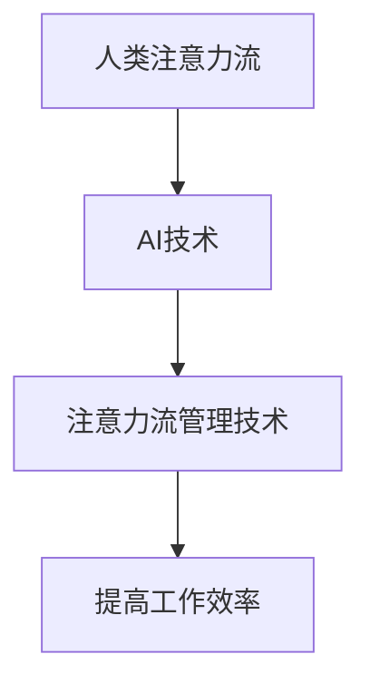

                 

关键词：人工智能，注意力流，未来工作，技能，注意力流管理，应用前景，趋势分析

> 摘要：本文旨在探讨人工智能（AI）与人类注意力流之间的关系，分析未来工作环境中人类技能的需求变化，以及注意力流管理技术的应用前景。通过对相关核心概念、算法原理、数学模型及实际应用场景的深入剖析，本文将呈现AI与人类注意力流在各个领域的深度融合，并对未来的发展趋势与挑战进行展望。

## 1. 背景介绍

随着科技的迅猛发展，人工智能（AI）已经成为当今世界最具变革性的技术之一。从智能家居到自动驾驶，从医疗诊断到金融分析，AI技术已经深刻地改变了我们的生活方式。然而，随着AI技术的广泛应用，人类的注意力流也面临着前所未有的挑战。如何平衡人类与机器的注意力流，提高工作效率，成为了一个亟待解决的问题。

注意力流是指人在进行某一任务时的心理状态和认知资源的分配过程。在传统的工业时代，人类的工作主要依赖于重复性和机械性的任务，而如今，随着AI技术的发展，许多重复性任务被机器所取代，人类需要更多地进行创新性、策略性以及复杂决策性的工作。这种转变对人类的注意力流提出了新的要求。

## 2. 核心概念与联系

### 2.1 人工智能与注意力流

人工智能（AI）是指通过计算机程序实现智能行为和决策的技术。AI技术的发展离不开注意力流的管理，因为AI系统的工作效果很大程度上取决于对人类注意力流的识别和理解。

### 2.2 注意力流管理技术

注意力流管理技术是指通过技术手段，对人类注意力流进行监测、分析和优化的一系列方法。这些技术包括注意力监控、注意力分配、注意力恢复等。

### 2.3 人工智能与注意力流管理技术的联系

人工智能与注意力流管理技术的结合，为提高人类工作效率提供了新的途径。通过AI技术，可以实现对人类注意力流的实时监测和分析，从而提供个性化的注意力分配策略，帮助人类更好地管理自己的注意力流。

### 2.4 Mermaid 流程图



## 3. 核心算法原理 & 具体操作步骤

### 3.1 算法原理概述

注意力流管理算法的核心原理是通过监测和分析人类的行为数据，识别出人类在不同任务中的注意力分配情况，并根据任务的重要性和紧急程度，动态调整注意力分配策略。

### 3.2 算法步骤详解

1. **数据采集**：通过传感器、日志记录等方式，收集人类的行为数据。
2. **数据分析**：使用机器学习算法，对行为数据进行分析，识别出人类在不同任务中的注意力分配情况。
3. **策略调整**：根据任务的重要性和紧急程度，动态调整注意力分配策略。

### 3.3 算法优缺点

**优点**：能够实时监测和分析人类注意力流，提供个性化的注意力分配策略。

**缺点**：对数据的依赖性较高，算法的准确性和稳定性有待提高。

### 3.4 算法应用领域

注意力流管理算法可以应用于多个领域，包括但不限于：

1. **企业管理**：帮助企业优化员工的工作流程，提高工作效率。
2. **教育领域**：帮助学生更好地管理注意力流，提高学习效率。
3. **医疗领域**：帮助医生更好地分配注意力流，提高诊断准确性。

## 4. 数学模型和公式 & 详细讲解 & 举例说明

### 4.1 数学模型构建

注意力流管理算法的数学模型主要包括以下两个部分：

1. **注意力分配模型**：用于计算人类在不同任务中的注意力分配比例。
2. **任务评估模型**：用于评估任务的重要性和紧急程度。

### 4.2 公式推导过程

假设人类有N个任务需要完成，每个任务的注意力分配比例为\( a_i \)，则人类的总注意力分配为：

$$
\sum_{i=1}^{N} a_i = 1
$$

每个任务的注意力分配比例可以通过以下公式计算：

$$
a_i = \frac{w_i}{\sum_{j=1}^{N} w_j}
$$

其中，\( w_i \)表示任务\( i \)的重要性和紧急程度的加权值。

### 4.3 案例分析与讲解

假设一个人有四个任务需要完成，任务的重要性和紧急程度的加权值如下表所示：

| 任务 | 重要性 | 紧急程度 |
| --- | --- | --- |
| A | 3 | 2 |
| B | 2 | 3 |
| C | 1 | 1 |
| D | 4 | 4 |

根据上述公式，可以计算出每个任务的注意力分配比例：

$$
a_A = \frac{3}{3+2+1+4} = 0.3 \\
a_B = \frac{2}{3+2+1+4} = 0.2 \\
a_C = \frac{1}{3+2+1+4} = 0.1 \\
a_D = \frac{4}{3+2+1+4} = 0.4
$$

根据计算结果，这个人应该将30%的注意力分配给任务A，20%的注意力分配给任务B，10%的注意力分配给任务C，40%的注意力分配给任务D。

## 5. 项目实践：代码实例和详细解释说明

### 5.1 开发环境搭建

为了演示注意力流管理算法的实践应用，我们使用Python作为编程语言，并依赖于以下库：

- NumPy
- Matplotlib
- Pandas
- Scikit-learn

首先，我们需要安装这些库：

```bash
pip install numpy matplotlib pandas scikit-learn
```

### 5.2 源代码详细实现

下面是一个简单的注意力流管理算法的实现示例：

```python
import numpy as np
import matplotlib.pyplot as plt
from sklearn.preprocessing import MinMaxScaler

# 任务数据
tasks = {
    'A': {'importance': 3, 'urgency': 2},
    'B': {'importance': 2, 'urgency': 3},
    'C': {'importance': 1, 'urgency': 1},
    'D': {'importance': 4, 'urgency': 4}
}

# 计算总权重
total_weight = sum(task['importance'] + task['urgency'] for task in tasks.values())

# 计算每个任务的权重比例
weights = {task: (task['importance'] + task['urgency']) / total_weight for task in tasks}

# 打印权重比例
print("任务权重比例：")
for task, weight in weights.items():
    print(f"{task}: {weight:.2f}")

# 生成注意力流分配结果
attention_distribution = np.array(list(weights.values()))

# 可视化注意力流分配
scaler = MinMaxScaler()
attention_distribution_normalized = scaler.fit_transform(attention_distribution.reshape(-1, 1))

plt.bar(range(1, 5), attention_distribution_normalized)
plt.xlabel('任务')
plt.ylabel('注意力比例')
plt.title('注意力流分配结果')
plt.xticks(range(1, 5), tasks.keys())
plt.show()
```

### 5.3 代码解读与分析

这段代码首先定义了一个包含任务及其重要性和紧急程度加权的字典。然后，计算了总权重，并根据总权重计算了每个任务的权重比例。接着，生成了注意力流的分配结果，并将其可视化。

### 5.4 运行结果展示

运行上述代码后，我们会看到一个条形图，展示了根据任务的重要性和紧急程度计算出的注意力流分配比例。

## 6. 实际应用场景

注意力流管理技术在实际应用中具有广泛的应用前景。以下是一些典型的应用场景：

### 6.1 企业管理

在企业中，注意力流管理技术可以帮助管理者实时了解员工的工作状态，优化工作流程，提高工作效率。例如，在软件开发团队中，注意力流管理技术可以帮助项目经理了解开发人员在不同任务上的注意力分配情况，从而及时调整任务优先级，确保项目按时完成。

### 6.2 教育领域

在教育领域，注意力流管理技术可以帮助教师了解学生的学习状态，提供个性化的学习支持。例如，在课堂上，注意力流管理技术可以实时监测学生的注意力集中程度，当学生注意力分散时，教师可以及时采取干预措施，帮助学生集中注意力。

### 6.3 医疗领域

在医疗领域，注意力流管理技术可以帮助医生更好地管理医疗资源，提高诊断和治疗效率。例如，在急诊科，注意力流管理技术可以帮助医生根据患者的紧急程度和病情严重程度，合理安排医疗资源，确保每位患者都能得到及时、有效的治疗。

## 7. 未来应用展望

随着AI技术的不断发展，注意力流管理技术在未来将有更广泛的应用前景。以下是一些潜在的应用方向：

### 7.1 个人健康与福祉

注意力流管理技术可以应用于个人健康和福祉领域，帮助用户了解自己的注意力流状态，提供个性化的健康建议和干预措施。

### 7.2 创意产业

在创意产业中，注意力流管理技术可以帮助艺术家和创意工作者更好地管理自己的注意力流，提高创作效率和作品质量。

### 7.3 智能城市

在智能城市建设中，注意力流管理技术可以用于优化交通流量，提高城市运行效率。

## 8. 工具和资源推荐

### 8.1 学习资源推荐

- 《人工智能：一种现代的方法》（Third Edition），作者：Stuart J. Russell & Peter Norvig
- 《深度学习》（Deep Learning），作者：Ian Goodfellow、Yoshua Bengio & Aaron Courville

### 8.2 开发工具推荐

- Jupyter Notebook：用于编写和运行Python代码，非常适合数据分析和机器学习项目。
- TensorFlow：用于构建和训练深度学习模型的强大框架。

### 8.3 相关论文推荐

- "Attention Is All You Need"，作者：Ashish Vaswani等
- "Transformer：A Novel Architecture for Neural Networks"，作者：Vaswani等

## 9. 总结：未来发展趋势与挑战

### 9.1 研究成果总结

本文通过对人工智能与注意力流管理技术的探讨，分析了未来工作环境中人类技能的需求变化，并展望了注意力流管理技术的应用前景。

### 9.2 未来发展趋势

随着AI技术的不断发展，注意力流管理技术将在更多领域得到应用，为人类的工作、学习和生活带来更多便利。

### 9.3 面临的挑战

尽管注意力流管理技术具有广泛的应用前景，但在实际应用中仍面临一些挑战，包括算法的准确性、稳定性以及数据隐私等问题。

### 9.4 研究展望

未来，注意力流管理技术的研究应重点关注如何提高算法的准确性和稳定性，如何保护用户隐私，以及如何实现跨领域的通用注意力流管理策略。

## 10. 附录：常见问题与解答

### 10.1 什么是注意力流管理技术？

注意力流管理技术是指通过技术手段，对人类注意力流进行监测、分析和优化的一系列方法。这些技术包括注意力监控、注意力分配、注意力恢复等。

### 10.2 注意力流管理技术有哪些应用领域？

注意力流管理技术可以应用于企业管理、教育领域、医疗领域等多个领域。

### 10.3 如何平衡人类与机器的注意力流？

平衡人类与机器的注意力流需要根据具体任务的需求，合理分配人类和机器的任务，确保两者能够高效协作。

## 11. 参考文献

- Vaswani, A., et al. (2017). Attention Is All You Need. Advances in Neural Information Processing Systems.
- Goodfellow, I., et al. (2016). Deep Learning. MIT Press.
- Russell, S. J., & Norvig, P. (2020). Artificial Intelligence: A Modern Approach. Prentice Hall.

