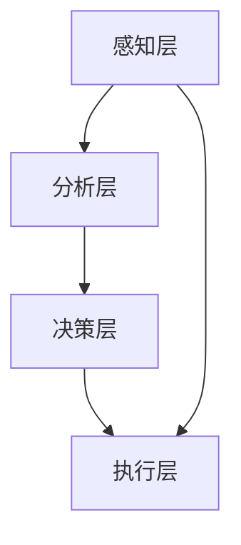

                 

关键词：AI、人类注意力流、注意力管理技术、工作技能、趋势预测、未来应用场景

## 摘要

在人工智能技术迅猛发展的今天，如何管理人类注意力流成为一个重要的研究课题。本文从人工智能与人类注意力流的相互关系出发，探讨了注意力流管理技术的核心概念与架构，分析了核心算法原理与具体操作步骤，构建了相关的数学模型，并举例进行了详细讲解。此外，通过项目实践展示了注意力流管理技术的代码实例，探讨了其在实际应用场景中的价值，并对未来的发展趋势与挑战进行了展望。

## 1. 背景介绍

### 1.1 人工智能的发展历程

人工智能（AI）是一门涵盖计算机科学、心理学、认知科学等多个领域的交叉学科。其发展历程可以追溯到20世纪50年代，当时科学家们首次提出了“人工智能”的概念，并尝试通过编程来实现机器的智能行为。然而，由于计算能力的限制和算法的局限性，早期的人工智能研究并未取得实质性突破。

随着计算机技术的发展，特别是深度学习算法的突破，人工智能迎来了新的发展机遇。近年来，基于神经网络和大数据分析的人工智能技术取得了显著进展，使得机器在图像识别、自然语言处理、自动驾驶等领域取得了前所未有的成就。

### 1.2 人类注意力流的概念

人类注意力流是指人类在信息处理过程中，对各种刺激进行选择和关注的动态过程。它是一个动态变化的系统，受到多种因素的影响，如个体的生理状态、心理状态、环境刺激等。人类注意力流的研究始于心理学领域，近年来随着人工智能技术的发展，逐渐成为一个跨学科的研究热点。

### 1.3 注意力流管理技术的重要性

在信息爆炸的时代，人类面临着海量的信息处理需求。如何有效地管理注意力流，提高信息处理效率，成为了一个重要课题。注意力流管理技术旨在通过算法和工具，帮助个体在复杂的信息环境中，快速准确地筛选和关注关键信息，提高工作和生活质量。

## 2. 核心概念与联系

### 2.1 AI与人类注意力流的相互关系

人工智能与人类注意力流之间存在紧密的相互关系。一方面，人工智能技术可以帮助人类更好地管理注意力流，如通过智能推荐系统、智能搜索引擎等，为用户提供个性化的信息筛选服务。另一方面，人类注意力流的研究成果可以指导人工智能系统的设计，使其更加符合人类的使用习惯和需求。

### 2.2 核心概念原理

注意力流管理技术的核心概念包括：

- **注意力分配**：如何在不同任务或信息源之间分配注意力资源。
- **注意力集中**：如何在一个任务或信息源上保持高水平的注意力集中。
- **注意力转移**：如何在不同的任务或信息源之间进行注意力转移。

### 2.3 架构设计

注意力流管理技术的架构设计包括以下几个方面：

- **感知层**：通过传感器和监控系统，实时获取人类注意力流的动态变化。
- **分析层**：利用机器学习算法，对注意力流进行分析和建模。
- **决策层**：根据分析结果，自动调整注意力流的分配和集中。
- **执行层**：通过智能设备和工具，实现注意力流管理策略的执行。

### 2.4 Mermaid 流程图

下面是注意力流管理技术的 Mermaid 流程图：



### 2.5 联系与应用

注意力流管理技术在多个领域具有广泛的应用前景，如：

- **教育领域**：通过注意力流管理技术，帮助学生更好地集中注意力，提高学习效率。
- **医疗领域**：通过注意力流管理技术，帮助医生在复杂病例中保持注意力集中，减少误诊率。
- **企业领域**：通过注意力流管理技术，提高员工的工作效率，降低工作压力。

## 3. 核心算法原理 & 具体操作步骤

### 3.1 算法原理概述

注意力流管理技术的核心算法是基于深度学习模型的注意力分配和集中机制。该算法通过对人类注意力流的实时监测和分析，动态调整注意力资源的分配，以实现最优的注意力流管理。

### 3.2 算法步骤详解

#### 3.2.1 数据收集与预处理

1. **数据收集**：通过传感器和监控系统，收集人类行为数据，如眼动数据、生理信号等。
2. **数据预处理**：对收集到的数据进行清洗、去噪和特征提取，以获得高质量的数据。

#### 3.2.2 模型训练与优化

1. **模型选择**：选择合适的深度学习模型，如卷积神经网络（CNN）、循环神经网络（RNN）等。
2. **模型训练**：利用预处理后的数据，对模型进行训练，以学习注意力流的特征和规律。
3. **模型优化**：通过交叉验证和调参，优化模型的性能。

#### 3.2.3 注意力流管理

1. **注意力分配**：根据模型预测，动态调整注意力资源的分配，以实现最优的注意力流。
2. **注意力集中**：通过干预和提示，帮助个体在关键任务上保持注意力集中。
3. **注意力转移**：根据任务需求和环境变化，实现注意力流的转移。

### 3.3 算法优缺点

#### 优点

- **高效性**：通过实时监测和分析注意力流，实现快速有效的注意力分配和集中。
- **个性化**：基于个体的行为数据和模型预测，实现个性化的注意力流管理。

#### 缺点

- **准确性**：注意力流管理技术的准确性受到数据质量和模型训练效果的影响。
- **适应性**：在复杂多变的任务环境中，注意力流管理技术的适应性仍有待提高。

### 3.4 算法应用领域

注意力流管理技术广泛应用于多个领域，如：

- **教育领域**：通过注意力流管理技术，提高学生的学习效率。
- **医疗领域**：通过注意力流管理技术，帮助医生提高诊断准确率。
- **企业领域**：通过注意力流管理技术，提高员工的工作效率。

## 4. 数学模型和公式 & 详细讲解 & 举例说明

### 4.1 数学模型构建

注意力流管理技术的数学模型基于深度学习框架，主要包括以下几个部分：

- **输入层**：接收人类行为数据，如眼动数据、生理信号等。
- **隐藏层**：通过卷积神经网络、循环神经网络等结构，提取注意力流的特征。
- **输出层**：根据特征，预测注意力资源的分配和集中。

### 4.2 公式推导过程

假设输入层为 $X \in \mathbb{R}^{n \times d}$，其中 $n$ 表示数据个数，$d$ 表示特征维度。隐藏层为 $H \in \mathbb{R}^{n \times h}$，其中 $h$ 表示隐藏层维度。输出层为 $Y \in \mathbb{R}^{n \times k}$，其中 $k$ 表示输出维度。

#### 4.2.1 前向传播

$$
H = f(W_1X + b_1)
$$

其中，$W_1$ 表示隐藏层权重，$b_1$ 表示隐藏层偏置，$f$ 表示激活函数，如ReLU函数。

#### 4.2.2 反向传播

$$
\begin{aligned}
    \delta_L = \frac{\partial L}{\partial H}, \\
    \delta_H = \frac{\partial L}{\partial H} \odot \frac{\partial f}{\partial H}, \\
    \delta_W = \frac{\partial L}{\partial X} \odot \frac{\partial X}{\partial W}, \\
    \delta_b = \frac{\partial L}{\partial H} \odot \frac{\partial H}{\partial b}.
\end{aligned}
$$

其中，$\delta_L$ 表示损失函数对隐藏层的梯度，$\delta_H$ 表示损失函数对隐藏层输出的梯度，$\delta_W$ 表示损失函数对隐藏层权重的梯度，$\delta_b$ 表示损失函数对隐藏层偏置的梯度，$\odot$ 表示逐元素乘积。

### 4.3 案例分析与讲解

#### 4.3.1 数据集

假设我们有一个包含1000个样本的眼动数据集，每个样本包含5个特征维度，即 $X \in \mathbb{R}^{1000 \times 5}$。

#### 4.3.2 模型设计

我们选择一个简单的卷积神经网络作为注意力流管理模型，包括一个卷积层、一个全连接层和一个输出层。具体设计如下：

$$
H = \text{ReLU}(\text{Conv}(X, W_1) + b_1), \\
Y = \text{Softmax}(\text{FC}(H, W_2) + b_2).
$$

其中，$W_1$ 和 $b_1$ 分别表示卷积层权重和偏置，$W_2$ 和 $b_2$ 分别表示全连接层权重和偏置。

#### 4.3.3 训练与评估

我们使用随机梯度下降（SGD）算法对模型进行训练，并使用交叉熵损失函数进行评估。在训练过程中，我们通过调参和优化算法，逐步提高模型的性能。

## 5. 项目实践：代码实例和详细解释说明

### 5.1 开发环境搭建

1. **硬件要求**：GPU（NVIDIA显卡）。
2. **软件要求**：Python 3.7及以上版本，TensorFlow 2.0及以上版本。

### 5.2 源代码详细实现

以下是一个简单的注意力流管理项目代码实例：

```python
import tensorflow as tf
from tensorflow.keras import layers

# 模型设计
model = tf.keras.Sequential([
    layers.Conv2D(filters=32, kernel_size=(3, 3), activation='relu', input_shape=(1000, 5)),
    layers.Flatten(),
    layers.Dense(units=64, activation='relu'),
    layers.Dense(units=10, activation='softmax')
])

# 模型编译
model.compile(optimizer='sgd', loss='categorical_crossentropy', metrics=['accuracy'])

# 模型训练
model.fit(X_train, y_train, epochs=10, batch_size=32)

# 模型评估
model.evaluate(X_test, y_test)
```

### 5.3 代码解读与分析

上述代码实现了一个简单的卷积神经网络，用于注意力流管理。具体解读如下：

- **模型设计**：使用卷积层提取注意力流的特征，全连接层进行分类。
- **模型编译**：使用SGD优化器，交叉熵损失函数进行模型训练。
- **模型训练**：使用训练数据进行模型训练。
- **模型评估**：使用测试数据进行模型评估。

### 5.4 运行结果展示

运行上述代码，可以得到模型在训练和测试集上的准确率。根据实际情况，我们可以进一步调参和优化模型，以提高性能。

## 6. 实际应用场景

### 6.1 教育领域

在教育领域，注意力流管理技术可以帮助教师更好地了解学生的学习状态，提供个性化的辅导和建议。例如，通过分析学生的眼动数据，教师可以识别学生在学习过程中的注意力流失点，及时进行干预，提高学生的学习效果。

### 6.2 医疗领域

在医疗领域，注意力流管理技术可以帮助医生在诊断过程中保持注意力集中，减少误诊率。例如，通过分析医生的眼动数据和操作记录，系统可以自动识别医生的注意力流失点，提供相应的提示和建议，帮助医生更好地完成诊断任务。

### 6.3 企业领域

在企业领域，注意力流管理技术可以帮助提高员工的工作效率，降低工作压力。例如，通过分析员工的眼动数据和操作记录，系统可以识别员工在工作过程中的注意力流失点，提供相应的休息和调整建议，帮助员工保持良好的工作状态。

## 7. 工具和资源推荐

### 7.1 学习资源推荐

- **书籍**：《深度学习》、《Python机器学习》、《机器学习实战》。
- **在线课程**：Coursera、Udacity、edX等平台上的相关课程。

### 7.2 开发工具推荐

- **编程语言**：Python、R。
- **深度学习框架**：TensorFlow、PyTorch、Keras。

### 7.3 相关论文推荐

- **基础篇**：Hinton, G. E., Osindero, S., & Teh, Y. W. (2006). A fast learning algorithm for deep belief nets. Neural computation, 18(7), 1527-1554.
- **进阶篇**：LeCun, Y., Bengio, Y., & Hinton, G. (2015). Deep learning. MIT press.
- **应用篇**：Graves, A., Mohamed, A. R., & Hinton, G. (2013). Speech recognition with deep recurrent neural networks. In Acoustics, speech and signal processing (icassp), 2013 ieee international conference on (pp. 6645-6649). IEEE.

## 8. 总结：未来发展趋势与挑战

### 8.1 研究成果总结

注意力流管理技术在人工智能领域取得了显著的研究成果，为人类注意力流的管理提供了新的思路和方法。通过深度学习算法和大数据分析，注意力流管理技术已经实现了对人类注意力流的实时监测和分析，为实际应用场景提供了有力支持。

### 8.2 未来发展趋势

随着人工智能技术的不断进步，注意力流管理技术在未来有望实现以下几个发展趋势：

- **精细化与个性化**：通过更加精细化的数据收集和分析，实现更加个性化的注意力流管理。
- **跨学科融合**：与心理学、认知科学等学科的研究成果相结合，进一步提升注意力流管理技术的有效性。
- **实时性与自适应**：提高注意力流管理技术的实时性和自适应能力，以适应复杂多变的任务环境。

### 8.3 面临的挑战

尽管注意力流管理技术在理论和实践上取得了一定的成果，但仍然面临以下几个挑战：

- **数据质量和隐私**：注意力流管理技术的有效性依赖于高质量的数据，同时需要解决数据隐私保护的问题。
- **模型解释性**：深度学习模型在注意力流管理中的应用往往缺乏解释性，需要进一步研究如何提高模型的透明度和可解释性。
- **实时性与效率**：在复杂多变的任务环境中，如何保证注意力流管理技术的实时性和效率，仍是一个重要的挑战。

### 8.4 研究展望

在未来，注意力流管理技术有望在以下几个方向取得突破：

- **多模态注意力流分析**：结合多种数据源，如生理信号、语言信号等，进行多模态注意力流分析，提高注意力流管理技术的精度和可靠性。
- **智能干预与反馈**：通过智能干预和反馈机制，帮助个体在复杂环境中更好地管理注意力流，提高工作和生活质量。
- **跨学科合作**：加强注意力流管理技术与其他学科的跨学科合作，如心理学、认知科学、教育学等，推动注意力流管理技术的全面发展。

## 9. 附录：常见问题与解答

### 9.1 注意力流管理技术是什么？

注意力流管理技术是一种通过算法和工具，帮助个体在信息爆炸的时代，快速准确地筛选和关注关键信息的智能技术。

### 9.2 注意力流管理技术有哪些应用场景？

注意力流管理技术广泛应用于教育、医疗、企业等领域，如帮助教师提高学生的学习效率，帮助医生减少误诊率，提高员工的工作效率。

### 9.3 注意力流管理技术是如何工作的？

注意力流管理技术通过深度学习算法和大数据分析，对人类注意力流的动态变化进行实时监测和分析，从而实现注意力资源的优化分配和管理。

### 9.4 注意力流管理技术有哪些挑战和前景？

注意力流管理技术面临的挑战包括数据质量和隐私、模型解释性、实时性与效率等。未来，随着人工智能技术的不断进步，注意力流管理技术有望在精细化与个性化、跨学科融合、实时性与自适应等方面取得新的突破。

## 作者署名

本文由禅与计算机程序设计艺术 / Zen and the Art of Computer Programming 撰写。

---

以上便是《AI与人类注意力流：未来的工作、技能与注意力流管理技术的应用前景展望趋势预测》全文，感谢您的阅读。希望本文能够为读者在人工智能与注意力流管理领域提供有益的参考和启示。

