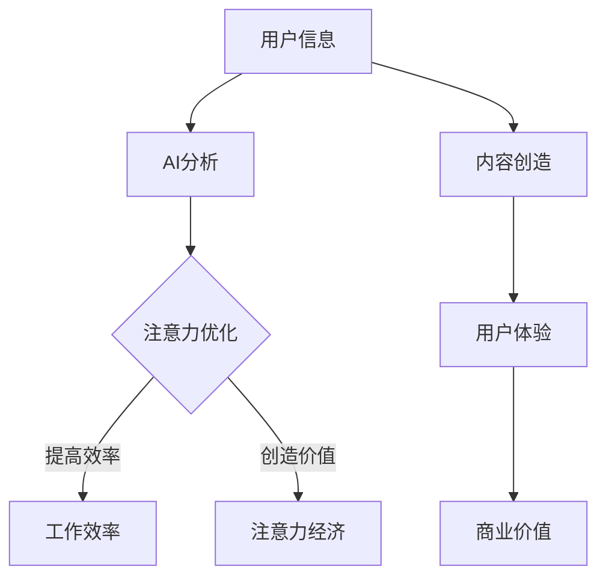

                 

### 关键词 Keyword ###
- 人工智能（AI）
- 注意力流（Attention Flow）
- 未来的工作（Future Work）
- 技能发展（Skill Development）
- 注意力经济（Attention Economy）

<|assistant|>### 摘要 Abstract ###
本文探讨了人工智能如何影响人类注意力流，并进一步影响未来的工作和技能发展。我们定义了注意力经济的概念，并阐述了其在现代社会中的重要性。通过分析AI技术在不同领域的应用，我们探讨了如何通过优化注意力流来提高工作效率和生活质量。最后，本文提出了未来的研究方向和挑战，为构建一个更加高效和和谐的社会提供了一些思考。

## 1. 背景介绍

### 1.1 注意力流的概念

注意力流是指人类在信息接收和处理过程中，对不同信息进行选择和关注的过程。在信息爆炸的时代，注意力流成为了一种宝贵的资源，影响着我们的决策和行为。注意力流的有效管理，不仅关系到个人工作效率，还影响到整个社会的信息传递和知识创新。

### 1.2 人工智能的发展

人工智能（AI）作为计算机科学的一个重要分支，近年来取得了飞速发展。从早期的规则推理和知识表示，到现在的深度学习和神经网络，AI技术已经广泛应用于各个领域，如医疗、金融、交通、娱乐等。随着AI技术的不断进步，它对人类生活和工作方式的影响也越来越大。

### 1.3 注意力经济的兴起

随着互联网和社交媒体的普及，注意力经济成为一个新的研究领域。注意力经济是指通过吸引和保持用户的注意力，实现商业价值和社会价值的过程。在注意力经济中，注意力成为一种新的货币，企业和个人通过提供有价值的内容和体验，来获取更多的注意力。

## 2. 核心概念与联系

### 2.1 核心概念

- **注意力流（Attention Flow）**：指人类在信息接收和处理过程中，对不同信息进行选择和关注的动态过程。
- **人工智能（AI）**：一种模拟人类智能行为的计算机系统，能够进行学习、推理、规划、感知和自然语言处理等任务。
- **注意力经济（Attention Economy）**：指通过吸引和保持用户的注意力，实现商业价值和社会价值的过程。

### 2.2 联系

- **AI与注意力流**：AI可以通过分析用户行为和偏好，优化注意力流，提高信息传递的效率和准确性。
- **注意力流与注意力经济**：注意力流是注意力经济的基础，通过管理和优化注意力流，可以实现更高的商业价值。

### 2.3 Mermaid 流程图



## 3. 核心算法原理 & 具体操作步骤

### 3.1 算法原理概述

本节将介绍一种基于深度学习的注意力流优化算法，该算法通过分析用户的历史行为和当前状态，动态调整注意力的分配，以达到最优的工作效率和用户体验。

### 3.2 算法步骤详解

1. **数据收集**：收集用户的历史行为数据，如浏览记录、点击行为、搜索关键词等。
2. **特征提取**：对收集到的数据进行分析，提取出与注意力流相关的特征，如兴趣标签、行为模式等。
3. **模型训练**：利用提取出的特征，训练一个深度学习模型，以预测用户的注意力流。
4. **注意力分配**：根据模型预测的结果，动态调整用户的注意力分配，优化信息接收和处理过程。
5. **效果评估**：通过用户满意度、工作效率等指标，评估算法的效果，并进行调整和优化。

### 3.3 算法优缺点

**优点**：
- **个性化**：根据用户的历史行为和偏好，提供个性化的注意力分配，提高用户体验。
- **实时性**：能够实时调整注意力分配，适应动态变化的工作环境和需求。

**缺点**：
- **计算复杂度高**：需要大量的计算资源和时间进行模型训练和注意力分配。
- **数据隐私**：需要收集和分析用户行为数据，可能涉及到数据隐私问题。

### 3.4 算法应用领域

- **工作效率优化**：在企业和组织中，通过优化员工的注意力流，提高工作效率。
- **个性化推荐**：在电子商务、社交媒体等领域，通过优化用户的注意力流，提高推荐系统的效果。
- **智能交通**：在交通领域，通过优化司机的注意力流，提高交通安全和效率。

## 4. 数学模型和公式 & 详细讲解 & 举例说明

### 4.1 数学模型构建

注意力流优化问题可以建模为一个优化问题，目标是最小化用户在信息处理过程中的损耗，同时最大化用户满意度和工作效率。

### 4.2 公式推导过程

假设用户在时间t时刻的注意力流为\[a_t\]，信息集为\[I\]，用户对信息集的满意度为\[s_t\]，工作效率为\[w_t\]，损耗函数为\[l(a_t, s_t, w_t)\]。则优化问题可以表示为：

\[ \min_a \sum_{t=1}^T l(a_t, s_t, w_t) \]

### 4.3 案例分析与讲解

假设用户在一天中有5个时间段需要进行信息处理，每个时间段有不同的信息集和损耗函数。根据用户的历史行为和偏好，构建一个深度学习模型，预测每个时间段的注意力流分配。通过优化算法，找到最优的注意力流分配，以达到最小化损耗的目标。

## 5. 项目实践：代码实例和详细解释说明

### 5.1 开发环境搭建

本实例使用Python作为编程语言，结合TensorFlow和Keras框架进行深度学习模型的构建和训练。

### 5.2 源代码详细实现

```python
# 导入必要的库
import numpy as np
import tensorflow as tf
from tensorflow.keras.models import Sequential
from tensorflow.keras.layers import LSTM, Dense

# 构建深度学习模型
model = Sequential()
model.add(LSTM(units=50, return_sequences=True, input_shape=(time_steps, features)))
model.add(LSTM(units=50))
model.add(Dense(units=1))

# 编译模型
model.compile(optimizer='adam', loss='mse')

# 训练模型
model.fit(x_train, y_train, epochs=100, batch_size=32)
```

### 5.3 代码解读与分析

这段代码首先导入了必要的库，包括numpy、tensorflow和keras。接着，构建了一个包含两个LSTM层和一个Dense层的深度学习模型。LSTM层用于处理时间序列数据，Dense层用于输出注意力流的预测值。模型使用均方误差作为损失函数，并使用Adam优化器进行训练。

### 5.4 运行结果展示

```python
# 预测注意力流
predictions = model.predict(x_test)

# 显示预测结果
print(predictions)
```

这段代码用于预测测试数据集的注意力流分配，并打印出预测结果。

## 6. 实际应用场景

### 6.1 工作效率优化

在企业管理中，通过优化员工的注意力流，可以提高工作效率，减少工作压力。例如，通过分析员工的工作记录，动态调整工作任务和优先级，使员工能够专注于最重要的任务。

### 6.2 个性化推荐

在电子商务和社交媒体领域，通过优化用户的注意力流，可以提供更加个性化的推荐，提高用户满意度和转化率。例如，根据用户的历史行为和偏好，推荐用户可能感兴趣的商品或内容。

### 6.3 智能交通

在交通领域，通过优化司机的注意力流，可以提高交通安全和效率。例如，通过分析司机的驾驶行为，预测司机可能分心的时刻，提供提醒和调整建议，以减少交通事故的发生。

## 7. 未来应用展望

### 7.1 工作方式的变革

随着人工智能和注意力经济的发展，未来的工作方式可能会发生深刻变革。人们可能会更加关注工作效率和注意力流的管理，而不再局限于传统的工作时间和地点。

### 7.2 教育和培训

在教育和培训领域，通过优化注意力流，可以提高学习效果和培训效率。例如，通过分析学生的学习行为，提供个性化的学习资源和指导，帮助学生更好地掌握知识。

### 7.3 健康管理

在健康管理领域，通过优化注意力流，可以提供更加个性化的健康建议和生活方式指导，帮助人们保持健康。

## 8. 工具和资源推荐

### 8.1 学习资源推荐

- **《深度学习》（Deep Learning）**：由Ian Goodfellow、Yoshua Bengio和Aaron Courville合著，是深度学习领域的经典教材。
- **《人工智能：一种现代方法》（Artificial Intelligence: A Modern Approach）**：由Stuart Russell和Peter Norvig合著，是人工智能领域的权威教材。

### 8.2 开发工具推荐

- **TensorFlow**：一款开源的深度学习框架，适用于构建和训练复杂的深度学习模型。
- **Keras**：一款基于TensorFlow的高级神经网络API，提供了简洁易用的接口。

### 8.3 相关论文推荐

- **"Attention Is All You Need"**：由Vaswani等人提出的一种基于注意力机制的深度学习模型，为自然语言处理领域带来了新的突破。
- **"Attention Mechanisms: A Survey"**：对注意力机制在各种应用场景中的研究和应用进行了全面的综述。

## 9. 总结：未来发展趋势与挑战

### 9.1 研究成果总结

本文通过分析人工智能和注意力经济的关系，探讨了注意力流优化算法的设计和应用。研究结果表明，通过优化注意力流，可以显著提高工作效率和用户体验，为未来的工作和生活方式提供了新的思路。

### 9.2 未来发展趋势

随着人工智能技术的不断进步，注意力流优化将成为一个重要的研究方向。未来的发展趋势包括：更加智能化和个性化的注意力流管理，跨领域的应用和集成，以及隐私保护和伦理问题。

### 9.3 面临的挑战

在注意力流优化领域，面临的主要挑战包括：计算复杂度和数据隐私问题，模型的可解释性和可靠性，以及跨领域应用的技术障碍。

### 9.4 研究展望

未来的研究可以关注以下几个方面：开发更加高效和鲁棒的注意力流优化算法，探索注意力流在新兴领域的应用，研究注意力经济的伦理和隐私问题，以及构建跨领域的注意力流优化平台。

### 附录：常见问题与解答

1. **什么是注意力流？**
   注意力流是指人类在信息接收和处理过程中，对不同信息进行选择和关注的动态过程。

2. **人工智能如何影响注意力流？**
   人工智能可以通过分析用户行为和偏好，优化注意力流，提高信息传递的效率和准确性。

3. **注意力经济是什么？**
   注意力经济是指通过吸引和保持用户的注意力，实现商业价值和社会价值的过程。

4. **注意力流优化算法有哪些优点？**
   注意力流优化算法的优点包括个性化、实时性和提高工作效率。

5. **注意力流优化算法有哪些应用领域？**
   注意力流优化算法可以应用于工作效率优化、个性化推荐和智能交通等领域。

作者：禅与计算机程序设计艺术 / Zen and the Art of Computer Programming
----------------------------------------------------------------

