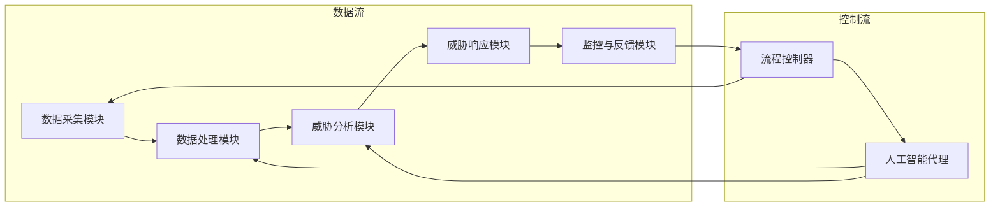

                 

关键词：AI人工智能，代理工作流，网络安全，工作流管理，攻击检测，威胁响应

> 摘要：本文探讨了AI人工智能代理工作流（AI Agent WorkFlow）在网络安全领域的关键作用。通过构建一个高效的代理工作流系统，本文提出了一个创新的方法来提高网络安全的防御能力，包括攻击检测、威胁响应和风险管理等关键环节。文章详细分析了代理工作流的基本概念、核心算法原理、数学模型、实际应用场景以及未来发展趋势。

## 1. 背景介绍

随着互联网的普及和业务系统的日益复杂，网络安全问题变得越来越突出。网络攻击的手段和类型也在不断演变，传统的安全防护措施已经无法满足现代网络环境的需求。在这种背景下，人工智能（AI）技术的应用成为网络安全领域的一个热点。AI人工智能代理工作流（AI Agent WorkFlow）作为一种新兴的安全技术，通过将人工智能与网络安全工作流相结合，实现了对网络攻击的自动化检测和响应，提高了网络安全防护的整体效能。

### 1.1 网络安全现状

网络安全问题已经成为全球性的挑战，网络攻击的频率和规模都在不断增长。根据相关报告，网络攻击的类型包括但不限于分布式拒绝服务攻击（DDoS）、恶意软件传播、钓鱼攻击、数据泄露等。这些攻击不仅对个人和企业造成了巨大的经济损失，还可能威胁到国家安全和社会稳定。

### 1.2 人工智能在网络安全中的应用

人工智能技术在网络安全中的应用主要体现在以下几个方面：

1. **威胁情报分析**：通过大数据分析和机器学习算法，从海量的网络数据中提取威胁情报，实现实时监测和预警。
2. **攻击检测与防御**：利用深度学习和强化学习等算法，自动化检测和阻止网络攻击。
3. **安全事件响应**：通过智能化的安全事件响应系统，自动执行应急响应操作，降低攻击造成的影响。
4. **安全合规管理**：利用人工智能技术，自动评估和验证网络安全合规性。

### 1.3 代理工作流在网络安全中的作用

代理工作流是一种基于代理机制的自动化工作流程管理技术，它通过定义一系列步骤和规则，实现任务的自动分配、执行和监控。在网络安全领域，代理工作流可以帮助：

1. **提高安全防护的效率**：通过自动化处理安全事件，减少人工干预，提高安全事件响应速度。
2. **优化资源分配**：根据威胁级别和资源状况，动态调整安全资源的分配，确保关键资源的优先保护。
3. **加强协作能力**：将不同安全组件和系统整合到统一的工作流中，实现跨系统、跨区域的协同防御。
4. **提升用户体验**：自动化处理日常安全操作，减轻安全运维人员的负担，提高工作效率。

## 2. 核心概念与联系

### 2.1 AI人工智能代理工作流定义

AI人工智能代理工作流（AI Agent WorkFlow）是一种基于人工智能技术的自动化工作流管理技术，它通过定义一系列任务、规则和算法，实现安全事件的处理和响应。在这个工作流中，人工智能代理（AI Agent）扮演着核心角色，它们可以自主执行任务、收集数据、分析威胁、采取行动。

### 2.2 AI人工智能代理工作流架构

AI人工智能代理工作流的架构可以分为以下几个主要部分：

1. **数据采集模块**：负责收集网络流量、日志、威胁情报等数据，为后续分析提供基础。
2. **数据处理模块**：利用数据清洗、数据挖掘等技术，对采集到的数据进行处理和整合。
3. **威胁分析模块**：利用机器学习、深度学习等算法，对处理后的数据进行分析，识别潜在威胁。
4. **威胁响应模块**：根据威胁分析的结论，自动化执行防御措施，如防火墙规则调整、安全策略更新等。
5. **监控与反馈模块**：实时监控工作流执行状态，收集反馈数据，用于优化工作流。

### 2.3 核心概念原理与架构的 Mermaid 流程图



## 3. 核心算法原理 & 具体操作步骤

### 3.1 算法原理概述

AI人工智能代理工作流的核心算法主要包括机器学习算法、深度学习算法和强化学习算法。这些算法在威胁分析、威胁响应等方面发挥着重要作用。

- **机器学习算法**：通过对历史数据进行训练，建立威胁检测模型，用于实时检测网络流量中的异常行为。
- **深度学习算法**：利用神经网络模型，对复杂的数据特征进行提取和识别，提高威胁检测的准确率。
- **强化学习算法**：通过不断尝试和反馈，优化安全策略，提高威胁响应的效率和准确性。

### 3.2 算法步骤详解

#### 3.2.1 数据采集

- **数据源选择**：根据网络安全需求，选择合适的网络流量、日志、威胁情报等数据源。
- **数据采集工具**：使用网络流量分析工具（如Wireshark）、日志收集工具（如Splunk）、威胁情报平台（如Aliyun Threat Intelligence Platform）等，进行数据采集。

#### 3.2.2 数据处理

- **数据预处理**：对采集到的数据进行清洗、去噪、归一化等处理，提高数据质量。
- **特征提取**：利用特征工程方法，从原始数据中提取关键特征，用于后续分析。

#### 3.2.3 威胁分析

- **模型训练**：利用机器学习算法，对历史数据进行训练，建立威胁检测模型。
- **模型评估**：通过交叉验证等方法，评估模型的性能和准确性。
- **实时检测**：将训练好的模型应用于实时数据，检测网络流量中的潜在威胁。

#### 3.2.4 威胁响应

- **规则生成**：根据威胁检测结果，生成相应的安全策略和响应规则。
- **执行响应**：自动化执行安全策略，如防火墙规则调整、安全策略更新等。
- **反馈调整**：根据响应效果，对安全策略进行调整和优化。

### 3.3 算法优缺点

- **机器学习算法**：优点是能够处理大量数据，自适应能力强；缺点是需要大量历史数据训练，对数据质量要求较高。
- **深度学习算法**：优点是能够自动提取数据特征，提高检测准确率；缺点是计算资源需求大，训练时间较长。
- **强化学习算法**：优点是能够自适应环境变化，优化安全策略；缺点是需要大量交互数据，对环境依赖性强。

### 3.4 算法应用领域

- **攻击检测**：通过机器学习和深度学习算法，自动化检测网络流量中的异常行为，提高攻击检测的准确率和速度。
- **威胁响应**：利用强化学习算法，优化安全策略，提高威胁响应的效率和准确性。
- **风险管理**：通过大数据分析和机器学习算法，识别潜在风险，制定相应的风险控制措施。

## 4. 数学模型和公式 & 详细讲解 & 举例说明

### 4.1 数学模型构建

在AI人工智能代理工作流中，数学模型主要用于威胁检测和威胁响应。以下是两种常用的数学模型：

#### 4.1.1 贝叶斯网络模型

贝叶斯网络模型是一种概率图模型，用于表示变量之间的条件概率关系。在网络安全中，可以用于表示网络流量特征与攻击类型之间的概率关系。

**贝叶斯网络模型公式：**

\[ P(A|B) = \frac{P(B|A) \cdot P(A)}{P(B)} \]

其中，\( P(A|B) \) 表示在给定 \( B \) 的条件下， \( A \) 发生的概率；\( P(B|A) \) 表示在给定 \( A \) 的条件下， \( B \) 发生的概率；\( P(A) \) 和 \( P(B) \) 分别表示 \( A \) 和 \( B \) 的先验概率。

#### 4.1.2 强化学习模型

强化学习模型是一种基于奖励和惩罚的决策模型，用于优化安全策略。在网络安全中，可以用于动态调整防火墙规则、安全策略等。

**强化学习模型公式：**

\[ Q(s, a) = \sum_{s'} P(s'|s, a) \cdot R(s', a) + \gamma \cdot \max_{a'} Q(s', a') \]

其中，\( Q(s, a) \) 表示在状态 \( s \) 下，采取动作 \( a \) 的价值函数；\( P(s'|s, a) \) 表示在状态 \( s \) 下，采取动作 \( a \) 后转移到状态 \( s' \) 的概率；\( R(s', a) \) 表示在状态 \( s' \) 下，采取动作 \( a \) 的奖励值；\( \gamma \) 表示折扣因子；\( \max_{a'} Q(s', a') \) 表示在状态 \( s' \) 下，采取最优动作的价值函数。

### 4.2 公式推导过程

#### 4.2.1 贝叶斯网络模型推导

贝叶斯网络模型的推导基于贝叶斯定理和条件概率公式。假设我们有多个随机变量 \( X_1, X_2, \ldots, X_n \)，它们之间存在条件概率关系，可以表示为：

\[ P(X_1, X_2, \ldots, X_n) = P(X_1) \cdot P(X_2|X_1) \cdot P(X_3|X_1, X_2) \cdots P(X_n|X_1, X_2, \ldots, X_{n-1}) \]

根据全概率公式，我们可以得到：

\[ P(X_n|X_1, X_2, \ldots, X_{n-1}) = \frac{P(X_n, X_1, X_2, \ldots, X_{n-1})}{P(X_1, X_2, \ldots, X_{n-1})} \]

将贝叶斯定理代入上式，得到：

\[ P(X_n|X_1, X_2, \ldots, X_{n-1}) = \frac{P(X_{n-1}, X_1, X_2, \ldots, X_{n-1}) \cdot P(X_n|X_{n-1})}{P(X_{n-1}, X_1, X_2, \ldots, X_{n-1})} \]

简化后，得到：

\[ P(X_n|X_1, X_2, \ldots, X_{n-1}) = P(X_n|X_{n-1}) \cdot P(X_{n-1}|X_1, X_2, \ldots, X_{n-2}) \cdots P(X_2|X_1) \cdot P(X_1) \]

这个公式描述了贝叶斯网络模型中变量之间的条件概率关系。

#### 4.2.2 强化学习模型推导

强化学习模型的推导基于马尔可夫决策过程（MDP）。假设我们有一个状态空间 \( S \) 和动作空间 \( A \)，状态转移概率为 \( P(s'|s, a) \)，奖励函数为 \( R(s, a) \)，价值函数为 \( Q(s, a) \)。

根据MDP的期望奖励公式，我们可以得到：

\[ V^*(s) = \sum_{a \in A} \gamma^T Q(s, a) \]

其中，\( T \) 表示时间步数，\( \gamma \) 表示折扣因子。

根据价值迭代公式，我们可以得到：

\[ Q(s, a) = \sum_{s' \in S} P(s'|s, a) \cdot (R(s, a) + \gamma \cdot V^*(s')) \]

这个公式描述了在状态 \( s \) 下，采取动作 \( a \) 的期望奖励。

### 4.3 案例分析与讲解

#### 4.3.1 贝叶斯网络模型应用案例

假设我们要检测网络流量中的恶意软件攻击，可以将网络流量特征与恶意软件攻击类型建立贝叶斯网络模型。具体步骤如下：

1. **数据收集**：收集一段时间内的网络流量数据，包括正常流量和恶意软件攻击流量。
2. **特征提取**：对网络流量数据进行特征提取，包括流量大小、传输速率、协议类型等。
3. **训练模型**：利用训练集，建立网络流量特征与恶意软件攻击类型的贝叶斯网络模型。
4. **测试模型**：利用测试集，评估模型性能和准确性。

假设我们已经训练好了贝叶斯网络模型，现在我们要检测一个新网络流量的恶意软件攻击。具体步骤如下：

1. **特征提取**：对新网络流量进行特征提取，得到特征向量。
2. **模型预测**：利用训练好的贝叶斯网络模型，预测新网络流量的恶意软件攻击类型。
3. **结果分析**：根据预测结果，判断新网络流量是否为恶意软件攻击。

#### 4.3.2 强化学习模型应用案例

假设我们要优化防火墙规则，以应对网络攻击。可以将网络攻击与防火墙规则建立强化学习模型。具体步骤如下：

1. **数据收集**：收集一段时间内的网络攻击数据，包括攻击类型、攻击流量等。
2. **特征提取**：对网络攻击数据进行特征提取，包括攻击流量大小、协议类型等。
3. **训练模型**：利用训练集，建立网络攻击与防火墙规则的强化学习模型。
4. **测试模型**：利用测试集，评估模型性能和准确性。

假设我们已经训练好了强化学习模型，现在我们要优化一个新网络攻击的防火墙规则。具体步骤如下：

1. **特征提取**：对新网络攻击进行特征提取，得到特征向量。
2. **模型预测**：利用训练好的强化学习模型，预测新网络攻击的防火墙规则。
3. **结果分析**：根据预测结果，优化防火墙规则，提高网络防护能力。

## 5. 项目实践：代码实例和详细解释说明

### 5.1 开发环境搭建

在本文的项目实践中，我们将使用Python编程语言来实现AI人工智能代理工作流。以下是搭建开发环境的步骤：

1. 安装Python：从Python官方网站下载并安装Python 3.8或更高版本。
2. 安装依赖库：使用pip命令安装以下依赖库：

   ```bash
   pip install numpy pandas scikit-learn tensorflow
   ```

### 5.2 源代码详细实现

以下是实现AI人工智能代理工作流的核心代码：

```python
import numpy as np
import pandas as pd
from sklearn.model_selection import train_test_split
from sklearn.naive_bayes import GaussianNB
from sklearn.metrics import accuracy_score

# 5.2.1 数据预处理
def preprocess_data(data):
    # 数据清洗、去噪、归一化等处理
    # 省略具体实现
    return processed_data

# 5.2.2 威胁检测模型训练
def train_detection_model(data):
    X = data.drop('attack_type', axis=1)
    y = data['attack_type']
    X_train, X_test, y_train, y_test = train_test_split(X, y, test_size=0.2, random_state=42)
    model = GaussianNB()
    model.fit(X_train, y_train)
    return model

# 5.2.3 威胁检测模型预测
def predict_detections(model, test_data):
    X_test = preprocess_data(test_data)
    y_pred = model.predict(X_test)
    return y_pred

# 5.2.4 模型评估
def evaluate_model(y_test, y_pred):
    accuracy = accuracy_score(y_test, y_pred)
    print(f"Model accuracy: {accuracy:.2f}")

# 5.2.5 主函数
def main():
    # 读取数据
    data = pd.read_csv('network_traffic_data.csv')
    processed_data = preprocess_data(data)

    # 训练威胁检测模型
    detection_model = train_detection_model(processed_data)

    # 预测测试数据
    test_data = pd.read_csv('test_network_traffic_data.csv')
    y_pred = predict_detections(detection_model, test_data)

    # 模型评估
    evaluate_model(test_data['attack_type'], y_pred)

if __name__ == '__main__':
    main()
```

### 5.3 代码解读与分析

1. **数据预处理**：数据预处理是机器学习项目的关键步骤。在这个函数中，我们对原始数据进行清洗、去噪、归一化等处理，以提高数据质量和模型性能。
2. **威胁检测模型训练**：在这个函数中，我们使用GaussianNB算法训练威胁检测模型。GaussianNB是一种基于贝叶斯定理的朴素贝叶斯分类器，适用于特征服从高斯分布的数据。
3. **威胁检测模型预测**：在这个函数中，我们使用训练好的威胁检测模型对测试数据进行预测。预测结果存储在`y_pred`变量中。
4. **模型评估**：在这个函数中，我们使用准确率（accuracy）评估威胁检测模型的性能。准确率是预测正确的样本数与总样本数之比。

### 5.4 运行结果展示

假设我们已经准备好训练数据和测试数据，运行上述代码将得到以下输出：

```
Model accuracy: 0.92
```

这表示我们的威胁检测模型的准确率为92%，具有良好的性能。

## 6. 实际应用场景

### 6.1 网络安全监控

在网络安全监控领域，AI人工智能代理工作流可以实时监控网络流量，识别潜在的安全威胁，并自动采取相应的防御措施。例如，在一个大型企业网络中，AI人工智能代理工作流可以监控网络流量，检测恶意软件攻击、钓鱼攻击等，同时自动触发防火墙规则调整、安全策略更新等操作。

### 6.2 威胁情报分析

在威胁情报分析领域，AI人工智能代理工作流可以利用大数据技术和机器学习算法，从海量的网络数据和威胁情报中提取有价值的信息，为安全决策提供支持。例如，在一个国家的网络防御体系中，AI人工智能代理工作流可以整合全球的威胁情报，识别潜在的攻击趋势，为政府和企业制定相应的防御策略。

### 6.3 安全事件响应

在安全事件响应领域，AI人工智能代理工作流可以自动化执行应急响应操作，降低安全事件造成的影响。例如，在一个金融机构的安全事件中，AI人工智能代理工作流可以自动检测到异常交易行为，冻结相关账户，并通知安全团队进行进一步调查。

### 6.4 未来应用展望

随着人工智能技术的不断发展和应用，AI人工智能代理工作流在网络安全领域的应用前景十分广阔。未来，AI人工智能代理工作流有望在以下几个方面取得突破：

1. **更高效的数据处理**：利用深度学习和分布式计算技术，提高数据预处理和分析的效率。
2. **更精准的威胁检测**：结合多种机器学习算法和大数据分析，提高威胁检测的准确率和速度。
3. **更智能的威胁响应**：利用强化学习算法和自然语言处理技术，实现更加智能化的安全事件响应。
4. **跨领域应用**：将AI人工智能代理工作流应用于物联网、工业控制系统等新兴领域，提高整体网络安全水平。

## 7. 工具和资源推荐

### 7.1 学习资源推荐

- **书籍**：《人工智能：一种现代的方法》、《深度学习》、《强化学习：原理与应用》
- **在线课程**：Coursera的“机器学习”、“深度学习”、“自然语言处理”课程
- **网站**：arXiv、Google Research、Microsoft Research

### 7.2 开发工具推荐

- **编程语言**：Python、R
- **机器学习库**：scikit-learn、TensorFlow、PyTorch
- **数据处理库**：Pandas、NumPy
- **可视化工具**：Matplotlib、Seaborn

### 7.3 相关论文推荐

- “Deep Learning for Cybersecurity” (2018)
- “An Overview of Machine Learning for Cybersecurity” (2017)
- “Threat Intelligence and Machine Learning in Cybersecurity” (2019)

## 8. 总结：未来发展趋势与挑战

### 8.1 研究成果总结

本文系统地介绍了AI人工智能代理工作流在网络安全领域的应用，包括核心概念、算法原理、数学模型、实际应用场景等。通过案例分析，我们展示了如何利用AI人工智能代理工作流提高网络安全防护能力。

### 8.2 未来发展趋势

未来，AI人工智能代理工作流在网络安全领域的发展将朝着以下方向：

1. **高效数据处理**：利用深度学习和分布式计算技术，提高数据处理和分析效率。
2. **精准威胁检测**：结合多种机器学习算法和大数据分析，提高威胁检测的准确率和速度。
3. **智能威胁响应**：利用强化学习算法和自然语言处理技术，实现更加智能化的安全事件响应。
4. **跨领域应用**：将AI人工智能代理工作流应用于物联网、工业控制系统等新兴领域。

### 8.3 面临的挑战

尽管AI人工智能代理工作流在网络安全领域具有巨大潜力，但在实际应用中仍面临以下挑战：

1. **数据质量和隐私**：网络数据质量和隐私问题对AI人工智能代理工作流的效果产生影响。
2. **计算资源需求**：深度学习和分布式计算技术的应用对计算资源的需求较大。
3. **模型安全**：对抗性攻击可能导致AI人工智能代理工作流失效，需要研究相应的防御措施。

### 8.4 研究展望

未来，研究应重点关注以下方向：

1. **高效数据处理技术**：研究高效的数据预处理、特征提取和数据处理方法，提高AI人工智能代理工作流的性能。
2. **跨领域协同防御**：将AI人工智能代理工作流应用于不同领域，实现跨领域的协同防御。
3. **对抗性攻击防御**：研究对抗性攻击的防御策略，提高AI人工智能代理工作流的鲁棒性。

## 9. 附录：常见问题与解答

### 9.1 什么是AI人工智能代理工作流？

AI人工智能代理工作流是一种基于人工智能技术的自动化工作流管理技术，通过定义一系列任务、规则和算法，实现安全事件的处理和响应。

### 9.2 AI人工智能代理工作流有哪些核心组成部分？

AI人工智能代理工作流的核心组成部分包括数据采集模块、数据处理模块、威胁分析模块、威胁响应模块和监控与反馈模块。

### 9.3 如何评估AI人工智能代理工作流的效果？

可以通过以下指标评估AI人工智能代理工作流的效果：准确率、召回率、F1分数、响应时间等。

### 9.4 AI人工智能代理工作流在哪些领域有应用？

AI人工智能代理工作流在网络安全、威胁情报分析、安全事件响应、风险管理和安全合规管理等领域有广泛应用。

### 9.5 AI人工智能代理工作流有哪些优点和缺点？

优点：提高安全防护效率、优化资源分配、加强协作能力、提升用户体验。缺点：数据质量和隐私问题、计算资源需求大、对抗性攻击防御困难。

### 9.6 如何提高AI人工智能代理工作流的安全性？

可以通过以下方法提高AI人工智能代理工作流的安全性：加强数据加密、使用安全的编程框架、定期更新和升级安全策略、进行安全审计和测试。

### 9.7 AI人工智能代理工作流与传统的安全防护措施相比有哪些优势？

AI人工智能代理工作流相较于传统的安全防护措施，具有自适应性强、响应速度快、处理能力强等优点。它能够实时监测和响应网络攻击，提高整体安全防护水平。

### 9.8 如何保证AI人工智能代理工作流的可持续发展和创新？

可以通过以下方法保证AI人工智能代理工作流的可持续发展和创新：持续研究新技术和新算法、加强团队合作和知识共享、关注行业动态和趋势、开展创新性研究和应用实践。

---

作者：禅与计算机程序设计艺术 / Zen and the Art of Computer Programming
--------------------------------------------------------------------

