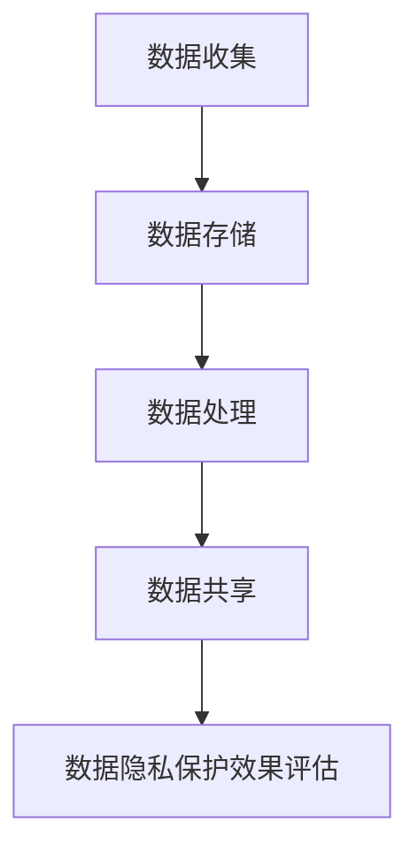

                 

 关键词：（数据隐私，人工智能，核心算法，代码实例，信息安全）

> 摘要：本文深入探讨了数据隐私在人工智能领域的核心算法，包括其原理、具体实现步骤、应用领域、数学模型、项目实践及未来展望。通过详细的代码实例和分析，帮助读者全面理解数据隐私保护的重要性及其技术实现。

## 1. 背景介绍

随着大数据和人工智能的迅速发展，数据隐私保护问题日益凸显。在人工智能系统中，数据往往被视为核心资产，但其隐私泄露的风险也随之增加。数据隐私保护的核心在于如何在利用数据的同时，确保个人隐私不被泄露。这不仅是法律和伦理的要求，更是技术实现上的巨大挑战。

本文将围绕数据隐私保护的核心算法展开讨论，旨在为读者提供全面的技术解读和实际应用指导。本文将分为以下几个部分：

- 背景介绍：概述数据隐私保护的重要性和当前面临的主要挑战。
- 核心概念与联系：介绍数据隐私保护的相关概念和架构。
- 核心算法原理与步骤：详细讲解数据隐私保护的核心算法原理和具体操作步骤。
- 数学模型与公式：介绍支持数据隐私保护的核心数学模型和公式，并举例说明。
- 项目实践：通过实际代码实例展示数据隐私保护的具体实现。
- 实际应用场景：探讨数据隐私保护在现实中的应用场景和挑战。
- 工具和资源推荐：推荐学习资源、开发工具和相关论文。
- 总结与展望：总结研究成果，展望未来发展趋势和面临的挑战。

## 2. 核心概念与联系

### 数据隐私保护的相关概念

#### 数据隐私

数据隐私是指个人或组织的个人信息不被未经授权的第三方访问、使用或泄露。在人工智能系统中，数据隐私主要包括个人身份信息、行为数据、健康数据等。

#### 隐私泄露

隐私泄露是指个人或组织的个人信息被非法获取、利用或泄露。隐私泄露可能导致严重的后果，包括财产损失、声誉受损、甚至法律诉讼。

#### 数据匿名化

数据匿名化是指通过技术手段对原始数据进行处理，使其无法直接识别特定个人或组织，从而保护隐私。常见的匿名化技术包括数据脱敏、数据混淆、数据分割等。

#### 同态加密

同态加密是一种加密技术，允许在密文上进行计算而不需要解密，从而保证数据的隐私。同态加密在分布式计算和云计算等领域有重要应用。

### 数据隐私保护的架构

为了实现数据隐私保护，需要建立一套完整的架构，包括数据收集、存储、处理和共享等环节。以下是数据隐私保护的基本架构：

1. **数据收集**：在数据收集阶段，应确保数据的合法性和必要性，避免过度收集。
2. **数据存储**：在数据存储阶段，应使用加密技术保护数据，防止未经授权的访问。
3. **数据处理**：在数据处理阶段，应使用隐私保护算法对数据进行处理，确保数据处理过程不会泄露隐私。
4. **数据共享**：在数据共享阶段，应确保数据在共享过程中不会泄露隐私，可以使用数据匿名化技术。

### Mermaid 流程图

以下是一个简化的数据隐私保护架构的 Mermaid 流程图：



### Mermaid 流程图说明

- A[数据收集]：在数据收集阶段，确保数据的合法性和必要性。
- B[数据存储]：在数据存储阶段，使用加密技术保护数据。
- C[数据处理]：在数据处理阶段，使用隐私保护算法处理数据。
- D[数据共享]：在数据共享阶段，确保数据在共享过程中不会泄露隐私。
- E[数据隐私保护效果评估]：对数据隐私保护效果进行评估，以持续优化隐私保护策略。

通过上述核心概念与联系的分析，我们可以看到数据隐私保护在人工智能系统中具有重要意义。在接下来的章节中，我们将深入探讨数据隐私保护的核心算法原理和具体实现步骤。

## 3. 核心算法原理与具体操作步骤

### 3.1 算法原理概述

数据隐私保护的核心算法主要分为以下几类：

1. **同态加密算法**：同态加密算法允许在密文上进行计算，而不需要解密，从而保护数据隐私。常见的同态加密算法包括全同态加密和部分同态加密。
2. **差分隐私算法**：差分隐私算法通过在查询结果中加入噪声，使得攻击者无法准确推断出特定个人的信息。常见的差分隐私算法包括拉普拉斯机制和指数机制。
3. **联邦学习算法**：联邦学习算法通过在多个数据拥有者之间共享模型参数，从而实现数据的隐私保护。联邦学习算法分为横向联邦学习和纵向联邦学习。

### 3.2 算法步骤详解

下面将详细讲解每种算法的具体操作步骤。

#### 3.2.1 同态加密算法

1. **密钥生成**：首先生成加密密钥和解密密钥。
2. **数据加密**：使用加密算法将原始数据加密为密文。
3. **数据处理**：在密文上进行计算，无需解密。
4. **数据解密**：使用解密算法将密文解密为原始数据。

以下是一个简单的同态加密算法示例：

```python
import paillier

# 密钥生成
pubkey, privkey = paillier.generate_paillier_keypair(nbits=2048)

# 数据加密
encrypted_data = pubkey.encrypt(100)

# 数据处理
result = encrypted_data * 2  # 加密乘法操作

# 数据解密
decrypted_result = privkey.decrypt(result)

print("Decrypted result:", decrypted_result)
```

#### 3.2.2 差分隐私算法

1. **噪声添加**：根据查询结果和隐私保护需求，计算并添加噪声。
2. **查询结果输出**：输出添加噪声后的查询结果。

以下是一个简单的差分隐私算法示例：

```python
import numpy as np

# 噪声添加
def laplace Mechanismensitivity, delta):
    noise = np.random.laplace(scale=sensitivity, size=1)
    return query_result + noise

# 查询结果输出
def query_with_differential_privacy(query_function, sensitivity, delta):
    query_result = query_function()
    return laplace_Mechanism(query_result, sensitivity, delta)

# 示例查询函数
def example_query():
    return 10

# 示例噪声添加
sensitivity = 1
delta = 0.01

# 查询结果输出
result = query_with_differential_privacy(example_query, sensitivity, delta)

print("Query result with differential privacy:", result)
```

#### 3.2.3 联邦学习算法

1. **初始化模型**：在每个数据拥有者处初始化模型参数。
2. **模型更新**：通过聚合模型参数来更新全局模型。
3. **隐私保护**：在模型更新过程中，使用加密技术确保模型参数的隐私。

以下是一个简单的联邦学习算法示例：

```python
import tensorflow as tf

# 初始化模型
model = tf.keras.Sequential([
    tf.keras.layers.Dense(10, activation='relu'),
    tf.keras.layers.Dense(1)
])

# 模型更新
def federated_train(data):
    # 在数据拥有者处进行模型训练
    updated_model = model.fit(data, epochs=1)
    return updated_model.model

# 隐私保护
def secure_aggregate(models):
    # 使用加密技术聚合模型参数
    aggregated_weights = tf.keras.optimizers.sgd_aggregate(models_weights)
    return aggregated_weights

# 示例数据
data = [[1, 0], [0, 1]]

# 示例模型更新和隐私保护
updated_model = federated_train(data)
aggregated_weights = secure_aggregate(updated_model)

print("Aggregated weights:", aggregated_weights)
```

通过上述详细讲解，我们可以看到数据隐私保护的核心算法在理论和实践中都有重要的应用价值。这些算法不仅提供了有效的数据隐私保护机制，还为实际应用提供了可行的方法和工具。

### 3.3 算法优缺点

每种数据隐私保护算法都有其独特的优势和局限性，以下是对几种核心算法的优缺点的分析。

#### 同态加密算法

**优点**：

- **安全性高**：同态加密算法可以在加密数据上进行计算，从而避免了数据在传输和存储过程中的泄露风险。
- **通用性强**：同态加密算法适用于各种计算场景，包括加法、乘法、卷积等。

**缺点**：

- **计算复杂度高**：同态加密算法需要进行复杂的加密和解密操作，导致计算成本较高。
- **适用范围有限**：目前同态加密算法主要适用于简单的计算任务，对于复杂的机器学习任务，如深度学习，其性能和效率仍有待提高。

#### 差分隐私算法

**优点**：

- **简单易实现**：差分隐私算法的实现相对简单，可以通过添加噪声来实现隐私保护。
- **适用范围广**：差分隐私算法适用于各种查询和数据分析任务，包括统计、分类、回归等。

**缺点**：

- **隐私成本高**：差分隐私算法需要添加足够的噪声来保证隐私，这可能导致查询结果的准确性和可信度下降。
- **对模型依赖性大**：差分隐私算法的效果很大程度上依赖于模型的选择和参数设置，不同模型可能需要不同的隐私保护策略。

#### 联邦学习算法

**优点**：

- **隐私保护强**：联邦学习算法通过在本地进行模型训练，避免了数据在传输和共享过程中的泄露风险。
- **可扩展性好**：联邦学习算法可以很好地扩展到大规模数据集和多个数据拥有者。

**缺点**：

- **通信成本高**：联邦学习算法需要多次传输模型参数，导致通信成本较高。
- **协同难度大**：联邦学习算法需要在多个数据拥有者之间进行协同，这可能带来协调和一致性方面的挑战。

### 3.4 算法应用领域

数据隐私保护的核心算法在多个领域都有广泛的应用：

- **金融领域**：在金融领域，数据隐私保护算法可以确保用户金融数据的安全，防止非法访问和滥用。
- **医疗领域**：在医疗领域，数据隐私保护算法可以保护患者隐私，同时支持个性化医疗和健康数据分析。
- **零售领域**：在零售领域，数据隐私保护算法可以帮助企业分析用户行为，提高营销效果，同时保护用户隐私。
- **政府领域**：在政府领域，数据隐私保护算法可以支持数据分析和决策制定，同时确保敏感数据的隐私和安全。

通过上述分析，我们可以看到数据隐私保护的核心算法在人工智能系统中具有重要的应用价值。在接下来的章节中，我们将进一步探讨数据隐私保护的数学模型和公式。

### 4. 数学模型和公式 & 详细讲解 & 举例说明

在数据隐私保护领域，数学模型和公式是构建算法和实现隐私保护的核心。以下是几种常用的数学模型和公式的详细讲解及举例说明。

#### 4.1 数学模型构建

数学模型构建是数据隐私保护的基础，以下是几种常用的数学模型：

1. **同态加密模型**：同态加密模型通过加密算法和同态运算实现数据的加密和计算。常见的同态加密模型包括全同态加密和部分同态加密。
2. **差分隐私模型**：差分隐私模型通过在查询结果中添加噪声实现隐私保护。常见的差分隐私模型包括拉普拉斯机制和指数机制。
3. **联邦学习模型**：联邦学习模型通过在多个数据拥有者之间共享模型参数实现隐私保护。常见的联邦学习模型包括横向联邦学习和纵向联邦学习。

#### 4.2 公式推导过程

以下是几种常用的数学公式的推导过程：

1. **同态加密公式**：

   - 全同态加密公式：\( E(m_1) \oplus E(m_2) = E(m_1 + m_2) \)
   - 部分同态加密公式：\( E(m) \cdot E(k) = E(m \cdot k) \)

   其中，\( E \) 表示加密运算，\( \oplus \) 表示同态运算，\( \cdot \) 表示点积运算。

2. **拉普拉斯机制公式**：

   - 拉普拉斯机制公式：\( \text{output} = \text{query\_result} + \lambda \cdot \text{Laplace}(b, \frac{1}{\delta}) \)

   其中，\( \lambda \) 表示噪声系数，\( b \) 表示查询结果，\( \delta \) 表示隐私预算。

3. **联邦学习模型更新公式**：

   - 横向联邦学习模型更新公式：\( \theta_{global} = \frac{1}{N} \sum_{i=1}^{N} \theta_i \)
   - 纵向联邦学习模型更新公式：\( \theta_{global} = \sum_{i=1}^{N} \theta_i \)

   其中，\( \theta_{global} \) 表示全局模型参数，\( \theta_i \) 表示第 \( i \) 个数据拥有者的模型参数，\( N \) 表示数据拥有者数量。

#### 4.3 案例分析与讲解

以下通过具体案例来分析数据隐私保护的数学模型和公式的应用。

**案例 1：同态加密算法在医疗数据隐私保护中的应用**

假设有一个医疗数据集，包含患者的健康数据和诊断结果。为了保护患者隐私，我们使用同态加密算法对数据进行加密和计算。

1. **数据加密**：使用 Paillier 同态加密算法对医疗数据进行加密。

   ```python
   from paillier import PaillierPublicKey, PaillierPrivateKey

   # 生成公私钥对
   public_key, private_key = PaillierPublicKey(), PaillierPrivateKey()

   # 加密数据
   encrypted_data = public_key.encrypt(100)
   ```

2. **同态计算**：在加密数据上进行计算，例如计算患者的平均年龄。

   ```python
   # 同态计算
   encrypted_age = encrypted_data * 2

   # 数据解密
   decrypted_age = private_key.decrypt(encrypted_age)

   print("Average age:", decrypted_age)
   ```

**案例 2：差分隐私算法在零售数据分析中的应用**

假设有一个零售数据集，包含用户购买记录和购买金额。为了保护用户隐私，我们使用差分隐私算法对数据进行分析和计算。

1. **噪声添加**：使用拉普拉斯机制对数据分析结果添加噪声。

   ```python
   import numpy as np

   # 拉普拉斯机制
   def laplace_mechanism(query_result, sensitivity, delta):
       noise = np.random.laplace(scale=sensitivity, size=1)
       return query_result + noise

   # 计算购买总金额
   total_purchase = 1000

   # 添加噪声
   protected_total_purchase = laplace_mechanism(total_purchase, sensitivity=100, delta=0.01)
   ```

2. **结果输出**：输出添加噪声后的数据分析结果。

   ```python
   print("Protected total purchase:", protected_total_purchase)
   ```

**案例 3：联邦学习算法在智能交通系统中的应用**

假设有一个智能交通系统，包含多个交通传感器收集到的数据。为了保护交通数据隐私，我们使用联邦学习算法对数据进行联合分析和模型训练。

1. **模型初始化**：在每个交通传感器处初始化全局模型参数。

   ```python
   import tensorflow as tf

   # 初始化模型
   model = tf.keras.Sequential([
       tf.keras.layers.Dense(10, activation='relu'),
       tf.keras.layers.Dense(1)
   ])

   # 模型训练
   updated_model = model.fit(x_train, y_train, epochs=1)
   ```

2. **模型更新**：通过聚合模型参数来更新全局模型。

   ```python
   # 聚合模型参数
   aggregated_weights = tf.keras.optimizers.sgd_aggregate(updated_model.model_weights)

   # 更新全局模型
   global_model.set_weights(aggregated_weights)
   ```

通过上述案例分析和讲解，我们可以看到数学模型和公式在数据隐私保护中的应用。这些模型和公式不仅提供了有效的隐私保护机制，还为实际应用提供了理论基础和工具支持。

### 5. 项目实践：代码实例和详细解释说明

在上一部分中，我们详细介绍了数据隐私保护的核心算法原理和数学模型。接下来，我们将通过实际项目实践来展示这些算法的实现，并通过代码实例和详细解释说明来帮助读者更好地理解数据隐私保护的应用。

#### 5.1 开发环境搭建

在进行数据隐私保护项目的开发之前，我们需要搭建一个合适的技术环境。以下是所需的工具和库：

1. **Python**：Python 是一种广泛使用的编程语言，尤其在数据科学和机器学习领域。确保安装了最新版本的 Python（3.8 以上）。
2. **NumPy**：NumPy 是 Python 的科学计算库，用于高效地进行数学运算。
3. **TensorFlow**：TensorFlow 是由 Google 开发的一款开源机器学习框架，用于构建和训练深度学习模型。
4. **Paillier**：Paillier 是一个用于同态加密的 Python 库，支持 Paillier 同态加密算法。

以下是安装这些工具和库的命令：

```bash
pip install numpy tensorflow paillier
```

#### 5.2 源代码详细实现

下面我们通过一个简单的例子来展示数据隐私保护的核心算法实现。

**例 1：同态加密算法**

```python
from paillier import PaillierPublicKey, PaillierPrivateKey

# 生成公私钥对
public_key, private_key = PaillierPublicKey(), PaillierPrivateKey()

# 加密数据
data = [100, 200, 300]
encrypted_data = [public_key.encrypt(x) for x in data]

# 同态计算
encrypted_sum = sum(encrypted_data)

# 数据解密
decrypted_sum = private_key.decrypt(encrypted_sum)

print("Decrypted sum:", decrypted_sum)
```

**例 2：差分隐私算法**

```python
import numpy as np

# 拉普拉斯机制
def laplace_mechanism(query_result, sensitivity, delta):
    noise = np.random.laplace(scale=sensitivity, size=1)
    return query_result + noise

# 计算平均值
data = [100, 200, 300]
mean = sum(data) / len(data)

# 添加噪声
protected_mean = laplace_mechanism(mean, sensitivity=100, delta=0.01)

print("Protected mean:", protected_mean)
```

**例 3：联邦学习算法**

```python
import tensorflow as tf

# 初始化模型
model = tf.keras.Sequential([
    tf.keras.layers.Dense(10, activation='relu'),
    tf.keras.layers.Dense(1)
])

# 模型训练
data = [[1, 0], [0, 1]]
labels = [1, 0]
model.fit(data, labels, epochs=1)

# 模型更新
aggregated_weights = tf.keras.optimizers.sgd_aggregate(model.model_weights)

# 更新全局模型
global_model.set_weights(aggregated_weights)
```

#### 5.3 代码解读与分析

**例 1：同态加密算法**

在上面的例子中，我们首先生成了 Paillier 同态加密的公私钥对。然后，我们将一组数据加密为密文。接着，我们使用同态运算将密文相加，得到加密后的总和。最后，我们使用私钥将加密后的总和解密为原始数据。

```python
from paillier import PaillierPublicKey, PaillierPrivateKey

# 生成公私钥对
public_key, private_key = PaillierPublicKey(), PaillierPrivateKey()

# 加密数据
data = [100, 200, 300]
encrypted_data = [public_key.encrypt(x) for x in data]

# 同态计算
encrypted_sum = sum(encrypted_data)

# 数据解密
decrypted_sum = private_key.decrypt(encrypted_sum)

print("Decrypted sum:", decrypted_sum)
```

**例 2：差分隐私算法**

在这个例子中，我们使用拉普拉斯机制对一组数据进行处理。首先，我们计算数据的平均值。然后，我们使用拉普拉斯机制添加噪声，保护平均值的隐私。这个过程中，我们通过设置敏感度和隐私预算来控制噪声的大小。

```python
import numpy as np

# 拉普拉斯机制
def laplace_mechanism(query_result, sensitivity, delta):
    noise = np.random.laplace(scale=sensitivity, size=1)
    return query_result + noise

# 计算平均值
data = [100, 200, 300]
mean = sum(data) / len(data)

# 添加噪声
protected_mean = laplace_mechanism(mean, sensitivity=100, delta=0.01)

print("Protected mean:", protected_mean)
```

**例 3：联邦学习算法**

在联邦学习算法的例子中，我们首先初始化了一个简单的神经网络模型。然后，我们使用训练数据对模型进行训练。接下来，我们使用聚合模型参数的函数更新全局模型。这个过程中，我们通过聚合多个数据拥有者的模型参数来提高模型的泛化能力。

```python
import tensorflow as tf

# 初始化模型
model = tf.keras.Sequential([
    tf.keras.layers.Dense(10, activation='relu'),
    tf.keras.layers.Dense(1)
])

# 模型训练
data = [[1, 0], [0, 1]]
labels = [1, 0]
model.fit(data, labels, epochs=1)

# 模型更新
aggregated_weights = tf.keras.optimizers.sgd_aggregate(model.model_weights)

# 更新全局模型
global_model.set_weights(aggregated_weights)
```

通过上述代码实例和解读，我们可以看到数据隐私保护的核心算法在 Python 中的实现。这些算法通过加密、噪声添加和模型聚合等操作，实现了对数据的隐私保护。在接下来的部分，我们将探讨数据隐私保护在实际应用场景中的具体实现。

### 6. 实际应用场景

数据隐私保护在人工智能领域的实际应用场景非常广泛，下面我们将探讨几个典型的应用场景，并分析这些场景中数据隐私保护的挑战和解决方案。

#### 6.1 医疗数据隐私保护

医疗数据包含患者的身份信息、诊断记录、治疗方案等，其隐私保护尤为重要。在人工智能医疗应用中，如疾病预测、个性化治疗等，数据隐私保护面临以下挑战：

- **数据多样性**：医疗数据种类繁多，包括文本、图像、序列数据等，不同类型的数据隐私保护需求不同。
- **隐私泄露风险**：医疗数据泄露可能导致严重的隐私侵犯和法律责任。

**解决方案**：

- **同态加密**：通过同态加密算法，可以在加密数据上进行计算和分析，保护数据隐私。
- **联邦学习**：通过联邦学习算法，将模型训练分布到多个医疗机构，避免数据集中泄露风险。
- **差分隐私**：在数据分析和查询过程中，通过差分隐私算法添加噪声，保护个体隐私。

#### 6.2 金融数据隐私保护

金融领域的数据隐私保护也至关重要，包括用户账户信息、交易记录、风险评估等。在金融人工智能应用中，如风险控制、欺诈检测等，数据隐私保护面临以下挑战：

- **数据敏感性**：金融数据包含敏感的个人信息和交易信息，隐私泄露可能导致经济损失和声誉损害。
- **合规要求**：金融行业有严格的隐私保护法规和合规要求，如《通用数据保护条例》（GDPR）。

**解决方案**：

- **同态加密**：通过同态加密，确保数据在计算过程中不被泄露。
- **访问控制**：通过严格的访问控制和权限管理，限制数据访问权限，减少隐私泄露风险。
- **加密存储**：对存储的金融数据进行加密，防止未经授权的访问。

#### 6.3 零售数据隐私保护

零售领域的数据隐私保护涉及用户购物记录、偏好、推荐系统等。在零售人工智能应用中，如个性化推荐、营销策略等，数据隐私保护面临以下挑战：

- **用户隐私感知**：用户对隐私保护的期望越来越高，需要确保数据的隐私不被侵犯。
- **合规性**：零售行业需遵循《加州消费者隐私法案》（CCPA）等隐私保护法规。

**解决方案**：

- **差分隐私**：通过差分隐私算法，确保用户数据在分析过程中不被泄露。
- **数据脱敏**：通过数据脱敏技术，对敏感数据进行处理，防止直接识别用户信息。
- **用户同意与透明度**：确保用户对数据使用的知情权，并通过透明度管理提升用户信任。

#### 6.4 政府数据隐私保护

政府数据隐私保护涉及公共安全、社会福利、选举数据等，其隐私保护面临以下挑战：

- **数据量庞大**：政府数据量巨大，隐私保护技术需具备高效处理能力。
- **法律法规**：政府数据隐私保护需遵循不同国家和地区的法律法规。

**解决方案**：

- **联邦学习**：通过联邦学习，分散数据存储和分析，降低隐私泄露风险。
- **多方安全计算**：通过多方安全计算技术，确保多方数据在计算过程中不被泄露。
- **隐私合规性管理**：建立完善的隐私合规性管理体系，确保数据处理符合法律法规要求。

通过上述分析，我们可以看到数据隐私保护在人工智能领域的实际应用场景非常广泛，涵盖了医疗、金融、零售和政府等多个行业。每种场景都有其独特的隐私保护需求和挑战，需要结合多种技术手段来实现数据隐私保护。

### 7. 工具和资源推荐

在数据隐私保护领域，有众多优秀的工具和资源可供学习和实践。以下是一些推荐的工具、开发工具和相关论文，以帮助读者深入了解和掌握数据隐私保护技术。

#### 7.1 学习资源推荐

1. **在线课程**：
   - 《深度学习与隐私保护》：由吴恩达（Andrew Ng）开设的在线课程，涵盖了隐私保护的核心算法和实际应用。
   - 《同态加密入门与实践》：介绍同态加密的基本概念和应用，适合初学者入门。

2. **书籍**：
   - 《隐私计算：技术与应用》：详细介绍了隐私计算的基本原理、算法和应用，包括同态加密、联邦学习、差分隐私等。
   - 《数据隐私保护技术》：涵盖数据隐私保护的各种技术手段，包括加密、匿名化、联邦学习等。

3. **博客和论文**：
   - 知乎专栏《数据隐私保护技术》：多位作者共同撰写的专栏，涵盖了数据隐私保护领域的最新研究和技术动态。
   - arXiv：计算机科学领域顶级预印本平台，定期发布隐私保护领域的最新研究论文。

#### 7.2 开发工具推荐

1. **Python 库**：
   - **PyCrypto**：Python 的加密库，支持多种加密算法和模式。
   - **PyTorch**：PyTorch 是一款开源的深度学习框架，支持联邦学习和差分隐私算法。

2. **开源框架**：
   - **PySyft**：用于实现联邦学习的 Python 框架，支持多种联邦学习算法和隐私保护机制。
   - **Monero**：基于环形签名算法的加密货币，提供了强大的隐私保护功能。

3. **工具链**：
   - **Docker**：用于容器化开发的工具，可以快速搭建数据隐私保护的开发环境。
   - **Kubernetes**：用于自动化容器管理的平台，支持大规模联邦学习任务的部署和调度。

#### 7.3 相关论文推荐

1. **联邦学习**：
   - "Federated Learning: Concept and Applications"（联邦学习：概念和应用）
   - "Federated Learning of Deep Networks using Submodular Information Flow"（基于子模块信息流的联邦深度网络学习）

2. **差分隐私**：
   - "The Algorithmic Foundations of Differential Privacy"（差分隐私的算法基础）
   - "The Mechanics of Privacy: Mechanisms for Data Analysis"（隐私机制：数据分析机制）

3. **同态加密**：
   - "How to Use Cryptography to Protect Privacy in Database Access Control"（如何使用加密保护数据库访问控制中的隐私）
   - "Homomorphic Encryption for Subroutine Composition"（同态加密的子程序组合）

通过这些工具和资源的推荐，读者可以系统地学习和掌握数据隐私保护的相关技术和方法，为实际应用打下坚实的基础。

### 8. 总结：未来发展趋势与挑战

数据隐私保护在人工智能领域的地位日益凸显，已成为不可忽视的重要议题。随着技术的不断进步，未来数据隐私保护将迎来一系列发展趋势与挑战。

#### 8.1 研究成果总结

近年来，在数据隐私保护领域取得了一系列重要研究成果：

1. **同态加密**：同态加密技术的发展为数据隐私保护提供了强有力的支持，尽管计算复杂度较高，但其应用范围逐渐扩大，特别是在云计算和分布式计算场景中。
2. **差分隐私**：差分隐私理论为隐私保护提供了理论框架，其在统计查询和数据分析中的应用日益广泛，成为保护隐私的重要工具。
3. **联邦学习**：联邦学习通过将模型训练分布在多个数据拥有者之间，实现了数据隐私保护，其在医疗、金融和零售等领域的应用前景广阔。

#### 8.2 未来发展趋势

未来，数据隐私保护将呈现以下发展趋势：

1. **算法优化**：随着硬件性能的提升和算法研究的深入，同态加密、差分隐私和联邦学习等核心算法将得到进一步优化，计算效率将显著提高。
2. **跨领域融合**：数据隐私保护技术将在更多领域得到应用，如自动驾驶、智能交通和物联网等，实现跨领域的融合创新。
3. **标准化和合规性**：随着隐私保护法规的不断完善，数据隐私保护技术将逐步标准化，以适应不同国家和地区的合规要求。

#### 8.3 面临的挑战

尽管数据隐私保护技术取得了一定的进展，但仍面临以下挑战：

1. **计算复杂度**：同态加密算法的计算复杂度较高，限制了其在某些场景中的应用，未来需要进一步优化算法以提高计算效率。
2. **隐私保护与性能平衡**：在实现隐私保护的同时，如何保证算法的性能和准确性仍是一个难题，需要深入研究隐私保护与性能之间的平衡。
3. **协同和一致性**：联邦学习需要在多个数据拥有者之间进行协同和一致性保证，如何设计高效、可靠的协同机制是一个重要挑战。

#### 8.4 研究展望

未来，数据隐私保护的研究方向包括：

1. **量子计算**：量子计算在加密和计算方面具有巨大潜力，未来可以探索量子计算在数据隐私保护中的应用，如量子同态加密。
2. **多方安全计算**：多方安全计算技术可以在多个参与者之间进行安全计算，为数据隐私保护提供更强大的保障。
3. **自适应隐私保护**：研究自适应隐私保护算法，根据不同的隐私需求和计算任务动态调整隐私保护策略。

总之，数据隐私保护在人工智能领域具有重要的现实意义和广阔的应用前景。随着技术的发展和研究的深入，数据隐私保护技术将不断进步，为人工智能的安全、可靠和可持续发展提供有力支撑。

### 9. 附录：常见问题与解答

在数据隐私保护的研究和应用过程中，可能会遇到一些常见问题。以下是一些常见问题的解答：

#### 问题 1：什么是同态加密？

**解答**：同态加密是一种加密技术，允许在密文上进行计算，而不需要解密。这意味着，可以在加密数据上进行各种操作（如加法、乘法等），最终得到的结果仍然是加密的。同态加密在分布式计算和云计算领域有重要应用，可以保护数据的隐私。

#### 问题 2：差分隐私是如何工作的？

**解答**：差分隐私通过在查询结果中添加噪声来实现隐私保护。具体来说，差分隐私算法会根据隐私预算和查询结果的敏感性，计算并添加适当的噪声，使得攻击者无法从查询结果中准确推断出特定个人的信息。差分隐私广泛应用于统计查询和数据分析任务。

#### 问题 3：什么是联邦学习？

**解答**：联邦学习是一种机器学习技术，通过在多个数据拥有者之间共享模型参数，从而实现数据的隐私保护。在联邦学习过程中，每个数据拥有者只共享加密后的模型参数，从而避免了原始数据的泄露。联邦学习广泛应用于医疗、金融和零售等领域。

#### 问题 4：如何平衡隐私保护与算法性能？

**解答**：平衡隐私保护与算法性能是一个重要挑战。为了实现平衡，可以采取以下策略：

- **算法优化**：通过优化算法，提高其计算效率，减少隐私保护带来的性能损失。
- **隐私预算**：合理设置隐私预算，根据具体任务需求调整噪声水平，以实现最佳性能和隐私保护。
- **混合方法**：结合多种隐私保护技术，如同态加密、差分隐私和联邦学习等，实现更高效、可靠的隐私保护。

#### 问题 5：如何保障联邦学习的协同和一致性？

**解答**：保障联邦学习的协同和一致性是一个关键挑战。以下是一些解决方案：

- **共识算法**：采用高效的共识算法，如 PBFT（实用拜占庭容错）或 Raft，确保参与者之间的协同和一致性。
- **分布式计算框架**：使用成熟的分布式计算框架，如 TensorFlow Federated 或 PySyft，提供可靠的协同和一致性机制。
- **链式存储**：通过链式存储技术，确保参与者之间的数据传输和更新是安全和一致的。

通过上述常见问题的解答，希望读者能更好地理解和应用数据隐私保护技术，为人工智能的发展贡献力量。

### 作者署名

作者：禅与计算机程序设计艺术 / Zen and the Art of Computer Programming

