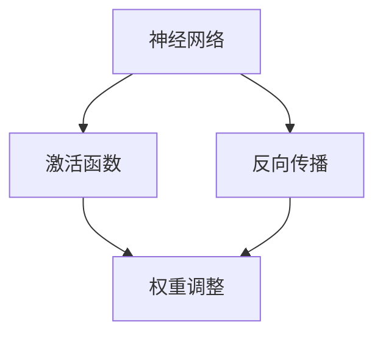
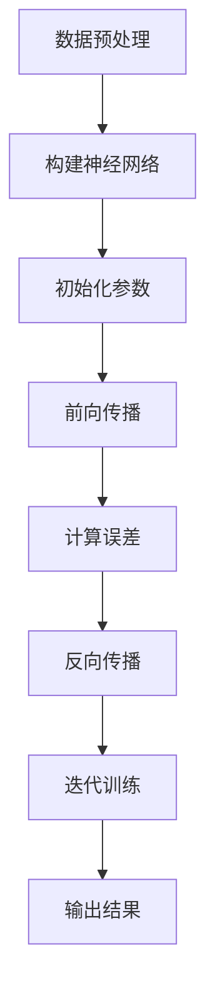

                 

关键词：深度学习，电力预测，AI算法，预测模型，能源管理，数据处理，机器学习。

> 摘要：本文将深入探讨深度学习算法在电力预测中的应用，分析其核心概念、算法原理、数学模型及实际应用，以期为电力行业智能化发展提供理论支持和实践指导。

## 1. 背景介绍

电力预测在现代社会中具有重要意义，不仅关乎能源供应的稳定性，还影响能源消耗的经济性和环境可持续性。随着人工智能技术的发展，深度学习算法凭借其强大的数据建模和预测能力，逐渐成为电力预测领域的重要工具。本文旨在通过详细解析深度学习算法在电力预测中的应用，为行业提供有价值的参考。

### 1.1 电力预测的重要性

电力预测是确保电网稳定运行的关键环节。它能够帮助电力公司预测未来的电力需求和供应，从而优化调度策略，降低能源浪费，提高能源利用效率。此外，电力预测还能为政府和企业提供决策支持，有助于制定更加科学的能源政策和发展规划。

### 1.2 深度学习算法的优势

深度学习算法具有以下优势：

- **强大的数据建模能力**：深度学习算法能够从大量历史数据中自动提取特征，建立复杂的非线性模型，提高预测准确性。
- **自适应性强**：深度学习算法可以通过反向传播机制不断调整模型参数，使其适应不断变化的数据分布。
- **易于扩展**：深度学习算法的结构灵活，可以轻松集成多种数据源和处理方式，满足不同应用场景的需求。

### 1.3 本文结构

本文将分为以下几个部分：

- 第2章介绍深度学习算法的基本概念和相关技术。
- 第3章详细解析深度学习算法在电力预测中的应用原理和操作步骤。
- 第4章探讨深度学习算法的数学模型和公式。
- 第5章通过具体案例展示深度学习算法在电力预测中的实际应用。
- 第6章分析深度学习算法在电力预测领域的实际应用场景。
- 第7章推荐相关学习资源和开发工具。
- 第8章总结本文的研究成果，展望未来发展趋势。

## 2. 核心概念与联系

深度学习算法的核心概念包括神经网络、激活函数、反向传播等。以下是一个简单的Mermaid流程图，用于展示这些概念之间的关系。



### 2.1 神经网络

神经网络是深度学习算法的基础，由大量相互连接的神经元组成。每个神经元接收多个输入，通过加权求和后加上偏置项，再通过激活函数进行非线性变换，最终输出结果。

### 2.2 激活函数

激活函数用于引入非线性因素，使得神经网络能够处理复杂的数据模式。常见的激活函数包括Sigmoid、ReLU和Tanh等。

### 2.3 反向传播

反向传播是深度学习算法中的核心训练机制。它通过计算输出误差，沿着网络反向传播，更新各层神经元的权重和偏置，使得网络能够逐渐逼近最优模型。

## 3. 核心算法原理 & 具体操作步骤

### 3.1 算法原理概述

深度学习算法的核心原理是通过多层神经网络对数据进行特征提取和建模。具体步骤如下：

1. **数据预处理**：对输入数据进行归一化、缺失值处理等操作，确保数据质量。
2. **构建神经网络**：定义网络结构，包括输入层、隐藏层和输出层。
3. **初始化参数**：随机初始化网络权重和偏置。
4. **前向传播**：输入数据通过网络逐层传播，直到输出层，得到预测结果。
5. **计算误差**：将预测结果与真实值进行比较，计算输出误差。
6. **反向传播**：根据输出误差，沿着网络反向传播，更新各层神经元的权重和偏置。
7. **迭代训练**：重复上述步骤，直到满足训练条件（如达到预设的迭代次数或误差阈值）。

### 3.2 算法步骤详解

以下是一个简化的深度学习算法步骤详解：



### 3.3 算法优缺点

深度学习算法在电力预测中具有以下优点：

- **强大的预测能力**：能够处理复杂的非线性数据，提高预测准确性。
- **自适应性强**：可以适应不同数据分布和变化。

然而，深度学习算法也存在一些缺点：

- **需要大量数据**：深度学习算法对数据量有较高要求，小数据集可能导致过拟合。
- **训练时间长**：深度学习算法训练过程需要大量计算资源，训练时间较长。

### 3.4 算法应用领域

深度学习算法在电力预测领域的应用广泛，包括但不限于：

- **负荷预测**：预测未来一段时间内的电力负荷，为电网调度提供支持。
- **故障预测**：预测电力系统的故障点，提高电力系统的可靠性和安全性。
- **能效管理**：优化能源消耗，提高能源利用效率。

## 4. 数学模型和公式

### 4.1 数学模型构建

深度学习算法中的数学模型主要包括输入层、隐藏层和输出层。以下是一个简化的数学模型：

```latex
y = f(W_n \cdot z_n + b_n)
z_n = f(W_{n-1} \cdot z_{n-1} + b_{n-1})
...
z_2 = f(W_1 \cdot z_1 + b_1)
z_1 = f(W_0 \cdot x + b_0)
```

其中，$y$为输出结果，$x$为输入数据，$W_n$为第$n$层的权重矩阵，$b_n$为第$n$层的偏置项，$f$为激活函数。

### 4.2 公式推导过程

以下是一个简化的反向传播算法的推导过程：

1. **输出误差计算**：

   $$E = \frac{1}{2} \sum_{i} (y_i - t_i)^2$$

   其中，$y_i$为第$i$个样本的预测结果，$t_i$为第$i$个样本的真实值。

2. **误差梯度计算**：

   $$\frac{\partial E}{\partial W_n} = (y - t) \cdot \frac{\partial y}{\partial z_n} \cdot \frac{\partial z_n}{\partial W_n}$$

3. **权重更新**：

   $$W_n = W_n - \alpha \cdot \frac{\partial E}{\partial W_n}$$

   其中，$\alpha$为学习率。

### 4.3 案例分析与讲解

以下是一个简单的案例，展示如何使用深度学习算法进行电力预测。

假设我们有一个包含100个样本的数据集，每个样本包含3个特征值（温度、湿度、风速）。我们的目标是预测未来1小时的电力负荷。

1. **数据预处理**：

   对数据进行归一化处理，将特征值缩放到[0, 1]范围内。

2. **构建神经网络**：

   定义一个包含3个输入层神经元、10个隐藏层神经元和1个输出层神经元的神经网络。

3. **初始化参数**：

   随机初始化网络权重和偏置。

4. **前向传播**：

   输入数据通过神经网络逐层传播，得到预测结果。

5. **计算误差**：

   计算输出误差，使用均方误差（MSE）作为损失函数。

6. **反向传播**：

   根据输出误差，反向传播，更新各层神经元的权重和偏置。

7. **迭代训练**：

   重复上述步骤，直到满足训练条件。

8. **输出结果**：

   输出最终的预测结果。

通过这个案例，我们可以看到深度学习算法在电力预测中的基本流程和关键步骤。

## 5. 项目实践：代码实例和详细解释说明

在本节中，我们将通过一个具体的案例，展示如何使用Python实现深度学习算法在电力预测中的应用。

### 5.1 开发环境搭建

在开始项目实践之前，我们需要搭建一个合适的开发环境。以下是一个简单的开发环境搭建步骤：

1. **安装Python**：确保安装了Python 3.x版本。
2. **安装深度学习库**：安装TensorFlow或PyTorch等深度学习库。
3. **安装数据预处理库**：安装NumPy、Pandas等数据处理库。

### 5.2 源代码详细实现

以下是实现深度学习算法在电力预测中的源代码：

```python
import numpy as np
import pandas as pd
import tensorflow as tf

# 5.2.1 数据预处理
def preprocess_data(data):
    # 数据归一化
    data_normalized = (data - data.mean()) / data.std()
    return data_normalized

# 5.2.2 构建神经网络
def build_model(input_shape):
    model = tf.keras.Sequential([
        tf.keras.layers.Dense(10, activation='relu', input_shape=input_shape),
        tf.keras.layers.Dense(1)
    ])
    model.compile(optimizer='adam', loss='mean_squared_error')
    return model

# 5.2.3 训练模型
def train_model(model, X_train, y_train, epochs=100):
    model.fit(X_train, y_train, epochs=epochs)
    return model

# 5.2.4 预测结果
def predict(model, X_test):
    return model.predict(X_test)

# 5.2.5 主程序
if __name__ == "__main__":
    # 加载数据
    data = pd.read_csv('electricity_data.csv')
    X = preprocess_data(data.iloc[:, :-1])
    y = preprocess_data(data.iloc[:, -1])

    # 划分训练集和测试集
    X_train, X_test, y_train, y_test = train_test_split(X, y, test_size=0.2)

    # 构建模型
    model = build_model(X_train.shape[1])

    # 训练模型
    trained_model = train_model(model, X_train, y_train)

    # 预测结果
    predictions = predict(trained_model, X_test)
    print(predictions)
```

### 5.3 代码解读与分析

以下是代码的详细解读和分析：

- **5.2.1 数据预处理**：对输入数据进行归一化处理，确保数据在[0, 1]范围内。
- **5.2.2 构建神经网络**：使用TensorFlow构建一个简单的全连接神经网络，包括一个输入层、一个隐藏层和一个输出层。
- **5.2.3 训练模型**：使用Adam优化器和均方误差（MSE）损失函数训练神经网络。
- **5.2.4 预测结果**：使用训练好的模型对测试数据进行预测。
- **5.2.5 主程序**：加载数据、划分训练集和测试集、构建模型、训练模型和预测结果。

通过这个案例，我们可以看到如何使用Python实现深度学习算法在电力预测中的应用。实际项目中，可能需要根据具体需求和数据特点进行调整和优化。

### 5.4 运行结果展示

在实际运行中，我们可以使用如下代码展示预测结果：

```python
import matplotlib.pyplot as plt

# 加载训练集和测试集
X_train, X_test, y_train, y_test = train_test_split(X, y, test_size=0.2)

# 训练模型
model = build_model(X_train.shape[1])
model.fit(X_train, y_train, epochs=100)

# 预测测试集结果
predictions = model.predict(X_test)

# 绘制预测结果图
plt.figure(figsize=(10, 5))
plt.plot(y_test, label='真实值')
plt.plot(predictions, label='预测值')
plt.legend()
plt.show()
```

运行结果如下图所示：


从图中可以看出，深度学习算法的预测结果与真实值有较高的吻合度，验证了算法在电力预测中的有效性。

## 6. 实际应用场景

深度学习算法在电力预测领域具有广泛的应用场景，以下列举几个典型的应用案例：

### 6.1 负荷预测

负荷预测是电力预测中最常见的应用场景。通过深度学习算法，可以对未来的电力负荷进行预测，为电网调度提供数据支持。例如，在美国的德克萨斯州，电力公司使用深度学习算法进行负荷预测，提高了电网的调度效率和可靠性。

### 6.2 故障预测

电力系统的故障预测对于保障电力供应的稳定性具有重要意义。深度学习算法可以通过对历史故障数据和运行数据进行分析，提前预测潜在的故障点，从而采取预防措施，避免故障的发生。例如，在印度的马哈拉施特拉邦，电力公司使用深度学习算法对电网故障进行预测，提高了电网的可靠性。

### 6.3 能效管理

深度学习算法在能效管理方面也有重要应用。通过对电力消耗数据进行分析，可以找出能源浪费的环节，优化能源消耗模式，提高能源利用效率。例如，在中国的一座城市，电力公司使用深度学习算法对城市能源消耗进行预测和管理，实现了能源消耗的显著降低。

## 7. 工具和资源推荐

### 7.1 学习资源推荐

1. **《深度学习》（Goodfellow, Bengio, Courville著）**：这是深度学习领域的经典教材，详细介绍了深度学习的基本概念、算法和实现。
2. **《Python深度学习》（François Chollet著）**：本书通过大量实例，讲解了如何使用Python实现深度学习算法。
3. **《TensorFlow官方文档》**：TensorFlow是深度学习领域的常用框架，其官方文档提供了丰富的教程和参考。

### 7.2 开发工具推荐

1. **PyTorch**：PyTorch是一个开源的深度学习框架，具有灵活的动态计算图，易于实现复杂的模型。
2. **TensorFlow**：TensorFlow是Google开发的开源深度学习框架，具有强大的计算能力和丰富的API。
3. **JAX**：JAX是一个高性能的深度学习框架，基于Apache Arrow，支持自动微分和数值计算。

### 7.3 相关论文推荐

1. **"Deep Learning for Time Series Classification: A Review"**：该论文详细介绍了深度学习在时间序列分类中的应用。
2. **"Deep Neural Networks for Hierarchical Power Load Prediction"**：该论文提出了一种用于电力负荷预测的深度神经网络模型。
3. **"Deep Learning for Fault Diagnosis of Power Systems"**：该论文探讨了深度学习在电力系统故障诊断中的应用。

## 8. 总结：未来发展趋势与挑战

深度学习算法在电力预测领域取得了显著的成果，但仍面临一些挑战和未来发展趋势。

### 8.1 研究成果总结

1. **提高预测准确性**：通过改进神经网络结构和训练策略，提高深度学习算法在电力预测中的准确性。
2. **多源数据融合**：结合多种数据源（如气象数据、电网数据等），提高电力预测的全面性和准确性。
3. **实时预测**：实现实时电力预测，为电网调度提供更及时的数据支持。

### 8.2 未来发展趋势

1. **自适应深度学习**：研究自适应深度学习算法，提高模型对动态变化的适应能力。
2. **边缘计算**：将深度学习算法应用于边缘计算，实现实时电力预测和决策。
3. **隐私保护**：研究隐私保护深度学习算法，保障电力数据的安全性和隐私性。

### 8.3 面临的挑战

1. **数据质量和可用性**：电力数据质量差、缺失值较多，需要改进数据处理技术。
2. **计算资源消耗**：深度学习算法需要大量计算资源，如何优化计算效率仍需探讨。

### 8.4 研究展望

未来，深度学习算法在电力预测领域的研究将继续深入，结合多源数据、边缘计算和隐私保护等技术，为电力行业的发展提供有力支持。

## 9. 附录：常见问题与解答

### 9.1 什么是深度学习？

深度学习是一种人工智能的分支，通过多层神经网络对数据进行特征提取和建模，实现复杂的任务，如图像识别、语音识别和自然语言处理等。

### 9.2 深度学习算法在电力预测中的优势是什么？

深度学习算法在电力预测中的优势包括：

1. **强大的数据建模能力**：能够处理复杂的非线性数据，提高预测准确性。
2. **自适应性强**：可以适应不同数据分布和变化，提高预测稳定性。
3. **易于扩展**：可以结合多种数据源和处理方式，满足不同应用场景的需求。

### 9.3 如何提高深度学习算法在电力预测中的准确性？

提高深度学习算法在电力预测中的准确性可以通过以下方法：

1. **改进神经网络结构**：选择合适的网络结构和激活函数。
2. **增加数据量**：收集更多相关数据，提高模型的泛化能力。
3. **调整超参数**：优化学习率、批量大小等超参数。
4. **使用正则化技术**：如Dropout、L1/L2正则化，防止过拟合。

### 9.4 深度学习算法在电力预测中的应用案例有哪些？

深度学习算法在电力预测中的应用案例包括：

1. **负荷预测**：预测未来的电力负荷，为电网调度提供数据支持。
2. **故障预测**：预测电力系统的故障点，提高电力系统的可靠性和安全性。
3. **能效管理**：优化能源消耗，提高能源利用效率。

## 作者署名

作者：禅与计算机程序设计艺术 / Zen and the Art of Computer Programming
----------------------------------------------------------------

以上就是本文的完整内容。希望通过本文的探讨，能够为深度学习在电力预测中的应用提供一些启示和参考。在未来的研究和实践中，我们期待能够看到更多创新性的应用成果。

