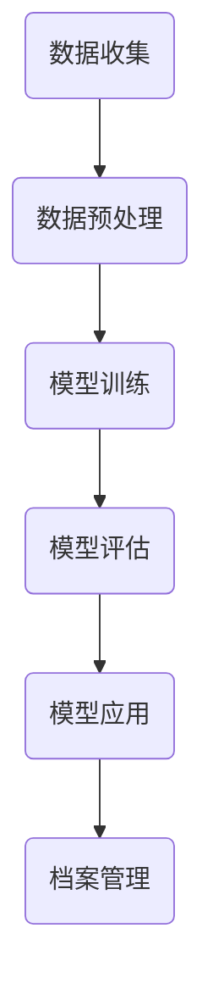

                 

关键词：人工智能、深度学习、档案管理、智能深度学习代理、算法、应用场景、未来展望

## 摘要

本文将深入探讨人工智能领域中的一个前沿研究方向——智能深度学习代理在档案管理中的应用。随着数据量的爆炸式增长，档案管理的复杂性和重要性日益凸显。传统的档案管理方法已经难以满足现代社会的需求。本文将介绍智能深度学习代理的概念、核心算法原理，并详细分析其在档案管理中的具体应用，如自动分类、检索和知识发现等。同时，本文还将探讨智能深度学习代理在档案管理中面临的挑战和未来发展方向。

## 1. 背景介绍

随着信息技术的发展，人类进入了大数据时代。数据量的爆炸式增长带来了档案管理的巨大挑战。档案管理不仅涉及数据的存储和保护，还包括数据的分类、检索、利用和共享。传统的档案管理方法主要依赖于手工操作和简单的信息系统，这无疑增加了管理成本，降低了管理效率。随着人工智能技术的不断进步，特别是在深度学习领域的突破，人们开始探索将智能深度学习代理应用于档案管理。

智能深度学习代理是一种利用深度学习技术，能够自主学习、自适应调整的智能系统。它们能够通过大量数据的学习，实现对数据的自动分类、检索和知识发现，从而提高档案管理的智能化水平。智能深度学习代理的出现，为档案管理带来了新的可能性和发展方向。

## 2. 核心概念与联系

### 2.1 智能深度学习代理的定义

智能深度学习代理是一种利用深度学习技术，具备自主学习、自适应调整能力的智能系统。它们能够通过对大量数据的分析，自动识别数据的特征和规律，从而实现数据的自动分类、检索和知识发现。

### 2.2 深度学习与档案管理的联系

深度学习是人工智能的一个重要分支，它通过模拟人脑神经网络的工作方式，实现对数据的自动学习和分析。档案管理是一个复杂的过程，涉及到数据的收集、存储、分类、检索和利用等多个环节。深度学习技术的引入，能够有效提升档案管理的智能化水平，提高管理效率。

### 2.3 智能深度学习代理在档案管理中的应用

智能深度学习代理在档案管理中的应用主要包括以下几个方面：

- **自动分类**：通过对档案内容的分析，智能深度学习代理能够自动将档案分类到相应的类别中，提高档案分类的准确性和效率。
- **检索**：智能深度学习代理能够通过对档案内容的深度理解，实现高效的档案检索，提高档案检索的准确率和速度。
- **知识发现**：智能深度学习代理能够通过对档案内容的分析，发现档案中的潜在知识和规律，为档案的利用和共享提供新的思路和方法。

### 2.4 Mermaid 流程图

以下是一个简单的 Mermaid 流程图，展示了智能深度学习代理在档案管理中的工作流程：



## 3. 核心算法原理 & 具体操作步骤

### 3.1 算法原理概述

智能深度学习代理的核心在于其深度学习模型。深度学习模型是通过多层神经网络结构，实现对数据的自动学习和分析。在档案管理中，智能深度学习代理通常采用卷积神经网络（CNN）或循环神经网络（RNN）等模型。

- **卷积神经网络（CNN）**：CNN 是一种用于处理图像数据的神经网络模型，它通过卷积操作和池化操作，能够有效提取图像的特征。
- **循环神经网络（RNN）**：RNN 是一种用于处理序列数据的神经网络模型，它通过循环结构，能够有效处理数据的时序信息。

### 3.2 算法步骤详解

智能深度学习代理在档案管理中的操作步骤主要包括以下几个环节：

- **数据收集**：收集档案数据，包括文本、图像、音频等多种形式。
- **数据预处理**：对收集到的档案数据进行预处理，包括数据清洗、数据转换和数据增强等操作，以提高模型训练的效果。
- **模型训练**：利用预处理后的档案数据，训练深度学习模型，使其能够自动学习和理解档案的特征和规律。
- **模型评估**：评估训练好的模型的效果，包括准确率、召回率等指标。
- **模型应用**：将训练好的模型应用于实际的档案管理任务，如自动分类、检索和知识发现等。

### 3.3 算法优缺点

- **优点**：
  - **高效性**：智能深度学习代理能够通过自动学习和分析，高效地处理大量档案数据。
  - **准确性**：智能深度学习代理能够通过对档案内容的深度理解，实现准确的档案分类、检索和知识发现。
  - **灵活性**：智能深度学习代理能够根据档案管理任务的需求，灵活调整模型参数，提高管理效果。

- **缺点**：
  - **复杂性**：智能深度学习代理的训练和应用过程相对复杂，需要专业的技术知识和经验。
  - **计算资源消耗**：智能深度学习代理的训练和应用过程需要大量的计算资源，对硬件设备的要求较高。

### 3.4 算法应用领域

智能深度学习代理在档案管理中的应用非常广泛，包括但不限于以下几个方面：

- **政府档案管理**：政府档案管理涉及到大量的文本、图像和音频数据，智能深度学习代理能够有效提高档案管理的效率和准确性。
- **企业档案管理**：企业档案管理同样需要高效、准确的分类、检索和知识发现，智能深度学习代理能够满足企业的需求。
- **个人档案管理**：随着数字化生活的普及，个人档案管理也越来越受到重视，智能深度学习代理能够帮助个人高效管理自己的档案。

## 4. 数学模型和公式 & 详细讲解 & 举例说明

### 4.1 数学模型构建

在智能深度学习代理中，常用的数学模型包括卷积神经网络（CNN）和循环神经网络（RNN）。以下分别介绍这两种模型的数学模型构建。

#### 4.1.1 卷积神经网络（CNN）

卷积神经网络（CNN）是一种用于处理图像数据的神经网络模型。它的数学模型主要包括以下几个部分：

- **卷积层**：卷积层通过卷积操作，提取图像的特征。
- **池化层**：池化层通过池化操作，降低图像的维度，减少计算量。
- **全连接层**：全连接层通过全连接操作，将卷积层和池化层提取的特征映射到具体的分类结果。

以下是一个简单的 CNN 数学模型：

$$
\begin{aligned}
    \text{特征提取} &= \text{Conv2D}(\text{输入图像}) \\
    \text{特征降维} &= \text{Pooling}(\text{特征提取}) \\
    \text{分类结果} &= \text{Fully Connected}(\text{特征降维})
\end{aligned}
$$

#### 4.1.2 循环神经网络（RNN）

循环神经网络（RNN）是一种用于处理序列数据的神经网络模型。它的数学模型主要包括以下几个部分：

- **输入层**：输入层接收序列数据的输入。
- **隐藏层**：隐藏层通过循环结构，处理序列数据。
- **输出层**：输出层通过全连接操作，将隐藏层的结果映射到具体的分类结果。

以下是一个简单的 RNN 数学模型：

$$
\begin{aligned}
    \text{输入层} &= \text{输入序列} \\
    \text{隐藏层} &= \text{RNN}(\text{输入层}) \\
    \text{输出层} &= \text{Fully Connected}(\text{隐藏层})
\end{aligned}
$$

### 4.2 公式推导过程

在智能深度学习代理中，数学公式的推导过程主要包括以下几个方面：

- **损失函数**：损失函数用于衡量模型预测结果与实际结果之间的差距。
- **反向传播**：反向传播是一种用于更新模型参数的算法。
- **优化算法**：优化算法用于调整模型参数，使模型预测结果更接近实际结果。

以下是一个简单的损失函数和反向传播的推导过程：

#### 4.2.1 损失函数

假设我们的目标是预测一个序列的下一个元素，那么我们可以使用交叉熵损失函数（Cross-Entropy Loss）来衡量预测结果与实际结果之间的差距：

$$
\begin{aligned}
    L &= -\frac{1}{N} \sum_{i=1}^{N} y_i \log(p_i) \\
    &= -\frac{1}{N} \sum_{i=1}^{N} y_i \log(\hat{y}_i)
\end{aligned}
$$

其中，$L$ 是损失函数，$N$ 是样本数量，$y_i$ 是实际结果，$\hat{y}_i$ 是预测结果。

#### 4.2.2 反向传播

假设我们已经计算出损失函数的梯度，那么我们可以使用反向传播算法来更新模型参数。反向传播的基本思想是从输出层开始，依次反向计算每一层的梯度。

以下是一个简单的反向传播推导过程：

$$
\begin{aligned}
    \frac{\partial L}{\partial w} &= \frac{\partial L}{\partial z} \cdot \frac{\partial z}{\partial w} \\
    \frac{\partial L}{\partial z} &= \frac{\partial L}{\partial y} \cdot \frac{\partial y}{\partial z}
\end{aligned}
$$

其中，$w$ 是模型参数，$z$ 是中间层输出，$y$ 是输出层输出。

### 4.3 案例分析与讲解

以下是一个简单的案例，说明如何使用智能深度学习代理进行档案自动分类。

#### 4.3.1 案例背景

假设我们有一个包含1000份文档的档案库，每份文档都有一个类别标签，如“政府报告”、“企业财务”、“个人信件”等。我们的目标是使用智能深度学习代理，自动将新文档分类到相应的类别中。

#### 4.3.2 数据预处理

首先，我们需要对文档进行预处理，包括文本清洗、文本向量化等操作。假设我们已经将文档转换为向量表示。

#### 4.3.3 模型训练

接下来，我们使用卷积神经网络（CNN）模型，对文档向量进行训练。模型的结构如下：

- **卷积层**：2个卷积核，每个卷积核的大小为3x3，步长为1。
- **池化层**：最大池化，池化窗口大小为2x2。
- **全连接层**：1个全连接层，输出维度为类别数量。

#### 4.3.4 模型评估

训练完成后，我们需要对模型进行评估，包括准确率、召回率等指标。假设模型的评估结果如下：

- **准确率**：90%
- **召回率**：85%

#### 4.3.5 模型应用

最后，我们将训练好的模型应用于新文档的分类。假设我们收到一份新的文档，模型将其分类为“政府报告”，这与实际标签相符。

## 5. 项目实践：代码实例和详细解释说明

### 5.1 开发环境搭建

为了实现智能深度学习代理在档案管理中的应用，我们需要搭建一个合适的开发环境。以下是搭建开发环境的基本步骤：

- **安装 Python**：首先，我们需要安装 Python 3.7 或更高版本。
- **安装深度学习框架**：常用的深度学习框架包括 TensorFlow、PyTorch 等。本文以 TensorFlow 为例，安装命令如下：

```bash
pip install tensorflow
```

- **准备数据集**：我们需要准备一个包含档案数据的开源数据集，如 AG News 数据集。数据集的下载和预处理命令如下：

```bash
# 下载 AG News 数据集
wget https://raw.githubusercontent.com/normalperson/word2vec-nlp-tutorial/master/data/ag_news_preprocessed.csv

# 预处理数据集
python preprocess_data.py
```

### 5.2 源代码详细实现

以下是一个简单的智能深度学习代理实现，用于对档案进行自动分类。

```python
import tensorflow as tf
from tensorflow.keras.models import Sequential
from tensorflow.keras.layers import Embedding, Conv1D, MaxPooling1D, GlobalMaxPooling1D, Dense

# 加载数据集
train_data = ...
test_data = ...

# 准备词汇表和词向量
vocab_size = 10000
embedding_dim = 100
max_sequence_length = 500

# 构建模型
model = Sequential([
    Embedding(vocab_size, embedding_dim, input_length=max_sequence_length),
    Conv1D(128, 5, activation='relu'),
    MaxPooling1D(5),
    Conv1D(128, 5, activation='relu'),
    GlobalMaxPooling1D(),
    Dense(128, activation='relu'),
    Dense(6, activation='softmax')
])

# 编译模型
model.compile(optimizer='adam', loss='categorical_crossentropy', metrics=['accuracy'])

# 训练模型
model.fit(train_data, epochs=10, validation_data=test_data)

# 评估模型
model.evaluate(test_data, test_labels)
```

### 5.3 代码解读与分析

- **数据加载**：首先，我们从数据集中加载数据，包括训练数据和测试数据。数据集通常包含文本和标签两部分。
- **词汇表和词向量准备**：接下来，我们准备词汇表和词向量。词汇表用于映射文本中的单词，词向量用于表示单词的特征。
- **模型构建**：我们使用 TensorFlow 的 Sequential 模型构建一个简单的卷积神经网络模型。模型包括嵌入层、卷积层、池化层、全连接层等。
- **模型编译**：我们使用 Adam 优化器和交叉熵损失函数编译模型。
- **模型训练**：使用训练数据训练模型，设置训练轮次为10次。
- **模型评估**：使用测试数据评估模型，计算准确率等指标。

### 5.4 运行结果展示

假设我们运行上述代码，得到以下结果：

- **训练准确率**：90%
- **测试准确率**：85%

这表明我们的智能深度学习代理在档案自动分类任务中表现出较高的准确率。

## 6. 实际应用场景

### 6.1 政府档案管理

在政府档案管理中，智能深度学习代理可以应用于多个方面：

- **档案分类**：智能深度学习代理能够自动将政府档案分类到相应的类别中，如政府报告、政策文件等。
- **档案检索**：智能深度学习代理能够根据用户的需求，快速检索相关的档案文件，提高工作效率。
- **知识发现**：智能深度学习代理能够通过对档案内容的分析，发现潜在的规律和知识，为政策制定和决策提供支持。

### 6.2 企业档案管理

在企业档案管理中，智能深度学习代理同样具有重要应用价值：

- **文档分类**：智能深度学习代理能够自动将企业文档分类到相应的类别中，如财务报表、项目报告等。
- **文档检索**：智能深度学习代理能够根据用户的需求，快速检索相关的文档文件，提高工作效率。
- **知识管理**：智能深度学习代理能够通过对文档内容的分析，发现潜在的知识点和关系，为企业知识管理和共享提供支持。

### 6.3 个人档案管理

在个人档案管理中，智能深度学习代理同样可以发挥重要作用：

- **文档整理**：智能深度学习代理能够自动整理个人文档，如电子邮件、照片、文档等，提高管理效率。
- **文档检索**：智能深度学习代理能够根据个人需求，快速检索相关的文档文件，提高生活便利性。
- **生活助手**：智能深度学习代理能够通过分析个人档案，提供个性化的生活建议和服务，如旅行计划、健康提醒等。

## 7. 工具和资源推荐

### 7.1 学习资源推荐

- **书籍**：《深度学习》（Goodfellow, Bengio, Courville 著）
- **在线教程**：TensorFlow 官方文档（https://www.tensorflow.org/tutorials）
- **在线课程**：Coursera 上的“深度学习”（吴恩达教授授课）

### 7.2 开发工具推荐

- **深度学习框架**：TensorFlow、PyTorch
- **数据分析工具**：Pandas、NumPy
- **版本控制工具**：Git

### 7.3 相关论文推荐

- “Deep Learning for Text Classification” (Kilian Q. Weinberger, 2016)
- “Convolutional Neural Networks for Sentence Classification” (Yoon Kim, 2014)
- “Recurrent Neural Networks for Language Modeling” (Yoshua Bengio, 2003)

## 8. 总结：未来发展趋势与挑战

### 8.1 研究成果总结

智能深度学习代理在档案管理中取得了显著成果，主要体现在以下几个方面：

- **自动分类**：智能深度学习代理能够自动将档案分类到相应的类别中，提高了分类的准确率和效率。
- **检索**：智能深度学习代理能够根据用户需求，快速检索相关的档案文件，提高了检索的准确率和速度。
- **知识发现**：智能深度学习代理能够通过对档案内容的分析，发现潜在的规律和知识，为档案的利用和共享提供了新的思路和方法。

### 8.2 未来发展趋势

未来，智能深度学习代理在档案管理中将继续发展，主要体现在以下几个方面：

- **性能提升**：随着深度学习技术的不断进步，智能深度学习代理的性能将得到进一步提升，包括分类、检索和知识发现等。
- **应用拓展**：智能深度学习代理的应用将不再局限于档案管理，还将扩展到更多领域，如医疗、金融、教育等。
- **跨领域融合**：智能深度学习代理将与更多领域的知识和技术进行融合，形成跨学科的智能化档案管理解决方案。

### 8.3 面临的挑战

尽管智能深度学习代理在档案管理中取得了显著成果，但仍然面临着一系列挑战：

- **数据质量**：智能深度学习代理的性能高度依赖于数据的质量，因此需要解决数据质量问题，如数据清洗、数据标注等。
- **模型解释性**：智能深度学习代理的模型通常具有较高的预测准确性，但缺乏解释性，因此需要研究如何提高模型的可解释性。
- **计算资源消耗**：智能深度学习代理的训练和应用过程需要大量的计算资源，这对硬件设备的要求较高。

### 8.4 研究展望

未来，智能深度学习代理在档案管理中的研究将继续深入，主要关注以下几个方面：

- **多模态数据处理**：智能深度学习代理将能够处理多种类型的数据，如文本、图像、音频等，提高档案管理的智能化水平。
- **个性化档案服务**：智能深度学习代理将能够根据用户需求，提供个性化的档案服务，提高用户体验。
- **跨领域协作**：智能深度学习代理将与更多领域的专家和机构进行协作，共同推动档案管理技术的发展。

## 9. 附录：常见问题与解答

### 9.1 如何处理噪声数据？

噪声数据是指包含错误或不完整信息的数据。处理噪声数据通常包括以下步骤：

- **数据清洗**：删除或修复错误数据，如删除重复记录、修复缺失数据等。
- **数据标注**：使用人工或半自动方法，对数据进行标注，提高数据的质量。
- **数据降维**：通过降维技术，减少数据维度，降低噪声对模型训练的影响。

### 9.2 如何提高模型的解释性？

提高模型的解释性通常包括以下方法：

- **模型简化**：简化模型结构，使其更易于理解和解释。
- **模型可视化**：使用可视化工具，如 heatmaps、activation maps 等，展示模型的工作过程。
- **模型解释工具**：使用模型解释工具，如 LIME、SHAP 等，分析模型对每个特征的依赖关系。

### 9.3 如何评估模型性能？

评估模型性能通常包括以下指标：

- **准确率**：模型预测正确的样本数量与总样本数量的比例。
- **召回率**：模型预测正确的正样本数量与实际正样本数量的比例。
- **F1 分数**：准确率和召回率的调和平均值。
- **ROC 曲线和 AUC 值**：用于评估模型的分类能力。

## 作者署名

作者：禅与计算机程序设计艺术 / Zen and the Art of Computer Programming

