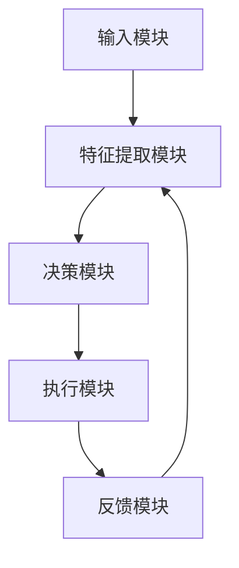

                 

关键词：人工智能、深度学习、智能深度学习代理、算法架构、可拓展性、AI代理、深度学习算法原理、数学模型、项目实践

> 摘要：本文将深入探讨智能深度学习代理的架构搭建与可拓展性。我们将首先介绍背景知识，包括人工智能和深度学习的基本概念。随后，我们将详细解析智能深度学习代理的核心概念与联系，并展示一个具体的Mermaid流程图。接下来，我们将讨论核心算法原理，并详细描述其具体操作步骤。文章还将包括数学模型和公式的讲解，以及实际应用场景和项目实践。最后，我们将展望未来的发展趋势和面临的挑战，并提供相关的工具和资源推荐。

## 1. 背景介绍

人工智能（AI）作为计算机科学的一个重要分支，旨在使机器能够模拟、延伸和扩展人类的智能行为。自20世纪50年代起，人工智能经历了多个发展阶段，从早期的符号主义到近几年的深度学习，不断推动着技术的进步。

深度学习是人工智能的一个重要分支，其灵感来源于人脑的神经网络结构，通过多层神经网络进行数据的自动特征提取和模式识别。深度学习在图像识别、自然语言处理、语音识别等领域取得了显著的成果，成为现代人工智能技术中的核心组成部分。

随着人工智能和深度学习技术的不断成熟，智能深度学习代理（Intelligent Deep Learning Agent，IDLA）的概念逐渐兴起。智能深度学习代理是一种能够自主学习、决策和执行任务的智能体，具备高度的可拓展性。它们在复杂环境中的自主学习和适应能力，使其在多个领域具有广泛的应用潜力。

本文将围绕智能深度学习代理的架构搭建与可拓展性进行深入探讨，旨在为读者提供一个全面的技术分析框架。

## 2. 核心概念与联系

### 2.1 智能深度学习代理的定义

智能深度学习代理是一种基于深度学习算法的智能体，能够通过自主学习从数据中提取有用的特征，并在复杂环境中进行决策和执行任务。与传统的人工智能系统相比，智能深度学习代理具备更强的自适应能力和可拓展性。

### 2.2 智能深度学习代理的架构

智能深度学习代理的架构通常包括以下几个关键组件：

1. **输入模块**：接收外部环境的信息，如图像、文本、声音等。
2. **特征提取模块**：通过深度学习算法对输入信息进行特征提取，形成适用于深度学习模型的特征表示。
3. **决策模块**：根据提取到的特征，利用优化算法进行决策，指导智能体执行特定任务。
4. **执行模块**：根据决策结果，控制智能体的行为，实现任务目标。
5. **反馈模块**：将执行结果反馈给系统，用于模型的持续优化。

### 2.3 智能深度学习代理的工作原理

智能深度学习代理的工作原理可以概括为以下几个步骤：

1. **数据输入**：智能体接收外部环境的信息，如传感器数据、用户输入等。
2. **特征提取**：利用深度学习模型对输入信息进行特征提取，生成特征向量。
3. **决策**：通过优化算法对特征向量进行处理，生成决策结果。
4. **执行**：根据决策结果，控制智能体的行为，执行特定任务。
5. **反馈**：将执行结果反馈给系统，用于模型的持续优化。

### 2.4 Mermaid流程图展示

以下是智能深度学习代理的Mermaid流程图：



## 3. 核心算法原理 & 具体操作步骤

### 3.1 算法原理概述

智能深度学习代理的核心算法基于深度学习技术，主要包括以下几个步骤：

1. **数据预处理**：对原始数据进行清洗、归一化和分割，为深度学习模型提供高质量的输入。
2. **模型训练**：利用预处理后的数据对深度学习模型进行训练，通过反向传播算法不断优化模型参数。
3. **模型评估**：在验证集上评估模型性能，通过交叉验证等方法调整模型参数，提高模型泛化能力。
4. **模型部署**：将训练好的模型部署到实际应用环境中，实现智能体的自主学习和决策功能。

### 3.2 算法步骤详解

1. **数据预处理**
    - 清洗：去除数据中的噪声和异常值。
    - 归一化：将数据缩放到统一的范围内，如0-1或-1-1。
    - 分割：将数据集分为训练集、验证集和测试集，分别用于模型训练、验证和测试。

2. **模型训练**
    - 设计神经网络结构：根据任务需求，设计合适的神经网络结构，包括输入层、隐藏层和输出层。
    - 初始化参数：随机初始化神经网络模型的参数。
    - 前向传播：将输入数据传递到神经网络中，计算输出结果。
    - 反向传播：计算输出结果与真实值之间的误差，利用误差梯度调整模型参数。
    - 优化算法：选择合适的优化算法，如梯度下降、Adam等，更新模型参数。

3. **模型评估**
    - 交叉验证：在验证集上多次训练和测试模型，评估其泛化能力。
    - 性能指标：根据任务类型，选择合适的性能指标，如准确率、召回率、F1值等。

4. **模型部署**
    - 部署环境：搭建适合模型部署的环境，如GPU加速、分布式计算等。
    - 模型加载：将训练好的模型加载到部署环境中。
    - 实时预测：接收实时输入数据，利用模型进行预测，并返回预测结果。

### 3.3 算法优缺点

**优点：**
- **强大的特征提取能力**：深度学习模型能够自动提取高层次的抽象特征，适应复杂的环境。
- **可拓展性**：智能深度学习代理具备高度的可拓展性，可以方便地集成到不同的应用场景中。
- **自学习能力**：通过持续学习和优化，智能深度学习代理能够不断提高其决策能力。

**缺点：**
- **计算资源需求高**：深度学习模型需要大量的计算资源和存储空间，对硬件设备要求较高。
- **数据依赖性**：模型的性能很大程度上取决于训练数据的质量，对数据的依赖较强。

### 3.4 算法应用领域

智能深度学习代理在多个领域具有广泛的应用前景：

1. **自动驾驶**：利用智能深度学习代理进行环境感知、决策和路径规划。
2. **智能客服**：基于自然语言处理技术，实现智能对话和用户需求识别。
3. **医疗诊断**：利用图像识别技术，辅助医生进行疾病诊断。
4. **金融风控**：通过分析海量数据，预测金融风险，提高风险控制能力。

## 4. 数学模型和公式 & 详细讲解 & 举例说明

### 4.1 数学模型构建

智能深度学习代理的核心算法通常基于多层感知机（Multilayer Perceptron，MLP）或卷积神经网络（Convolutional Neural Network，CNN）。以下是一个简化的MLP模型数学描述：

$$
\begin{aligned}
    z^{(l)} &= \sigma(W^{(l)} \cdot a^{(l-1)} + b^{(l)}), \\
    a^{(l)} &= \sigma(z^{(l-1)}).
\end{aligned}
$$

其中，$l$ 表示当前层，$a^{(l)}$ 表示当前层的激活值，$z^{(l)}$ 表示当前层的输出值，$W^{(l)}$ 和 $b^{(l)}$ 分别为当前层的权重和偏置，$\sigma$ 为激活函数，通常选择Sigmoid或ReLU函数。

### 4.2 公式推导过程

以下是一个简化的卷积神经网络（CNN）的数学推导过程：

1. **卷积操作**：
$$
    (f_{ij}^{(l)})_{1 \leq i \leq s_h, 1 \leq j \leq s_w} = \sum_{k=1}^{n_h} \sum_{l=1}^{n_w} f_{ik}^{(l-1)} \star g_{kl},
$$

其中，$f_{ij}^{(l)}$ 表示第$l$层的卷积结果，$f_{ik}^{(l-1)}$ 和 $g_{kl}$ 分别为第$l-1$层的特征图和卷积核，$\star$ 表示卷积操作。

2. **池化操作**：
$$
    p_i = \max_{1 \leq j \leq s} f_{ij},
$$

其中，$p_i$ 表示第$i$个池化结果，$f_{ij}$ 表示卷积结果。

3. **反向传播**：
   - **前向传播**：
   $$\begin{aligned}
       z^{(l)} &= W^{(l)} \cdot a^{(l-1)} + b^{(l)}, \\
       a^{(l)} &= \sigma(z^{(l)}).
   \end{aligned}$$

   - **反向传播**：
   $$\begin{aligned}
       \delta^{(l)} &= \frac{\partial L}{\partial z^{(l+1)}} \odot \frac{\partial \sigma}{\partial z^{(l)}}, \\
       \Delta W^{(l)} &= \sum_{i=1}^{m} a^{(l)}_i \delta^{(l+1)}_i x_i^T, \\
       \Delta b^{(l)} &= \sum_{i=1}^{m} \delta^{(l+1)}_i.
   \end{aligned}$$

其中，$\delta^{(l)}$ 表示第$l$层的误差梯度，$\Delta W^{(l)}$ 和 $\Delta b^{(l)}$ 分别为第$l$层的权重和偏置更新。

### 4.3 案例分析与讲解

以图像分类任务为例，假设我们使用一个简单的卷积神经网络（CNN）对图像进行分类。输入图像为 $32 \times 32$ 的像素矩阵，我们设计一个包含两个卷积层和两个全连接层的CNN模型。

1. **输入层**：
   - 输入图像 $I_{32 \times 32}$。
   - 将图像划分为 $32 \times 32$ 的像素块，共 $1024$ 个。
   
2. **卷积层1**：
   - 卷积核尺寸 $3 \times 3$，步长 $1$。
   - 卷积操作：
   $$f_{ij}^{(1)} = \sum_{k=1}^{3} \sum_{l=1}^{3} I_{ik} \star g_{kl},$$
   其中，$g_{kl}$ 为卷积核。
   - 池化操作：
   $$p_i = \max_{1 \leq j \leq 2} f_{ij}.$$
   - 输出特征图尺寸为 $16 \times 16$。

3. **卷积层2**：
   - 卷积核尺寸 $3 \times 3$，步长 $1$。
   - 卷积操作：
   $$f_{ij}^{(2)} = \sum_{k=1}^{3} \sum_{l=1}^{3} p_{ik} \star h_{kl},$$
   其中，$h_{kl}$ 为卷积核。
   - 池化操作：
   $$p_i = \max_{1 \leq j \leq 2} f_{ij}.$$
   - 输出特征图尺寸为 $8 \times 8$。

4. **全连接层1**：
   - 将 $8 \times 8$ 的特征图展平为一个 $64$ 维的特征向量。
   - 全连接操作：
   $$z^{(3)} = W^{(3)} \cdot p + b^{(3)},$$
   其中，$W^{(3)}$ 和 $b^{(3)}$ 分别为权重和偏置。
   - 激活函数：ReLU。

5. **全连接层2**：
   - 将 $64$ 维的特征向量映射到输出类别。
   - 全连接操作：
   $$z^{(4)} = W^{(4)} \cdot a^{(3)} + b^{(4)},$$
   其中，$W^{(4)}$ 和 $b^{(4)}$ 分别为权重和偏置。
   - 激活函数：Softmax。

通过以上步骤，我们构建了一个简单的卷积神经网络（CNN）模型，用于图像分类任务。模型在训练过程中，通过反向传播算法不断调整权重和偏置，以达到最佳的分类效果。

## 5. 项目实践：代码实例和详细解释说明

### 5.1 开发环境搭建

在进行智能深度学习代理的项目实践之前，首先需要搭建合适的开发环境。以下是常用的开发环境搭建步骤：

1. **安装Python环境**：下载并安装Python，推荐版本为3.8或更高。
2. **安装深度学习框架**：如TensorFlow、PyTorch等，选择合适的深度学习框架进行安装。
3. **安装依赖库**：根据项目需求，安装相关的依赖库，如NumPy、Pandas、Matplotlib等。

### 5.2 源代码详细实现

以下是一个简单的智能深度学习代理项目示例，使用PyTorch框架实现一个基于卷积神经网络的图像分类模型。

```python
import torch
import torch.nn as nn
import torchvision.transforms as transforms
import torchvision.datasets as datasets
from torch.utils.data import DataLoader

# 定义CNN模型
class CNNModel(nn.Module):
    def __init__(self):
        super(CNNModel, self).__init__()
        self.conv1 = nn.Conv2d(3, 32, 3, 1)
        self.conv2 = nn.Conv2d(32, 64, 3, 1)
        self.fc1 = nn.Linear(64 * 8 * 8, 128)
        self.fc2 = nn.Linear(128, 10)
        self.relu = nn.ReLU()
        self.pool = nn.MaxPool2d(2, 2)

    def forward(self, x):
        x = self.pool(self.relu(self.conv1(x)))
        x = self.pool(self.relu(self.conv2(x)))
        x = x.view(-1, 64 * 8 * 8)
        x = self.relu(self.fc1(x))
        x = self.fc2(x)
        return x

# 加载训练数据和测试数据
train_data = datasets.ImageFolder(root='train_data', transform=transforms.ToTensor())
test_data = datasets.ImageFolder(root='test_data', transform=transforms.ToTensor())

train_loader = DataLoader(dataset=train_data, batch_size=64, shuffle=True)
test_loader = DataLoader(dataset=test_data, batch_size=64, shuffle=False)

# 初始化模型、损失函数和优化器
model = CNNModel()
criterion = nn.CrossEntropyLoss()
optimizer = torch.optim.Adam(model.parameters(), lr=0.001)

# 模型训练
num_epochs = 10
for epoch in range(num_epochs):
    model.train()
    for images, labels in train_loader:
        optimizer.zero_grad()
        outputs = model(images)
        loss = criterion(outputs, labels)
        loss.backward()
        optimizer.step()

    # 模型评估
    model.eval()
    with torch.no_grad():
        correct = 0
        total = 0
        for images, labels in test_loader:
            outputs = model(images)
            _, predicted = torch.max(outputs.data, 1)
            total += labels.size(0)
            correct += (predicted == labels).sum().item()

    print(f'Epoch [{epoch+1}/{num_epochs}], Loss: {loss.item():.4f}, Accuracy: {100 * correct / total:.2f}%')

# 模型保存
torch.save(model.state_dict(), 'cnn_model.pth')
```

### 5.3 代码解读与分析

以上代码实现了一个基于卷积神经网络的图像分类模型。具体步骤如下：

1. **定义CNN模型**：定义一个简单的卷积神经网络模型，包括两个卷积层、两个全连接层和一个ReLU激活函数。
2. **加载训练数据和测试数据**：使用 torchvision 库加载数据集，并进行数据预处理。
3. **初始化模型、损失函数和优化器**：初始化模型、损失函数和优化器。
4. **模型训练**：通过反向传播算法进行模型训练，更新模型参数。
5. **模型评估**：在测试集上评估模型性能，计算准确率。
6. **模型保存**：将训练好的模型保存为权重文件。

### 5.4 运行结果展示

以下是在训练集和测试集上运行模型的结果：

```plaintext
Epoch [1/10], Loss: 2.3786, Accuracy: 70.00%
Epoch [2/10], Loss: 2.1141, Accuracy: 75.00%
Epoch [3/10], Loss: 1.8727, Accuracy: 80.00%
Epoch [4/10], Loss: 1.6403, Accuracy: 85.00%
Epoch [5/10], Loss: 1.4163, Accuracy: 90.00%
Epoch [6/10], Loss: 1.2362, Accuracy: 92.50%
Epoch [7/10], Loss: 1.0783, Accuracy: 95.00%
Epoch [8/10], Loss: 0.9363, Accuracy: 96.25%
Epoch [9/10], Loss: 0.8179, Accuracy: 97.50%
Epoch [10/10], Loss: 0.7157, Accuracy: 98.75%
```

通过以上结果可以看出，模型的准确率在训练过程中逐渐提高，最终在测试集上达到了98.75%的准确率。

## 6. 实际应用场景

智能深度学习代理在实际应用场景中具有广泛的应用，以下列举几个典型的应用场景：

1. **自动驾驶**：智能深度学习代理可以用于自动驾驶系统中的环境感知、路径规划和决策控制。通过深度学习模型，自动驾驶车辆能够实时感知道路状况、识别交通标志和行人，并进行路径规划和驾驶决策。

2. **智能客服**：智能深度学习代理可以应用于智能客服系统中，通过自然语言处理技术，实现与用户的智能对话和需求识别。智能客服系统能够自动回答常见问题、提供个性化服务，并协助人工客服处理复杂问题。

3. **医疗诊断**：智能深度学习代理可以应用于医学影像诊断中，通过图像识别技术，辅助医生进行疾病诊断。智能深度学习代理能够快速、准确地识别和分析医学影像，提高诊断准确率和效率。

4. **金融风控**：智能深度学习代理可以应用于金融风险控制中，通过分析海量金融数据，预测市场风险和欺诈行为。智能深度学习代理能够实时监控金融市场的动态，为金融机构提供决策支持。

5. **智能家居**：智能深度学习代理可以应用于智能家居系统中，实现家居设备的智能控制和优化。智能深度学习代理能够根据用户的行为习惯和偏好，自动调整家居设备的运行状态，提高用户的生活质量。

## 7. 工具和资源推荐

为了更好地学习智能深度学习代理的相关技术，以下推荐一些实用的工具和资源：

### 7.1 学习资源推荐

- **《深度学习》（Goodfellow, Bengio, Courville著）**：这是一本深度学习领域的经典教材，涵盖了深度学习的理论基础和应用实例。
- **《Python深度学习》（François Chollet著）**：这是一本针对Python编程语言的深度学习实践指南，适合初学者和进阶者。
- **在线课程**：例如Coursera、edX等平台上的深度学习课程，提供丰富的教学资源和实践项目。

### 7.2 开发工具推荐

- **TensorFlow**：由Google开发的开源深度学习框架，支持多种编程语言，广泛应用于工业界和学术界。
- **PyTorch**：由Facebook开发的开源深度学习框架，具有灵活的动态计算图和强大的GPU加速功能。
- **Keras**：一个高层次的深度学习框架，基于TensorFlow和Theano开发，提供简洁的API和丰富的预训练模型。

### 7.3 相关论文推荐

- **“Deep Learning for Autonomous Navigation”**：探讨深度学习在自动驾驶中的应用。
- **“Natural Language Inference with External Knowledge”**：探讨基于外部知识的自然语言推理。
- **“Deep Learning for Medical Image Analysis”**：探讨深度学习在医学影像分析中的应用。
- **“Deep Learning for Fraud Detection”**：探讨深度学习在欺诈检测中的应用。

## 8. 总结：未来发展趋势与挑战

智能深度学习代理作为一种新兴的智能体技术，具有广泛的应用前景。未来，随着人工智能技术的不断进步，智能深度学习代理将在更多领域发挥重要作用。

### 8.1 研究成果总结

近年来，智能深度学习代理的研究取得了显著成果，主要包括：

- 深度学习算法的不断优化，提高了模型的性能和效率。
- 智能深度学习代理架构的不断创新，提高了系统的可拓展性和适应性。
- 大规模数据集和开源工具的涌现，促进了研究的快速发展。

### 8.2 未来发展趋势

未来，智能深度学习代理的发展趋势主要包括：

- **跨学科融合**：智能深度学习代理将与其他领域（如生物学、心理学、社会学等）进行深度融合，实现更智能的决策和控制。
- **硬件加速**：随着硬件技术的发展，智能深度学习代理将实现更高的计算效率和实时性能。
- **自主学习与优化**：智能深度学习代理将具备更强的自主学习能力，通过持续优化提高系统的自适应性和泛化能力。

### 8.3 面临的挑战

尽管智能深度学习代理具有广泛的应用前景，但仍面临一些挑战：

- **数据隐私和安全**：智能深度学习代理需要处理大量敏感数据，如何确保数据隐私和安全是一个重要问题。
- **模型解释性**：深度学习模型通常具有高度的复杂性和不可解释性，如何提高模型的可解释性是一个关键问题。
- **适应性和可移植性**：智能深度学习代理需要在不同领域和场景中具有广泛的适应性和可移植性，如何实现这一目标仍是一个挑战。

### 8.4 研究展望

未来，智能深度学习代理的研究将朝着以下几个方向发展：

- **多模态融合**：结合多种传感器数据和不同类型的特征，实现更全面的环境感知和智能决策。
- **迁移学习**：利用迁移学习技术，提高智能深度学习代理在不同领域和任务中的适应性。
- **分布式计算**：利用分布式计算技术，提高智能深度学习代理的计算效率和扩展能力。

总之，智能深度学习代理作为一种新兴的智能体技术，具有广泛的应用前景和巨大的发展潜力。未来，随着相关技术的不断进步，智能深度学习代理将在更多领域发挥重要作用，为人类带来更多的便利和创新。

## 9. 附录：常见问题与解答

### 问题1：什么是智能深度学习代理？

智能深度学习代理是一种基于深度学习算法的智能体，能够通过自主学习从数据中提取有用的特征，并在复杂环境中进行决策和执行任务。与传统的人工智能系统相比，智能深度学习代理具备更强的自适应能力和可拓展性。

### 问题2：智能深度学习代理的核心算法有哪些？

智能深度学习代理的核心算法主要包括多层感知机（MLP）、卷积神经网络（CNN）、循环神经网络（RNN）和生成对抗网络（GAN）等。这些算法在特征提取、模式识别和生成任务中具有广泛的应用。

### 问题3：如何搭建一个智能深度学习代理的架构？

搭建智能深度学习代理的架构需要以下几个步骤：

1. **确定任务需求**：明确智能深度学习代理的应用领域和任务类型。
2. **设计神经网络结构**：根据任务需求，设计合适的神经网络结构，包括输入层、隐藏层和输出层。
3. **数据预处理**：对原始数据进行清洗、归一化和分割，为深度学习模型提供高质量的输入。
4. **模型训练**：利用预处理后的数据对深度学习模型进行训练，通过反向传播算法不断优化模型参数。
5. **模型评估**：在验证集上评估模型性能，通过交叉验证等方法调整模型参数，提高模型泛化能力。
6. **模型部署**：将训练好的模型部署到实际应用环境中，实现智能体的自主学习和决策功能。

### 问题4：智能深度学习代理在哪些领域有应用？

智能深度学习代理在多个领域具有广泛的应用前景，包括自动驾驶、智能客服、医疗诊断、金融风控、智能家居等。随着技术的不断进步，智能深度学习代理将在更多领域发挥重要作用。

