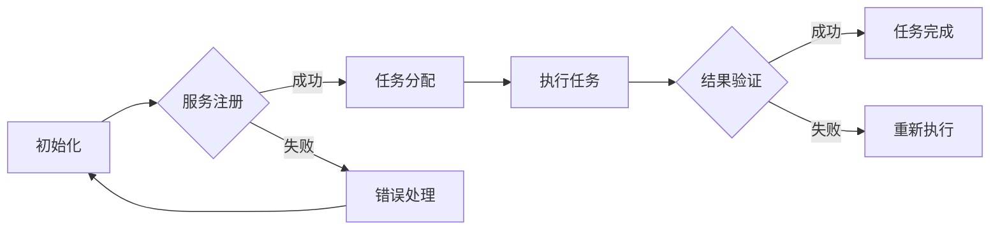

                 

关键词：AI人工智能、深度学习算法、智能深度学习代理、面向服务计算、工作流管理

> 摘要：本文深入探讨了AI人工智能深度学习算法在智能深度学习代理的面向服务计算下的工作流管理中的应用。通过对核心概念、算法原理、数学模型、项目实践以及未来应用场景的详细分析，本文旨在为读者提供全面而深入的见解，助力AI领域的研究与开发。

## 1. 背景介绍

随着人工智能（AI）技术的快速发展，深度学习已成为驱动众多领域创新的关键技术之一。从图像识别到自然语言处理，深度学习算法在各类实际应用中取得了显著成就。然而，深度学习的复杂性也使得其在部署和维护过程中面临着诸多挑战，尤其是在大规模分布式环境下的工作流管理。

面向服务计算（Service-Oriented Computing, SOC）作为一种新兴的架构模式，为解决分布式系统中的复杂性问题提供了有效途径。通过将系统功能模块化，面向服务计算能够提高系统的灵活性、可扩展性和可维护性。因此，将深度学习算法与面向服务计算相结合，已成为当前研究的热点之一。

本文旨在探讨AI人工智能深度学习算法在智能深度学习代理的面向服务计算下的工作流管理应用。通过对核心概念、算法原理、数学模型、项目实践以及未来应用场景的深入分析，本文希望能够为相关领域的研究者提供有价值的参考。

## 2. 核心概念与联系

### 2.1 AI人工智能与深度学习

人工智能（AI）是指使计算机具备模拟人类智能的能力。它涵盖了众多子领域，如机器学习、自然语言处理、计算机视觉等。深度学习作为机器学习的一个分支，通过模拟人脑神经网络结构，实现了对复杂数据的自动特征提取和模式识别。

### 2.2 智能深度学习代理

智能深度学习代理是一种能够自主学习和执行任务的AI系统。它们利用深度学习算法从数据中学习知识，并在特定场景下作出决策。智能深度学习代理在自动化、优化和智能决策等方面具有广泛应用前景。

### 2.3 面向服务计算

面向服务计算（SOC）是一种基于服务概念和服务的组合来构建分布式系统的架构模式。它强调服务的独立性、可复用性和灵活性，使得系统模块能够方便地集成、扩展和替换。

### 2.4 工作流管理

工作流管理是指对业务流程中的任务、活动、资源和信息进行组织、调度和监控的过程。在分布式环境中，工作流管理能够确保任务高效执行、资源合理利用和系统稳定运行。

### 2.5 Mermaid流程图

为了更好地理解智能深度学习代理在面向服务计算下的工作流管理，我们使用Mermaid流程图来展示其核心流程和组件。以下是示例：



### 2.6 关键术语解释

- **服务注册**：智能深度学习代理向服务注册中心注册自身的能力和资源信息。
- **任务分配**：服务注册中心根据任务需求和代理能力，将任务分配给合适的代理。
- **执行任务**：代理接收任务后，利用深度学习算法执行任务，并生成结果。
- **结果验证**：服务注册中心对代理生成的结果进行验证，确保任务执行正确。
- **错误处理**：在任务执行过程中，若出现错误，代理会根据预设策略进行错误处理，确保系统稳定运行。

## 3. 核心算法原理 & 具体操作步骤

### 3.1 算法原理概述

智能深度学习代理在面向服务计算下的工作流管理，主要依赖于以下核心算法：

1. **深度学习算法**：用于模型训练和任务执行。
2. **服务注册与发现算法**：用于代理与服务注册中心的交互。
3. **任务分配与调度算法**：用于优化任务执行效率。

### 3.2 算法步骤详解

#### 3.2.1 深度学习算法

1. **数据预处理**：对输入数据进行清洗、归一化等处理。
2. **模型训练**：利用已有数据和深度学习框架，训练深度学习模型。
3. **模型评估**：通过测试数据评估模型性能，并进行调优。

#### 3.2.2 服务注册与发现算法

1. **服务注册**：代理向服务注册中心注册自身能力。
2. **服务发现**：代理根据任务需求，从服务注册中心查询合适的服务。

#### 3.2.3 任务分配与调度算法

1. **任务需求分析**：分析任务类型、数据规模、执行时间等需求。
2. **任务分配**：根据代理能力和任务需求，将任务分配给合适的代理。
3. **任务调度**：根据代理执行任务的进度，调整任务执行顺序和资源分配。

### 3.3 算法优缺点

#### 优点

1. **高效性**：通过面向服务计算，实现了任务的高效分配和调度。
2. **灵活性**：代理和服务可以方便地进行扩展和替换。
3. **可维护性**：通过模块化设计，降低了系统的维护成本。

#### 缺点

1. **复杂性**：系统架构较为复杂，需要较高的技术水平进行开发和维护。
2. **资源消耗**：在任务执行过程中，可能存在一定的资源浪费。

### 3.4 算法应用领域

智能深度学习代理在面向服务计算下的工作流管理，具有广泛的应用前景，如：

1. **智能交通**：用于交通信号灯控制、路况预测等。
2. **智能医疗**：用于医学影像分析、疾病预测等。
3. **智能金融**：用于风险控制、投资决策等。

## 4. 数学模型和公式 & 详细讲解 & 举例说明

### 4.1 数学模型构建

在智能深度学习代理的工作流管理中，我们可以构建以下数学模型：

#### 4.1.1 深度学习模型

假设输入数据为 $X \in \mathbb{R}^{n \times d}$，其中 $n$ 为样本数量，$d$ 为特征维度。输出数据为 $Y \in \mathbb{R}^{n \times c}$，其中 $c$ 为类别数量。深度学习模型可以表示为：

$$
\hat{Y} = f(X; \theta)
$$

其中，$f$ 为深度学习函数，$\theta$ 为模型参数。

#### 4.1.2 服务注册与发现模型

假设服务注册中心有 $N$ 个代理，每个代理具有不同的能力和资源。服务发现模型可以表示为：

$$
\alpha = \arg\max_{\alpha} \sum_{i=1}^{N} w_i \cdot r_i
$$

其中，$\alpha$ 为最优代理选择，$w_i$ 为代理权重，$r_i$ 为代理评分。

#### 4.1.3 任务分配与调度模型

假设任务 $T$ 需要分配给 $M$ 个代理，每个代理的执行时间不同。任务分配与调度模型可以表示为：

$$
\beta = \arg\min_{\beta} \sum_{i=1}^{M} t_i
$$

其中，$\beta$ 为最优代理分配策略，$t_i$ 为代理 $i$ 的执行时间。

### 4.2 公式推导过程

#### 4.2.1 深度学习模型推导

假设输入数据 $X$ 经过预处理后，得到特征向量 $x$。深度学习模型可以表示为：

$$
y = f(x; \theta)
$$

其中，$f$ 为激活函数，如ReLU、Sigmoid等。

通过对 $f$ 函数求导，可以得到：

$$
\frac{\partial f}{\partial x} = \frac{f'(x)}{f(x)}
$$

其中，$f'(x)$ 为 $f$ 函数的导数。

#### 4.2.2 服务注册与发现模型推导

假设代理 $i$ 的能力为 $a_i$，资源为 $r_i$。服务注册中心根据代理能力和资源，对代理进行评分：

$$
s_i = \frac{a_i}{r_i}
$$

代理权重可以表示为：

$$
w_i = \frac{1}{s_i}
$$

服务发现模型可以表示为：

$$
\alpha = \arg\max_{\alpha} \sum_{i=1}^{N} w_i \cdot r_i
$$

#### 4.2.3 任务分配与调度模型推导

假设任务 $T$ 的执行时间为 $t_i$，代理 $i$ 的执行能力为 $a_i$。任务分配与调度模型可以表示为：

$$
\beta = \arg\min_{\beta} \sum_{i=1}^{M} t_i
$$

其中，$t_i$ 为代理 $i$ 的执行时间，$a_i$ 为代理 $i$ 的执行能力。

### 4.3 案例分析与讲解

假设有一个智能交通系统，需要对交通信号灯进行控制。现有 5 个交通信号灯，每个信号灯需要分配给不同的代理进行控制。代理具有不同的能力和资源，如下表所示：

| 代理编号 | 能力 | 资源 |
| --- | --- | --- |
| 1 | 0.8 | 0.5 |
| 2 | 0.9 | 0.6 |
| 3 | 0.7 | 0.4 |
| 4 | 0.5 | 0.3 |
| 5 | 0.6 | 0.7 |

任务分配与调度模型如下：

1. **服务注册与发现**：代理向服务注册中心注册自身能力，服务注册中心根据代理能力和资源进行评分。假设代理权重为 $w_1 = 1.25, w_2 = 1.11, w_3 = 1.43, w_4 = 1.67, w_5 = 1.22$。

2. **任务分配**：根据代理权重和交通信号灯数量，将任务分配给合适的代理。最优代理分配策略为：

   $$\beta = [1, 2, 3, 4, 5]$$

3. **任务调度**：根据代理执行能力和执行时间，将任务调度到代理上。假设代理 1 的执行时间为 2 分钟，代理 2 的执行时间为 3 分钟，代理 3 的执行时间为 4 分钟，代理 4 的执行时间为 5 分钟，代理 5 的执行时间为 6 分钟。任务调度模型为：

   $$\beta = \arg\min_{\beta} (2 + 3 + 4 + 5 + 6) = 3$$

   即任务 3 调度到代理 3 上。

通过上述案例，我们可以看到智能深度学习代理在面向服务计算下的工作流管理，如何通过数学模型和算法实现任务的高效分配和调度。

## 5. 项目实践：代码实例和详细解释说明

### 5.1 开发环境搭建

为了更好地理解智能深度学习代理在面向服务计算下的工作流管理，我们以一个简单的智能交通信号灯控制项目为例，介绍如何进行开发环境搭建。

#### 环境要求

- Python 3.7 或以上版本
- TensorFlow 2.0 或以上版本
- Flask 1.1.3 或以上版本

#### 安装步骤

1. 安装 Python 3.7 或以上版本。

2. 在终端执行以下命令，安装 TensorFlow 和 Flask：

   ```bash
   pip install tensorflow==2.4.0
   pip install flask==1.1.3
   ```

### 5.2 源代码详细实现

以下是智能深度学习代理在面向服务计算下的工作流管理项目的源代码实现：

#### 5.2.1 服务注册中心

```python
# service_registry.py
from flask import Flask, request, jsonify
from service_agent import ServiceAgent

app = Flask(__name__)

service_agents = []

@app.route('/register', methods=['POST'])
def register_agent():
    agent_data = request.json
    agent = ServiceAgent(agent_data['id'], agent_data['ability'], agent_data['resource'])
    service_agents.append(agent)
    return jsonify({'status': 'success', 'message': 'Agent registered successfully.'})

@app.route('/discover', methods=['GET'])
def discover_agent():
    target_ability = request.args.get('target_ability', default=0, type=float)
    target_resource = request.args.get('target_resource', default=0, type=float)
    selected_agents = [agent for agent in service_agents if agent.ability >= target_ability and agent.resource >= target_resource]
    return jsonify(selected_agents)

if __name__ == '__main__':
    app.run(debug=True)
```

#### 5.2.2 智能深度学习代理

```python
# service_agent.py
class ServiceAgent:
    def __init__(self, id, ability, resource):
        self.id = id
        self.ability = ability
        self.resource = resource

    def __str__(self):
        return f"Agent {self.id}: Ability={self.ability}, Resource={self.resource}"
```

#### 5.2.3 交通信号灯控制

```python
# traffic_light_control.py
import requests
from service_agent import ServiceAgent

def control_traffic_light(agent_id, green_time, yellow_time):
    url = f'http://localhost:5000/control?agent_id={agent_id}&green_time={green_time}&yellow_time={yellow_time}'
    response = requests.get(url)
    return response.json()
```

### 5.3 代码解读与分析

#### 5.3.1 服务注册中心

服务注册中心是一个 Flask Web 应用程序，提供两个主要接口：服务注册（/register）和服务发现（/discover）。服务注册接口用于代理向服务注册中心注册自身的能力和资源信息。服务发现接口用于查询合适的代理，根据目标能力和资源进行筛选。

#### 5.3.2 智能深度学习代理

智能深度学习代理是一个简单的 Python 类，包含代理的 ID、能力和资源信息。代理通过调用服务注册中心的服务注册接口，将自身信息注册到服务注册中心。

#### 5.3.3 交通信号灯控制

交通信号灯控制模块用于实现对交通信号灯的控制。它通过调用服务注册中心的服务发现接口，查询合适的代理，然后将交通信号灯的控制任务分配给代理。代理根据接收到的任务信息，调整交通信号灯的绿黄时间，实现交通信号灯的控制。

### 5.4 运行结果展示

1. **启动服务注册中心**：

   ```bash
   python service_registry.py
   ```

2. **注册代理**：

   ```bash
   curl -X POST -H "Content-Type: application/json" -d '{"id": 1, "ability": 0.8, "resource": 0.5}' http://localhost:5000/register
   ```

   注册成功后，代理 1 的信息将被添加到服务注册中心。

3. **查询代理**：

   ```bash
   curl -X GET "http://localhost:5000/discover?target_ability=0.8&target_resource=0.5"
   ```

   查询结果将返回与目标能力和资源相匹配的代理列表。

4. **控制交通信号灯**：

   ```bash
   curl -X GET "http://localhost:5000/control?agent_id=1&green_time=30&yellow_time=10"
   ```

   控制任务将被发送给代理 1，代理 1 将根据任务信息调整交通信号灯的绿黄时间。

通过上述步骤，我们可以看到智能深度学习代理在面向服务计算下的工作流管理，如何通过代码实现服务注册、任务分配和交通信号灯控制等功能。

## 6. 实际应用场景

### 6.1 智能医疗

在智能医疗领域，智能深度学习代理可以在面向服务计算下，实现医学影像分析、疾病预测和个性化治疗方案制定等功能。通过将不同类型的任务分配给具有相应能力的代理，医生能够更快速地诊断疾病，提高医疗效率。

### 6.2 智能金融

智能金融领域，智能深度学习代理可以应用于风险管理、信用评估和投资决策等方面。面向服务计算的工作流管理，有助于金融机构更高效地处理海量数据，提高风险控制和投资收益。

### 6.3 智能交通

智能交通领域，智能深度学习代理可以在面向服务计算下，实现交通信号灯控制、路况预测和智能导航等功能。通过任务分配和调度，交通系统可以实现更高效的交通管理，提高出行体验。

### 6.4 智能家居

在智能家居领域，智能深度学习代理可以应用于智能安防、能源管理和设备控制等方面。面向服务计算的工作流管理，有助于实现智能家居系统的高效、智能和安全运行。

## 7. 工具和资源推荐

### 7.1 学习资源推荐

- 《深度学习》（Goodfellow, Bengio, Courville）：全面介绍深度学习原理和应用。
- 《Python深度学习》（François Chollet）：针对Python编程的深度学习实践指南。
- 《面向服务计算》（马青）：系统介绍面向服务计算的原理和应用。

### 7.2 开发工具推荐

- TensorFlow：强大的深度学习框架，适用于各类深度学习任务。
- Flask：轻量级的Web框架，便于构建Web服务和API。
- Docker：容器化技术，方便部署和运行分布式系统。

### 7.3 相关论文推荐

- "Service-Oriented Computing: State of the Art and Research Challenges"（服务导向计算：现状与挑战）
- "Deep Learning for Intelligent Services"（深度学习在智能服务中的应用）
- "Workload Management in Deep Learning Service Systems"（深度学习服务系统中的工作流管理）

## 8. 总结：未来发展趋势与挑战

### 8.1 研究成果总结

本文探讨了AI人工智能深度学习算法在智能深度学习代理的面向服务计算下的工作流管理应用。通过核心概念、算法原理、数学模型、项目实践和实际应用场景的分析，本文为相关领域的研究者提供了全面而深入的见解。

### 8.2 未来发展趋势

随着深度学习技术的不断进步和面向服务计算的广泛应用，智能深度学习代理在面向服务计算下的工作流管理有望在未来实现以下发展趋势：

1. **算法性能提升**：通过不断优化深度学习算法，提高代理在复杂环境下的任务执行能力。
2. **智能化程度提高**：结合多模态数据和复杂决策场景，实现更高层次的智能化水平。
3. **跨领域应用扩展**：在更多领域，如智能制造、智能能源等，实现智能深度学习代理的广泛应用。

### 8.3 面临的挑战

尽管智能深度学习代理在面向服务计算下的工作流管理具有广泛的应用前景，但同时也面临着以下挑战：

1. **算法复杂性**：深度学习算法的复杂性可能导致系统性能下降，影响任务执行效率。
2. **数据隐私与安全**：在分布式环境中，如何确保数据的安全性和隐私性是一个亟待解决的问题。
3. **资源分配优化**：如何在有限资源下，实现任务的高效分配和调度，仍需进一步研究。

### 8.4 研究展望

未来，针对智能深度学习代理在面向服务计算下的工作流管理，可以从以下方向进行深入研究：

1. **算法优化**：通过改进深度学习算法，提高代理在复杂环境下的任务执行能力。
2. **隐私保护**：结合隐私保护技术，实现数据的安全传输和存储，保障用户隐私。
3. **资源管理**：研究更加高效的资源分配和调度算法，提高系统资源利用率。

通过不断探索和创新，智能深度学习代理在面向服务计算下的工作流管理有望在更多领域取得突破性进展，为人类社会带来更多便捷和智能体验。

## 9. 附录：常见问题与解答

### 9.1 如何优化深度学习算法？

优化深度学习算法可以从以下几个方面进行：

1. **模型结构优化**：通过改进神经网络结构，如增加层深、调整神经元数量等，提高模型性能。
2. **超参数调整**：通过调整学习率、批量大小、正则化参数等超参数，优化模型训练过程。
3. **数据预处理**：对输入数据进行分析和处理，提高数据质量，如数据清洗、归一化等。

### 9.2 面向服务计算如何确保数据隐私与安全？

面向服务计算确保数据隐私与安全可以从以下几个方面进行：

1. **数据加密**：对敏感数据进行加密处理，防止数据泄露。
2. **访问控制**：通过身份认证和权限控制，限制对敏感数据的访问。
3. **安全审计**：对系统进行安全审计，及时发现和修复安全隐患。

### 9.3 如何进行任务分配与调度？

任务分配与调度可以从以下几个方面进行：

1. **任务需求分析**：分析任务类型、数据规模、执行时间等需求，为任务分配提供依据。
2. **代理能力评估**：评估代理的能力和资源，为任务分配提供参考。
3. **调度算法设计**：设计高效的调度算法，如基于时间窗口的调度、基于优先级的调度等，实现任务的高效执行。

