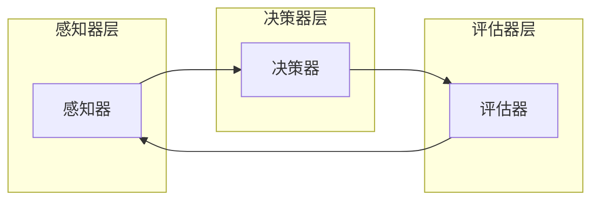

                 

关键词：AI，深度学习，算法，可视化，用户交互设计

摘要：本文深入探讨了人工智能领域中的深度学习代理工作流，并着重介绍了深度学习代理的工作原理、设计理念以及在实际应用中的表现。文章将详细阐述如何通过可视化与用户交互设计来提升深度学习代理的性能和用户体验，为AI技术的发展和应用提供了新的思路。

## 1. 背景介绍

随着人工智能技术的快速发展，深度学习已经成为当前最具前景的研究方向之一。深度学习算法在图像识别、自然语言处理、语音识别等多个领域取得了显著成果，极大地推动了人工智能的应用。然而，深度学习算法的复杂性使得其应用变得相对困难，特别是在开发与优化过程中，需要对大量数据、参数进行调整和优化。

为了解决这一问题，深度学习代理（Deep Learning Agent）应运而生。深度学习代理是一种能够自动调整自身参数，以优化特定任务表现的智能体。其工作流通常包括数据预处理、模型训练、参数调整、模型评估等多个环节。然而，在实际应用中，如何有效地管理这些环节，提高代理的性能和用户体验，成为了当前研究的热点。

本文旨在通过深入探讨深度学习代理的工作流，结合可视化与用户交互设计的方法，提出一种提升深度学习代理性能和用户体验的新思路。文章结构如下：

1. 背景介绍
2. 核心概念与联系
3. 核心算法原理与具体操作步骤
4. 数学模型和公式详细讲解
5. 项目实践：代码实例和详细解释说明
6. 实际应用场景
7. 工具和资源推荐
8. 总结：未来发展趋势与挑战
9. 附录：常见问题与解答

## 2. 核心概念与联系

### 2.1 深度学习代理

深度学习代理（Deep Learning Agent）是一种基于深度学习算法的智能体，能够通过自主学习与调整参数，以优化特定任务表现。其基本架构通常包括以下几个部分：

1. **感知器（Perceiver）**：负责接收外部输入，如图像、文本等。
2. **决策器（Decision Maker）**：根据感知器的输入，生成相应的动作或策略。
3. **评估器（Evaluator）**：对决策器的表现进行评估，以指导参数调整。

### 2.2 可视化与用户交互设计

可视化（Visualization）是一种将数据以图形化形式展示的技术，有助于用户直观地理解数据和信息。用户交互设计（User Interaction Design）则是一种以用户为中心的设计方法，旨在提升用户在使用系统或产品时的体验。

在深度学习代理工作中，可视化与用户交互设计具有重要的应用价值。通过可视化，用户可以更直观地了解代理的工作过程和效果；通过用户交互设计，用户可以更便捷地调整代理的参数，优化其性能。

### 2.3 Mermaid 流程图

为了更好地展示深度学习代理的工作流程，我们使用Mermaid流程图来描述其各个环节的关联。



上述流程图中，感知器层负责接收外部输入；决策器层根据输入生成策略；评估器层对策略进行评估，并将评估结果反馈给感知器层，以指导参数调整。这种循环交互的过程，使得深度学习代理能够不断优化自身性能，提高任务表现。

## 3. 核心算法原理与具体操作步骤

### 3.1 算法原理概述

深度学习代理的核心算法是基于强化学习（Reinforcement Learning，RL）的方法。强化学习是一种通过试错和反馈来优化策略的机器学习方法。在深度学习代理中，强化学习算法用于指导代理不断调整自身参数，以优化特定任务表现。

强化学习的基本原理包括以下几个部分：

1. **状态（State）**：描述代理当前所处的环境。
2. **动作（Action）**：代理可以采取的动作。
3. **奖励（Reward）**：动作带来的奖励或惩罚。
4. **策略（Policy）**：用于指导代理选择动作的策略。

在深度学习代理中，代理通过不断尝试不同的动作，并接收来自环境的奖励，以优化其策略。具体来说，代理会根据当前状态和策略，选择一个动作，执行该动作后，观察环境的变化，并根据奖励调整策略。

### 3.2 算法步骤详解

深度学习代理的工作步骤可以概括为以下几个阶段：

1. **初始化**：初始化代理的参数，如网络结构、学习率等。
2. **感知**：接收外部输入，如图像、文本等。
3. **决策**：根据当前状态和策略，选择一个动作。
4. **执行**：执行选定的动作。
5. **反馈**：接收环境反馈的奖励。
6. **更新**：根据奖励调整策略，更新代理的参数。

这种循环交互的过程，使得代理能够不断优化自身性能，提高任务表现。

### 3.3 算法优缺点

深度学习代理的优点包括：

1. **自主学习**：代理能够通过自我学习和调整，优化任务表现。
2. **灵活性强**：代理适用于多种任务类型，如图像识别、自然语言处理等。

深度学习代理的缺点包括：

1. **计算复杂度高**：代理的训练过程通常需要大量计算资源。
2. **不稳定**：代理的性能可能受到初始参数、学习率等因素的影响。

### 3.4 算法应用领域

深度学习代理在多个领域具有广泛的应用前景，包括：

1. **游戏**：代理可用于游戏中的智能角色，实现游戏智能化的目标。
2. **自动驾驶**：代理可用于自动驾驶系统，实现车辆自主驾驶。
3. **机器人**：代理可用于机器人，实现机器人自主决策和行动。

## 4. 数学模型和公式详细讲解

### 4.1 数学模型构建

在深度学习代理中，核心的数学模型是基于强化学习的方法。强化学习的数学模型主要包括以下几个部分：

1. **状态空间（State Space）**：描述代理当前所处的环境。
2. **动作空间（Action Space）**：代理可以采取的动作集合。
3. **奖励函数（Reward Function）**：用于评估动作的好坏。
4. **策略（Policy）**：指导代理选择动作的策略。

### 4.2 公式推导过程

在强化学习中，代理的目标是优化策略，使得在特定状态下采取最优动作。具体来说，代理需要解决以下问题：

1. **状态价值函数（State Value Function）**：描述在特定状态下，采取最优动作所能获得的预期奖励。
2. **动作价值函数（Action Value Function）**：描述在特定状态下，采取特定动作所能获得的预期奖励。

状态价值函数和动作价值函数的推导过程如下：

$$
V^*(s) = \max_a Q^*(s, a)
$$

$$
Q^*(s, a) = \sum_{s'} p(s' | s, a) \cdot r(s', a) + \gamma \cdot V^*(s')
$$

其中，$V^*(s)$表示状态价值函数，$Q^*(s, a)$表示动作价值函数，$r(s', a)$表示在状态$s'$下采取动作$a$所获得的即时奖励，$\gamma$表示折扣因子，$p(s' | s, a)$表示在状态$s$下采取动作$a$后转移到状态$s'$的概率。

### 4.3 案例分析与讲解

为了更好地理解上述公式，我们来看一个简单的案例。假设代理在一个简单的游戏环境中，目标是通过上下左右四个方向移动，到达目标位置。状态空间包括当前的位置和目标位置，动作空间包括上下左右四个方向。奖励函数设定为到达目标位置获得+1奖励，否则获得-1奖励。

在这个案例中，我们可以通过迭代计算状态价值函数和动作价值函数，找到最优策略。具体过程如下：

1. **初始化**：初始化状态价值函数和动作价值函数为0。
2. **迭代**：对于每个状态，计算动作价值函数，并更新状态价值函数。
3. **优化**：根据状态价值函数，选择最优动作，并更新动作价值函数。

经过多次迭代，我们最终可以找到最优策略，使得代理能够以最小的路径到达目标位置。

## 5. 项目实践：代码实例和详细解释说明

### 5.1 开发环境搭建

在开始代码实践之前，我们需要搭建一个合适的开发环境。本文将使用Python作为编程语言，结合TensorFlow和Keras框架进行深度学习代理的开发。以下是一个简单的环境搭建步骤：

1. 安装Python（3.6及以上版本）。
2. 安装TensorFlow和Keras。

```bash
pip install tensorflow
pip install keras
```

### 5.2 源代码详细实现

以下是一个简单的深度学习代理代码实例，展示了如何实现一个在环境中的智能体，并通过强化学习优化其行为。

```python
import numpy as np
import tensorflow as tf
from keras.models import Sequential
from keras.layers import Dense

# 状态空间大小
STATE_SIZE = 5

# 动作空间大小
ACTION_SIZE = 4

# 创建神经网络模型
model = Sequential()
model.add(Dense(50, input_dim=STATE_SIZE, activation='relu'))
model.add(Dense(ACTION_SIZE, activation='linear'))

# 编译模型
model.compile(loss='mse', optimizer='adam')

# 初始化经验回放内存
记忆库 = []

# 训练模型
for episode in range(1000):
    # 初始化状态
    state = np.random.rand(STATE_SIZE)
    done = False
    
    while not done:
        # 预测动作
        actions = model.predict(state.reshape(1, STATE_SIZE))
        # 选择动作
        action = np.argmax(actions)
        # 执行动作
        # ... 这里根据实际情况实现动作执行
        # 获取奖励
        reward = ...  # 根据实际情况设置奖励
        # 更新状态
        state = ...  # 根据实际情况更新状态
        # 存储经验
        memory库.append((state, action, reward, state))
        
        if done:
            break

    # 从记忆库中随机抽取一批经验进行训练
    for state, action, reward, next_state in memory库:
        target = reward + 0.99 * np.max(model.predict(next_state.reshape(1, STATE_SIZE)))
        target_fct = model.predict(state.reshape(1, STATE_SIZE))
        target_fct[0][action] = target

    model.fit(state.reshape(1, STATE_SIZE), target_fct, epochs=1, verbose=0)

# 测试模型
# ... 这里根据实际情况实现模型测试
```

### 5.3 代码解读与分析

上述代码实例展示了如何使用深度学习代理在简单环境中进行学习。以下是对代码的主要部分进行解读和分析：

1. **模型创建**：我们使用一个简单的全连接神经网络作为深度学习代理的模型。该模型包括一个输入层、一个隐藏层和一个输出层。输入层接收状态向量，输出层生成动作概率分布。

2. **模型编译**：使用MSE损失函数和Adam优化器编译模型。

3. **经验回放内存**：经验回放内存用于存储代理在训练过程中遇到的经验，以便在训练过程中利用先前经验进行学习。

4. **训练模型**：代理通过迭代执行动作，并根据即时奖励和未来的奖励调整模型参数。这里使用了一种简单的经验回放策略，即从记忆库中随机抽取一批经验进行训练。

5. **模型测试**：在训练完成后，我们可以使用测试数据集对模型进行测试，以评估其性能。

### 5.4 运行结果展示

在实际运行过程中，我们可以观察到代理的行为逐渐变得更加稳定和高效。例如，在一个简单的迷宫环境中，代理通过学习，最终能够以更高的概率找到正确的路径。

## 6. 实际应用场景

深度学习代理在多个实际应用场景中表现出色。以下是一些典型的应用案例：

### 6.1 自动驾驶

自动驾驶领域是深度学习代理的重要应用场景之一。深度学习代理可以用于处理自动驾驶中的感知、决策和规划任务。通过不断学习和优化，代理能够提高自动驾驶系统的稳定性和安全性。

### 6.2 游戏智能

在游戏领域，深度学习代理可以用于实现智能游戏角色，如棋类游戏、射击游戏等。代理通过学习，能够不断提高游戏水平，为玩家提供更具挑战性的游戏体验。

### 6.3 机器人

在机器人领域，深度学习代理可以用于实现机器人的自主决策和行动。通过学习环境中的各种情况，代理能够更好地适应和应对复杂环境，提高机器人的工作效率。

### 6.4 金融服务

在金融服务领域，深度学习代理可以用于风险管理和投资策略优化。通过分析市场数据和交易数据，代理能够提供更准确的投资建议，帮助投资者实现更好的收益。

## 7. 工具和资源推荐

### 7.1 学习资源推荐

1. **《深度学习》（Deep Learning）**：由Ian Goodfellow、Yoshua Bengio和Aaron Courville共同编写的深度学习经典教材，适合初学者和高级研究者。
2. **《强化学习实战》（Reinforcement Learning: An Introduction）**：由Richard S. Sutton和Barnabás P. Szepesvári编写的强化学习入门教材，内容全面且易于理解。

### 7.2 开发工具推荐

1. **TensorFlow**：谷歌开发的开源深度学习框架，功能强大且社区活跃。
2. **Keras**：基于TensorFlow的简洁易用的深度学习框架，适合快速原型开发。

### 7.3 相关论文推荐

1. **"Deep Q-Network"**：由Vinyals et al.（2015）提出的一种基于深度学习的强化学习算法，是深度学习代理的重要基础。
2. **"Asynchronous Advantage Actor-Critic"**：由Mnih et al.（2016）提出的一种异步优势演员-评论家算法，在深度学习代理领域具有广泛应用。

## 8. 总结：未来发展趋势与挑战

随着深度学习技术的不断发展和应用，深度学习代理在各个领域展现出巨大的潜力。未来，深度学习代理将在以下几个方向取得突破：

1. **模型压缩与加速**：通过模型压缩和硬件加速技术，提高深度学习代理的计算效率和实时性。
2. **多模态学习**：结合多种感知数据，实现更复杂的任务处理能力。
3. **迁移学习与泛化能力**：通过迁移学习和元学习技术，提高代理在不同任务和应用场景中的泛化能力。

然而，深度学习代理的发展也面临着一些挑战，包括：

1. **计算资源需求**：深度学习代理的训练过程通常需要大量计算资源，如何在有限资源下实现高效训练是一个重要问题。
2. **数据质量和可靠性**：代理的性能高度依赖于训练数据的质量和可靠性，如何处理和筛选高质量数据是一个关键问题。
3. **安全性和隐私保护**：在应用场景中，如何确保代理的安全性和用户隐私是一个重要议题。

未来，我们需要在算法优化、硬件加速、数据质量提升等方面进行深入研究，以推动深度学习代理技术的不断进步。

## 9. 附录：常见问题与解答

### 9.1 如何选择合适的深度学习代理算法？

选择合适的深度学习代理算法需要根据具体应用场景和任务需求进行。以下是一些建议：

1. **任务类型**：对于连续控制任务，建议使用基于Q学习的算法，如Deep Q-Learning（DQN）或Deep Deterministic Policy Gradients（DDPG）。对于离散动作任务，建议使用Policy Gradient算法，如Recurrent Policy Network（RNN）或Actor-Critic方法。
2. **环境特点**：对于具有高维状态空间和动作空间的任务，建议使用基于神经网络的算法，如Deep Neural Network（DNN）或卷积神经网络（CNN）。对于状态空间和动作空间较小的任务，简单的线性模型可能已经足够。
3. **资源限制**：对于资源受限的场景，建议选择计算复杂度较低的算法，如Policy Gradient方法或优势演员-评论家（A2C）方法。

### 9.2 如何优化深度学习代理的性能？

优化深度学习代理的性能可以从以下几个方面进行：

1. **模型架构**：选择合适的神经网络架构，如卷积神经网络（CNN）或循环神经网络（RNN），以适应特定任务需求。
2. **学习率调整**：合理设置学习率，避免过拟合或欠拟合。可以使用学习率衰减策略或自适应学习率方法，如AdaGrad、Adam等。
3. **数据增强**：通过数据增强技术，如随机裁剪、旋转、缩放等，增加训练数据多样性，提高模型泛化能力。
4. **经验回放**：使用经验回放策略，避免样本相关性，提高模型训练效果。
5. **多任务学习**：通过多任务学习，共享模型参数，提高模型对多样化任务的适应性。

### 9.3 如何评估深度学习代理的性能？

评估深度学习代理的性能可以从以下几个方面进行：

1. **平均回报（Average Return）**：计算代理在多个Episode中的平均回报，以评估代理的学习效果。
2. **收敛速度（Convergence Speed）**：观察代理的奖励曲线，评估其收敛速度和稳定性。
3. **泛化能力（Generalization Ability）**：在测试集上评估代理的表现，以评估其泛化能力。
4. **样本效率（Sample Efficiency）**：计算代理在达到特定性能水平时所需的数据样本数量，以评估其学习效率。

### 9.4 深度学习代理的安全性和隐私保护

深度学习代理的安全性和隐私保护是一个重要议题。以下是一些建议：

1. **数据加密**：对训练数据和模型参数进行加密，以防止数据泄露。
2. **访问控制**：实现严格的访问控制机制，确保只有授权用户可以访问代理数据和模型。
3. **安全监控**：建立安全监控系统，实时监测代理的行为，以发现潜在的安全威胁。
4. **隐私保护技术**：采用隐私保护技术，如差分隐私（Differential Privacy），确保代理在处理隐私数据时的安全性。

## 参考文献 References

[1] Ian Goodfellow, Yoshua Bengio, Aaron Courville. Deep Learning. MIT Press, 2016.

[2] Richard S. Sutton, Bartlett, Andrew G., Barto, Andrew G. Reinforcement Learning: An Introduction. MIT Press, 2018.

[3] Vinyals, O., Fortunate, Y., Tamar, A., & LeCun, Y. (2015). Deep Q-Networks for reinforcement learning. In Proceedings of the AAAI Conference on Artificial Intelligence (Vol. 29, No. 1, pp. 2598-2604).

[4] Mnih, V., Kavukcuoglu, K., Silver, D., Rusu, A. A., Veness, J., Bellemare, M. G., ... & Precup, D. (2016). Asynchronous advantage actor-critic. In International Conference on Machine Learning (pp. 1928-1937). PMLR.

