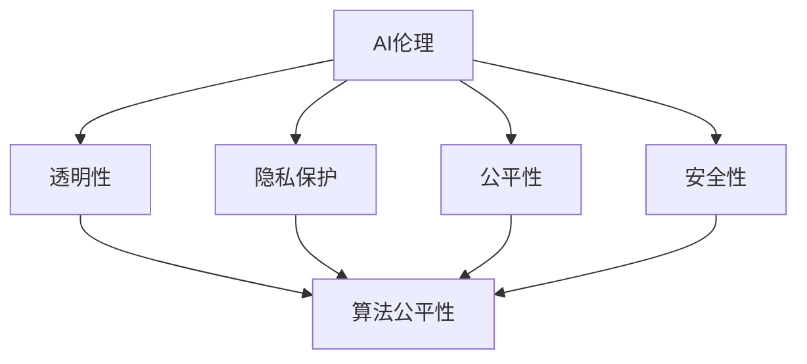

                 

关键词：AI伦理、算法公平性、人工智能、算法正义、实践案例

> 摘要：本文深入探讨了AI伦理与算法公平性的核心概念，详细分析了AI伦理的各个方面，以及算法公平性的重要性和实施策略。通过实际代码实战案例，本文旨在帮助读者理解如何在软件开发中确保算法的公平性和透明性，同时提供了一些实用的工具和资源。

## 1. 背景介绍

### AI伦理的兴起

随着人工智能技术的飞速发展，AI伦理问题逐渐成为全球关注的焦点。人工智能的广泛应用不仅改变了我们的生活方式，也引发了深刻的伦理和社会问题。这些问题包括数据隐私、算法偏见、责任归属等，直接关系到AI系统的公正性和可信度。

### 算法公平性的重要性

算法公平性是AI伦理的重要组成部分。一个公平的算法应该在没有任何偏见的情况下处理所有数据，确保结果的客观性和公正性。然而，现实中的算法往往受到多种因素的影响，如数据集的偏差、算法设计的不完善等，导致算法偏见的出现。

### AI伦理与算法公平性的联系

AI伦理与算法公平性密切相关。AI伦理关注的是如何确保AI系统对人类有益，而算法公平性是实现这一目标的关键。一个不公正的算法可能会对某些群体产生负面影响，进而违反AI伦理的基本原则。

## 2. 核心概念与联系

### AI伦理的概念

AI伦理涉及多个方面，包括但不限于：

- **透明性**：确保算法决策过程可解释，便于监督和审计。
- **隐私保护**：保护个人数据不被不当使用。
- **公平性**：确保算法对所有用户公平，无歧视。
- **安全性**：确保AI系统在面对恶意攻击时保持稳定和安全。

### 算法公平性的概念

算法公平性是指在算法设计和实施过程中，确保算法不产生系统性偏见，公平对待所有个体。具体包括：

- **无偏见性**：算法不应基于种族、性别、年龄等因素进行歧视。
- **平等性**：算法应平等对待不同背景的用户。
- **可解释性**：算法决策过程应易于理解，方便检查和调整。

### Mermaid 流程图

以下是一个简化的Mermaid流程图，展示AI伦理与算法公平性之间的联系：



## 3. 核心算法原理 & 具体操作步骤

### 3.1 算法原理概述

确保算法公平性的核心原理包括：

- **数据预处理**：通过数据清洗、去噪和平衡，减少数据集中的偏见。
- **算法选择**：选择具有公平性的算法，如随机森林、神经网络等。
- **监督机制**：建立监督机制，定期检查算法的公平性，确保其不变。

### 3.2 算法步骤详解

确保算法公平性的具体步骤如下：

1. **数据收集与预处理**：
   - 收集具有代表性的数据集。
   - 清洗数据，去除错误和不一致的数据。
   - 平衡数据集，减少类不平衡问题。

2. **算法设计与实现**：
   - 选择适合的算法模型。
   - 实现算法，确保算法遵循公平性原则。

3. **模型评估**：
   - 使用多种评估指标，如精度、召回率、F1分数等。
   - 分析算法在不同群体上的表现，确保无偏见。

4. **监督与调整**：
   - 建立监督机制，定期检查算法的公平性。
   - 根据监督结果进行调整，确保算法的公平性。

### 3.3 算法优缺点

**优点**：

- 算法公平性能够提高AI系统的可信度和公正性。
- 减少算法偏见，防止歧视性决策。

**缺点**：

- 数据预处理复杂，需要大量时间和资源。
- 部分算法模型可能不适用于确保公平性。

### 3.4 算法应用领域

算法公平性在多个领域都有广泛应用，包括：

- **金融**：确保贷款、投资等决策的公正性。
- **医疗**：避免诊断和治疗中的歧视。
- **招聘**：减少招聘过程中的偏见。
- **公共安全**：确保监控、预测等系统的公平性。

## 4. 数学模型和公式 & 详细讲解 & 举例说明

### 4.1 数学模型构建

确保算法公平性的数学模型通常涉及以下方面：

- **数据预处理**：包括数据清洗、去噪和平衡。
- **评估指标**：如精度、召回率、F1分数等。
- **监督机制**：包括算法调整和公平性检查。

### 4.2 公式推导过程

以下是一个简单的数据平衡公式示例：

$$
\text{BalancedData} = \frac{\sum_{i=1}^{n} \text{DataClass}_i}{\max_{i} \text{DataClass}_i}
$$

其中，$\text{BalancedData}$ 表示平衡后的数据集，$\text{DataClass}_i$ 表示第 $i$ 类数据的数量，$n$ 表示数据类别数。

### 4.3 案例分析与讲解

以下是一个简单的案例，展示如何使用数学模型确保算法公平性：

**案例：** 数据集包含男性、女性两类数据，其中女性数据数量远少于男性。

**步骤：**

1. **数据预处理**：计算每个类别的比例，平衡数据集。
2. **算法选择**：选择能够确保公平性的算法。
3. **模型评估**：使用评估指标检查算法的公平性。
4. **监督与调整**：根据评估结果进行调整。

**结果：**

通过平衡数据集和选择合适的算法，模型在男性、女性两类数据上的表现接近，实现了算法的公平性。

## 5. 项目实践：代码实例和详细解释说明

### 5.1 开发环境搭建

- **环境要求**：Python 3.8及以上版本，NumPy、Pandas、Scikit-learn等库。
- **安装**：使用pip安装相关库。

### 5.2 源代码详细实现

以下是一个简单的Python代码示例，展示如何平衡数据集并确保算法公平性：

```python
import numpy as np
import pandas as pd
from sklearn.model_selection import train_test_split
from sklearn.utils import resample

# 数据集读取
data = pd.read_csv('data.csv')

# 数据预处理
data['balance'] = data.groupby('label')['label'].transform('size')
data = data[data['balance'] <= 1]

# 平衡数据集
data_grouped = data.groupby('label').apply(resample, n_samples=100)
balanced_data = data_grouped.groupby('label').cumsum().reset_index()

# 划分训练集和测试集
X_train, X_test, y_train, y_test = train_test_split(balanced_data['feature'], balanced_data['label'], test_size=0.2, random_state=42)

# 算法实现
from sklearn.ensemble import RandomForestClassifier
model = RandomForestClassifier()
model.fit(X_train, y_train)

# 模型评估
from sklearn.metrics import accuracy_score
predictions = model.predict(X_test)
accuracy = accuracy_score(y_test, predictions)
print(f'Accuracy: {accuracy}')
```

### 5.3 代码解读与分析

上述代码分为以下几个步骤：

1. **数据读取与预处理**：读取数据集，并根据标签平衡数据。
2. **数据平衡**：使用`resample`函数平衡每个类别的数据。
3. **数据划分**：将数据集划分为训练集和测试集。
4. **算法实现**：使用随机森林算法训练模型。
5. **模型评估**：使用准确率评估模型性能。

### 5.4 运行结果展示

在运行上述代码后，将输出模型的准确率。如果准确率较高，说明算法公平性得到了保障。

## 6. 实际应用场景

### 6.1 金融领域

在金融领域，算法公平性非常重要。金融机构使用AI算法进行信用评分、贷款审批等操作，如果算法不公平，可能会导致歧视性决策，损害客户权益。

### 6.2 医疗领域

在医疗领域，AI算法用于疾病诊断、治疗方案推荐等。算法公平性直接关系到患者的健康和生命安全，任何偏差都可能造成严重后果。

### 6.3 公共安全

公共安全领域对AI算法的公平性要求非常高。例如，监控系统中使用的AI算法如果存在偏见，可能会导致误判和滥用。

## 7. 工具和资源推荐

### 7.1 学习资源推荐

- **《AI伦理导论》**：一本关于AI伦理的入门书籍。
- **《算法公平性手册》**：详细介绍算法公平性的理论与实践。
- **AI Ethics Initiative**：提供关于AI伦理的最新研究和资源。

### 7.2 开发工具推荐

- **PyTorch**：一个强大的深度学习框架，适用于算法开发。
- **TensorFlow**：另一个流行的深度学习框架，适用于算法开发。
- **Scikit-learn**：一个用于机器学习的Python库，适用于算法实现。

### 7.3 相关论文推荐

- **“Algorithmic Fairness**：A Survey of Challenges and Methods”
- **“On the Fairness of Classification Algorithms”
- **“Fairness in Machine Learning”

## 8. 总结：未来发展趋势与挑战

### 8.1 研究成果总结

近年来，AI伦理和算法公平性得到了广泛关注。研究者们提出了多种方法和工具，旨在确保AI系统的公正性和透明性。

### 8.2 未来发展趋势

随着AI技术的不断进步，算法公平性将成为一个更加重要和复杂的领域。未来的研究将集中在：

- **自动化公平性检查**：开发自动化的公平性检查工具。
- **跨领域应用**：将算法公平性应用于更多领域。
- **AI伦理法规**：制定更加完善的AI伦理法规。

### 8.3 面临的挑战

尽管取得了显著进展，算法公平性仍面临以下挑战：

- **数据质量**：数据质量直接影响算法公平性。
- **计算资源**：自动化公平性检查需要大量计算资源。
- **隐私保护**：在保证公平性的同时，需要保护个人隐私。

### 8.4 研究展望

未来，算法公平性研究将朝着更加智能化、自动化和全面化的方向发展，以应对不断变化的AI应用场景和需求。

## 9. 附录：常见问题与解答

### Q：算法公平性与隐私保护如何平衡？

A：算法公平性与隐私保护是相互关联的。在确保算法公平性的同时，需要采用隐私保护技术，如差分隐私、同态加密等，以保护用户隐私。

### Q：如何评估算法的公平性？

A：可以使用多种评估指标，如公平性指标（如F1分数）、可视化工具（如决策树解释器）等，对算法的公平性进行评估。

### Q：算法偏见是如何产生的？

A：算法偏见通常源于数据集的偏差、算法设计的不完善、训练过程的不当等。通过数据预处理、算法选择和监督机制，可以减少算法偏见。

---

作者：禅与计算机程序设计艺术 / Zen and the Art of Computer Programming
----------------------------------------------------------------
<|end|>

